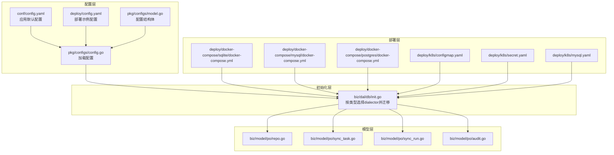
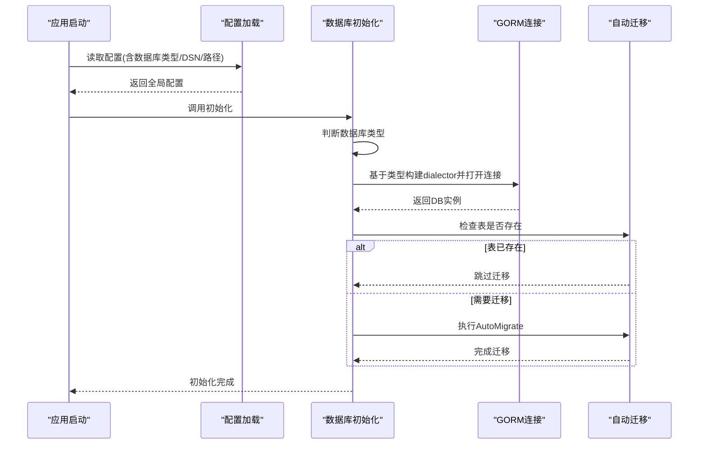
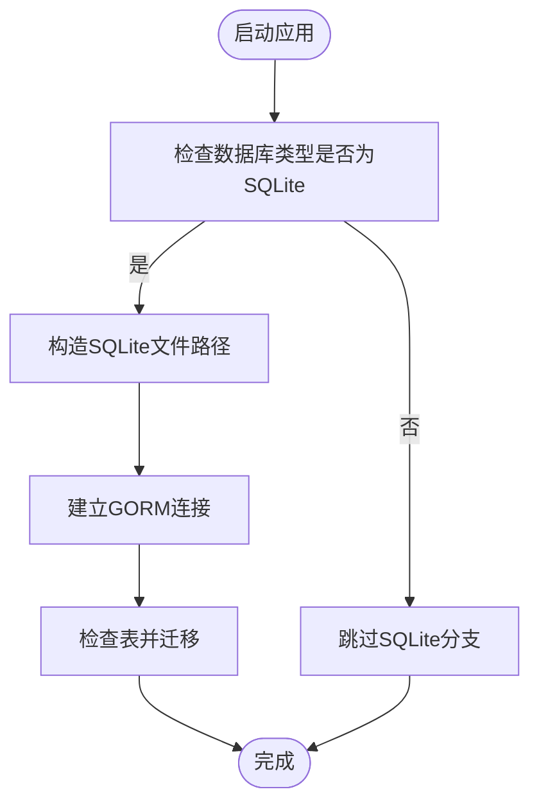
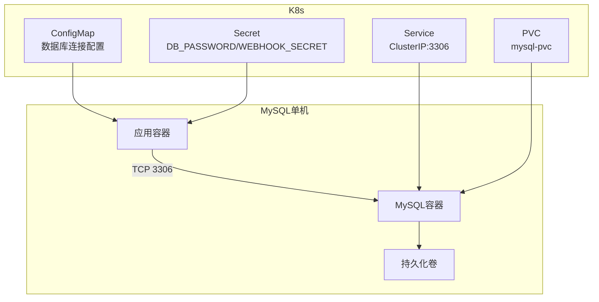
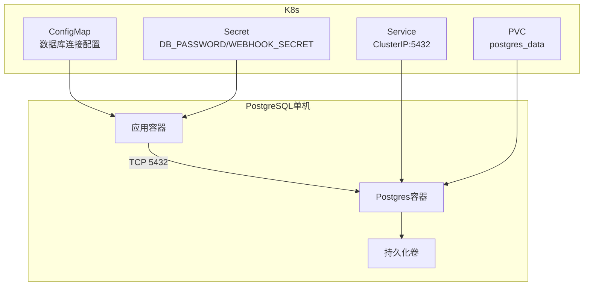
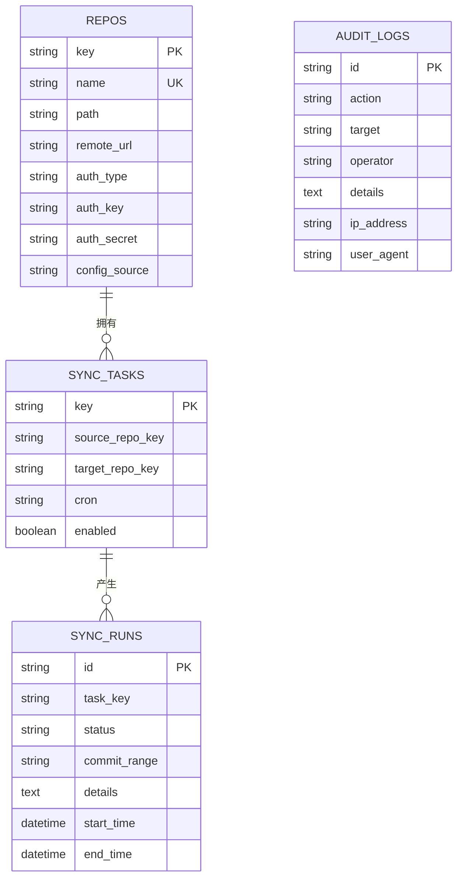
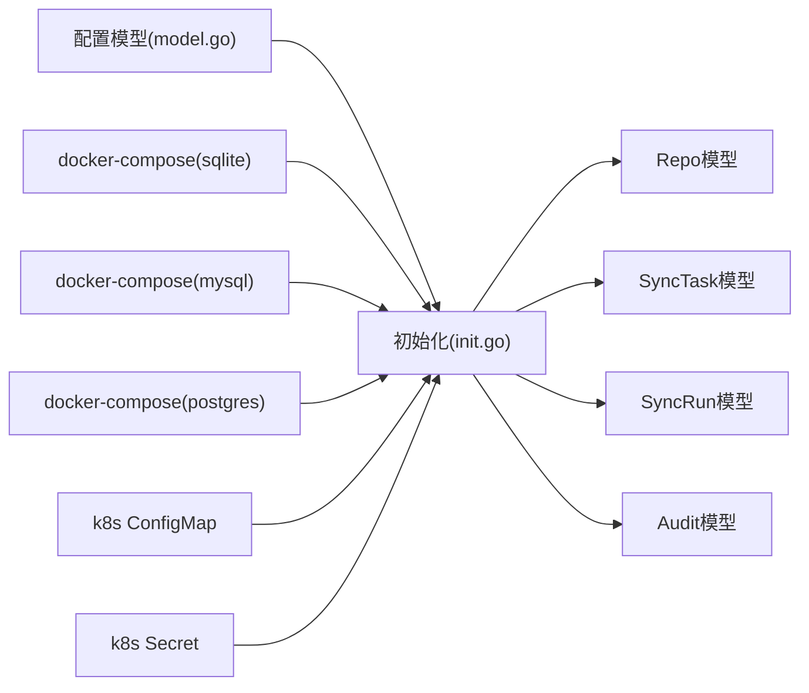

# 数据库部署

<cite>
**本文引用的文件**
- [conf/config.yaml](file://conf/config.yaml)
- [deploy/config.yaml](file://deploy/config.yaml)
- [pkg/configs/model.go](file://pkg/configs/model.go)
- [pkg/configs/config.go](file://pkg/configs/config.go)
- [biz/dal/db/init.go](file://biz/dal/db/init.go)
- [deploy/docker-compose/sqlite/docker-compose.yml](file://deploy/docker-compose/sqlite/docker-compose.yml)
- [deploy/docker-compose/mysql/docker-compose.yml](file://deploy/docker-compose/mysql/docker-compose.yml)
- [deploy/docker-compose/postgres/docker-compose.yml](file://deploy/docker-compose/postgres/docker-compose.yml)
- [deploy/k8s/configmap.yaml](file://deploy/k8s/configmap.yaml)
- [deploy/k8s/secret.yaml](file://deploy/k8s/secret.yaml)
- [deploy/k8s/mysql.yaml](file://deploy/k8s/mysql.yaml)
- [biz/model/po/repo.go](file://biz/model/po/repo.go)
- [biz/model/po/sync_task.go](file://biz/model/po/sync_task.go)
- [biz/model/po/sync_run.go](file://biz/model/po/sync_run.go)
- [biz/model/po/audit.go](file://biz/model/po/audit.go)
</cite>

## 目录
1. [简介](#简介)
2. [项目结构](#项目结构)
3. [核心组件](#核心组件)
4. [架构总览](#架构总览)
5. [详细组件分析](#详细组件分析)
6. [依赖分析](#依赖分析)
7. [性能考虑](#性能考虑)
8. [故障排查指南](#故障排查指南)
9. [结论](#结论)
10. [附录](#附录)

## 简介
本文件面向Git管理服务的数据库部署与运维，系统性说明三种数据库后端（SQLite、MySQL、PostgreSQL）的部署方案与配置差异；解释SQLite在单机场景下的优势与限制；阐述MySQL与PostgreSQL在主从复制、集群配置与性能优化方面的要点；覆盖连接池、事务管理与并发控制策略；提供数据库迁移、备份恢复与监控告警建议；明确数据安全、权限管理与审计日志配置；最后给出数据库选型标准与性能对比参考。

## 项目结构
围绕数据库部署的关键目录与文件如下：
- 配置层：应用通过统一配置模型加载数据库类型、主机、端口、用户、密码、库名或SQLite路径等参数。
- 初始化层：根据配置动态选择GORM方言（dialector），建立连接并执行自动迁移。
- 部署层：提供Docker Compose与Kubernetes三种后端的编排模板，便于快速落地。
- 模型层：定义业务表结构及生命周期钩子（如加密/解密），支撑审计与同步任务。

**图表来源**
- [pkg/configs/model.go](file://pkg/configs/model.go#L1-L34)
- [pkg/configs/config.go](file://pkg/configs/config.go#L1-L43)
- [conf/config.yaml](file://conf/config.yaml#L1-L25)
- [deploy/config.yaml](file://deploy/config.yaml#L1-L55)
- [biz/dal/db/init.go](file://biz/dal/db/init.go#L1-L72)
- [deploy/docker-compose/sqlite/docker-compose.yml](file://deploy/docker-compose/sqlite/docker-compose.yml#L1-L30)
- [deploy/docker-compose/mysql/docker-compose.yml](file://deploy/docker-compose/mysql/docker-compose.yml#L1-L50)
- [deploy/docker-compose/postgres/docker-compose.yml](file://deploy/docker-compose/postgres/docker-compose.yml#L1-L49)
- [deploy/k8s/configmap.yaml](file://deploy/k8s/configmap.yaml#L1-L20)
- [deploy/k8s/secret.yaml](file://deploy/k8s/secret.yaml#L1-L11)
- [deploy/k8s/mysql.yaml](file://deploy/k8s/mysql.yaml#L1-L65)
- [biz/model/po/repo.go](file://biz/model/po/repo.go#L1-L93)
- [biz/model/po/sync_task.go](file://biz/model/po/sync_task.go#L1-L29)
- [biz/model/po/sync_run.go](file://biz/model/po/sync_run.go#L1-L26)
- [biz/model/po/audit.go](file://biz/model/po/audit.go#L1-L21)

**章节来源**
- [pkg/configs/model.go](file://pkg/configs/model.go#L1-L34)
- [pkg/configs/config.go](file://pkg/configs/config.go#L1-L43)
- [conf/config.yaml](file://conf/config.yaml#L1-L25)
- [deploy/config.yaml](file://deploy/config.yaml#L1-L55)
- [biz/dal/db/init.go](file://biz/dal/db/init.go#L1-L72)

## 核心组件
- 配置模型：统一承载数据库类型、DSN、SQLite路径、主机/端口/用户/密码/库名等字段，支持环境变量覆盖。
- 初始化流程：依据配置选择MySQL/Postgres/SQLite方言，构造DSN或SQLite路径，建立GORM连接，并对核心PO进行自动迁移。
- 模型与安全：Repo模型在保存前对敏感字段加密、查询后解密；审计日志记录操作行为与详情，便于追踪。

**章节来源**
- [pkg/configs/model.go](file://pkg/configs/model.go#L18-L27)
- [pkg/configs/config.go](file://pkg/configs/config.go#L39-L42)
- [biz/dal/db/init.go](file://biz/dal/db/init.go#L24-L47)
- [biz/model/po/repo.go](file://biz/model/po/repo.go#L30-L62)
- [biz/model/po/audit.go](file://biz/model/po/audit.go#L7-L16)

## 架构总览
下图展示应用如何基于配置选择数据库后端并完成初始化与迁移：

**图表来源**
- [pkg/configs/config.go](file://pkg/configs/config.go#L18-L26)
- [biz/dal/db/init.go](file://biz/dal/db/init.go#L18-L71)

## 详细组件分析

### SQLite 文件数据库部署
- 单机优势
  - 零运维成本：无需独立数据库进程，容器内直接使用文件。
  - 部署简单：通过Docker Compose即可运行，适合开发测试与小规模生产。
  - 低延迟：本地文件I/O在单机场景下通常具备较低延迟。
- 局限性
  - 并发写入瓶颈：文件锁机制导致高并发写入时竞争激烈，可能成为性能瓶颈。
  - 备份复杂度：需要在应用层面或容器外进行一致性备份。
  - 缺乏内置复制/高可用：不支持原生主从或集群，扩展性受限。
- 部署要点
  - 使用Docker卷持久化数据目录，避免容器重建丢失数据。
  - 在生产中建议使用绝对路径，确保容器重启后仍可定位到正确位置。
  - 可通过环境变量覆盖数据库类型与路径，便于多环境切换。

**图表来源**
- [biz/dal/db/init.go](file://biz/dal/db/init.go#L39-L47)
- [deploy/docker-compose/sqlite/docker-compose.yml](file://deploy/docker-compose/sqlite/docker-compose.yml#L11-L20)

**章节来源**
- [deploy/docker-compose/sqlite/docker-compose.yml](file://deploy/docker-compose/sqlite/docker-compose.yml#L1-L30)
- [biz/dal/db/init.go](file://biz/dal/db/init.go#L39-L47)

### MySQL 部署与配置
- 单机部署
  - 使用Docker Compose一键拉起MySQL与应用容器，设置数据库名、用户与密码。
  - 数据持久化通过命名卷实现，容器重建不会丢失数据。
- 主从复制与集群
  - 主从复制：通过MySQL主从复制实现读扩展与灾备；需配置binlog、server-id、复制用户与IO线程。
  - 集群方案：可采用MySQL Group Replication或InnoDB Cluster实现高可用与自动故障转移。
- 性能优化
  - 参数调优：innodb_buffer_pool_size、innodb_log_file_size、innodb_flush_log_at_trx_commit等。
  - 连接池：合理设置最大连接数、空闲超时与超时阈值，避免连接泄漏。
  - 索引与SQL：为高频查询列建立索引，避免全表扫描；定期分析慢查询日志。
- Kubernetes部署
  - 使用ConfigMap注入数据库连接信息，使用Secret管理密码。
  - 通过PVC挂载持久化存储，暴露Service供应用访问。

**图表来源**
- [deploy/docker-compose/mysql/docker-compose.yml](file://deploy/docker-compose/mysql/docker-compose.yml#L28-L42)
- [deploy/k8s/configmap.yaml](file://deploy/k8s/configmap.yaml#L10-L15)
- [deploy/k8s/secret.yaml](file://deploy/k8s/secret.yaml#L8-L10)
- [deploy/k8s/mysql.yaml](file://deploy/k8s/mysql.yaml#L38-L41)

**章节来源**
- [deploy/docker-compose/mysql/docker-compose.yml](file://deploy/docker-compose/mysql/docker-compose.yml#L1-L50)
- [deploy/k8s/configmap.yaml](file://deploy/k8s/configmap.yaml#L1-L20)
- [deploy/k8s/secret.yaml](file://deploy/k8s/secret.yaml#L1-L11)
- [deploy/k8s/mysql.yaml](file://deploy/k8s/mysql.yaml#L1-L65)

### PostgreSQL 部署与配置
- 单机部署
  - 使用Docker Compose一键拉起Postgres与应用容器，设置用户名、密码与数据库名。
  - 数据持久化通过命名卷实现，容器重建不会丢失数据。
- 主从复制与集群
  - 流复制：基于WAL归档与恢复机制实现物理复制，适合读扩展与热备。
  - 高可用：Patroni + etcd或PostgreSQL自带的逻辑复制实现自动故障转移。
- 性能优化
  - 参数调优：shared_buffers、effective_cache_size、work_mem、maintenance_work_mem等。
  - 连接池：pgbouncer或应用侧连接池，结合连接复用与健康检查。
  - 统计信息与计划器：定期更新统计信息，启用并行查询（视负载而定）。
- Kubernetes部署
  - 与MySQL类似，通过ConfigMap与Secret注入配置，Service暴露端口，PVC持久化。

**图表来源**
- [deploy/docker-compose/postgres/docker-compose.yml](file://deploy/docker-compose/postgres/docker-compose.yml#L28-L41)
- [deploy/k8s/configmap.yaml](file://deploy/k8s/configmap.yaml#L10-L15)
- [deploy/k8s/secret.yaml](file://deploy/k8s/secret.yaml#L8-L10)
- [deploy/k8s/mysql.yaml](file://deploy/k8s/mysql.yaml#L56-L64)

**章节来源**
- [deploy/docker-compose/postgres/docker-compose.yml](file://deploy/docker-compose/postgres/docker-compose.yml#L1-L49)
- [deploy/k8s/configmap.yaml](file://deploy/k8s/configmap.yaml#L1-L20)
- [deploy/k8s/secret.yaml](file://deploy/k8s/secret.yaml#L1-L11)
- [deploy/k8s/mysql.yaml](file://deploy/k8s/mysql.yaml#L56-L64)

### 数据库连接池、事务管理与并发控制
- 连接池
  - 应用侧：在GORM基础上引入连接池参数（最大连接数、空闲连接数、连接生命周期），避免频繁创建销毁连接。
  - MySQL：可结合中间件（如ProxySQL）实现连接复用与SQL路由。
  - PostgreSQL：可使用pgbouncer作为连接池代理，提升并发与稳定性。
- 事务管理
  - 读写分离：将只读查询路由至从库，写操作路由至主库，降低主库压力。
  - 分布式事务：跨库事务建议采用Saga模式或TCC，避免强一致带来的性能损耗。
- 并发控制
  - 写冲突：对关键写入使用唯一约束与乐观锁版本号，失败重试。
  - 读一致性：根据业务需求选择合适隔离级别，避免脏读与幻读。

[本节为通用实践说明，未直接分析具体文件，故无“章节来源”]

### 数据迁移、备份恢复与监控告警
- 迁移
  - 应用启动时自动迁移核心表，若检测到表存在则跳过迁移，避免重复初始化。
- 备份
  - SQLite：停止服务后拷贝数据库文件，或使用在线备份工具；生产建议容器外定时快照。
  - MySQL：使用mysqldump或Percona XtraBackup进行全量+增量备份；开启binlog用于时间点恢复。
  - PostgreSQL：使用pg_dump/pg_restore或pgBackRest进行全量与增量备份；开启WAL归档。
- 恢复
  - 快速验证：在隔离环境中恢复备份进行功能与性能验证。
  - RTO/RPO：根据业务SLA设定备份频率与保留周期。
- 监控告警
  - 关键指标：连接数、QPS、慢查询、锁等待、磁盘空间、复制延迟（主从/集群）。
  - 告警策略：针对异常波动与阈值触发，结合自动化演练提升恢复效率。

**章节来源**
- [biz/dal/db/init.go](file://biz/dal/db/init.go#L54-L64)

### 数据安全、权限管理与审计日志
- 数据安全
  - 敏感字段加密：Repo模型在保存前对密钥与远程认证信息进行加密，查询后解密，防止明文落库。
  - 传输安全：生产环境建议启用SSL/TLS，避免明文传输。
- 权限管理
  - 最小权限原则：为应用账号授予必要权限，避免使用root或高权限账户。
  - 凭据管理：使用Secret或密钥管理服务（如Vault/KMS）集中管理数据库密码与Webhook密钥。
- 审计日志
  - 审计字段：记录操作类型、目标对象、操作者、IP地址、User-Agent与变更详情。
  - 存储与保留：审计日志建议单独表存储，设置合理的保留周期与归档策略。

**图表来源**
- [biz/model/po/repo.go](file://biz/model/po/repo.go#L11-L24)
- [biz/model/po/sync_task.go](file://biz/model/po/sync_task.go#L8-L24)
- [biz/model/po/sync_run.go](file://biz/model/po/sync_run.go#L9-L21)
- [biz/model/po/audit.go](file://biz/model/po/audit.go#L8-L16)

**章节来源**
- [biz/model/po/repo.go](file://biz/model/po/repo.go#L30-L62)
- [biz/model/po/audit.go](file://biz/model/po/audit.go#L7-L16)

### 不同数据库的选择标准与性能对比
- 选择标准
  - 数据规模与并发：小规模单机优先SQLite；中大型并发写入建议MySQL/PG。
  - 可用性要求：需要高可用与自动故障转移时倾向MySQL Group Replication或PostgreSQL集群。
  - 运维能力：团队对MySQL/PG更熟悉且有足够运维资源时优先两者；追求极简运维时选SQLite。
- 性能对比（概念性说明）
  - 写入吞吐：MySQL在InnoDB优化下通常具备较高写入性能；PG在复杂查询与并行处理方面表现突出。
  - 读扩展：两者均可通过主从复制实现读扩展；PG逻辑复制与MySQL Group Replication各有特点。
  - 资源占用：SQLite内存占用低、部署简单；MySQL/PG在大内存与高并发场景下需要更多资源。

[本节为通用对比说明，未直接分析具体文件，故无“章节来源”]

## 依赖分析
- 配置到初始化的耦合
  - 配置模型定义了数据库类型与连接参数，初始化模块依据类型选择对应dialector，耦合度低、扩展性强。
- 初始化到模型的依赖
  - 初始化模块在连接成功后执行自动迁移，依赖各PO的表定义与索引设计。
- 部署到配置的映射
  - Docker Compose与K8s模板通过环境变量/ConfigMap/Secret注入数据库连接信息，形成清晰的配置-部署映射关系。

**图表来源**
- [pkg/configs/model.go](file://pkg/configs/model.go#L18-L27)
- [biz/dal/db/init.go](file://biz/dal/db/init.go#L18-L47)
- [deploy/docker-compose/sqlite/docker-compose.yml](file://deploy/docker-compose/sqlite/docker-compose.yml#L11-L14)
- [deploy/docker-compose/mysql/docker-compose.yml](file://deploy/docker-compose/mysql/docker-compose.yml#L11-L18)
- [deploy/docker-compose/postgres/docker-compose.yml](file://deploy/docker-compose/postgres/docker-compose.yml#L11-L18)
- [deploy/k8s/configmap.yaml](file://deploy/k8s/configmap.yaml#L10-L15)
- [deploy/k8s/secret.yaml](file://deploy/k8s/secret.yaml#L8-L10)

**章节来源**
- [pkg/configs/model.go](file://pkg/configs/model.go#L1-L34)
- [biz/dal/db/init.go](file://biz/dal/db/init.go#L1-L72)
- [deploy/docker-compose/sqlite/docker-compose.yml](file://deploy/docker-compose/sqlite/docker-compose.yml#L1-L30)
- [deploy/docker-compose/mysql/docker-compose.yml](file://deploy/docker-compose/mysql/docker-compose.yml#L1-L50)
- [deploy/docker-compose/postgres/docker-compose.yml](file://deploy/docker-compose/postgres/docker-compose.yml#L1-L49)
- [deploy/k8s/configmap.yaml](file://deploy/k8s/configmap.yaml#L1-L20)
- [deploy/k8s/secret.yaml](file://deploy/k8s/secret.yaml#L1-L11)

## 性能考虑
- 连接池参数建议（通用）
  - 最大连接数：根据CPU核数与请求峰值估算，避免超过数据库上限。
  - 空闲超时：适中设置，平衡资源占用与连接复用。
  - 超时时间：SQL执行超时与连接获取超时需区分设置。
- 索引与查询优化
  - 为审计日志与同步任务的高频过滤字段建立索引，减少扫描范围。
  - 避免SELECT *，仅查询必要列。
- 并发写入
  - 对热点写入使用批量提交与幂等设计，降低锁竞争。
  - 使用唯一键约束与乐观锁版本号，减少冲突概率。

[本节为通用性能建议，未直接分析具体文件，故无“章节来源”]

## 故障排查指南
- 连接失败
  - 检查数据库类型与DSN/主机端口/用户密码是否匹配；确认网络连通与防火墙策略。
  - 查看初始化日志中的错误提示，定位具体环节。
- 迁移失败
  - 若表已存在但结构不匹配，先备份再评估是否允许破坏性迁移；否则手动修复或回滚。
- 性能问题
  - 使用慢查询日志与性能剖析工具定位瓶颈；结合索引与SQL改写优化。
- 安全问题
  - 确认凭据未硬编码在配置文件中；使用Secret管理敏感信息；启用传输加密。

**章节来源**
- [biz/dal/db/init.go](file://biz/dal/db/init.go#L50-L52)
- [pkg/configs/config.go](file://pkg/configs/config.go#L22-L24)

## 结论
本项目提供了统一的配置模型与初始化流程，支持SQLite、MySQL与PostgreSQL三种后端。SQLite适合单机与轻量场景；MySQL与PostgreSQL适合中大型并发与高可用需求。通过合理的连接池、事务与并发控制策略，配合完善的迁移、备份与监控体系，可在不同规模与复杂度的环境中稳定运行。生产部署建议结合Kubernetes与云原生最佳实践，强化安全与可观测性。

## 附录
- 配置项清单（关键）
  - 数据库类型：sqlite/mysql/postgres
  - SQLite路径：db.path
  - MySQL/PG通用：host、port、user、password、dbname
  - 自定义DSN：db.dsn（优先级高于分项）
- 环境变量覆盖
  - WEBHOOK_SECRET、DB_PATH等可通过环境变量覆盖默认配置，便于多环境部署。

**章节来源**
- [conf/config.yaml](file://conf/config.yaml#L7-L19)
- [deploy/config.yaml](file://deploy/config.yaml#L9-L29)
- [pkg/configs/config.go](file://pkg/configs/config.go#L33-L42)
- [pkg/configs/model.go](file://pkg/configs/model.go#L18-L27)