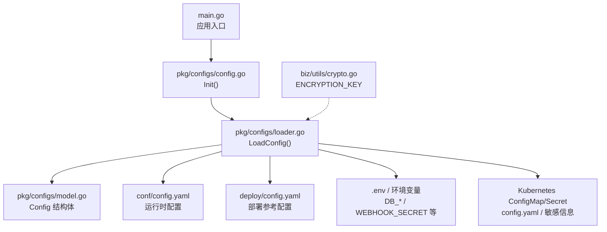
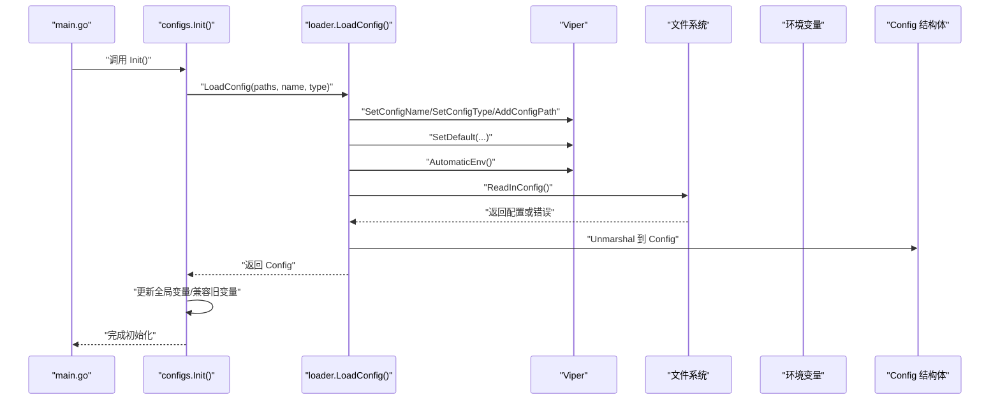
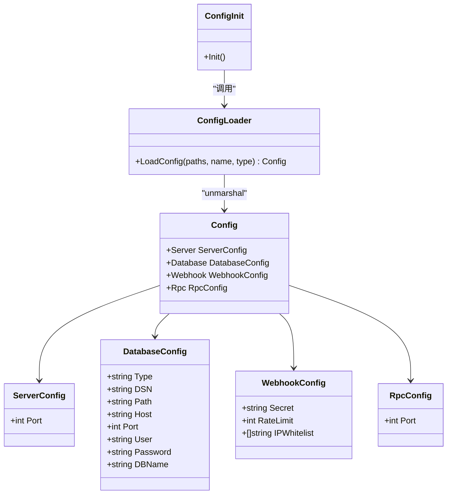
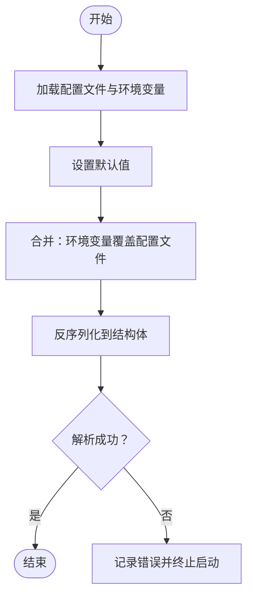

# 环境配置管理

<cite>
**本文引用的文件**
- [main.go](file://main.go)
- [pkg/configs/config.go](file://pkg/configs/config.go)
- [pkg/configs/loader.go](file://pkg/configs/loader.go)
- [pkg/configs/model.go](file://pkg/configs/model.go)
- [biz/utils/crypto.go](file://biz/utils/crypto.go)
- [conf/config.yaml](file://conf/config.yaml)
- [deploy/config.yaml](file://deploy/config.yaml)
- [deploy/.env.example](file://deploy/.env.example)
- [deploy/CONFIG_GUIDE.md](file://deploy/CONFIG_GUIDE.md)
- [deploy/README.md](file://deploy/README.md)
- [deploy/k8s/configmap.yaml](file://deploy/k8s/configmap.yaml)
- [deploy/k8s/secret.yaml](file://deploy/k8s/secret.yaml)
- [deploy/docker-compose/mysql/docker-compose.yml](file://deploy/docker-compose/mysql/docker-compose.yml)
- [public/settings.html](file://public/settings.html)
</cite>

## 目录
1. [简介](#简介)
2. [项目结构](#项目结构)
3. [核心组件](#核心组件)
4. [架构总览](#架构总览)
5. [详细组件分析](#详细组件分析)
6. [依赖关系分析](#依赖关系分析)
7. [性能考量](#性能考量)
8. [故障排查指南](#故障排查指南)
9. [结论](#结论)
10. [附录](#附录)

## 简介
本文件面向Git管理服务的环境配置管理，系统性说明配置文件的层次结构与优先级、环境变量的使用方式与默认值设定、不同环境（开发、测试、生产）的配置差异与管理策略；同时覆盖敏感信息保护、配置热更新可行性与限制、配置验证机制、配置模板、检查清单与迁移指南，并给出安全性、版本控制与变更管理流程建议。

## 项目结构
围绕配置管理的关键目录与文件如下：
- 配置文件
  - 运行时配置：conf/config.yaml（项目内默认配置）
  - 部署配置：deploy/config.yaml（部署参考配置）
- 配置加载与模型
  - pkg/configs/loader.go：基于Viper的配置加载与默认值设置
  - pkg/configs/model.go：配置结构体定义
  - pkg/configs/config.go：初始化入口与全局配置导出
- 环境变量与密钥
  - deploy/.env.example：示例环境变量
  - biz/utils/crypto.go：应用侧对称加密密钥来源
- 部署与挂载
  - deploy/k8s/configmap.yaml：Kubernetes ConfigMap挂载配置
  - deploy/k8s/secret.yaml：Kubernetes Secret挂载敏感信息
  - deploy/docker-compose/mysql/docker-compose.yml：Docker Compose环境变量注入
- 运行入口
  - main.go：应用启动时初始化配置

图表来源
- [main.go](file://main.go#L115-L134)
- [pkg/configs/config.go](file://pkg/configs/config.go#L18-L42)
- [pkg/configs/loader.go](file://pkg/configs/loader.go#L9-L45)
- [pkg/configs/model.go](file://pkg/configs/model.go#L3-L33)
- [conf/config.yaml](file://conf/config.yaml#L1-L25)
- [deploy/config.yaml](file://deploy/config.yaml#L1-L55)
- [deploy/.env.example](file://deploy/.env.example#L1-L21)
- [deploy/k8s/configmap.yaml](file://deploy/k8s/configmap.yaml#L1-L20)
- [deploy/k8s/secret.yaml](file://deploy/k8s/secret.yaml#L1-L11)
- [biz/utils/crypto.go](file://biz/utils/crypto.go#L15-L22)

章节来源
- [main.go](file://main.go#L115-L134)
- [pkg/configs/config.go](file://pkg/configs/config.go#L1-L43)
- [pkg/configs/loader.go](file://pkg/configs/loader.go#L1-L46)
- [pkg/configs/model.go](file://pkg/configs/model.go#L1-L34)
- [conf/config.yaml](file://conf/config.yaml#L1-L25)
- [deploy/config.yaml](file://deploy/config.yaml#L1-L55)
- [deploy/.env.example](file://deploy/.env.example#L1-L21)
- [deploy/k8s/configmap.yaml](file://deploy/k8s/configmap.yaml#L1-L20)
- [deploy/k8s/secret.yaml](file://deploy/k8s/secret.yaml#L1-L11)
- [biz/utils/crypto.go](file://biz/utils/crypto.go#L1-L70)

## 核心组件
- 配置加载器（Viper封装）
  - 支持从多个路径加载配置文件，设置默认值，自动启用环境变量覆盖
  - 默认值包括服务端口、RPC端口、数据库类型与SQLite路径、Webhook密钥与限流、白名单等
- 配置模型
  - 定义Config、ServerConfig、RpcConfig、DatabaseConfig、WebhookConfig等结构体
- 初始化入口
  - Init()负责加载配置并填充全局变量，兼容旧版全局变量
- 运行入口
  - main.go在启动阶段调用initResources()完成配置加载与数据库、加密、定时任务等初始化

章节来源
- [pkg/configs/loader.go](file://pkg/configs/loader.go#L9-L45)
- [pkg/configs/model.go](file://pkg/configs/model.go#L3-L33)
- [pkg/configs/config.go](file://pkg/configs/config.go#L18-L42)
- [main.go](file://main.go#L115-L134)

## 架构总览
配置加载与使用的整体流程如下：

图表来源
- [main.go](file://main.go#L115-L134)
- [pkg/configs/config.go](file://pkg/configs/config.go#L18-L42)
- [pkg/configs/loader.go](file://pkg/configs/loader.go#L9-L45)

## 详细组件分析

### 配置层次结构与优先级
- 层次结构
  - 文件路径搜索顺序：当前目录、./conf、../conf
  - 默认配置文件名：config.yaml
  - 默认配置类型：yaml
- 优先级（从高到低）
  1) 环境变量（AutomaticEnv启用，自动映射）
  2) 配置文件（按AddConfigPath顺序查找，先找到的生效）
  3) 默认值（SetDefault预设）
- 关键行为
  - 若未找到配置文件，记录提示并使用默认值
  - 未显式设置的键将采用默认值
  - 旧版全局变量（如WebhookSecret、WebhookRateLimit、WebhookIPWhitelist）在Init中同步更新

章节来源
- [pkg/configs/config.go](file://pkg/configs/config.go#L18-L42)
- [pkg/configs/loader.go](file://pkg/configs/loader.go#L15-L37)

### 环境变量使用与默认值
- 环境变量映射
  - AutomaticEnv启用后，Viper会自动读取同名环境变量作为配置值
  - 示例：DB_TYPE、DB_HOST、DB_PORT、DB_USER、DB_PASSWORD、DB_NAME、WEBHOOK_SECRET、TZ等
- 默认值
  - server.port、rpc.port、database.type、database.path、webhook.secret、webhook.rate_limit、webhook.ip_whitelist
- 旧版兼容
  - 通过Init函数将部分环境变量手动覆盖到全局变量，保持向后兼容

章节来源
- [pkg/configs/loader.go](file://pkg/configs/loader.go#L19-L29)
- [pkg/configs/config.go](file://pkg/configs/config.go#L33-L41)
- [deploy/.env.example](file://deploy/.env.example#L1-L21)

### 不同环境的配置差异与管理策略
- 开发环境
  - 使用SQLite（默认），便于本地快速启动
  - 可开启debug（部署参考配置中提供），便于调试
  - Docker Compose示例中直接注入DB_TYPE=sqlite
- 测试/生产环境
  - 建议使用MySQL或PostgreSQL
  - 敏感信息通过环境变量或Kubernetes Secret注入，避免明文写入配置文件
  - 关闭debug，提升安全性与性能
- 管理策略
  - 使用ConfigMap/Secret进行声明式配置管理
  - 通过环境变量覆盖关键参数，避免重复维护多份配置文件

章节来源
- [deploy/config.yaml](file://deploy/config.yaml#L1-L55)
- [deploy/README.md](file://deploy/README.md#L101-L108)
- [deploy/docker-compose/mysql/docker-compose.yml](file://deploy/docker-compose/mysql/docker-compose.yml#L11-L18)
- [deploy/k8s/configmap.yaml](file://deploy/k8s/configmap.yaml#L1-L20)
- [deploy/k8s/secret.yaml](file://deploy/k8s/secret.yaml#L1-L11)

### 敏感信息保护
- 数据库密码
  - 建议通过环境变量或Secret注入，不直接写入配置文件
  - 示例：DB_PASSWORD、WEBHOOK_SECRET
- 对称加密密钥
  - ENCRYPTION_KEY来自环境变量，若未设置则使用开发回退值
  - 建议在生产环境强制设置强密钥
- Kubernetes最佳实践
  - 使用Secret管理敏感数据；生产环境建议使用SealedSecrets等工具

章节来源
- [deploy/CONFIG_GUIDE.md](file://deploy/CONFIG_GUIDE.md#L91-L99)
- [deploy/README.md](file://deploy/README.md#L66-L71)
- [biz/utils/crypto.go](file://biz/utils/crypto.go#L15-L22)
- [deploy/.env.example](file://deploy/.env.example#L14-L20)
- [deploy/k8s/secret.yaml](file://deploy/k8s/secret.yaml#L7-L10)

### 配置热更新
- 当前能力
  - 配置在应用启动时一次性加载并不可热更新
  - 修改ConfigMap/Secret后，Pod通常需要重启才能加载最新配置
- 建议
  - 对非敏感配置（如日志级别、调试开关）可在部署层通过滚动更新触发重启
  - 对数据库连接等关键配置，变更需纳入变更管理流程并进行灰度发布

章节来源
- [deploy/README.md](file://deploy/README.md#L96-L98)

### 配置验证机制
- 结构校验
  - 通过Viper Unmarshal到结构体，类型与字段匹配失败将导致解析错误
- 默认值保障
  - SetDefault确保缺失键有合理默认值，降低运行期异常风险
- 建议补充
  - 在CI中增加YAML语法与Schema校验步骤
  - 对关键配置（如数据库DSN、Webhook密钥）在启动前做连通性与格式校验

章节来源
- [pkg/configs/loader.go](file://pkg/configs/loader.go#L39-L42)

### 配置模板与检查清单
- 配置模板
  - 运行时模板：conf/config.yaml
  - 部署参考模板：deploy/config.yaml
- 检查清单
  - 环境变量：DB_TYPE、DB_HOST、DB_PORT、DB_USER、DB_PASSWORD、DB_NAME、WEBHOOK_SECRET、TZ
  - Kubernetes：已创建ConfigMap/Secret；Pod已重启；网络与存储挂载正确
  - Docker Compose：容器已启动；端口映射正确；SSH密钥挂载可用
  - 安全：未提交明文密码；生产环境禁用debug；密钥长度符合要求

章节来源
- [conf/config.yaml](file://conf/config.yaml#L1-L25)
- [deploy/config.yaml](file://deploy/config.yaml#L1-L55)
- [deploy/.env.example](file://deploy/.env.example#L1-L21)
- [deploy/README.md](file://deploy/README.md#L49-L57)
- [deploy/k8s/configmap.yaml](file://deploy/k8s/configmap.yaml#L1-L20)
- [deploy/k8s/secret.yaml](file://deploy/k8s/secret.yaml#L1-L11)

### 配置迁移指南
- 从本地到Docker
  - 将本地配置迁移到deploy/config.yaml
  - 使用.env.example中的变量名替换明文配置
- 从Docker到Kubernetes
  - 将deploy/config.yaml内容放入ConfigMap
  - 将敏感信息放入Secret
  - 通过Deployment挂载ConfigMap/Secret
- 从SQLite迁移到MySQL/PostgreSQL
  - 更新database.type与对应连接参数
  - 如提供DSN则优先使用DSN覆盖
  - 确保数据库已创建并授权

章节来源
- [deploy/README.md](file://deploy/README.md#L23-L48)
- [deploy/README.md](file://deploy/README.md#L60-L83)
- [deploy/config.yaml](file://deploy/config.yaml#L19-L29)

## 依赖关系分析
配置模块内部依赖关系如下：

图表来源
- [pkg/configs/model.go](file://pkg/configs/model.go#L3-L33)
- [pkg/configs/loader.go](file://pkg/configs/loader.go#L9-L45)
- [pkg/configs/config.go](file://pkg/configs/config.go#L18-L42)

章节来源
- [pkg/configs/model.go](file://pkg/configs/model.go#L1-L34)
- [pkg/configs/loader.go](file://pkg/configs/loader.go#L1-L46)
- [pkg/configs/config.go](file://pkg/configs/config.go#L1-L43)

## 性能考量
- 配置加载成本极低，仅在启动阶段执行一次
- 环境变量覆盖与默认值设置均为内存操作，开销可忽略
- 建议避免在运行期频繁读取大量配置键，可通过缓存或按需读取优化

## 故障排查指南
- 配置文件未生效
  - 确认配置文件路径与名称正确（默认config.yaml）
  - 确认AddConfigPath搜索顺序与实际文件位置一致
  - 检查是否被环境变量覆盖
- 端口冲突
  - 检查server.port与rpc.port是否与其他进程冲突
- 数据库连接失败
  - 核对DB_TYPE、DB_HOST、DB_PORT、DB_USER、DB_PASSWORD、DB_NAME
  - 若使用DSN，确认其格式正确
- Webhook签名验证失败
  - 确认WEBHOOK_SECRET与上游一致
  - 检查IP白名单设置
- 加密密钥问题
  - 确认ENCRYPTION_KEY已设置且长度符合AES-256要求
- Kubernetes配置未生效
  - 确认ConfigMap/Secret已更新并触发Pod重启
  - 检查挂载路径与权限

章节来源
- [pkg/configs/loader.go](file://pkg/configs/loader.go#L31-L37)
- [deploy/README.md](file://deploy/README.md#L85-L98)
- [biz/utils/crypto.go](file://biz/utils/crypto.go#L15-L22)

## 结论
本项目采用Viper进行配置加载，具备清晰的层次结构与明确的优先级：环境变量 > 配置文件 > 默认值。通过ConfigMap/Secret与环境变量实现敏感信息保护与多环境管理；结合默认值与结构体校验，降低了运行期配置错误的风险。建议在生产环境严格遵循“密钥入Secret、配置入ConfigMap、变更走流程”的原则，并在CI中加入配置校验环节。

## 附录

### 配置项一览与默认值
- server.port：默认8080
- rpc.port：默认8888
- database.type：默认sqlite
- database.path：默认git_sync.db
- webhook.secret：默认my-secret-key
- webhook.rate_limit：默认100
- webhook.ip_whitelist：默认[]
- debug：默认false（部署参考配置中提供）

章节来源
- [pkg/configs/loader.go](file://pkg/configs/loader.go#L19-L26)
- [deploy/config.yaml](file://deploy/config.yaml#L46-L48)

### 环境变量对照表
- APP_PORT：应用对外端口
- DB_TYPE：数据库类型（sqlite/mysql/postgres）
- DB_HOST/DB_PORT/DB_USER/DB_PASSWORD/DB_NAME：数据库连接参数
- WEBHOOK_SECRET：Webhook签名密钥
- TZ：时区
- ENCRYPTION_KEY：对称加密密钥

章节来源
- [deploy/.env.example](file://deploy/.env.example#L1-L21)
- [deploy/docker-compose/mysql/docker-compose.yml](file://deploy/docker-compose/mysql/docker-compose.yml#L11-L18)
- [biz/utils/crypto.go](file://biz/utils/crypto.go#L15-L22)

### 配置热更新可行性
- 当前实现：不支持热更新，需重启生效
- 建议：对非敏感配置采用滚动更新；对数据库连接等关键配置纳入变更管理

章节来源
- [deploy/README.md](file://deploy/README.md#L96-L98)

### 配置验证流程图

图表来源
- [pkg/configs/loader.go](file://pkg/configs/loader.go#L9-L45)