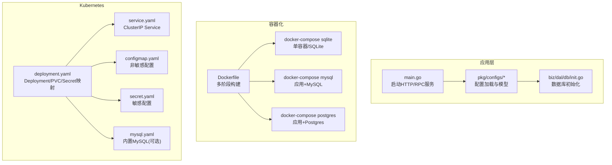
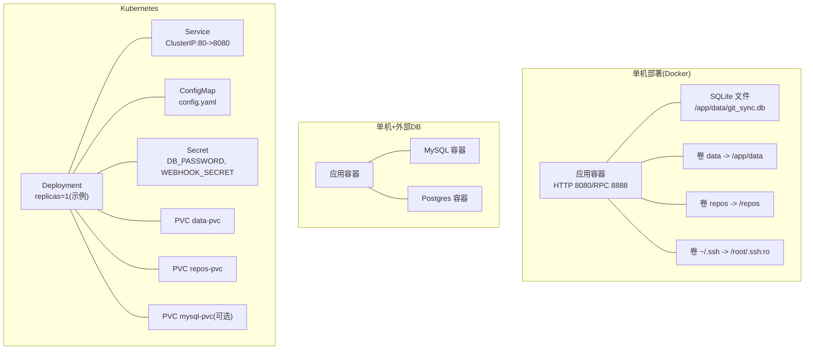
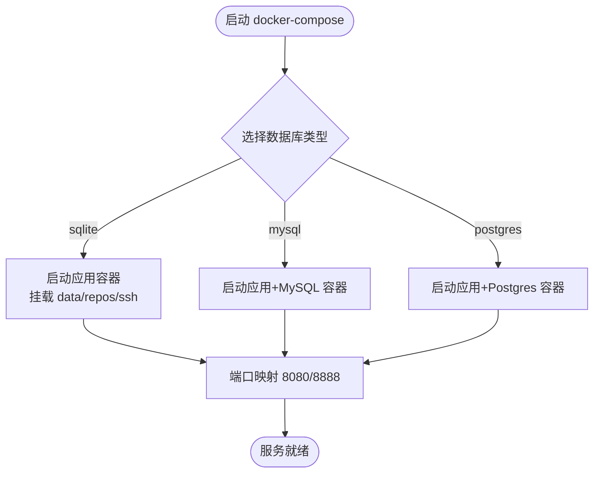
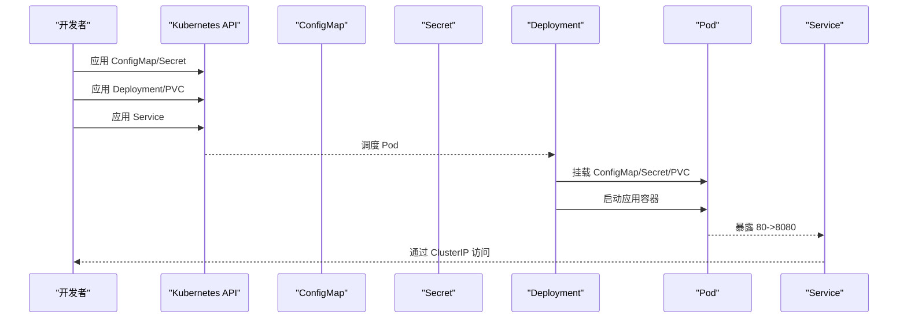
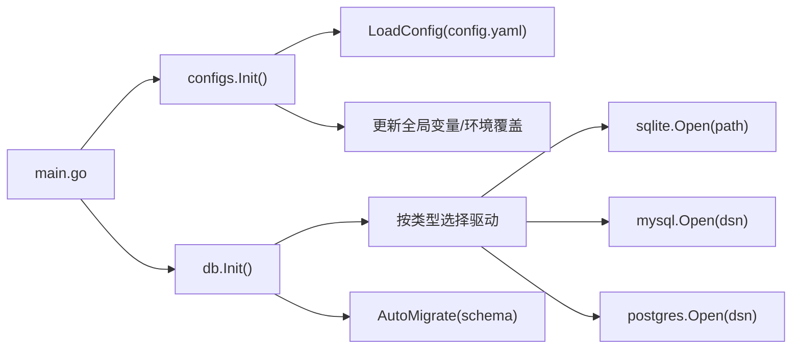

# 部署架构设计

<cite>
**本文引用的文件**
- [main.go](file://main.go)
- [Dockerfile](file://Dockerfile)
- [deploy/README.md](file://deploy/README.md)
- [DEPLOY.md](file://DEPLOY.md)
- [deploy/config.yaml](file://deploy/config.yaml)
- [deploy/CONFIG_GUIDE.md](file://deploy/CONFIG_GUIDE.md)
- [pkg/configs/config.go](file://pkg/configs/config.go)
- [pkg/configs/model.go](file://pkg/configs/model.go)
- [biz/dal/db/init.go](file://biz/dal/db/init.go)
- [deploy/docker-compose/sqlite/docker-compose.yml](file://deploy/docker-compose/sqlite/docker-compose.yml)
- [deploy/docker-compose/mysql/docker-compose.yml](file://deploy/docker-compose/mysql/docker-compose.yml)
- [deploy/docker-compose/postgres/docker-compose.yml](file://deploy/docker-compose/postgres/docker-compose.yml)
- [deploy/k8s/deployment.yaml](file://deploy/k8s/deployment.yaml)
- [deploy/k8s/service.yaml](file://deploy/k8s/service.yaml)
- [deploy/k8s/configmap.yaml](file://deploy/k8s/configmap.yaml)
- [deploy/k8s/secret.yaml](file://deploy/k8s/secret.yaml)
- [deploy/k8s/mysql.yaml](file://deploy/k8s/mysql.yaml)
</cite>

## 目录
1. [引言](#引言)
2. [项目结构](#项目结构)
3. [核心组件](#核心组件)
4. [架构总览](#架构总览)
5. [详细组件分析](#详细组件分析)
6. [依赖关系分析](#依赖关系分析)
7. [性能考虑](#性能考虑)
8. [故障排查指南](#故障排查指南)
9. [结论](#结论)
10. [附录](#附录)

## 引言
本文件面向Git管理服务的部署与运维，提供从单机到集群再到云原生的完整部署架构设计。内容涵盖：
- 部署拓扑与基础设施要求
- Docker容器化方案与多环境部署策略
- 配置管理与敏感信息治理
- 单机、集群与云原生三种部署模式
- 数据库部署选项（SQLite、MySQL、PostgreSQL）及选择标准
- 负载均衡、服务发现与健康检查机制
- Kubernetes部署配置与运维监控方案
- 高可用与灾难恢复策略

## 项目结构
围绕部署与运行，项目的关键目录与文件如下：
- 应用入口与启动逻辑：main.go
- 容器镜像构建：Dockerfile
- 部署指南与编排：deploy/README.md、DEPLOY.md
- 应用配置与模型：deploy/config.yaml、pkg/configs/config.go、pkg/configs/model.go
- 数据库初始化与驱动：biz/dal/db/init.go
- Docker Compose编排（SQLite/MySQL/Postgres）：deploy/docker-compose/*/docker-compose.yml
- Kubernetes资源清单：deploy/k8s/*.yaml

图表来源
- [main.go](file://main.go#L52-L134)
- [Dockerfile](file://Dockerfile#L1-L77)
- [deploy/docker-compose/sqlite/docker-compose.yml](file://deploy/docker-compose/sqlite/docker-compose.yml#L1-L30)
- [deploy/docker-compose/mysql/docker-compose.yml](file://deploy/docker-compose/mysql/docker-compose.yml#L1-L50)
- [deploy/docker-compose/postgres/docker-compose.yml](file://deploy/docker-compose/postgres/docker-compose.yml#L1-L49)
- [deploy/k8s/deployment.yaml](file://deploy/k8s/deployment.yaml#L1-L83)
- [deploy/k8s/service.yaml](file://deploy/k8s/service.yaml#L1-L14)
- [deploy/k8s/configmap.yaml](file://deploy/k8s/configmap.yaml#L1-L20)
- [deploy/k8s/secret.yaml](file://deploy/k8s/secret.yaml#L1-L11)
- [deploy/k8s/mysql.yaml](file://deploy/k8s/mysql.yaml#L1-L65)

章节来源
- [main.go](file://main.go#L52-L134)
- [Dockerfile](file://Dockerfile#L1-L77)
- [deploy/README.md](file://deploy/README.md#L1-L108)
- [DEPLOY.md](file://DEPLOY.md#L1-L83)

## 核心组件
- 应用启动与双栈服务
  - 支持HTTP与RPC双栈，通过命令行模式参数选择启动模式，统一由main函数进行资源初始化与优雅关闭。
- 配置体系
  - 采用YAML配置文件与环境变量双通道加载，支持数据库类型、端口、Webhook密钥、速率限制、调试开关等关键参数。
- 数据库抽象
  - 通过GORM与多驱动适配，支持SQLite、MySQL、PostgreSQL；具备迁移能力与表存在性检测。

章节来源
- [main.go](file://main.go#L42-L134)
- [pkg/configs/config.go](file://pkg/configs/config.go#L18-L42)
- [pkg/configs/model.go](file://pkg/configs/model.go#L3-L34)
- [biz/dal/db/init.go](file://biz/dal/db/init.go#L18-L71)

## 架构总览
下图展示三种部署模式的拓扑差异与关键组件：

图表来源
- [deploy/docker-compose/sqlite/docker-compose.yml](file://deploy/docker-compose/sqlite/docker-compose.yml#L1-L30)
- [deploy/docker-compose/mysql/docker-compose.yml](file://deploy/docker-compose/mysql/docker-compose.yml#L1-L50)
- [deploy/docker-compose/postgres/docker-compose.yml](file://deploy/docker-compose/postgres/docker-compose.yml#L1-L49)
- [deploy/k8s/deployment.yaml](file://deploy/k8s/deployment.yaml#L1-L83)
- [deploy/k8s/service.yaml](file://deploy/k8s/service.yaml#L1-L14)
- [deploy/k8s/configmap.yaml](file://deploy/k8s/configmap.yaml#L1-L20)
- [deploy/k8s/secret.yaml](file://deploy/k8s/secret.yaml#L1-L11)
- [deploy/k8s/mysql.yaml](file://deploy/k8s/mysql.yaml#L1-L65)

## 详细组件分析

### 单机部署（Docker）
- 适用场景
  - 开发测试、单机演示、小规模私有化部署。
- 组件与卷
  - 应用容器暴露HTTP 8080与RPC 8888端口。
  - 数据卷：/app/data（SQLite数据库文件）、/repos（Git仓库目录）、/root/.ssh（只读，SSH密钥）。
- 编排变体
  - SQLite：应用内嵌数据库，无需外部DB。
  - MySQL/Postgres：应用连接独立数据库容器。
- 环境变量
  - DB_TYPE、DB_*、WEBHOOK_SECRET、TZ等通过环境变量控制。
- 配置文件
  - 可挂载自定义config.yaml覆盖默认配置。

图表来源
- [deploy/docker-compose/sqlite/docker-compose.yml](file://deploy/docker-compose/sqlite/docker-compose.yml#L1-L30)
- [deploy/docker-compose/mysql/docker-compose.yml](file://deploy/docker-compose/mysql/docker-compose.yml#L1-L50)
- [deploy/docker-compose/postgres/docker-compose.yml](file://deploy/docker-compose/postgres/docker-compose.yml#L1-L49)

章节来源
- [DEPLOY.md](file://DEPLOY.md#L10-L83)
- [deploy/README.md](file://deploy/README.md#L23-L48)
- [deploy/docker-compose/sqlite/docker-compose.yml](file://deploy/docker-compose/sqlite/docker-compose.yml#L1-L30)
- [deploy/docker-compose/mysql/docker-compose.yml](file://deploy/docker-compose/mysql/docker-compose.yml#L1-L50)
- [deploy/docker-compose/postgres/docker-compose.yml](file://deploy/docker-compose/postgres/docker-compose.yml#L1-L49)

### 集群部署（Kubernetes）
- 适用场景
  - 生产高可用、弹性伸缩、集中化配置与密钥管理。
- 资源清单
  - Deployment：应用容器、PVC、ConfigMap与Secret挂载。
  - Service：ClusterIP暴露80端口至8080。
  - ConfigMap：非敏感配置（如数据库host/port/user等）。
  - Secret：敏感配置（数据库密码、Webhook密钥）。
  - 内置MySQL（可选）：通过独立Deployment/Service/PVC提供。
- 存储与持久化
  - PVC：data-pvc（1Gi）、repos-pvc（10Gi），满足SQLite与仓库数据持久化需求。
- 安全与密钥
  - 建议使用SealedSecrets或其他密管工具替代明文Secret。
- 节点依赖
  - 当前部署使用hostPath挂载宿主机SSH密钥，存在节点耦合风险，建议迁移到Pod内Secret挂载。

图表来源
- [deploy/k8s/deployment.yaml](file://deploy/k8s/deployment.yaml#L1-L83)
- [deploy/k8s/service.yaml](file://deploy/k8s/service.yaml#L1-L14)
- [deploy/k8s/configmap.yaml](file://deploy/k8s/configmap.yaml#L1-L20)
- [deploy/k8s/secret.yaml](file://deploy/k8s/secret.yaml#L1-L11)
- [deploy/k8s/mysql.yaml](file://deploy/k8s/mysql.yaml#L1-L65)

章节来源
- [deploy/README.md](file://deploy/README.md#L60-L98)
- [deploy/k8s/deployment.yaml](file://deploy/k8s/deployment.yaml#L1-L83)
- [deploy/k8s/service.yaml](file://deploy/k8s/service.yaml#L1-L14)
- [deploy/k8s/configmap.yaml](file://deploy/k8s/configmap.yaml#L1-L20)
- [deploy/k8s/secret.yaml](file://deploy/k8s/secret.yaml#L1-L11)
- [deploy/k8s/mysql.yaml](file://deploy/k8s/mysql.yaml#L1-L65)

### 云原生部署（多模式与扩展）
- 模式一：应用容器+外部托管DB（推荐）
  - 应用通过ConfigMap配置DB连接信息，Secret注入密码；Service暴露80端口。
- 模式二：内置DB（不推荐生产）
  - 使用内置MySQL Deployment，便于快速体验；生产建议使用托管DB。
- 模式三：多副本与水平扩展
  - 将replicas>1，结合水平Pod自动伸缩（HPA）与只读副本（需评估数据库一致性）。
- 模式四：多可用区与跨区域
  - 将PVC绑定到支持多AZ的存储类；将DB置于高可用架构（主从/集群）。

章节来源
- [deploy/k8s/deployment.yaml](file://deploy/k8s/deployment.yaml#L1-L83)
- [deploy/k8s/configmap.yaml](file://deploy/k8s/configmap.yaml#L1-L20)
- [deploy/k8s/secret.yaml](file://deploy/k8s/secret.yaml#L1-L11)
- [deploy/k8s/mysql.yaml](file://deploy/k8s/mysql.yaml#L1-L65)

### 数据库部署选项与选择标准
- SQLite
  - 特点：零依赖、文件即库、适合单机/小规模。
  - 部署：单容器/单文件，数据卷持久化。
  - 限制：并发写入受限、无内置高可用。
- MySQL
  - 特点：成熟稳定、生态丰富、支持高可用与分片。
  - 部署：内置MySQL或外部托管。
  - 适用：中大型生产环境。
- PostgreSQL
  - 特点：ACID强一致、扩展性强、JSON/数组等高级特性。
  - 部署：内置Postgres或外部托管。
  - 适用：对一致性与扩展性要求高的场景。
- 选择标准
  - 数据量与并发：小规模用SQLite，中大规模用MySQL/PG。
  - 运维能力：内部DB团队强选自建，否则优先托管DB。
  - 成本与SLA：托管DB通常提供更好的SLA与备份。
  - 迁移成本：已有MySQL/PG可复用现有运维体系。

章节来源
- [deploy/config.yaml](file://deploy/config.yaml#L9-L30)
- [deploy/CONFIG_GUIDE.md](file://deploy/CONFIG_GUIDE.md#L21-L54)
- [biz/dal/db/init.go](file://biz/dal/db/init.go#L24-L47)
- [deploy/docker-compose/sqlite/docker-compose.yml](file://deploy/docker-compose/sqlite/docker-compose.yml#L13-L14)
- [deploy/docker-compose/mysql/docker-compose.yml](file://deploy/docker-compose/mysql/docker-compose.yml#L13-L18)
- [deploy/docker-compose/postgres/docker-compose.yml](file://deploy/docker-compose/postgres/docker-compose.yml#L13-L18)

### 配置管理与敏感信息治理
- 配置文件
  - 默认config.yaml位于conf/，可通过Docker/K8s挂载覆盖。
  - 支持server.port、database.type/host/port/user/dbname、webhook.secret/limit/ip_whitelist、debug、rpc.port等。
- 环境变量
  - 支持覆盖敏感字段（如DB_PATH、WEBHOOK_SECRET），避免明文写入配置文件。
- 密钥管理
  - K8s使用Secret；建议生产使用SealedSecrets或Vault等密管工具。
- 多环境
  - 开发：debug=true、sqlite；生产：debug=false、mysql/postgres、密钥通过Secret注入。

章节来源
- [deploy/config.yaml](file://deploy/config.yaml#L1-L55)
- [deploy/CONFIG_GUIDE.md](file://deploy/CONFIG_GUIDE.md#L1-L99)
- [pkg/configs/config.go](file://pkg/configs/config.go#L18-L42)
- [pkg/configs/model.go](file://pkg/configs/model.go#L3-L34)
- [deploy/k8s/configmap.yaml](file://deploy/k8s/configmap.yaml#L1-L20)
- [deploy/k8s/secret.yaml](file://deploy/k8s/secret.yaml#L1-L11)

### 负载均衡、服务发现与健康检查
- 负载均衡
  - 在K8s中通过Service(ClusterIP)暴露80端口；若需要公网访问，可配合Ingress/NLB。
- 服务发现
  - 同命名空间内通过Service DNS（如git-manage-service.default.svc.cluster.local）访问。
- 健康检查
  - 建议实现HTTP健康检查端点（如/health），返回200/ok；当前未见显式健康检查实现，可在应用侧补充。
- RPC调用
  - 应用同时提供HTTP与RPC服务，RPC端口8888可用于内部微服务间调用。

章节来源
- [deploy/k8s/service.yaml](file://deploy/k8s/service.yaml#L1-L14)
- [main.go](file://main.go#L136-L175)
- [deploy/config.yaml](file://deploy/config.yaml#L50-L55)

### 容器化方案与镜像构建
- 多阶段构建
  - Builder阶段下载依赖与编译；Runtime阶段仅保留必要运行时包（git、openssh、ca-certificates、tzdata）。
- 运行时环境
  - 默认端口8080/8888，工作目录/app，创建/data与/root/.ssh目录并设置权限。
- 镜像用途
  - 既可直接用于Docker Compose，也可推送至镜像仓库供K8s拉取。

章节来源
- [Dockerfile](file://Dockerfile#L1-L77)

## 依赖关系分析
- 启动链路
  - main.go -> configs.Init() -> db.Init() -> 各业务服务初始化 -> 启动HTTP/RPC服务。
- 配置依赖
  - configs.LoadConfig从多个路径查找config.yaml；随后覆盖Webhook与DB路径等关键字段。
- 数据库驱动
  - 根据配置类型选择sqlite/mysql/postgres驱动，支持自定义DSN或按字段拼接DSN。

图表来源
- [main.go](file://main.go#L116-L134)
- [pkg/configs/config.go](file://pkg/configs/config.go#L18-L42)
- [biz/dal/db/init.go](file://biz/dal/db/init.go#L18-L71)

章节来源
- [main.go](file://main.go#L116-L134)
- [pkg/configs/config.go](file://pkg/configs/config.go#L18-L42)
- [biz/dal/db/init.go](file://biz/dal/db/init.go#L18-L71)

## 性能考虑
- 数据库
  - SQLite适合小规模写入；大规模并发写入建议MySQL/PG。
  - 合理设置连接池大小与超时时间，避免阻塞。
- 存储
  - PVC容量按实际业务增长预留冗余；SSD存储可提升I/O性能。
- 网络
  - 将应用与DB部署在同一可用区内，降低网络延迟。
- 资源
  - 为应用设置合理的CPU/内存请求与限制，避免资源争抢。
- 日志与指标
  - 建议接入集中式日志与Prometheus指标采集，结合告警策略。

## 故障排查指南
- 常见问题与定位
  - Pod反复Crash：查看日志、确认DB连接配置、确认DB服务就绪。
  - SSH密钥无法使用：确认hostPath挂载路径、密钥权限、known_hosts指纹。
  - 配置未生效：确认ConfigMap已更新并触发Pod重启或等待kubelet同步。
  - 数据库错误：检查data目录写权限、磁盘空间、PVC绑定状态。
  - Git操作失败：启用UI调试模式，查看容器日志，核对SSH密钥与主机指纹。
- 建议
  - 生产环境禁用hostPath挂载SSH密钥，改用K8s Secret。
  - 使用SealedSecrets或外部密管工具管理敏感配置。
  - 对外暴露端口建议通过Ingress/NLB统一入口，配合WAF与限流。

章节来源
- [deploy/README.md](file://deploy/README.md#L85-L98)
- [DEPLOY.md](file://DEPLOY.md#L78-L83)

## 结论
本部署架构设计覆盖从单机到云原生的多种场景，强调配置与密钥治理、数据库选型与高可用、以及Kubernetes资源编排与运维监控。建议：
- 生产优先使用K8s + 外部托管DB（MySQL/PG）。
- 严格分离敏感配置，使用Secret与密管工具。
- 通过Service与Ingress实现统一入口与限流。
- 持续完善健康检查与可观测性，保障高可用与可恢复性。

## 附录
- 关键端口
  - HTTP: 8080（容器内），K8s Service映射为80。
  - RPC: 8888（容器内）。
- 关键卷
  - /app/data：SQLite数据库文件。
  - /repos：Git仓库目录。
  - /root/.ssh：SSH密钥（只读）。
- 建议的后续增强
  - 实现/health健康检查端点。
  - 引入Ingress与TLS终止。
  - 部署Prometheus/Grafana与日志收集链路。
  - 将hostPath SSH密钥改造为Secret挂载。