# Handler层

<cite>
**本文引用的文件**
- [main.go](file://main.go)
- [register.go](file://biz/router/register.go)
- [repo.go](file://biz/router/repo/repo.go)
- [branch.go](file://biz/router/branch/branch.go)
- [webhook.go](file://biz/middleware/webhook.go)
- [response.go](file://pkg/response/response.go)
- [repo_service.go](file://biz/handler/repo/repo_service.go)
- [branch_service.go](file://biz/handler/branch/branch_service.go)
- [sync_service.go](file://biz/handler/sync/sync_service.go)
- [stats_service.go](file://biz/handler/stats/stats_service.go)
- [audit_service.go](file://biz/handler/audit/audit_service.go)
- [system_service.go](file://biz/handler/system/system_service.go)
- [tag_service.go](file://biz/handler/tag/tag_service.go)
- [version_service.go](file://biz/handler/version/version_service.go)
- [repo_dao.go](file://biz/dal/db/repo_dao.go)
- [repo.go](file://biz/model/api/repo.go)
- [branch.go](file://biz/model/api/branch.go)
</cite>

## 目录
1. [引言](#引言)
2. [项目结构](#项目结构)
3. [核心组件](#核心组件)
4. [架构总览](#架构总览)
5. [详细组件分析](#详细组件分析)
6. [依赖分析](#依赖分析)
7. [性能考虑](#性能考虑)
8. [故障排查指南](#故障排查指南)
9. [结论](#结论)
10. [附录](#附录)

## 引言
本文件聚焦于Handler层的设计与实现，阐述其作为业务逻辑入口的职责边界：接收HTTP请求、参数校验、调用Service层、统一响应封装与错误处理。Handler层通过Router层完成路由注册与中间件集成，形成清晰的“请求—校验—调用—响应”闭环。本文将逐项解析仓库管理、分支管理、同步服务、统计分析、审计服务、系统管理、标签管理与版本管理等模块的Handler实现，并给出扩展与最佳实践建议。

## 项目结构
Handler层位于biz/handler目录下，按业务域划分子包，每个子包内包含若干业务Handler函数；Router层位于biz/router目录，负责路由注册与中间件挂载；响应封装位于pkg/response，统一输出格式；DAO层位于biz/dal/db，为Handler提供数据访问能力。

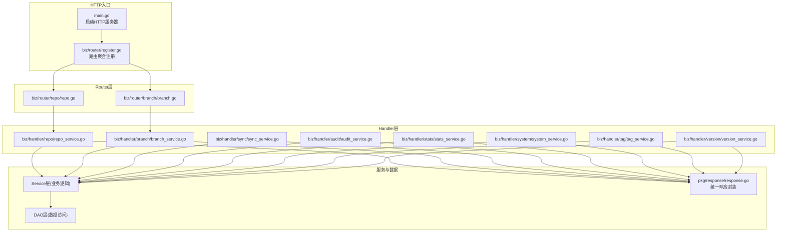

图表来源
- [main.go](file://main.go#L136-L152)
- [register.go](file://biz/router/register.go#L18-L41)
- [repo.go](file://biz/router/repo/repo.go#L16-L38)
- [branch.go](file://biz/router/branch/branch.go#L16-L42)
- [response.go](file://pkg/response/response.go#L17-L86)

章节来源
- [main.go](file://main.go#L136-L152)
- [register.go](file://biz/router/register.go#L18-L41)

## 核心组件
- 统一响应封装：所有Handler通过pkg/response提供的Success、Accepted、BadRequest、NotFound、InternalServerError等方法输出标准化响应，确保前后端一致的交互体验。
- 参数绑定与校验：Handler普遍采用c.BindAndValidate进行请求体绑定与参数校验，失败时返回400错误。
- DAO访问：Handler通过DAO层读写数据库，如RepoDAO用于仓库CRUD。
- 中间件集成：Router在各组上挂载中间件，如鉴权、限流、签名验证等，Handler无需重复实现。
- 异步任务：部分操作（如克隆、统计）采用异步执行，Handler返回任务ID或202 Accepted，后续轮询或回调获取结果。

章节来源
- [response.go](file://pkg/response/response.go#L17-L86)
- [repo_service.go](file://biz/handler/repo/repo_service.go#L55-L59)
- [repo_dao.go](file://biz/dal/db/repo_dao.go#L13-L27)

## 架构总览
Handler层与Router层协作流程如下：

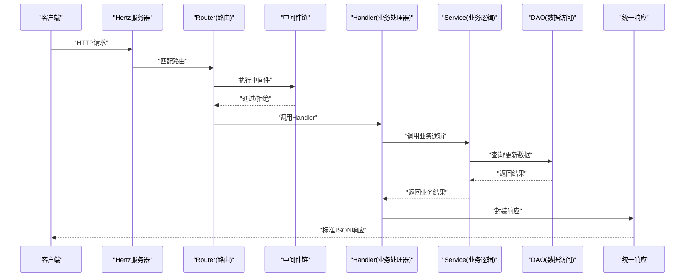

图表来源
- [main.go](file://main.go#L136-L152)
- [register.go](file://biz/router/register.go#L18-L41)
- [repo.go](file://biz/router/repo/repo.go#L16-L38)
- [response.go](file://pkg/response/response.go#L17-L86)

## 详细组件分析

### 仓库管理(Repo) Handler
职责与流程
- 列表/详情：从DAO查询仓库列表或按key查询单个仓库，返回DTO。
- 新增：绑定并校验RegisterRepoReq，校验本地路径是否为Git仓库，可选同步远端配置，创建记录并触发异步统计。
- 更新：校验key存在，必要时校验路径变更合法性，同步远端配置，保存并审计。
- 删除：检查是否被同步任务引用，若无引用则删除并审计。
- 扫描：校验路径为Git仓库并读取配置。
- 克隆：校验本地路径可用性，创建任务并异步执行克隆，返回任务ID；完成后自动入库并触发统计。
- 拉取：拉取仓库全部远端。
- 获取任务：根据任务ID查询克隆进度。

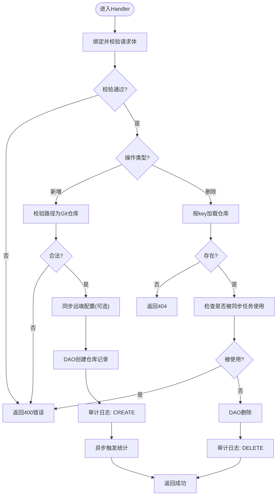

图表来源
- [repo_service.go](file://biz/handler/repo/repo_service.go#L52-L126)
- [repo_service.go](file://biz/handler/repo/repo_service.go#L206-L237)
- [repo_dao.go](file://biz/dal/db/repo_dao.go#L13-L27)

章节来源
- [repo_service.go](file://biz/handler/repo/repo_service.go#L21-L126)
- [repo_service.go](file://biz/handler/repo/repo_service.go#L206-L371)
- [repo_dao.go](file://biz/dal/db/repo_dao.go#L13-L42)
- [repo.go](file://biz/model/api/repo.go#L10-L33)

### 分支管理(Branch) Handler
职责与流程
- 列表：按repo_key加载仓库，列出分支并支持关键词过滤、分页；计算上游同步状态。
- 创建/删除/更新：创建分支、强制删除、重命名与描述设置。
- 切换：检出指定分支。
- 推送/拉取：推送至多个远端；若当前分支则执行拉取，否则尝试快进更新。
- 对比/差异：获取两个分支间的统计与差异内容。
- 合并：预演冲突检测，冲突则返回合并报告链接与ID；无冲突则执行合并并审计。
- 补丁导出：生成并下载补丁文件。

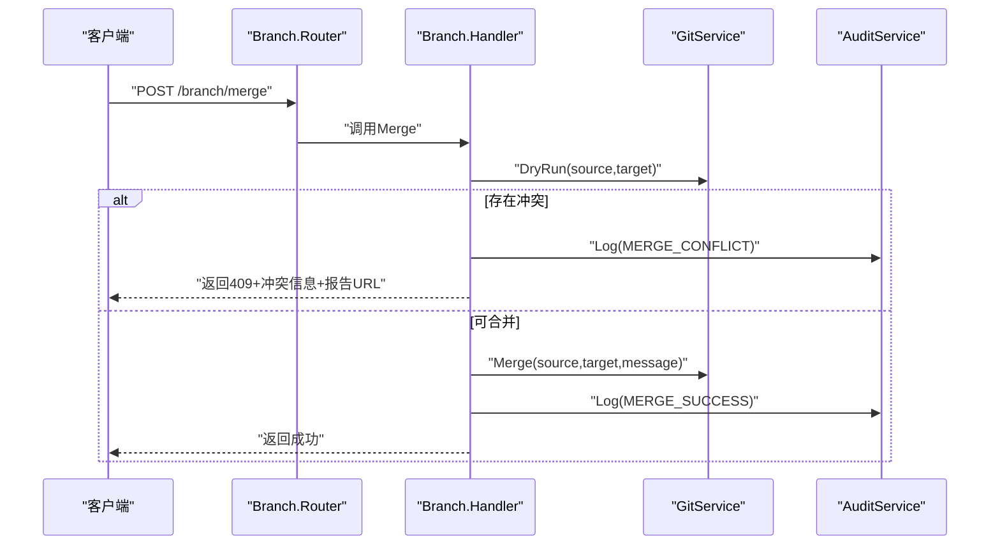

图表来源
- [branch.go](file://biz/router/branch/branch.go#L32-L34)
- [branch_service.go](file://biz/handler/branch/branch_service.go#L437-L496)

章节来源
- [branch_service.go](file://biz/handler/branch/branch_service.go#L22-L92)
- [branch_service.go](file://biz/handler/branch/branch_service.go#L94-L203)
- [branch_service.go](file://biz/handler/branch/branch_service.go#L205-L350)
- [branch_service.go](file://biz/handler/branch/branch_service.go#L352-L522)
- [branch.go](file://biz/model/api/branch.go#L3-L15)

### 同步服务(Sync) Handler
职责与流程
- 任务列表/详情：按仓库或全部列出同步任务，支持关联仓库信息。
- 新增/更新/删除：创建、更新字段（含cron表达式）、删除并更新定时任务。
- 运行任务：异步执行指定任务键的任务。
- 执行同步：基于仓库信息构造一次性任务并异步执行。
- 历史记录：按仓库或全局查询最近运行历史。
- 删除历史：删除指定运行记录。

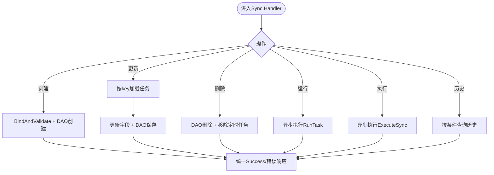

图表来源
- [sync_service.go](file://biz/handler/sync/sync_service.go#L19-L258)

章节来源
- [sync_service.go](file://biz/handler/sync/sync_service.go#L19-L258)

### 统计分析(Stats) Handler
职责与流程
- 分支/作者/提交：按仓库查询分支、作者、提交列表。
- 统计分析：后台计算统计，支持进度反馈；可按作者过滤。
- 导出CSV：将统计结果导出为CSV文件。
- 代码行统计：支持排除目录/模式、按分支/作者/时间范围筛选；支持配置缓存与导出。

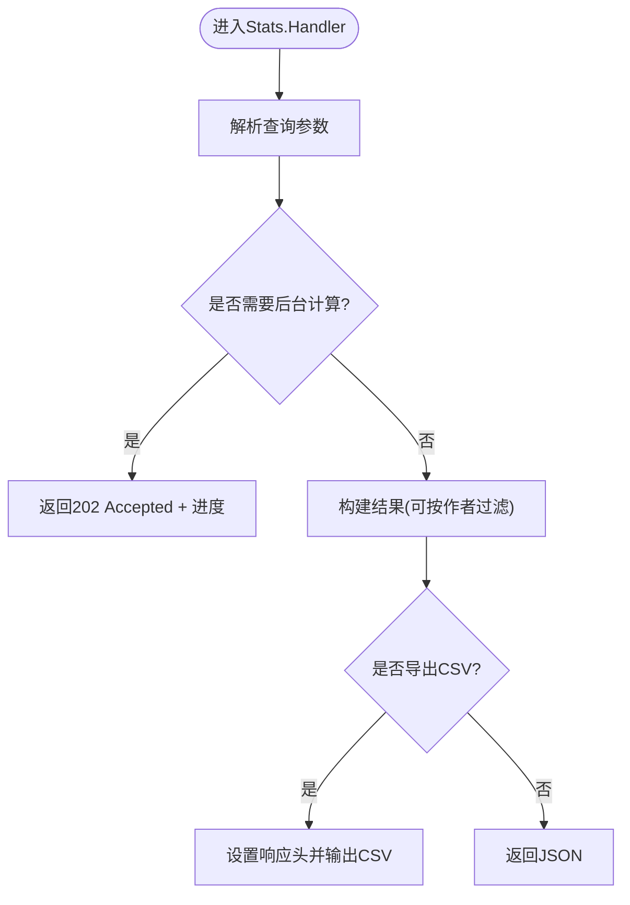

图表来源
- [stats_service.go](file://biz/handler/stats/stats_service.go#L97-L149)
- [stats_service.go](file://biz/handler/stats/stats_service.go#L151-L197)
- [stats_service.go](file://biz/handler/stats/stats_service.go#L199-L360)

章节来源
- [stats_service.go](file://biz/handler/stats/stats_service.go#L20-L360)

### 审计服务(Audit) Handler
职责与流程
- 日志列表：分页查询审计日志，返回总数与列表。
- 日志详情：按ID查询单条审计日志。

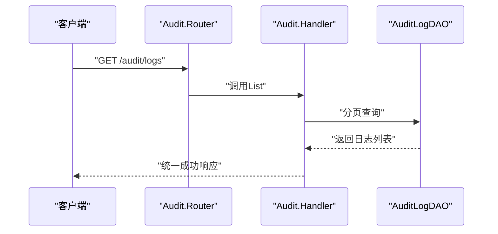

图表来源
- [audit_service.go](file://biz/handler/audit/audit_service.go#L16-L77)

章节来源
- [audit_service.go](file://biz/handler/audit/audit_service.go#L16-L77)

### 系统管理(System) Handler
职责与流程
- 获取/更新系统配置：读取/设置调试模式与Git全局用户信息。
- 目录浏览：按路径枚举子目录，支持搜索与排序。
- SSH密钥列表：读取用户家目录.ssh下的密钥文件。
- 连通性测试：测试远程URL连通性。
- 仓库状态：获取工作区状态。
- Git用户配置：获取仓库级Git用户配置。
- 提交变更：暂存、提交（可带作者信息），可选推送。

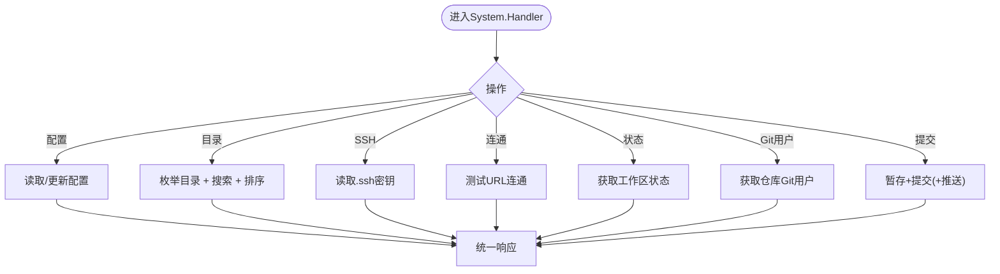

图表来源
- [system_service.go](file://biz/handler/system/system_service.go#L22-L269)

章节来源
- [system_service.go](file://biz/handler/system/system_service.go#L22-L269)

### 标签管理(Tag) Handler
职责与流程
- 列表：按仓库查询标签。
- 创建：支持显式标签名或“auto”自动递增版本；可选择推送至远端。
- 删除：当前未实现，返回不支持。

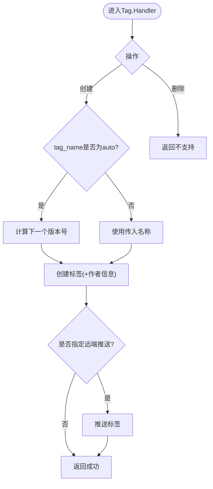

图表来源
- [tag_service.go](file://biz/handler/tag/tag_service.go#L16-L144)

章节来源
- [tag_service.go](file://biz/handler/tag/tag_service.go#L16-L144)

### 版本管理(Version) Handler
职责与流程
- 当前版本：基于describe获取仓库版本标识。
- 版本列表：获取所有标签作为版本列表。
- 下一版本：计算建议的下一版本信息。

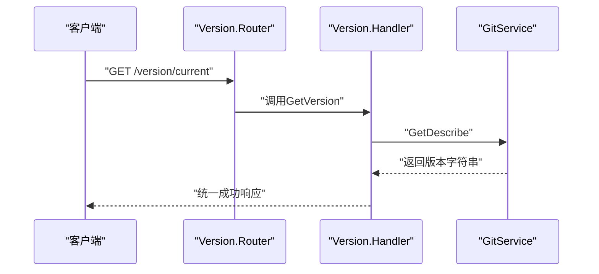

图表来源
- [version_service.go](file://biz/handler/version/version_service.go#L14-L88)

章节来源
- [version_service.go](file://biz/handler/version/version_service.go#L14-L88)

## 依赖分析
Handler层与Router层、中间件、响应封装、DAO层之间的耦合关系如下：

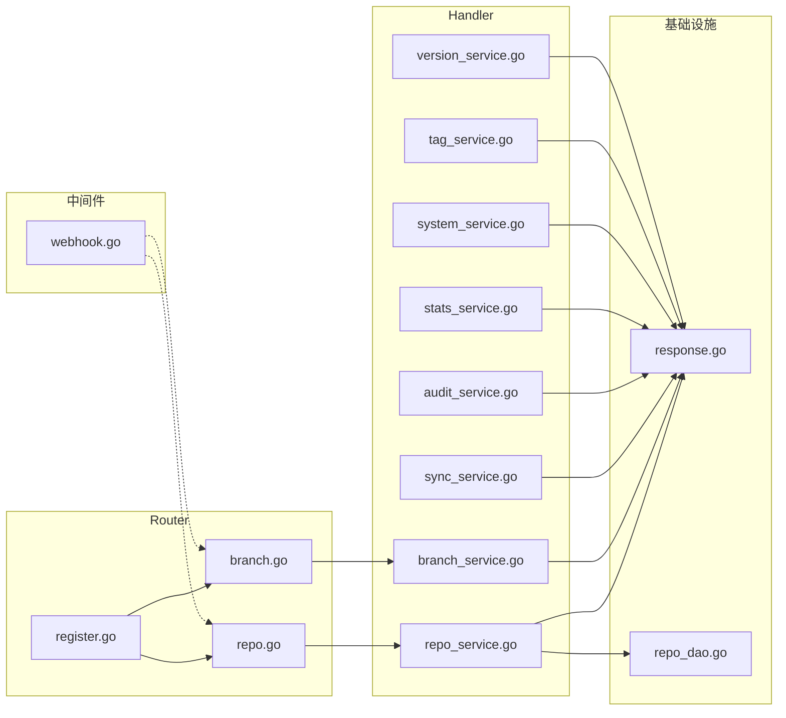

图表来源
- [register.go](file://biz/router/register.go#L18-L41)
- [repo.go](file://biz/router/repo/repo.go#L16-L38)
- [branch.go](file://biz/router/branch/branch.go#L16-L42)
- [webhook.go](file://biz/middleware/webhook.go#L18-L69)
- [response.go](file://pkg/response/response.go#L17-L86)
- [repo_dao.go](file://biz/dal/db/repo_dao.go#L13-L27)

章节来源
- [register.go](file://biz/router/register.go#L18-L41)
- [repo.go](file://biz/router/repo/repo.go#L16-L38)
- [branch.go](file://biz/router/branch/branch.go#L16-L42)
- [webhook.go](file://biz/middleware/webhook.go#L18-L69)
- [response.go](file://pkg/response/response.go#L17-L86)
- [repo_dao.go](file://biz/dal/db/repo_dao.go#L13-L27)

## 性能考虑
- 异步处理：克隆、统计、同步等耗时操作采用异步执行，Handler立即返回任务ID或202 Accepted，避免阻塞请求线程。
- 缓存与进度：统计分析支持“处理中”状态与进度反馈，前端可轮询获取最终结果。
- 分页与过滤：分支列表支持分页与关键词过滤，降低单次响应体积。
- 数据库访问：DAO层封装了常用CRUD，Handler应避免在Handler内做复杂查询，尽量通过DAO或Service层抽象。
- 中间件限流：Webhook中间件提供速率限制与签名验证，防止滥用与安全风险。

## 故障排查指南
- 参数错误：Handler普遍使用BindAndValidate，若失败会返回400，检查请求体结构与必填字段。
- 资源不存在：按key查询不到记录时返回404，确认key正确或记录是否存在。
- 服务器内部错误：DAO或Service异常时返回500，查看日志定位具体错误点。
- 并发与超时：异步任务需关注任务状态与日志，必要时增加重试或告警。
- 中间件拦截：Webhook中间件可能因IP白名单、签名或限流导致请求被拒绝，检查配置与请求头。

章节来源
- [response.go](file://pkg/response/response.go#L58-L86)
- [webhook.go](file://biz/middleware/webhook.go#L18-L69)

## 结论
Handler层以“薄而稳”的设计原则，承担请求接入、参数校验、调用Service与统一响应的职责。通过Router层的路由与中间件体系，Handler实现了高内聚、低耦合的业务入口。配合DAO层与Service层，Handler层能够稳定支撑多仓库、多分支的Git管理场景，并为扩展与维护提供了清晰的边界与规范。

## 附录

### Handler编写模式与最佳实践
- 请求绑定与校验：优先使用c.BindAndValidate，失败即早返回400。
- 统一响应：使用pkg/response.Success/Accepted/BadRequest/NotFound/InternalServerError，保持一致性。
- 中间件集成：在Router层挂载通用中间件（鉴权、限流、签名），Handler专注业务。
- 异步任务：耗时操作异步化，返回任务ID或202 Accepted，结合轮询或回调。
- 错误处理：DAO/Service层抛出的错误通过统一包装返回，避免泄露内部细节。
- 可观测性：关键操作记录审计日志，便于追踪与排障。

### Handler与Router协作关系
- Router在根路径下按/api/v1/xxx分组注册路由，并在各组挂载中间件。
- Handler函数签名固定为(ctx, *app.RequestContext)，直接处理请求并返回响应。
- 中间件链在Router层组装，Handler无需重复实现通用逻辑。

章节来源
- [repo.go](file://biz/router/repo/repo.go#L16-L38)
- [branch.go](file://biz/router/branch/branch.go#L16-L42)
- [webhook.go](file://biz/middleware/webhook.go#L18-L69)