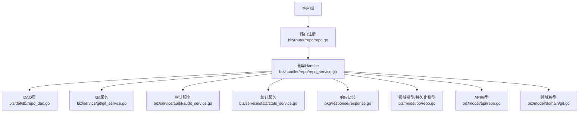
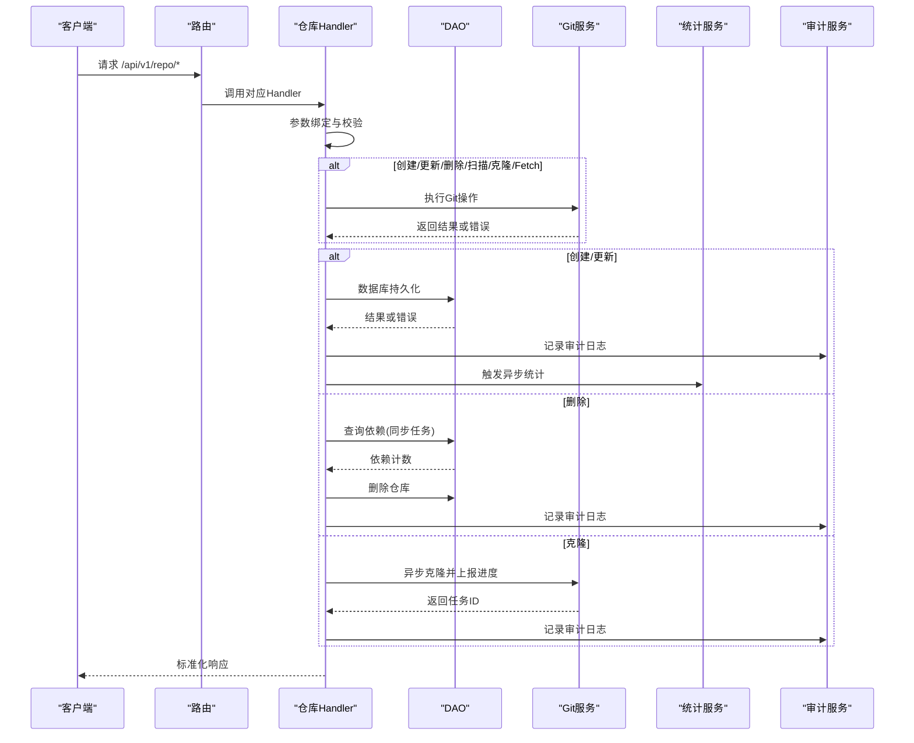
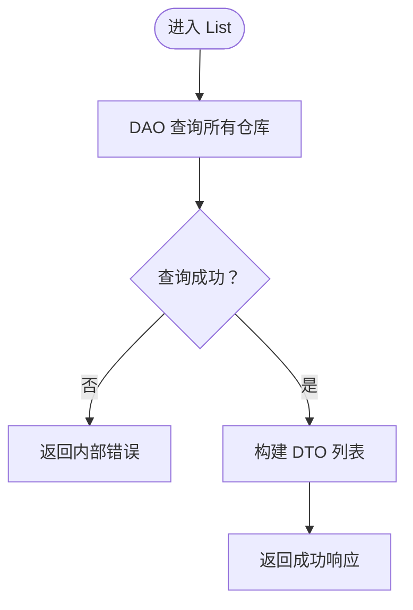
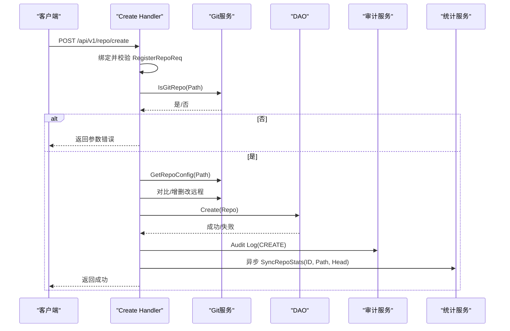
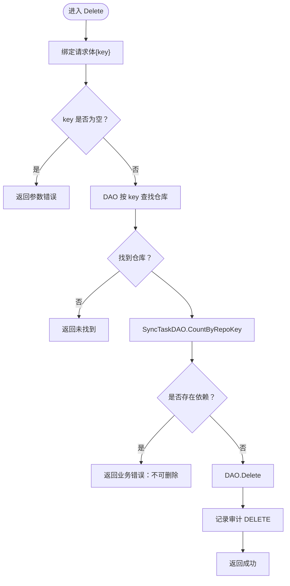
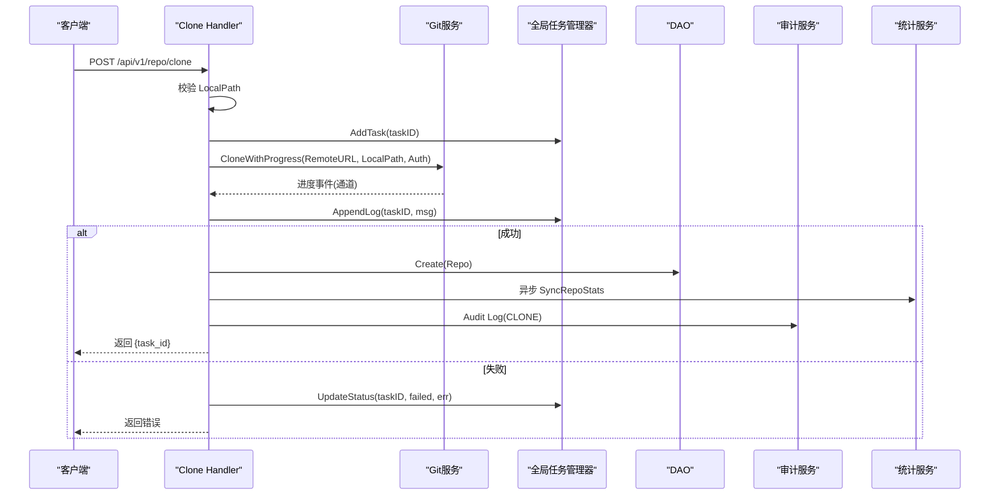
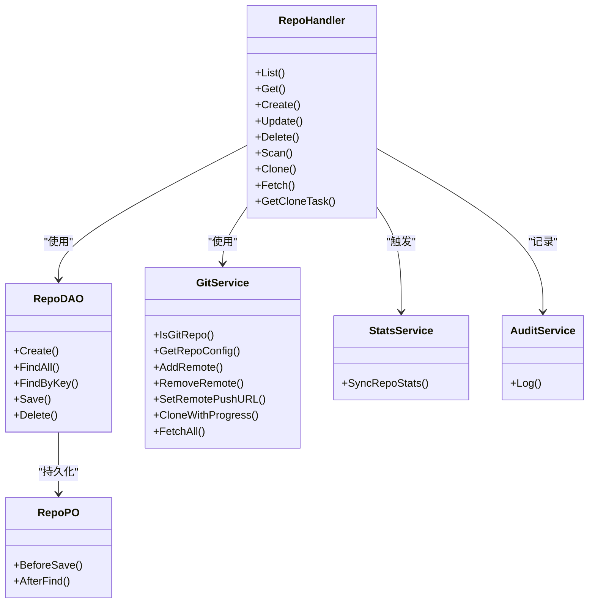

# 仓库管理Handler

<cite>
**本文引用的文件**
- [biz/handler/repo/repo_service.go](file://biz/handler/repo/repo_service.go)
- [biz/router/repo/repo.go](file://biz/router/repo/repo.go)
- [biz/service/git/git_service.go](file://biz/service/git/git_service.go)
- [biz/dal/db/repo_dao.go](file://biz/dal/db/repo_dao.go)
- [biz/model/po/repo.go](file://biz/model/po/repo.go)
- [biz/model/api/repo.go](file://biz/model/api/repo.go)
- [biz/service/audit/audit_service.go](file://biz/service/audit/audit_service.go)
- [biz/service/stats/stats_service.go](file://biz/service/stats/stats_service.go)
- [biz/model/domain/git.go](file://biz/model/domain/git.go)
- [biz/rpc_handler/git_handler.go](file://biz/rpc_handler/git_handler.go)
- [biz/router/repo/middleware.go](file://biz/router/repo/middleware.go)
- [pkg/response/response.go](file://pkg/response/response.go)
- [biz/dal/db/sync_task_dao.go](file://biz/dal/db/sync_task_dao.go)
</cite>

## 目录
1. [简介](#简介)
2. [项目结构](#项目结构)
3. [核心组件](#核心组件)
4. [架构总览](#架构总览)
5. [详细组件分析](#详细组件分析)
6. [依赖关系分析](#依赖关系分析)
7. [性能考量](#性能考量)
8. [故障排查指南](#故障排查指南)
9. [结论](#结论)
10. [附录](#附录)

## 简介
本文件面向仓库管理Handler的技术文档，系统性阐述仓库列表查询、详情获取、创建、更新、删除、扫描、克隆、拉取等核心功能的实现与交互。重点覆盖：
- Handler函数的参数校验、业务逻辑、数据库与Git操作集成
- 审计日志记录与异步统计任务触发机制
- 仓库删除时的依赖检查、克隆任务状态管理、Fetch操作细节
- 错误处理策略、响应格式化与最佳实践

## 项目结构
仓库管理Handler位于biz/handler/repo目录，路由注册在biz/router/repo，业务逻辑通过DAO层访问数据库，通过GitService执行Git操作，并使用StatsService触发异步统计，AuditService记录审计日志。

图表来源
- [biz/router/repo/repo.go](file://biz/router/repo/repo.go#L17-L37)
- [biz/handler/repo/repo_service.go](file://biz/handler/repo/repo_service.go#L21-L371)
- [biz/dal/db/repo_dao.go](file://biz/dal/db/repo_dao.go#L1-L42)
- [biz/service/git/git_service.go](file://biz/service/git/git_service.go#L1-L800)
- [biz/service/audit/audit_service.go](file://biz/service/audit/audit_service.go#L1-L51)
- [biz/service/stats/stats_service.go](file://biz/service/stats/stats_service.go#L1-L372)
- [pkg/response/response.go](file://pkg/response/response.go#L1-L87)
- [biz/model/po/repo.go](file://biz/model/po/repo.go#L1-L93)
- [biz/model/api/repo.go](file://biz/model/api/repo.go#L1-L77)
- [biz/model/domain/git.go](file://biz/model/domain/git.go#L1-L40)

章节来源
- [biz/router/repo/repo.go](file://biz/router/repo/repo.go#L17-L37)
- [biz/handler/repo/repo_service.go](file://biz/handler/repo/repo_service.go#L21-L371)

## 核心组件
- 路由注册：按HTTP方法与路径将Handler绑定到统一前缀下，便于统一中间件与版本化管理。
- Handler层：负责参数绑定与校验、调用DAO/Git/Stats/Audit服务、返回标准化响应。
- DAO层：封装对repos表的增删改查。
- Git服务：封装go-git与命令行git，支持鉴权、远程管理、克隆、拉取、分支信息等。
- 统计服务：基于git log流式解析，异步增量同步提交统计。
- 审计服务：异步记录操作行为，包含操作者、目标、详情、IP与UA。
- 响应封装：统一输出结构，包含业务码、消息、错误详情与数据体。

章节来源
- [biz/router/repo/repo.go](file://biz/router/repo/repo.go#L17-L37)
- [biz/handler/repo/repo_service.go](file://biz/handler/repo/repo_service.go#L21-L371)
- [biz/dal/db/repo_dao.go](file://biz/dal/db/repo_dao.go#L13-L41)
- [biz/service/git/git_service.go](file://biz/service/git/git_service.go#L129-L451)
- [biz/service/stats/stats_service.go](file://biz/service/stats/stats_service.go#L52-L139)
- [biz/service/audit/audit_service.go](file://biz/service/audit/audit_service.go#L23-L50)
- [pkg/response/response.go](file://pkg/response/response.go#L17-L87)

## 架构总览
Handler与各子系统的交互如下：

图表来源
- [biz/handler/repo/repo_service.go](file://biz/handler/repo/repo_service.go#L21-L371)
- [biz/service/git/git_service.go](file://biz/service/git/git_service.go#L197-L218)
- [biz/service/stats/stats_service.go](file://biz/service/stats/stats_service.go#L52-L139)
- [biz/service/audit/audit_service.go](file://biz/service/audit/audit_service.go#L23-L50)
- [pkg/response/response.go](file://pkg/response/response.go#L17-L87)

## 详细组件分析

### 列表查询 List
- 功能：返回所有仓库列表。
- 处理流程：
  - 调用DAO查询全部仓库。
  - 遍历结果转换为API DTO并返回。
- 错误处理：DAO查询失败返回内部错误。
- 审计：无直接审计记录。

图表来源
- [biz/handler/repo/repo_service.go](file://biz/handler/repo/repo_service.go#L21-L34)
- [biz/dal/db/repo_dao.go](file://biz/dal/db/repo_dao.go#L17-L21)

章节来源
- [biz/handler/repo/repo_service.go](file://biz/handler/repo/repo_service.go#L21-L34)
- [biz/dal/db/repo_dao.go](file://biz/dal/db/repo_dao.go#L17-L21)

### 详情获取 Get
- 功能：根据key获取仓库详情。
- 处理流程：
  - 校验key参数。
  - DAO按key查询仓库。
  - 不存在则返回未找到；存在则返回DTO。
- 错误处理：参数缺失、未找到、内部错误分别返回不同状态码。

章节来源
- [biz/handler/repo/repo_service.go](file://biz/handler/repo/repo_service.go#L36-L50)

### 仓库创建 Create
- 功能：注册本地已存在的Git仓库，可选同步远程配置。
- 参数校验：
  - 绑定RegisterRepoReq并进行结构体校验。
  - 校验Path是否为有效Git仓库。
- 远程配置同步：
  - 若提供Remotes，则读取现有配置，对比后增删改远程，必要时设置push URL。
- 数据持久化：
  - 生成唯一Key，填充字段，写入数据库。
- 审计与统计：
  - 记录CREATE审计。
  - 异步获取HEAD分支并触发统计同步。

图表来源
- [biz/handler/repo/repo_service.go](file://biz/handler/repo/repo_service.go#L52-L126)
- [biz/service/git/git_service.go](file://biz/service/git/git_service.go#L133-L136)
- [biz/service/git/git_service.go](file://biz/service/git/git_service.go#L357-L409)
- [biz/service/git/git_service.go](file://biz/service/git/git_service.go#L411-L451)
- [biz/service/stats/stats_service.go](file://biz/service/stats/stats_service.go#L52-L139)
- [biz/service/audit/audit_service.go](file://biz/service/audit/audit_service.go#L23-L50)

章节来源
- [biz/handler/repo/repo_service.go](file://biz/handler/repo/repo_service.go#L52-L126)
- [biz/model/api/repo.go](file://biz/model/api/repo.go#L10-L20)
- [biz/model/domain/git.go](file://biz/model/domain/git.go#L5-L24)
- [biz/service/git/git_service.go](file://biz/service/git/git_service.go#L133-L136)
- [biz/service/git/git_service.go](file://biz/service/git/git_service.go#L357-L451)
- [biz/service/stats/stats_service.go](file://biz/service/stats/stats_service.go#L52-L139)
- [biz/service/audit/audit_service.go](file://biz/service/audit/audit_service.go#L23-L50)

### 仓库更新 Update
- 功能：更新仓库元数据与远程配置。
- 参数校验：
  - 绑定并校验请求体，要求提供key。
  - 若Path变更，需再次校验为有效Git仓库。
- 远程配置同步：
  - 与Create类似，对比并同步Remotes。
- 数据持久化与审计：更新后写库并记录UPDATE审计。

章节来源
- [biz/handler/repo/repo_service.go](file://biz/handler/repo/repo_service.go#L128-L204)
- [biz/service/git/git_service.go](file://biz/service/git/git_service.go#L357-L451)

### 仓库删除 Delete
- 功能：删除仓库并进行依赖检查。
- 依赖检查：
  - 通过SyncTaskDAO统计该仓库是否被用作同步任务的源或目标。
  - 存在依赖则拒绝删除。
- 删除与审计：删除成功后记录DELETE审计。

图表来源
- [biz/handler/repo/repo_service.go](file://biz/handler/repo/repo_service.go#L206-L237)
- [biz/dal/db/sync_task_dao.go](file://biz/dal/db/sync_task_dao.go#L46-L52)

章节来源
- [biz/handler/repo/repo_service.go](file://biz/handler/repo/repo_service.go#L206-L237)
- [biz/dal/db/sync_task_dao.go](file://biz/dal/db/sync_task_dao.go#L46-L52)

### 仓库扫描 Scan
- 功能：扫描指定路径的Git仓库配置（远程、分支）。
- 处理流程：
  - 校验路径为有效Git仓库。
  - 读取配置并返回。

章节来源
- [biz/handler/repo/repo_service.go](file://biz/handler/repo/repo_service.go#L239-L261)
- [biz/service/git/git_service.go](file://biz/service/git/git_service.go#L357-L409)

### 仓库克隆 Clone
- 功能：从远端URL克隆到本地路径，返回任务ID，支持进度轮询。
- 处理流程：
  - 校验LocalPath不存在或不是Git仓库。
  - 生成任务ID并加入全局任务管理器。
  - 异步执行克隆，进度通过通道写入任务管理器。
  - 成功后创建仓库记录并触发统计同步。
- 审计：记录CLONE审计。

图表来源
- [biz/handler/repo/repo_service.go](file://biz/handler/repo/repo_service.go#L263-L327)
- [biz/service/git/git_service.go](file://biz/service/git/git_service.go#L197-L218)
- [biz/service/stats/stats_service.go](file://biz/service/stats/stats_service.go#L52-L139)
- [biz/service/audit/audit_service.go](file://biz/service/audit/audit_service.go#L23-L50)

章节来源
- [biz/handler/repo/repo_service.go](file://biz/handler/repo/repo_service.go#L263-L327)
- [biz/service/git/git_service.go](file://biz/service/git/git_service.go#L197-L218)
- [biz/service/stats/stats_service.go](file://biz/service/stats/stats_service.go#L52-L139)
- [biz/service/audit/audit_service.go](file://biz/service/audit/audit_service.go#L23-L50)

### 获取克隆任务 GetCloneTask
- 功能：根据task_id获取克隆进度与状态。
- 处理流程：
  - 校验task_id。
  - 从全局任务管理器读取任务并返回。

章节来源
- [biz/handler/repo/repo_service.go](file://biz/handler/repo/repo_service.go#L356-L370)

### 拉取 Fetch
- 功能：对指定仓库执行fetch-all。
- 处理流程：
  - 根据repo_key查找仓库。
  - 调用GitService.FetchAll。
  - 记录FETCH_REPO审计。

章节来源
- [biz/handler/repo/repo_service.go](file://biz/handler/repo/repo_service.go#L329-L354)
- [biz/service/git/git_service.go](file://biz/service/git/git_service.go#L138-L163)
- [biz/service/audit/audit_service.go](file://biz/service/audit/audit_service.go#L23-L50)

## 依赖关系分析
- Handler对DAO、Git、Stats、Audit的依赖清晰，职责单一。
- DAO与模型PO耦合，PO在保存/查找前后自动加密/解密敏感字段。
- GitService封装了go-git与命令行git，提供鉴权、远程管理、克隆、拉取等能力。
- StatsService提供异步统计同步，避免阻塞主流程。
- 审计服务异步落库，保证性能与可靠性。

图表来源
- [biz/handler/repo/repo_service.go](file://biz/handler/repo/repo_service.go#L21-L371)
- [biz/dal/db/repo_dao.go](file://biz/dal/db/repo_dao.go#L13-L41)
- [biz/service/git/git_service.go](file://biz/service/git/git_service.go#L129-L451)
- [biz/service/stats/stats_service.go](file://biz/service/stats/stats_service.go#L52-L139)
- [biz/service/audit/audit_service.go](file://biz/service/audit/audit_service.go#L23-L50)
- [biz/model/po/repo.go](file://biz/model/po/repo.go#L30-L92)

章节来源
- [biz/handler/repo/repo_service.go](file://biz/handler/repo/repo_service.go#L21-L371)
- [biz/dal/db/repo_dao.go](file://biz/dal/db/repo_dao.go#L13-L41)
- [biz/service/git/git_service.go](file://biz/service/git/git_service.go#L129-L451)
- [biz/service/stats/stats_service.go](file://biz/service/stats/stats_service.go#L52-L139)
- [biz/service/audit/audit_service.go](file://biz/service/audit/audit_service.go#L23-L50)
- [biz/model/po/repo.go](file://biz/model/po/repo.go#L30-L92)

## 性能考量
- 异步统计：创建/更新成功后启动后台任务，避免阻塞请求。
- 异步克隆：克隆过程通过通道推送进度，不占用请求线程。
- 缓存与批处理：统计服务对提交批量入库，减少数据库压力。
- 鉴权与远程管理：优先使用go-git鉴权，必要时回退命令行，兼顾兼容性与性能。

## 故障排查指南
- 参数错误：检查请求体绑定与校验，确保必填字段完整。
- 未找到资源：确认key或路径正确，DAO查询是否命中。
- 仓库非Git：创建/更新/扫描前先校验IsGitRepo。
- 远程配置异常：检查Remotes列表与push URL设置，必要时清理旧远程。
- 克隆失败：查看任务日志，确认鉴权方式与网络连通性。
- 删除受限：若返回“被同步任务使用”，请先删除相关任务再重试。
- 审计缺失：审计为异步落库，若未见记录，检查审计服务初始化与DAO创建。

章节来源
- [pkg/response/response.go](file://pkg/response/response.go#L58-L87)
- [biz/handler/repo/repo_service.go](file://biz/handler/repo/repo_service.go#L52-L126)
- [biz/handler/repo/repo_service.go](file://biz/handler/repo/repo_service.go#L206-L237)
- [biz/service/git/git_service.go](file://biz/service/git/git_service.go#L197-L218)
- [biz/service/audit/audit_service.go](file://biz/service/audit/audit_service.go#L44-L50)

## 结论
仓库管理Handler通过清晰的分层设计与完善的错误处理，实现了对Git仓库的全生命周期管理。结合异步统计与审计日志，既保证了用户体验，也满足了可观测性与合规需求。建议在生产环境中配合中间件与鉴权策略，持续优化远程配置同步与克隆进度展示体验。

## 附录
- 最佳实践
  - 在创建/更新仓库前，务必校验路径有效性与远程配置一致性。
  - 使用任务ID进行克隆进度轮询，避免阻塞UI。
  - 对敏感字段采用PO层加解密，确保数据库安全。
  - 删除仓库前先检查同步任务依赖，避免破坏数据一致性。
- 常见问题
  - “路径不是有效的Git仓库”：确认路径存在且包含.git目录。
  - “无法删除仓库”：清理关联的同步任务后再试。
  - “克隆失败”：检查鉴权类型与凭据、网络连通性与磁盘权限。