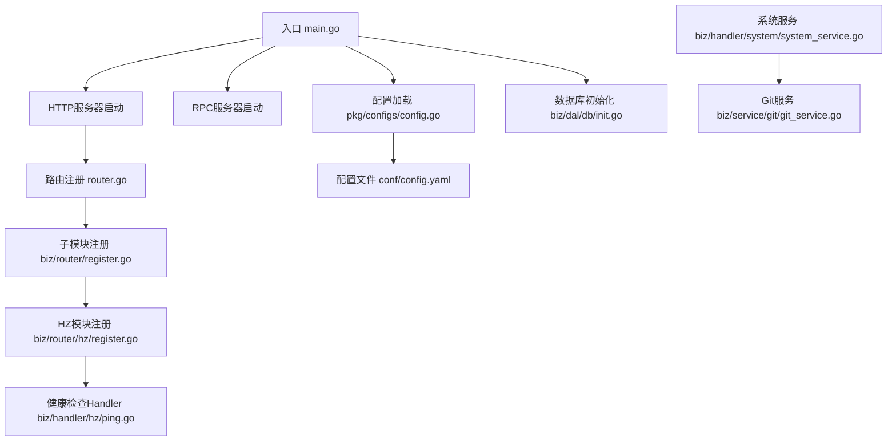
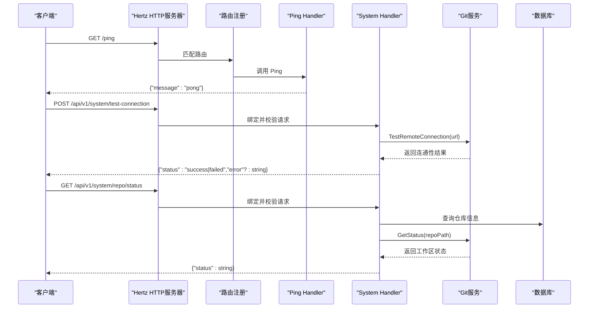
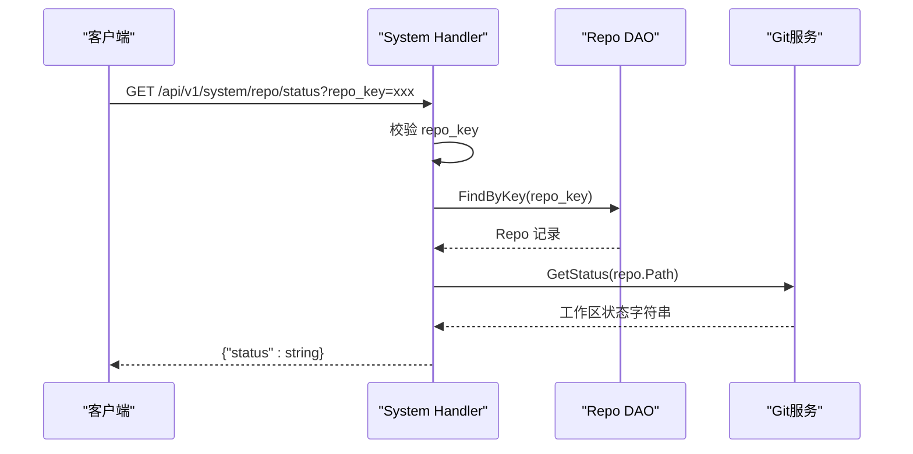
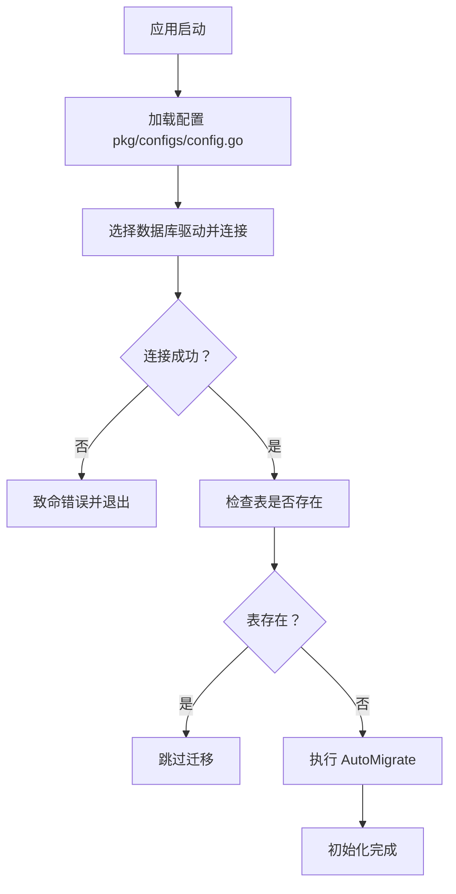
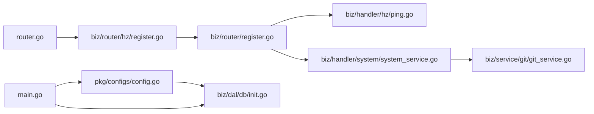

# 健康检查Handler

<cite>
**本文引用的文件**
- [main.go](file://main.go)
- [router.go](file://router.go)
- [biz/router/register.go](file://biz/router/register.go)
- [biz/router/hz/register.go](file://biz/router/hz/register.go)
- [biz/handler/hz/ping.go](file://biz/handler/hz/ping.go)
- [pkg/configs/config.go](file://pkg/configs/config.go)
- [biz/dal/db/init.go](file://biz/dal/db/init.go)
- [biz/handler/system/system_service.go](file://biz/handler/system/system_service.go)
- [biz/service/git/git_service.go](file://biz/service/git/git_service.go)
- [conf/config.yaml](file://conf/config.yaml)
</cite>

## 目录
1. [简介](#简介)
2. [项目结构](#项目结构)
3. [核心组件](#核心组件)
4. [架构总览](#架构总览)
5. [组件详解](#组件详解)
6. [依赖关系分析](#依赖关系分析)
7. [性能与可靠性](#性能与可靠性)
8. [故障排查指南](#故障排查指南)
9. [结论](#结论)
10. [附录](#附录)

## 简介
本文件聚焦于“健康检查Handler”的实现与使用，结合现有代码库中的HTTP路由与系统服务能力，给出可落地的健康检查方案。当前仓库中已存在一个基础的“/ping”端点用于快速存活探测；同时系统服务模块提供了数据库连通性、远程仓库可达性、Git仓库状态等更丰富的健康检查能力。本文将从端点定义、检查逻辑组织、响应格式设计、失败处理策略、监控集成与最佳实践等方面进行系统化说明。

## 项目结构
围绕健康检查的关键目录与文件如下：
- 入口与服务器启动：main.go
- 路由注册：router.go、biz/router/register.go、biz/router/hz/register.go
- 健康检查Handler：biz/handler/hz/ping.go
- 配置加载：pkg/configs/config.go、conf/config.yaml
- 数据库初始化与连通性：biz/dal/db/init.go
- 系统服务（含远程仓库连通性与仓库状态）：biz/handler/system/system_service.go、biz/service/git/git_service.go



图表来源
- [main.go](file://main.go#L52-L176)
- [router.go](file://router.go#L10-L15)
- [biz/router/register.go](file://biz/router/register.go#L18-L42)
- [biz/router/hz/register.go](file://biz/router/hz/register.go#L8-L12)
- [biz/handler/hz/ping.go](file://biz/handler/hz/ping.go#L13-L18)
- [pkg/configs/config.go](file://pkg/configs/config.go#L18-L42)
- [conf/config.yaml](file://conf/config.yaml#L1-L25)
- [biz/dal/db/init.go](file://biz/dal/db/init.go#L18-L71)
- [biz/handler/system/system_service.go](file://biz/handler/system/system_service.go#L142-L183)
- [biz/service/git/git_service.go](file://biz/service/git/git_service.go#L578-L592)

章节来源
- [main.go](file://main.go#L52-L176)
- [router.go](file://router.go#L10-L15)
- [biz/router/register.go](file://biz/router/register.go#L18-L42)
- [biz/router/hz/register.go](file://biz/router/hz/register.go#L8-L12)
- [biz/handler/hz/ping.go](file://biz/handler/hz/ping.go#L13-L18)
- [pkg/configs/config.go](file://pkg/configs/config.go#L18-L42)
- [conf/config.yaml](file://conf/config.yaml#L1-L25)
- [biz/dal/db/init.go](file://biz/dal/db/init.go#L18-L71)
- [biz/handler/system/system_service.go](file://biz/handler/system/system_service.go#L142-L183)
- [biz/service/git/git_service.go](file://biz/service/git/git_service.go#L578-L592)

## 核心组件
- 基础存活探测端点
  - 路径：/ping
  - 方法：GET
  - Handler：biz/handler/hz/ping.go
  - 响应：JSON，包含message字段
- 系统健康检查能力
  - 远程仓库连通性测试：/api/v1/system/test-connection
  - Git仓库状态查询：/api/v1/system/repo/status
  - 以上均位于biz/handler/system/system_service.go，并通过go-git调用实现

章节来源
- [biz/handler/hz/ping.go](file://biz/handler/hz/ping.go#L13-L18)
- [biz/handler/system/system_service.go](file://biz/handler/system/system_service.go#L142-L183)

## 架构总览
健康检查在当前系统中的位置如下：
- HTTP服务器启动后，统一注册所有模块路由
- /ping作为轻量级存活探针
- 系统服务模块提供数据库、Git仓库与远程仓库的健康检查能力
- 配置与数据库初始化在应用启动阶段完成，为健康检查提供基础保障



图表来源
- [router.go](file://router.go#L10-L15)
- [biz/handler/hz/ping.go](file://biz/handler/hz/ping.go#L13-L18)
- [biz/handler/system/system_service.go](file://biz/handler/system/system_service.go#L142-L183)
- [biz/service/git/git_service.go](file://biz/service/git/git_service.go#L578-L592)
- [biz/dal/db/init.go](file://biz/dal/db/init.go#L18-L71)

## 组件详解

### 基础存活探测：/ping
- 端点定义
  - 路由：router.go 中注册 GET /ping
  - 处理器：biz/handler/hz/ping.go 的 Ping 函数
- 响应格式
  - JSON对象，包含message字段
- 使用场景
  - 容器编排平台的liveness/readiness探针
  - 快速判断服务进程是否处于监听状态

章节来源
- [router.go](file://router.go#L10-L15)
- [biz/handler/hz/ping.go](file://biz/handler/hz/ping.go#L13-L18)

### 远程仓库连通性检测：/api/v1/system/test-connection
- 端点定义
  - 路由：系统模块注册（由biz/router/register.go统一注册）
  - 处理器：biz/handler/system/system_service.go 的 TestConnection
- 请求参数
  - URL：远程仓库地址（如HTTPS或SSH）
- 检查逻辑
  - 绑定并校验请求体
  - 通过Git服务的TestRemoteConnection方法尝试列出远程引用
  - 若返回错误则视为失败，否则成功
- 响应格式
  - 成功：{"status":"success"}
  - 失败：{"status":"failed","error":string}

```mermaid
flowchart TD
Start(["进入 /api/v1/system/test-connection"]) --> Bind["绑定并校验请求体"]
Bind --> Valid{"请求有效？"}
Valid --> |否| BadReq["返回 400 错误"]
Valid --> |是| CallGit["调用 GitService.TestRemoteConnection(url)"]
CallGit --> Ok{"连通性正常？"}
Ok --> |是| RespOk["返回 {status:\"success\"}"]
Ok --> |否| RespFail["返回 {status:\"failed\", error:string}"]
```

图表来源
- [biz/handler/system/system_service.go](file://biz/handler/system/system_service.go#L142-L158)
- [biz/service/git/git_service.go](file://biz/service/git/git_service.go#L578-L592)

章节来源
- [biz/handler/system/system_service.go](file://biz/handler/system/system_service.go#L142-L158)
- [biz/service/git/git_service.go](file://biz/service/git/git_service.go#L578-L592)

### Git仓库状态查询：/api/v1/system/repo/status
- 端点定义
  - 路由：系统模块注册
  - 处理器：biz/handler/system/system_service.go 的 GetRepoStatus
- 请求参数
  - repo_key：仓库标识
- 检查逻辑
  - 校验repo_key
  - 通过DAO根据key查询仓库记录
  - 调用Git服务获取工作区状态
- 响应格式
  - {"status":string}



图表来源
- [biz/handler/system/system_service.go](file://biz/handler/system/system_service.go#L160-L183)
- [biz/service/git/git_service.go](file://biz/service/git/git_service.go#L609-L623)

章节来源
- [biz/handler/system/system_service.go](file://biz/handler/system/system_service.go#L160-L183)
- [biz/service/git/git_service.go](file://biz/service/git/git_service.go#L609-L623)

### 数据库连通性与初始化
- 初始化流程
  - 应用启动时加载配置并初始化数据库
  - 支持sqlite/mysql/postgres三种类型
  - 若表不存在则自动迁移
- 健康判定
  - 初始化阶段若连接或迁移失败会直接终止进程
  - 运行期可通过其他端点间接反映数据库健康（如系统服务查询）



图表来源
- [pkg/configs/config.go](file://pkg/configs/config.go#L18-L42)
- [biz/dal/db/init.go](file://biz/dal/db/init.go#L18-L71)
- [conf/config.yaml](file://conf/config.yaml#L7-L19)

章节来源
- [pkg/configs/config.go](file://pkg/configs/config.go#L18-L42)
- [biz/dal/db/init.go](file://biz/dal/db/init.go#L18-L71)
- [conf/config.yaml](file://conf/config.yaml#L7-L19)

## 依赖关系分析
- 路由层
  - router.go 将HZ模块路由注册到Hertz服务器
  - biz/router/register.go 统一注册各业务模块路由
  - biz/router/hz/register.go 将HZ模块路由委托给统一注册器
- 处理器层
  - /ping 仅依赖Hertz框架
  - 系统服务处理器依赖Git服务与数据库访问层
- 服务层
  - Git服务基于go-git实现远程列表、状态查询等操作
- 配置与数据层
  - 配置加载影响数据库类型与连接参数
  - 数据库初始化为健康检查提供运行期基础



图表来源
- [router.go](file://router.go#L10-L15)
- [biz/router/hz/register.go](file://biz/router/hz/register.go#L8-L12)
- [biz/router/register.go](file://biz/router/register.go#L18-L42)
- [biz/handler/hz/ping.go](file://biz/handler/hz/ping.go#L13-L18)
- [biz/handler/system/system_service.go](file://biz/handler/system/system_service.go#L142-L183)
- [biz/service/git/git_service.go](file://biz/service/git/git_service.go#L578-L592)
- [main.go](file://main.go#L115-L134)
- [pkg/configs/config.go](file://pkg/configs/config.go#L18-L42)
- [biz/dal/db/init.go](file://biz/dal/db/init.go#L18-L71)

章节来源
- [router.go](file://router.go#L10-L15)
- [biz/router/hz/register.go](file://biz/router/hz/register.go#L8-L12)
- [biz/router/register.go](file://biz/router/register.go#L18-L42)
- [biz/handler/hz/ping.go](file://biz/handler/hz/ping.go#L13-L18)
- [biz/handler/system/system_service.go](file://biz/handler/system/system_service.go#L142-L183)
- [biz/service/git/git_service.go](file://biz/service/git/git_service.go#L578-L592)
- [main.go](file://main.go#L115-L134)
- [pkg/configs/config.go](file://pkg/configs/config.go#L18-L42)
- [biz/dal/db/init.go](file://biz/dal/db/init.go#L18-L71)

## 性能与可靠性
- 端点复杂度
  - /ping：纯内存JSON响应，开销极低
  - /test-connection：涉及网络IO与Git协议交互，耗时取决于远端仓库可达性
  - /repo/status：读取本地仓库状态，通常较快
- 超时与并发
  - 当前Handler未显式设置超时，建议在生产环境为远程仓库检测增加context.WithTimeout
- 失败处理策略
  - /ping：无外部依赖，失败概率低
  - /test-connection：失败即返回错误信息，便于快速定位
  - /repo/status：DAO查询失败或Git命令异常时返回相应错误码
- 降级建议
  - 对于高可用部署，可将/healthz或/readyz映射到更严格的组合检查（数据库+远程仓库），并在单一检查失败时返回非2xx状态码

[本节为通用指导，不直接分析具体文件]

## 故障排查指南
- /ping无法访问
  - 检查路由是否正确注册（router.go）
  - 检查服务器端口与防火墙（conf/config.yaml）
- /test-connection失败
  - 确认URL格式与认证方式（HTTP Basic或SSH）
  - 检查网络连通性与代理设置
  - 查看Git服务日志（DebugMode开启时）
- /repo/status返回错误
  - 确认repo_key正确且仓库路径存在
  - 检查Git工作区状态与权限
- 数据库不可用
  - 检查数据库类型与连接参数
  - 确认表已迁移或允许自动迁移

章节来源
- [router.go](file://router.go#L10-L15)
- [conf/config.yaml](file://conf/config.yaml#L1-L25)
- [biz/handler/system/system_service.go](file://biz/handler/system/system_service.go#L142-L183)
- [biz/service/git/git_service.go](file://biz/service/git/git_service.go#L578-L592)
- [biz/dal/db/init.go](file://biz/dal/db/init.go#L18-L71)

## 结论
当前仓库提供了基础的存活探针与系统级健康检查能力。/ping适合轻量级存活探测；/test-connection与/repo/status覆盖了远程仓库连通性与本地仓库状态两大关键维度。建议在生产环境中：
- 为远程仓库检测增加超时控制
- 将多个健康检查组合为更严格的就绪/存活探针
- 在监控系统中采集这些端点的响应时间与成功率
- 结合日志与告警策略进行故障预警

[本节为总结性内容，不直接分析具体文件]

## 附录

### 端点一览与响应格式
- GET /ping
  - 响应：{"message":"pong"}
- POST /api/v1/system/test-connection
  - 请求：{"url":string}
  - 响应：{"status":"success"} 或 {"status":"failed","error":string}
- GET /api/v1/system/repo/status
  - 查询参数：repo_key
  - 响应：{"status":string}

章节来源
- [biz/handler/hz/ping.go](file://biz/handler/hz/ping.go#L13-L18)
- [biz/handler/system/system_service.go](file://biz/handler/system/system_service.go#L142-L183)