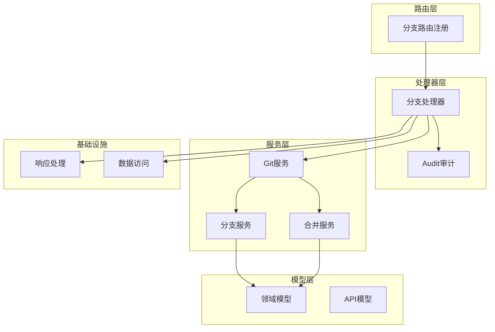
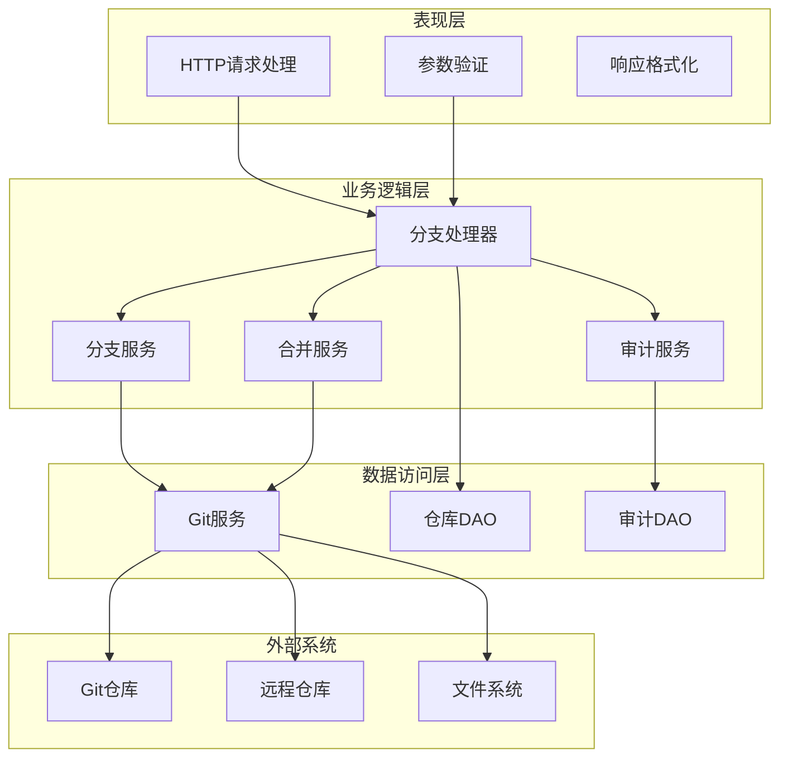
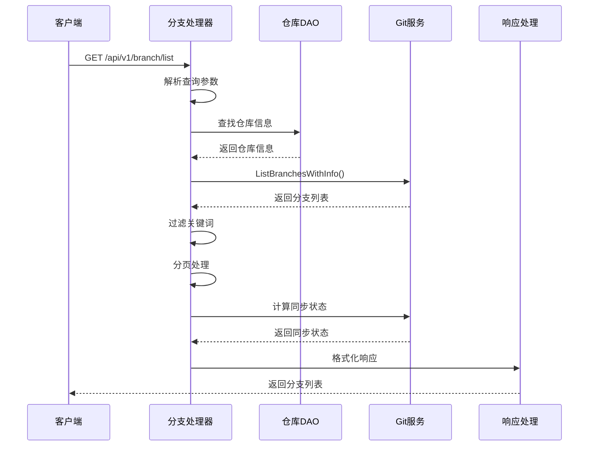
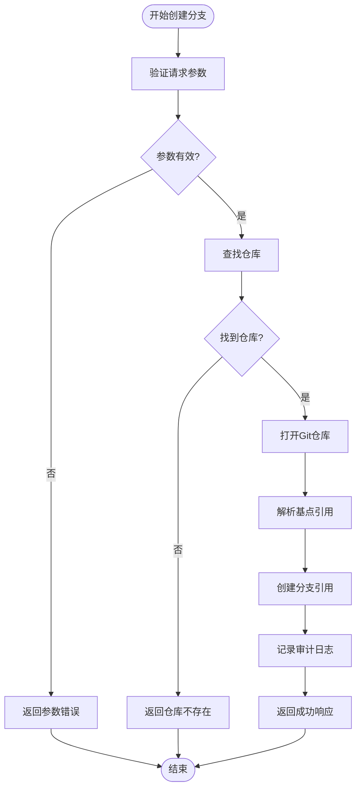
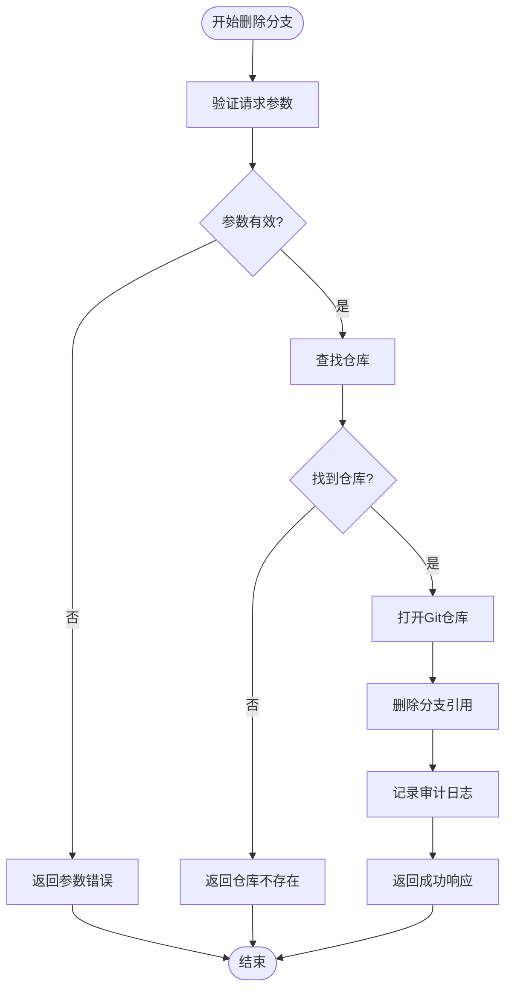
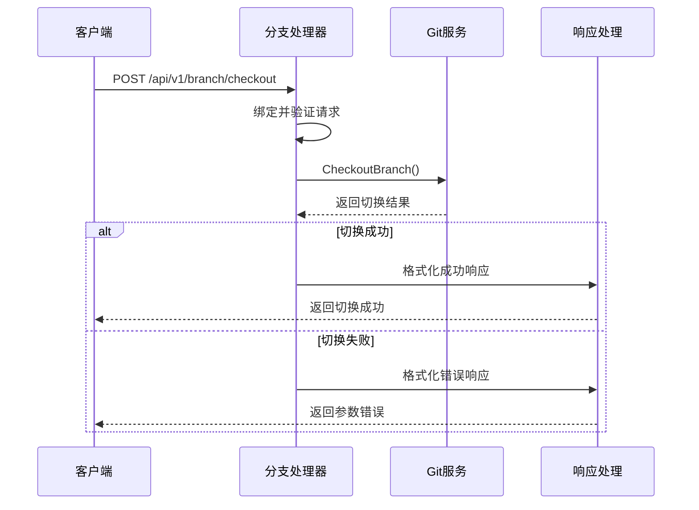
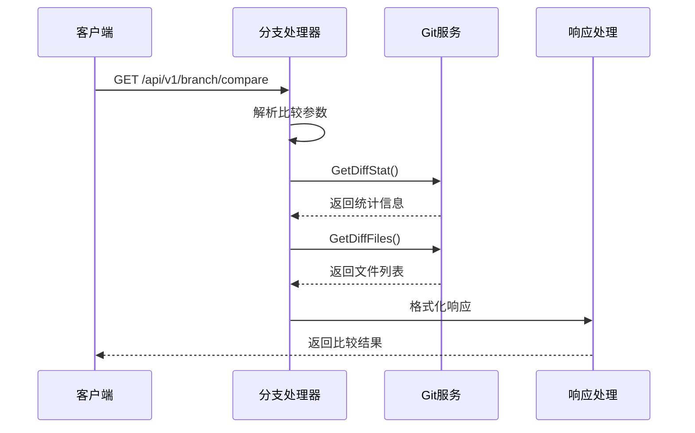
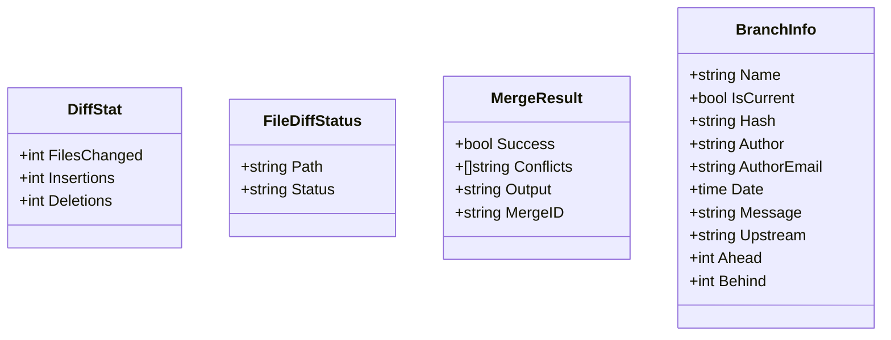
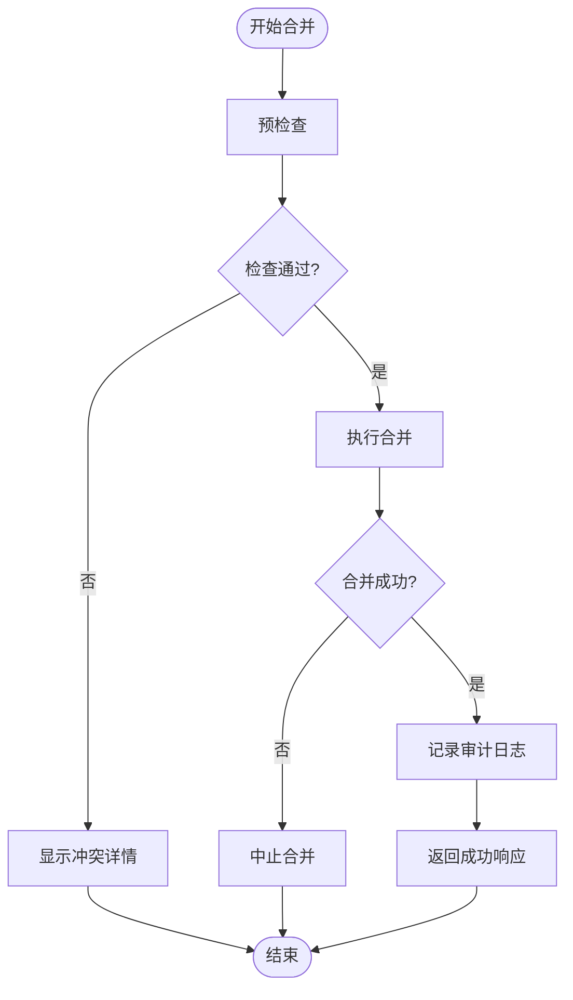
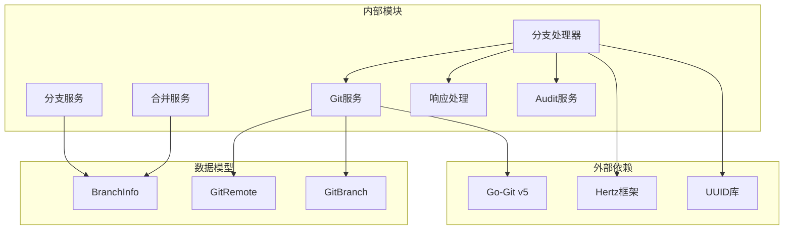

# 分支管理Handler

<cite>
**本文档引用的文件**
- [branch_service.go](file://biz/handler/branch/branch_service.go)
- [branch.go](file://biz/router/branch/branch.go)
- [git_branch.go](file://biz/service/git/git_branch.go)
- [git_branch_sync.go](file://biz/service/git/git_branch_sync.go)
- [git_merge.go](file://biz/service/git/git_merge.go)
- [git_service.go](file://biz/service/git/git_service.go)
- [branch.go](file://biz/model/api/branch.go)
- [branch.proto](file://idl/biz/branch.proto)
- [git.go](file://biz/model/domain/git.go)
- [response.go](file://pkg/response/response.go)
</cite>

## 目录
1. [简介](#简介)
2. [项目结构](#项目结构)
3. [核心组件](#核心组件)
4. [架构概览](#架构概览)
5. [详细组件分析](#详细组件分析)
6. [依赖关系分析](#依赖关系分析)
7. [性能考虑](#性能考虑)
8. [故障排除指南](#故障排除指南)
9. [结论](#结论)

## 简介

分支管理Handler是Git管理服务中的核心模块，负责提供完整的Git分支生命周期管理功能。该模块实现了从分支查询、创建、删除到切换、比较等全方位的分支操作，为用户提供了一个统一的Git分支管理接口。

本模块基于Go-Git库和原生命令行工具，结合了高性能的内存操作和成熟的Git命令行工具优势，确保了分支操作的可靠性和效率。系统支持多种分支操作模式，包括快速前进更新、合并冲突检测、差异比较等功能。

## 项目结构

分支管理模块采用分层架构设计，清晰分离了路由层、处理器层、服务层和数据访问层：



**图表来源**
- [branch.go](file://biz/router/branch/branch.go#L17-L42)
- [branch_service.go](file://biz/handler/branch/branch_service.go#L24-L522)

**章节来源**
- [branch_service.go](file://biz/handler/branch/branch_service.go#L1-L522)
- [branch.go](file://biz/router/branch/branch.go#L1-L43)

## 核心组件

分支管理模块包含以下核心组件：

### 1. 分支处理器 (Branch Handler)
- **职责**: 处理HTTP请求，执行业务逻辑，返回标准化响应
- **特点**: 集成参数验证、错误处理、审计日志记录
- **覆盖功能**: 分支列表查询、创建、删除、更新、切换、推送、拉取、比较、合并

### 2. Git服务 (Git Service)
- **职责**: 封装Git操作，提供统一的Git命令接口
- **特点**: 支持go-git库和原生命令行工具的混合使用
- **覆盖功能**: 分支操作、远程操作、合并操作、差异计算

### 3. 分支服务 (Branch Service)
- **职责**: 实现具体的分支业务逻辑
- **特点**: 提供分支信息获取、同步状态计算、描述设置等功能
- **覆盖功能**: 分支列表、创建、删除、重命名、描述设置

### 4. 合并服务 (Merge Service)
- **职责**: 处理分支合并相关的复杂逻辑
- **特点**: 支持冲突检测、差异分析、合并执行
- **覆盖功能**: 合并预检查、冲突分析、实际合并

**章节来源**
- [branch_service.go](file://biz/handler/branch/branch_service.go#L22-L522)
- [git_service.go](file://biz/service/git/git_service.go#L27-L800)

## 架构概览

分支管理模块采用经典的三层架构模式，各层职责明确，耦合度低：



**图表来源**
- [branch_service.go](file://biz/handler/branch/branch_service.go#L24-L522)
- [git_service.go](file://biz/service/git/git_service.go#L27-L800)

## 详细组件分析

### 分支列表查询 (List)

分支列表查询功能提供了完整的分支信息展示，包括基础信息、同步状态和分页支持。



**图表来源**
- [branch_service.go](file://biz/handler/branch/branch_service.go#L24-L92)
- [git_branch.go](file://biz/service/git/git_branch.go#L13-L79)

#### 关键特性

1. **智能过滤**: 支持按分支名称和作者进行关键词搜索
2. **分页机制**: 默认每页100条记录，支持自定义页面大小
3. **同步状态**: 自动计算每个分支与上游的领先/落后数量
4. **性能优化**: 使用Go-Git库高效遍历引用

**章节来源**
- [branch_service.go](file://biz/handler/branch/branch_service.go#L24-L92)
- [git_branch.go](file://biz/service/git/git_branch.go#L13-L79)

### 分支创建 (Create)

分支创建功能支持从指定基点创建新分支，提供了灵活的创建选项。



**图表来源**
- [branch_service.go](file://biz/handler/branch/branch_service.go#L94-L124)
- [git_branch.go](file://biz/service/git/git_branch.go#L81-L106)

#### 参数验证机制

- **仓库键**: 必填参数，用于定位目标仓库
- **分支名称**: 必填参数，遵循Git命名规范
- **基点引用**: 可选参数，默认使用HEAD

#### 安全检查

- **仓库存在性检查**: 确保目标仓库存在且可访问
- **引用解析**: 验证基点引用的有效性
- **分支唯一性**: 确保新分支名称不与现有分支冲突

**章节来源**
- [branch_service.go](file://biz/handler/branch/branch_service.go#L94-L124)
- [git_branch.go](file://biz/service/git/git_branch.go#L81-L106)

### 分支删除 (Delete)

分支删除功能提供了安全的分支清理机制，支持强制删除选项。



**图表来源**
- [branch_service.go](file://biz/handler/branch/branch_service.go#L126-L156)
- [git_branch.go](file://biz/service/git/git_branch.go#L108-L116)

#### 删除策略

- **软删除**: 默认行为，仅删除分支引用
- **强制删除**: 当force=true时，即使分支有未推送更改也会被删除
- **安全检查**: 验证分支名称的有效性和存在性

**章节来源**
- [branch_service.go](file://biz/handler/branch/branch_service.go#L126-L156)
- [git_branch.go](file://biz/service/git/git_branch.go#L108-L116)

### 分支切换 (Checkout)

分支切换功能提供了快速的分支切换能力，支持强制切换选项。



**图表来源**
- [branch_service.go](file://biz/handler/branch/branch_service.go#L205-L233)
- [git_service.go](file://biz/service/git/git_service.go#L594-L607)

#### 切换机制

- **工作区切换**: 使用Go-Git的Worktree切换到目标分支
- **强制模式**: 支持强制切换，忽略本地更改
- **引用解析**: 自动解析分支引用，支持简写形式

**章节来源**
- [branch_service.go](file://biz/handler/branch/branch_service.go#L205-L233)
- [git_service.go](file://biz/service/git/git_service.go#L594-L607)

### 分支比较 (Compare)

分支比较功能提供了强大的差异分析能力，支持统计信息和文件级差异。



**图表来源**
- [branch_service.go](file://biz/handler/branch/branch_service.go#L352-L388)
- [git_merge.go](file://biz/service/git/git_merge.go#L21-L94)

#### 数据结构设计



**图表来源**
- [git_merge.go](file://biz/service/git/git_merge.go#L10-L217)
- [git.go](file://biz/model/domain/git.go#L26-L39)

#### 差异计算算法

1. **提交解析**: 使用Go-Git解析基点和目标提交
2. **补丁生成**: 生成两个提交之间的补丁对象
3. **统计计算**: 遍历补丁文件，计算变更统计
4. **文件分类**: 根据文件状态(A/M/D/R)进行分类

**章节来源**
- [branch_service.go](file://biz/handler/branch/branch_service.go#L352-L388)
- [git_merge.go](file://biz/service/git/git_merge.go#L21-L94)

### 合并操作 (Merge)

合并操作提供了完整的冲突检测和处理机制。



**图表来源**
- [branch_service.go](file://biz/handler/branch/branch_service.go#L437-L496)
- [git_merge.go](file://biz/service/git/git_merge.go#L157-L242)

#### 冲突检测机制

1. **文件重叠分析**: 检查源分支和目标分支修改的文件是否重叠
2. **状态标记**: 将冲突文件标记为需要人工处理
3. **报告生成**: 生成详细的冲突报告，包含冲突文件列表

**章节来源**
- [branch_service.go](file://biz/handler/branch/branch_service.go#L437-L496)
- [git_merge.go](file://biz/service/git/git_merge.go#L157-L242)

## 依赖关系分析

分支管理模块的依赖关系清晰明确，各组件之间耦合度低，便于维护和扩展。



**图表来源**
- [branch_service.go](file://biz/handler/branch/branch_service.go#L5-L20)
- [git_service.go](file://biz/service/git/git_service.go#L3-L25)

### 关键依赖特性

1. **Go-Git集成**: 充分利用Go-Git的高性能和类型安全
2. **Hertz框架**: 基于云音乐Hertz框架的现代化Web开发
3. **UUID生成**: 使用标准UUID库确保审计标识符的唯一性
4. **类型安全**: 所有数据结构都经过精心设计，确保类型安全

**章节来源**
- [branch_service.go](file://biz/handler/branch/branch_service.go#L5-L20)
- [git_service.go](file://biz/service/git/git_service.go#L3-L25)

## 性能考虑

分支管理模块在设计时充分考虑了性能优化，采用了多种策略来提升系统性能：

### 1. 缓存策略
- **分支信息缓存**: 分支列表查询结果在短时间内缓存
- **同步状态计算**: 按需计算，避免不必要的重复计算
- **Git对象缓存**: Go-Git库自动管理对象缓存

### 2. 异步处理
- **批量操作**: 支持多远程同时推送
- **流式处理**: 大文件差异采用流式处理
- **并发控制**: 合理的并发限制，避免资源竞争

### 3. 内存优化
- **分页加载**: 大列表采用分页机制
- **延迟计算**: 复杂计算按需触发
- **资源释放**: 及时释放Git对象和连接

### 4. 网络优化
- **SSH密钥复用**: SSH认证信息复用
- **连接池**: 远程操作使用连接池
- **进度回调**: 支持长操作的进度反馈

## 故障排除指南

### 常见问题及解决方案

#### 1. 分支操作失败
**症状**: 分支创建/删除/切换操作返回错误
**可能原因**:
- 仓库路径无效或不可访问
- 权限不足
- 分支名称不符合Git规范

**解决方法**:
```go
// 检查仓库是否存在
repo, err := db.NewRepoDAO().FindByKey(repoKey)
if err != nil {
    response.NotFound(c, "repo not found")
    return
}

// 验证分支名称
if !isValidBranchName(name) {
    response.BadRequest(c, "invalid branch name")
    return
}
```

#### 2. 合并冲突
**症状**: 合并操作返回冲突错误
**可能原因**:
- 源分支和目标分支修改了同一文件的同一区域
- 存在未提交的本地更改

**解决方法**:
```go
// 合并前进行预检查
result, err := gitSvc.MergeDryRun(repo.Path, source, target)
if err != nil {
    response.InternalServerError(c, err.Error())
    return
}

if !result.Success {
    // 返回冲突详情
    response.Conflict(c, "Merge conflict detected")
    return
}
```

#### 3. 远程操作失败
**症状**: 推送/拉取操作失败
**可能原因**:
- 网络连接问题
- 认证失败
- 远程仓库权限不足

**解决方法**:
```go
// 检测SSH认证
auth := s.detectSSHAuth(remoteURL)
if auth == nil {
    response.Unauthorized(c, "Authentication required")
    return
}
```

### 调试技巧

1. **启用调试模式**: 设置DebugMode环境变量查看详细日志
2. **检查Git配置**: 确认Git用户配置正确
3. **验证权限**: 确保对仓库目录有足够权限
4. **网络诊断**: 检查网络连接和防火墙设置

**章节来源**
- [branch_service.go](file://biz/handler/branch/branch_service.go#L32-L42)
- [git_service.go](file://biz/service/git/git_service.go#L35-L48)

## 结论

分支管理Handler模块是一个设计精良、功能完整的Git分支管理解决方案。它通过清晰的分层架构、完善的错误处理机制和高效的性能优化，为用户提供了可靠的分支管理能力。

### 主要优势

1. **功能完整性**: 覆盖了Git分支管理的所有核心功能
2. **性能优异**: 采用Go-Git库和原生命令行工具的混合架构
3. **安全性强**: 包含完善的参数验证和安全检查机制
4. **可扩展性好**: 清晰的架构设计便于功能扩展和维护

### 技术特色

1. **混合架构**: 结合Go-Git库的高性能和原生命令行工具的成熟性
2. **智能缓存**: 智能的缓存策略提升用户体验
3. **冲突检测**: 完善的合并冲突检测和处理机制
4. **审计日志**: 全面的审计功能确保操作可追溯

该模块为Git管理服务提供了坚实的分支管理基础，能够满足各种复杂的分支管理需求，是现代Git管理系统的优秀实现。