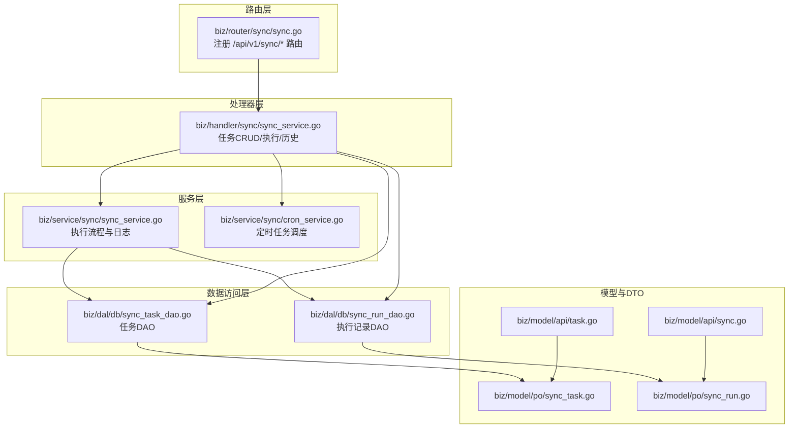
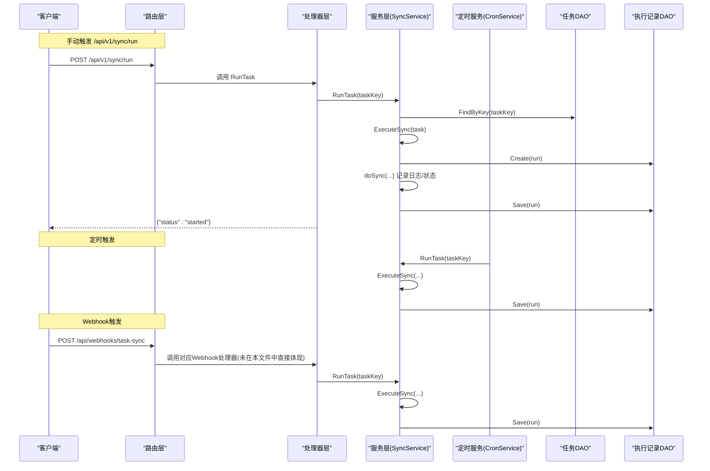
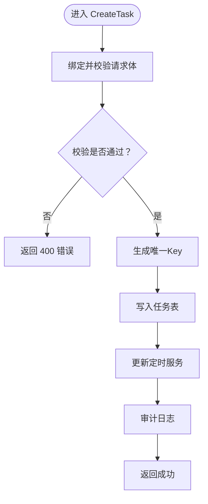
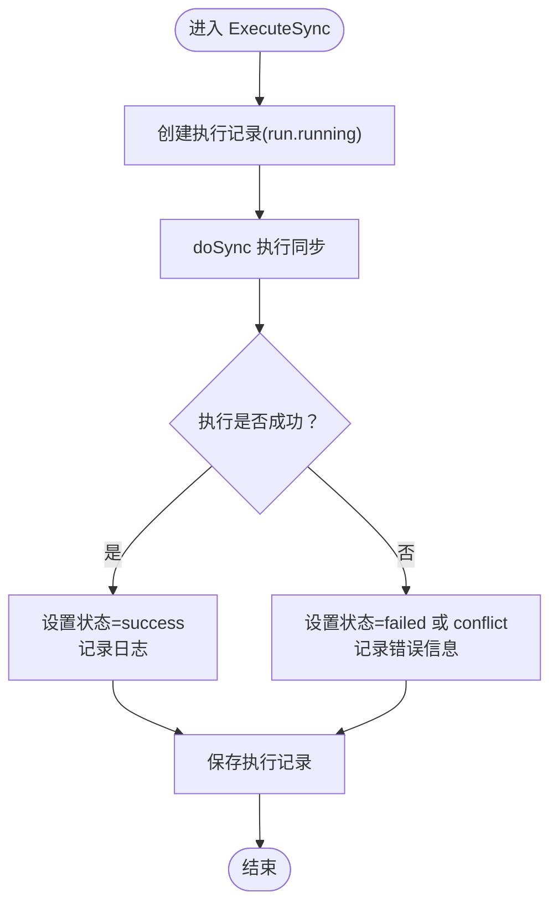
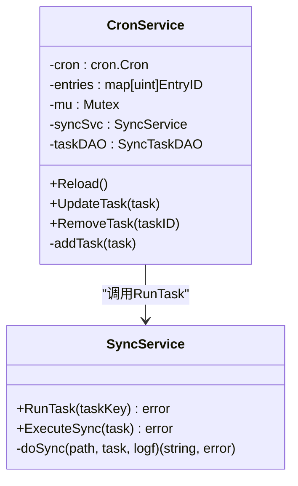
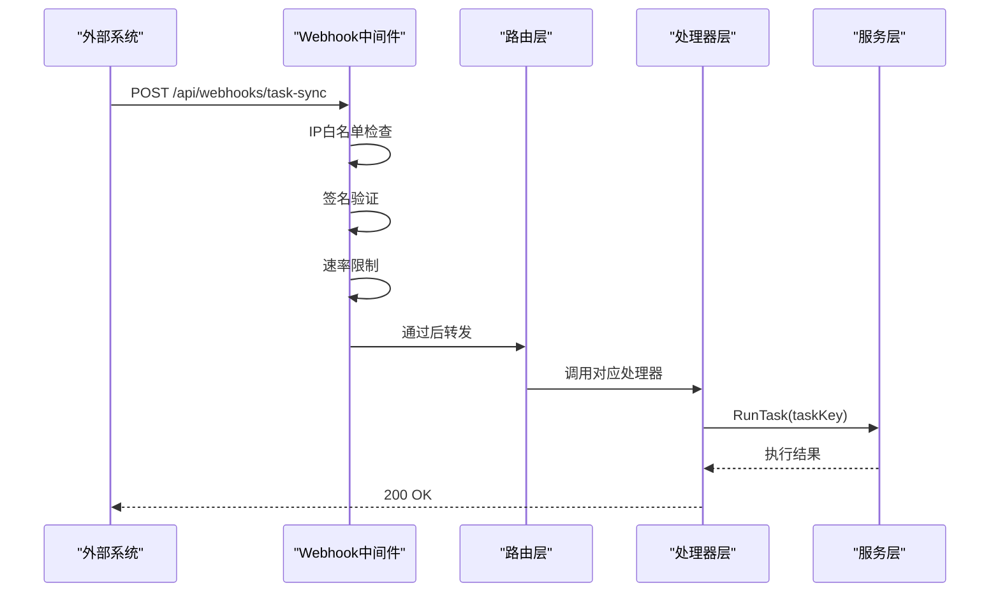
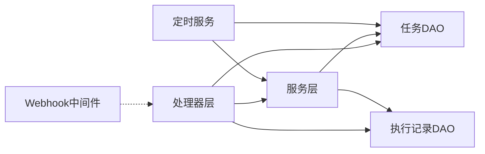

# 同步服务Handler

<cite>
**本文引用的文件**
- [biz/handler/sync/sync_service.go](file://biz/handler/sync/sync_service.go)
- [biz/service/sync/sync_service.go](file://biz/service/sync/sync_service.go)
- [biz/service/sync/cron_service.go](file://biz/service/sync/cron_service.go)
- [biz/router/sync/sync.go](file://biz/router/sync/sync.go)
- [biz/dal/db/sync_task_dao.go](file://biz/dal/db/sync_task_dao.go)
- [biz/dal/db/sync_run_dao.go](file://biz/dal/db/sync_run_dao.go)
- [biz/model/po/sync_task.go](file://biz/model/po/sync_task.go)
- [biz/model/po/sync_run.go](file://biz/model/po/sync_run.go)
- [biz/model/api/sync.go](file://biz/model/api/sync.go)
- [biz/model/api/task.go](file://biz/model/api/task.go)
- [biz/middleware/webhook.go](file://biz/middleware/webhook.go)
- [pkg/configs/config.go](file://pkg/configs/config.go)
- [docs/webhook.md](file://docs/webhook.md)
</cite>

## 目录
1. [简介](#简介)
2. [项目结构](#项目结构)
3. [核心组件](#核心组件)
4. [架构总览](#架构总览)
5. [详细组件分析](#详细组件分析)
6. [依赖关系分析](#依赖关系分析)
7. [性能考虑](#性能考虑)
8. [故障排查指南](#故障排查指南)
9. [结论](#结论)
10. [附录](#附录)

## 简介
本文件面向“同步服务Handler”的技术文档，系统性阐述同步任务的Handler实现与运行机制，覆盖以下主题：
- 同步任务的创建、查询、更新、删除与执行
- 任务生命周期管理：参数校验、调度、状态跟踪与结果记录
- 触发方式：手动执行、定时任务触发、Webhook触发
- 执行过程中的进度跟踪、错误处理与日志记录
- 任务队列管理、并发控制与异常恢复策略
- 性能优化与故障排查建议

## 项目结构
同步服务Handler位于业务层biz/handler/sync，配合service层的任务执行逻辑、DAO层的数据持久化以及路由层的接口注册。

图表来源
- [biz/router/sync/sync.go](file://biz/router/sync/sync.go#L17-L40)
- [biz/handler/sync/sync_service.go](file://biz/handler/sync/sync_service.go#L19-L258)
- [biz/service/sync/sync_service.go](file://biz/service/sync/sync_service.go#L13-L263)
- [biz/service/sync/cron_service.go](file://biz/service/sync/cron_service.go#L14-L101)
- [biz/dal/db/sync_task_dao.go](file://biz/dal/db/sync_task_dao.go#L7-L67)
- [biz/dal/db/sync_run_dao.go](file://biz/dal/db/sync_run_dao.go#L7-L40)
- [biz/model/po/sync_task.go](file://biz/model/po/sync_task.go#L8-L29)
- [biz/model/po/sync_run.go](file://biz/model/po/sync_run.go#L9-L26)
- [biz/model/api/sync.go](file://biz/model/api/sync.go#L9-L41)
- [biz/model/api/task.go](file://biz/model/api/task.go#L9-L66)

章节来源
- [biz/router/sync/sync.go](file://biz/router/sync/sync.go#L17-L40)
- [biz/handler/sync/sync_service.go](file://biz/handler/sync/sync_service.go#L19-L258)

## 核心组件
- 路由注册：统一在路由模块中注册同步相关接口，便于集中管理与扩展。
- Handler（处理器）：负责HTTP请求解析、参数校验、调用服务层、返回响应。
- 服务层（SyncService）：封装执行流程，包括任务执行、日志采集、状态变更与结果落库。
- 定时服务（CronService）：基于cron表达式进行周期性调度，动态增删任务条目。
- DAO层：提供任务与执行记录的数据库操作。
- 模型与DTO：PO用于持久化，DTO用于对外API响应。

章节来源
- [biz/handler/sync/sync_service.go](file://biz/handler/sync/sync_service.go#L19-L258)
- [biz/service/sync/sync_service.go](file://biz/service/sync/sync_service.go#L13-L263)
- [biz/service/sync/cron_service.go](file://biz/service/sync/cron_service.go#L14-L101)
- [biz/dal/db/sync_task_dao.go](file://biz/dal/db/sync_task_dao.go#L7-L67)
- [biz/dal/db/sync_run_dao.go](file://biz/dal/db/sync_run_dao.go#L7-L40)
- [biz/model/po/sync_task.go](file://biz/model/po/sync_task.go#L8-L29)
- [biz/model/po/sync_run.go](file://biz/model/po/sync_run.go#L9-L26)
- [biz/model/api/sync.go](file://biz/model/api/sync.go#L9-L41)
- [biz/model/api/task.go](file://biz/model/api/task.go#L9-L66)

## 架构总览
下图展示了从HTTP请求到执行完成的端到端流程，涵盖手动触发、定时触发与Webhook触发三种路径。

图表来源
- [biz/router/sync/sync.go](file://biz/router/sync/sync.go#L25-L36)
- [biz/handler/sync/sync_service.go](file://biz/handler/sync/sync_service.go#L147-L163)
- [biz/service/sync/sync_service.go](file://biz/service/sync/sync_service.go#L27-L74)
- [biz/service/sync/cron_service.go](file://biz/service/sync/cron_service.go#L84-L100)
- [biz/dal/db/sync_task_dao.go](file://biz/dal/db/sync_task_dao.go#L31-L36)
- [biz/dal/db/sync_run_dao.go](file://biz/dal/db/sync_run_dao.go#L13-L19)

## 详细组件分析

### 1) 路由与接口注册
- 统一在路由模块中注册同步相关接口，包括任务管理、执行与历史查询等。
- 使用中间件链路保证鉴权与限流等横切能力。

章节来源
- [biz/router/sync/sync.go](file://biz/router/sync/sync.go#L17-L40)

### 2) 任务创建（CreateTask）
- 参数绑定与校验：使用框架内置BindAndValidate进行请求体校验。
- 生成唯一Key并创建任务；随后更新定时服务以纳入调度。
- 审计日志记录：记录创建动作及任务关键信息。

图表来源
- [biz/handler/sync/sync_service.go](file://biz/handler/sync/sync_service.go#L62-L81)
- [biz/service/sync/cron_service.go](file://biz/service/sync/cron_service.go#L59-L72)

章节来源
- [biz/handler/sync/sync_service.go](file://biz/handler/sync/sync_service.go#L62-L81)
- [biz/service/sync/cron_service.go](file://biz/service/sync/cron_service.go#L59-L72)

### 3) 任务列表查询（ListTasks）
- 支持按仓库Key过滤或全量查询，并预加载关联仓库信息。
- 返回DTO列表，便于前端展示。

章节来源
- [biz/handler/sync/sync_service.go](file://biz/handler/sync/sync_service.go#L19-L43)
- [biz/dal/db/sync_task_dao.go](file://biz/dal/db/sync_task_dao.go#L17-L29)
- [biz/model/api/task.go](file://biz/model/api/task.go#L41-L66)

### 4) 任务详情获取（GetTask）
- 通过Key查询单个任务，不存在则返回404。
- 返回DTO对象，包含关联仓库信息。

章节来源
- [biz/handler/sync/sync_service.go](file://biz/handler/sync/sync_service.go#L45-L60)
- [biz/dal/db/sync_task_dao.go](file://biz/dal/db/sync_task_dao.go#L31-L36)
- [biz/model/api/task.go](file://biz/model/api/task.go#L41-L66)

### 5) 任务更新（UpdateTask）
- 通过Key定位任务，更新关键字段后保存。
- 更新定时服务以反映新的cron配置或启用状态。
- 审计日志记录更新动作。

章节来源
- [biz/handler/sync/sync_service.go](file://biz/handler/sync/sync_service.go#L83-L120)
- [biz/dal/db/sync_task_dao.go](file://biz/dal/db/sync_task_dao.go#L38-L44)
- [biz/service/sync/cron_service.go](file://biz/service/sync/cron_service.go#L59-L72)

### 6) 任务删除（DeleteTask）
- 通过Key定位任务并删除。
- 从定时服务中移除对应条目。
- 审计日志记录删除动作。

章节来源
- [biz/handler/sync/sync_service.go](file://biz/handler/sync/sync_service.go#L122-L145)
- [biz/dal/db/sync_task_dao.go](file://biz/dal/db/sync_task_dao.go#L42-L44)
- [biz/service/sync/cron_service.go](file://biz/service/sync/cron_service.go#L74-L82)

### 7) 手动执行任务（RunTask）
- 接收任务Key，异步启动执行流程。
- 立即返回“已启动”状态，实际执行在后台协程中进行。
- 审计日志记录同步动作。

章节来源
- [biz/handler/sync/sync_service.go](file://biz/handler/sync/sync_service.go#L147-L163)

### 8) 临时同步执行（ExecuteSync）
- 接收仓库与分支信息，构造一次性任务并异步执行。
- 返回任务Key以便后续追踪。

章节来源
- [biz/handler/sync/sync_service.go](file://biz/handler/sync/sync_service.go#L165-L200)

### 9) 同步执行流程（服务层）
- 创建执行记录并标记为“运行中”。
- 日志采集器将执行过程输出拼接为字符串，便于回溯。
- 执行核心流程：抓取源与目标、计算提交范围、快进检查、推送。
- 根据执行结果设置状态（成功/失败/冲突），并记录错误信息与最终日志。

图表来源
- [biz/service/sync/sync_service.go](file://biz/service/sync/sync_service.go#L35-L74)
- [biz/service/sync/sync_service.go](file://biz/service/sync/sync_service.go#L85-L249)

章节来源
- [biz/service/sync/sync_service.go](file://biz/service/sync/sync_service.go#L35-L74)
- [biz/service/sync/sync_service.go](file://biz/service/sync/sync_service.go#L85-L249)

### 10) 定时任务触发（CronService）
- 初始化时启动cron实例并加载启用且配置了cron表达式的任务。
- 提供UpdateTask与RemoveTask方法，动态维护调度表。
- 执行时调用服务层RunTask，内部再进入ExecuteSync。

图表来源
- [biz/service/sync/cron_service.go](file://biz/service/sync/cron_service.go#L14-L101)
- [biz/service/sync/sync_service.go](file://biz/service/sync/sync_service.go#L27-L33)

章节来源
- [biz/service/sync/cron_service.go](file://biz/service/sync/cron_service.go#L24-L101)
- [biz/service/sync/sync_service.go](file://biz/service/sync/sync_service.go#L27-L33)

### 11) Webhook触发（安全与流程）
- 安全验证：IP白名单、签名验证（HMAC-SHA256）、速率限制。
- 配置项：密钥、速率限制、IP白名单来自全局配置。
- 文档说明：接口地址、请求体、响应与示例。

图表来源
- [biz/middleware/webhook.go](file://biz/middleware/webhook.go#L18-L69)
- [pkg/configs/config.go](file://pkg/configs/config.go#L18-L42)
- [docs/webhook.md](file://docs/webhook.md#L7-L60)

章节来源
- [biz/middleware/webhook.go](file://biz/middleware/webhook.go#L18-L69)
- [pkg/configs/config.go](file://pkg/configs/config.go#L18-L42)
- [docs/webhook.md](file://docs/webhook.md#L1-L133)

### 12) 历史查询与清理
- 列表查询：支持按仓库Key筛选或全量查询最近N条执行记录。
- 清理：根据ID删除历史记录。

章节来源
- [biz/handler/sync/sync_service.go](file://biz/handler/sync/sync_service.go#L202-L233)
- [biz/handler/sync/sync_service.go](file://biz/handler/sync/sync_service.go#L235-L257)
- [biz/dal/db/sync_run_dao.go](file://biz/dal/db/sync_run_dao.go#L21-L35)
- [biz/dal/db/sync_run_dao.go](file://biz/dal/db/sync_run_dao.go#L37-L40)

### 13) 数据模型与DTO映射
- 任务模型（PO）：包含源/目标仓库键、远程名称、分支、推送选项、cron表达式与启用状态。
- 执行记录模型（PO）：记录任务Key、状态、提交范围、错误信息、详情日志与时间戳。
- DTO映射：将PO转换为对外API可见的结构，避免暴露内部细节。

章节来源
- [biz/model/po/sync_task.go](file://biz/model/po/sync_task.go#L8-L29)
- [biz/model/po/sync_run.go](file://biz/model/po/sync_run.go#L9-L26)
- [biz/model/api/sync.go](file://biz/model/api/sync.go#L23-L40)
- [biz/model/api/task.go](file://biz/model/api/task.go#L41-L66)

## 依赖关系分析
- 处理器依赖服务层与DAO层，DAO层依赖GORM模型。
- 定时服务依赖服务层与DAO层，形成闭环。
- Webhook中间件独立于同步业务，但影响触发入口的安全性。

图表来源
- [biz/handler/sync/sync_service.go](file://biz/handler/sync/sync_service.go#L19-L258)
- [biz/service/sync/sync_service.go](file://biz/service/sync/sync_service.go#L13-L263)
- [biz/service/sync/cron_service.go](file://biz/service/sync/cron_service.go#L14-L101)
- [biz/dal/db/sync_task_dao.go](file://biz/dal/db/sync_task_dao.go#L7-L67)
- [biz/dal/db/sync_run_dao.go](file://biz/dal/db/sync_run_dao.go#L7-L40)
- [biz/middleware/webhook.go](file://biz/middleware/webhook.go#L18-L69)

章节来源
- [biz/handler/sync/sync_service.go](file://biz/handler/sync/sync_service.go#L19-L258)
- [biz/service/sync/sync_service.go](file://biz/service/sync/sync_service.go#L13-L263)
- [biz/service/sync/cron_service.go](file://biz/service/sync/cron_service.go#L14-L101)
- [biz/dal/db/sync_task_dao.go](file://biz/dal/db/sync_task_dao.go#L7-L67)
- [biz/dal/db/sync_run_dao.go](file://biz/dal/db/sync_run_dao.go#L7-L40)
- [biz/middleware/webhook.go](file://biz/middleware/webhook.go#L18-L69)

## 性能考虑
- 异步执行：手动与临时执行均采用goroutine异步启动，避免阻塞HTTP请求线程。
- 日志聚合：使用字符串构建器收集执行日志，减少IO次数，便于一次性入库。
- 预加载关联：DAO层在查询任务时预加载仓库信息，降低N+1查询风险。
- 定时调度：CronService在内存中维护调度表，避免频繁扫描数据库。
- 并发控制：定时服务通过互斥锁保护调度表的增删改，防止竞态。
- 速率限制：Webhook中间件内置速率限制，防止突发流量冲击。

章节来源
- [biz/handler/sync/sync_service.go](file://biz/handler/sync/sync_service.go#L156-L159)
- [biz/handler/sync/sync_service.go](file://biz/handler/sync/sync_service.go#L193-L196)
- [biz/service/sync/sync_service.go](file://biz/service/sync/sync_service.go#L46-L50)
- [biz/dal/db/sync_task_dao.go](file://biz/dal/db/sync_task_dao.go#L18-L20)
- [biz/service/sync/cron_service.go](file://biz/service/sync/cron_service.go#L35-L57)
- [biz/middleware/webhook.go](file://biz/middleware/webhook.go#L16-L16)

## 故障排查指南
- 400错误：请求体校验失败，检查字段类型与必填项。
- 404错误：任务不存在，确认Key正确或仓库Key是否存在关联任务。
- 401/403/429：Webhook安全校验失败，检查签名、IP白名单与速率限制配置。
- 冲突/失败：查看执行记录的状态与错误信息，定位具体步骤（抓取、快进、推送）。
- 定时任务未触发：检查任务是否启用且cron表达式有效，确认定时服务已初始化并Reload。

章节来源
- [biz/handler/sync/sync_service.go](file://biz/handler/sync/sync_service.go#L66-L68)
- [biz/handler/sync/sync_service.go](file://biz/handler/sync/sync_service.go#L97-L99)
- [biz/middleware/webhook.go](file://biz/middleware/webhook.go#L37-L40)
- [biz/service/sync/cron_service.go](file://biz/service/sync/cron_service.go#L24-L33)
- [biz/dal/db/sync_task_dao.go](file://biz/dal/db/sync_task_dao.go#L62-L66)

## 结论
该同步服务Handler通过清晰的分层设计实现了任务的全生命周期管理：从创建、查询、更新、删除，到手动/定时/Webhook触发，再到执行过程的日志与状态管理。服务层封装了复杂的Git同步逻辑，DAO层提供了稳定的持久化能力，定时服务保障了周期性任务的可靠调度。配合Webhook中间件与配置体系，系统在安全性、性能与可观测性方面具备良好基础。

## 附录
- 关键实现路径参考
  - 任务创建：[CreateTask](file://biz/handler/sync/sync_service.go#L62-L81)
  - 任务更新：[UpdateTask](file://biz/handler/sync/sync_service.go#L83-L120)
  - 任务删除：[DeleteTask](file://biz/handler/sync/sync_service.go#L122-L145)
  - 手动执行：[RunTask](file://biz/handler/sync/sync_service.go#L147-L163)
  - 临时执行：[ExecuteSync](file://biz/handler/sync/sync_service.go#L165-L200)
  - 执行流程：[ExecuteSync/doSync](file://biz/service/sync/sync_service.go#L35-L249)
  - 定时调度：[CronService](file://biz/service/sync/cron_service.go#L24-L101)
  - Webhook安全：[WebhookAuth](file://biz/middleware/webhook.go#L18-L69)