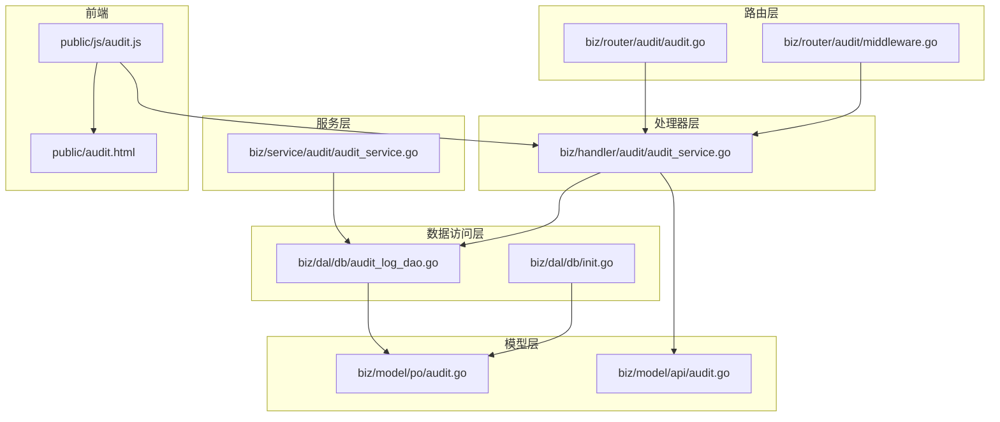
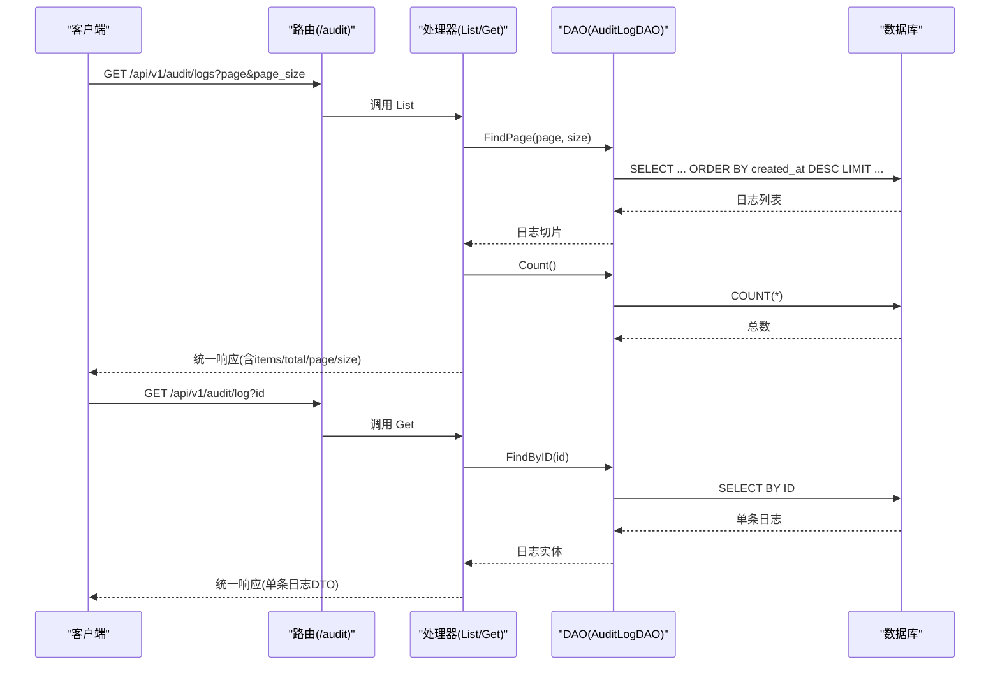
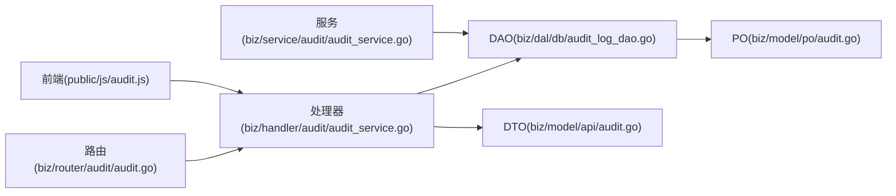

# 审计日志Handler

<cite>
**本文引用的文件**
- [biz/handler/audit/audit_service.go](file://biz/handler/audit/audit_service.go)
- [biz/router/audit/audit.go](file://biz/router/audit/audit.go)
- [biz/router/audit/middleware.go](file://biz/router/audit/middleware.go)
- [biz/model/api/audit.go](file://biz/model/api/audit.go)
- [biz/model/po/audit.go](file://biz/model/po/audit.go)
- [biz/dal/db/audit_log_dao.go](file://biz/dal/db/audit_log_dao.go)
- [biz/dal/db/init.go](file://biz/dal/db/init.go)
- [biz/service/audit/audit_service.go](file://biz/service/audit/audit_service.go)
- [pkg/response/response.go](file://pkg/response/response.go)
- [public/js/audit.js](file://public/js/audit.js)
- [public/audit.html](file://public/audit.html)
- [biz/handler/branch/branch_service.go](file://biz/handler/branch/branch_service.go)
- [biz/handler/repo/repo_service.go](file://biz/handler/repo/repo_service.go)
</cite>

## 目录
1. [简介](#简介)
2. [项目结构](#项目结构)
3. [核心组件](#核心组件)
4. [架构总览](#架构总览)
5. [组件详解](#组件详解)
6. [依赖关系分析](#依赖关系分析)
7. [性能与扩展性](#性能与扩展性)
8. [安全与合规](#安全与合规)
9. [故障排查指南](#故障排查指南)
10. [结论](#结论)
11. [附录：接口与数据模型](#附录接口与数据模型)

## 简介
本文件聚焦于审计日志Handler的实现与使用，覆盖以下方面：
- Handler职责：审计日志查询、日志详情获取
- 记录机制：操作类型、操作对象、操作详情、时间戳
- 查询过滤与分页：当前实现为列表分页，后续可扩展时间范围、类型、对象筛选
- 安全保障：敏感信息脱敏建议、访问控制、日志完整性
- 合规与最佳实践：记录粒度、保留策略、审计报表生成思路

## 项目结构
审计日志相关代码分布于路由、处理器、服务层、DAO层与模型层，并在前端页面与脚本中提供可视化与交互。

图表来源
- [biz/router/audit/audit.go](file://biz/router/audit/audit.go#L17-L31)
- [biz/router/audit/middleware.go](file://biz/router/audit/middleware.go#L9-L37)
- [biz/handler/audit/audit_service.go](file://biz/handler/audit/audit_service.go#L18-L76)
- [biz/service/audit/audit_service.go](file://biz/service/audit/audit_service.go#L17-L50)
- [biz/dal/db/audit_log_dao.go](file://biz/dal/db/audit_log_dao.go#L7-L45)
- [biz/dal/db/init.go](file://biz/dal/db/init.go#L18-L71)
- [biz/model/po/audit.go](file://biz/model/po/audit.go#L7-L20)
- [biz/model/api/audit.go](file://biz/model/api/audit.go#L9-L31)
- [public/js/audit.js](file://public/js/audit.js#L12-L94)
- [public/audit.html](file://public/audit.html#L13-L38)

章节来源
- [biz/router/audit/audit.go](file://biz/router/audit/audit.go#L17-L31)
- [biz/handler/audit/audit_service.go](file://biz/handler/audit/audit_service.go#L18-L76)
- [biz/dal/db/audit_log_dao.go](file://biz/dal/db/audit_log_dao.go#L7-L45)
- [biz/model/po/audit.go](file://biz/model/po/audit.go#L7-L20)
- [biz/model/api/audit.go](file://biz/model/api/audit.go#L9-L31)
- [public/js/audit.js](file://public/js/audit.js#L12-L94)
- [public/audit.html](file://public/audit.html#L13-L38)

## 核心组件
- 路由注册：在版本组下注册“/audit”子路由，绑定“日志列表”和“日志详情”两个端点。
- 处理器：负责参数解析、调用DAO、组装响应。
- DAO：封装数据库访问，提供分页查询、总数统计、按ID查询。
- 模型：PO用于持久化，DTO用于对外传输。
- 服务层：统一的审计记录入口，支持从请求上下文提取IP与UA。
- 响应封装：统一返回结构体，便于前端消费。
- 前端：提供审计日志列表页与详情弹窗，支持分页与详情查看。

章节来源
- [biz/router/audit/audit.go](file://biz/router/audit/audit.go#L17-L31)
- [biz/handler/audit/audit_service.go](file://biz/handler/audit/audit_service.go#L18-L76)
- [biz/dal/db/audit_log_dao.go](file://biz/dal/db/audit_log_dao.go#L23-L45)
- [biz/model/po/audit.go](file://biz/model/po/audit.go#L7-L20)
- [biz/model/api/audit.go](file://biz/model/api/audit.go#L9-L31)
- [pkg/response/response.go](file://pkg/response/response.go#L9-L87)
- [public/js/audit.js](file://public/js/audit.js#L12-L94)

## 架构总览
审计日志Handler遵循“路由 -> 处理器 -> DAO -> 数据库”的典型分层架构；同时通过服务层统一记录审计事件，确保各业务模块的一致性。

图表来源
- [biz/router/audit/audit.go](file://biz/router/audit/audit.go#L25-L27)
- [biz/handler/audit/audit_service.go](file://biz/handler/audit/audit_service.go#L18-L76)
- [biz/dal/db/audit_log_dao.go](file://biz/dal/db/audit_log_dao.go#L23-L45)

## 组件详解

### 路由与中间件
- 路由在根路径下按版本与模块分组注册，审计模块挂载在“/audit”下，提供两个端点：
  - GET /audit/logs：分页列出审计日志
  - GET /audit/log：按ID获取单条日志详情
- 中间件预留位置，当前为空实现，可用于后续接入鉴权、限流等。

章节来源
- [biz/router/audit/audit.go](file://biz/router/audit/audit.go#L17-L31)
- [biz/router/audit/middleware.go](file://biz/router/audit/middleware.go#L9-L37)

### 处理器：审计日志列表与详情
- 列表接口
  - 解析页码与每页大小，设置默认值
  - 调用DAO分页查询，仅选择必要字段以提升性能
  - 查询总数，组装统一响应结构
- 详情接口
  - 校验ID参数，转换为整数
  - 通过DAO按ID查询，找不到时返回资源不存在
  - 返回单条日志DTO

章节来源
- [biz/handler/audit/audit_service.go](file://biz/handler/audit/audit_service.go#L18-L76)
- [pkg/response/response.go](file://pkg/response/response.go#L58-L81)

### DAO：审计日志数据访问
- 提供创建、最新N条、总数、分页、按ID查询等方法
- 分页查询显式指定列名，避免加载大字段（如details），提升列表性能
- 使用GORM进行数据库操作

章节来源
- [biz/dal/db/audit_log_dao.go](file://biz/dal/db/audit_log_dao.go#L7-L45)

### 模型：审计日志数据模型
- PO层：包含操作类型、目标对象、操作者、详情、IP、UA、时间戳等字段
- DTO层：对外传输结构，包含常用字段映射

章节来源
- [biz/model/po/audit.go](file://biz/model/po/audit.go#L7-L20)
- [biz/model/api/audit.go](file://biz/model/api/audit.go#L9-L31)

### 服务层：审计记录入口
- 初始化审计服务，注入DAO
- 提供Log方法：从请求上下文提取IP与UA，序列化详情，异步写入数据库
- 当前为同步写入，后续可改为后台协程或消息队列以提升吞吐

章节来源
- [biz/service/audit/audit_service.go](file://biz/service/audit/audit_service.go#L17-L50)

### 前端：审计日志页面与交互
- 页面提供刷新按钮与表格展示
- JS实现分页加载、详情弹窗、详情JSON解析展示
- 支持根据操作类型动态渲染徽章样式

章节来源
- [public/audit.html](file://public/audit.html#L13-L38)
- [public/js/audit.js](file://public/js/audit.js#L12-L94)

### 记录机制与使用示例
- 在分支与仓库等业务模块中，通过服务层统一记录审计日志
- 记录内容包含操作类型、目标对象标识、详情（JSON字符串）与时间戳
- 示例：分支创建、删除、更新、检出、推送、拉取、合并结果等均记录审计日志

章节来源
- [biz/handler/branch/branch_service.go](file://biz/handler/branch/branch_service.go#L118-L122)
- [biz/handler/branch/branch_service.go](file://biz/handler/branch/branch_service.go#L150-L154)
- [biz/handler/branch/branch_service.go](file://biz/handler/branch/branch_service.go#L196-L201)
- [biz/handler/branch/branch_service.go](file://biz/handler/branch/branch_service.go#L228-L231)
- [biz/handler/branch/branch_service.go](file://biz/handler/branch/branch_service.go#L267-L271)
- [biz/handler/repo/repo_service.go](file://biz/handler/repo/repo_service.go#L114-L115)
- [biz/handler/repo/repo_service.go](file://biz/handler/repo/repo_service.go#L201-L202)
- [biz/handler/repo/repo_service.go](file://biz/handler/repo/repo_service.go#L234-L235)

## 依赖关系分析
- 路由依赖处理器函数
- 处理器依赖DAO与DTO构造
- DAO依赖PO与GORM连接
- 服务层依赖DAO与请求上下文
- 前端依赖后端接口与统一响应结构

图表来源
- [biz/router/audit/audit.go](file://biz/router/audit/audit.go#L17-L31)
- [biz/handler/audit/audit_service.go](file://biz/handler/audit/audit_service.go#L18-L76)
- [biz/dal/db/audit_log_dao.go](file://biz/dal/db/audit_log_dao.go#L7-L45)
- [biz/model/po/audit.go](file://biz/model/po/audit.go#L7-L20)
- [biz/model/api/audit.go](file://biz/model/api/audit.go#L9-L31)
- [biz/service/audit/audit_service.go](file://biz/service/audit/audit_service.go#L17-L50)
- [public/js/audit.js](file://public/js/audit.js#L12-L94)

## 性能与扩展性
- 列表查询优化
  - DAO分页查询仅选择必要字段，避免加载大字段（如details），降低网络与内存开销
  - 排序基于created_at降序，满足“最新优先”的展示需求
- 异步记录
  - 服务层采用协程异步写入，避免阻塞主流程，提升吞吐
- 扩展建议
  - 查询过滤：新增按时间范围、操作类型、目标对象等筛选条件
  - 分页：支持游标分页或基于时间戳的偏移分页
  - 报表：基于聚合查询生成统计报表（如操作类型分布、操作者TopN）

章节来源
- [biz/dal/db/audit_log_dao.go](file://biz/dal/db/audit_log_dao.go#L29-L38)
- [biz/service/audit/audit_service.go](file://biz/service/audit/audit_service.go#L47-L49)

## 安全与合规
- 敏感信息脱敏
  - 对详情字段中的敏感数据（如密码、密钥）在记录前进行脱敏处理
  - 前端展示时对详情JSON进行格式化输出，避免直接暴露原始payload
- 访问控制
  - 路由中间件预留鉴权逻辑，建议在此处接入用户认证与角色校验
- 日志完整性
  - 建议引入日志签名或哈希校验，防止篡改
  - 对关键操作增加双人复核或审批流程
- 合规要求
  - 明确日志保留期限与销毁策略
  - 遵循最小化原则，仅记录必要的操作信息
  - 定期备份与离线归档，确保可追溯性

章节来源
- [biz/router/audit/middleware.go](file://biz/router/audit/middleware.go#L9-L37)
- [public/js/audit.js](file://public/js/audit.js#L96-L117)

## 故障排查指南
- 列表接口异常
  - 检查DAO分页查询是否正确传入页码与大小
  - 确认数据库连接初始化成功且表存在
- 详情接口异常
  - 校验ID参数是否有效
  - 确认DAO按ID查询逻辑正常
- 响应格式问题
  - 统一使用响应封装工具，避免直接c.JSON导致格式不一致
- 前端加载失败
  - 检查请求路径与参数是否匹配后端接口
  - 查看浏览器控制台与网络面板定位问题

章节来源
- [pkg/response/response.go](file://pkg/response/response.go#L58-L81)
- [biz/dal/db/init.go](file://biz/dal/db/init.go#L18-L71)
- [public/js/audit.js](file://public/js/audit.js#L12-L94)

## 结论
该审计日志Handler实现了基本的查询与详情能力，配合服务层统一记录机制，覆盖了分支与仓库等关键业务场景。当前重点在于性能优化与安全加固，后续可扩展查询过滤、报表生成与更严格的权限控制，以满足合规与审计需求。

## 附录：接口与数据模型

### 接口定义
- 获取审计日志列表
  - 方法：GET
  - 路径：/api/v1/audit/logs
  - 查询参数：page（默认1）、page_size（默认20）
  - 响应：包含items、total、page、size的统一结构
- 获取审计日志详情
  - 方法：GET
  - 路径：/api/v1/audit/log
  - 查询参数：id（必填）
  - 响应：单条日志DTO

章节来源
- [biz/handler/audit/audit_service.go](file://biz/handler/audit/audit_service.go#L18-L76)
- [biz/router/audit/audit.go](file://biz/router/audit/audit.go#L25-L27)

### 数据模型
- PO（持久化对象）
  - 字段：ID、CreatedAt、Action、Target、Operator、Details、IPAddress、UserAgent
  - 索引：Action、Target
- DTO（对外传输对象）
  - 字段：ID、Action、Target、Operator、Details、IPAddress、UserAgent、CreatedAt

章节来源
- [biz/model/po/audit.go](file://biz/model/po/audit.go#L7-L20)
- [biz/model/api/audit.go](file://biz/model/api/audit.go#L9-L31)

### 记录示例（片段路径）
- 分支创建
  - [biz/handler/branch/branch_service.go](file://biz/handler/branch/branch_service.go#L118-L122)
- 分支删除
  - [biz/handler/branch/branch_service.go](file://biz/handler/branch/branch_service.go#L150-L154)
- 分支更新
  - [biz/handler/branch/branch_service.go](file://biz/handler/branch/branch_service.go#L196-L201)
- 分支检出
  - [biz/handler/branch/branch_service.go](file://biz/handler/branch/branch_service.go#L228-L231)
- 分支推送
  - [biz/handler/branch/branch_service.go](file://biz/handler/branch/branch_service.go#L267-L271)
- 仓库创建
  - [biz/handler/repo/repo_service.go](file://biz/handler/repo/repo_service.go#L114-L115)
- 仓库更新
  - [biz/handler/repo/repo_service.go](file://biz/handler/repo/repo_service.go#L201-L202)
- 仓库删除
  - [biz/handler/repo/repo_service.go](file://biz/handler/repo/repo_service.go#L234-L235)