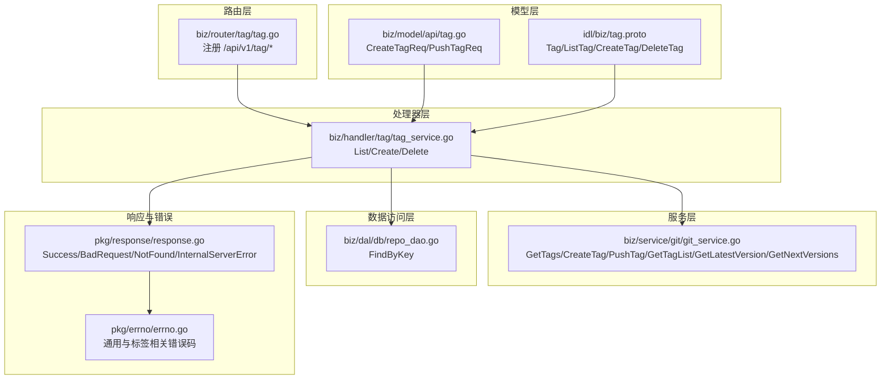
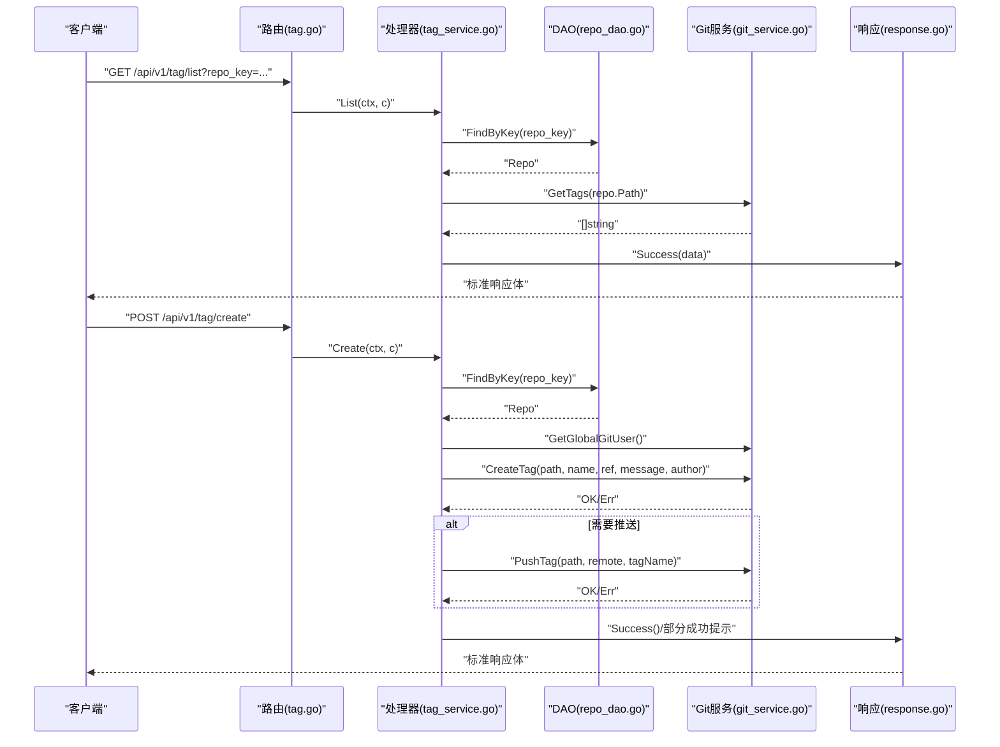
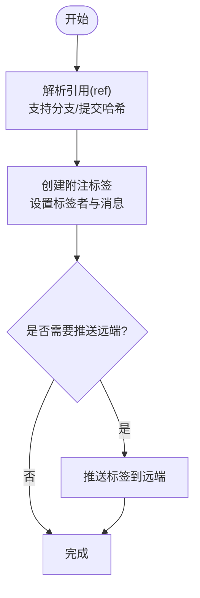
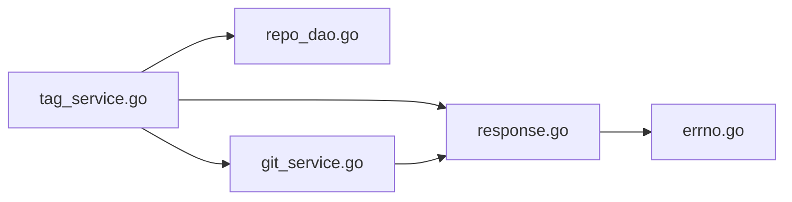

# 标签管理Handler

<cite>
**本文档引用的文件**
- [biz/handler/tag/tag_service.go](file://biz/handler/tag/tag_service.go)
- [biz/router/tag/tag.go](file://biz/router/tag/tag.go)
- [biz/model/api/tag.go](file://biz/model/api/tag.go)
- [idl/biz/tag.proto](file://idl/biz/tag.proto)
- [biz/service/git/git_service.go](file://biz/service/git/git_service.go)
- [biz/dal/db/repo_dao.go](file://biz/dal/db/repo_dao.go)
- [pkg/response/response.go](file://pkg/response/response.go)
- [pkg/errno/errno.go](file://pkg/errno/errno.go)
- [biz/handler/version/version_service.go](file://biz/handler/version/version_service.go)
</cite>

## 目录
1. [简介](#简介)
2. [项目结构](#项目结构)
3. [核心组件](#核心组件)
4. [架构总览](#架构总览)
5. [详细组件分析](#详细组件分析)
6. [依赖关系分析](#依赖关系分析)
7. [性能考量](#性能考量)
8. [故障排查指南](#故障排查指南)
9. [结论](#结论)
10. [附录](#附录)

## 简介
本文件面向“标签管理Handler”的技术实现，系统性阐述标签模块在后端的路由注册、请求处理、Git操作与错误处理机制。重点覆盖以下能力：
- 标签列表查询：支持分页参数，返回标签集合
- 标签详情获取：通过版本服务接口获取标签列表与描述信息
- 标签创建：支持自动版本号生成、附注标签创建、可选推送远端
- 标签删除：当前接口占位，尚未实现具体逻辑
- 标签比较：通过版本服务提供的“下一个版本”建议辅助发布决策

同时，文档解释轻量标签与附注标签的识别差异、标签信息解析与展示格式，并给出最佳实践与版本发布流程建议。

## 项目结构
标签管理Handler位于biz/handler/tag目录，配合路由注册、模型定义、Git服务与DAO层协作完成标签生命周期管理。

图表来源
- [biz/router/tag/tag.go](file://biz/router/tag/tag.go#L17-L32)
- [biz/handler/tag/tag_service.go](file://biz/handler/tag/tag_service.go#L16-L144)
- [biz/model/api/tag.go](file://biz/model/api/tag.go#L1-L14)
- [idl/biz/tag.proto](file://idl/biz/tag.proto#L12-L27)
- [biz/service/git/git_service.go](file://biz/service/git/git_service.go#L1018-L1161)
- [biz/dal/db/repo_dao.go](file://biz/dal/db/repo_dao.go#L23-L26)
- [pkg/response/response.go](file://pkg/response/response.go#L17-L87)
- [pkg/errno/errno.go](file://pkg/errno/errno.go#L92-L99)

章节来源
- [biz/router/tag/tag.go](file://biz/router/tag/tag.go#L17-L32)
- [biz/handler/tag/tag_service.go](file://biz/handler/tag/tag_service.go#L16-L144)
- [biz/model/api/tag.go](file://biz/model/api/tag.go#L1-L14)
- [idl/biz/tag.proto](file://idl/biz/tag.proto#L12-L27)
- [biz/service/git/git_service.go](file://biz/service/git/git_service.go#L1018-L1161)
- [biz/dal/db/repo_dao.go](file://biz/dal/db/repo_dao.go#L23-L26)
- [pkg/response/response.go](file://pkg/response/response.go#L17-L87)
- [pkg/errno/errno.go](file://pkg/errno/errno.go#L92-L99)

## 核心组件
- 路由注册：在tag路由文件中注册标签相关API路径，绑定到对应处理器函数
- 处理器函数：
  - List：校验repo_key，查询仓库，调用Git服务获取标签列表并返回
  - Create：参数绑定与校验，解析仓库，自动版本号或显式标签名，创建附注标签，可选推送远端
  - Delete：参数校验，仓库存在性校验，返回“删除暂不支持”的占位提示
- Git服务：
  - GetTags：列举本地标签名
  - GetTagList：解析标签对象，区分轻量与附注标签，返回结构化信息
  - CreateTag：基于引用创建附注标签
  - PushTag：推送指定标签至远端
  - GetLatestVersion/GetNextVersions：用于版本建议与自动版本号生成
- DAO层：根据repo_key查询仓库记录
- 响应与错误：统一响应体结构，按场景返回不同错误码

章节来源
- [biz/router/tag/tag.go](file://biz/router/tag/tag.go#L17-L32)
- [biz/handler/tag/tag_service.go](file://biz/handler/tag/tag_service.go#L16-L144)
- [biz/service/git/git_service.go](file://biz/service/git/git_service.go#L1018-L1161)
- [biz/dal/db/repo_dao.go](file://biz/dal/db/repo_dao.go#L23-L26)
- [pkg/response/response.go](file://pkg/response/response.go#L17-L87)
- [pkg/errno/errno.go](file://pkg/errno/errno.go#L92-L99)

## 架构总览
下图展示标签管理Handler从HTTP请求到Git操作的关键交互流程。

图表来源
- [biz/router/tag/tag.go](file://biz/router/tag/tag.go#L17-L32)
- [biz/handler/tag/tag_service.go](file://biz/handler/tag/tag_service.go#L16-L144)
- [biz/dal/db/repo_dao.go](file://biz/dal/db/repo_dao.go#L23-L26)
- [biz/service/git/git_service.go](file://biz/service/git/git_service.go#L953-L1016)
- [pkg/response/response.go](file://pkg/response/response.go#L17-L87)

## 详细组件分析

### 路由与控制器
- 路由注册：在tag路由中为列表、创建、删除分别绑定路径与中间件
- 控制器职责：
  - List：参数校验、仓库存在性校验、调用Git服务获取标签、统一响应
  - Create：参数绑定与校验、仓库存在性校验、自动版本号、创建标签、可选推送
  - Delete：参数校验、仓库存在性校验、返回“删除暂不支持”

章节来源
- [biz/router/tag/tag.go](file://biz/router/tag/tag.go#L17-L32)
- [biz/handler/tag/tag_service.go](file://biz/handler/tag/tag_service.go#L16-L144)

### 数据模型与IDL
- API模型：CreateTagReq定义了标签创建所需的字段，含可选推送远端
- IDL模型：TagService定义了List/Create/Delete三个RPC，映射到HTTP路径

章节来源
- [biz/model/api/tag.go](file://biz/model/api/tag.go#L1-L14)
- [idl/biz/tag.proto](file://idl/biz/tag.proto#L12-L27)

### Git标签操作实现
- 轻量标签与附注标签：
  - GetTagList会尝试读取标签对象；若能解析则为附注标签，否则回退到提交对象作为轻量标签
  - 附注标签包含消息、标签者与时间；轻量标签使用提交作者与消息
- 标签创建：
  - CreateTag基于引用创建附注标签，支持设置标签者签名与消息
- 标签推送：
  - PushTag将本地标签推送到远端，自动检测认证方式
- 版本建议与自动版本号：
  - GetLatestVersion通过describe获取最新标签
  - GetNextVersions计算主/次/补丁三种下一版本
  - 处理器中支持“auto”关键字自动生成版本号

图表来源
- [biz/service/git/git_service.go](file://biz/service/git/git_service.go#L953-L1016)

章节来源
- [biz/service/git/git_service.go](file://biz/service/git/git_service.go#L1018-L1161)
- [biz/handler/tag/tag_service.go](file://biz/handler/tag/tag_service.go#L62-L94)

### 标签列表与详情
- 列表查询：List接口直接调用GetTags返回标签名列表
- 详情获取：版本服务提供GetTagList与GetNextVersions，用于展示标签详情与版本建议

章节来源
- [biz/handler/tag/tag_service.go](file://biz/handler/tag/tag_service.go#L16-L39)
- [biz/handler/version/version_service.go](file://biz/handler/version/version_service.go#L39-L87)
- [biz/service/git/git_service.go](file://biz/service/git/git_service.go#L1018-L1161)

### 标签删除与安全检查
- 当前Delete接口返回“删除暂不支持”，未实现具体逻辑
- 建议在实现时增加：
  - 标签存在性校验
  - 远端引用保护策略（如避免删除正在被CI使用的标签）
  - 审计日志记录

章节来源
- [biz/handler/tag/tag_service.go](file://biz/handler/tag/tag_service.go#L96-L116)

### 参数验证与错误处理
- 参数绑定与校验：Create使用BindAndValidate确保必填字段存在
- 仓库存在性：通过FindByKey校验repo_key
- 统一响应与错误码：
  - Success：成功响应
  - BadRequest：参数错误
  - NotFound：资源不存在
  - InternalServerError：服务端错误
  - 标签相关错误码：TagNotFound、TagAlreadyExists、TagCreateFailed、TagDeleteFailed

章节来源
- [biz/handler/tag/tag_service.go](file://biz/handler/tag/tag_service.go#L41-L116)
- [pkg/response/response.go](file://pkg/response/response.go#L17-L87)
- [pkg/errno/errno.go](file://pkg/errno/errno.go#L92-L99)

## 依赖关系分析
- 处理器依赖DAO进行仓库查询，依赖Git服务执行标签操作
- Git服务封装go-git与shell命令，提供标签、版本与推送能力
- 响应与错误模块提供统一输出格式与错误码转换

图表来源
- [biz/handler/tag/tag_service.go](file://biz/handler/tag/tag_service.go#L16-L144)
- [biz/dal/db/repo_dao.go](file://biz/dal/db/repo_dao.go#L23-L26)
- [biz/service/git/git_service.go](file://biz/service/git/git_service.go#L953-L1161)
- [pkg/response/response.go](file://pkg/response/response.go#L17-L87)
- [pkg/errno/errno.go](file://pkg/errno/errno.go#L92-L99)

章节来源
- [biz/handler/tag/tag_service.go](file://biz/handler/tag/tag_service.go#L16-L144)
- [biz/dal/db/repo_dao.go](file://biz/dal/db/repo_dao.go#L23-L26)
- [biz/service/git/git_service.go](file://biz/service/git/git_service.go#L953-L1161)
- [pkg/response/response.go](file://pkg/response/response.go#L17-L87)
- [pkg/errno/errno.go](file://pkg/errno/errno.go#L92-L99)

## 性能考量
- 标签列表与详情：GetTags与GetTagList均为遍历引用与对象，复杂度与标签数量线性相关
- 自动版本号：incrementVersion为字符串处理，开销极低
- 推送远端：PushTag涉及网络IO，建议异步化并在前端轮询状态
- 建议：
  - 对于大量标签仓库，考虑分页或缓存最近标签
  - 在高并发场景下对Git操作加锁或队列化

## 故障排查指南
- 常见错误与定位
  - 参数错误：检查Create请求体字段是否满足绑定规则
  - 仓库不存在：确认repo_key正确且已入库
  - 标签创建失败：检查ref是否有效，标签者信息是否可用
  - 推送失败：检查远端URL与认证配置
- 响应体解读
  - code=0表示成功；非0时查看msg与error字段定位问题
  - 部分成功：创建成功但推送失败时返回status与error提示

章节来源
- [pkg/response/response.go](file://pkg/response/response.go#L17-L87)
- [pkg/errno/errno.go](file://pkg/errno/errno.go#L92-L99)
- [biz/handler/tag/tag_service.go](file://biz/handler/tag/tag_service.go#L62-L94)

## 结论
标签管理Handler以清晰的分层设计实现了标签列表、创建与删除的HTTP接口，并通过Git服务完成底层操作。当前删除接口为占位实现，后续可扩展安全策略与审计。版本服务提供了标签详情与版本建议，有助于规范发布流程。建议在生产环境中完善删除逻辑、增强推送异步化与错误恢复能力。

## 附录

### API定义与调用示例
- 列表查询
  - 方法：GET
  - 路径：/api/v1/tag/list
  - 查询参数：repo_key
  - 返回：标签名数组
- 创建标签
  - 方法：POST
  - 路径：/api/v1/tag/create
  - 请求体：repo_key、tag_name、ref、message、push_remote
  - 返回：成功或部分成功提示
- 删除标签
  - 方法：POST
  - 路径：/api/v1/tag/delete
  - 请求体：repo_key、tag_name
  - 返回：当前为“删除暂不支持”

章节来源
- [idl/biz/tag.proto](file://idl/biz/tag.proto#L12-L27)
- [biz/router/tag/tag.go](file://biz/router/tag/tag.go#L17-L32)
- [biz/handler/tag/tag_service.go](file://biz/handler/tag/tag_service.go#L16-L116)

### 标签数据结构与展示格式
- 标签实体（版本服务）：name、commit_hash、message、tagger、date、is_annotated
- 轻量标签与附注标签：
  - 附注标签：包含标签者与时间戳
  - 轻量标签：使用提交作者与消息
- 展示建议：在前端以“名称/提交哈希/消息/标签者/日期/类型”呈现

章节来源
- [idl/biz/tag.proto](file://idl/biz/tag.proto#L29-L37)
- [biz/service/git/git_service.go](file://biz/service/git/git_service.go#L1035-L1080)

### 版本发布流程建议
- 发布前检查
  - 使用GetNextVersions获取主/次/补丁版本建议
  - 使用GetTagList核对现有标签
- 发布步骤
  - 选择版本类型（主/次/补丁），或使用“auto”
  - CreateTag创建附注标签
  - 可选推送至远端
- 回滚与安全
  - 删除标签接口暂不可用，建议通过标签命名约定规避误删
  - 对关键标签增加保护策略与审批流程

章节来源
- [biz/handler/version/version_service.go](file://biz/handler/version/version_service.go#L64-L87)
- [biz/handler/tag/tag_service.go](file://biz/handler/tag/tag_service.go#L62-L94)
- [biz/service/git/git_service.go](file://biz/service/git/git_service.go#L1110-L1161)