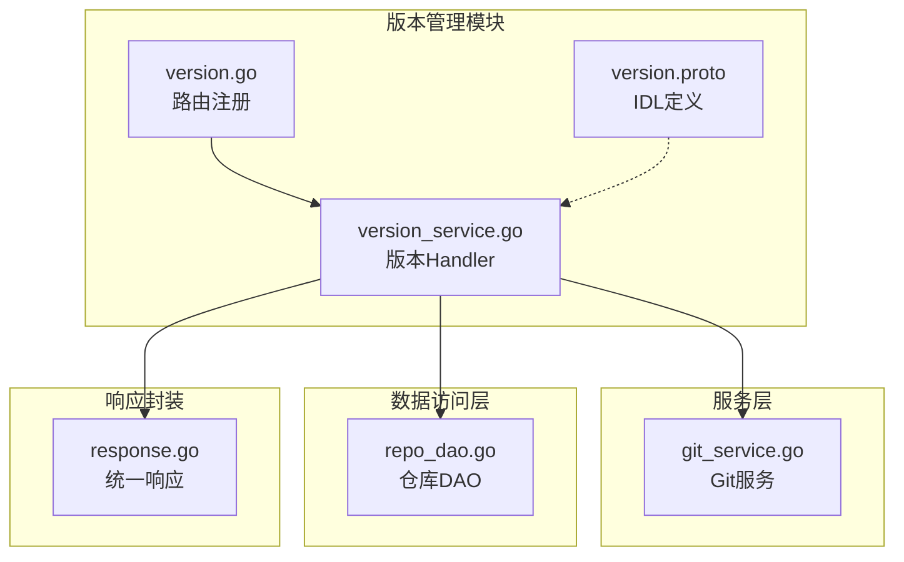
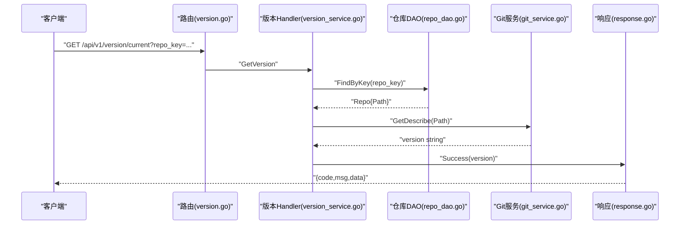
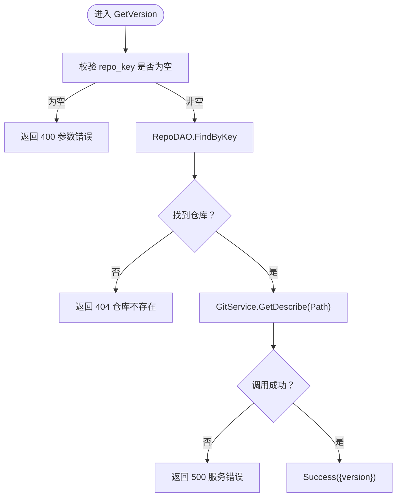
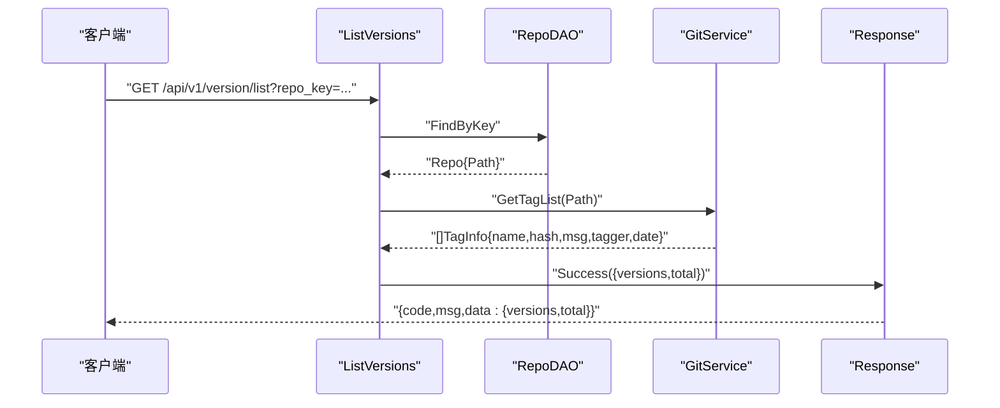
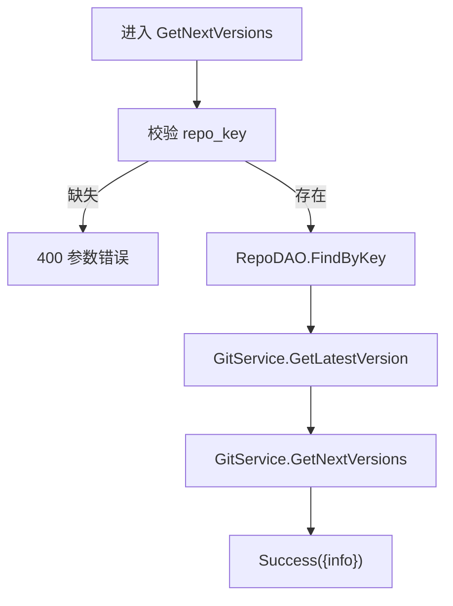
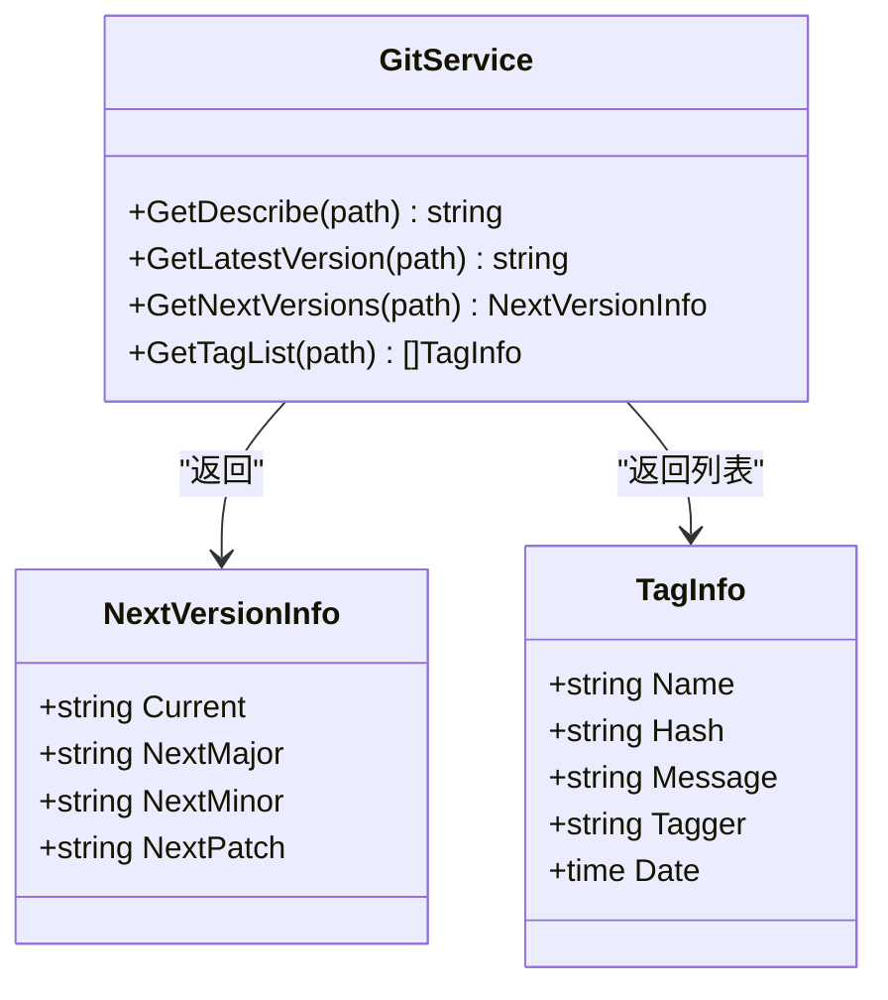
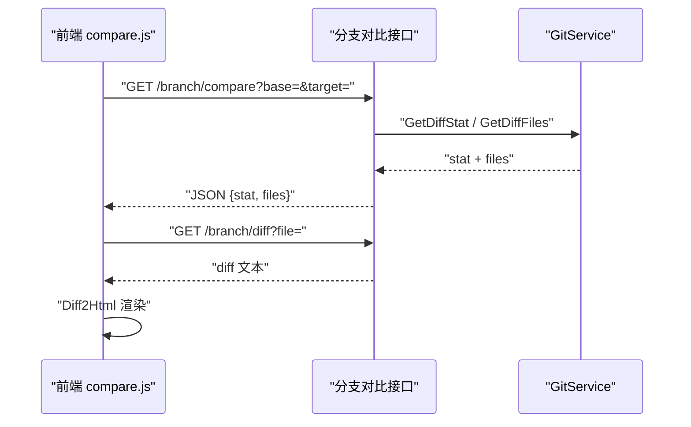
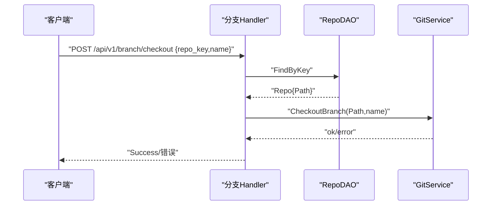
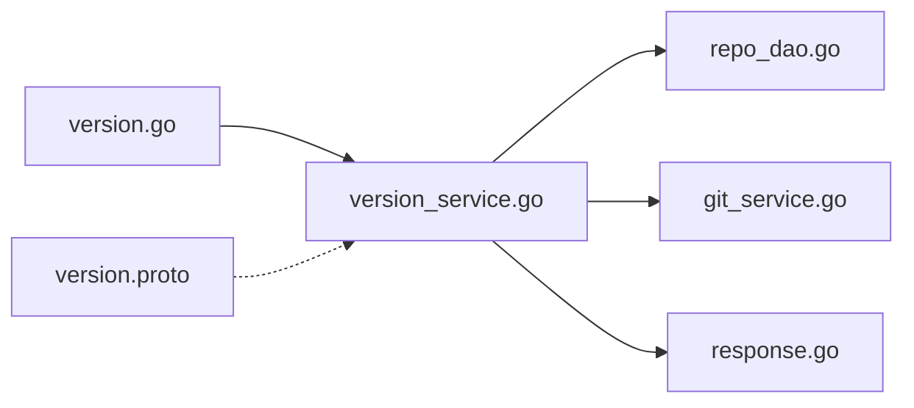

# 版本管理Handler

<cite>
**本文引用的文件**
- [biz/handler/version/version_service.go](file://biz/handler/version/version_service.go)
- [biz/router/version/version.go](file://biz/router/version/version.go)
- [idl/biz/version.proto](file://idl/biz/version.proto)
- [biz/service/git/git_service.go](file://biz/service/git/git_service.go)
- [pkg/response/response.go](file://pkg/response/response.go)
- [biz/dal/db/repo_dao.go](file://biz/dal/db/repo_dao.go)
- [public/js/compare.js](file://public/js/compare.js)
- [OPTIMIZATION_PLAN.md](file://OPTIMIZATION_PLAN.md)
</cite>

## 目录
1. [简介](#简介)
2. [项目结构](#项目结构)
3. [核心组件](#核心组件)
4. [架构总览](#架构总览)
5. [组件详解](#组件详解)
6. [依赖关系分析](#依赖关系分析)
7. [性能考量](#性能考量)
8. [故障排查指南](#故障排查指南)
9. [结论](#结论)
10. [附录](#附录)

## 简介
本文件聚焦“版本管理Handler”的实现与工作机制，覆盖以下能力：
- 版本信息查询：当前版本描述、版本号生成与语义化建议
- 版本历史查看：标签列表、版本元信息（提交哈希、提交信息、标签者、时间）
- 版本对比与差异统计：变更统计、文件差异列表、可视化展示
- 版本切换：通过分支切换实现版本切换（基于现有分支Handler）

同时，文档给出版本信息的获取与解析要点（提交信息提取、作者信息处理、时间戳转换、版本号生成），并结合前端对比页面说明差异可视化流程。

## 项目结构
版本管理Handler位于biz/handler/version目录，路由注册在biz/router/version，IDL定义在idl/biz/version.proto，实际Git操作由biz/service/git/git_service.go提供，统一响应封装在pkg/response/response.go，仓库信息通过biz/dal/db/repo_dao.go访问。

**图表来源**
- [biz/handler/version/version_service.go](file://biz/handler/version/version_service.go#L1-L88)
- [biz/router/version/version.go](file://biz/router/version/version.go#L17-L32)
- [idl/biz/version.proto](file://idl/biz/version.proto#L12-L27)
- [biz/service/git/git_service.go](file://biz/service/git/git_service.go#L1082-L1161)
- [biz/dal/db/repo_dao.go](file://biz/dal/db/repo_dao.go#L23-L27)
- [pkg/response/response.go](file://pkg/response/response.go#L17-L87)

**章节来源**
- [biz/handler/version/version_service.go](file://biz/handler/version/version_service.go#L1-L88)
- [biz/router/version/version.go](file://biz/router/version/version.go#L17-L32)
- [idl/biz/version.proto](file://idl/biz/version.proto#L12-L27)

## 核心组件
- 版本Handler：提供三个接口
  - GET /api/v1/version/current：查询当前版本描述
  - GET /api/v1/version/list：列出版本（标签）列表
  - GET /api/v1/version/next：获取下一个版本建议（语义化版本）
- Git服务：封装Git命令与go-git操作，负责版本信息解析、标签列表、版本号生成等
- DAO层：根据repo_key查询仓库路径
- 统一响应：Success/BadRequest/NotFound/InternalServerError等

**章节来源**
- [biz/handler/version/version_service.go](file://biz/handler/version/version_service.go#L14-L87)
- [idl/biz/version.proto](file://idl/biz/version.proto#L46-L80)
- [biz/service/git/git_service.go](file://biz/service/git/git_service.go#L1082-L1161)
- [biz/dal/db/repo_dao.go](file://biz/dal/db/repo_dao.go#L23-L27)
- [pkg/response/response.go](file://pkg/response/response.go#L17-L87)

## 架构总览
版本管理Handler遵循“Handler -> Service -> DAL”的分层设计，通过统一响应封装返回结果；Git操作采用go-git与必要场景下的shell命令组合，保证兼容性与鲁棒性。

**图表来源**
- [biz/router/version/version.go](file://biz/router/version/version.go#L26-L28)
- [biz/handler/version/version_service.go](file://biz/handler/version/version_service.go#L16-L36)
- [biz/dal/db/repo_dao.go](file://biz/dal/db/repo_dao.go#L23-L27)
- [biz/service/git/git_service.go](file://biz/service/git/git_service.go#L1082-L1087)
- [pkg/response/response.go](file://pkg/response/response.go#L17-L24)

## 组件详解

### Handler：版本信息查询
- 入口：GetVersion
  - 参数校验：repo_key必填
  - 查询仓库：通过RepoDAO.FindByKey获取仓库路径
  - 调用Git服务：svc.GetDescribe获取当前版本描述
  - 返回：Success(data=version)
- 错误处理：缺失repo_key返回400；仓库不存在返回404；Git命令失败返回500

**图表来源**
- [biz/handler/version/version_service.go](file://biz/handler/version/version_service.go#L16-L36)
- [pkg/response/response.go](file://pkg/response/response.go#L58-L71)

**章节来源**
- [biz/handler/version/version_service.go](file://biz/handler/version/version_service.go#L14-L37)
- [pkg/response/response.go](file://pkg/response/response.go#L58-L71)

### Handler：版本历史查看
- 入口：ListVersions
  - 参数校验：repo_key必填
  - 查询仓库：RepoDAO.FindByKey
  - 调用Git服务：svc.GetTagList获取标签列表（含标签名、提交哈希、消息、标签者、日期）
  - 返回：Success(data=versions[], total)

**图表来源**
- [biz/handler/version/version_service.go](file://biz/handler/version/version_service.go#L39-L61)
- [biz/service/git/git_service.go](file://biz/service/git/git_service.go#L1043-L1080)
- [pkg/response/response.go](file://pkg/response/response.go#L17-L24)

**章节来源**
- [biz/handler/version/version_service.go](file://biz/handler/version/version_service.go#L39-L62)
- [biz/service/git/git_service.go](file://biz/service/git/git_service.go#L1043-L1080)

### Handler：下一个版本建议
- 入口：GetNextVersions
  - 参数校验：repo_key必填
  - 查询仓库：RepoDAO.FindByKey
  - 调用Git服务：svc.GetLatestVersion获取最新版本；svc.GetNextVersions计算语义化版本（major/minor/patch）
  - 返回：Success(data=NextVersionInfo{current,next_major,next_minor,next_patch})

**图表来源**
- [biz/handler/version/version_service.go](file://biz/handler/version/version_service.go#L64-L87)
- [biz/service/git/git_service.go](file://biz/service/git/git_service.go#L1089-L1161)
- [pkg/response/response.go](file://pkg/response/response.go#L17-L24)

**章节来源**
- [biz/handler/version/version_service.go](file://biz/handler/version/version_service.go#L64-L87)
- [biz/service/git/git_service.go](file://biz/service/git/git_service.go#L1110-L1161)

### Git服务：版本信息获取与解析
- GetDescribe：使用git describe --tags --always --long获取当前版本描述（shell命令）
- GetLatestVersion：使用git describe --tags --abbrev=0获取最近标签（作为当前版本候选）
- GetNextVersions：解析当前版本（支持带v前缀），按语义化版本规则计算下一大版本、下一主版本、下一补丁版本
- GetTagList：遍历标签引用，区分注解标签与轻量标签，提取名称、哈希、消息、标签者、日期

**图表来源**
- [biz/service/git/git_service.go](file://biz/service/git/git_service.go#L1082-L1161)
- [biz/service/git/git_service.go](file://biz/service/git/git_service.go#L1043-L1080)

**章节来源**
- [biz/service/git/git_service.go](file://biz/service/git/git_service.go#L1082-L1161)
- [biz/service/git/git_service.go](file://biz/service/git/git_service.go#L1043-L1080)

### 版本对比与差异统计（补充说明）
虽然版本Handler不直接提供“版本对比”接口，但项目提供了完整的分支对比与差异展示能力，可复用到版本对比场景：
- 差异统计：GetDiffStat（文件数、新增行数、删除行数）
- 文件差异列表：GetDiffFiles（变更状态A/M/D/R）
- 原始差异内容：GetRawDiff（支持单文件diff）
- 前端对比页面：compare.js通过请求对比接口渲染统计、文件列表与Diff2Html可视化

**图表来源**
- [public/js/compare.js](file://public/js/compare.js#L77-L149)
- [biz/service/git/git_merge.go](file://biz/service/git/git_merge.go#L21-L94)

**章节来源**
- [public/js/compare.js](file://public/js/compare.js#L77-L149)
- [biz/service/git/git_merge.go](file://biz/service/git/git_merge.go#L21-L94)

### 版本切换（基于分支切换）
版本切换通过“分支切换”实现，对应分支模块的Handler：
- Handler：Checkout（POST /api/v1/branch/checkout）
- 逻辑：根据repo_key定位仓库，调用GitService.CheckoutBranch切换到指定分支
- 适用场景：以分支作为“版本”的团队协作模式

**图表来源**
- [biz/handler/branch/branch_service.go](file://biz/handler/branch/branch_service.go#L205-L233)
- [biz/service/git/git_service.go](file://biz/service/git/git_service.go#L594-L607)

**章节来源**
- [biz/handler/branch/branch_service.go](file://biz/handler/branch/branch_service.go#L205-L233)
- [biz/service/git/git_service.go](file://biz/service/git/git_service.go#L594-L607)

## 依赖关系分析
- Handler依赖DAO与GitService，并通过统一响应封装返回
- GitService内部使用go-git与必要场景下的shell命令（如describe）
- 路由注册将HTTP路径映射到具体Handler函数

**图表来源**
- [biz/router/version/version.go](file://biz/router/version/version.go#L17-L32)
- [biz/handler/version/version_service.go](file://biz/handler/version/version_service.go#L1-L12)
- [idl/biz/version.proto](file://idl/biz/version.proto#L12-L27)

**章节来源**
- [biz/router/version/version.go](file://biz/router/version/version.go#L17-L32)
- [biz/handler/version/version_service.go](file://biz/handler/version/version_service.go#L1-L12)
- [idl/biz/version.proto](file://idl/biz/version.proto#L12-L27)

## 性能考量
- Git命令执行：RunCommand在Debug模式下输出命令与输出，便于诊断但可能带来额外开销
- 日志流式输出：GetLogStatsStream通过子进程管道输出，避免一次性收集大文本
- 并发控制：整体优化计划建议引入并发池与事务管理，避免大量Git操作阻塞
- 建议
  - 对频繁调用的接口（如版本列表）增加缓存策略
  - 对大仓库的标签遍历与日志统计增加分页与超时控制
  - 使用结构化日志记录关键链路（TraceID、Level、上下文）

**章节来源**
- [biz/service/git/git_service.go](file://biz/service/git/git_service.go#L33-L48)
- [biz/service/git/git_service.go](file://biz/service/git/git_service.go#L786-L820)
- [OPTIMIZATION_PLAN.md](file://OPTIMIZATION_PLAN.md#L13-L16)

## 故障排查指南
- 参数错误
  - repo_key缺失：返回400，检查请求参数
- 资源不存在
  - 仓库不存在：返回404，确认repo_key正确且仓库已录入
- 服务器内部错误
  - Git命令失败：返回500，查看服务端日志与Debug输出
- 版本号为空
  - 无标签：GetLatestVersion可能返回空，GetNextVersions默认从v0.0.0开始计算
- 前端对比问题
  - 若差异为空，需确认base/target参数顺序与分支存在性；二进制文件可能无diff文本

**章节来源**
- [pkg/response/response.go](file://pkg/response/response.go#L58-L81)
- [biz/handler/version/version_service.go](file://biz/handler/version/version_service.go#L16-L36)
- [biz/service/git/git_service.go](file://biz/service/git/git_service.go#L1089-L1101)
- [public/js/compare.js](file://public/js/compare.js#L77-L149)

## 结论
版本管理Handler通过简洁的三个接口覆盖了版本信息查询、版本历史查看与版本建议生成的核心需求；其与Git服务的配合实现了对标签与版本号的稳健解析。结合分支切换与差异对比能力，可满足以“分支即版本”的团队协作模式。后续可在缓存、并发与日志方面进一步优化，提升大规模仓库场景下的稳定性与性能。

## 附录
- 接口清单
  - GET /api/v1/version/current：查询当前版本描述
  - GET /api/v1/version/list：列出版本（标签）列表
  - GET /api/v1/version/next：获取下一个版本建议
- 数据模型
  - VersionInfo：标签名、提交哈希、消息、标签者、日期
  - NextVersionInfo：当前版本与三大版本建议
- 相关实现路径
  - Handler：[biz/handler/version/version_service.go](file://biz/handler/version/version_service.go#L14-L87)
  - 路由：[biz/router/version/version.go](file://biz/router/version/version.go#L26-L28)
  - IDL：[idl/biz/version.proto](file://idl/biz/version.proto#L12-L27)
  - Git服务：[biz/service/git/git_service.go](file://biz/service/git/git_service.go#L1082-L1161)
  - 统一响应：[pkg/response/response.go](file://pkg/response/response.go#L17-L87)
  - 仓库DAO：[biz/dal/db/repo_dao.go](file://biz/dal/db/repo_dao.go#L23-L27)
  - 前端对比：[public/js/compare.js](file://public/js/compare.js#L77-L149)