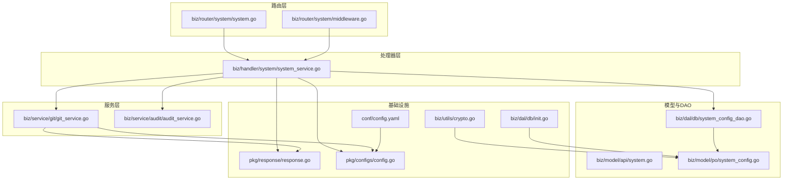
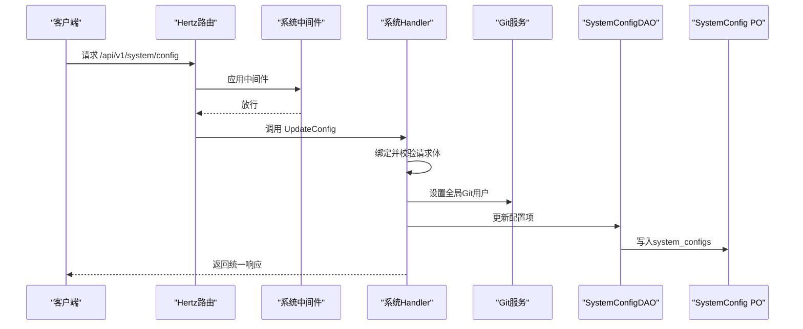
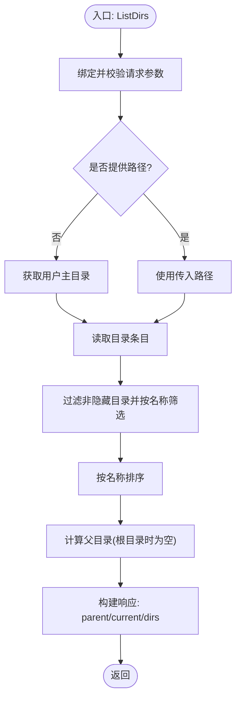
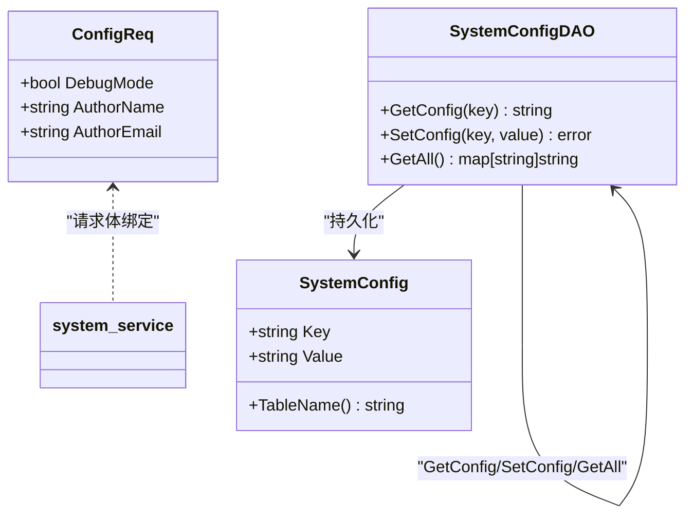
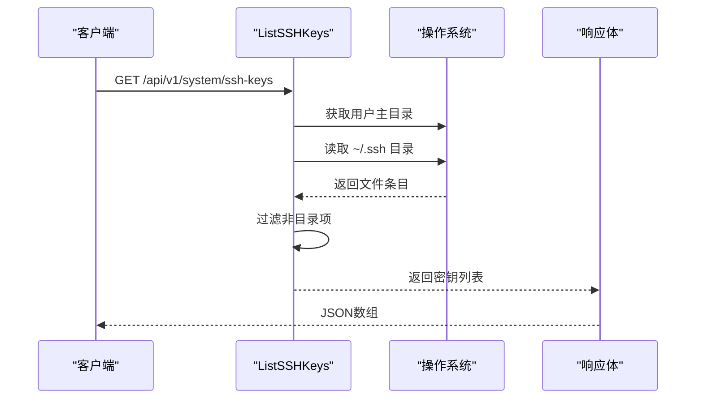
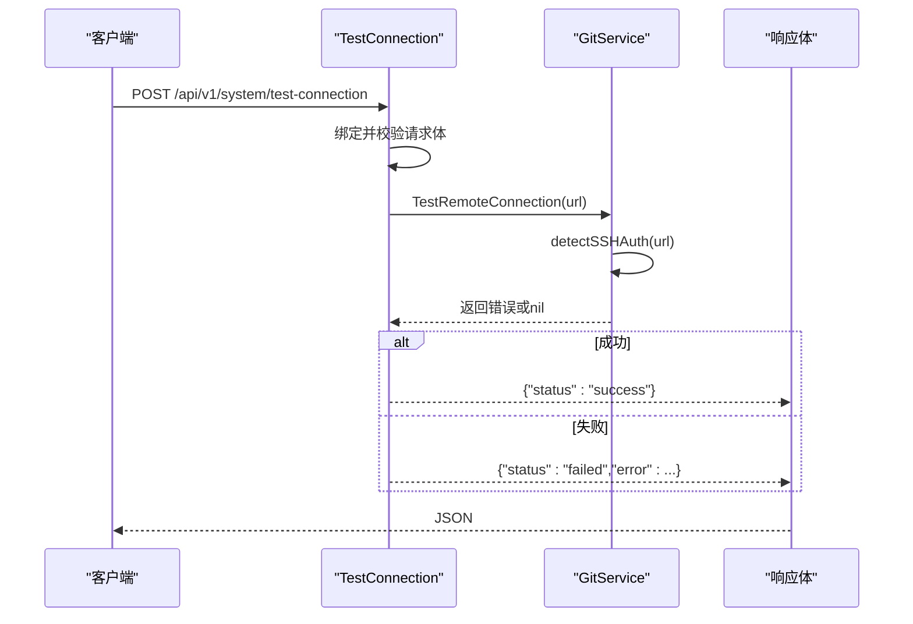
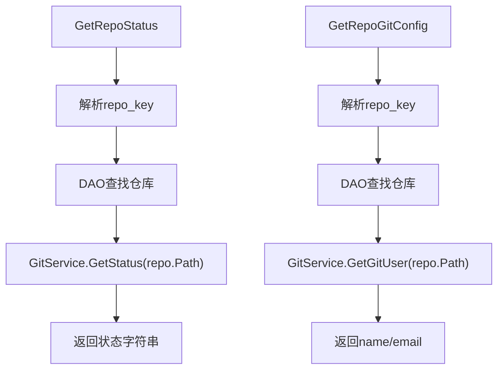
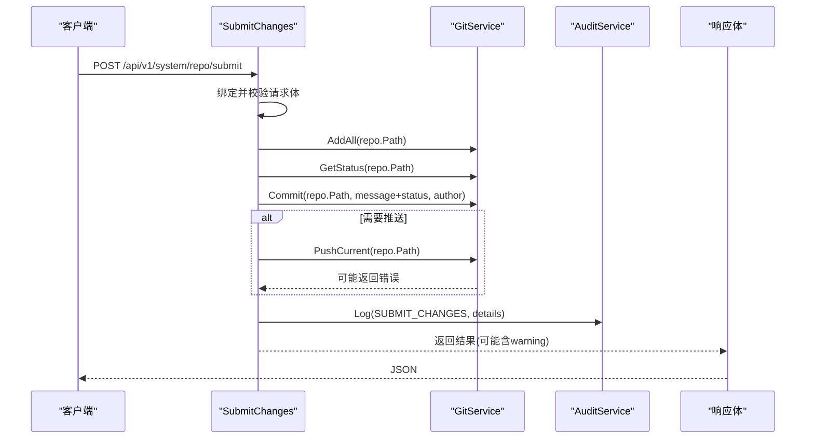
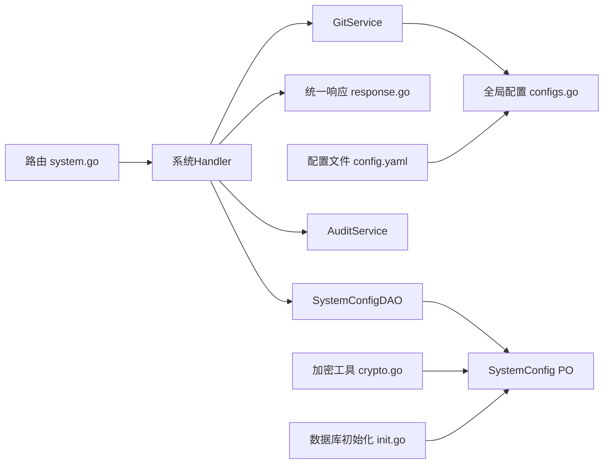

# 系统管理Handler

<cite>
**本文引用的文件**
- [biz/handler/system/system_service.go](file://biz/handler/system/system_service.go)
- [biz/router/system/system.go](file://biz/router/system/system.go)
- [biz/router/system/middleware.go](file://biz/router/system/middleware.go)
- [biz/model/api/system.go](file://biz/model/api/system.go)
- [biz/dal/db/system_config_dao.go](file://biz/dal/db/system_config_dao.go)
- [biz/model/po/system_config.go](file://biz/model/po/system_config.go)
- [biz/service/git/git_service.go](file://biz/service/git/git_service.go)
- [pkg/configs/config.go](file://pkg/configs/config.go)
- [pkg/response/response.go](file://pkg/response/response.go)
- [biz/utils/crypto.go](file://biz/utils/crypto.go)
- [biz/service/audit/audit_service.go](file://biz/service/audit/audit_service.go)
- [conf/config.yaml](file://conf/config.yaml)
- [biz/dal/db/init.go](file://biz/dal/db/init.go)
- [public/js/repos.js](file://public/js/repos.js)
- [public/repo_info.html](file://public/repo_info.html)
</cite>

## 目录
1. [简介](#简介)
2. [项目结构](#项目结构)
3. [核心组件](#核心组件)
4. [架构总览](#架构总览)
5. [详细组件分析](#详细组件分析)
6. [依赖关系分析](#依赖关系分析)
7. [性能考量](#性能考量)
8. [故障排查指南](#故障排查指南)
9. [结论](#结论)
10. [附录](#附录)

## 简介
本文件面向系统管理员与开发人员，系统性梳理“系统管理”模块的Handler实现与运行机制，覆盖以下能力：
- 文件浏览：目录遍历、搜索过滤、父级导航
- 系统配置：配置项的读取、更新与持久化
- SSH密钥管理：列出用户~/.ssh下的可用密钥
- 远端连接测试：检测仓库远端可达性
- 仓库状态与Git配置：查看工作区状态、读取作者信息
- 提交变更：自动暂存、提交、可选推送，并记录审计日志

同时，文档给出安全最佳实践、运维建议与常见问题排查方法，帮助在生产环境中稳定运行。

## 项目结构
系统管理Handler位于biz/handler/system目录，路由注册在biz/router/system中，数据模型在biz/model/api中，配置持久化通过biz/dal/db与biz/model/po完成，底层Git操作由biz/service/git封装，统一响应体在pkg/response中，全局配置在pkg/configs中，加密工具在biz/utils中，审计日志在biz/service/audit中。

**图表来源**
- [biz/router/system/system.go](file://biz/router/system/system.go#L17-L39)
- [biz/handler/system/system_service.go](file://biz/handler/system/system_service.go#L22-L268)
- [biz/model/api/system.go](file://biz/model/api/system.go#L3-L28)
- [biz/dal/db/system_config_dao.go](file://biz/dal/db/system_config_dao.go#L13-L42)
- [biz/model/po/system_config.go](file://biz/model/po/system_config.go#L3-L10)
- [biz/service/git/git_service.go](file://biz/service/git/git_service.go#L578-L755)
- [pkg/response/response.go](file://pkg/response/response.go#L17-L86)
- [pkg/configs/config.go](file://pkg/configs/config.go#L8-L42)
- [biz/utils/crypto.go](file://biz/utils/crypto.go#L15-L70)
- [biz/dal/db/init.go](file://biz/dal/db/init.go#L18-L71)
- [conf/config.yaml](file://conf/config.yaml#L1-L25)

**章节来源**
- [biz/router/system/system.go](file://biz/router/system/system.go#L17-L39)
- [biz/handler/system/system_service.go](file://biz/handler/system/system_service.go#L22-L268)
- [biz/model/api/system.go](file://biz/model/api/system.go#L3-L28)
- [biz/dal/db/system_config_dao.go](file://biz/dal/db/system_config_dao.go#L13-L42)
- [biz/model/po/system_config.go](file://biz/model/po/system_config.go#L3-L10)
- [biz/service/git/git_service.go](file://biz/service/git/git_service.go#L578-L755)
- [pkg/response/response.go](file://pkg/response/response.go#L17-L86)
- [pkg/configs/config.go](file://pkg/configs/config.go#L8-L42)
- [biz/utils/crypto.go](file://biz/utils/crypto.go#L15-L70)
- [biz/dal/db/init.go](file://biz/dal/db/init.go#L18-L71)
- [conf/config.yaml](file://conf/config.yaml#L1-L25)

## 核心组件
- 路由注册：系统管理路由在/api/v1/system下按功能分组，支持GET/POST请求。
- 处理器：系统管理Handler负责参数绑定与校验、调用Git服务、访问DAO、返回统一响应。
- 数据模型：ListDirsReq、DirItem、ListDirsResp、SSHKey、ConfigReq等。
- 配置DAO：SystemConfigDAO提供GetConfig/SetConfig/GetAll，PO为system_configs表。
- Git服务：封装远程连接测试、状态查询、提交、推送、作者信息读写等。
- 统一响应：Success/BadRequest/NotFound/InternalServerError等。
- 审计日志：提交变更后记录审计事件。

**章节来源**
- [biz/router/system/system.go](file://biz/router/system/system.go#L25-L36)
- [biz/handler/system/system_service.go](file://biz/handler/system/system_service.go#L22-L268)
- [biz/model/api/system.go](file://biz/model/api/system.go#L3-L28)
- [biz/dal/db/system_config_dao.go](file://biz/dal/db/system_config_dao.go#L13-L42)
- [biz/model/po/system_config.go](file://biz/model/po/system_config.go#L3-L10)
- [pkg/response/response.go](file://pkg/response/response.go#L17-L86)
- [biz/service/audit/audit_service.go](file://biz/service/audit/audit_service.go#L24-L50)

## 架构总览
系统管理Handler采用“路由-处理器-服务-DAO-模型”的分层架构，请求从Hertz路由进入，经中间件与处理器，调用Git服务执行底层操作，必要时访问数据库持久化配置或审计日志，最终以统一响应体返回。

**图表来源**
- [biz/router/system/system.go](file://biz/router/system/system.go#L25-L27)
- [biz/handler/system/system_service.go](file://biz/handler/system/system_service.go#L35-L57)
- [biz/service/git/git_service.go](file://biz/service/git/git_service.go#L703-L730)
- [biz/dal/db/system_config_dao.go](file://biz/dal/db/system_config_dao.go#L22-L28)
- [biz/model/po/system_config.go](file://biz/model/po/system_config.go#L3-L10)

## 详细组件分析

### 文件浏览组件（目录列表与搜索）
- 功能要点
  - 默认路径：若未指定路径，使用用户主目录；根目录时父级为空。
  - 过滤规则：仅列出非隐藏目录，支持按名称模糊搜索。
  - 排序策略：按名称字典序排序。
  - 返回结构：包含父目录、当前目录与目录列表。
- 安全与体验
  - 不直接读取文件内容，避免敏感文件泄露。
  - 前端提供搜索框与上一级按钮，提升交互效率。
- 前端集成
  - 打开文件浏览器时触发加载；搜索输入实时触发重新加载。

**图表来源**
- [biz/handler/system/system_service.go](file://biz/handler/system/system_service.go#L59-L111)
- [biz/model/api/system.go](file://biz/model/api/system.go#L3-L17)

**章节来源**
- [biz/handler/system/system_service.go](file://biz/handler/system/system_service.go#L59-L111)
- [biz/model/api/system.go](file://biz/model/api/system.go#L3-L17)
- [public/js/repos.js](file://public/js/repos.js#L568-L595)
- [public/repo_info.html](file://public/repo_info.html#L392-L419)

### 系统配置管理（增删改查与热更新）
- 配置读取
  - GetConfig：返回debug_mode与全局Git作者信息。
- 配置更新
  - UpdateConfig：绑定请求体，更新内存变量与全局Git用户；返回最新配置。
- 配置持久化
  - SystemConfigDAO：提供GetConfig/SetConfig/GetAll，PO映射到system_configs表。
- 热更新机制
  - 全局变量DebugMode在pkg/configs中维护，UpdateConfig会即时更新；其他配置通过环境变量或配置文件加载。
- 安全建议
  - 对敏感配置项进行最小权限访问控制，避免在响应中泄露密钥。
  - 使用加密存储敏感字段，参考加密工具模块。

**图表来源**
- [biz/dal/db/system_config_dao.go](file://biz/dal/db/system_config_dao.go#L13-L42)
- [biz/model/po/system_config.go](file://biz/model/po/system_config.go#L3-L10)
- [biz/model/api/system.go](file://biz/model/api/system.go#L24-L28)
- [pkg/configs/config.go](file://pkg/configs/config.go#L8-L42)

**章节来源**
- [biz/handler/system/system_service.go](file://biz/handler/system/system_service.go#L22-L57)
- [biz/dal/db/system_config_dao.go](file://biz/dal/db/system_config_dao.go#L13-L42)
- [biz/model/po/system_config.go](file://biz/model/po/system_config.go#L3-L10)
- [pkg/configs/config.go](file://pkg/configs/config.go#L8-L42)

### SSH密钥管理（列出与安全注意事项）
- 列出密钥
  - 读取用户主目录下的.ssh目录，过滤出普通文件（非子目录），返回名称与完整路径。
- 安全实现
  - 仅暴露文件名与路径，不读取密钥内容，避免敏感信息泄露。
  - 建议结合中间件限制访问来源与身份认证。
- 用户体验
  - 前端可基于返回结果展示密钥列表，便于选择与后续操作。

**图表来源**
- [biz/handler/system/system_service.go](file://biz/handler/system/system_service.go#L113-L140)

**章节来源**
- [biz/handler/system/system_service.go](file://biz/handler/system/system_service.go#L113-L140)

### 远端连接测试（网络连通性与认证探测）
- 测试流程
  - 绑定URL，调用Git服务TestRemoteConnection，内部创建匿名远程并尝试列举分支/引用。
  - 若URL为SSH协议，自动探测本地可用密钥与SSH Agent。
- 返回结果
  - 成功返回状态success；失败返回failed及错误信息。
- 安全与稳定性
  - 仅用于连通性探测，不执行写操作。
  - 在Debug模式下输出详细日志，便于排障。

**图表来源**
- [biz/handler/system/system_service.go](file://biz/handler/system/system_service.go#L142-L158)
- [biz/service/git/git_service.go](file://biz/service/git/git_service.go#L578-L592)
- [biz/service/git/git_service.go](file://biz/service/git/git_service.go#L67-L127)

**章节来源**
- [biz/handler/system/system_service.go](file://biz/handler/system/system_service.go#L142-L158)
- [biz/service/git/git_service.go](file://biz/service/git/git_service.go#L578-L592)
- [biz/service/git/git_service.go](file://biz/service/git/git_service.go#L67-L127)

### 仓库状态与Git配置查询
- 仓库状态
  - 通过repo_key定位仓库，调用Git服务获取工作区状态字符串。
- Git作者信息
  - 优先读取仓库局部配置，其次回退到全局~/.gitconfig。
- 安全与权限
  - 仅读取配置，不修改任何文件；确保进程对仓库目录具备只读权限。

**图表来源**
- [biz/handler/system/system_service.go](file://biz/handler/system/system_service.go#L160-L207)
- [biz/service/git/git_service.go](file://biz/service/git/git_service.go#L609-L701)

**章节来源**
- [biz/handler/system/system_service.go](file://biz/handler/system/system_service.go#L160-L207)
- [biz/service/git/git_service.go](file://biz/service/git/git_service.go#L609-L701)

### 提交变更（暂存、提交、可选推送与审计）
- 处理流程
  - 校验消息必填；暂存全部变更；获取当前状态快照拼接至提交信息；执行提交；可选推送；记录审计日志。
- 错误处理
  - 提交失败时回滚暂存；推送失败时返回警告标记。
- 审计日志
  - 记录操作类型、目标、详情（消息、是否推送）以及客户端IP与UA。

**图表来源**
- [biz/handler/system/system_service.go](file://biz/handler/system/system_service.go#L209-L268)
- [biz/service/git/git_service.go](file://biz/service/git/git_service.go#L625-L755)
- [biz/service/audit/audit_service.go](file://biz/service/audit/audit_service.go#L24-L50)

**章节来源**
- [biz/handler/system/system_service.go](file://biz/handler/system/system_service.go#L209-L268)
- [biz/service/git/git_service.go](file://biz/service/git/git_service.go#L625-L755)
- [biz/service/audit/audit_service.go](file://biz/service/audit/audit_service.go#L24-L50)

## 依赖关系分析
- 路由与处理器
  - 路由在/api/v1/system下注册各子路由，处理器函数作为最终处理者。
- 处理器与服务
  - 处理器依赖Git服务进行仓库操作，依赖DAO进行配置持久化，依赖响应体统一输出。
- 配置与加密
  - 全局配置在pkg/configs中初始化；敏感字段建议使用biz/utils/crypto进行加解密。
- 数据库与迁移
  - biz/dal/db/init负责根据配置选择驱动并迁移system_configs表。

**图表来源**
- [biz/router/system/system.go](file://biz/router/system/system.go#L17-L39)
- [biz/handler/system/system_service.go](file://biz/handler/system/system_service.go#L22-L268)
- [pkg/response/response.go](file://pkg/response/response.go#L17-L86)
- [biz/dal/db/system_config_dao.go](file://biz/dal/db/system_config_dao.go#L13-L42)
- [biz/model/po/system_config.go](file://biz/model/po/system_config.go#L3-L10)
- [biz/service/git/git_service.go](file://biz/service/git/git_service.go#L578-L755)
- [pkg/configs/config.go](file://pkg/configs/config.go#L8-L42)
- [biz/utils/crypto.go](file://biz/utils/crypto.go#L15-L70)
- [biz/dal/db/init.go](file://biz/dal/db/init.go#L18-L71)
- [conf/config.yaml](file://conf/config.yaml#L1-L25)

**章节来源**
- [biz/router/system/system.go](file://biz/router/system/system.go#L17-L39)
- [biz/handler/system/system_service.go](file://biz/handler/system/system_service.go#L22-L268)
- [pkg/response/response.go](file://pkg/response/response.go#L17-L86)
- [biz/dal/db/system_config_dao.go](file://biz/dal/db/system_config_dao.go#L13-L42)
- [biz/model/po/system_config.go](file://biz/model/po/system_config.go#L3-L10)
- [biz/service/git/git_service.go](file://biz/service/git/git_service.go#L578-L755)
- [pkg/configs/config.go](file://pkg/configs/config.go#L8-L42)
- [biz/utils/crypto.go](file://biz/utils/crypto.go#L15-L70)
- [biz/dal/db/init.go](file://biz/dal/db/init.go#L18-L71)
- [conf/config.yaml](file://conf/config.yaml#L1-L25)

## 性能考量
- 目录遍历
  - 对于大目录，建议前端分页或虚拟滚动；后端可限制单次返回数量。
- Git操作
  - 提交/推送为IO密集型，建议异步化并在UI显示进度；避免阻塞主线程。
- 响应体
  - 统一响应体减少前端判断复杂度，提高兼容性。

[本节为通用建议，无需特定文件引用]

## 故障排查指南
- 参数校验失败
  - 检查请求体格式与必填字段；参考统一响应中的错误码与消息。
- 仓库未找到
  - 确认repo_key正确且已录入数据库；检查DAO查询逻辑。
- 连接测试失败
  - 核对远端URL协议（SSH/HTTPS）；确认本地SSH密钥可用或提供凭据。
- 提交失败
  - 查看状态快照与作者信息；必要时回滚暂存；检查推送权限与远端分支保护策略。
- 审计日志缺失
  - 确认审计服务初始化与DAO可用；注意异步写入可能的延迟。

**章节来源**
- [pkg/response/response.go](file://pkg/response/response.go#L58-L86)
- [biz/handler/system/system_service.go](file://biz/handler/system/system_service.go#L160-L268)
- [biz/service/audit/audit_service.go](file://biz/service/audit/audit_service.go#L24-L50)

## 结论
系统管理Handler围绕“文件浏览、配置管理、SSH密钥、连接测试、仓库状态与提交”构建了完整的运维能力矩阵。通过清晰的分层设计、统一的响应体与完善的错误处理，既保证了易用性也兼顾了安全性。建议在生产中配合严格的中间件、最小权限与加密存储策略，持续优化性能与可观测性。

[本节为总结，无需特定文件引用]

## 附录

### 安全最佳实践
- 中间件加固
  - 在系统路由组与各子路由上启用鉴权与限流中间件，限制来源IP白名单。
- 密钥与凭据
  - SSH私钥不暴露内容；对高敏配置使用加密存储与密钥轮换。
- 最小权限
  - 进程对仓库目录仅授予必要权限；避免在容器内使用root。
- 日志与监控
  - Debug模式仅在开发环境开启；生产中记录关键审计事件并上报告警。

### 运维指导建议
- 配置管理
  - 使用环境变量覆盖默认配置；定期备份system_configs表。
- 数据库迁移
  - 在升级前备份数据库；确认迁移脚本幂等性。
- Git服务
  - 预先配置常用SSH密钥与SSH Agent；对远端仓库启用保护分支策略。

**章节来源**
- [biz/router/system/middleware.go](file://biz/router/system/middleware.go#L24-L72)
- [biz/utils/crypto.go](file://biz/utils/crypto.go#L15-L70)
- [biz/dal/db/init.go](file://biz/dal/db/init.go#L54-L71)
- [conf/config.yaml](file://conf/config.yaml#L1-L25)