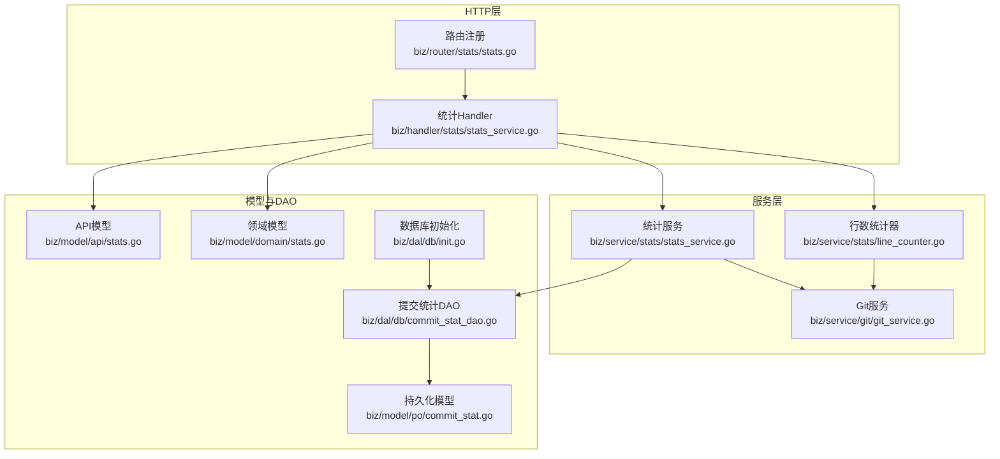
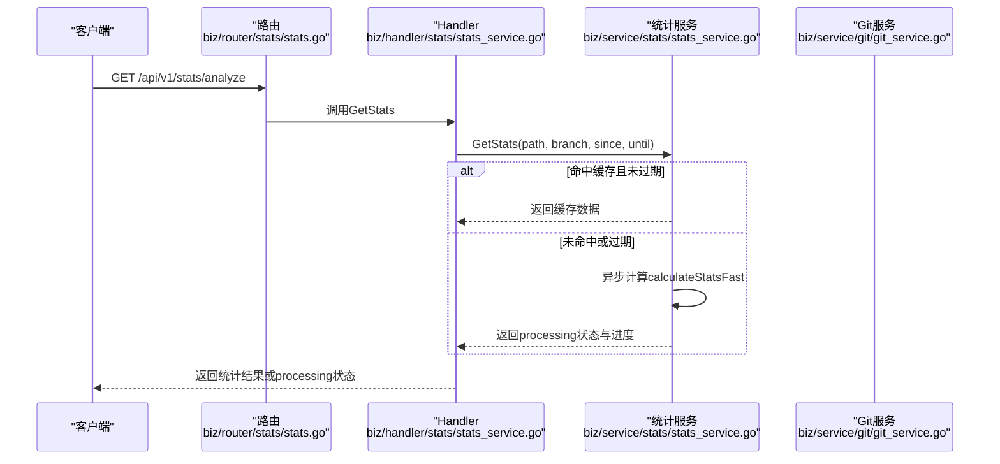
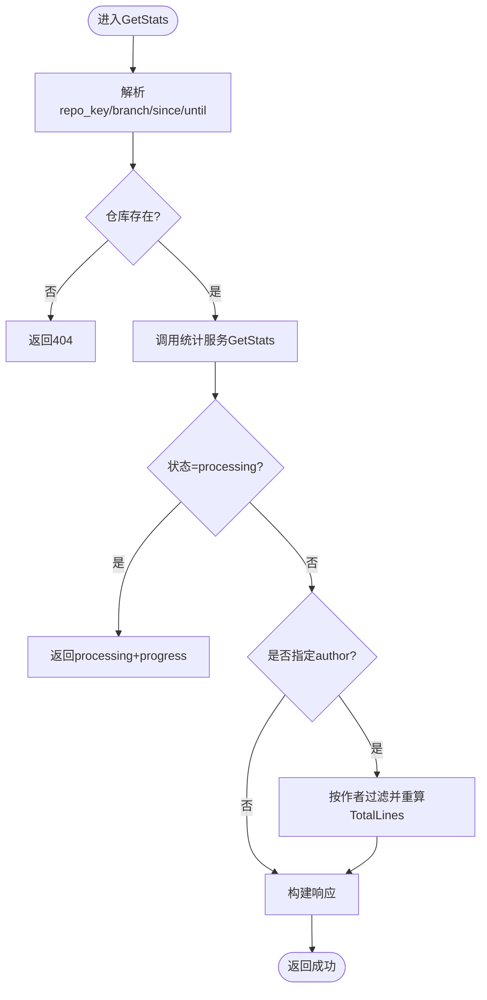
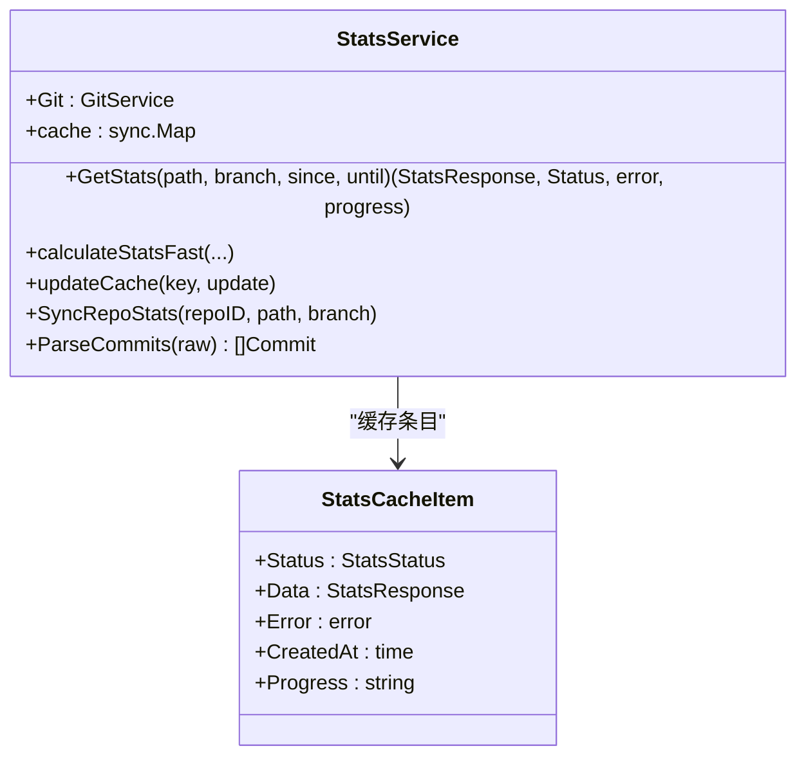
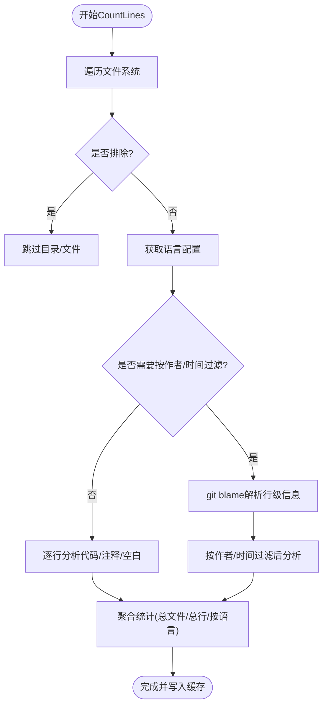
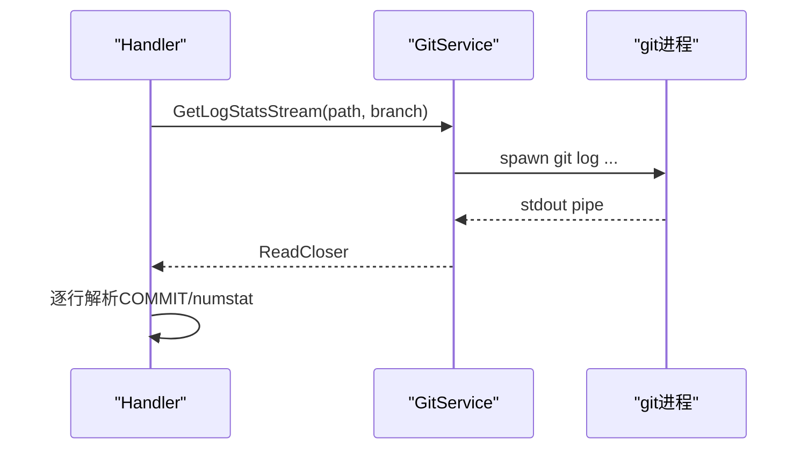
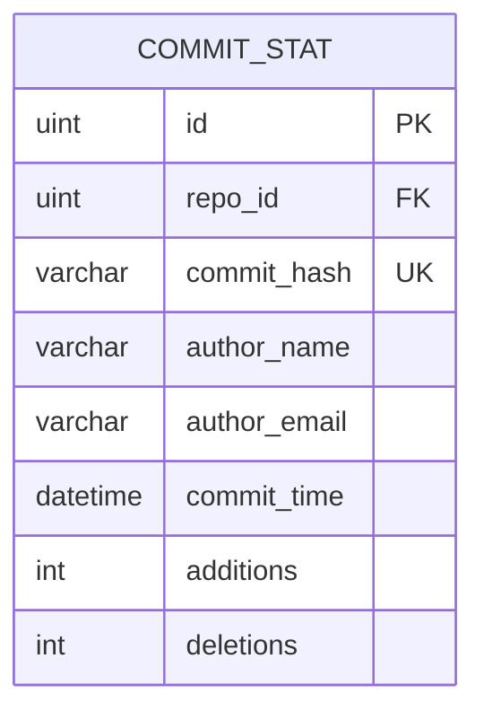
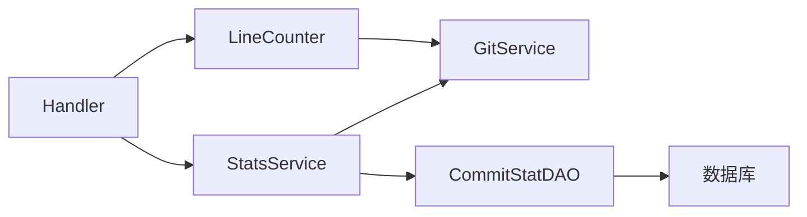

# 统计分析Handler

<cite>
**本文引用的文件**
- [main.go](file://main.go)
- [biz/handler/stats/stats_service.go](file://biz/handler/stats/stats_service.go)
- [biz/service/stats/stats_service.go](file://biz/service/stats/stats_service.go)
- [biz/service/stats/line_counter.go](file://biz/service/stats/line_counter.go)
- [biz/service/stats/language_config.go](file://biz/service/stats/language_config.go)
- [biz/service/git/git_service.go](file://biz/service/git/git_service.go)
- [biz/router/stats/stats.go](file://biz/router/stats/stats.go)
- [biz/model/api/stats.go](file://biz/model/api/stats.go)
- [biz/model/domain/stats.go](file://biz/model/domain/stats.go)
- [biz/dal/db/commit_stat_dao.go](file://biz/dal/db/commit_stat_dao.go)
- [biz/model/po/commit_stat.go](file://biz/model/po/commit_stat.go)
- [biz/dal/db/init.go](file://biz/dal/db/init.go)
</cite>

## 目录
1. [简介](#简介)
2. [项目结构](#项目结构)
3. [核心组件](#核心组件)
4. [架构概览](#架构概览)
5. [详细组件分析](#详细组件分析)
6. [依赖关系分析](#依赖关系分析)
7. [性能考量](#性能考量)
8. [故障排查指南](#故障排查指南)
9. [结论](#结论)
10. [附录](#附录)

## 简介
本文件面向统计分析Handler的技术文档，系统性阐述统计分析模块的Handler实现与内部机制，覆盖以下主题：
- Handler职责：提供统计分析接口、代码行数统计接口、导出CSV接口
- 数据收集与计算：基于git日志流的快速统计、基于文件扫描的语言分布统计
- 统计结果：贡献度量（按作者、按语言、按时间趋势）、代码行统计（按语言分类）
- 缓存策略：内存缓存与进度反馈、配置缓存与失效
- 触发时机：手动触发、后台异步计算、定时任务驱动的数据同步
- 查询优化：分页/筛选参数、导出接口、并发安全
- 性能优化与数据准确性：缓冲区优化、批处理写入、去重与过滤

## 项目结构
统计分析Handler位于biz/handler/stats/stats_service.go，配合biz/service/stats下的统计服务与文件扫描器，通过biz/service/git/git_service.go调用git命令或go-git库进行数据采集，并通过biz/router/stats/stats.go注册路由。

图表来源
- [biz/router/stats/stats.go](file://biz/router/stats/stats.go#L17-L48)
- [biz/handler/stats/stats_service.go](file://biz/handler/stats/stats_service.go#L1-L360)
- [biz/service/stats/stats_service.go](file://biz/service/stats/stats_service.go#L1-L372)
- [biz/service/stats/line_counter.go](file://biz/service/stats/line_counter.go#L1-L583)
- [biz/service/git/git_service.go](file://biz/service/git/git_service.go#L1-L1204)
- [biz/model/api/stats.go](file://biz/model/api/stats.go#L1-L50)
- [biz/model/domain/stats.go](file://biz/model/domain/stats.go#L1-L20)
- [biz/model/po/commit_stat.go](file://biz/model/po/commit_stat.go#L1-L23)
- [biz/dal/db/commit_stat_dao.go](file://biz/dal/db/commit_stat_dao.go#L1-L66)
- [biz/dal/db/init.go](file://biz/dal/db/init.go#L1-L72)

章节来源
- [biz/router/stats/stats.go](file://biz/router/stats/stats.go#L17-L48)
- [biz/handler/stats/stats_service.go](file://biz/handler/stats/stats_service.go#L1-L360)

## 核心组件
- 统计Handler：负责接收HTTP请求、参数校验、调用统计服务、返回响应与导出CSV
- 统计服务：封装缓存、异步计算、进度更新、基于git日志流的快速统计
- 行数统计器：封装文件扫描、语言识别、注释/空白/代码行识别、按作者/时间过滤
- Git服务：封装git命令执行、日志迭代、blame解析、分支/作者查询
- 数据模型：API响应模型、领域模型、持久化模型
- DAO与数据库：提交统计的批量写入、去重、分页查询

章节来源
- [biz/handler/stats/stats_service.go](file://biz/handler/stats/stats_service.go#L97-L149)
- [biz/service/stats/stats_service.go](file://biz/service/stats/stats_service.go#L39-L50)
- [biz/service/stats/line_counter.go](file://biz/service/stats/line_counter.go#L20-L74)
- [biz/service/git/git_service.go](file://biz/service/git/git_service.go#L781-L820)
- [biz/model/api/stats.go](file://biz/model/api/stats.go#L12-L36)
- [biz/model/po/commit_stat.go](file://biz/model/po/commit_stat.go#L9-L18)
- [biz/dal/db/commit_stat_dao.go](file://biz/dal/db/commit_stat_dao.go#L26-L36)

## 架构概览
统计分析Handler采用“HTTP路由 -> Handler -> 服务层 -> Git/文件系统”的分层设计，结合内存缓存与异步计算实现高并发下的低延迟响应。

图表来源
- [biz/router/stats/stats.go](file://biz/router/stats/stats.go#L26-L26)
- [biz/handler/stats/stats_service.go](file://biz/handler/stats/stats_service.go#L97-L149)
- [biz/service/stats/stats_service.go](file://biz/service/stats/stats_service.go#L179-L227)

## 详细组件分析

### Handler：统计分析与导出
- 统一入口：GetStats根据参数组装缓存键，调用统计服务；若处于processing状态则返回进度
- 过滤能力：支持按作者过滤作者维度统计，并重新计算总行数
- 导出CSV：ExportCSV输出作者维度的总有效行数与主语言

图表来源
- [biz/handler/stats/stats_service.go](file://biz/handler/stats/stats_service.go#L97-L149)

章节来源
- [biz/handler/stats/stats_service.go](file://biz/handler/stats/stats_service.go#L97-L149)
- [biz/handler/stats/stats_service.go](file://biz/handler/stats/stats_service.go#L151-L197)

### 统计服务：缓存与异步计算
- 缓存结构：StatsCacheItem包含状态、数据、错误、创建时间、进度
- 并发控制：LoadOrStore避免重复计算；updateCache更新进度
- 快速统计：calculateStatsFast基于git log --numstat流式解析，按提交聚合作者贡献、语言分布与时间趋势
- 进度反馈：每处理一定数量提交或周期性更新进度

图表来源
- [biz/service/stats/stats_service.go](file://biz/service/stats/stats_service.go#L39-L50)
- [biz/service/stats/stats_service.go](file://biz/service/stats/stats_service.go#L31-L37)
- [biz/service/stats/stats_service.go](file://biz/service/stats/stats_service.go#L179-L227)
- [biz/service/stats/stats_service.go](file://biz/service/stats/stats_service.go#L246-L371)

章节来源
- [biz/service/stats/stats_service.go](file://biz/service/stats/stats_service.go#L31-L50)
- [biz/service/stats/stats_service.go](file://biz/service/stats/stats_service.go#L179-L227)
- [biz/service/stats/stats_service.go](file://biz/service/stats/stats_service.go#L246-L371)

### 行数统计器：文件扫描与语言识别
- 单例模式：GetLineCounter确保全局唯一实例
- 缓存策略：LineCacheItem包含状态、数据、错误、创建时间、进度；1小时TTL
- 文件扫描：walkDir遍历文件，支持排除目录/模式、隐藏文件过滤
- 语言识别：language_config.go预置多种语言注释规则，按扩展名/文件名匹配
- 注释识别：状态机识别单行/多行注释、字符串转义，准确区分代码/注释/空白
- 过滤能力：支持按分支、作者、时间范围过滤（git blame）

图表来源
- [biz/service/stats/line_counter.go](file://biz/service/stats/line_counter.go#L154-L251)
- [biz/service/stats/line_counter.go](file://biz/service/stats/line_counter.go#L258-L371)
- [biz/service/stats/language_config.go](file://biz/service/stats/language_config.go#L19-L284)

章节来源
- [biz/service/stats/line_counter.go](file://biz/service/stats/line_counter.go#L68-L151)
- [biz/service/stats/line_counter.go](file://biz/service/stats/line_counter.go#L154-L251)
- [biz/service/stats/line_counter.go](file://biz/service/stats/line_counter.go#L258-L371)
- [biz/service/stats/language_config.go](file://biz/service/stats/language_config.go#L19-L284)

### Git服务：日志与流式处理
- 日志流：GetLogStatsStream通过git log --numstat --no-merges --pretty=format:COMMIT...输出流，Handler侧逐行解析
- 日志迭代：GetLogIterator返回go-git的commit迭代器，供后台同步使用
- blame解析：getGitBlameInfo解析--line-porcelain输出，构建行级作者/时间映射
- 作者/分支查询：GetAuthors、GetBranches等辅助统计

图表来源
- [biz/service/git/git_service.go](file://biz/service/git/git_service.go#L786-L820)
- [biz/handler/stats/stats_service.go](file://biz/handler/stats/stats_service.go#L116-L116)

章节来源
- [biz/service/git/git_service.go](file://biz/service/git/git_service.go#L781-L820)
- [biz/service/git/git_service.go](file://biz/service/git/git_service.go#L453-L576)

### 数据模型与DAO
- API模型：StatsResponse、AuthorStat、LineStatsResponse、LanguageStat等
- 领域模型：Commit、LineStat
- 持久化模型：CommitStat，包含仓库ID、提交哈希、作者、提交时间、增删行数
- DAO：FindLatestCommitTime、BatchSave（冲突更新）、按哈希集合查询

图表来源
- [biz/model/po/commit_stat.go](file://biz/model/po/commit_stat.go#L9-L18)
- [biz/dal/db/commit_stat_dao.go](file://biz/dal/db/commit_stat_dao.go#L16-L36)

章节来源
- [biz/model/api/stats.go](file://biz/model/api/stats.go#L12-L36)
- [biz/model/domain/stats.go](file://biz/model/domain/stats.go#L5-L12)
- [biz/model/po/commit_stat.go](file://biz/model/po/commit_stat.go#L9-L18)
- [biz/dal/db/commit_stat_dao.go](file://biz/dal/db/commit_stat_dao.go#L16-L36)

## 依赖关系分析
- Handler依赖统计服务与Git服务，间接依赖DAO与模型
- 统计服务依赖Git服务与DAO
- 行数统计器依赖Git服务与语言配置
- 路由注册在启动时完成，Handler在运行时被调用

图表来源
- [biz/handler/stats/stats_service.go](file://biz/handler/stats/stats_service.go#L1-L18)
- [biz/service/stats/stats_service.go](file://biz/service/stats/stats_service.go#L1-L21)
- [biz/service/stats/line_counter.go](file://biz/service/stats/line_counter.go#L1-L18)
- [biz/service/git/git_service.go](file://biz/service/git/git_service.go#L1-L25)
- [biz/dal/db/commit_stat_dao.go](file://biz/dal/db/commit_stat_dao.go#L1-L8)

章节来源
- [main.go](file://main.go#L129-L131)
- [biz/router/stats/stats.go](file://biz/router/stats/stats.go#L17-L48)

## 性能考量
- 流式处理：git log --numstat通过流式读取减少内存占用
- 缓冲优化：Scanner缓冲区增大，提升长行处理性能
- 批量写入：DAO BatchSave使用冲突更新，降低写入开销
- 并发安全：sync.Map用于缓存，避免锁竞争；异步计算避免阻塞请求
- 进度反馈：定期更新缓存进度，改善用户体验
- 文件扫描优化：预构建排除映射、跳过隐藏目录、按需blame

章节来源
- [biz/service/stats/stats_service.go](file://biz/service/stats/stats_service.go#L267-L271)
- [biz/dal/db/commit_stat_dao.go](file://biz/dal/db/commit_stat_dao.go#L26-L36)
- [biz/service/stats/line_counter.go](file://biz/service/stats/line_counter.go#L177-L248)

## 故障排查指南
- 请求参数缺失：repo_key必填，否则返回400
- 仓库不存在：返回404
- 计算进行中：返回processing状态与progress
- 导出CSV：若统计仍在计算，返回提示信息
- Git命令失败：RunCommand会返回错误输出，便于定位
- 数据库连接：init.go中根据配置选择dialector并迁移表

章节来源
- [biz/handler/stats/stats_service.go](file://biz/handler/stats/stats_service.go#L23-L41)
- [biz/handler/stats/stats_service.go](file://biz/handler/stats/stats_service.go#L151-L178)
- [biz/service/git/git_service.go](file://biz/service/git/git_service.go#L35-L48)
- [biz/dal/db/init.go](file://biz/dal/db/init.go#L18-L52)

## 结论
统计分析Handler通过“路由-处理器-服务-数据源”的清晰分层，结合内存缓存与异步计算，实现了对仓库贡献度量与代码行统计的高效查询与导出。Handler支持手动触发与后台异步计算，行数统计器具备强大的语言识别与过滤能力，整体架构兼顾性能与可维护性。

## 附录

### 统计任务触发时机
- 手动触发：GET /api/v1/stats/analyze
- 后台异步：首次请求或缓存过期时异步计算，后续请求返回processing状态
- 定时任务：通过SyncRepoStats按分支增量同步提交统计，配合DAO批量写入

章节来源
- [biz/handler/stats/stats_service.go](file://biz/handler/stats/stats_service.go#L97-L149)
- [biz/service/stats/stats_service.go](file://biz/service/stats/stats_service.go#L52-L139)
- [biz/dal/db/commit_stat_dao.go](file://biz/dal/db/commit_stat_dao.go#L26-L36)

### 数据准确性保障
- 增量同步：基于最新提交时间checkpoint，避免重复处理
- 冲突更新：BatchSave使用唯一索引冲突更新，保证幂等
- 去重作者：GetAuthors使用组合键去重
- 过滤严格：blame解析与时间边界处理，避免误判

章节来源
- [biz/service/stats/stats_service.go](file://biz/service/stats/stats_service.go#L57-L89)
- [biz/dal/db/commit_stat_dao.go](file://biz/dal/db/commit_stat_dao.go#L32-L35)
- [biz/service/git/git_service.go](file://biz/service/git/git_service.go#L1182-L1202)