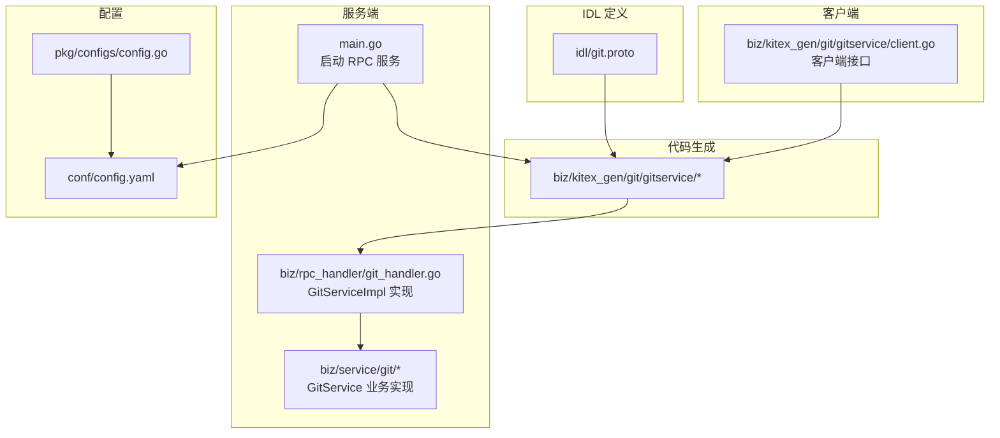
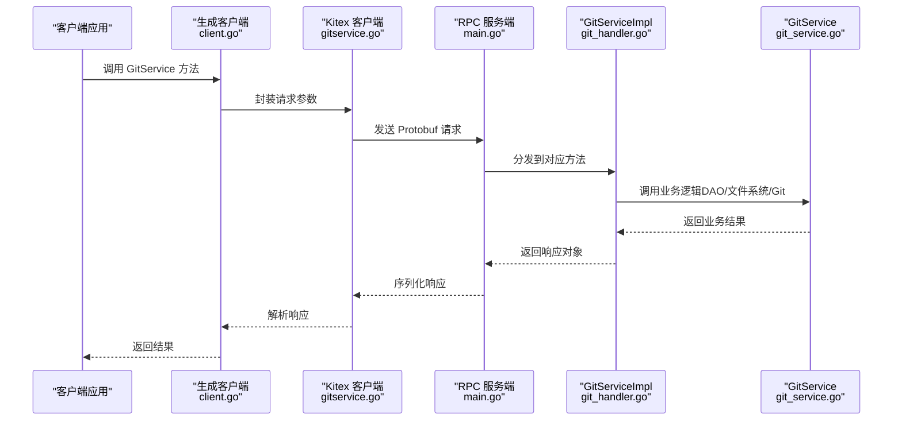
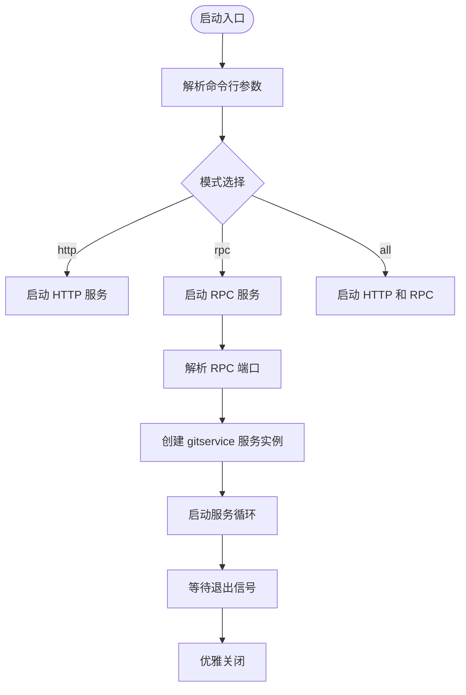
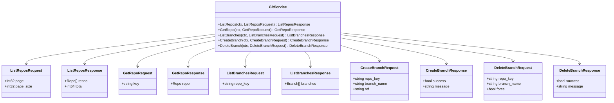
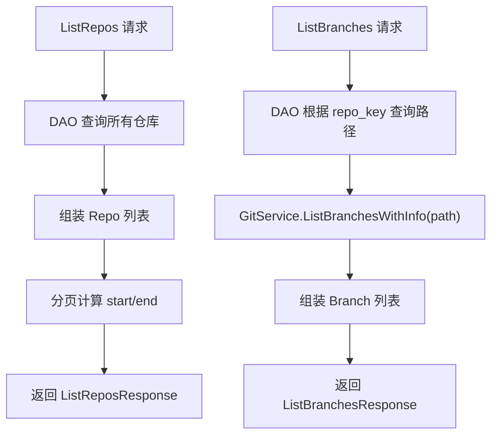
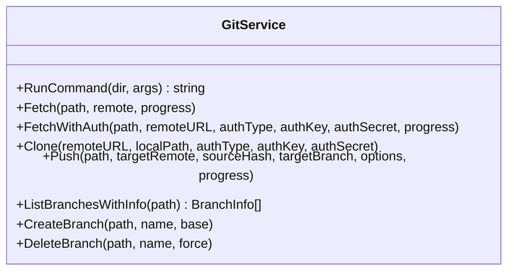
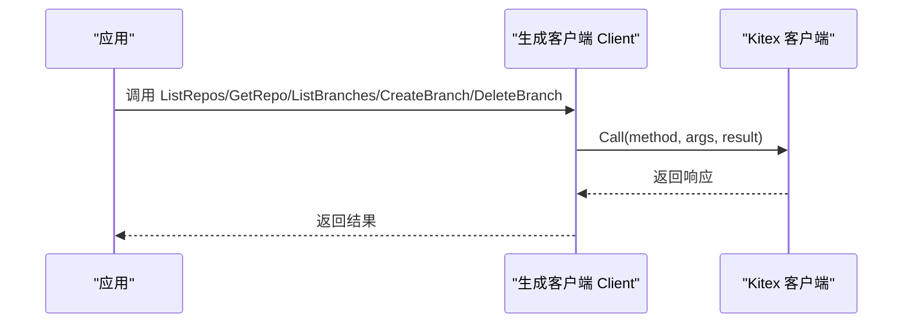
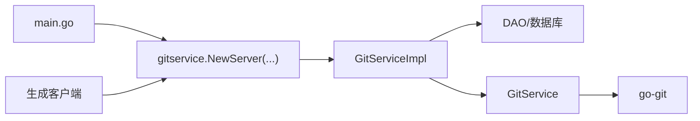

# RPC处理器

<cite>
**本文引用的文件**
- [main.go](file://main.go)
- [git_handler.go](file://biz/rpc_handler/git_handler.go)
- [git.proto](file://idl/git.proto)
- [gitservice.go](file://biz/kitex_gen/git/gitservice/gitservice.go)
- [client.go](file://biz/kitex_gen/git/gitservice/client.go)
- [git_service.go](file://biz/service/git/git_service.go)
- [git_branch.go](file://biz/service/git/git_branch.go)
- [config.go](file://pkg/configs/config.go)
- [config.yaml](file://conf/config.yaml)
- [kitex_info.yaml](file://biz/kitex_info.yaml)
- [gen.sh](file://script/gen.sh)
- [test_webhook_client_main.go](file://test/webhook_client/main.go)
</cite>

## 目录
1. [简介](#简介)
2. [项目结构](#项目结构)
3. [核心组件](#核心组件)
4. [架构总览](#架构总览)
5. [详细组件分析](#详细组件分析)
6. [依赖关系分析](#依赖关系分析)
7. [性能考虑](#性能考虑)
8. [故障排查指南](#故障排查指南)
9. [结论](#结论)
10. [附录](#附录)

## 简介
本技术文档围绕基于 CloudWeGo Kitex 的 RPC 处理器展开，系统性阐述 Git 服务的 RPC 接口定义、服务端实现、客户端调用模式、Protocol Buffer 序列化与反序列化机制、服务启动配置、以及性能优化与调试要点。文档同时对比 RPC 与 HTTP API 的差异与适用场景，帮助读者快速理解并高效使用该 RPC 架构。

## 项目结构
该项目采用“IDL 定义 + 代码生成 + 业务实现”的分层组织方式：
- IDL 层：通过 Protocol Buffer 描述服务契约与数据结构
- 生成层：Kitex 根据 IDL 生成服务端与客户端桩代码
- 业务层：服务端 Handler 实现具体业务逻辑；客户端通过生成的客户端接口发起调用
- 配置层：统一加载配置，控制 RPC/HTTP 服务端口与运行模式

图表来源
- [git.proto](file://idl/git.proto#L1-L78)
- [gitservice.go](file://biz/kitex_gen/git/gitservice/gitservice.go#L1-L117)
- [git_handler.go](file://biz/rpc_handler/git_handler.go#L1-L131)
- [git_service.go](file://biz/service/git/git_service.go#L1-L800)
- [client.go](file://biz/kitex_gen/git/gitservice/client.go#L1-L74)
- [config.yaml](file://conf/config.yaml#L1-L25)
- [config.go](file://pkg/configs/config.go#L1-L43)
- [main.go](file://main.go#L154-L175)

章节来源
- [main.go](file://main.go#L154-L175)
- [config.yaml](file://conf/config.yaml#L1-L25)
- [config.go](file://pkg/configs/config.go#L1-L43)

## 核心组件
- RPC 服务端入口与启动
  - 在主程序中根据启动模式选择启动 RPC 服务，并监听配置文件中的 RPC 端口
- Git 服务 RPC 接口定义
  - 通过 Protocol Buffer 定义 GitService 及其请求/响应消息类型
- 服务端处理器
  - GitServiceImpl 实现 ListRepos、GetRepo、ListBranches、CreateBranch、DeleteBranch 等方法
- 业务服务层
  - GitService 提供克隆、拉取、推送、分支管理等底层 Git 操作封装
- 客户端桩代码
  - 生成的客户端接口提供与服务端一致的方法签名，便于跨进程调用
- 配置与代码生成
  - 统一配置加载；通过脚本一键生成 Kitex 客户端/服务端代码

章节来源
- [main.go](file://main.go#L154-L175)
- [git.proto](file://idl/git.proto#L1-L78)
- [git_handler.go](file://biz/rpc_handler/git_handler.go#L12-L131)
- [git_service.go](file://biz/service/git/git_service.go#L27-L31)
- [client.go](file://biz/kitex_gen/git/gitservice/client.go#L12-L44)
- [config.yaml](file://conf/config.yaml#L4-L5)
- [gen.sh](file://script/gen.sh#L68-L80)

## 架构总览
下图展示了从客户端到服务端的完整调用链路，包括协议编解码、服务发现与路由、以及业务处理流程。

图表来源
- [client.go](file://biz/kitex_gen/git/gitservice/client.go#L50-L73)
- [gitservice.go](file://biz/kitex_gen/git/gitservice/gitservice.go#L684-L732)
- [main.go](file://main.go#L162-L165)
- [git_handler.go](file://biz/rpc_handler/git_handler.go#L16-L131)
- [git_service.go](file://biz/service/git/git_service.go#L129-L131)

## 详细组件分析

### RPC 服务端启动与配置
- 启动模式
  - 支持 http、rpc、all 三种模式，分别启动 HTTP 服务、RPC 服务或两者
- RPC 端口
  - 从配置文件读取 rpc.port 并绑定 TCP 地址
- 优雅关闭
  - 捕获系统信号，统一进行服务停止与资源释放

图表来源
- [main.go](file://main.go#L52-L113)
- [main.go](file://main.go#L154-L175)
- [config.yaml](file://conf/config.yaml#L4-L5)

章节来源
- [main.go](file://main.go#L52-L113)
- [main.go](file://main.go#L154-L175)
- [config.yaml](file://conf/config.yaml#L4-L5)

### Protocol Buffer 接口定义与消息编解码
- 接口定义
  - GitService 包含 ListRepos、GetRepo、ListBranches、CreateBranch、DeleteBranch 五个 RPC 方法
  - 请求/响应消息类型均以 Protobuf 消息定义，字段语义清晰
- 编解码机制
  - 生成的服务端/客户端代码使用 Protobuf 进行序列化与反序列化
  - 服务端通过方法处理器接收请求并调用业务层，再将响应序列化返回

图表来源
- [git.proto](file://idl/git.proto#L5-L11)
- [git.proto](file://idl/git.proto#L31-L39)
- [git.proto](file://idl/git.proto#L41-L47)
- [git.proto](file://idl/git.proto#L49-L55)
- [git.proto](file://idl/git.proto#L57-L66)
- [git.proto](file://idl/git.proto#L68-L77)

章节来源
- [git.proto](file://idl/git.proto#L1-L78)

### 服务端处理器：GitServiceImpl
- 方法职责
  - ListRepos：查询所有仓库并分页返回
  - GetRepo：按仓库键查询单个仓库
  - ListBranches：列出指定仓库的分支详情
  - CreateBranch/DeleteBranch：创建与删除分支
- 数据流转
  - 处理器从 DAO 获取数据或调用 GitService 执行底层操作
  - 将领域模型转换为 Protobuf 响应消息返回

图表来源
- [git_handler.go](file://biz/rpc_handler/git_handler.go#L16-L51)
- [git_handler.go](file://biz/rpc_handler/git_handler.go#L73-L100)
- [git_branch.go](file://biz/service/git/git_branch.go#L14-L79)

章节来源
- [git_handler.go](file://biz/rpc_handler/git_handler.go#L12-L131)
- [git_branch.go](file://biz/service/git/git_branch.go#L14-L79)

### 业务服务层：GitService
- 功能范围
  - 仓库打开、克隆、拉取、推送、分支管理、提交日志、状态查询等
- 认证与传输
  - 支持 HTTP Basic 与 SSH 公钥认证；自动检测 SSH Agent 与常见密钥路径
- 命令执行
  - 对于 go-git 不支持的操作，回退到原生 git 命令执行，确保兼容性

图表来源
- [git_service.go](file://biz/service/git/git_service.go#L35-L48)
- [git_service.go](file://biz/service/git/git_service.go#L138-L191)
- [git_service.go](file://biz/service/git/git_service.go#L197-L218)
- [git_service.go](file://biz/service/git/git_service.go#L292-L323)
- [git_branch.go](file://biz/service/git/git_branch.go#L81-L116)

章节来源
- [git_service.go](file://biz/service/git/git_service.go#L27-L31)
- [git_service.go](file://biz/service/git/git_service.go#L50-L127)
- [git_branch.go](file://biz/service/git/git_branch.go#L81-L116)

### 客户端调用模式
- 客户端接口
  - 生成的 Client 接口提供与服务端一致的方法签名，支持传入选项
- 调用流程
  - 客户端构造请求消息，通过 Kitex 客户端发送至服务端
  - 服务端处理器执行业务逻辑后返回响应

图表来源
- [client.go](file://biz/kitex_gen/git/gitservice/client.go#L12-L44)
- [gitservice.go](file://biz/kitex_gen/git/gitservice/gitservice.go#L684-L732)

章节来源
- [client.go](file://biz/kitex_gen/git/gitservice/client.go#L12-L73)
- [gitservice.go](file://biz/kitex_gen/git/gitservice/gitservice.go#L684-L732)

### 代码生成与工具链
- 生成内容
  - 服务端与客户端桩代码、服务信息、方法处理器与消息编解码器
- 生成脚本
  - 自动检测工具、生成 Kitex 代码、格式化与模块整理

章节来源
- [gitservice.go](file://biz/kitex_gen/git/gitservice/gitservice.go#L1-L117)
- [gen.sh](file://script/gen.sh#L68-L80)

## 依赖关系分析
- 组件耦合
  - 服务端处理器仅依赖 DAO 与业务服务层，保持良好的分层
  - 客户端通过生成的接口与服务端解耦
- 外部依赖
  - go-git 用于高性能 Git 操作
  - Protobuf 作为序列化协议
  - Kitex 提供 RPC 通信与编解码能力

图表来源
- [main.go](file://main.go#L162-L165)
- [git_handler.go](file://biz/rpc_handler/git_handler.go#L12-L131)
- [git_service.go](file://biz/service/git/git_service.go#L129-L131)
- [client.go](file://biz/kitex_gen/git/gitservice/client.go#L22-L34)

章节来源
- [main.go](file://main.go#L162-L165)
- [git_handler.go](file://biz/rpc_handler/git_handler.go#L12-L131)
- [git_service.go](file://biz/service/git/git_service.go#L129-L131)
- [client.go](file://biz/kitex_gen/git/gitservice/client.go#L22-L34)

## 性能考虑
- 序列化开销
  - Protobuf 相比 JSON 更轻量，适合高频 RPC 调用
- 并发与连接
  - 客户端可复用连接，减少握手成本；服务端可通过并发处理提升吞吐
- 业务层优化
  - 对于昂贵操作（如分支统计），建议缓存或限制调用频率
- IO 与网络
  - Git 操作涉及磁盘与网络 IO，建议在业务层增加进度回调与超时控制

## 故障排查指南
- 常见问题定位
  - 端口占用：确认 rpc.port 是否被占用
  - 权限与密钥：SSH 密钥路径与权限、Agent 是否可用
  - 认证失败：检查 HTTP Basic 用户名/密码或 SSH 私钥
- 日志与调试
  - 开启 Debug 模式查看命令执行细节
  - 使用客户端选项设置超时与重试策略
- 配置校验
  - 确认配置文件加载成功，环境变量覆盖生效

章节来源
- [config.go](file://pkg/configs/config.go#L18-L42)
- [git_service.go](file://biz/service/git/git_service.go#L36-L48)
- [git_service.go](file://biz/service/git/git_service.go#L84-L126)

## 结论
本项目以 Kitex 为核心，结合 Protobuf 与 go-git，构建了稳定高效的 Git 管理 RPC 服务。通过清晰的分层设计与完善的代码生成流程，开发者可以快速扩展新的 RPC 接口并集成到现有业务中。配合合理的性能优化与故障排查策略，可在生产环境中获得可靠的运行表现。

## 附录

### RPC 与 HTTP API 的区别与适用场景
- RPC（Kitex + Protobuf）
  - 优点：强类型接口、二进制序列化、低开销、易于微服务间通信
  - 适用：内部服务调用、高并发、低延迟场景
- HTTP API（Hz + Swagger）
  - 优点：易调试、浏览器直连、生态丰富
  - 适用：对外暴露、前端直连、网关代理

章节来源
- [main.go](file://main.go#L136-L152)
- [test_webhook_client_main.go](file://test/webhook_client/main.go#L1-L36)

### RPC 服务调用示例与调试技巧
- 示例
  - 客户端调用：参考生成的客户端接口方法签名，传入请求消息并处理响应
  - 服务端启动：通过命令行模式选择启动 RPC 服务，监听配置端口
- 调试
  - 启用 Debug 模式观察命令执行输出
  - 使用超时与重试选项避免长时间阻塞
  - 关注服务端日志与优雅关闭流程

章节来源
- [client.go](file://biz/kitex_gen/git/gitservice/client.go#L50-L73)
- [main.go](file://main.go#L154-L175)
- [git_service.go](file://biz/service/git/git_service.go#L36-L48)