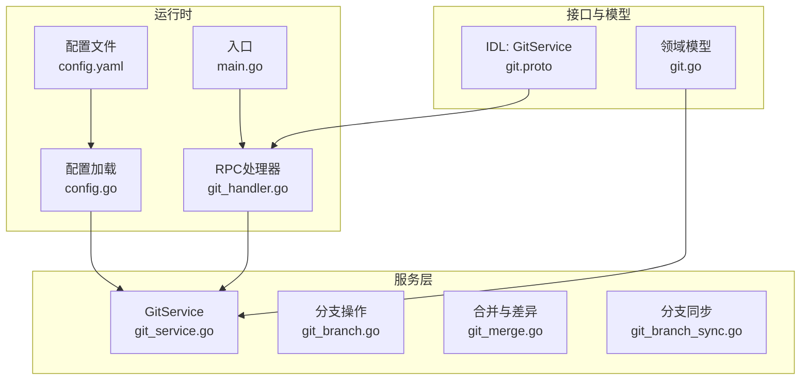
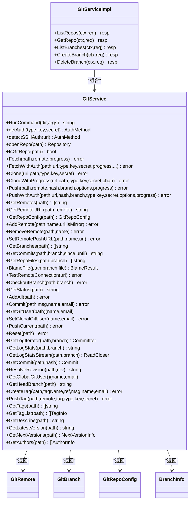
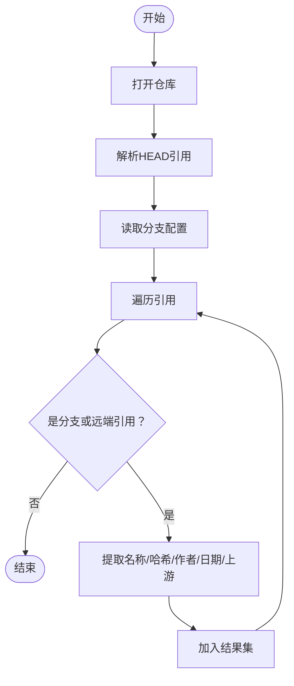
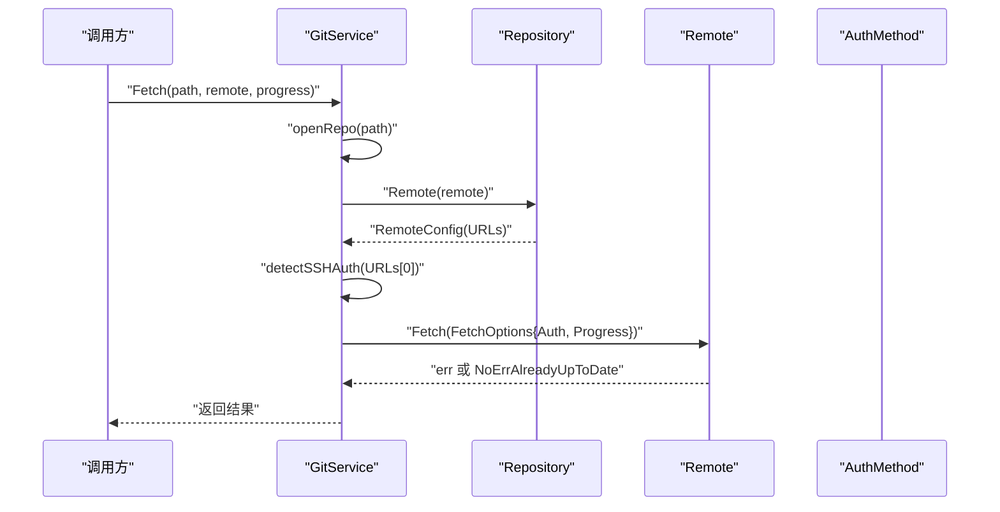
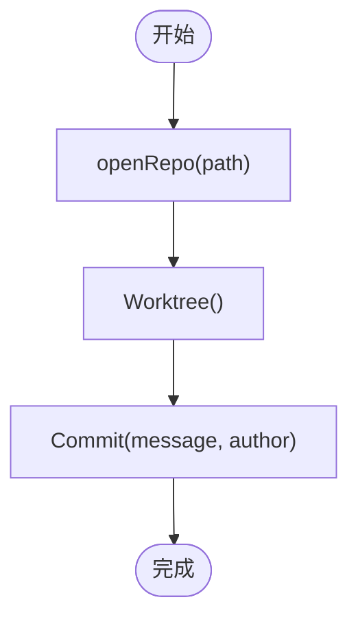
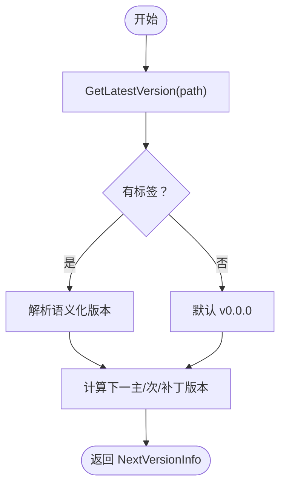
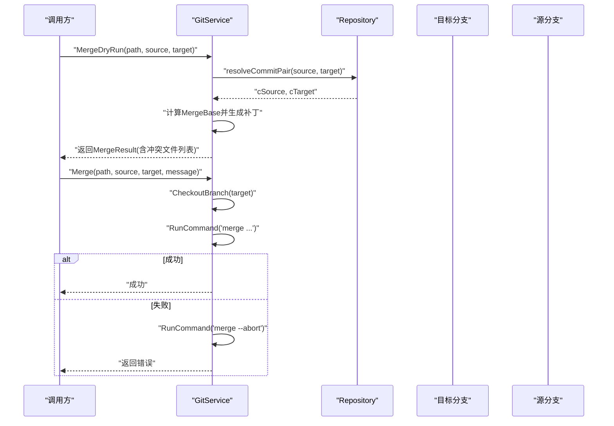
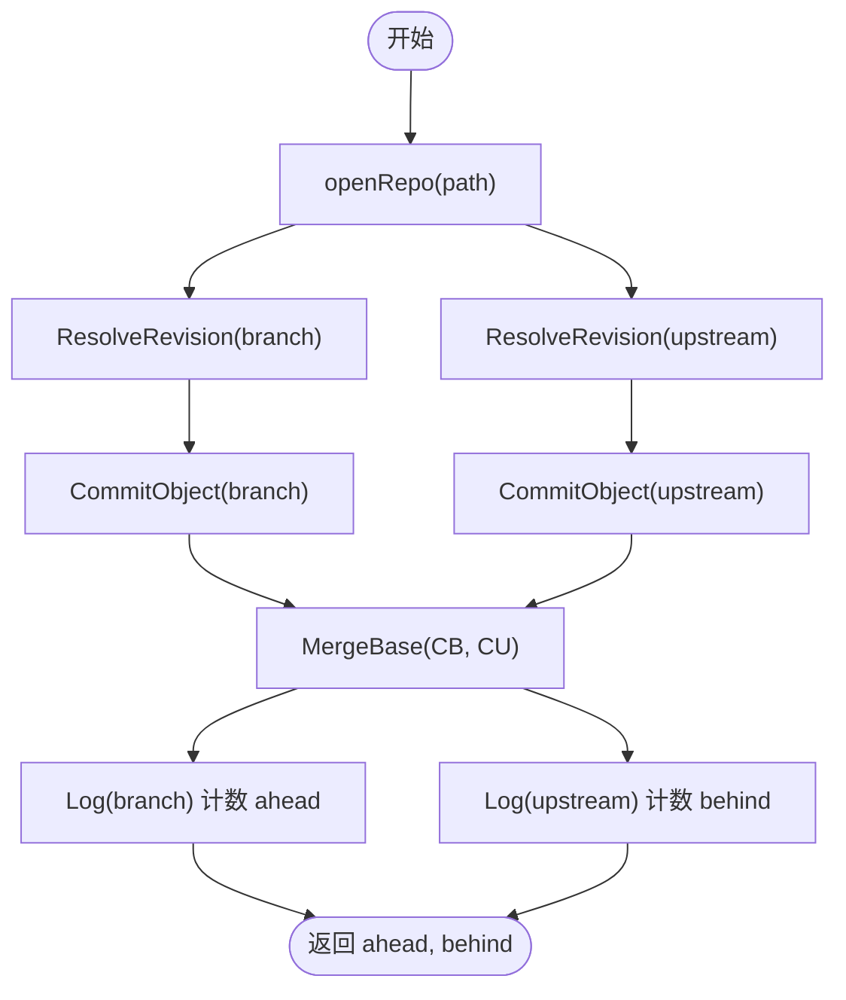
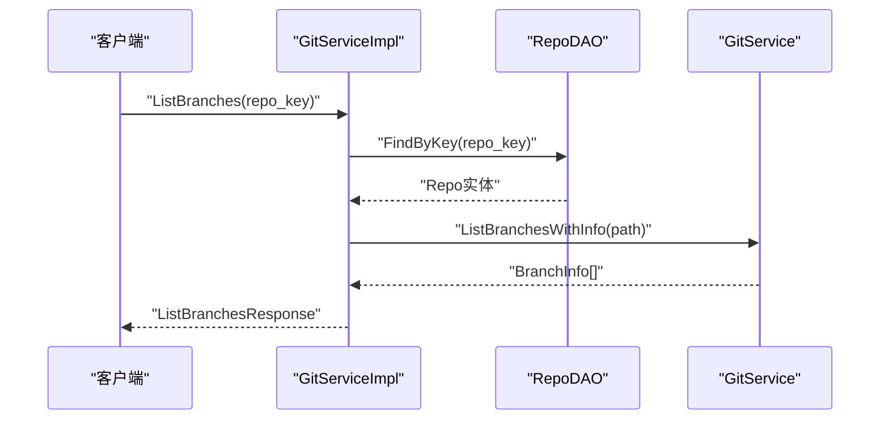
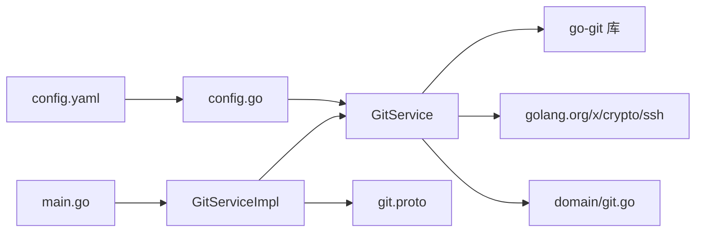

# Git服务

<cite>
**本文引用的文件**
- [git_service.go](file://biz/service/git/git_service.go)
- [git_branch.go](file://biz/service/git/git_branch.go)
- [git_merge.go](file://biz/service/git/git_merge.go)
- [git_branch_sync.go](file://biz/service/git/git_branch_sync.go)
- [git_handler.go](file://biz/rpc_handler/git_handler.go)
- [git.proto](file://idl/git.proto)
- [git.go](file://biz/model/domain/git.go)
- [config.go](file://pkg/configs/config.go)
- [config.yaml](file://conf/config.yaml)
- [main.go](file://main.go)
</cite>

## 目录
1. [简介](#简介)
2. [项目结构](#项目结构)
3. [核心组件](#核心组件)
4. [架构总览](#架构总览)
5. [详细组件分析](#详细组件分析)
6. [依赖关系分析](#依赖关系分析)
7. [性能考量](#性能考量)
8. [故障排查指南](#故障排查指南)
9. [结论](#结论)
10. [附录](#附录)

## 简介
本文件面向“Git服务模块”的技术文档，系统性阐述其核心功能与实现细节，覆盖仓库克隆、分支管理、远程操作、提交与标签、差异与合并、版本描述与演进、以及错误处理、进度回调与日志记录等。文档同时给出架构图、流程图与类图，帮助读者快速理解并正确使用该模块。

## 项目结构
围绕Git服务模块的关键目录与文件如下：
- 服务层：biz/service/git 下的 git_service.go、git_branch.go、git_merge.go、git_branch_sync.go
- RPC处理器：biz/rpc_handler/git_handler.go
- 接口定义：idl/git.proto
- 数据模型：biz/model/domain/git.go
- 配置：pkg/configs/config.go、conf/config.yaml
- 入口：main.go

图表来源
- [git_service.go](file://biz/service/git/git_service.go#L1-L1204)
- [git_branch.go](file://biz/service/git/git_branch.go#L1-L187)
- [git_merge.go](file://biz/service/git/git_merge.go#L1-L263)
- [git_branch_sync.go](file://biz/service/git/git_branch_sync.go#L1-L214)
- [git_handler.go](file://biz/rpc_handler/git_handler.go#L1-L131)
- [git.proto](file://idl/git.proto#L1-L78)
- [git.go](file://biz/model/domain/git.go#L1-L40)
- [config.go](file://pkg/configs/config.go#L1-L43)
- [config.yaml](file://conf/config.yaml#L1-L25)
- [main.go](file://main.go#L1-L176)

章节来源
- [git_service.go](file://biz/service/git/git_service.go#L1-L1204)
- [git_handler.go](file://biz/rpc_handler/git_handler.go#L1-L131)
- [git.proto](file://idl/git.proto#L1-L78)
- [git.go](file://biz/model/domain/git.go#L1-L40)
- [config.go](file://pkg/configs/config.go#L1-L43)
- [config.yaml](file://conf/config.yaml#L1-L25)
- [main.go](file://main.go#L1-L176)

## 核心组件
- GitService：封装所有Git操作的统一入口，负责仓库打开、认证、远程操作、分支与标签、提交与统计、版本描述、差异与合并等。
- 分支操作模块：提供分支列表、创建、删除、重命名、描述设置、指标统计等。
- 合并与差异模块：提供差异统计、变更文件列表、原始diff、合并预检（干跑）、实际合并等。
- 分支同步模块：提供上游同步状态计算、推送、拉取、快进更新、全远程抓取等。
- RPC处理器：将GitService能力暴露为Kitex RPC服务，供上层调用。
- 领域模型：GitRemote、GitBranch、GitRepoConfig、BranchInfo等，用于对外返回结构化数据。

章节来源
- [git_service.go](file://biz/service/git/git_service.go#L27-L1204)
- [git_branch.go](file://biz/service/git/git_branch.go#L13-L187)
- [git_merge.go](file://biz/service/git/git_merge.go#L10-L263)
- [git_branch_sync.go](file://biz/service/git/git_branch_sync.go#L13-L214)
- [git_handler.go](file://biz/rpc_handler/git_handler.go#L12-L131)
- [git.go](file://biz/model/domain/git.go#L5-L40)

## 架构总览
Git服务采用“服务层 + RPC处理器 + 领域模型 + 配置”的分层设计，通过go-git库进行本地仓库操作，并在必要场景下回退到原生命令以获得更完整的功能支持（例如复杂合并逻辑）。

图表来源
- [git_service.go](file://biz/service/git/git_service.go#L27-L1204)
- [git_handler.go](file://biz/rpc_handler/git_handler.go#L12-L131)
- [git.go](file://biz/model/domain/git.go#L5-L40)

## 详细组件分析

### GitService 结构体与设计
- 设计要点
  - 统一入口：所有Git操作均通过GitService方法完成，便于集中管理认证、进度、日志与错误处理。
  - 多种认证：支持HTTP Basic与SSH公钥；SSH支持从~/.ssh常见路径自动加载或SSH Agent。
  - 进度回调：通过io.Writer或channelWriter将进度输出转发至调用方。
  - 原生命令回退：当go-git不支持的功能（如复杂合并）时，使用原生命令执行。
  - 任务管理：内置TaskManager用于异步克隆的进度与状态跟踪。

- 关键方法概览
  - 认证与远程：getAuth、detectSSHAuth、TestRemoteConnection
  - 仓库与远程：openRepo、IsGitRepo、GetRemotes、GetRemoteURL、AddRemote、RemoveRemote、SetRemotePushURL、GetRepoConfig
  - 克隆与抓取：Clone、CloneWithProgress、Fetch、FetchWithAuth、FetchAll
  - 推送与当前分支：Push、PushWithAuth、PushCurrent
  - 分支：GetBranches、CheckoutBranch、GetHeadBranch、ListBranchesWithInfo、CreateBranch、DeleteBranch、RenameBranch、GetBranchDescription、SetBranchDescription、GetBranchMetrics
  - 提交与工作区：GetStatus、AddAll、Commit、Reset、GetLogIterator、GetLogStats、GetLogStatsStream、GetCommits、GetRepoFiles、BlameFile
  - 标签：CreateTag、PushTag、GetTags、GetTagList
  - 版本：GetDescribe、GetLatestVersion、GetNextVersions
  - 差异与合并：GetDiffStat、GetDiffFiles、GetRawDiff、MergeDryRun、Merge、GetPatch
  - 用户与全局配置：GetGitUser、SetGlobalGitUser、GetGlobalGitUser

章节来源
- [git_service.go](file://biz/service/git/git_service.go#L27-L1204)

### 分支管理
- 列表与详情：ListBranchesWithInfo返回每个分支的名称、当前是否HEAD、最新提交信息、上游引用等。
- 创建/删除/重命名：CreateBranch、DeleteBranch、RenameBranch基于引用存储直接操作。
- 描述与指标：SetBranchDescription、GetBranchDescription、GetBranchMetrics（提交计数）。
- 同步状态：GetBranchSyncStatus计算ahead/behind，用于判断本地分支落后或超前上游的程度。

图表来源
- [git_branch.go](file://biz/service/git/git_branch.go#L13-L79)

章节来源
- [git_branch.go](file://biz/service/git/git_branch.go#L13-L187)

### 远程操作与认证
- 自动检测SSH认证：detectSSHAuth根据URL协议或用户尝试常见密钥路径与SSH Agent。
- 显式HTTP Basic认证：getAuth根据类型与凭据构造BasicAuth。
- 远程管理：AddRemote、RemoveRemote、SetRemotePushURL、GetRemoteURL、GetRemotes、GetRepoConfig。
- 连通性测试：TestRemoteConnection通过匿名远程List验证连通性。

图表来源
- [git_service.go](file://biz/service/git/git_service.go#L138-L191)

章节来源
- [git_service.go](file://biz/service/git/git_service.go#L50-L127)
- [git_service.go](file://biz/service/git/git_service.go#L411-L451)

### 提交与工作区
- 状态与暂存：GetStatus、AddAll、Reset。
- 提交：Commit支持自定义作者信息，若未提供则使用默认值。
- 日志与统计：GetLogIterator、GetLogStats、GetLogStatsStream、GetCommits、GetRepoFiles、BlameFile。
- 修订解析：ResolveRevision、GetCommit、GetHeadBranch。

图表来源
- [git_service.go](file://biz/service/git/git_service.go#L639-L665)

章节来源
- [git_service.go](file://biz/service/git/git_service.go#L594-L665)
- [git_service.go](file://biz/service/git/git_service.go#L769-L806)

### 标签与版本
- 标签：CreateTag、PushTag、GetTags、GetTagList。
- 版本描述：GetDescribe、GetLatestVersion、GetNextVersions（基于语义化版本规则推导下一主/次/补丁版本）。

图表来源
- [git_service.go](file://biz/service/git/git_service.go#L1089-L1161)

章节来源
- [git_service.go](file://biz/service/git/git_service.go#L953-L1016)
- [git_service.go](file://biz/service/git/git_service.go#L1082-L1161)

### 差异与合并
- 差异：GetDiffStat、GetDiffFiles、GetRawDiff、GetPatch。
- 合并：MergeDryRun（基于补丁对比预检冲突）、Merge（实际合并，失败时自动中止）。

图表来源
- [git_merge.go](file://biz/service/git/git_merge.go#L157-L242)

章节来源
- [git_merge.go](file://biz/service/git/git_merge.go#L21-L263)

### 分支同步
- 同步状态：GetBranchSyncStatus计算ahead/behind。
- 推送/拉取：PushBranch、PullBranch。
- 快进更新：UpdateBranchFastForward（非当前分支的快进更新）。
- 全部抓取：FetchAll遍历所有远程并抓取。

图表来源
- [git_branch_sync.go](file://biz/service/git/git_branch_sync.go#L13-L85)

章节来源
- [git_branch_sync.go](file://biz/service/git/git_branch_sync.go#L87-L214)

### RPC接口与处理器
- 接口定义：idl/git.proto声明了ListRepos、GetRepo、ListBranches、CreateBranch、DeleteBranch等RPC方法。
- 处理器：GitServiceImpl在RPC层调用GitService完成具体操作，并将领域模型转换为IDL响应。

图表来源
- [git_handler.go](file://biz/rpc_handler/git_handler.go#L72-L100)
- [git.proto](file://idl/git.proto#L5-L11)

章节来源
- [git_handler.go](file://biz/rpc_handler/git_handler.go#L12-L131)
- [git.proto](file://idl/git.proto#L1-L78)

## 依赖关系分析
- 内部依赖
  - GitServiceImpl依赖GitService提供的所有能力。
  - GitService内部依赖go-git库与golang.org/x/crypto/ssh。
  - 领域模型由GitService方法返回，供RPC层序列化。
- 外部依赖
  - 配置：pkg/configs/config.go与conf/config.yaml提供运行时配置（端口、数据库、Webhook等）。
  - 入口：main.go启动HTTP与RPC服务，注册路由与RPC服务。

图表来源
- [git_handler.go](file://biz/rpc_handler/git_handler.go#L12-L131)
- [git_service.go](file://biz/service/git/git_service.go#L3-L25)
- [git.go](file://biz/model/domain/git.go#L1-L40)
- [config.go](file://pkg/configs/config.go#L1-L43)
- [config.yaml](file://conf/config.yaml#L1-L25)
- [main.go](file://main.go#L136-L175)

章节来源
- [git_handler.go](file://biz/rpc_handler/git_handler.go#L12-L131)
- [git_service.go](file://biz/service/git/git_service.go#L3-L25)
- [git.go](file://biz/model/domain/git.go#L1-L40)
- [config.go](file://pkg/configs/config.go#L1-L43)
- [config.yaml](file://conf/config.yaml#L1-L25)
- [main.go](file://main.go#L136-L175)

## 性能考量
- 日志与统计
  - GetLogStats与GetLogStatsStream通过原生命令执行，适合流式输出，避免一次性加载大量提交导致内存压力。
  - GetBranchMetrics使用Log迭代计数，应谨慎使用或限制范围，避免长时间阻塞。
- 差异与合并
  - GetDiffStat与GetDiffFiles基于补丁统计，复杂仓库可能产生大量文件变更，建议分页或限制范围。
  - MergeDryRun仅基于补丁文件集合判断潜在冲突，实际合并仍需谨慎。
- 远程抓取
  - FetchAll会遍历所有远程并抓取，建议在后台任务中按需执行，避免频繁I/O。
- 进度回调
  - CloneWithProgress与Push/Clone等支持进度回调，建议在高并发场景下避免过度刷新UI导致性能下降。

[本节为通用性能建议，无需特定文件引用]

## 故障排查指南
- 认证失败
  - 检查SSH密钥路径与权限，确认detectSSHAuth可从~/.ssh加载或SSH Agent可用。
  - 对于HTTP Basic，确认用户名与密码正确。
- 远程连接失败
  - 使用TestRemoteConnection快速验证URL可达性与认证。
- 合并冲突
  - 使用MergeDryRun预检冲突，定位冲突文件后手动解决再提交。
  - 若合并失败，GitService会自动执行merge --abort恢复状态。
- 推送失败
  - 检查PushOptions（如强制推送、修剪），确认目标分支保护策略。
- 日志与调试
  - 在DebugMode开启时，RunCommand会打印执行命令与输出，便于定位问题。
- 任务管理
  - 异步克隆可通过TaskManager查询进度与错误信息。

章节来源
- [git_service.go](file://biz/service/git/git_service.go#L33-L48)
- [git_service.go](file://biz/service/git/git_service.go#L154-L163)
- [git_merge.go](file://biz/service/git/git_merge.go#L220-L242)

## 结论
Git服务模块以GitService为核心，结合go-git与原生命令，提供了从仓库克隆、分支管理、远程操作、提交与标签、差异与合并到版本描述与同步的完整能力。通过清晰的领域模型与RPC接口，模块既满足内部业务需求，也便于外部系统集成。建议在生产环境中合理使用进度回调、日志与任务管理，配合严格的认证与远程策略，确保稳定性与安全性。

[本节为总结性内容，无需特定文件引用]

## 附录

### 使用示例与最佳实践
- 克隆仓库（带进度）
  - 调用 CloneWithProgress，传入进度通道，实时接收进度字符串。
- 推送分支
  - 使用 Push 或 PushWithAuth，根据目标仓库是否需要认证选择合适方法。
- 合并预检
  - 使用 MergeDryRun 检测潜在冲突，再决定是否执行 Merge。
- 分支同步
  - 使用 GetBranchSyncStatus 获取 ahead/behind，再决定 Pull/Push。
- 标签与版本
  - CreateTag/PushTag 管理标签；GetNextVersions 辅助版本规划。
- 最佳实践
  - 优先使用GitService提供的方法，避免直接操作底层引用。
  - 在高并发场景下，合理拆分任务，避免长时间阻塞。
  - 对敏感操作（如强制推送）增加二次确认与审计日志。

[本节为通用指导，无需特定文件引用]