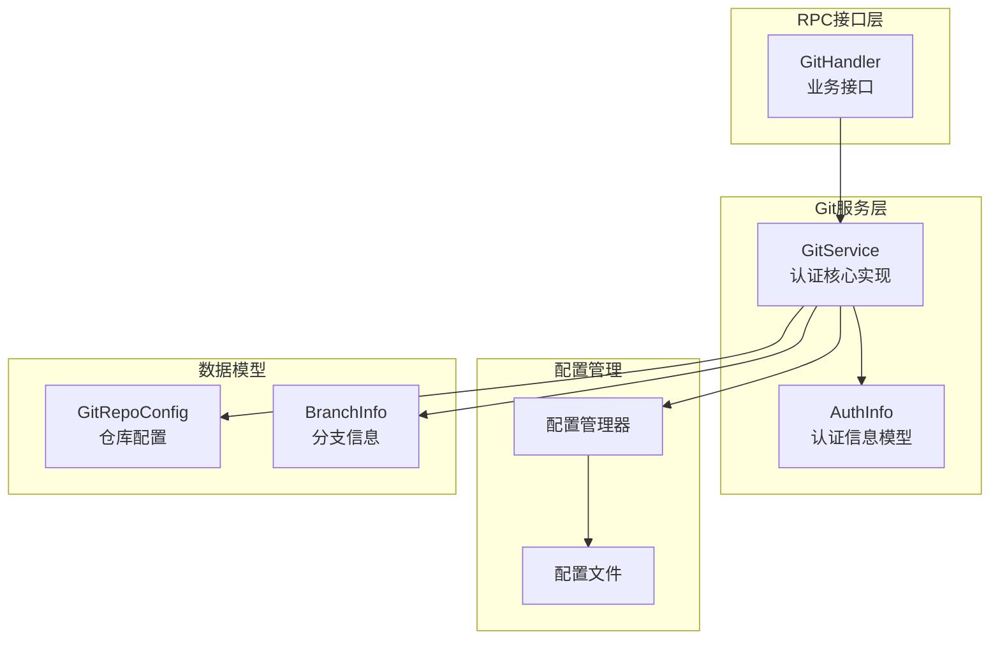
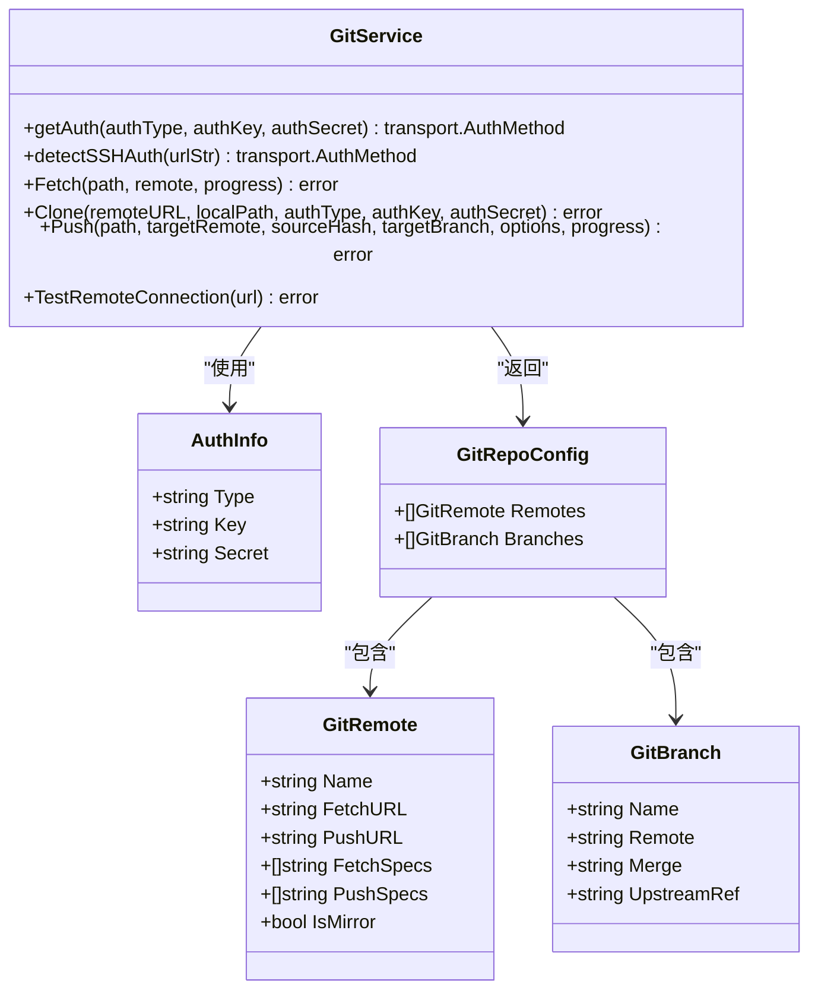
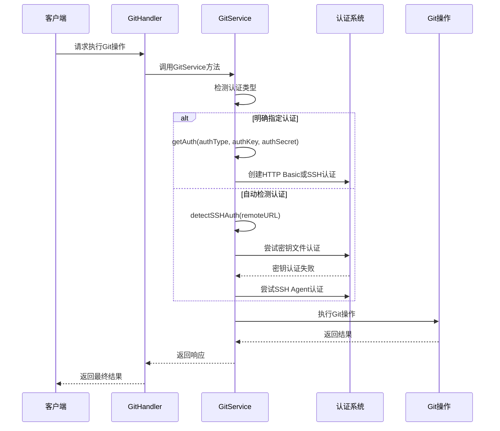
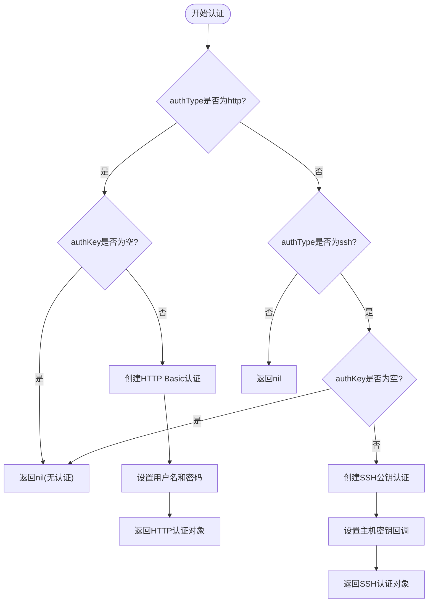
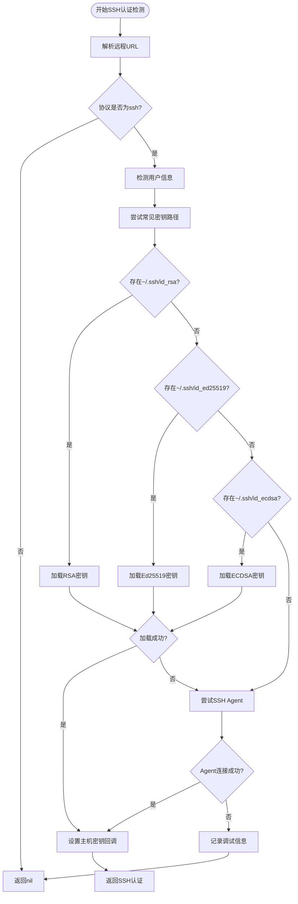
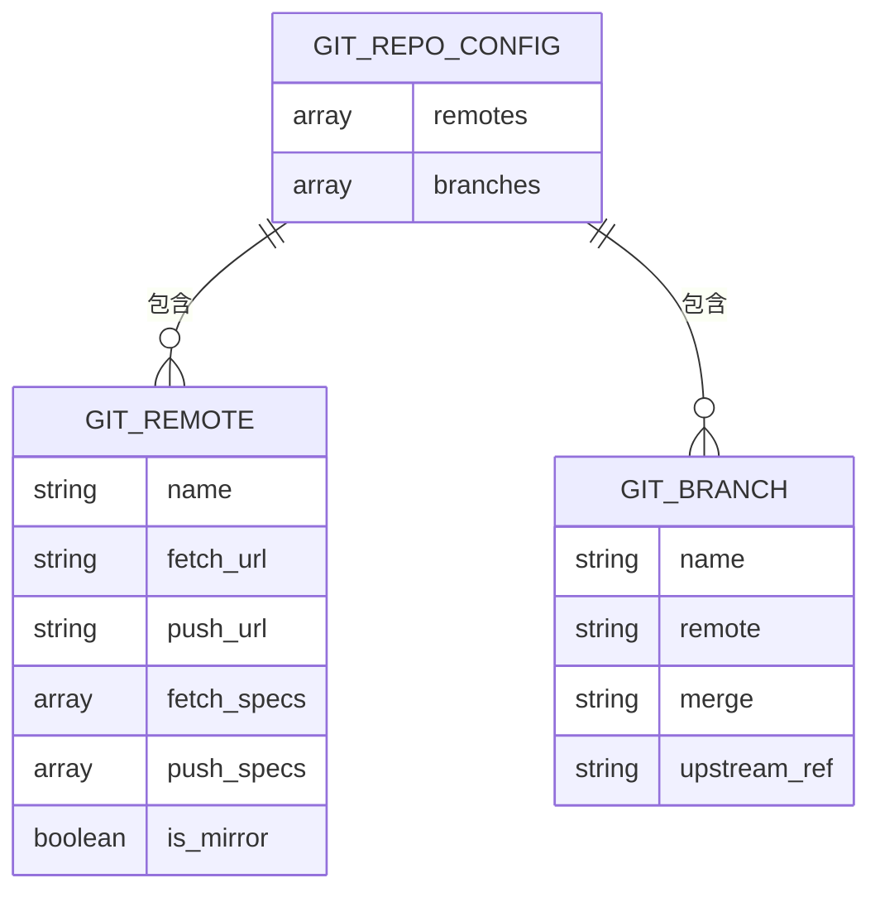
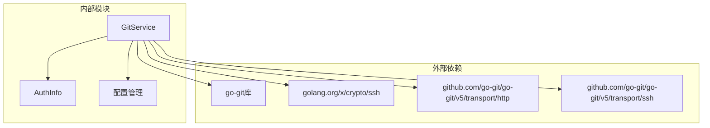

# Git认证机制

<cite>
**本文档引用的文件**
- [git_service.go](file://biz/service/git/git_service.go)
- [common.go](file://biz/model/domain/common.go)
- [git.go](file://biz/model/domain/git.go)
- [config.go](file://pkg/configs/config.go)
- [config.yaml](file://conf/config.yaml)
- [git_handler.go](file://biz/rpc_handler/git_handler.go)
</cite>

## 目录
1. [简介](#简介)
2. [项目结构](#项目结构)
3. [核心组件](#核心组件)
4. [架构概览](#架构概览)
5. [详细组件分析](#详细组件分析)
6. [依赖关系分析](#依赖关系分析)
7. [性能考虑](#性能考虑)
8. [故障排除指南](#故障排除指南)
9. [结论](#结论)

## 简介

本文件详细阐述了Git服务中的认证机制实现，重点分析GitService中HTTP基本认证和SSH密钥认证的处理逻辑。文档涵盖了以下关键内容：
- getAuth方法如何根据authType参数选择不同的认证方式
- HTTP认证的用户名密码处理流程
- SSH认证的密钥文件加载和SSH Agent支持机制
- detectSSHAuth方法的自动认证检测机制
- 认证失败的错误处理策略
- 调试模式下的详细日志输出
- 具体的配置示例和最佳实践建议

## 项目结构

Git认证机制主要分布在以下模块中：



**图表来源**
- [git_service.go](file://biz/service/git/git_service.go#L1-L80)
- [common.go](file://biz/model/domain/common.go#L1-L8)
- [config.go](file://pkg/configs/config.go#L1-L43)

**章节来源**
- [git_service.go](file://biz/service/git/git_service.go#L1-L80)
- [common.go](file://biz/model/domain/common.go#L1-L8)
- [config.go](file://pkg/configs/config.go#L1-L43)

## 核心组件

### GitService认证核心类图



**图表来源**
- [git_service.go](file://biz/service/git/git_service.go#L27-L80)
- [common.go](file://biz/model/domain/common.go#L3-L7)
- [git.go](file://biz/model/domain/git.go#L5-L24)

**章节来源**
- [git_service.go](file://biz/service/git/git_service.go#L27-L80)
- [common.go](file://biz/model/domain/common.go#L3-L7)
- [git.go](file://biz/model/domain/git.go#L5-L24)

## 架构概览

Git认证机制采用分层架构设计，实现了灵活的认证策略选择：



**图表来源**
- [git_service.go](file://biz/service/git/git_service.go#L50-L127)
- [git_handler.go](file://biz/rpc_handler/git_handler.go#L79-L110)

## 详细组件分析

### HTTP基本认证实现

HTTP基本认证通过getAuth方法实现，支持用户名密码认证：



**图表来源**
- [git_service.go](file://biz/service/git/git_service.go#L50-L65)

HTTP认证的关键特性：
- **用户名密码处理**：当authType为"http"且authKey非空时，创建HTTP.BasicAuth实例
- **安全考虑**：使用InsecureIgnoreHostKey()忽略主机密钥验证，便于开发环境使用
- **参数要求**：需要提供用户名(authKey)和密码(authSecret)

**章节来源**
- [git_service.go](file://biz/service/git/git_service.go#L50-L65)

### SSH密钥认证实现

SSH密钥认证通过detectSSHAuth方法实现，具有完整的自动检测机制：



**图表来源**
- [git_service.go](file://biz/service/git/git_service.go#L67-L127)

SSH认证的自动检测流程：
1. **URL协议检测**：验证URL是否为SSH协议
2. **用户信息提取**：从URL中提取SSH用户信息
3. **密钥文件优先**：按顺序尝试常见密钥路径
4. **SSH Agent回退**：无法加载本地密钥时尝试SSH Agent
5. **主机密钥处理**：统一设置InsecureIgnoreHostKey()回调

**章节来源**
- [git_service.go](file://biz/service/git/git_service.go#L67-L127)

### 认证信息数据模型

认证信息通过AuthInfo结构体进行标准化表示：

| 字段名 | 类型 | 描述 | 示例值 |
|--------|------|------|--------|
| type | string | 认证类型 | "ssh" 或 "http" |
| key | string | SSH密钥路径或用户名 | "/home/user/.ssh/id_rsa" 或 "git" |
| secret | string | 密钥口令或密码 | "password123" |

**章节来源**
- [common.go](file://biz/model/domain/common.go#L3-L7)

### Git仓库配置模型

仓库配置用于存储Git仓库的远程仓库和分支信息：



**图表来源**
- [git.go](file://biz/model/domain/git.go#L5-L24)

**章节来源**
- [git.go](file://biz/model/domain/git.go#L5-L24)

## 依赖关系分析

Git认证机制的依赖关系如下：



**图表来源**
- [git_service.go](file://biz/service/git/git_service.go#L3-L25)

**章节来源**
- [git_service.go](file://biz/service/git/git_service.go#L3-L25)

## 性能考虑

### 认证缓存策略

当前实现未实现认证缓存，每次Git操作都会重新进行认证检测。建议在高并发场景下考虑：
- 缓存有效的SSH Agent会话
- 实现认证凭据的短期缓存
- 避免重复的文件系统检查

### 资源优化

- **文件系统访问**：密钥文件检查可能成为性能瓶颈，建议限制检查范围
- **网络延迟**：SSH Agent通信可能影响整体性能
- **内存使用**：认证对象的生命周期管理

## 故障排除指南

### 常见认证问题及解决方案

#### SSH密钥认证失败

**问题症状**：
- 认证失败但无明确错误信息
- 日志显示"No SSH auth found"

**排查步骤**：
1. 检查SSH密钥文件权限
2. 验证SSH Agent是否运行
3. 确认远程URL格式正确

**解决方案**：
```bash
# 检查SSH密钥权限
chmod 600 ~/.ssh/id_rsa
chmod 644 ~/.ssh/id_rsa.pub

# 启动SSH Agent
eval $(ssh-agent)
ssh-add ~/.ssh/id_rsa
```

#### HTTP认证失败

**问题症状**：
- 401 Unauthorized错误
- 认证凭据无效

**排查步骤**：
1. 验证用户名密码正确性
2. 检查远程服务器的认证配置
3. 确认网络连接正常

#### 主机密钥验证问题

**问题症状**：
- Host key verification failed
- 连接被拒绝

**解决方案**：
```go
// 在生产环境中，建议使用安全的主机密钥验证
publicKeys.HostKeyCallback = ssh.FixedHostKeyCallback(hostKey)
```

### 调试模式配置

启用调试模式以获取详细的认证日志：

**配置文件示例**：
```yaml
# conf/config.yaml
debug_mode: true
```

**代码中的调试输出**：
- `[DEBUG] detectSSHAuth for url (user: git)`
- `[DEBUG] Using SSH Key: /path/to/key`
- `[DEBUG] Using SSH Agent Auth`
- `[DEBUG] No SSH auth found`

**章节来源**
- [git_service.go](file://biz/service/git/git_service.go#L35-L38)
- [git_service.go](file://biz/service/git/git_service.go#L84-L86)
- [git_service.go](file://biz/service/git/git_service.go#L103-L105)
- [git_service.go](file://biz/service/git/git_service.go#L117-L119)
- [git_service.go](file://biz/service/git/git_service.go#L123-L125)

### 最佳实践建议

#### 安全配置建议

1. **生产环境安全**：
   ```go
   // 使用安全的主机密钥验证
   publicKeys.HostKeyCallback = ssh.FixedHostKeyCallback(expectedHostKey)
   ```

2. **密钥管理**：
   - 使用SSH Agent管理密钥
   - 定期轮换认证凭据
   - 限制密钥文件权限

3. **网络配置**：
   - 使用SSH密钥而非密码认证
   - 配置防火墙规则
   - 启用SSH密钥交换加密

#### 性能优化建议

1. **连接池管理**：
   - 复用GitRepository实例
   - 实现认证凭据缓存
   - 异步处理认证请求

2. **资源监控**：
   - 监控SSH Agent连接状态
   - 跟踪认证失败率
   - 分析认证响应时间

## 结论

Git认证机制提供了灵活而强大的认证支持，通过分层架构实现了HTTP基本认证和SSH密钥认证的无缝切换。核心特点包括：

1. **多认证方式支持**：同时支持HTTP基本认证和SSH密钥认证
2. **智能认证检测**：自动检测SSH协议并尝试多种认证方式
3. **灵活的配置管理**：通过AuthInfo结构体标准化认证信息
4. **完善的错误处理**：提供详细的调试信息和错误反馈

在实际部署中，建议根据具体需求调整认证策略，特别是在生产环境中应加强安全配置，避免使用不安全的主机密钥验证方式。通过合理的配置和监控，可以确保Git认证机制的稳定性和安全性。