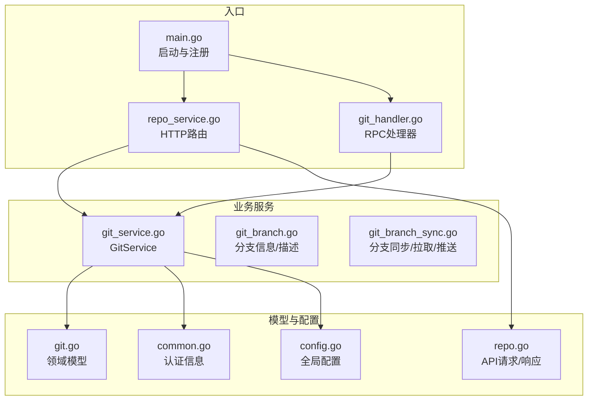
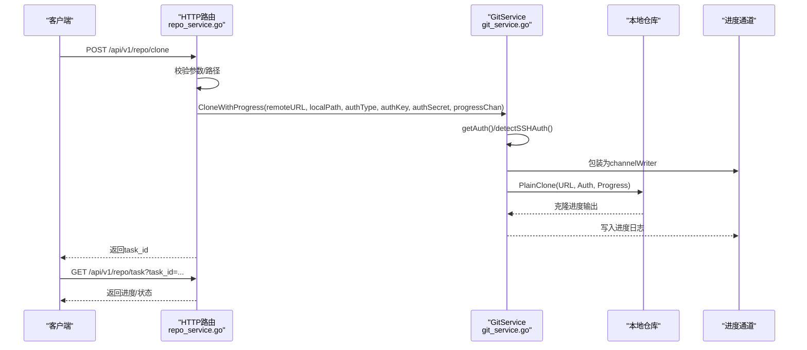
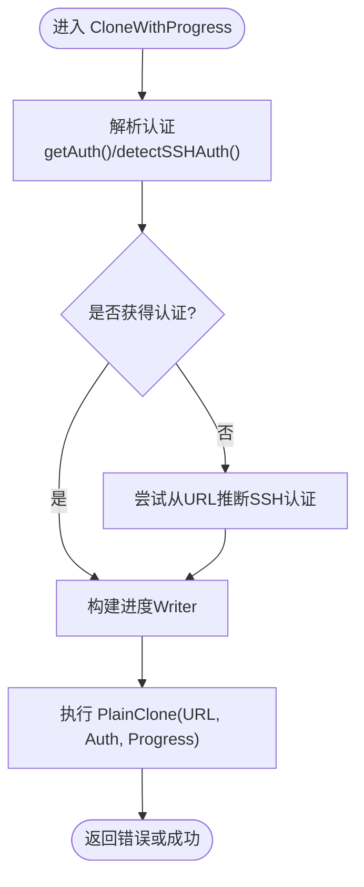
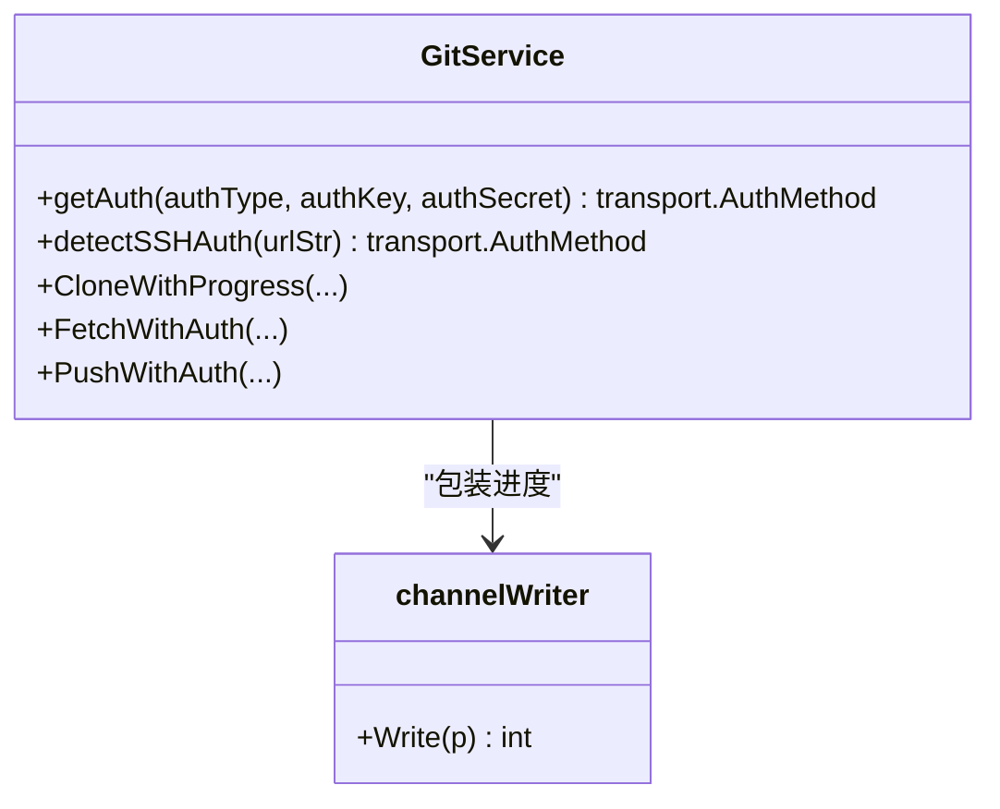
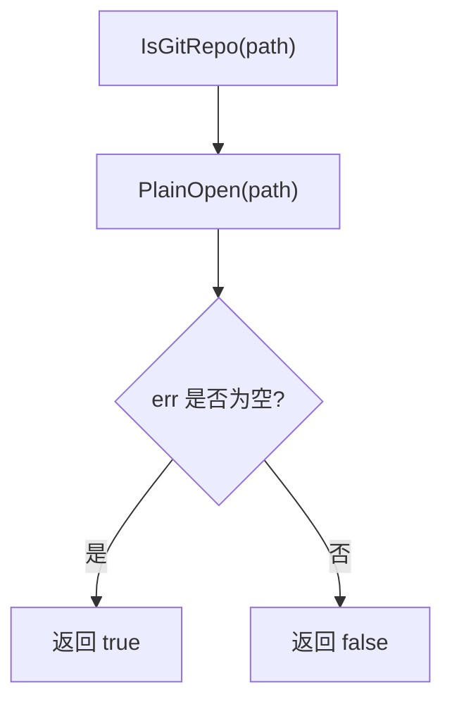
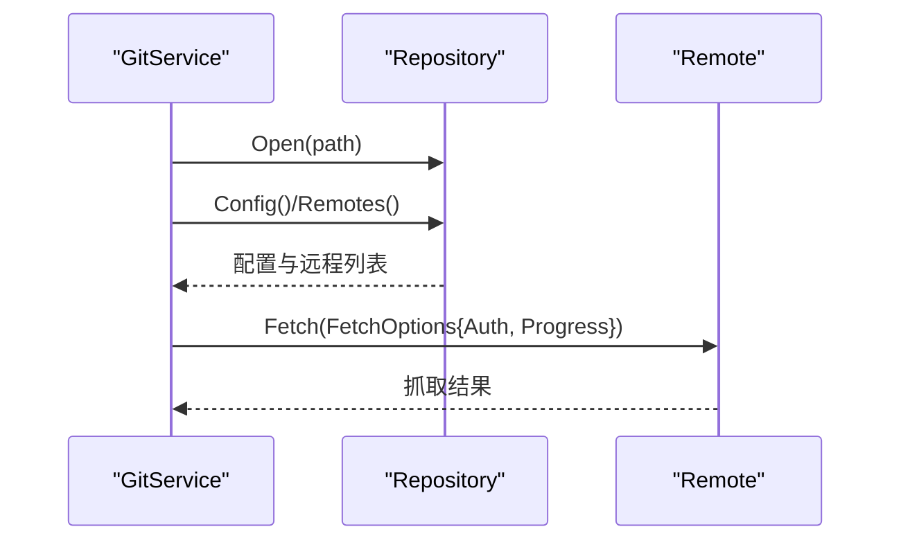
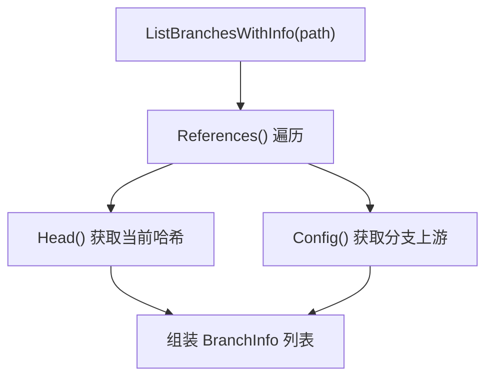
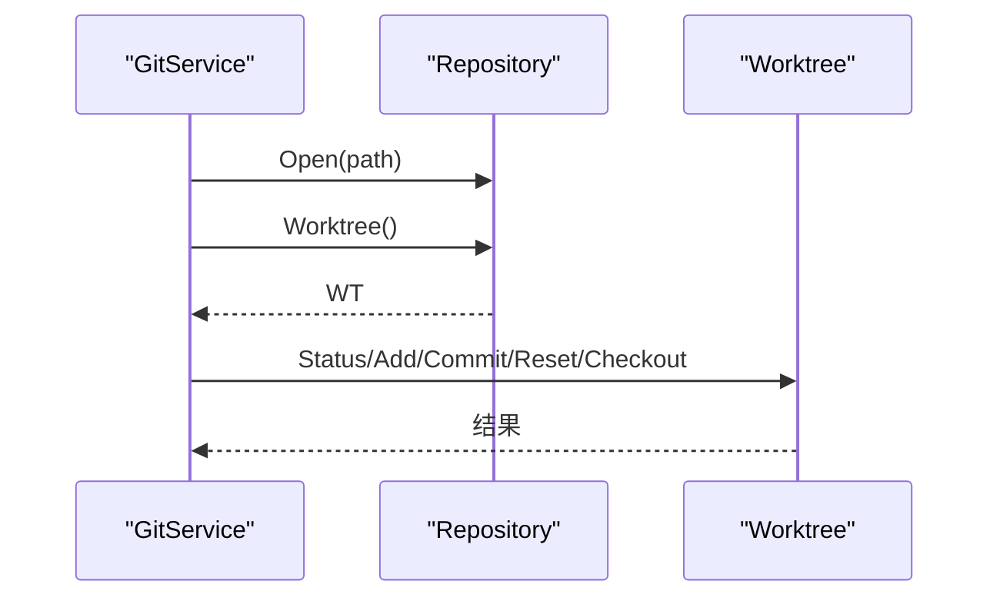
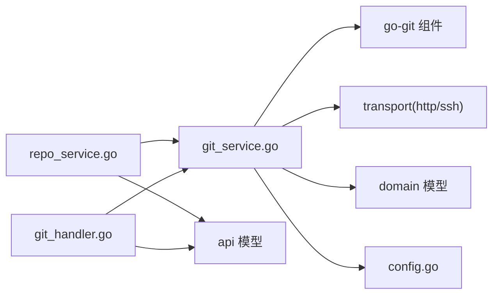

# 仓库操作

<cite>
**本文引用的文件**
- [main.go](file://main.go)
- [git_service.go](file://biz/service/git/git_service.go)
- [git_branch.go](file://biz/service/git/git_branch.go)
- [git_branch_sync.go](file://biz/service/git/git_branch_sync.go)
- [repo_service.go](file://biz/handler/repo/repo_service.go)
- [git_handler.go](file://biz/rpc_handler/git_handler.go)
- [git.go](file://biz/model/domain/git.go)
- [common.go](file://biz/model/domain/common.go)
- [repo.go](file://biz/model/api/repo.go)
- [config.go](file://pkg/configs/config.go)
</cite>

## 目录
1. [引言](#引言)
2. [项目结构](#项目结构)
3. [核心组件](#核心组件)
4. [架构总览](#架构总览)
5. [详细组件分析](#详细组件分析)
6. [依赖关系分析](#依赖关系分析)
7. [性能考量](#性能考量)
8. [故障排查指南](#故障排查指南)
9. [结论](#结论)
10. [附录：使用示例与最佳实践](#附录使用示例与最佳实践)

## 引言
本文件面向需要在系统中进行 Git 仓库管理与操作的工程师与运维人员，系统性梳理仓库的克隆、打开、检测、配置读取、远程管理、分支查询、状态检查、工作区操作与文件变更检测等能力。重点覆盖以下方法的实现原理与使用要点：
- 克隆与进度回调：Clone、CloneWithProgress
- 远程认证与进度：getAuth、detectSSHAuth、channelWriter
- 仓库检测：openRepo、IsGitRepo
- 远程与配置：GetRepoConfig、AddRemote、RemoveRemote、SetRemotePushURL、GetRemotes、GetRemoteURL
- 分支信息与上游统计：ListBranchesWithInfo、GetBranches、GetBranchSyncStatus
- 工作区与状态：GetStatus、AddAll、Commit、Reset、CheckoutBranch
- 文件与日志：GetRepoFiles、BlameFile、GetLogStats、GetLogStatsStream
- 连接测试：TestRemoteConnection

## 项目结构
后端采用多模块分层设计，核心围绕 GitService 提供统一的仓库操作能力，HTTP 与 RPC 双向入口分别通过路由与 Kitex 服务暴露接口。

**图表来源**
- [main.go](file://main.go#L52-L176)
- [repo_service.go](file://biz/handler/repo/repo_service.go#L263-L371)
- [git_handler.go](file://biz/rpc_handler/git_handler.go#L1-L131)
- [git_service.go](file://biz/service/git/git_service.go#L1-L1204)
- [git.go](file://biz/model/domain/git.go#L1-L40)
- [common.go](file://biz/model/domain/common.go#L1-L8)
- [repo.go](file://biz/model/api/repo.go#L1-L77)
- [config.go](file://pkg/configs/config.go#L1-L43)

**章节来源**
- [main.go](file://main.go#L52-L176)
- [repo_service.go](file://biz/handler/repo/repo_service.go#L263-L371)
- [git_handler.go](file://biz/rpc_handler/git_handler.go#L1-L131)

## 核心组件
- GitService：封装所有 Git 操作，基于 go-git 实现，提供克隆、抓取、推送、分支、标签、工作区、状态、远程管理、连接测试等能力。
- TaskManager：用于异步克隆任务的状态与进度记录，支持前端轮询查看。
- 领域模型：GitRepoConfig、GitRemote、GitBranch、BranchInfo、AuthInfo 等，用于对外暴露仓库配置与分支信息。
- HTTP/RPC 接口：通过路由与 Kitex 服务调用 GitService，完成仓库扫描、克隆、分支列表等操作。

**章节来源**
- [git_service.go](file://biz/service/git/git_service.go#L27-L1204)
- [git.go](file://biz/model/domain/git.go#L1-L40)
- [common.go](file://biz/model/domain/common.go#L1-L8)
- [repo_service.go](file://biz/handler/repo/repo_service.go#L263-L371)
- [git_handler.go](file://biz/rpc_handler/git_handler.go#L1-L131)

## 架构总览
下图展示从 HTTP 请求到 GitService 的调用链路，以及克隆流程中的进度回调机制。

**图表来源**
- [repo_service.go](file://biz/handler/repo/repo_service.go#L263-L327)
- [git_service.go](file://biz/service/git/git_service.go#L197-L229)

**章节来源**
- [repo_service.go](file://biz/handler/repo/repo_service.go#L263-L327)
- [git_service.go](file://biz/service/git/git_service.go#L197-L229)

## 详细组件分析

### 1) 仓库克隆与进度回调（Clone/CloneWithProgress）
- Clone：直接调用 CloneWithProgress，不传入进度通道。
- CloneWithProgress：
  - 认证优先：getAuth(authType, authKey, authSecret) 解析 HTTP Basic 或 SSH 公钥。
  - 若未显式提供认证，则通过 detectSSHAuth(remoteURL) 尝试从 URL 协议或 SSH 端点推断 SSH 认证；若仍无认证，尝试用户主目录常见密钥与 SSH Agent。
  - 进度回调：当 progressChan 非空时，使用 channelWriter 将 go-git 输出写入通道，HTTP 层可轮询收集。
  - 执行克隆：PlainClone，设置 URL、Auth、Progress。

**图表来源**
- [git_service.go](file://biz/service/git/git_service.go#L197-L229)
- [git_service.go](file://biz/service/git/git_service.go#L50-L127)

**章节来源**
- [git_service.go](file://biz/service/git/git_service.go#L193-L229)
- [git_service.go](file://biz/service/git/git_service.go#L50-L127)

### 2) 远程URL解析、认证处理与进度回调
- getAuth：根据 authType 选择 HTTP Basic 或 SSH 公钥认证；SSH 使用 InsecureIgnoreHostKey 回调以兼容非交互环境。
- detectSSHAuth：从 URL 判断协议，尝试用户主目录常见密钥与 SSH Agent；若失败则返回空。
- channelWriter：将 go-git 的进度输出写入给定通道，供 HTTP 层消费。

**图表来源**
- [git_service.go](file://biz/service/git/git_service.go#L50-L127)
- [git_service.go](file://biz/service/git/git_service.go#L220-L229)

**章节来源**
- [git_service.go](file://biz/service/git/git_service.go#L50-L127)
- [git_service.go](file://biz/service/git/git_service.go#L220-L229)

### 3) 仓库检测（openRepo/IsGitRepo）
- openRepo：调用 PlainOpen 打开仓库，失败即非 Git 仓库。
- IsGitRepo：仅判断能否打开，用于前端/路由层快速校验路径是否为 Git 仓库。

**图表来源**
- [git_service.go](file://biz/service/git/git_service.go#L129-L136)

**章节来源**
- [git_service.go](file://biz/service/git/git_service.go#L129-L136)

### 4) 仓库配置获取与远程管理
- GetRepoConfig：读取仓库配置，映射为 GitRepoConfig，包含 remotes 与 branches。
- GetRemotes/GetRemoteURL：列出远程名称与默认 URL。
- AddRemote/RemoveRemote/SetRemotePushURL：增删改远程；注意 go-git 对 Push URL 的表达方式与实现细节。
- Fetch/FetchWithAuth/FetchAll：抓取指定远程或全部远程，自动检测 SSH 认证。

**图表来源**
- [git_service.go](file://biz/service/git/git_service.go#L357-L451)
- [git_service.go](file://biz/service/git/git_service.go#L138-L191)
- [git_service.go](file://biz/service/git/git_service.go#L187-L213)

**章节来源**
- [git_service.go](file://biz/service/git/git_service.go#L357-L451)
- [git_service.go](file://biz/service/git/git_service.go#L138-L191)
- [git_service.go](file://biz/service/git/git_service.go#L187-L213)

### 5) 分支信息查询与上游同步状态
- ListBranchesWithInfo：遍历引用，提取本地/远程分支、当前分支、提交作者与消息、上游信息。
- GetBranches：返回所有分支短名。
- GetBranchSyncStatus：计算 ahead/behind，基于合并基点逐提交计数。
- PullBranch/PushBranch/UpdateBranchFastForward：基于 Worktree 或 PushOptions 完成拉取/推送/更新。

**图表来源**
- [git_branch.go](file://biz/service/git/git_branch.go#L14-L79)
- [git_branch_sync.go](file://biz/service/git/git_branch_sync.go#L14-L85)

**章节来源**
- [git_branch.go](file://biz/service/git/git_branch.go#L14-L79)
- [git_branch_sync.go](file://biz/service/git/git_branch_sync.go#L14-L85)

### 6) 工作区操作与文件变更检测
- GetStatus：获取工作区状态字符串，便于前端展示。
- AddAll：添加所有变更。
- Commit：提交，支持自定义作者信息。
- Reset：混合重置。
- CheckoutBranch：切换到指定分支（强制）。
- GetRepoFiles：列出指定分支树下的文件名。
- BlameFile：对文件进行逐行归因。

**图表来源**
- [git_service.go](file://biz/service/git/git_service.go#L609-L665)
- [git_service.go](file://biz/service/git/git_service.go#L540-L576)

**章节来源**
- [git_service.go](file://biz/service/git/git_service.go#L609-L665)
- [git_service.go](file://biz/service/git/git_service.go#L540-L576)

### 7) 日志与统计
- GetLogStats：通过命令行输出格式化日志统计。
- GetLogStatsStream：以流式方式输出日志统计，适合大仓库或长时间运行场景。
- GetHeadBranch：获取当前分支或分离 HEAD 的哈希。

**章节来源**
- [git_service.go](file://biz/service/git/git_service.go#L781-L806)
- [git_service.go](file://biz/service/git/git_service.go#L893-L908)

### 8) 连接测试与全局配置
- TestRemoteConnection：对远程 URL 发起 List 请求，验证可访问性与认证。
- 全局配置：Init 加载配置并注入全局变量，影响调试模式等行为。

**章节来源**
- [git_service.go](file://biz/service/git/git_service.go#L578-L592)
- [config.go](file://pkg/configs/config.go#L18-L42)

## 依赖关系分析
- HTTP 层（repo_service.go）依赖 GitService 完成仓库扫描、克隆、任务状态查询等。
- RPC 层（git_handler.go）依赖 GitService 提供分支列表、创建/删除分支等能力。
- GitService 依赖 go-git 与 go-git/transport 组件，结合 SSH Agent 与常见密钥路径实现认证。
- 领域模型（domain）用于对外暴露仓库配置与分支信息，API 层（model/api）定义请求/响应结构。

**图表来源**
- [repo_service.go](file://biz/handler/repo/repo_service.go#L263-L371)
- [git_handler.go](file://biz/rpc_handler/git_handler.go#L1-L131)
- [git_service.go](file://biz/service/git/git_service.go#L1-L1204)
- [git.go](file://biz/model/domain/git.go#L1-L40)
- [repo.go](file://biz/model/api/repo.go#L1-L77)
- [config.go](file://pkg/configs/config.go#L1-L43)

**章节来源**
- [repo_service.go](file://biz/handler/repo/repo_service.go#L263-L371)
- [git_handler.go](file://biz/rpc_handler/git_handler.go#L1-L131)
- [git_service.go](file://biz/service/git/git_service.go#L1-L1204)

## 性能考量
- 大仓库克隆建议使用进度通道与异步任务，避免阻塞请求线程。
- 分支/标签/日志统计为 O(n) 操作，应限制范围或使用流式输出。
- FetchAll 对每个远程依次抓取，网络抖动时建议捕获并记录错误但不中断整体流程。
- SSH 认证优先尝试无密码密钥与 SSH Agent，减少交互与等待时间。

[本节为通用指导，无需“章节来源”]

## 故障排查指南
- 认证失败
  - 检查 authType 与 authKey/Secret 是否匹配；HTTP 使用用户名/密码，SSH 使用私钥路径。
  - 若未显式提供认证，确认 detectSSHAuth 能从 URL 推断协议或可用密钥。
- 进度不显示
  - 确认 CloneWithProgress 的 progressChan 已传递且 HTTP 轮询 /api/v1/repo/task 正常。
- 无法打开仓库
  - 使用 IsGitRepo 快速判断路径是否为 Git 仓库；确认路径存在且权限正确。
- 远程推送/抓取失败
  - 检查远程 URL 与认证；必要时使用 TestRemoteConnection 验证连通性。
- 工作区状态异常
  - 使用 GetStatus 获取详细状态字符串；必要时 Reset 或 AddAll 后重新提交。

**章节来源**
- [git_service.go](file://biz/service/git/git_service.go#L50-L127)
- [git_service.go](file://biz/service/git/git_service.go#L197-L229)
- [git_service.go](file://biz/service/git/git_service.go#L578-L592)
- [repo_service.go](file://biz/handler/repo/repo_service.go#L263-L327)

## 结论
该系统以 GitService 为核心，提供了从仓库克隆、远程管理、分支与标签、工作区操作到日志统计的完整能力集。通过 HTTP 与 RPC 双入口，满足不同场景下的集成需求；借助 TaskManager 与进度通道，实现了异步任务的可观测性。建议在生产环境中结合全局配置与严格的认证策略，确保安全与稳定性。

[本节为总结，无需“章节来源”]

## 附录：使用示例与最佳实践

- 克隆仓库（带进度）
  - HTTP：POST /api/v1/repo/clone，携带 remote_url、local_path、auth_type、auth_key、auth_secret。
  - 轮询：GET /api/v1/repo/task?task_id=... 获取进度与状态。
  - 成功后可调用 /api/v1/repo/scan 获取仓库配置并入库。
- 仓库扫描
  - POST /api/v1/repo/scan，传入 path，返回 GitRepoConfig。
- 远程管理
  - 通过 GetRepoConfig 获取现有远程；使用 AddRemote/RemoveRemote/SetRemotePushURL 同步远端配置。
- 分支与同步
  - ListBranchesWithInfo 获取分支详情；GetBranchSyncStatus 计算 ahead/behind；PullBranch/PushBranch 更新本地/远程分支。
- 工作区与文件
  - GetStatus 查看变更；AddAll/Commit 提交；GetRepoFiles 列出文件；BlameFile 追溯行级作者。
- 最佳实践
  - 显式提供认证参数，避免交互式输入。
  - 对大仓库使用流式日志与进度通道，避免阻塞。
  - 在推送前先 Pull 或 Fast-Forward 更新，降低冲突概率。

**章节来源**
- [repo_service.go](file://biz/handler/repo/repo_service.go#L263-L371)
- [git_branch.go](file://biz/service/git/git_branch.go#L14-L79)
- [git_branch_sync.go](file://biz/service/git/git_branch_sync.go#L87-L150)
- [git_service.go](file://biz/service/git/git_service.go#L609-L665)
- [git_service.go](file://biz/service/git/git_service.go#L540-L576)
- [git_service.go](file://biz/service/git/git_service.go#L781-L806)