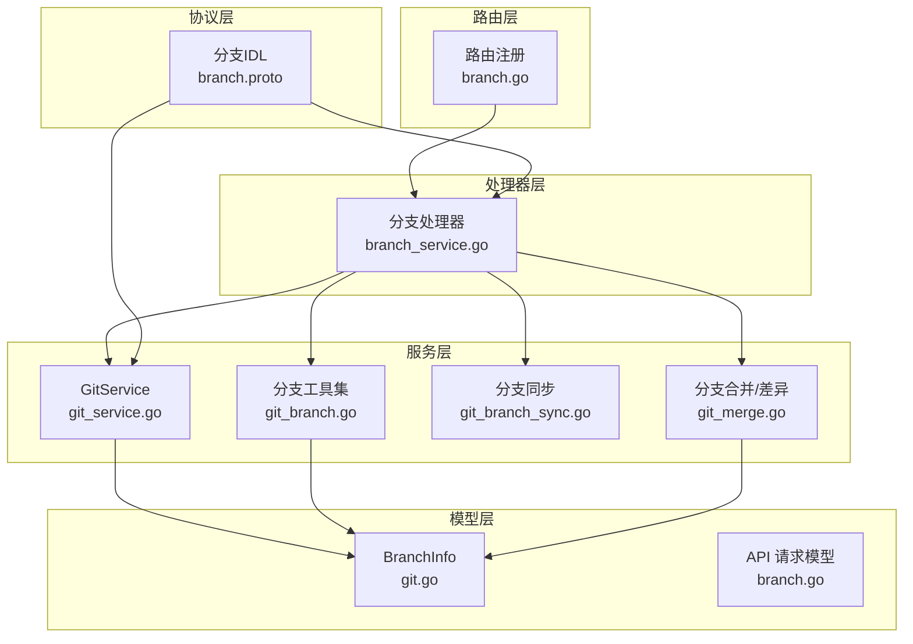
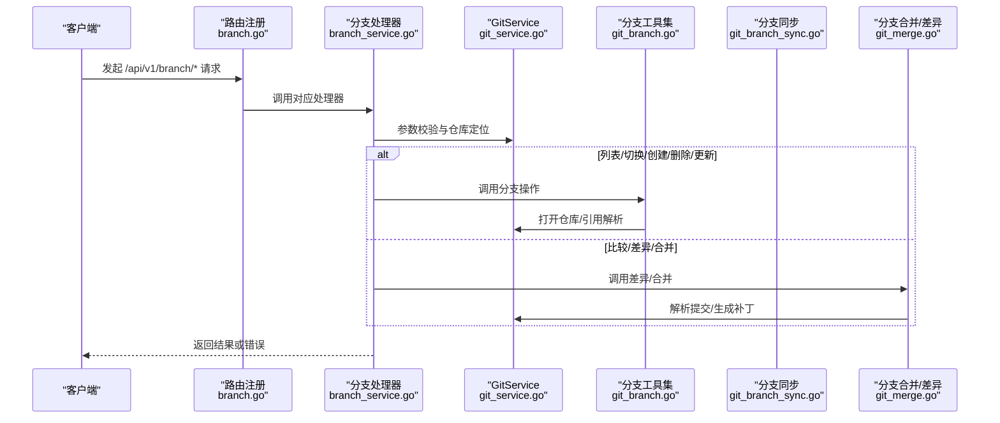
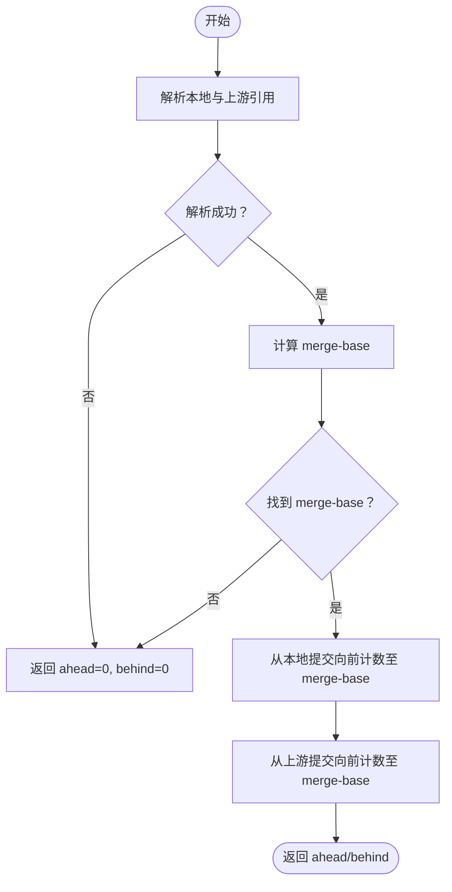
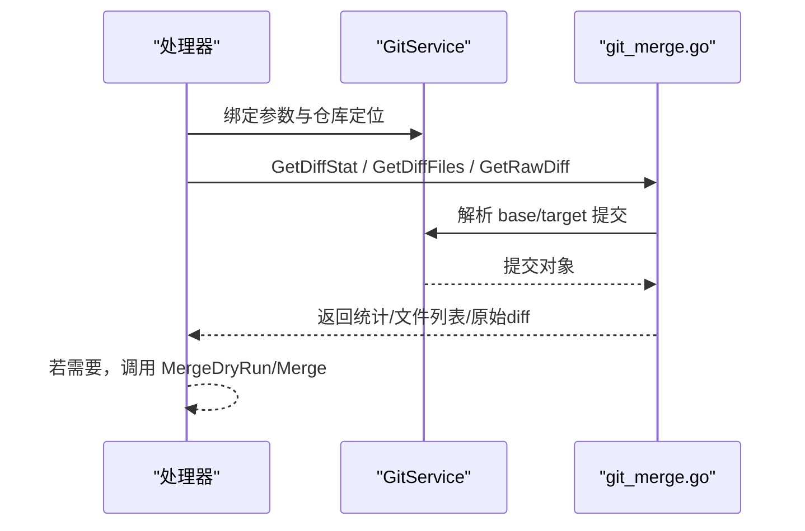
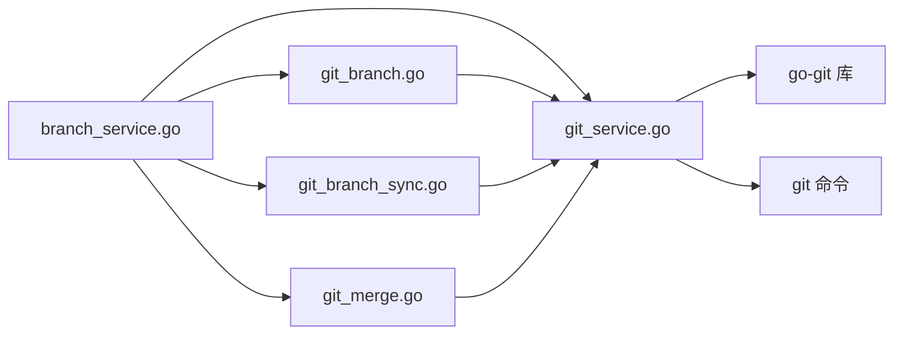

# 分支管理

<cite>
**本文引用的文件**
- [git_branch.go](file://biz/service/git/git_branch.go)
- [git_service.go](file://biz/service/git/git_service.go)
- [git_branch_sync.go](file://biz/service/git/git_branch_sync.go)
- [git_merge.go](file://biz/service/git/git_merge.go)
- [branch_service.go](file://biz/handler/branch/branch_service.go)
- [branch.go](file://biz/router/branch/branch.go)
- [branch.go](file://biz/model/api/branch.go)
- [branch.proto](file://idl/biz/branch.proto)
- [git.go](file://biz/model/domain/git.go)
</cite>

## 目录
1. [简介](#简介)
2. [项目结构](#项目结构)
3. [核心组件](#核心组件)
4. [架构总览](#架构总览)
5. [详细组件分析](#详细组件分析)
6. [依赖关系分析](#依赖关系分析)
7. [性能考量](#性能考量)
8. [故障排查指南](#故障排查指南)
9. [结论](#结论)
10. [附录：使用示例与注意事项](#附录使用示例与注意事项)

## 简介
本文件系统化梳理了 Git 分支管理功能的技术实现，覆盖分支枚举、分支切换、分支创建/删除/重命名、分支描述配置、分支同步状态计算、分支比较与差异分析、分支历史统计、以及分支合并检查与执行等能力。重点解析以下关键点：
- GetBranches 方法的分支枚举逻辑（本地与远程分支识别）
- CheckoutBranch 方法的分支切换实现（强制切换与工作区状态处理）
- 分支比较、分支历史查询与分支状态检查的实现机制
- 分支配置管理、上游分支设置与分支跟踪信息处理
- 完整的 API 路由与处理器映射，便于集成与扩展

## 项目结构
分支管理相关代码主要分布在如下层次：
- 服务层：业务逻辑封装在 GitService 中，提供分支、同步、合并、差异等操作
- 处理器层：HTTP 路由绑定到具体业务方法，负责参数校验、分页过滤、审计日志
- 模型层：领域模型定义分支信息、远程与分支配置
- 协议层：IDL 描述分支管理 RPC 接口与数据结构
- 路由层：注册分支相关路由

图表来源
- [branch.go](file://biz/router/branch/branch.go#L17-L42)
- [branch_service.go](file://biz/handler/branch/branch_service.go#L22-L92)
- [git_service.go](file://biz/service/git/git_service.go#L27-L48)
- [git_branch.go](file://biz/service/git/git_branch.go#L13-L79)
- [git_branch_sync.go](file://biz/service/git/git_branch_sync.go#L13-L85)
- [git_merge.go](file://biz/service/git/git_merge.go#L21-L94)
- [git.go](file://biz/model/domain/git.go#L26-L39)
- [branch.proto](file://idl/biz/branch.proto#L11-L72)

章节来源
- [branch.go](file://biz/router/branch/branch.go#L17-L42)
- [branch_service.go](file://biz/handler/branch/branch_service.go#L22-L92)
- [git_service.go](file://biz/service/git/git_service.go#L27-L48)

## 核心组件
- GitService：统一的 Git 操作入口，封装底层 go-git 与 shell 命令调用，提供分支、同步、合并、差异、标签等能力
- 分支工具集（git_branch.go）：分支枚举、创建、删除、重命名、描述读写、简单指标统计
- 分支同步（git_branch_sync.go）：上游同步状态计算、推送、拉取、快进更新
- 分支合并/差异（git_merge.go）：差异统计、文件变更列表、原始 diff、合并预检与执行
- 处理器（branch_service.go）：HTTP 层绑定，参数校验、分页过滤、审计日志、调用 GitService
- 模型（git.go、branch.go）：BranchInfo、GitBranch、GitRemote 等领域模型
- 协议（branch.proto）：分支管理 RPC 接口与数据结构定义

章节来源
- [git_service.go](file://biz/service/git/git_service.go#L27-L48)
- [git_branch.go](file://biz/service/git/git_branch.go#L13-L79)
- [git_branch_sync.go](file://biz/service/git/git_branch_sync.go#L13-L85)
- [git_merge.go](file://biz/service/git/git_merge.go#L21-L94)
- [branch_service.go](file://biz/handler/branch/branch_service.go#L22-L92)
- [git.go](file://biz/model/domain/git.go#L26-L39)
- [branch.proto](file://idl/biz/branch.proto#L11-L72)

## 架构总览
下图展示从 HTTP 请求到 Git 操作的端到端流程，以及各模块间的依赖关系。

图表来源
- [branch.go](file://biz/router/branch/branch.go#L17-L42)
- [branch_service.go](file://biz/handler/branch/branch_service.go#L22-L92)
- [git_service.go](file://biz/service/git/git_service.go#L129-L131)
- [git_branch.go](file://biz/service/git/git_branch.go#L13-L79)
- [git_branch_sync.go](file://biz/service/git/git_branch_sync.go#L13-L85)
- [git_merge.go](file://biz/service/git/git_merge.go#L21-L94)

## 详细组件分析

### GetBranches 方法：分支枚举逻辑
- 功能概述
  - 枚举仓库中的引用，筛选出分支与远程引用，返回短名称列表
  - 支持本地分支与远程分支的识别
- 关键实现要点
  - 打开仓库后通过 References 迭代器遍历所有引用
  - 使用 IsBranch()/IsRemote() 判断类型，仅保留分支与远程引用
  - 将短名称加入结果数组
- 复杂度与性能
  - 时间复杂度 O(N)，N 为引用数量；空间复杂度 O(N)
  - 该方法不加载提交对象，仅遍历引用，性能开销较小

章节来源
- [git_service.go](file://biz/service/git/git_service.go#L453-L470)

### ListBranchesWithInfo：分支列表与详细信息
- 功能概述
  - 返回每个分支的名称、当前提交哈希、作者、日期、消息、是否当前分支、上游信息等
- 关键实现要点
  - 通过 References 遍历引用，区分本地与远程
  - 对当前 HEAD 设置 IsCurrent 标记
  - 通过 CommitObject 获取提交信息（作者、邮箱、时间、首行消息）
  - 读取仓库配置，提取本地分支的上游（remote/merge），拼接为 Upstream 字段
- 上游信息处理
  - 仅对本地分支读取配置项 branch.<name>.remote 与 branch.<name>.merge
  - 将 merge 的短引用名拼接为 remote/shortMerge 形式
- 复杂度与性能
  - 时间复杂度 O(N + C)，N 为引用数，C 为提交对象访问次数
  - 对于大型仓库，建议配合前端分页与关键词过滤

章节来源
- [git_branch.go](file://biz/service/git/git_branch.go#L13-L79)
- [git.go](file://biz/model/domain/git.go#L26-L39)

### CheckoutBranch：分支切换实现
- 功能概述
  - 强制切换到指定本地分支，覆盖工作区与暂存区
- 关键实现要点
  - 打开仓库并获取 Worktree
  - 使用 refs/heads/<branch> 作为目标引用
  - Force=true 实现强制切换，避免未提交更改导致失败
- 工作区状态处理
  - 强制切换会丢弃未提交的更改，需谨慎使用
  - 如需安全切换，可先执行状态检查与提交/暂存
- 错误处理
  - 打开仓库失败、获取 Worktree 失败、切换失败均向上抛错

章节来源
- [git_service.go](file://biz/service/git/git_service.go#L594-L607)

### 分支创建/删除/重命名
- 创建分支
  - 支持指定 base 引用，默认 HEAD
  - 通过 ResolveRevision 解析 base，不存在则报错
  - 在 refs/heads/<name> 写入新引用
- 删除分支
  - 移除 refs/heads/<name> 引用
- 重命名分支
  - 先创建新引用，再删除旧引用
  - 保持提交历史不变

章节来源
- [git_branch.go](file://biz/service/git/git_branch.go#L81-L140)

### 分支描述配置与上游设置
- 分支描述
  - 通过 RunCommand 调用 git config branch.<name>.description 读写
  - 读取不到时返回空字符串，不视为错误
- 上游分支设置
  - 通过仓库配置读取 branch.<name>.remote 与 branch.<name>.merge
  - 将 merge 短引用拼接为 remote/shortMerge 作为 Upstream
  - 该信息用于后续同步状态计算与拉取/推送

章节来源
- [git_branch.go](file://biz/service/git/git_branch.go#L142-L154)
- [git_branch.go](file://biz/service/git/git_branch.go#L64-L72)
- [git.go](file://biz/model/domain/git.go#L26-L39)

### 分支同步状态计算与更新
- 同步状态（ahead/behind）
  - 支持传入本地分支与上游引用（如 origin/main）
  - 解析 base、upstream 的提交哈希，计算 merge-base
  - 以 merge-base 为界，分别对本地与上游提交进行计数
- 快进更新
  - 非当前分支场景，支持 fetch 远程分支到本地分支（fast-forward）
- 拉取/推送
  - 拉取：Worktree.Pull，支持 rebase 语义
  - 推送：根据 RefSpec refs/heads/<branch>:refs/heads/<branch> 推送到远端

图表来源
- [git_branch_sync.go](file://biz/service/git/git_branch_sync.go#L13-L85)

章节来源
- [git_branch_sync.go](file://biz/service/git/git_branch_sync.go#L13-L85)
- [git_branch_sync.go](file://biz/service/git/git_branch_sync.go#L87-L150)
- [git_branch_sync.go](file://biz/service/git/git_branch_sync.go#L152-L184)

### 分支比较、差异与历史统计
- 差异统计（GetDiffStat）
  - 计算 base 与 target 的补丁，汇总文件变更数、插入/删除行数
- 变更文件列表（GetDiffFiles）
  - 解析补丁文件列表，标注新增/修改/删除/重命名
- 原始 diff（GetRawDiff）
  - 输出统一格式的 diff 文本，支持按文件过滤
- 历史统计（GetLogStats）
  - 通过 RunCommand 执行 git log --numstat 等命令，输出统计文本
- 合并预检（MergeDryRun）
  - 计算两个分支的 merge-base，并基于补丁文件集合判断是否存在冲突文件
- 合并执行（Merge）
  - 先切换到目标分支，再执行 git merge（必要时 --abort 回滚）

图表来源
- [branch_service.go](file://biz/handler/branch/branch_service.go#L352-L412)
- [git_merge.go](file://biz/service/git/git_merge.go#L21-L94)
- [git_merge.go](file://biz/service/git/git_merge.go#L157-L217)
- [git_merge.go](file://biz/service/git/git_merge.go#L219-L242)

章节来源
- [branch_service.go](file://biz/handler/branch/branch_service.go#L352-L412)
- [git_merge.go](file://biz/service/git/git_merge.go#L21-L94)
- [git_merge.go](file://biz/service/git/git_merge.go#L157-L217)
- [git_merge.go](file://biz/service/git/git_merge.go#L219-L242)

### HTTP 路由与处理器映射
- 路由注册
  - /api/v1/branch/list、/api/v1/branch/create、/api/v1/branch/delete、/api/v1/branch/update、/api/v1/branch/checkout、/api/v1/branch/push、/api/v1/branch/pull、/api/v1/branch/compare、/api/v1/branch/diff、/api/v1/branch/merge、/api/v1/branch/merge/check、/api/v1/branch/patch
- 处理器职责
  - 参数绑定与校验（repo_key、name、base_ref、desc、remotes 等）
  - 仓库查找与路径定位
  - 调用 GitService 执行具体操作
  - 审计日志记录
  - 分页与关键词过滤（列表接口）

章节来源
- [branch.go](file://biz/router/branch/branch.go#L17-L42)
- [branch_service.go](file://biz/handler/branch/branch_service.go#L22-L92)
- [branch_service.go](file://biz/handler/branch/branch_service.go#L94-L124)
- [branch_service.go](file://biz/handler/branch/branch_service.go#L126-L156)
- [branch_service.go](file://biz/handler/branch/branch_service.go#L158-L203)
- [branch_service.go](file://biz/handler/branch/branch_service.go#L205-L233)
- [branch_service.go](file://biz/handler/branch/branch_service.go#L235-L273)
- [branch_service.go](file://biz/handler/branch/branch_service.go#L275-L350)
- [branch_service.go](file://biz/handler/branch/branch_service.go#L352-L412)
- [branch_service.go](file://biz/handler/branch/branch_service.go#L414-L496)
- [branch_service.go](file://biz/handler/branch/branch_service.go#L498-L521)

## 依赖关系分析
- 模块耦合
  - 处理器层依赖服务层（GitService），服务层依赖 go-git 与 shell 命令
  - 分支工具集与同步/合并模块共享 GitService 的仓库打开与引用解析能力
- 外部依赖
  - go-git：引用迭代、提交对象、工作区、远程操作
  - git 命令：部分高级合并逻辑与 describe、log 等命令
- 循环依赖
  - 无循环依赖，模块边界清晰

图表来源
- [branch_service.go](file://biz/handler/branch/branch_service.go#L37-L38)
- [git_service.go](file://biz/service/git/git_service.go#L129-L131)
- [git_branch.go](file://biz/service/git/git_branch.go#L13-L79)
- [git_branch_sync.go](file://biz/service/git/git_branch_sync.go#L13-L85)
- [git_merge.go](file://biz/service/git/git_merge.go#L21-L94)

## 性能考量
- 分支枚举（GetBranches）
  - 仅遍历引用，O(N) 时间，适合频繁调用
- 列表详情（ListBranchesWithInfo）
  - 每个分支访问一次提交对象，O(N+C)，建议配合分页与关键词过滤
- 同步状态计算（ahead/behind）
  - 两次日志遍历，可能随提交量增长而变慢；建议缓存或限制范围
- 合并预检（MergeDryRun）
  - 基于补丁文件集合判断冲突，O(F)（F 为变更文件数），通常较快
- 差异与历史统计
  - 补丁生成与日志输出可能较重，建议在后台任务或流式输出中执行

## 故障排查指南
- 切换分支失败
  - 检查仓库路径是否正确、分支名是否存在
  - 强制切换会丢弃未提交更改，确认风险
- 同步状态为 0/0
  - 上游未配置或引用解析失败，检查 branch.<name>.remote 与 branch.<name>.merge
- 拉取/推送失败
  - 检查远程 URL 与认证方式（SSH/HTTP），必要时手动检测连接
- 合并冲突
  - 使用 MergeDryRun 预检，若存在冲突文件，先解决冲突再执行合并
- 权限问题
  - 确认 ~/.ssh 或凭据配置正确，或使用 HTTP Basic Auth

章节来源
- [git_service.go](file://biz/service/git/git_service.go#L594-L607)
- [git_branch_sync.go](file://biz/service/git/git_branch_sync.go#L13-L85)
- [git_merge.go](file://biz/service/git/git_merge.go#L157-L217)

## 结论
本分支管理模块以 GitService 为核心，结合 go-git 与 shell 命令，提供了从基础分支操作到高级合并与差异分析的完整能力。通过清晰的路由与处理器映射，实现了良好的可扩展性与可维护性。建议在生产环境中配合缓存、分页与权限控制，确保性能与安全性。

## 附录：使用示例与注意事项
- 使用示例（HTTP）
  - 列表：GET /api/v1/branch/list?repo_key=...&page=1&page_size=100&keyword=
  - 创建：POST /api/v1/branch/create（body: repo_key,name,base_ref）
  - 删除：POST /api/v1/branch/delete（body: repo_key,name,force）
  - 更新：POST /api/v1/branch/update（body: repo_key,name,new_name,desc）
  - 切换：POST /api/v1/branch/checkout（body: repo_key,name）
  - 比较：GET /api/v1/branch/compare?repo_key=...&base=...&target=...
  - 差异：GET /api/v1/branch/diff?repo_key=...&base=...&target=...&file=
  - 合并预检：GET /api/v1/branch/merge/check?repo_key=...&source=...&target=...
  - 合并：POST /api/v1/branch/merge（body: repo_key,source_branch,target_branch,message,...）
  - 拉取：POST /api/v1/branch/pull（body: repo_key,name）
  - 推送：POST /api/v1/branch/push（body: repo_key,name,remotes[]）
- 注意事项
  - 强制切换会丢弃未提交更改，请在安全场景使用
  - 上游分支信息来自本地配置，需确保已正确设置
  - 合并前建议先执行预检，避免冲突
  - 大型仓库的同步与差异分析建议采用流式或后台任务模式

章节来源
- [branch_service.go](file://biz/handler/branch/branch_service.go#L22-L92)
- [branch_service.go](file://biz/handler/branch/branch_service.go#L94-L124)
- [branch_service.go](file://biz/handler/branch/branch_service.go#L126-L156)
- [branch_service.go](file://biz/handler/branch/branch_service.go#L158-L203)
- [branch_service.go](file://biz/handler/branch/branch_service.go#L205-L233)
- [branch_service.go](file://biz/handler/branch/branch_service.go#L235-L273)
- [branch_service.go](file://biz/handler/branch/branch_service.go#L275-L350)
- [branch_service.go](file://biz/handler/branch/branch_service.go#L352-L412)
- [branch_service.go](file://biz/handler/branch/branch_service.go#L414-L496)
- [branch_service.go](file://biz/handler/branch/branch_service.go#L498-L521)