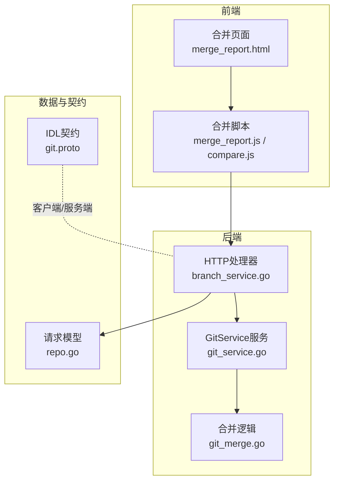
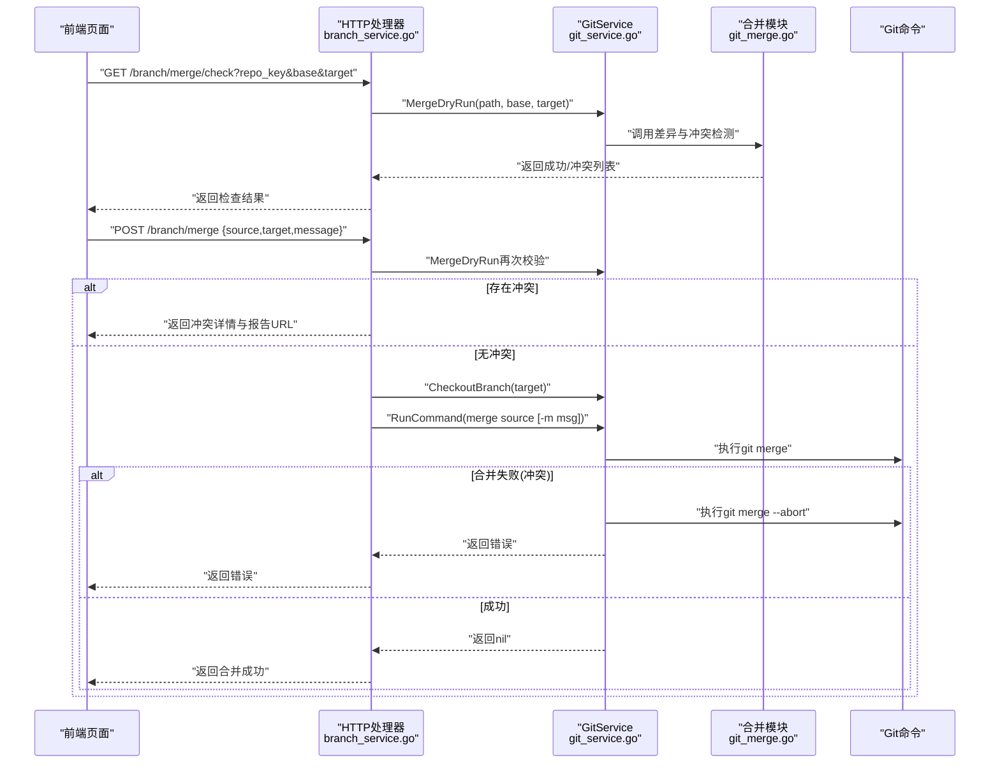
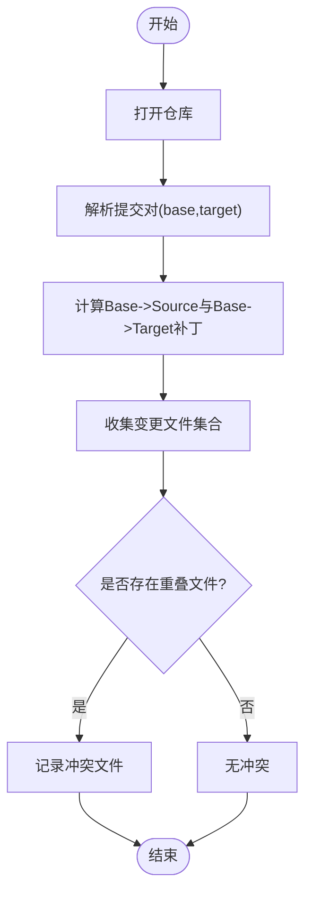
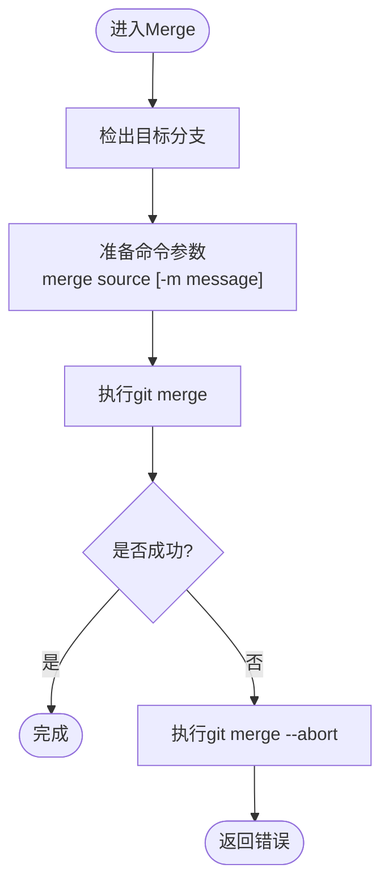
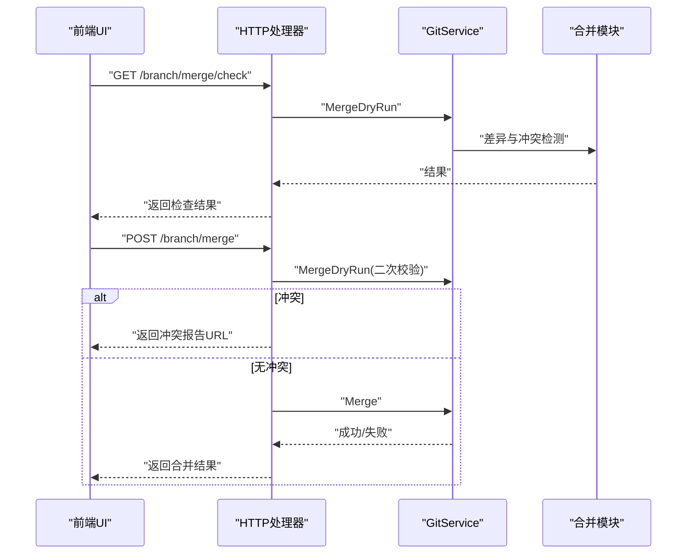
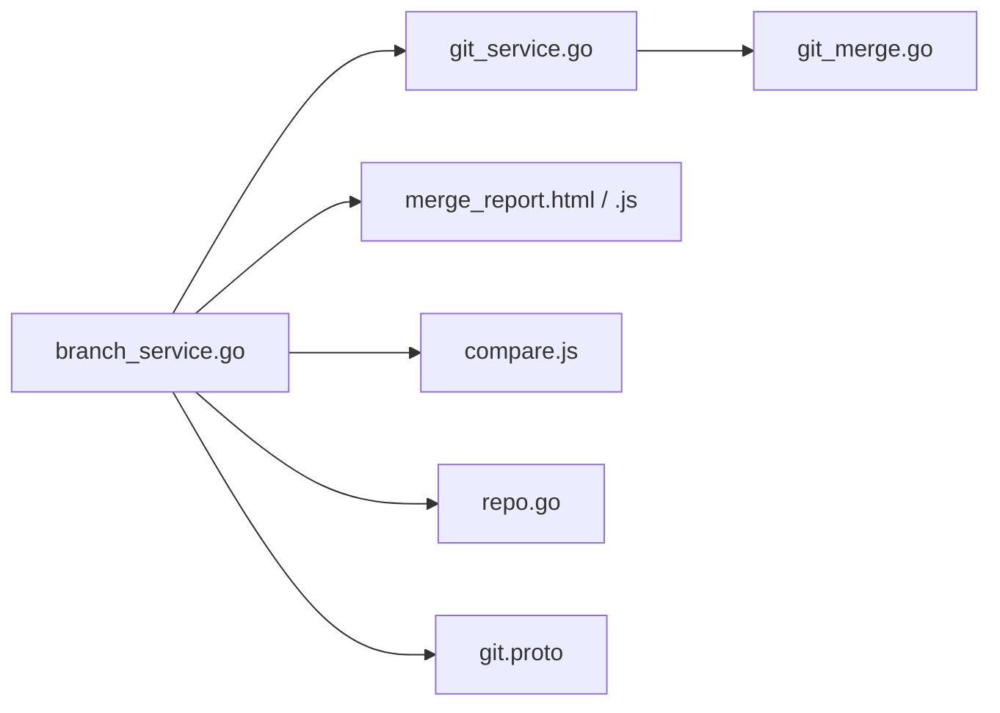

# 合并操作

<cite>
**本文引用的文件**
- [git_merge.go](file://biz/service/git/git_merge.go)
- [git_service.go](file://biz/service/git/git_service.go)
- [branch_service.go](file://biz/handler/branch/branch_service.go)
- [merge_report.html](file://public/merge_report.html)
- [merge_report.js](file://public/js/merge_report.js)
- [compare.js](file://public/js/compare.js)
- [repo.go](file://biz/model/api/repo.go)
- [git.proto](file://idl/git.proto)
- [git_branch.go](file://biz/service/git/git_branch.go)
</cite>

## 目录
1. [简介](#简介)
2. [项目结构](#项目结构)
3. [核心组件](#核心组件)
4. [架构总览](#架构总览)
5. [详细组件分析](#详细组件分析)
6. [依赖关系分析](#依赖关系分析)
7. [性能考量](#性能考量)
8. [故障排查指南](#故障排查指南)
9. [结论](#结论)
10. [附录](#附录)

## 简介
本文件聚焦于Git合并操作的技术实现与最佳实践，围绕GitService中的合并功能展开，涵盖合并策略处理、冲突检测与解决、状态管理、进度反馈、错误处理与回滚机制，并结合前端交互与审计日志，给出可落地的实施建议与常见问题解决方案。

## 项目结构
与合并相关的代码分布在以下层次：
- 业务层（服务）：GitService提供底层Git命令执行与仓库操作能力；合并相关逻辑集中在git_merge.go中。
- 接口层（HTTP处理器）：branch_service.go提供合并检查与执行的REST接口。
- 前端页面与脚本：merge_report.html与merge_report.js用于展示冲突报告；compare.js负责合并表单与消息生成。
- 数据模型：repo.go定义合并请求体结构（含策略预留字段）。
- IDL与客户端：git.proto定义服务契约，供Kitex生成客户端/服务端代码。

图表来源
- [branch_service.go](file://biz/handler/branch/branch_service.go#L414-L496)
- [git_merge.go](file://biz/service/git/git_merge.go#L157-L242)
- [git_service.go](file://biz/service/git/git_service.go#L33-L48)
- [repo.go](file://biz/model/api/repo.go#L39-L44)
- [git.proto](file://idl/git.proto#L5-L11)

章节来源
- [branch_service.go](file://biz/handler/branch/branch_service.go#L414-L496)
- [git_merge.go](file://biz/service/git/git_merge.go#L157-L242)
- [git_service.go](file://biz/service/git/git_service.go#L33-L48)
- [repo.go](file://biz/model/api/repo.go#L39-L44)
- [git.proto](file://idl/git.proto#L5-L11)

## 核心组件
- GitService：封装仓库打开、命令执行、分支检出、状态查询等通用能力；合并采用“先检出目标分支，再调用git命令”的策略，以利用Git原生合并器与回滚能力。
- 合并模块（git_merge.go）：提供差异统计、变更文件列表、原始diff、干运行冲突检测与实际合并执行。
- HTTP处理器（branch_service.go）：暴露合并检查与执行接口，整合预检、冲突报告、审计日志与最终合并。
- 前端（merge_report.html、merge_report.js、compare.js）：渲染冲突报告、生成合并消息、引导用户处理冲突。
- 请求模型（repo.go）：定义合并请求体，包含源分支、目标分支、消息与策略预留字段。

章节来源
- [git_merge.go](file://biz/service/git/git_merge.go#L157-L242)
- [git_service.go](file://biz/service/git/git_service.go#L594-L623)
- [branch_service.go](file://biz/handler/branch/branch_service.go#L414-L496)
- [merge_report.html](file://public/merge_report.html#L1-L55)
- [merge_report.js](file://public/js/merge_report.js#L1-L65)
- [compare.js](file://public/js/compare.js#L184-L200)
- [repo.go](file://biz/model/api/repo.go#L39-L44)

## 架构总览
下图展示了从HTTP请求到Git命令执行与冲突回滚的整体流程：

图表来源
- [branch_service.go](file://biz/handler/branch/branch_service.go#L414-L496)
- [git_merge.go](file://biz/service/git/git_merge.go#L157-L242)
- [git_service.go](file://biz/service/git/git_service.go#L33-L48)

## 详细组件分析

### 合并干运行与冲突检测（MergeDryRun）
- 功能要点
  - 解析基线与目标提交，计算两者与共同祖先的补丁差异。
  - 统计变更文件集合，若目标分支与源分支对同一文件均有改动，则判定为潜在冲突。
  - 返回布尔结果与冲突文件列表，不进行任何提交。
- 复杂度与性能
  - 差异计算基于补丁遍历，时间复杂度近似O(F+T)，F为变更文件数，T为补丁条目数；空间复杂度O(C)，C为冲突文件数。
- 错误处理
  - 若无法解析提交或找不到共同祖先，返回错误；冲突检测阶段不抛出异常，仅返回结果。

图表来源
- [git_merge.go](file://biz/service/git/git_merge.go#L157-L217)

章节来源
- [git_merge.go](file://biz/service/git/git_merge.go#L157-L217)

### 实际合并执行（Merge）
- 功能要点
  - 先切换到目标分支，确保工作区干净且处于目标分支。
  - 调用git命令执行合并，支持传入自定义合并消息。
  - 若合并失败（通常因冲突），立即执行git merge --abort恢复工作区状态。
- 回滚机制
  - 通过--abort确保工作区回到合并前状态，避免脏状态遗留。
- 错误处理
  - 捕获命令执行错误，返回带输出的错误信息，便于定位问题。

图表来源
- [git_merge.go](file://biz/service/git/git_merge.go#L219-L242)
- [git_service.go](file://biz/service/git/git_service.go#L594-L607)

章节来源
- [git_merge.go](file://biz/service/git/git_merge.go#L219-L242)
- [git_service.go](file://biz/service/git/git_service.go#L594-L607)

### HTTP处理器与前端集成
- 干运行检查接口
  - GET /branch/merge/check：调用GitService.MergeDryRun，返回成功与否及冲突文件列表。
- 合并执行接口
  - POST /branch/merge：先二次干运行校验，若存在冲突则生成报告URL并返回；否则执行实际合并。
  - 成功后记录审计日志，返回合并成功状态。
- 前端交互
  - 合并报告页merge_report.html展示冲突文件清单与推荐策略。
  - merge_report.js加载冲突详情并渲染UI。
  - compare.js在打开合并模态时生成默认合并消息。

图表来源
- [branch_service.go](file://biz/handler/branch/branch_service.go#L414-L496)
- [merge_report.html](file://public/merge_report.html#L1-L55)
- [merge_report.js](file://public/js/merge_report.js#L1-L65)
- [compare.js](file://public/js/compare.js#L184-L200)

章节来源
- [branch_service.go](file://biz/handler/branch/branch_service.go#L414-L496)
- [merge_report.html](file://public/merge_report.html#L1-L55)
- [merge_report.js](file://public/js/merge_report.js#L1-L65)
- [compare.js](file://public/js/compare.js#L184-L200)

### 合并配置与消息处理
- 配置项
  - 合并消息：支持通过请求体传递message参数，默认由前端生成。
  - 合并策略：请求体中预留strategy字段，当前未在后端实现，可作为扩展点。
- 消息生成
  - 前端compare.js在打开合并模态时根据源/目标分支生成默认消息，便于审计与历史追溯。

章节来源
- [repo.go](file://biz/model/api/repo.go#L39-L44)
- [compare.js](file://public/js/compare.js#L184-L200)

### 合并状态管理与审计
- 状态管理
  - 干运行阶段仅读取差异，不改变工作区状态。
  - 执行阶段若失败，通过--abort回滚至合并前状态。
- 审计日志
  - 冲突场景记录MERGE_CONFLICT事件，包含源分支、目标分支、冲突文件与merge_id。
  - 成功场景记录MERGE_SUCCESS事件，包含源/目标分支信息。

章节来源
- [branch_service.go](file://biz/handler/branch/branch_service.go#L466-L493)

### 合并前置条件与结果验证
- 前置条件
  - 仓库路径有效且为Git仓库。
  - 提交引用可解析（支持简写与完整引用）。
  - 目标分支存在且可检出。
- 结果验证
  - 干运行阶段验证冲突文件集合。
  - 执行阶段通过命令返回值与--abort回滚保障一致性。
  - 可结合GetStatus、GetHeadBranch等辅助方法进行最终状态确认。

章节来源
- [git_merge.go](file://biz/service/git/git_merge.go#L157-L217)
- [git_service.go](file://biz/service/git/git_service.go#L594-L623)
- [git_service.go](file://biz/service/git/git_service.go#L893-L908)

## 依赖关系分析
- 组件耦合
  - HTTP处理器依赖GitService提供的命令执行与仓库操作能力。
  - 合并模块依赖GitService的openRepo与commit解析工具函数。
- 外部依赖
  - go-git用于仓库对象与提交解析；原生git命令用于合并与回滚。
  - 前端静态资源与脚本负责用户交互与冲突报告展示。

图表来源
- [branch_service.go](file://biz/handler/branch/branch_service.go#L414-L496)
- [git_service.go](file://biz/service/git/git_service.go#L33-L48)
- [git_merge.go](file://biz/service/git/git_merge.go#L157-L242)
- [merge_report.html](file://public/merge_report.html#L1-L55)
- [merge_report.js](file://public/js/merge_report.js#L1-L65)
- [compare.js](file://public/js/compare.js#L184-L200)
- [repo.go](file://biz/model/api/repo.go#L39-L44)
- [git.proto](file://idl/git.proto#L5-L11)

章节来源
- [branch_service.go](file://biz/handler/branch/branch_service.go#L414-L496)
- [git_service.go](file://biz/service/git/git_service.go#L33-L48)
- [git_merge.go](file://biz/service/git/git_merge.go#L157-L242)
- [merge_report.html](file://public/merge_report.html#L1-L55)
- [merge_report.js](file://public/js/merge_report.js#L1-L65)
- [compare.js](file://public/js/compare.js#L184-L200)
- [repo.go](file://biz/model/api/repo.go#L39-L44)
- [git.proto](file://idl/git.proto#L5-L11)

## 性能考量
- 干运行差异计算
  - 对于大型仓库，差异计算可能耗时；建议在前端进行分页/节流展示，并限制同时检查的分支数量。
- 命令执行
  - RunCommand为阻塞式调用，建议在高并发场景下引入队列与限流，避免Git进程竞争。
- 状态查询
  - GetStatus、GetHeadBranch等操作开销较小，可在关键节点调用以减少不必要的命令执行。

## 故障排查指南
- 常见错误与定位
  - “无合并基”：当无法解析共同祖先时，检查base/target引用是否正确。
  - “合并失败（已中止）”：通常由冲突导致，查看冲突文件清单并修复。
  - “工作区脏”：若工作区存在未暂存变更，可能导致检出失败；请先清理或暂存。
- 回滚与恢复
  - 合并失败会自动执行--abort，工作区恢复至合并前状态；如需进一步诊断，可查看RunCommand输出。
- 前端报告
  - 使用merge_report.html与merge_report.js核对冲突文件与报告URL，便于快速定位问题。

章节来源
- [git_merge.go](file://biz/service/git/git_merge.go#L219-L242)
- [branch_service.go](file://biz/handler/branch/branch_service.go#L462-L482)
- [merge_report.html](file://public/merge_report.html#L1-L55)
- [merge_report.js](file://public/js/merge_report.js#L1-L65)

## 结论
该合并实现以“干运行预检+原生git命令执行+自动回滚”为核心设计，兼顾了安全性与易用性。通过清晰的前后端协作与审计日志，能够有效支撑团队在生产环境中的安全合并流程。后续可考虑扩展合并策略选择与自动化冲突解决建议，进一步提升用户体验与效率。

## 附录

### 最佳实践
- 在执行合并前，务必进行干运行检查，提前发现潜在冲突。
- 合并消息应简洁明确，包含源分支与目标分支信息，便于审计与回溯。
- 对于大规模仓库，建议分批合并与增量检查，避免一次性触发大量冲突。
- 引入任务队列与重试机制，保证高并发下的稳定性。

### 常见问题与解决方案
- 冲突过多导致合并失败：优先解决高频冲突文件，必要时采用“优先使用某一方”的策略（通过扩展策略字段实现）。
- 权限不足：检查远程认证配置，确保SSH或HTTP凭据正确。
- 分支引用错误：使用ResolveRevision或GetHeadBranch辅助确认引用有效性。