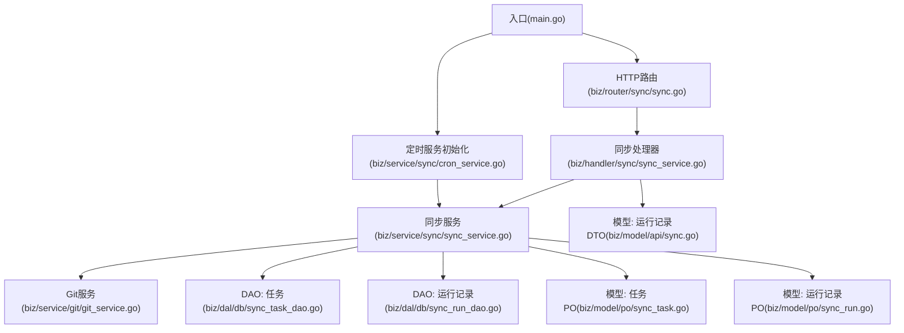
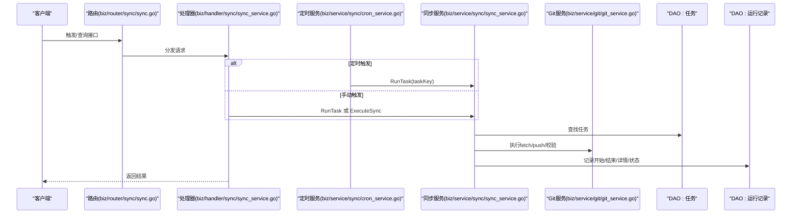
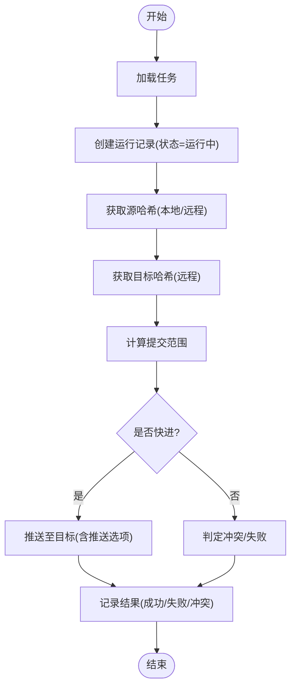
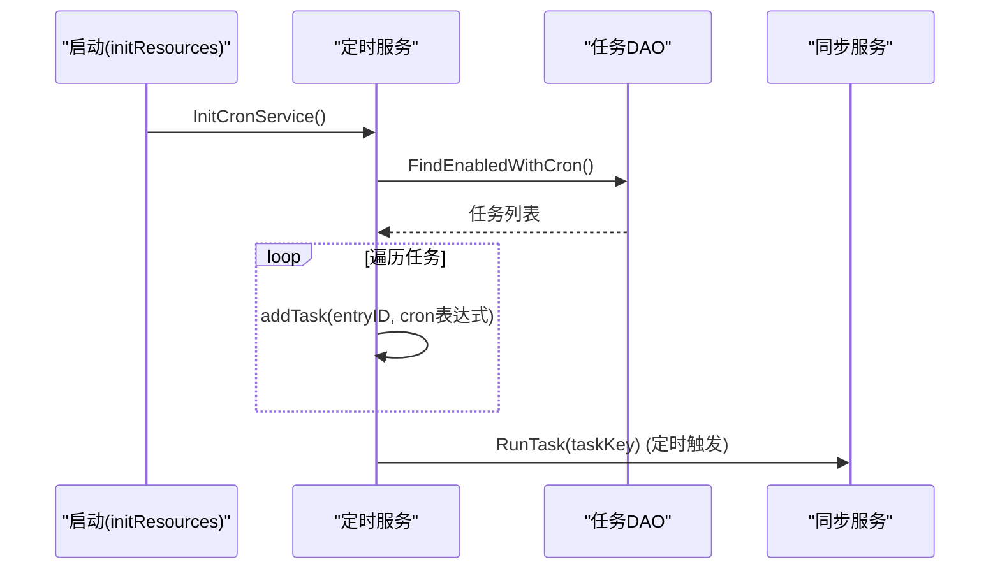
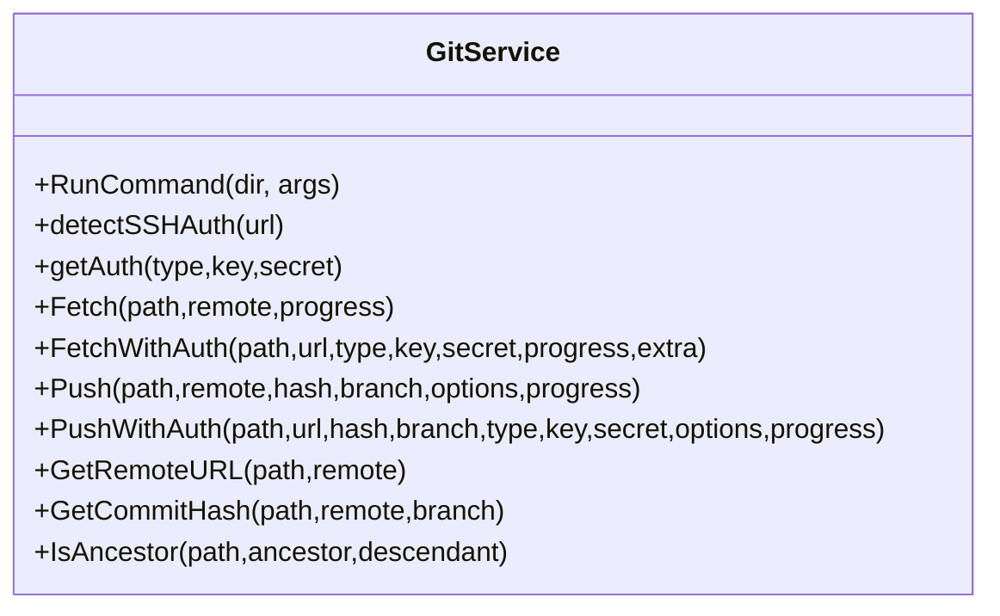
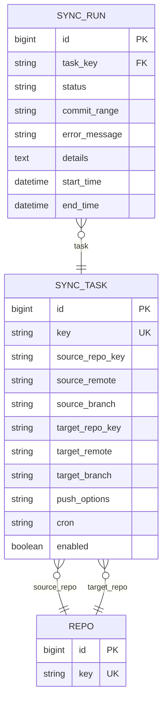
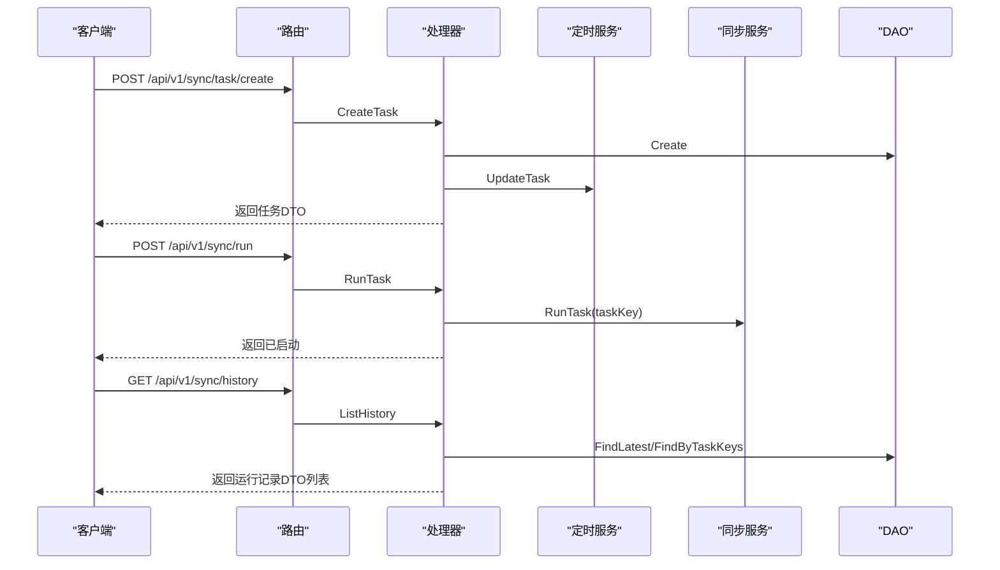
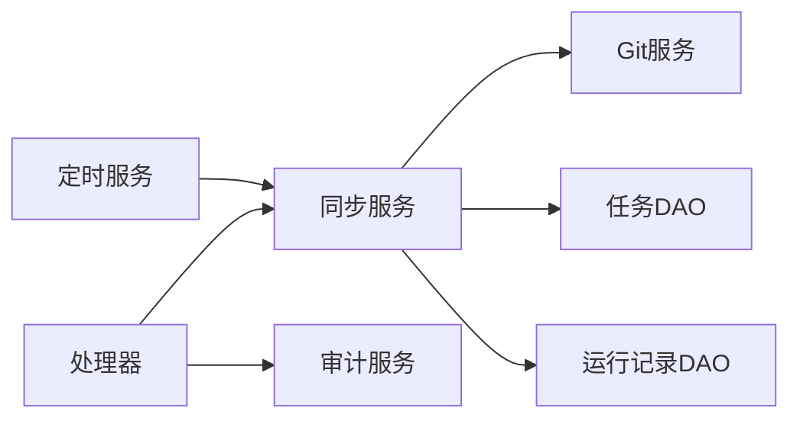

# 同步机制

<cite>
**本文引用的文件**
- [main.go](file://main.go)
- [biz/service/sync/sync_service.go](file://biz/service/sync/sync_service.go)
- [biz/service/sync/cron_service.go](file://biz/service/sync/cron_service.go)
- [biz/handler/sync/sync_service.go](file://biz/handler/sync/sync_service.go)
- [biz/router/sync/sync.go](file://biz/router/sync/sync.go)
- [biz/model/po/sync_task.go](file://biz/model/po/sync_task.go)
- [biz/model/po/sync_run.go](file://biz/model/po/sync_run.go)
- [biz/dal/db/sync_task_dao.go](file://biz/dal/db/sync_task_dao.go)
- [biz/dal/db/sync_run_dao.go](file://biz/dal/db/sync_run_dao.go)
- [biz/model/api/sync.go](file://biz/model/api/sync.go)
- [biz/service/git/git_service.go](file://biz/service/git/git_service.go)
- [biz/service/git/git_branch_sync.go](file://biz/service/git/git_branch_sync.go)
- [biz/model/domain/git.go](file://biz/model/domain/git.go)
</cite>

## 目录
1. [引言](#引言)
2. [项目结构](#项目结构)
3. [核心组件](#核心组件)
4. [架构总览](#架构总览)
5. [详细组件分析](#详细组件分析)
6. [依赖关系分析](#依赖关系分析)
7. [性能考虑](#性能考虑)
8. [故障排查指南](#故障排查指南)
9. [结论](#结论)
10. [附录](#附录)

## 引言
本文件系统性阐述该Git同步机制的设计与实现，覆盖分支同步策略、触发机制（定时与手动）、执行流程、状态跟踪与历史记录、配置管理与条件判断、失败处理与重试思路、日志记录以及性能优化与监控建议。目标是帮助开发者与运维人员快速理解并高效维护该同步体系。

## 项目结构
围绕“同步”主题，代码按职责分层组织：
- 入口与启动：应用在入口中初始化资源并启动HTTP/RPC服务，其中同步定时器在资源初始化阶段启动。
- 路由与接口：提供同步任务的增删改查、立即执行、历史查询等REST接口。
- 业务服务：同步服务负责具体执行流程；定时服务负责任务加载与调度。
- 数据访问：DAO层封装对任务与运行记录的持久化。
- 模型定义：PO与DTO分别用于持久化与API传输。
- Git服务：封装fetch/push/认证/分支状态等底层能力。

**图表来源**
- [main.go](file://main.go#L115-L134)
- [biz/router/sync/sync.go](file://biz/router/sync/sync.go#L17-L40)
- [biz/handler/sync/sync_service.go](file://biz/handler/sync/sync_service.go#L19-L258)
- [biz/service/sync/sync_service.go](file://biz/service/sync/sync_service.go#L1-L263)
- [biz/service/sync/cron_service.go](file://biz/service/sync/cron_service.go#L24-L100)
- [biz/dal/db/sync_task_dao.go](file://biz/dal/db/sync_task_dao.go#L13-L66)
- [biz/dal/db/sync_run_dao.go](file://biz/dal/db/sync_run_dao.go#L13-L39)
- [biz/model/po/sync_task.go](file://biz/model/po/sync_task.go#L7-L28)
- [biz/model/po/sync_run.go](file://biz/model/po/sync_run.go#L9-L25)
- [biz/model/api/sync.go](file://biz/model/api/sync.go#L9-L40)

**章节来源**
- [main.go](file://main.go#L115-L134)
- [biz/router/sync/sync.go](file://biz/router/sync/sync.go#L17-L40)

## 核心组件
- 同步服务：负责单次同步任务的执行、状态记录与错误处理。
- 定时服务：基于cron加载启用的任务，动态增删任务条目。
- Git服务：封装fetch/push、认证检测、远程URL解析、祖先关系判断等。
- DAO层：任务与运行记录的增删改查与聚合查询。
- 处理器与路由：对外暴露REST接口，支持手动触发、历史查询、任务管理。
- 模型层：任务与运行记录的持久化结构及API DTO。

**章节来源**
- [biz/service/sync/sync_service.go](file://biz/service/sync/sync_service.go#L13-L25)
- [biz/service/sync/cron_service.go](file://biz/service/sync/cron_service.go#L14-L33)
- [biz/service/git/git_service.go](file://biz/service/git/git_service.go#L27-L31)
- [biz/dal/db/sync_task_dao.go](file://biz/dal/db/sync_task_dao.go#L13-L66)
- [biz/dal/db/sync_run_dao.go](file://biz/dal/db/sync_run_dao.go#L13-L39)
- [biz/handler/sync/sync_service.go](file://biz/handler/sync/sync_service.go#L62-L258)
- [biz/model/po/sync_task.go](file://biz/model/po/sync_task.go#L7-L28)
- [biz/model/po/sync_run.go](file://biz/model/po/sync_run.go#L9-L25)

## 架构总览
下图展示从请求到执行再到记录的端到端流程，涵盖定时触发与手动触发两种路径。

**图表来源**
- [biz/router/sync/sync.go](file://biz/router/sync/sync.go#L17-L40)
- [biz/handler/sync/sync_service.go](file://biz/handler/sync/sync_service.go#L147-L200)
- [biz/service/sync/cron_service.go](file://biz/service/sync/cron_service.go#L84-L100)
- [biz/service/sync/sync_service.go](file://biz/service/sync/sync_service.go#L27-L74)
- [biz/dal/db/sync_task_dao.go](file://biz/dal/db/sync_task_dao.go#L31-L35)
- [biz/dal/db/sync_run_dao.go](file://biz/dal/db/sync_run_dao.go#L13-L19)
- [biz/service/git/git_service.go](file://biz/service/git/git_service.go#L138-L191)

## 详细组件分析

### 同步服务：执行流程与状态管理
- 任务执行入口：根据任务键查找任务后进入执行流程。
- 运行记录：创建运行记录并标记开始时间与状态为“运行中”，随后捕获日志。
- 同步步骤：
  - 解析源远端与分支，支持本地源与远程源两种路径；按需鉴权fetch源。
  - 解析目标远端与分支，按需鉴权fetch目标。
  - 获取源/目标哈希，计算提交范围；若目标不存在则视为新分支。
  - 快进检查：若非快进且源落后于目标或存在分歧，则判定冲突或失败。
  - 推送：按推送选项进行目标推送。
- 结果记录：根据执行结果更新状态（成功/失败/冲突），写入错误信息与最终日志。

**图表来源**
- [biz/service/sync/sync_service.go](file://biz/service/sync/sync_service.go#L35-L74)
- [biz/service/sync/sync_service.go](file://biz/service/sync/sync_service.go#L85-L249)

**章节来源**
- [biz/service/sync/sync_service.go](file://biz/service/sync/sync_service.go#L27-L74)
- [biz/service/sync/sync_service.go](file://biz/service/sync/sync_service.go#L85-L249)

### 定时服务：任务加载与调度
- 初始化：启动cron实例，加载启用且配置了cron表达式的任务。
- 动态更新：新增/修改任务时，移除旧条目并重新注册；删除任务时清理对应条目。
- 触发执行：每次触发回调内部调用同步服务执行任务，并记录日志。

**图表来源**
- [main.go](file://main.go#L129-L129)
- [biz/service/sync/cron_service.go](file://biz/service/sync/cron_service.go#L24-L57)
- [biz/dal/db/sync_task_dao.go](file://biz/dal/db/sync_task_dao.go#L62-L66)
- [biz/service/sync/cron_service.go](file://biz/service/sync/cron_service.go#L84-L100)

**章节来源**
- [biz/service/sync/cron_service.go](file://biz/service/sync/cron_service.go#L24-L100)
- [biz/dal/db/sync_task_dao.go](file://biz/dal/db/sync_task_dao.go#L62-L66)

### Git服务：认证与网络操作
- 认证检测：自动识别SSH密钥与SSH Agent，支持HTTP Basic。
- 远程操作：封装fetch/push、获取远程URL、解析分支哈希、判断祖先关系。
- 日志与进度：通过progress writer将git输出写入统一日志流。

**图表来源**
- [biz/service/git/git_service.go](file://biz/service/git/git_service.go#L50-L127)
- [biz/service/git/git_service.go](file://biz/service/git/git_service.go#L138-L191)
- [biz/service/git/git_service.go](file://biz/service/git/git_service.go#L292-L323)
- [biz/service/git/git_service.go](file://biz/service/git/git_service.go#L510-L538)
- [biz/service/git/git_service.go](file://biz/service/git/git_service.go#L231-L248)
- [biz/service/git/git_service.go](file://biz/service/git/git_service.go#L250-L269)

**章节来源**
- [biz/service/git/git_service.go](file://biz/service/git/git_service.go#L50-L127)
- [biz/service/git/git_service.go](file://biz/service/git/git_service.go#L138-L191)
- [biz/service/git/git_service.go](file://biz/service/git/git_service.go#L292-L323)
- [biz/service/git/git_service.go](file://biz/service/git/git_service.go#L510-L538)
- [biz/service/git/git_service.go](file://biz/service/git/git_service.go#L231-L248)
- [biz/service/git/git_service.go](file://biz/service/git/git_service.go#L250-L269)

### 数据模型与持久化
- 任务模型：包含源/目标仓库键、远端与分支、推送选项、Cron表达式与启用状态，并关联仓库实体。
- 运行记录模型：记录任务键、状态、提交范围、错误信息、详情日志、起止时间，并关联任务。
- DAO接口：提供任务与运行记录的创建、保存、查询、分页与聚合查询。

**图表来源**
- [biz/model/po/sync_task.go](file://biz/model/po/sync_task.go#L7-L28)
- [biz/model/po/sync_run.go](file://biz/model/po/sync_run.go#L9-L25)

**章节来源**
- [biz/model/po/sync_task.go](file://biz/model/po/sync_task.go#L7-L28)
- [biz/model/po/sync_run.go](file://biz/model/po/sync_run.go#L9-L25)
- [biz/dal/db/sync_task_dao.go](file://biz/dal/db/sync_task_dao.go#L13-L66)
- [biz/dal/db/sync_run_dao.go](file://biz/dal/db/sync_run_dao.go#L13-L39)

### 接口与路由：任务与历史管理
- 列表与详情：支持按仓库键过滤任务列表，支持按任务键查询。
- 创建/更新/删除：创建后加入定时器；更新影响定时器；删除后移除定时器。
- 手动执行：异步启动一次执行；另提供一次性执行接口。
- 历史查询：支持按仓库键或全局查询最近运行记录，支持删除历史。

**图表来源**
- [biz/router/sync/sync.go](file://biz/router/sync/sync.go#L17-L40)
- [biz/handler/sync/sync_service.go](file://biz/handler/sync/sync_service.go#L62-L145)
- [biz/handler/sync/sync_service.go](file://biz/handler/sync/sync_service.go#L147-L200)
- [biz/handler/sync/sync_service.go](file://biz/handler/sync/sync_service.go#L202-L233)

**章节来源**
- [biz/router/sync/sync.go](file://biz/router/sync/sync.go#L17-L40)
- [biz/handler/sync/sync_service.go](file://biz/handler/sync/sync_service.go#L62-L233)

### 分支状态与辅助能力
- 分支同步状态：计算本地分支相对于上游的ahead/behind数量。
- 分支操作：支持推送、拉取、快进更新、全远端抓取。
- 仓库配置：解析远端与分支配置，便于诊断与可视化。

**章节来源**
- [biz/service/git/git_branch_sync.go](file://biz/service/git/git_branch_sync.go#L13-L85)
- [biz/service/git/git_branch_sync.go](file://biz/service/git/git_branch_sync.go#L87-L150)
- [biz/service/git/git_branch_sync.go](file://biz/service/git/git_branch_sync.go#L152-L184)
- [biz/service/git/git_branch_sync.go](file://biz/service/git/git_branch_sync.go#L186-L214)
- [biz/model/domain/git.go](file://biz/model/domain/git.go#L14-L39)

## 依赖关系分析
- 组件耦合：
  - 同步服务依赖Git服务与DAO层；定时服务依赖同步服务与任务DAO。
  - 处理器仅作为薄层，依赖同步服务与审计模块。
- 外部依赖：
  - cron库用于定时；go-git用于仓库操作；HTTP/SSH认证方法由go-git transport提供。
- 可能的循环依赖：
  - 当前结构清晰，未发现直接循环依赖。

**图表来源**
- [biz/handler/sync/sync_service.go](file://biz/handler/sync/sync_service.go#L15-L16)
- [biz/service/sync/cron_service.go](file://biz/service/sync/cron_service.go#L18-L29)
- [biz/service/sync/sync_service.go](file://biz/service/sync/sync_service.go#L8-L24)

**章节来源**
- [biz/handler/sync/sync_service.go](file://biz/handler/sync/sync_service.go#L15-L16)
- [biz/service/sync/cron_service.go](file://biz/service/sync/cron_service.go#L18-L29)
- [biz/service/sync/sync_service.go](file://biz/service/sync/sync_service.go#L8-L24)

## 性能考虑
- 并发与隔离：定时触发与手动触发均以goroutine方式异步执行，避免阻塞接口响应。
- I/O与网络：Git fetch/push使用progress writer输出日志，便于观测进度但不阻塞主流程。
- 快进检查：通过祖先关系判断避免非快进导致的复杂合并，减少失败概率。
- 历史查询：DAO提供分页与预加载，降低前端多次请求成本。
- 建议优化点：
  - 对频繁触发的任务可引入去重队列，避免重复执行。
  - 在高并发场景下，为Git操作增加超时与重试策略（当前未内置重试）。
  - 对大仓库可考虑增量抓取与并行任务池。
  - 将日志写入独立通道或缓冲区，避免阻塞执行线程。

[本节为通用性能建议，不直接分析具体文件，故无“章节来源”]

## 故障排查指南
- 常见错误类型：
  - 冲突：当目标不是源的祖先或源落后于目标时返回冲突。
  - 失败：网络异常、认证失败、推送失败等。
- 错误处理：
  - 同步服务在发生错误时记录状态与错误信息，并保留日志详情。
  - 定时服务在触发失败时打印日志，便于定位。
- 排查步骤：
  - 通过历史接口查看最近运行记录与状态。
  - 检查任务配置（源/目标远端、分支、推送选项、Cron表达式）。
  - 检查远端URL与认证配置，必要时使用Git服务的连接测试能力。
  - 关注日志输出，定位具体命令与阶段。

**章节来源**
- [biz/service/sync/sync_service.go](file://biz/service/sync/sync_service.go#L58-L73)
- [biz/service/sync/cron_service.go](file://biz/service/sync/cron_service.go#L87-L92)
- [biz/handler/sync/sync_service.go](file://biz/handler/sync/sync_service.go#L202-L233)

## 结论
该同步机制以清晰的分层设计实现了“任务驱动 + 定时调度 + Git原语”的同步闭环。通过统一的日志与运行记录，能够有效追踪执行状态与问题根因。建议在生产环境中结合去重队列、超时与重试策略、以及更细粒度的监控指标，进一步提升稳定性与可观测性。

## 附录
- 监控指标建议：
  - 同步成功率/失败率、冲突率
  - 平均/95分位耗时、首次fetch耗时、推送耗时
  - 任务触发延迟（定时任务实际执行时间与计划时间差）
  - 运行记录数量与存储增长趋势
- 配置要点：
  - Cron表达式格式与生效范围
  - 推送选项（如强制推送、裁剪标签等）的使用边界
  - 认证类型与密钥路径的有效性

[本节为通用建议，不直接分析具体文件，故无“章节来源”]