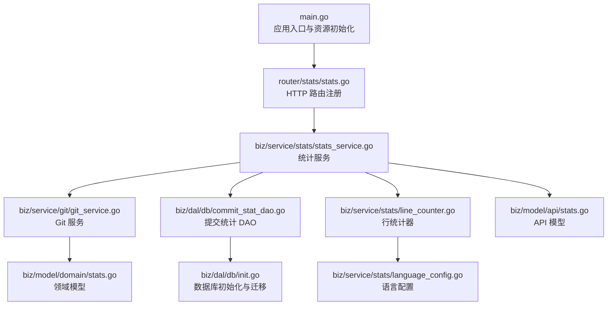
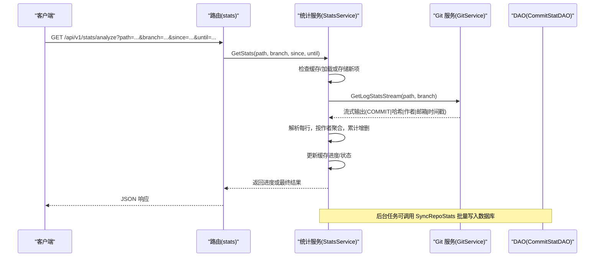
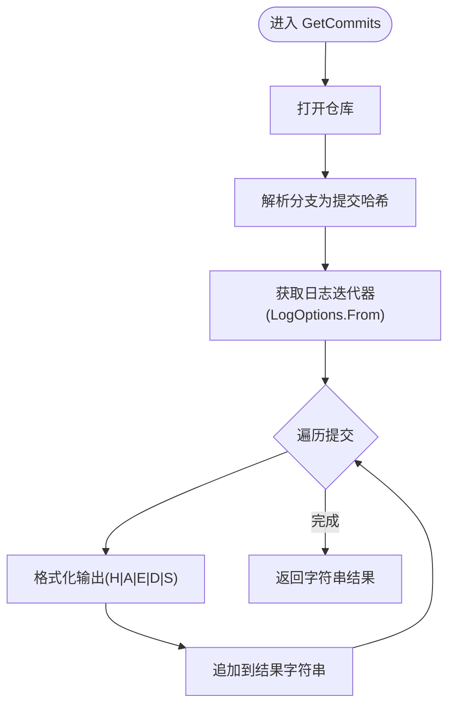
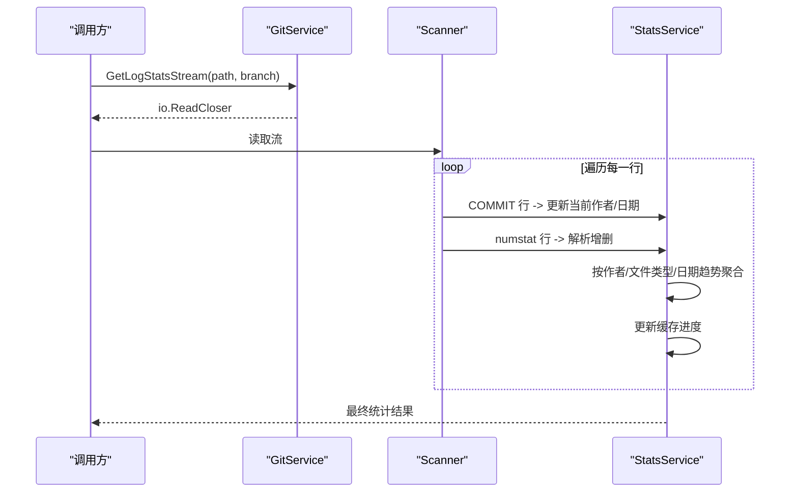
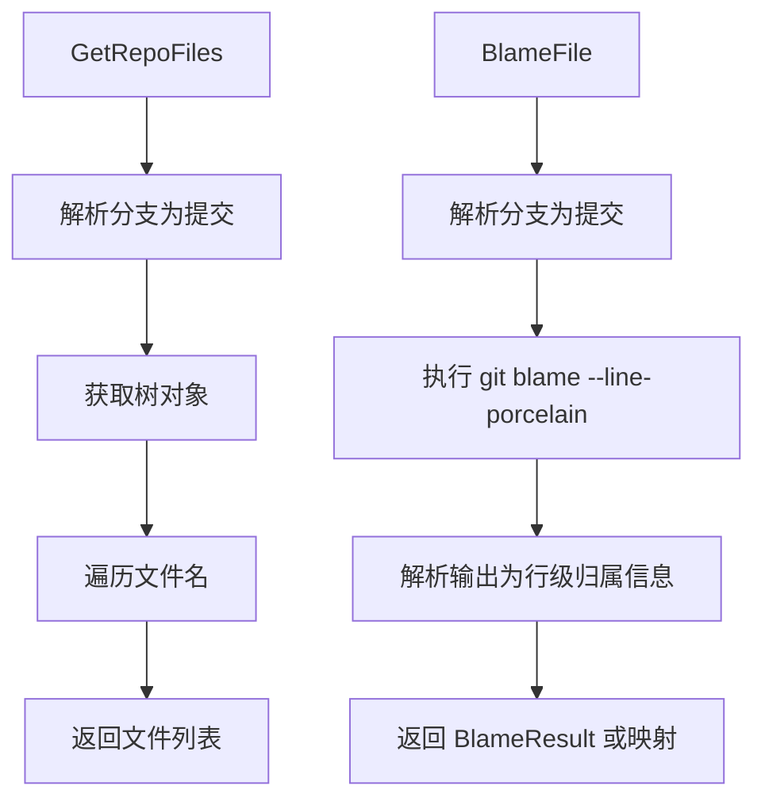
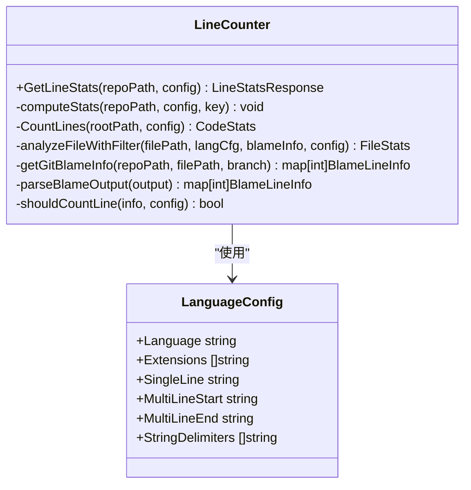
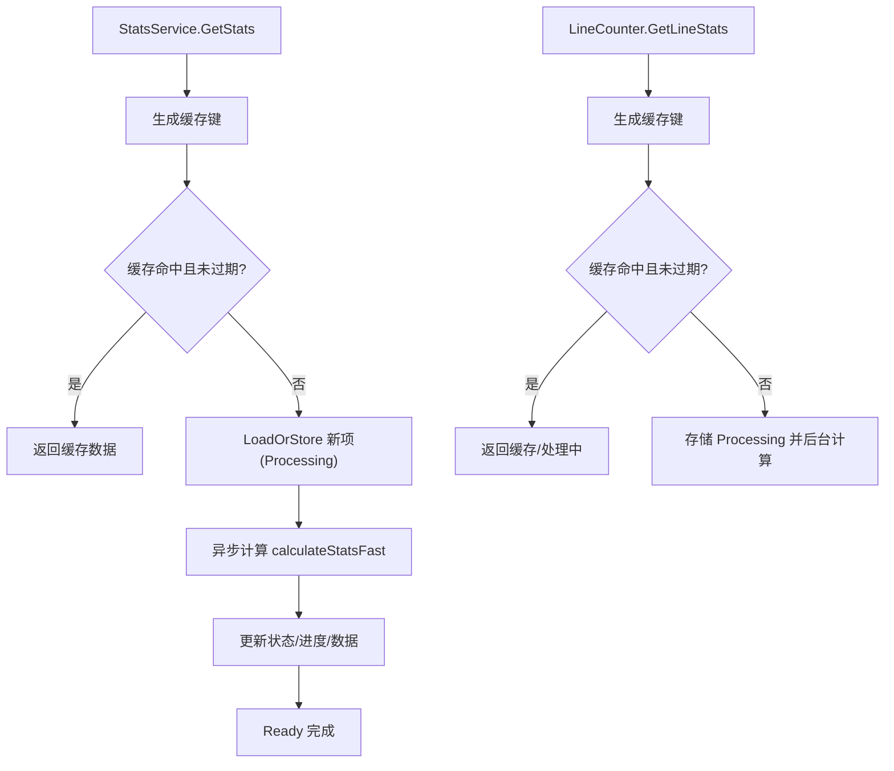
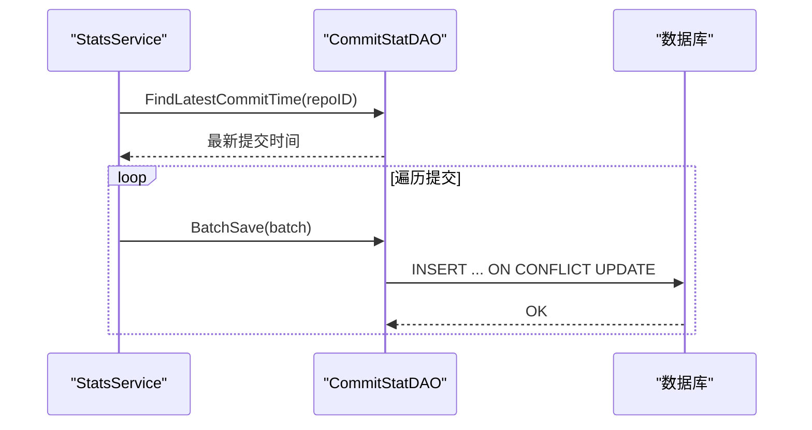
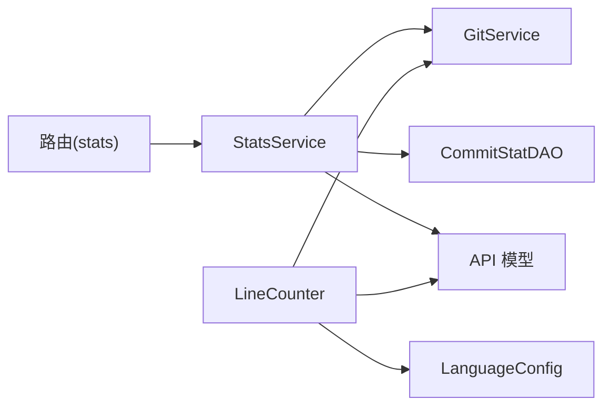

# 数据统计分析

<cite>
**本文引用的文件**
- [main.go](file://main.go)
- [stats_service.go](file://biz/service/stats/stats_service.go)
- [git_service.go](file://biz/service/git/git_service.go)
- [line_counter.go](file://biz/service/stats/line_counter.go)
- [language_config.go](file://biz/service/stats/language_config.go)
- [commit_stat_dao.go](file://biz/dal/db/commit_stat_dao.go)
- [init.go](file://biz/dal/db/init.go)
- [stats.go](file://biz/router/stats/stats.go)
- [stats.go](file://biz/model/api/stats.go)
- [stats.go](file://biz/model/domain/stats.go)
</cite>

## 目录
1. [引言](#引言)
2. [项目结构](#项目结构)
3. [核心组件](#核心组件)
4. [架构总览](#架构总览)
5. [详细组件分析](#详细组件分析)
6. [依赖关系分析](#依赖关系分析)
7. [性能考量](#性能考量)
8. [故障排查指南](#故障排查指南)
9. [结论](#结论)
10. [附录](#附录)

## 引言
本文件面向“Git 数据统计分析”子系统，聚焦以下能力与实现细节：
- 提交历史提取：GetCommits 的提交信息提取逻辑，含时间范围过滤与格式化输出。
- 日志统计：GetLogStats 与 GetLogStatsStream 的日志统计实现，含代码增删统计与提交信息解析。
- 文件分析：GetRepoFiles、BlameFile 的文件分析功能原理。
- 数据缓存与并发控制：StatsService 与 LineCounter 的缓存与并发安全设计。
- 性能优化与大数据量处理：批处理、流式解析、进度上报与内存控制策略。
- 结果解读与应用场景：如何将统计结果用于团队贡献度分析、代码健康度评估与合规审计。

## 项目结构
该子系统围绕“统计服务”“Git 服务”“数据访问层”“路由与模型”组织，核心入口在主程序中初始化并注册路由。

图表来源
- [main.go](file://main.go#L115-L134)
- [stats.go](file://biz/router/stats/stats.go#L17-L48)
- [stats_service.go](file://biz/service/stats/stats_service.go#L46-L50)
- [git_service.go](file://biz/service/git/git_service.go#L29-L31)
- [commit_stat_dao.go](file://biz/dal/db/commit_stat_dao.go#L16-L36)
- [line_counter.go](file://biz/service/stats/line_counter.go#L68-L74)
- [language_config.go](file://biz/service/stats/language_config.go#L289-L314)
- [stats.go](file://biz/model/api/stats.go#L12-L15)
- [stats.go](file://biz/model/domain/stats.go#L5-L12)
- [init.go](file://biz/dal/db/init.go#L18-L71)

章节来源
- [main.go](file://main.go#L115-L134)
- [stats.go](file://biz/router/stats/stats.go#L17-L48)

## 核心组件
- 统计服务 StatsService：负责统计任务的缓存、异步计算、进度更新与批量写入数据库；提供提交统计同步与快速统计计算。
- Git 服务 GitService：封装 go-git 与原生命令调用，提供提交迭代、日志统计命令执行、文件列表与 blame 查询等。
- 行统计器 LineCounter：基于语言配置与 git blame 的代码行统计，支持异步与缓存、过滤作者与时间范围。
- 数据访问层 CommitStatDAO：提供最新提交时间查询、批量保存与分块查询。
- 路由与模型：定义统计接口路由、API 响应结构与领域模型。

章节来源
- [stats_service.go](file://biz/service/stats/stats_service.go#L39-L50)
- [git_service.go](file://biz/service/git/git_service.go#L27-L31)
- [line_counter.go](file://biz/service/stats/line_counter.go#L20-L32)
- [commit_stat_dao.go](file://biz/dal/db/commit_stat_dao.go#L10-L14)
- [stats.go](file://biz/router/stats/stats.go#L17-L48)
- [stats.go](file://biz/model/api/stats.go#L3-L15)
- [stats.go](file://biz/model/domain/stats.go#L5-L12)

## 架构总览
统计分析流程从 HTTP 路由进入，经由统计服务调度 Git 服务执行底层命令或迭代，再通过 DAO 写入数据库或返回流式结果。行统计器独立于提交统计，可单独启用。

图表来源
- [stats.go](file://biz/router/stats/stats.go#L26-L29)
- [stats_service.go](file://biz/service/stats/stats_service.go#L179-L227)
- [stats_service.go](file://biz/service/stats/stats_service.go#L246-L371)
- [git_service.go](file://biz/service/git/git_service.go#L786-L800)
- [commit_stat_dao.go](file://biz/dal/db/commit_stat_dao.go#L26-L36)

## 详细组件分析

### 组件一：提交历史提取（GetCommits）
- 功能概述
  - 通过 go-git 的 Log 迭代器遍历指定分支的提交，按固定格式拼接字段（哈希、作者、邮箱、日期、主题），形成文本输出。
  - 当前实现未对 since/until 参数进行严格解析与过滤，建议在上层或后续版本中补充日期过滤逻辑。
- 关键点
  - 使用对象迭代器遍历提交，逐条格式化输出。
  - 日期格式采用本地化时间字符串，便于下游解析。
- 适用场景
  - 快速导出提交清单，供外部工具进一步分析。

图表来源
- [git_service.go](file://biz/service/git/git_service.go#L472-L508)

章节来源
- [git_service.go](file://biz/service/git/git_service.go#L472-L508)

### 组件二：日志统计（GetLogStats 与 GetLogStatsStream）
- GetLogStats
  - 通过原生命令执行 git log，参数包含 --numstat（增删统计）、--no-merges（忽略合并提交）与自定义 pretty 格式（COMMIT|哈希|作者名|邮箱|时间戳）。
  - 返回完整文本结果，适合一次性处理。
- GetLogStatsStream
  - 通过 StdoutPipe 获取流式输出，适合大数据量场景，避免一次性加载全部结果。
  - 统一的 COMMIT 行格式便于解析。
- 解析与聚合
  - 统计服务在 calculateStatsFast 中按行扫描，遇到 COMMIT 行更新当前作者与日期，随后解析 numstat 行，按作者、文件类型与日期趋势累加净贡献（增-删）。
  - 支持进度上报（每 100 提交或 1 秒更新一次）。
- 时间范围过滤
  - 在解析阶段对当前提交日期与 since/until 进行比较，跳过不在范围内的提交。

图表来源
- [git_service.go](file://biz/service/git/git_service.go#L781-L800)
- [stats_service.go](file://biz/service/stats/stats_service.go#L246-L371)

章节来源
- [git_service.go](file://biz/service/git/git_service.go#L781-L800)
- [stats_service.go](file://biz/service/stats/stats_service.go#L246-L371)

### 组件三：文件分析（GetRepoFiles 与 BlameFile）
- GetRepoFiles
  - 解析分支为提交，获取树对象，遍历文件名，返回文件列表。
  - 适用于快速了解仓库文件构成。
- BlameFile
  - 对指定文件执行 blame，返回逐行归属信息（提交哈希、作者、时间戳等），用于行级溯源与统计过滤。
  - 行统计器内部使用 git blame --line-porcelain 解析输出，构建行级作者与时间映射，配合作者/时间过滤实现精准统计。

图表来源
- [git_service.go](file://biz/service/git/git_service.go#L540-L562)
- [git_service.go](file://biz/service/git/git_service.go#L564-L576)
- [line_counter.go](file://biz/service/stats/line_counter.go#L452-L524)

章节来源
- [git_service.go](file://biz/service/git/git_service.go#L540-L576)
- [line_counter.go](file://biz/service/stats/line_counter.go#L452-L524)

### 组件四：行统计器（LineCounter）
- 功能概述
  - 基于语言配置识别文件类型，使用状态机解析代码/注释/空白行，支持按作者与时间范围过滤（通过 git blame）。
  - 支持异步计算与缓存，提供进度反馈。
- 关键实现
  - 语言配置：预定义多种语言的单行/多行注释与字符串定界符，按扩展名快速匹配。
  - 文件遍历：支持排除目录、隐藏文件与通配模式；可选择性启用作者/时间过滤。
  - blame 解析：解析 git blame --line-porcelain 输出，构建行号到作者/邮箱/时间戳的映射。
  - 过滤策略：当指定作者或时间范围时，仅统计满足条件的行。
- 性能要点
  - 大缓冲区扫描长行，减少 IO 次数。
  - 并发安全：使用 sync.Map 存储缓存项，避免重复计算。

图表来源
- [line_counter.go](file://biz/service/stats/line_counter.go#L68-L151)
- [line_counter.go](file://biz/service/stats/line_counter.go#L153-L251)
- [line_counter.go](file://biz/service/stats/line_counter.go#L258-L371)
- [line_counter.go](file://biz/service/stats/line_counter.go#L452-L524)
- [line_counter.go](file://biz/service/stats/line_counter.go#L536-L571)
- [language_config.go](file://biz/service/stats/language_config.go#L8-L16)
- [language_config.go](file://biz/service/stats/language_config.go#L18-L284)

章节来源
- [line_counter.go](file://biz/service/stats/line_counter.go#L68-L151)
- [line_counter.go](file://biz/service/stats/line_counter.go#L153-L251)
- [line_counter.go](file://biz/service/stats/line_counter.go#L258-L371)
- [line_counter.go](file://biz/service/stats/line_counter.go#L452-L524)
- [line_counter.go](file://biz/service/stats/line_counter.go#L536-L571)
- [language_config.go](file://biz/service/stats/language_config.go#L18-L284)

### 组件五：数据缓存与并发控制
- StatsService 缓存
  - 使用 sync.Map 作为缓存容器，键为“路径:分支:since:until”，值为 StatsCacheItem，包含状态、数据、错误与创建时间。
  - 支持 TTL（1 小时）与进度更新；通过 LoadOrStore 避免重复计算。
- LineCounter 缓存
  - 使用 sync.Map 存储 LineCacheItem，键由仓库路径与配置生成；支持“processing/ready/failed”状态与进度。
- 并发与一致性
  - 缓存项更新采用指针方式，需注意并发读写一致性；建议在关键路径增加互斥保护或替换缓存项以保证线程安全。

图表来源
- [stats_service.go](file://biz/service/stats/stats_service.go#L179-L243)
- [line_counter.go](file://biz/service/stats/line_counter.go#L76-L111)

章节来源
- [stats_service.go](file://biz/service/stats/stats_service.go#L179-L243)
- [line_counter.go](file://biz/service/stats/line_counter.go#L76-L111)

### 组件六：数据库集成与批量写入
- 最新提交时间查询
  - CommitStatDAO.FindLatestCommitTime 按仓库 ID 查询最新提交时间，用于增量同步起点。
- 批量保存
  - BatchSave 使用 ON CONFLICT 语义进行幂等更新，分批插入（每次最多 100 条），提升吞吐。
- 分块查询
  - GetByRepoAndHashes 支持按哈希列表分块查询，避免超长 IN 子句导致的 SQL 性能问题。

图表来源
- [commit_stat_dao.go](file://biz/dal/db/commit_stat_dao.go#L16-L36)
- [commit_stat_dao.go](file://biz/dal/db/commit_stat_dao.go#L38-L65)

章节来源
- [commit_stat_dao.go](file://biz/dal/db/commit_stat_dao.go#L16-L65)

## 依赖关系分析
- 统计服务依赖 Git 服务执行底层命令与迭代，依赖 DAO 写入数据库。
- 行统计器依赖语言配置与 Git blame，独立于提交统计。
- 路由层将 HTTP 请求转发至统计服务，返回统一的 API 响应结构。

图表来源
- [stats.go](file://biz/router/stats/stats.go#L26-L43)
- [stats_service.go](file://biz/service/stats/stats_service.go#L39-L50)
- [git_service.go](file://biz/service/git/git_service.go#L27-L31)
- [commit_stat_dao.go](file://biz/dal/db/commit_stat_dao.go#L10-L14)
- [line_counter.go](file://biz/service/stats/line_counter.go#L68-L74)
- [language_config.go](file://biz/service/stats/language_config.go#L289-L314)
- [stats.go](file://biz/model/api/stats.go#L12-L36)

章节来源
- [stats.go](file://biz/router/stats/stats.go#L17-L48)
- [stats_service.go](file://biz/service/stats/stats_service.go#L39-L50)
- [line_counter.go](file://biz/service/stats/line_counter.go#L68-L74)

## 性能考量
- 流式解析与缓冲
  - 使用 bufio.Scanner 并设置较大缓冲区，降低小行扫描开销。
- 批量写入
  - DAO 批次大小为 100，ON CONFLICT 幂等更新，减少事务次数。
- 进度上报与并发
  - 统计服务与行统计器均提供进度更新，避免长时间无反馈。
- 大数据量处理
  - GetLogStatsStream 与 LineCounter 的文件遍历均支持排除规则与过滤条件，减少无效统计。
- 建议优化
  - 在 StatsService 缓存项更新处引入互斥锁，避免并发读写竞争。
  - 对 since/until 参数在 GetCommits 与日志统计中增加严格的时间过滤，提高准确性。
  - 对 LineCounter 的 blame 解析增加错误重试与超时控制。

[本节为通用性能指导，不直接分析具体文件，故无章节来源]

## 故障排查指南
- Git 命令执行失败
  - 现象：RunCommand 报错，返回错误信息。
  - 排查：检查仓库路径、远程认证配置、网络连通性与权限。
- 认证问题
  - 现象：克隆/拉取/推送失败。
  - 排查：确认 HTTP Basic 或 SSH 密钥配置；必要时使用 detectSSHAuth 自动检测可用密钥。
- 缓存异常
  - 现象：统计长时间处于 processing 或结果不更新。
  - 排查：检查缓存键生成逻辑与 TTL；确认并发更新缓存项的线程安全。
- 数据库写入冲突
  - 现象：批量保存报错或重复。
  - 排查：确认唯一索引（repo_id, commit_hash）与 ON CONFLICT 配置；检查批次大小与幂等更新逻辑。
- 行统计过滤无效
  - 现象：指定作者/时间范围后统计未变化。
  - 排查：确认 blame 输出解析正确；检查 since/until 格式与边界处理。

章节来源
- [git_service.go](file://biz/service/git/git_service.go#L33-L48)
- [git_service.go](file://biz/service/git/git_service.go#L50-L65)
- [stats_service.go](file://biz/service/stats/stats_service.go#L179-L243)
- [commit_stat_dao.go](file://biz/dal/db/commit_stat_dao.go#L26-L36)
- [line_counter.go](file://biz/service/stats/line_counter.go#L536-L571)

## 结论
本系统通过“统计服务 + Git 服务 + 数据访问层”的分层设计，实现了从提交历史、日志统计到行级分析的全链路能力。其核心优势在于：
- 流式与批量结合的数据处理策略，兼顾实时性与吞吐。
- 基于缓存与并发的任务管理，提升用户体验与系统稳定性。
- 可扩展的语言配置与 blame 过滤，满足多样化统计需求。

建议在后续版本中强化时间过滤、缓存一致性与错误恢复能力，以进一步提升可靠性与可维护性。

[本节为总结性内容，不直接分析具体文件，故无章节来源]

## 附录
- 应用启动与路由注册
  - 主程序在 initResources 中初始化配置、数据库、加密工具与业务服务，并注册路由。
- API 响应结构
  - 统计响应包含作者维度的总行数、文件类型分布与时序趋势；行统计响应包含状态、进度与按语言分类的代码/注释/空白行统计。

章节来源
- [main.go](file://main.go#L115-L134)
- [stats.go](file://biz/router/stats/stats.go#L17-L48)
- [stats.go](file://biz/model/api/stats.go#L3-L15)
- [stats.go](file://biz/model/api/stats.go#L26-L36)