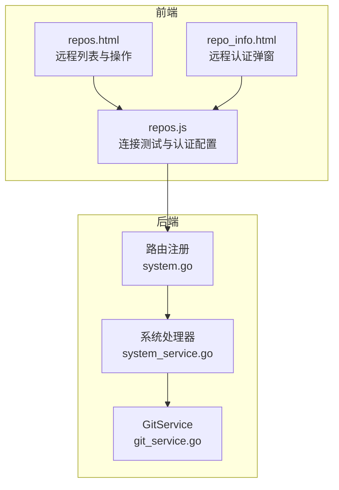
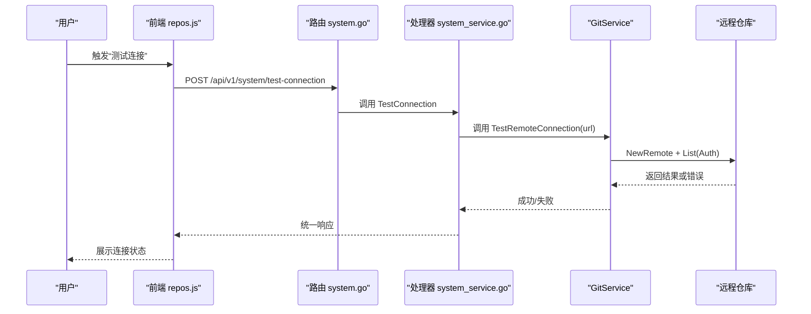
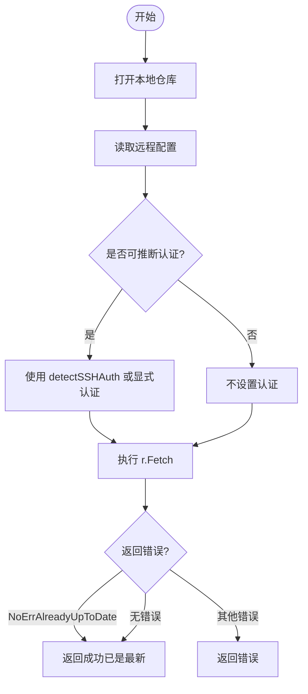
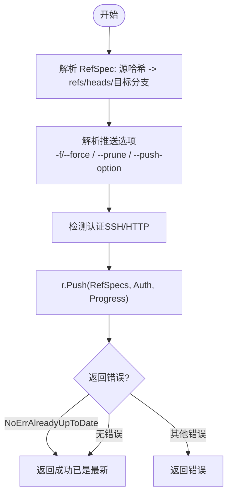
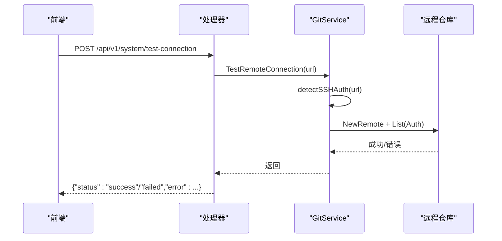
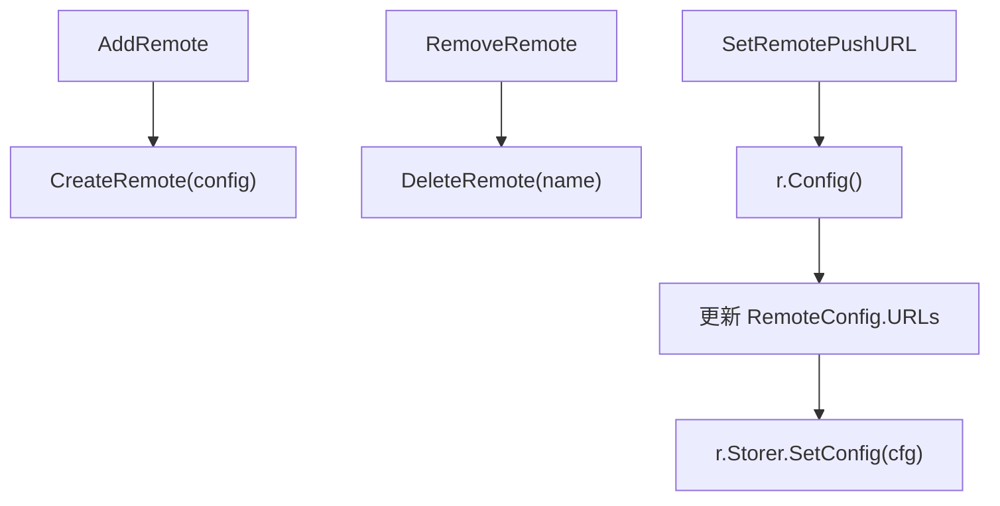
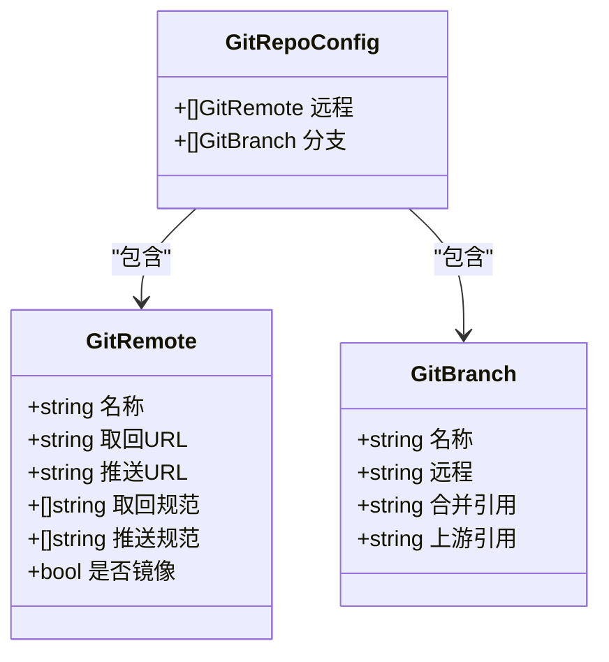
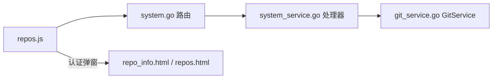

# 远程操作

<cite>
**本文档引用的文件**
- [biz/service/git/git_service.go](file://biz/service/git/git_service.go)
- [biz/handler/system/system_service.go](file://biz/handler/system/system_service.go)
- [biz/router/system/system.go](file://biz/router/system/system.go)
- [public/js/repos.js](file://public/js/repos.js)
- [public/repo_info.html](file://public/repo_info.html)
- [public/repos.html](file://public/repos.html)
- [biz/model/domain/git.go](file://biz/model/domain/git.go)
- [idl/git.proto](file://idl/git.proto)
</cite>

## 目录
1. [简介](#简介)
2. [项目结构](#项目结构)
3. [核心组件](#核心组件)
4. [架构总览](#架构总览)
5. [详细组件分析](#详细组件分析)
6. [依赖关系分析](#依赖关系分析)
7. [性能考量](#性能考量)
8. [故障排除指南](#故障排除指南)
9. [结论](#结论)
10. [附录](#附录)

## 简介
本文件聚焦于Git远程操作的实现与使用，涵盖以下主题：
- Fetch：远程拉取逻辑、认证检测、进度反馈与错误处理
- Push：推送实现、引用规范解析、强制推送与推送选项处理
- TestRemoteConnection：远程连接测试
- 远程仓库管理：AddRemote、RemoveRemote、SetRemotePushURL
- 远程列表与URL管理：GetRemotes、GetRemoteURL、GetRepoConfig
- 最佳实践与故障排除

通过代码级分析与图示，帮助读者从原理到实践全面掌握远程操作。

## 项目结构
围绕远程操作的关键代码分布在服务层、处理器层与前端界面层：
- 服务层（Go）：集中于 GitService，封装 go-git 的远程操作与配置读写
- 处理器层（Hertz）：暴露 HTTP 接口，调用 GitService 执行具体操作
- 前端界面：提供远程连接测试、远程认证配置与推送交互

**图表来源**
- [biz/router/system/system.go](file://biz/router/system/system.go#L17-L40)
- [biz/handler/system/system_service.go](file://biz/handler/system/system_service.go#L142-L158)
- [biz/service/git/git_service.go](file://biz/service/git/git_service.go#L578-L592)
- [public/js/repos.js](file://public/js/repos.js#L206-L239)
- [public/repo_info.html](file://public/repo_info.html#L445-L472)
- [public/repos.html](file://public/repos.html#L347-L374)

**章节来源**
- [biz/router/system/system.go](file://biz/router/system/system.go#L17-L40)
- [biz/handler/system/system_service.go](file://biz/handler/system/system_service.go#L142-L158)
- [biz/service/git/git_service.go](file://biz/service/git/git_service.go#L578-L592)
- [public/js/repos.js](file://public/js/repos.js#L206-L239)
- [public/repo_info.html](file://public/repo_info.html#L445-L472)
- [public/repos.html](file://public/repos.html#L347-L374)

## 核心组件
- GitService：远程操作的核心实现，基于 go-git 提供 Fetch、Push、TestRemoteConnection、AddRemote、RemoveRemote、SetRemotePushURL、GetRemotes、GetRemoteURL、GetRepoConfig 等能力
- 系统处理器：提供 /api/v1/system/test-connection 等接口，调用 GitService 并返回统一响应
- 前端界面：负责用户输入（URL、认证）、触发测试与推送流程

关键实现要点：
- 认证检测：detectSSHAuth 自动探测 SSH 凭据；getAuth 支持 HTTP Basic 与 SSH 密钥
- 进度反馈：通过 io.Writer 将远程传输进度写入通道或流
- 错误处理：区分“已是最新”等可忽略错误，其余错误向上抛出

**章节来源**
- [biz/service/git/git_service.go](file://biz/service/git/git_service.go#L50-L127)
- [biz/service/git/git_service.go](file://biz/service/git/git_service.go#L138-L191)
- [biz/service/git/git_service.go](file://biz/service/git/git_service.go#L292-L323)
- [biz/service/git/git_service.go](file://biz/service/git/git_service.go#L578-L592)
- [biz/service/git/git_service.go](file://biz/service/git/git_service.go#L411-L451)
- [biz/handler/system/system_service.go](file://biz/handler/system/system_service.go#L142-L158)

## 架构总览
远程操作的端到端流程如下：

**图表来源**
- [biz/router/system/system.go](file://biz/router/system/system.go#L30-L30)
- [biz/handler/system/system_service.go](file://biz/handler/system/system_service.go#L142-L158)
- [biz/service/git/git_service.go](file://biz/service/git/git_service.go#L578-L592)

## 详细组件分析

### Fetch 拉取实现
- 功能目标：从指定远程抓取对象与引用，支持进度回调
- 关键步骤
  - 打开本地仓库
  - 读取远程配置以推断认证方式（detectSSHAuth）
  - 调用 r.Fetch，传入 RemoteName、Auth、Progress
  - 对“已是最新”进行特殊处理，避免误报错误
- 进度反馈：通过 progress io.Writer 接收远程输出，前端可将其转为可视化进度
- 错误处理：除 NoErrAlreadyUpToDate 外的错误均返回上层

**图表来源**
- [biz/service/git/git_service.go](file://biz/service/git/git_service.go#L138-L163)
- [biz/service/git/git_service.go](file://biz/service/git/git_service.go#L67-L127)

**章节来源**
- [biz/service/git/git_service.go](file://biz/service/git/git_service.go#L138-L163)
- [biz/service/git/git_service.go](file://biz/service/git/git_service.go#L67-L127)

### Push 推送实现
- 功能目标：将本地引用推送到远程分支，支持强制推送与推送选项
- 关键步骤
  - 解析 RefSpec：将源哈希映射到目标分支 refs/heads/<branch>
  - 解析推送选项：parsePushOptions 支持 -f/--force、--prune、--push-option=key=value
  - 认证检测：优先使用已配置远程的 URL 推断 SSH 凭据
  - 调用 r.Push，传入 RemoteName、RefSpecs、Auth、Progress
  - 对“已是最新”进行特殊处理
- 引用规范解析：RefSpec 采用 "hash:refs/heads/branch" 形式
- 推送选项处理：仅解析受支持的选项，其余被忽略

**图表来源**
- [biz/service/git/git_service.go](file://biz/service/git/git_service.go#L292-L323)
- [biz/service/git/git_service.go](file://biz/service/git/git_service.go#L271-L290)

**章节来源**
- [biz/service/git/git_service.go](file://biz/service/git/git_service.go#L292-L323)
- [biz/service/git/git_service.go](file://biz/service/git/git_service.go#L271-L290)

### TestRemoteConnection 连接测试
- 功能目标：验证给定 URL 是否可达，用于前端“测试连接”按钮
- 实现要点
  - 创建匿名远程 NewRemote
  - 通过 detectSSHAuth 推断认证
  - 调用 remote.List(Auth) 触达远程
  - 成功无错误即视为连接成功

**图表来源**
- [biz/handler/system/system_service.go](file://biz/handler/system/system_service.go#L142-L158)
- [biz/service/git/git_service.go](file://biz/service/git/git_service.go#L578-L592)

**章节来源**
- [biz/handler/system/system_service.go](file://biz/handler/system/system_service.go#L142-L158)
- [biz/service/git/git_service.go](file://biz/service/git/git_service.go#L578-L592)

### 远程仓库管理（增删改URL）
- AddRemote：在本地仓库中新增远程，支持镜像模式
- RemoveRemote：删除指定远程
- SetRemotePushURL：通过修改配置实现“设置推送URL”，注意 go-git 配置模型的限制

**图表来源**
- [biz/service/git/git_service.go](file://biz/service/git/git_service.go#L411-L451)

**章节来源**
- [biz/service/git/git_service.go](file://biz/service/git/git_service.go#L411-L451)

### 远程列表与URL管理
- GetRemotes：列出本地仓库的远程名称
- GetRemoteURL：获取指定远程的首个 URL
- GetRepoConfig：读取仓库配置，返回远程与分支信息（含 FetchSpecs）

**图表来源**
- [biz/model/domain/git.go](file://biz/model/domain/git.go#L5-L24)

**章节来源**
- [biz/service/git/git_service.go](file://biz/service/git/git_service.go#L325-L409)
- [biz/model/domain/git.go](file://biz/model/domain/git.go#L5-L24)

## 依赖关系分析
- 前端通过 /api/v1/system/test-connection 调用后端
- 处理器将请求参数传递给 GitService
- GitService 基于 go-git 完成实际远程操作
- 前端还提供远程认证配置弹窗，便于用户选择 SSH 或 HTTP 认证

**图表来源**
- [biz/router/system/system.go](file://biz/router/system/system.go#L17-L40)
- [biz/handler/system/system_service.go](file://biz/handler/system/system_service.go#L142-L158)
- [biz/service/git/git_service.go](file://biz/service/git/git_service.go#L578-L592)
- [public/js/repos.js](file://public/js/repos.js#L206-L239)
- [public/repo_info.html](file://public/repo_info.html#L445-L472)
- [public/repos.html](file://public/repos.html#L347-L374)

**章节来源**
- [biz/router/system/system.go](file://biz/router/system/system.go#L17-L40)
- [biz/handler/system/system_service.go](file://biz/handler/system/system_service.go#L142-L158)
- [biz/service/git/git_service.go](file://biz/service/git/git_service.go#L578-L592)
- [public/js/repos.js](file://public/js/repos.js#L206-L239)
- [public/repo_info.html](file://public/repo_info.html#L445-L472)
- [public/repos.html](file://public/repos.html#L347-L374)

## 性能考量
- 认证探测成本：detectSSHAuth 会尝试常见密钥路径与 SSH Agent，建议在需要时才触发
- 进度回调：将进度写入通道或流，避免阻塞主线程
- “已是最新”快速返回：Fetch/Push 中对 NoErrAlreadyUpToDate 的处理减少无效日志与资源消耗
- 批量操作：在需要时合并多次 Fetch/Prune 操作，减少网络往返

[本节为通用指导，无需特定文件来源]

## 故障排除指南
- 连接测试失败
  - 检查 URL 协议（ssh://、git@、https）
  - 确认网络连通性与代理设置
  - 若为 SSH，确认私钥存在且未加密或已解锁；必要时使用 SSH Agent
  - 若为 HTTP，确认用户名/密码或 Token 正确
- “已是最新”提示
  - 表示本地与远程一致，属正常状态，非错误
- 推送被拒绝
  - 检查是否需要强制推送（-f/--force），谨慎使用
  - 确认目标分支保护策略与权限
- 远程URL不生效
  - SetRemotePushURL 仅能设置 fetch URL；如需独立 push URL，需使用更底层的配置操作或第三方工具
- 前端测试按钮无响应
  - 确认 /api/v1/system/test-connection 已注册并可访问
  - 查看浏览器控制台与后端日志

**章节来源**
- [biz/handler/system/system_service.go](file://biz/handler/system/system_service.go#L142-L158)
- [biz/service/git/git_service.go](file://biz/service/git/git_service.go#L578-L592)
- [public/js/repos.js](file://public/js/repos.js#L206-L239)

## 结论
该实现以 GitService 为核心，围绕 go-git 提供了完整的远程操作能力：Fetch/Push 的认证与进度、TestRemoteConnection 的连通性验证、以及远程仓库的增删改与配置读取。结合前端交互与统一的处理器响应，形成从 UI 到底层库的完整链路。建议在生产环境重视认证安全、错误分类处理与进度可观测性，以提升稳定性与用户体验。

[本节为总结，无需特定文件来源]

## 附录
- 前端远程认证配置弹窗
  - 支持 SSH 私钥路径与密码（Passphrase）输入
  - 支持 HTTP 用户名与密码/Token 输入
- 推送前准备
  - 通过 /repo/scan 获取仓库配置与远程列表，再发起推送

**章节来源**
- [public/repo_info.html](file://public/repo_info.html#L445-L472)
- [public/repos.html](file://public/repos.html#L347-L374)
- [public/js/repos.js](file://public/js/repos.js#L344-L384)
- [idl/git.proto](file://idl/git.proto#L1-L78)