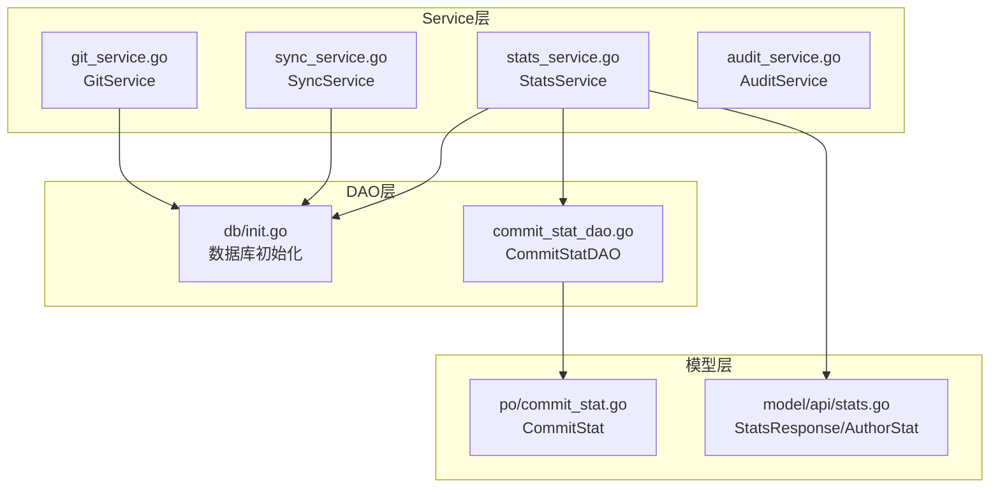
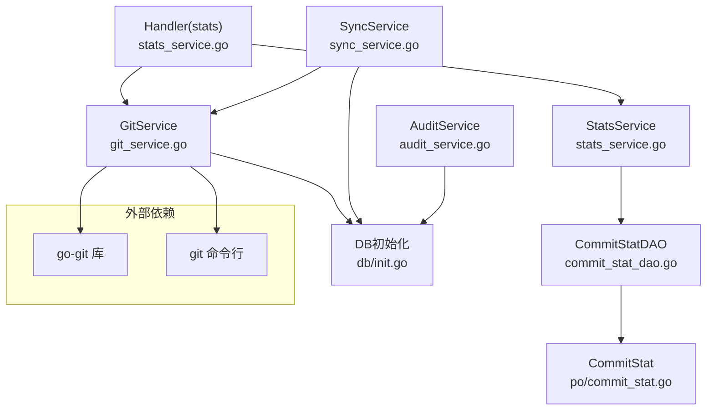
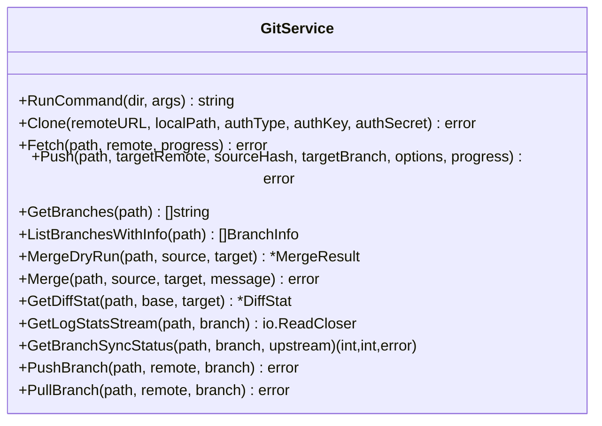
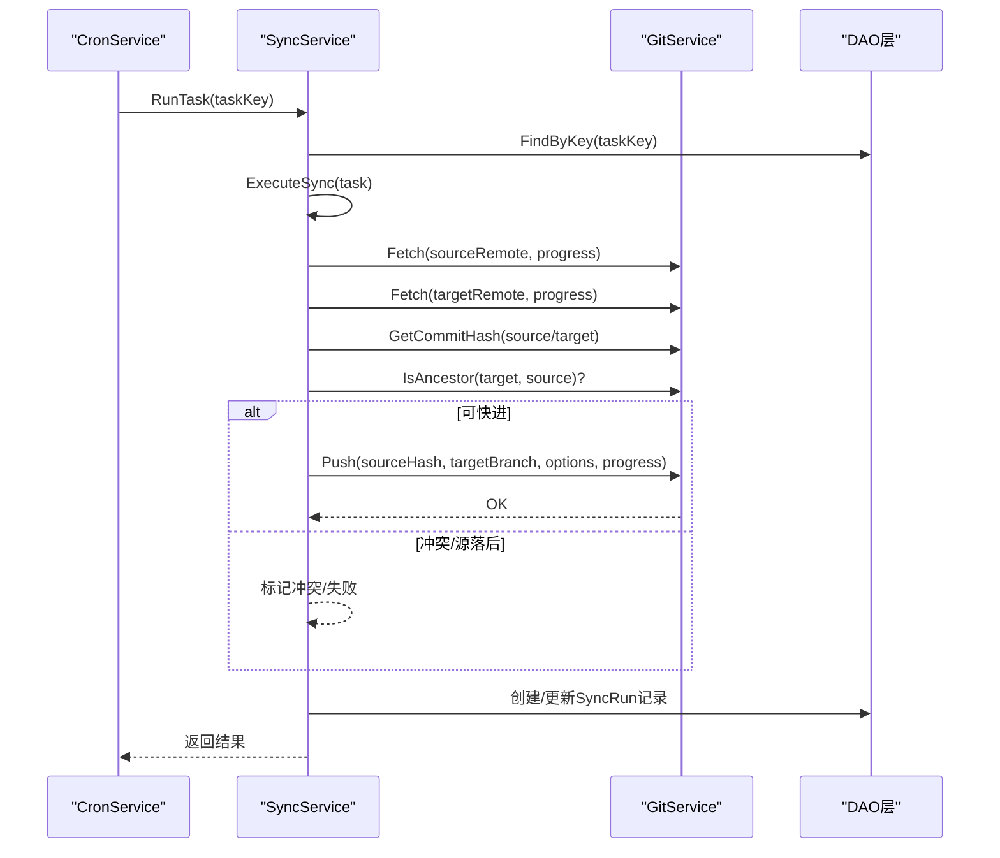
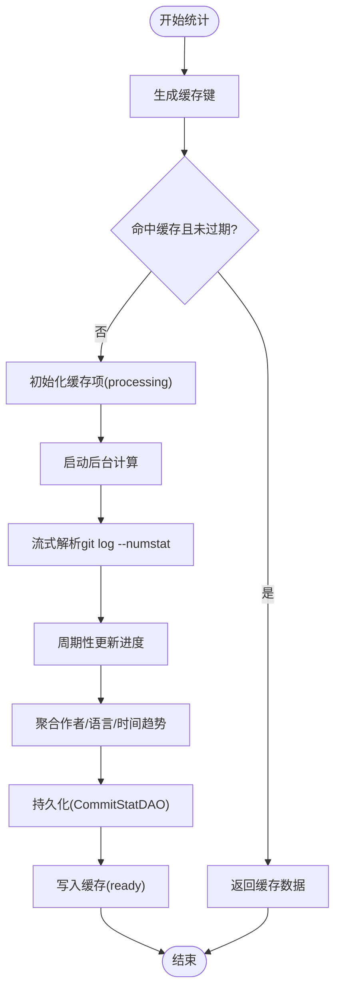
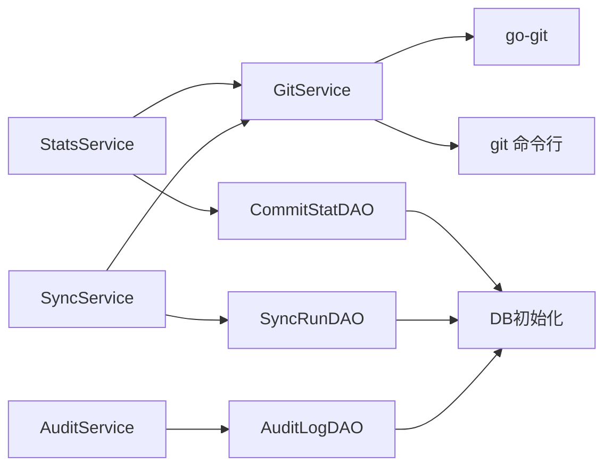
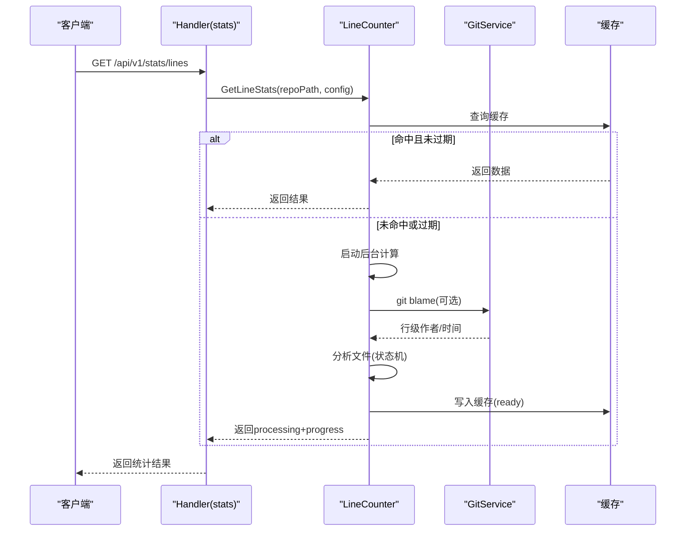

# Service层

<cite>
**本文引用的文件**
- [biz/service/git/git_service.go](file://biz/service/git/git_service.go)
- [biz/service/git/git_branch.go](file://biz/service/git/git_branch.go)
- [biz/service/git/git_merge.go](file://biz/service/git/git_merge.go)
- [biz/service/git/git_branch_sync.go](file://biz/service/git/git_branch_sync.go)
- [biz/service/sync/sync_service.go](file://biz/service/sync/sync_service.go)
- [biz/service/sync/cron_service.go](file://biz/service/sync/cron_service.go)
- [biz/service/stats/stats_service.go](file://biz/service/stats/stats_service.go)
- [biz/service/stats/language_config.go](file://biz/service/stats/language_config.go)
- [biz/service/stats/line_counter.go](file://biz/service/stats/line_counter.go)
- [biz/service/audit/audit_service.go](file://biz/service/audit/audit_service.go)
- [biz/dal/db/init.go](file://biz/dal/db/init.go)
- [biz/dal/db/commit_stat_dao.go](file://biz/dal/db/commit_stat_dao.go)
- [biz/model/po/commit_stat.go](file://biz/model/po/commit_stat.go)
- [biz/model/api/stats.go](file://biz/model/api/stats.go)
- [biz/handler/stats/stats_service.go](file://biz/handler/stats/stats_service.go)
</cite>

## 目录
1. [引言](#引言)
2. [项目结构](#项目结构)
3. [核心组件](#核心组件)
4. [架构总览](#架构总览)
5. [详细组件分析](#详细组件分析)
6. [依赖关系分析](#依赖关系分析)
7. [性能考量](#性能考量)
8. [故障排查指南](#故障排查指南)
9. [结论](#结论)
10. [附录](#附录)

## 引言
本文件系统性梳理Service层的设计与实现，聚焦以下目标：
- 作为业务逻辑核心，封装复杂流程、协调DAO与Git底层能力
- 全面解析Git服务、同步服务、统计分析服务、审计服务的实现细节
- 重点说明Git操作服务的分支管理、合并策略、同步机制
- 详解统计分析服务的代码行数统计算法、语言识别配置与缓存策略
- 提供Service层扩展接口、事务处理与异常管理最佳实践
- 给出典型业务流程图与时序图，并给出性能优化建议

## 项目结构
Service层位于biz/service目录下，按功能划分为git、sync、stats、audit四个子包；配合biz/dal/db的DAO层与biz/model下的PO/API模型，形成清晰的分层职责。

**图表来源**
- [biz/service/git/git_service.go](file://biz/service/git/git_service.go#L1-L1204)
- [biz/service/sync/sync_service.go](file://biz/service/sync/sync_service.go#L1-L263)
- [biz/service/stats/stats_service.go](file://biz/service/stats/stats_service.go#L1-L372)
- [biz/service/audit/audit_service.go](file://biz/service/audit/audit_service.go#L1-L51)
- [biz/dal/db/init.go](file://biz/dal/db/init.go#L1-L72)
- [biz/dal/db/commit_stat_dao.go](file://biz/dal/db/commit_stat_dao.go#L1-L66)
- [biz/model/po/commit_stat.go](file://biz/model/po/commit_stat.go#L1-L23)
- [biz/model/api/stats.go](file://biz/model/api/stats.go#L1-L50)

**章节来源**
- [biz/service/git/git_service.go](file://biz/service/git/git_service.go#L1-L1204)
- [biz/service/sync/sync_service.go](file://biz/service/sync/sync_service.go#L1-L263)
- [biz/service/stats/stats_service.go](file://biz/service/stats/stats_service.go#L1-L372)
- [biz/service/audit/audit_service.go](file://biz/service/audit/audit_service.go#L1-L51)
- [biz/dal/db/init.go](file://biz/dal/db/init.go#L1-L72)

## 核心组件
- GitService：封装Git仓库操作，包括克隆、拉取、推送、分支管理、合并、差异分析、提交日志、状态查询等
- SyncService：封装同步任务执行，负责源/目标仓库的fetch、fast-forward校验、冲突检测、推送
- StatsService：封装统计分析，包括作者贡献、时间趋势、语言分布等聚合统计，支持缓存与并发控制
- AuditService：封装审计日志记录，异步写入数据库
- DAO层：提供数据库连接、迁移、批量写入、去重更新等能力

**章节来源**
- [biz/service/git/git_service.go](file://biz/service/git/git_service.go#L27-L800)
- [biz/service/sync/sync_service.go](file://biz/service/sync/sync_service.go#L13-L263)
- [biz/service/stats/stats_service.go](file://biz/service/stats/stats_service.go#L39-L372)
- [biz/service/audit/audit_service.go](file://biz/service/audit/audit_service.go#L11-L51)
- [biz/dal/db/init.go](file://biz/dal/db/init.go#L16-L72)

## 架构总览
Service层通过统一的GitService与DAO层交互，向上提供稳定的业务能力；Handler层负责HTTP路由与参数绑定，调用Service层完成业务编排。

**图表来源**
- [biz/handler/stats/stats_service.go](file://biz/handler/stats/stats_service.go#L1-L360)
- [biz/service/stats/stats_service.go](file://biz/service/stats/stats_service.go#L1-L372)
- [biz/service/git/git_service.go](file://biz/service/git/git_service.go#L1-L1204)
- [biz/service/sync/sync_service.go](file://biz/service/sync/sync_service.go#L1-L263)
- [biz/service/audit/audit_service.go](file://biz/service/audit/audit_service.go#L1-L51)
- [biz/dal/db/commit_stat_dao.go](file://biz/dal/db/commit_stat_dao.go#L1-L66)
- [biz/model/po/commit_stat.go](file://biz/model/po/commit_stat.go#L1-L23)
- [biz/dal/db/init.go](file://biz/dal/db/init.go#L1-L72)

## 详细组件分析

### Git服务（GitService）
- 职责边界
  - 封装Git仓库操作，提供克隆、fetch/push、分支管理、合并、差异分析、提交日志、状态查询等
  - 支持HTTP/SSH认证自动探测与显式配置
  - 对外暴露统一的错误语义，避免上层感知底层差异
- 关键能力
  - 认证与远程检测：detectSSHAuth、getAuth
  - 仓库操作：Clone/Fetch/Push、PushWithAuth、TestRemoteConnection
  - 分支与标签：Create/Delete/Rename、Set/Get Description、GetBranches、ListBranchesWithInfo
  - 合并与差异：MergeDryRun/Merge、GetDiffStat/Files/RawDiff、GetPatch
  - 日志与状态：GetCommits、GetLogStats/Stream、GetStatus、Checkout/Commit/Reset
  - 工具方法：ResolveRevision、IsAncestor、GetBranchSyncStatus、PushBranch/PullBranch
- 设计要点
  - 对于go-git不支持的场景（如完整merge逻辑），回退到git命令行执行
  - 使用channelWriter将进度输出桥接到上层
  - 对SSH密钥加载、SSH Agent、常见key路径进行兼容处理
- 并发与线程安全
  - 未在GitService内维护共享状态，函数式设计降低竞态风险
  - 进度回调通过channel传递，需调用方正确消费

**图表来源**
- [biz/service/git/git_service.go](file://biz/service/git/git_service.go#L33-L800)
- [biz/service/git/git_branch.go](file://biz/service/git/git_branch.go#L13-L187)
- [biz/service/git/git_merge.go](file://biz/service/git/git_merge.go#L21-L263)
- [biz/service/git/git_branch_sync.go](file://biz/service/git/git_branch_sync.go#L13-L214)

**章节来源**
- [biz/service/git/git_service.go](file://biz/service/git/git_service.go#L27-L800)
- [biz/service/git/git_branch.go](file://biz/service/git/git_branch.go#L13-L187)
- [biz/service/git/git_merge.go](file://biz/service/git/git_merge.go#L21-L263)
- [biz/service/git/git_branch_sync.go](file://biz/service/git/git_branch_sync.go#L13-L214)

### 同步服务（SyncService + CronService）
- 职责边界
  - SyncService：执行具体同步任务，负责源/目标fetch、快进检查、冲突检测、推送
  - CronService：基于Cron表达式调度同步任务，动态增删任务条目
- 关键流程
  - 任务加载：根据任务Key查询任务配置
  - 源/目标fetch：支持本地源与远端源，自动选择认证方式
  - 快进校验：IsAncestor判断是否可快进；否则判定冲突或源落后
  - 推送：支持带选项的推送（如强制、裁剪）
  - 运行记录：创建SyncRun记录开始时间、状态、日志、错误信息
- 错误处理
  - 冲突：返回“conflict”状态
  - 源落后：返回错误提示
  - 其他错误：记录错误消息并标记失败

**图表来源**
- [biz/service/sync/sync_service.go](file://biz/service/sync/sync_service.go#L27-L249)
- [biz/service/sync/cron_service.go](file://biz/service/sync/cron_service.go#L35-L100)

**章节来源**
- [biz/service/sync/sync_service.go](file://biz/service/sync/sync_service.go#L13-L263)
- [biz/service/sync/cron_service.go](file://biz/service/sync/cron_service.go#L14-L101)

### 统计分析服务（StatsService + LineCounter + LanguageConfig）
- 职责边界
  - StatsService：面向作者维度的聚合统计，支持缓存、并发控制、后台增量同步
  - LineCounter：面向文件级的代码行统计，支持按作者/时间/分支过滤、缓存与异步计算
  - LanguageConfig：内置语言识别配置与排除规则
- 统计算法与缓存
  - StatsService
    - 缓存项：StatsCacheItem（状态、数据、错误、创建时间、进度）
    - 并发：LoadOrStore保证同一查询键仅一次计算
    - 增量同步：基于CommitStatDAO的latest commit time断点，批量upsert
  - LineCounter
    - 缓存项：LineCacheItem（状态、数据、错误、创建时间、进度）
    - 异步：启动goroutine后台计算，期间返回processing+progress
    - 过滤：支持作者、时间范围、分支、隐藏文件、排除目录/模式
    - 语言识别：基于扩展名映射，必要时回退到文件名（如Dockerfile）
- 数据模型
  - CommitStat：按提交维度存储增删行数，唯一索引(repo_id, commit_hash)用于upsert
  - StatsResponse/AuthorStat：对外API响应模型

**图表来源**
- [biz/service/stats/stats_service.go](file://biz/service/stats/stats_service.go#L52-L139)
- [biz/service/stats/line_counter.go](file://biz/service/stats/line_counter.go#L76-L151)
- [biz/dal/db/commit_stat_dao.go](file://biz/dal/db/commit_stat_dao.go#L26-L36)

**章节来源**
- [biz/service/stats/stats_service.go](file://biz/service/stats/stats_service.go#L23-L372)
- [biz/service/stats/line_counter.go](file://biz/service/stats/line_counter.go#L20-L583)
- [biz/service/stats/language_config.go](file://biz/service/stats/language_config.go#L18-L373)
- [biz/dal/db/commit_stat_dao.go](file://biz/dal/db/commit_stat_dao.go#L10-L66)
- [biz/model/po/commit_stat.go](file://biz/model/po/commit_stat.go#L9-L23)
- [biz/model/api/stats.go](file://biz/model/api/stats.go#L3-L50)

### 审计服务（AuditService）
- 职责边界
  - 记录操作审计日志，包含操作者、目标、详情、IP、UA等
  - 当前采用异步写入（go func）以提升吞吐
- 最佳实践
  - 若严格审计要求，可改为同步写入或引入队列
  - 建议在鉴权后填充实际操作人

**章节来源**
- [biz/service/audit/audit_service.go](file://biz/service/audit/audit_service.go#L11-L51)

## 依赖关系分析
- Service层内部耦合度低，各服务自包含所需DAO
- GitService依赖go-git与git命令行，对认证与远程检测有较强适配
- StatsService依赖GitService与CommitStatDAO，形成“增量采集+聚合”的闭环
- SyncService依赖GitService与DAO层，负责跨仓库同步编排
- DAO层通过GORM抽象数据库差异，提供批量upsert与分页查询

**图表来源**
- [biz/service/git/git_service.go](file://biz/service/git/git_service.go#L1-L1204)
- [biz/service/stats/stats_service.go](file://biz/service/stats/stats_service.go#L1-L372)
- [biz/service/sync/sync_service.go](file://biz/service/sync/sync_service.go#L1-L263)
- [biz/service/audit/audit_service.go](file://biz/service/audit/audit_service.go#L1-L51)
- [biz/dal/db/init.go](file://biz/dal/db/init.go#L1-L72)

**章节来源**
- [biz/service/git/git_service.go](file://biz/service/git/git_service.go#L1-L1204)
- [biz/service/sync/sync_service.go](file://biz/service/sync/sync_service.go#L1-L263)
- [biz/service/stats/stats_service.go](file://biz/service/stats/stats_service.go#L1-L372)
- [biz/service/audit/audit_service.go](file://biz/service/audit/audit_service.go#L1-L51)
- [biz/dal/db/init.go](file://biz/dal/db/init.go#L1-L72)

## 性能考量
- 统计分析
  - StatsService：使用git log --numstat流式解析，避免一次性载入全部数据；缓存1小时，LoadOrStore避免重复计算
  - LineCounter：后台异步计算，支持进度反馈；缓存1小时；大文件扫描增大bufio缓冲区
  - 批量写入：CommitStatDAO使用ON CONFLICT DO UPDATE批量upsert，减少往返
- 同步服务
  - 快进优先：先IsAncestor判断，避免不必要的冲突检测
  - 认证复用：detectSSHAuth与getAuth减少重复解析
- Git操作
  - 进度回调channelWriter，避免阻塞主流程
  - 对于go-git不支持的合并逻辑回退git命令行，确保兼容性

[本节为通用指导，无需列出具体文件来源]

## 故障排查指南
- 同步失败
  - 检查源/目标fetch是否成功，确认认证类型与凭据
  - 若提示“conflict”，确认是否非快进；若源落后，提示“source is behind”
- 统计未更新
  - 确认StatsService的断点（latest commit time）是否推进
  - 检查CommitStatDAO BatchSave是否报错（唯一索引冲突应走upsert）
- 语言识别问题
  - 检查文件扩展名是否在LanguageConfig中；Dockerfile/Makefile等特殊文件名需单独处理
- 审计缺失
  - 若严格审计，改为同步写入或引入队列；检查go func是否被提前退出

**章节来源**
- [biz/service/sync/sync_service.go](file://biz/service/sync/sync_service.go#L52-L74)
- [biz/service/stats/stats_service.go](file://biz/service/stats/stats_service.go#L52-L139)
- [biz/dal/db/commit_stat_dao.go](file://biz/dal/db/commit_stat_dao.go#L26-L36)
- [biz/service/stats/language_config.go](file://biz/service/stats/language_config.go#L286-L314)
- [biz/service/audit/audit_service.go](file://biz/service/audit/audit_service.go#L44-L50)

## 结论
Service层以GitService为核心，向上提供稳定、可扩展的业务能力；通过DAO层实现数据持久化与批量优化；通过Handler层完成HTTP编排。统计分析与同步服务分别采用缓存与断点增量策略，兼顾性能与准确性。建议在高并发与严格审计场景下进一步增强事务一致性与异步可靠性。

[本节为总结性内容，无需列出具体文件来源]

## 附录

### 业务流程示例：代码行统计（含作者/时间/分支过滤）

**图表来源**
- [biz/handler/stats/stats_service.go](file://biz/handler/stats/stats_service.go#L199-L253)
- [biz/service/stats/line_counter.go](file://biz/service/stats/line_counter.go#L76-L151)
- [biz/service/git/git_service.go](file://biz/service/git/git_service.go#L564-L576)