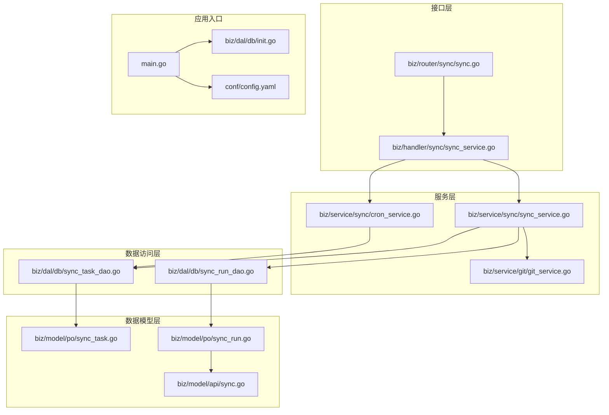
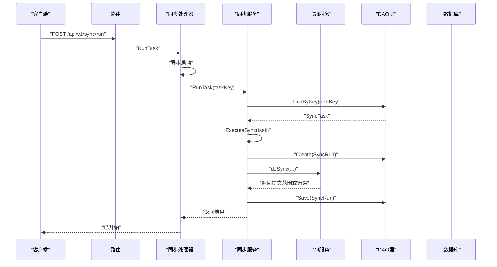
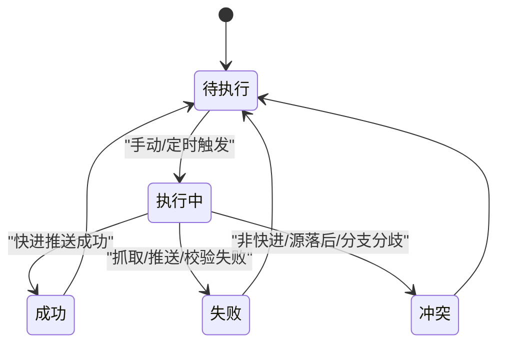
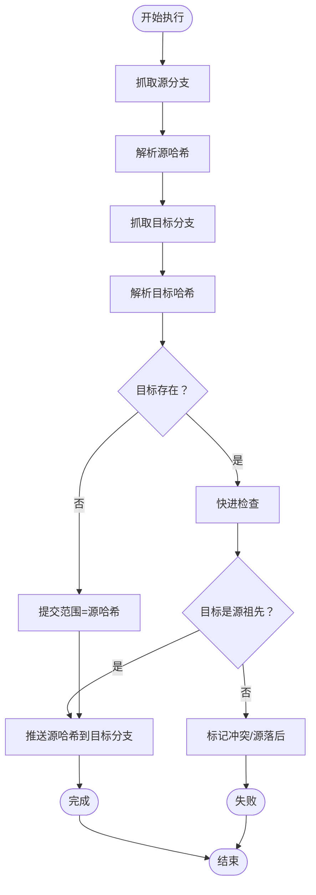
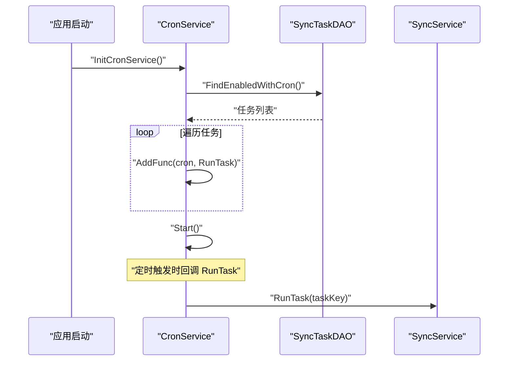
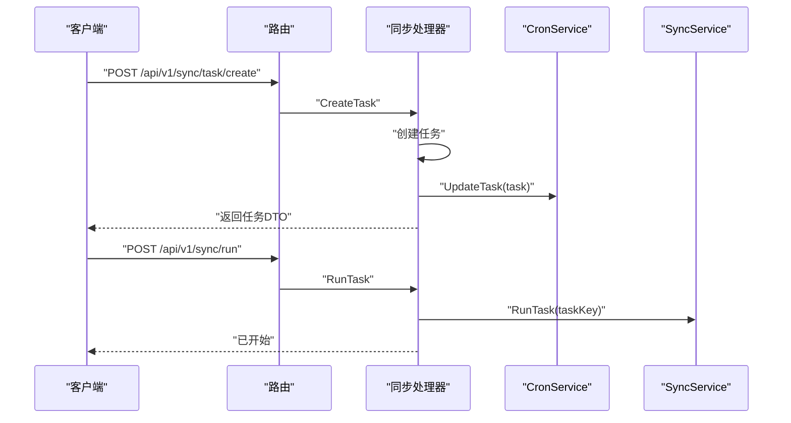
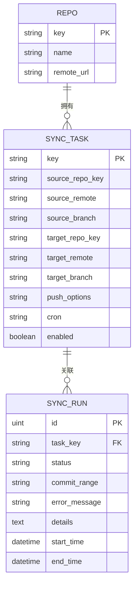
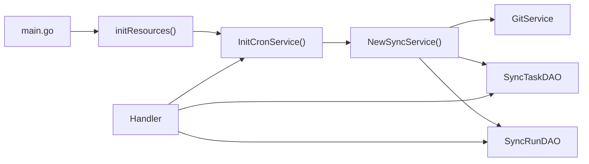

# 同步服务

<cite>
**本文引用的文件列表**
- [main.go](file://main.go)
- [conf/config.yaml](file://conf/config.yaml)
- [biz/dal/db/init.go](file://biz/dal/db/init.go)
- [biz/dal/db/sync_task_dao.go](file://biz/dal/db/sync_task_dao.go)
- [biz/dal/db/sync_run_dao.go](file://biz/dal/db/sync_run_dao.go)
- [biz/model/po/sync_task.go](file://biz/model/po/sync_task.go)
- [biz/model/po/sync_run.go](file://biz/model/po/sync_run.go)
- [biz/model/api/sync.go](file://biz/model/api/sync.go)
- [biz/service/sync/sync_service.go](file://biz/service/sync/sync_service.go)
- [biz/service/sync/cron_service.go](file://biz/service/sync/cron_service.go)
- [biz/service/git/git_service.go](file://biz/service/git/git_service.go)
- [biz/handler/sync/sync_service.go](file://biz/handler/sync/sync_service.go)
- [biz/router/sync/sync.go](file://biz/router/sync/sync.go)
</cite>

## 目录
1. [简介](#简介)
2. [项目结构](#项目结构)
3. [核心组件](#核心组件)
4. [架构总览](#架构总览)
5. [组件详解](#组件详解)
6. [依赖关系分析](#依赖关系分析)
7. [性能与并发](#性能与并发)
8. [故障排查指南](#故障排查指南)
9. [结论](#结论)

## 简介
本技术文档围绕“同步服务”模块，系统性阐述其整体架构设计与实现原理，重点覆盖以下方面：
- 同步任务的创建、执行、监控与状态管理
- 定时任务调度系统（基于 Cron 表达式）的实现机制与任务队列管理
- 同步服务如何协调 Git 操作、数据库更新与状态记录
- 同步任务的状态流转、重试机制与异常处理策略
- 配置管理、性能优化与并发控制机制
- 同步任务生命周期管理、监控指标与故障排查指南

## 项目结构
同步服务位于 biz/service/sync 与 biz/handler/sync 下，配合 biz/dal/db 的 DAO 层与 biz/model/po 的数据模型，形成清晰的分层架构：Handler 负责 HTTP 接口编排，Service 负责业务逻辑与调度，DAO 负责持久化，Model 定义数据结构，Git Service 提供底层 Git 操作能力。

图表来源
- [main.go](file://main.go#L115-L134)
- [biz/router/sync/sync.go](file://biz/router/sync/sync.go#L17-L40)
- [biz/handler/sync/sync_service.go](file://biz/handler/sync/sync_service.go#L1-L258)
- [biz/service/sync/sync_service.go](file://biz/service/sync/sync_service.go#L1-L263)
- [biz/service/sync/cron_service.go](file://biz/service/sync/cron_service.go#L1-L101)
- [biz/service/git/git_service.go](file://biz/service/git/git_service.go#L1-L1204)
- [biz/dal/db/sync_task_dao.go](file://biz/dal/db/sync_task_dao.go#L1-L67)
- [biz/dal/db/sync_run_dao.go](file://biz/dal/db/sync_run_dao.go#L1-L40)
- [biz/model/po/sync_task.go](file://biz/model/po/sync_task.go#L1-L29)
- [biz/model/po/sync_run.go](file://biz/model/po/sync_run.go#L1-L26)
- [biz/model/api/sync.go](file://biz/model/api/sync.go#L1-L41)
- [conf/config.yaml](file://conf/config.yaml#L1-L25)
- [biz/dal/db/init.go](file://biz/dal/db/init.go#L1-L72)

章节来源
- [main.go](file://main.go#L115-L134)
- [biz/router/sync/sync.go](file://biz/router/sync/sync.go#L17-L40)

## 核心组件
- Handler 层：提供 REST API，负责任务 CRUD、手动触发同步、查询历史等；异步执行同步任务，避免阻塞请求线程。
- Service 层：封装同步执行流程（抓取源/目标、比较快照、快进检查、推送），并维护每次执行的运行记录。
- CronService：基于 cron 库动态加载启用且带 Cron 表达式的任务，支持增删改后热更新。
- GitService：封装 Git 原生命令与 go-git 操作，统一认证、进度输出与错误处理。
- DAO 层：提供任务与运行记录的持久化能力，支持按仓库键批量查询、最新记录查询等。
- 数据模型：定义 SyncTask、SyncRun 及 DTO 映射，确保前后端交互与持久化一致。

章节来源
- [biz/handler/sync/sync_service.go](file://biz/handler/sync/sync_service.go#L1-L258)
- [biz/service/sync/sync_service.go](file://biz/service/sync/sync_service.go#L1-L263)
- [biz/service/sync/cron_service.go](file://biz/service/sync/cron_service.go#L1-L101)
- [biz/service/git/git_service.go](file://biz/service/git/git_service.go#L1-L1204)
- [biz/dal/db/sync_task_dao.go](file://biz/dal/db/sync_task_dao.go#L1-L67)
- [biz/dal/db/sync_run_dao.go](file://biz/dal/db/sync_run_dao.go#L1-L40)
- [biz/model/po/sync_task.go](file://biz/model/po/sync_task.go#L1-L29)
- [biz/model/po/sync_run.go](file://biz/model/po/sync_run.go#L1-L26)
- [biz/model/api/sync.go](file://biz/model/api/sync.go#L1-L41)

## 架构总览
同步服务采用“接口编排 + 业务执行 + 定时调度 + 数据持久化”的分层架构。入口在 main 中初始化配置、数据库与服务，随后启动 HTTP/RPC 服务。Handler 将请求转交给 Service，Service 再调用 GitService 执行 Git 操作，并通过 DAO 写入任务与运行记录。CronService 周期性扫描启用的任务并触发执行。

图表来源
- [biz/router/sync/sync.go](file://biz/router/sync/sync.go#L25-L36)
- [biz/handler/sync/sync_service.go](file://biz/handler/sync/sync_service.go#L147-L163)
- [biz/service/sync/sync_service.go](file://biz/service/sync/sync_service.go#L27-L74)
- [biz/dal/db/sync_task_dao.go](file://biz/dal/db/sync_task_dao.go#L31-L36)
- [biz/dal/db/sync_run_dao.go](file://biz/dal/db/sync_run_dao.go#L13-L19)
- [biz/service/git/git_service.go](file://biz/service/git/git_service.go#L138-L191)

## 组件详解

### 同步任务生命周期与状态管理
- 生命周期阶段：创建任务（含 Cron）、手动触发、定时触发、执行中、完成（成功/失败/冲突）、记录归档。
- 状态字段：成功、失败、冲突；失败时记录错误消息；冲突用于标识非快进或分支分歧场景。
- 运行记录：每次执行创建一条 SyncRun 记录，包含起止时间、提交范围、详情日志与错误信息。

图表来源
- [biz/model/po/sync_run.go](file://biz/model/po/sync_run.go#L9-L21)
- [biz/service/sync/sync_service.go](file://biz/service/sync/sync_service.go#L35-L74)

章节来源
- [biz/model/po/sync_run.go](file://biz/model/po/sync_run.go#L9-L21)
- [biz/service/sync/sync_service.go](file://biz/service/sync/sync_service.go#L35-L74)

### 同步执行流程与 Git 协作
- 抓取源与目标：根据远端名称与认证类型选择 Fetch 或 FetchWithAuth；本地源使用本地分支解析。
- 快照比对：获取源/目标哈希，计算提交范围；若目标不存在则视为新分支。
- 快进检查：判断目标是否为源祖先，否则判定为冲突或源落后。
- 推送：构造 RefSpec 并推送至目标分支，支持推送选项解析（如强制、裁剪、推送选项键值）。

图表来源
- [biz/service/sync/sync_service.go](file://biz/service/sync/sync_service.go#L85-L249)
- [biz/service/git/git_service.go](file://biz/service/git/git_service.go#L138-L191)
- [biz/service/git/git_service.go](file://biz/service/git/git_service.go#L292-L323)
- [biz/service/git/git_service.go](file://biz/service/git/git_service.go#L510-L538)

章节来源
- [biz/service/sync/sync_service.go](file://biz/service/sync/sync_service.go#L85-L249)
- [biz/service/git/git_service.go](file://biz/service/git/git_service.go#L138-L323)
- [biz/service/git/git_service.go](file://biz/service/git/git_service.go#L510-L538)

### 定时任务调度系统（Cron）
- 动态加载：启动时扫描启用且带 Cron 表达式的任务，注册到 cron 实例。
- 热更新：新增/修改任务时移除旧条目并重新注册；删除任务时清理对应条目。
- 并发安全：内部使用互斥锁保护 entries 映射，避免并发冲突。
- 触发执行：回调中直接调用同步服务的 RunTask，保证与手动触发一致的行为。

图表来源
- [biz/service/sync/cron_service.go](file://biz/service/sync/cron_service.go#L24-L33)
- [biz/service/sync/cron_service.go](file://biz/service/sync/cron_service.go#L35-L57)
- [biz/service/sync/cron_service.go](file://biz/service/sync/cron_service.go#L84-L100)
- [biz/dal/db/sync_task_dao.go](file://biz/dal/db/sync_task_dao.go#L62-L66)

章节来源
- [biz/service/sync/cron_service.go](file://biz/service/sync/cron_service.go#L1-L101)
- [biz/dal/db/sync_task_dao.go](file://biz/dal/db/sync_task_dao.go#L62-L66)

### Handler 编排与 API
- 任务管理：创建、更新、删除任务，变更后通知 CronService 更新调度。
- 手动执行：RunTask 异步触发；ExecuteSync 支持临时任务执行并返回任务键。
- 历史查询：按仓库键或全局查询最近运行记录，支持分页与关联任务信息。
- 删除历史：支持按 ID 删除运行记录。

图表来源
- [biz/router/sync/sync.go](file://biz/router/sync/sync.go#L25-L36)
- [biz/handler/sync/sync_service.go](file://biz/handler/sync/sync_service.go#L62-L81)
- [biz/handler/sync/sync_service.go](file://biz/handler/sync/sync_service.go#L147-L163)
- [biz/service/sync/cron_service.go](file://biz/service/sync/cron_service.go#L59-L72)

章节来源
- [biz/handler/sync/sync_service.go](file://biz/handler/sync/sync_service.go#L1-L258)
- [biz/router/sync/sync.go](file://biz/router/sync/sync.go#L17-L40)

### 数据模型与持久化
- SyncTask：任务定义，包含源/目标仓库键、远端与分支、推送选项、Cron 表达式与启用状态；关联仓库实体。
- SyncRun：运行记录，包含任务键、状态、提交范围、错误消息、详情日志与起止时间；关联任务实体。
- DAO：提供任务与运行记录的创建、查询、保存、删除与统计方法；支持按仓库键批量查询与最新记录查询。
- DTO：将运行记录映射为对外 API 结构，包含任务信息。

图表来源
- [biz/model/po/sync_task.go](file://biz/model/po/sync_task.go#L7-L24)
- [biz/model/po/sync_run.go](file://biz/model/po/sync_run.go#L9-L21)
- [biz/dal/db/sync_task_dao.go](file://biz/dal/db/sync_task_dao.go#L17-L66)
- [biz/dal/db/sync_run_dao.go](file://biz/dal/db/sync_run_dao.go#L21-L35)

章节来源
- [biz/model/po/sync_task.go](file://biz/model/po/sync_task.go#L1-L29)
- [biz/model/po/sync_run.go](file://biz/model/po/sync_run.go#L1-L26)
- [biz/dal/db/sync_task_dao.go](file://biz/dal/db/sync_task_dao.go#L1-L67)
- [biz/dal/db/sync_run_dao.go](file://biz/dal/db/sync_run_dao.go#L1-L40)
- [biz/model/api/sync.go](file://biz/model/api/sync.go#L1-L41)

## 依赖关系分析
- 入口依赖：main 在初始化资源时调用 sync.InitCronService，确保 CronService 启动并加载任务。
- Handler 依赖：Handler 依赖 DAO 与 CronService，用于任务管理与触发；同时依赖审计服务记录操作。
- Service 依赖：SyncService 依赖 GitService 与 DAO；CronService 依赖 DAO 与 SyncService。
- GitService 依赖：封装 go-git 与原生命令，统一认证与进度输出。

图表来源
- [main.go](file://main.go#L115-L134)
- [biz/service/sync/cron_service.go](file://biz/service/sync/cron_service.go#L24-L33)
- [biz/service/sync/sync_service.go](file://biz/service/sync/sync_service.go#L19-L25)
- [biz/handler/sync/sync_service.go](file://biz/handler/sync/sync_service.go#L1-L258)

章节来源
- [main.go](file://main.go#L115-L134)
- [biz/service/sync/cron_service.go](file://biz/service/sync/cron_service.go#L1-L101)
- [biz/service/sync/sync_service.go](file://biz/service/sync/sync_service.go#L1-L263)
- [biz/handler/sync/sync_service.go](file://biz/handler/sync/sync_service.go#L1-L258)

## 性能与并发
- 异步执行：Handler 的 RunTask 与 ExecuteSync 使用 goroutine 异步触发，避免阻塞请求线程，提升吞吐。
- 并发安全：CronService 使用互斥锁保护 entries 映射，防止并发更新导致的竞态。
- Git 进度输出：通过 io.Writer 将 Git 输出写入日志，便于实时监控与问题定位。
- 数据库连接：GORM 自动管理连接池，建议在高并发场景下结合数据库连接池参数进行调优。
- 配置管理：通过 conf/config.yaml 与 pkg/configs 提供统一配置入口，支持 SQLite/MySQL/Postgres 切换。

章节来源
- [biz/handler/sync/sync_service.go](file://biz/handler/sync/sync_service.go#L156-L163)
- [biz/handler/sync/sync_service.go](file://biz/handler/sync/sync_service.go#L193-L199)
- [biz/service/sync/cron_service.go](file://biz/service/sync/cron_service.go#L14-L20)
- [biz/service/git/git_service.go](file://biz/service/git/git_service.go#L251-L262)
- [conf/config.yaml](file://conf/config.yaml#L1-L25)
- [biz/dal/db/init.go](file://biz/dal/db/init.go#L18-L71)

## 故障排查指南
- 常见错误类型
  - 冲突：当目标不是源祖先或源落后于目标，会返回冲突状态，需人工介入合并或调整策略。
  - 失败：抓取/推送/快进检查失败，通常由认证、网络或权限问题引起。
  - 源落后：源分支落后于目标，属于非快进场景，需明确处理策略。
- 日志与诊断
  - 运行记录包含详细日志与错误消息，可通过历史接口查询。
  - GitService 的进度输出会写入日志，便于定位具体步骤。
- 建议排查步骤
  - 检查任务配置（源/目标远端、分支、推送选项、Cron 表达式）。
  - 校验认证方式（HTTP Basic 或 SSH），确认密钥路径与权限。
  - 查看最近运行记录与错误消息，定位失败步骤。
  - 如为冲突，评估是否需要强制推送或回滚策略。

章节来源
- [biz/service/sync/sync_service.go](file://biz/service/sync/sync_service.go#L58-L73)
- [biz/service/sync/sync_service.go](file://biz/service/sync/sync_service.go#L209-L218)
- [biz/dal/db/sync_run_dao.go](file://biz/dal/db/sync_run_dao.go#L21-L35)

## 结论
同步服务以清晰的分层架构实现了从任务管理、定时调度到 Git 操作与持久化的完整闭环。通过异步执行与并发安全设计，兼顾了易用性与可靠性；借助统一的日志与运行记录，提供了良好的可观测性与可维护性。建议在生产环境中结合数据库连接池、日志轮转与告警策略进一步优化稳定性与性能。