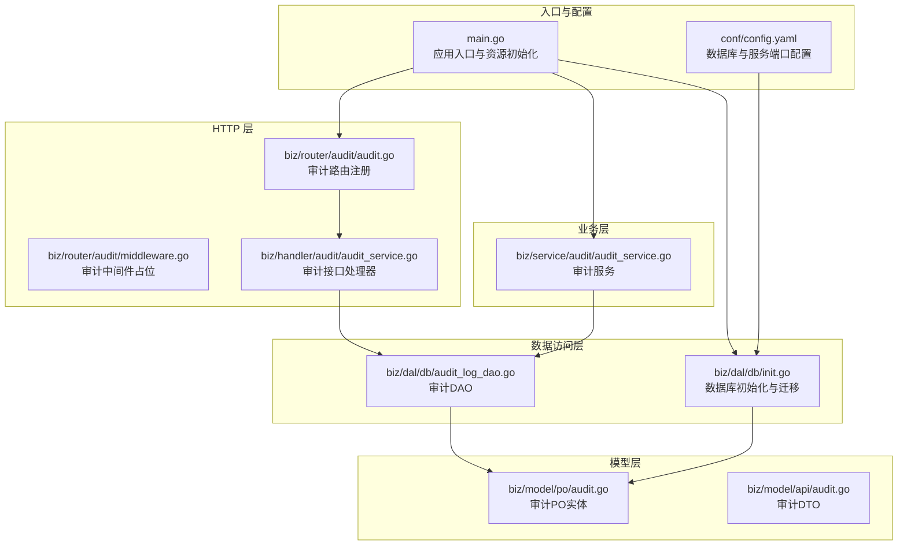
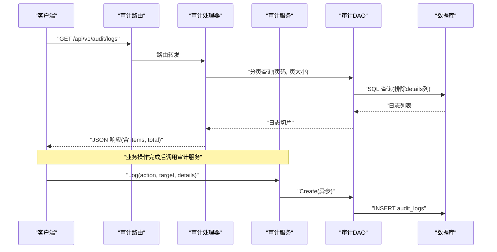
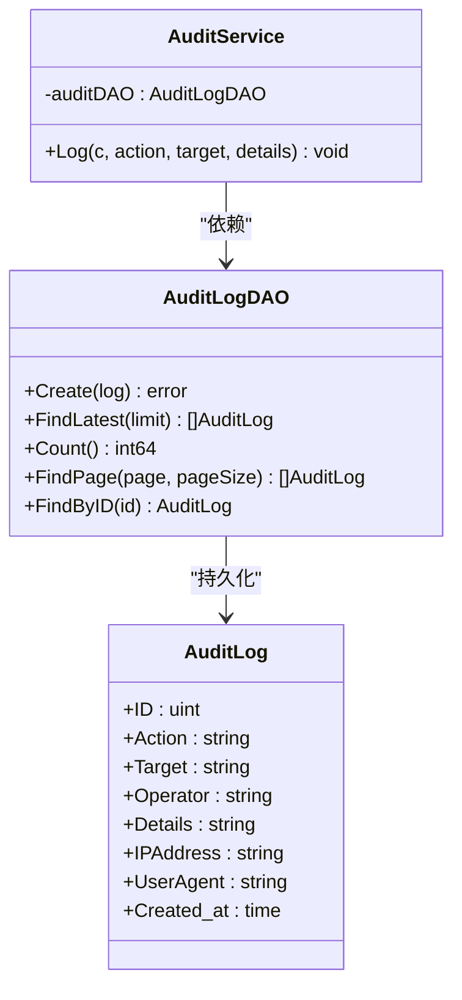
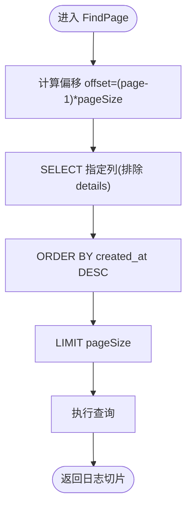
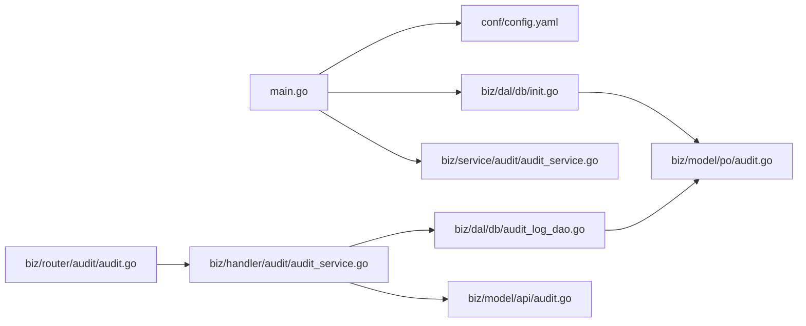

# 审计服务

<cite>
**本文引用的文件**
- [main.go](file://main.go)
- [biz/service/audit/audit_service.go](file://biz/service/audit/audit_service.go)
- [biz/handler/audit/audit_service.go](file://biz/handler/audit/audit_service.go)
- [biz/router/audit/audit.go](file://biz/router/audit/audit.go)
- [biz/router/audit/middleware.go](file://biz/router/audit/middleware.go)
- [biz/dal/db/audit_log_dao.go](file://biz/dal/db/audit_log_dao.go)
- [biz/dal/db/init.go](file://biz/dal/db/init.go)
- [biz/model/po/audit.go](file://biz/model/po/audit.go)
- [biz/model/api/audit.go](file://biz/model/api/audit.go)
- [conf/config.yaml](file://conf/config.yaml)
- [biz/handler/branch/branch_service.go](file://biz/handler/branch/branch_service.go)
- [biz/handler/repo/repo_service.go](file://biz/handler/repo/repo_service.go)
- [biz/handler/sync/sync_service.go](file://biz/handler/sync/sync_service.go)
- [biz/handler/system/system_service.go](file://biz/handler/system/system_service.go)
</cite>

## 目录
1. [简介](#简介)
2. [项目结构](#项目结构)
3. [核心组件](#核心组件)
4. [架构总览](#架构总览)
5. [组件详解](#组件详解)
6. [依赖关系分析](#依赖关系分析)
7. [性能与扩展](#性能与扩展)
8. [故障排查指南](#故障排查指南)
9. [结论](#结论)
10. [附录](#附录)

## 简介
本技术文档围绕审计服务展开，系统化阐述其设计架构与实现原理，覆盖以下方面：
- 操作日志的记录、存储与查询机制
- 审计日志的数据结构设计（操作类型、时间戳、用户信息、详细内容）
- 审计服务与业务逻辑的集成方式，确保关键操作被完整记录
- 权限控制、访问限制与安全保护机制现状与建议
- 审计报表生成、数据分析与合规性检查能力现状与建议
- 性能优化、日志轮转与存储策略
- 备份恢复、长期保存与隐私保护措施

## 项目结构
审计服务在当前代码库中采用分层架构：HTTP 层负责路由与请求响应；业务层封装审计服务；DAO 层负责持久化；模型层定义数据结构；配置层提供数据库与服务端口等参数。

图表来源
- [main.go](file://main.go#L115-L134)
- [biz/router/audit/audit.go](file://biz/router/audit/audit.go#L17-L31)
- [biz/handler/audit/audit_service.go](file://biz/handler/audit/audit_service.go#L16-L52)
- [biz/service/audit/audit_service.go](file://biz/service/audit/audit_service.go#L11-L21)
- [biz/dal/db/audit_log_dao.go](file://biz/dal/db/audit_log_dao.go#L7-L45)
- [biz/dal/db/init.go](file://biz/dal/db/init.go#L18-L71)
- [biz/model/po/audit.go](file://biz/model/po/audit.go#L7-L20)
- [biz/model/api/audit.go](file://biz/model/api/audit.go#L9-L31)
- [conf/config.yaml](file://conf/config.yaml#L1-L25)

章节来源
- [main.go](file://main.go#L115-L134)
- [biz/router/audit/audit.go](file://biz/router/audit/audit.go#L17-L31)
- [biz/dal/db/init.go](file://biz/dal/db/init.go#L18-L71)
- [conf/config.yaml](file://conf/config.yaml#L1-L25)

## 核心组件
- 审计服务（业务层）：提供统一的日志记录入口，负责从请求上下文中提取客户端 IP、User-Agent，并将操作类型、目标标识、详情（JSON）与网络信息写入持久化层。
- 审计DAO（数据访问层）：封装审计日志的创建、分页查询、总数统计、按ID查询与最近条目查询。
- 审计PO（模型层）：定义审计日志的表结构与字段，含索引字段以支持查询性能。
- 审计DTO（模型层）：用于对外返回的审计日志结构，包含必要字段与时间戳。
- 审计HTTP处理器（HTTP层）：提供审计日志列表与单条查询接口，调用DAO并转换为DTO。
- 审计路由（HTTP层）：注册审计相关的 GET 接口。
- 数据库初始化与迁移：根据配置选择数据库类型，自动迁移审计表。

章节来源
- [biz/service/audit/audit_service.go](file://biz/service/audit/audit_service.go#L11-L50)
- [biz/dal/db/audit_log_dao.go](file://biz/dal/db/audit_log_dao.go#L13-L45)
- [biz/model/po/audit.go](file://biz/model/po/audit.go#L7-L20)
- [biz/model/api/audit.go](file://biz/model/api/audit.go#L9-L31)
- [biz/handler/audit/audit_service.go](file://biz/handler/audit/audit_service.go#L16-L76)
- [biz/router/audit/audit.go](file://biz/router/audit/audit.go#L17-L31)
- [biz/dal/db/init.go](file://biz/dal/db/init.go#L54-L71)

## 架构总览
审计服务整体流程如下：业务处理器在执行关键操作后调用审计服务，审计服务异步写入数据库；HTTP 层通过路由暴露查询接口，DAO 提供分页与统计能力，模型层负责数据结构映射。

图表来源
- [biz/router/audit/audit.go](file://biz/router/audit/audit.go#L25-L28)
- [biz/handler/audit/audit_service.go](file://biz/handler/audit/audit_service.go#L18-L51)
- [biz/service/audit/audit_service.go](file://biz/service/audit/audit_service.go#L24-L50)
- [biz/dal/db/audit_log_dao.go](file://biz/dal/db/audit_log_dao.go#L13-L39)

## 组件详解

### 审计服务（业务层）
- 职责：接收业务操作上下文，提取客户端 IP 与 UA，构造审计日志对象，调用 DAO 异步写入。
- 关键点：
  - 异步写入：通过 goroutine 避免阻塞主业务流程。
  - 操作类型与目标：由业务侧传入，如“CREATE_BRANCH”、“REPO:KEY”。
  - 详情字段：以 JSON 字符串形式存储，便于后续解析与分析。
  - 用户标识：当前固定为“system”，未来可替换为真实用户标识（鉴权完善后）。

图表来源
- [biz/service/audit/audit_service.go](file://biz/service/audit/audit_service.go#L11-L21)
- [biz/dal/db/audit_log_dao.go](file://biz/dal/db/audit_log_dao.go#L7-L15)
- [biz/model/po/audit.go](file://biz/model/po/audit.go#L7-L20)

章节来源
- [biz/service/audit/audit_service.go](file://biz/service/audit/audit_service.go#L23-L50)

### 审计DAO（数据访问层）
- 职责：封装审计日志的 CRUD 与统计查询。
- 关键点：
  - 分页查询时排除“details”列，降低网络与内存开销。
  - 支持按 ID 查询与统计总数。
  - 最近条目查询用于监控或仪表盘展示。

图表来源
- [biz/dal/db/audit_log_dao.go](file://biz/dal/db/audit_log_dao.go#L29-L39)

章节来源
- [biz/dal/db/audit_log_dao.go](file://biz/dal/db/audit_log_dao.go#L13-L45)

### 审计模型（PO/DTO）
- PO（持久化对象）：定义审计日志的表结构与字段，含索引字段以提升查询效率。
- DTO（对外传输对象）：用于接口返回，包含必要字段与时间戳。

章节来源
- [biz/model/po/audit.go](file://biz/model/po/audit.go#L7-L20)
- [biz/model/api/audit.go](file://biz/model/api/audit.go#L9-L31)

### 审计HTTP处理器与路由
- 路由：注册“/api/v1/audit/logs”（分页列表）与“/api/v1/audit/log”（按ID查询）两个 GET 接口。
- 处理器：读取分页参数，调用 DAO 获取数据，转换为 DTO 并返回 JSON 结果；错误处理分别返回内部错误、参数错误与未找到。

章节来源
- [biz/router/audit/audit.go](file://biz/router/audit/audit.go#L17-L31)
- [biz/handler/audit/audit_service.go](file://biz/handler/audit/audit_service.go#L16-L76)

### 业务集成示例
审计服务已嵌入多个业务处理器的关键操作中，示例如下：
- 分支管理：创建、删除、更新、检出、推送、拉取、合并冲突与成功等场景均记录审计日志。
- 仓库管理：新增、更新、删除、抓取等场景记录审计日志。
- 同步任务：创建、更新、删除、同步与手动触发等场景记录审计日志。
- 系统提交变更：记录变更提交相关操作。

章节来源
- [biz/handler/branch/branch_service.go](file://biz/handler/branch/branch_service.go#L118-L122)
- [biz/handler/branch/branch_service.go](file://biz/handler/branch/branch_service.go#L150-L154)
- [biz/handler/branch/branch_service.go](file://biz/handler/branch/branch_service.go#L196-L201)
- [biz/handler/branch/branch_service.go](file://biz/handler/branch/branch_service.go#L228-L231)
- [biz/handler/branch/branch_service.go](file://biz/handler/branch/branch_service.go#L267-L271)
- [biz/handler/repo/repo_service.go](file://biz/handler/repo/repo_service.go#L114-L115)
- [biz/handler/repo/repo_service.go](file://biz/handler/repo/repo_service.go#L201-L202)
- [biz/handler/repo/repo_service.go](file://biz/handler/repo/repo_service.go#L234-L235)
- [biz/handler/sync/sync_service.go](file://biz/handler/sync/sync_service.go#L78-L78)
- [biz/handler/sync/sync_service.go](file://biz/handler/sync/sync_service.go#L116-L116)
- [biz/handler/sync/sync_service.go](file://biz/handler/sync/sync_service.go#L141-L141)
- [biz/handler/sync/sync_service.go](file://biz/handler/sync/sync_service.go#L160-L160)
- [biz/handler/sync/sync_service.go](file://biz/handler/sync/sync_service.go#L197-L197)
- [biz/handler/system/system_service.go](file://biz/handler/system/system_service.go#L261-L261)

## 依赖关系分析
- 应用入口负责加载配置、初始化数据库与审计服务，并注册路由。
- 审计服务依赖 DAO 进行持久化；DAO 依赖 GORM 对数据库进行操作。
- 审计处理器依赖 DAO 与 DTO；路由依赖处理器。
- 数据库初始化会自动迁移审计表，确保表存在。

图表来源
- [main.go](file://main.go#L115-L134)
- [biz/router/audit/audit.go](file://biz/router/audit/audit.go#L17-L31)
- [biz/handler/audit/audit_service.go](file://biz/handler/audit/audit_service.go#L16-L52)
- [biz/service/audit/audit_service.go](file://biz/service/audit/audit_service.go#L11-L21)
- [biz/dal/db/audit_log_dao.go](file://biz/dal/db/audit_log_dao.go#L7-L15)
- [biz/model/po/audit.go](file://biz/model/po/audit.go#L7-L20)
- [biz/model/api/audit.go](file://biz/model/api/audit.go#L9-L31)
- [biz/dal/db/init.go](file://biz/dal/db/init.go#L54-L71)

章节来源
- [main.go](file://main.go#L115-L134)
- [biz/dal/db/init.go](file://biz/dal/db/init.go#L54-L71)

## 性能与扩展
- 列裁剪与分页：DAO 在列表查询时仅 SELECT 必要字段，避免传输大字段（如 details），显著降低网络与序列化成本。
- 异步写入：审计服务将持久化放入 goroutine，避免阻塞业务主流程，提高吞吐。
- 索引设计：PO 中对 Action 与 Target 字段建立索引，有利于按操作类型与目标快速检索。
- 数据库类型：支持 SQLite、MySQL、Postgres，可根据部署环境选择合适类型；SQLite 适合开发与小规模场景，MySQL/Postgres 更适合生产高并发。
- 扩展建议：
  - 引入批量写入队列（如消息队列）以进一步削峰填谷。
  - 对高频操作增加采样策略，降低审计日志量。
  - 引入压缩与归档策略，减少热数据占用。
  - 增加只读副本与分库分表，支撑大规模审计数据查询。

章节来源
- [biz/dal/db/audit_log_dao.go](file://biz/dal/db/audit_log_dao.go#L29-L39)
- [biz/service/audit/audit_service.go](file://biz/service/audit/audit_service.go#L47-L50)
- [biz/model/po/audit.go](file://biz/model/po/audit.go#L10-L11)
- [conf/config.yaml](file://conf/config.yaml#L7-L19)

## 故障排查指南
- 审计接口返回内部错误：检查 DAO 查询是否异常，确认数据库连接与表是否存在。
- 审计接口返回参数错误或未找到：检查请求参数（如 id）是否正确。
- 审计日志缺失：确认业务侧是否调用了审计服务；检查审计服务异步写入是否发生异常。
- 数据库迁移失败：检查配置文件中的数据库类型与连接参数，确保具备相应权限。
- 性能问题：关注列表接口是否携带大量 details，确认是否命中索引；评估分页大小与并发。

章节来源
- [biz/handler/audit/audit_service.go](file://biz/handler/audit/audit_service.go#L30-L33)
- [biz/handler/audit/audit_service.go](file://biz/handler/audit/audit_service.go#L58-L75)
- [biz/dal/db/init.go](file://biz/dal/db/init.go#L54-L71)

## 结论
当前审计服务已形成清晰的分层架构，实现了对关键业务操作的记录与查询能力。通过异步写入与列裁剪优化，兼顾了性能与可观测性。建议在后续版本中完善鉴权与用户标识、引入更完善的权限控制与安全保护、增强报表与合规检查能力，并结合实际负载引入队列、压缩与归档等策略，以满足生产环境的高可用与合规要求。

## 附录

### 审计日志数据结构设计
- 字段说明
  - 操作类型（Action）：如“CREATE_BRANCH”、“REPO:KEY”等，用于标识操作类别与目标。
  - 时间戳（Created_at）：由 ORM 自动生成，用于排序与统计。
  - 操作者（Operator）：当前为“system”，建议替换为真实用户标识。
  - 详情（Details）：JSON 字符串，记录变更或操作细节。
  - IP 地址（IPAddress）与 User-Agent（UserAgent）：记录来源信息，辅助溯源与风控。
- 设计要点
  - 使用索引字段提升查询效率。
  - 列裁剪避免传输冗余字段。
  - 异步写入保证业务性能。

章节来源
- [biz/model/po/audit.go](file://biz/model/po/audit.go#L7-L20)
- [biz/model/api/audit.go](file://biz/model/api/audit.go#L9-L31)
- [biz/dal/db/audit_log_dao.go](file://biz/dal/db/audit_log_dao.go#L29-L39)

### 与业务逻辑的集成方式
- 在每个关键业务操作之后调用审计服务，传入操作类型、目标标识与详情对象。
- 详情对象建议包含最小必要信息，避免敏感数据泄露。

章节来源
- [biz/handler/branch/branch_service.go](file://biz/handler/branch/branch_service.go#L118-L122)
- [biz/handler/repo/repo_service.go](file://biz/handler/repo/repo_service.go#L114-L115)
- [biz/handler/sync/sync_service.go](file://biz/handler/sync/sync_service.go#L78-L78)

### 权限控制、访问限制与安全保护
- 当前现状
  - 审计接口未绑定任何中间件，处于开放状态。
  - 审计日志中包含 IP 与 UA，可用于溯源但需注意隐私。
- 建议
  - 在审计路由上增加鉴权与白名单中间件。
  - 对敏感字段进行脱敏或限制导出范围。
  - 引入审计日志的访问审计与操作审批流程。

章节来源
- [biz/router/audit/middleware.go](file://biz/router/audit/middleware.go#L9-L37)
- [biz/model/po/audit.go](file://biz/model/po/audit.go#L13-L15)

### 报表生成、数据分析与合规性检查
- 当前现状
  - 提供基础分页查询与总数统计，暂无内置报表与分析接口。
- 建议
  - 新增聚合查询接口（按时间、操作类型、目标等维度统计）。
  - 提供导出能力（CSV/Excel），支持合规性检查。
  - 引入规则引擎，对异常操作进行告警与阻断。

章节来源
- [biz/handler/audit/audit_service.go](file://biz/handler/audit/audit_service.go#L18-L51)
- [biz/dal/db/audit_log_dao.go](file://biz/dal/db/audit_log_dao.go#L23-L27)

### 性能优化、日志轮转与存储策略
- 已有优化
  - 列裁剪与分页。
  - 异步写入。
- 建议
  - 引入日志轮转与压缩，定期归档历史数据。
  - 对高频操作进行采样或降噪。
  - 根据业务峰值调整数据库连接池与索引策略。

章节来源
- [biz/dal/db/audit_log_dao.go](file://biz/dal/db/audit_log_dao.go#L29-L39)
- [biz/service/audit/audit_service.go](file://biz/service/audit/audit_service.go#L47-L50)

### 备份恢复、长期保存与隐私保护
- 备份恢复
  - 针对所选数据库类型制定备份计划（增量/全量）。
  - 测试恢复流程，确保可回滚至指定时间点。
- 长期保存
  - 将历史审计数据迁移到低成本存储（冷存储）。
  - 建立生命周期管理策略，按法规要求保留与销毁。
- 隐私保护
  - 对详情字段进行脱敏处理，避免敏感信息外泄。
  - 严格控制审计日志的访问权限与最小可见原则。

章节来源
- [conf/config.yaml](file://conf/config.yaml#L7-L19)
- [biz/model/po/audit.go](file://biz/model/po/audit.go#L13-L15)