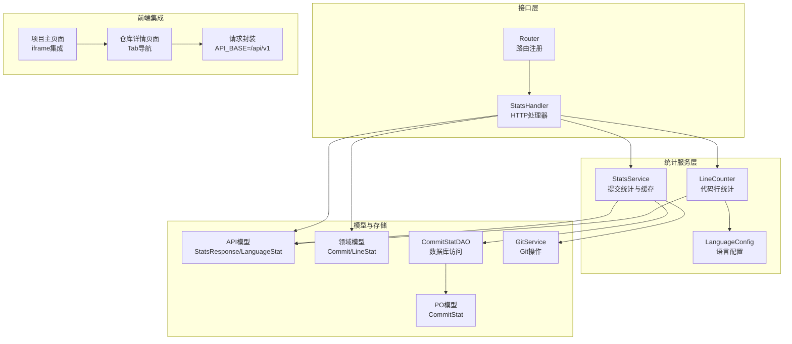
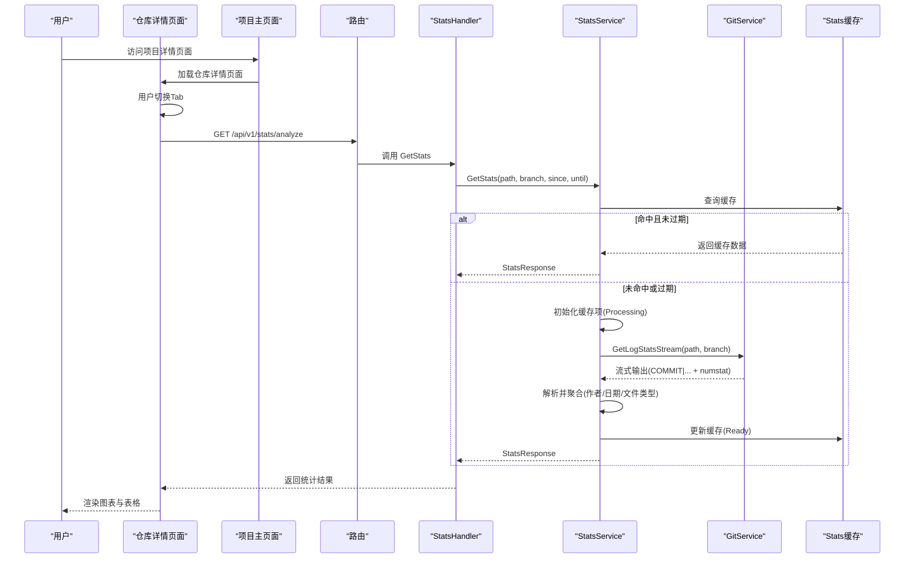
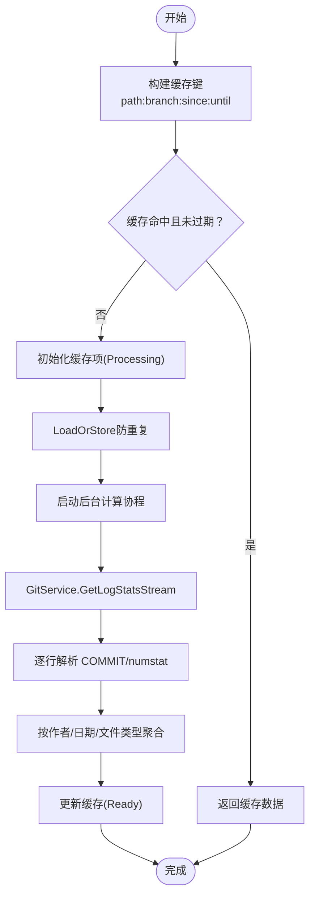
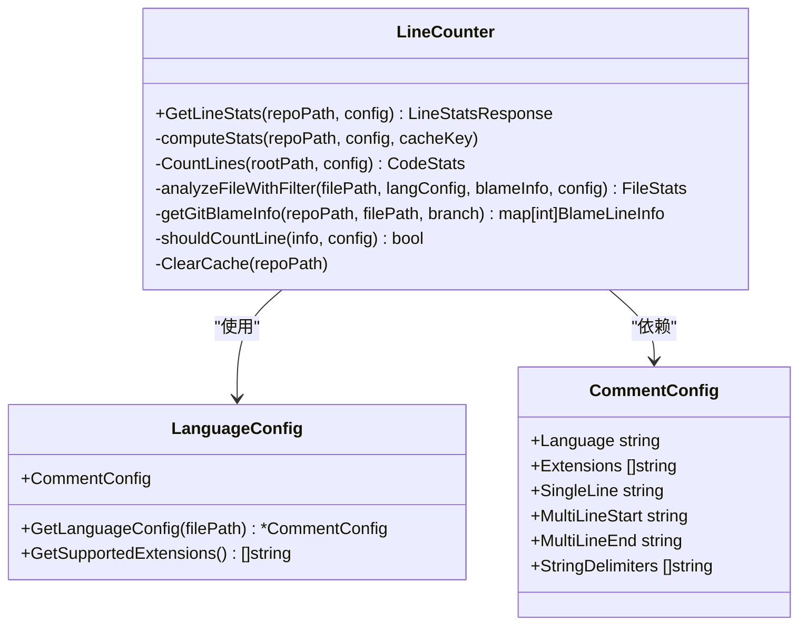
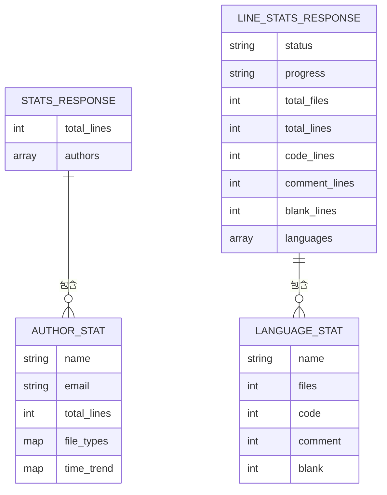
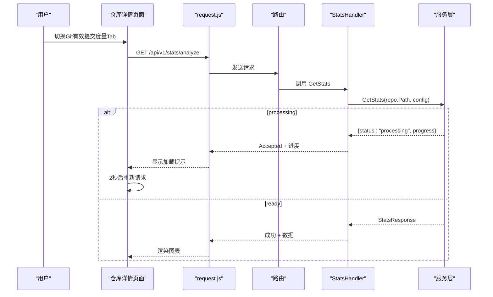
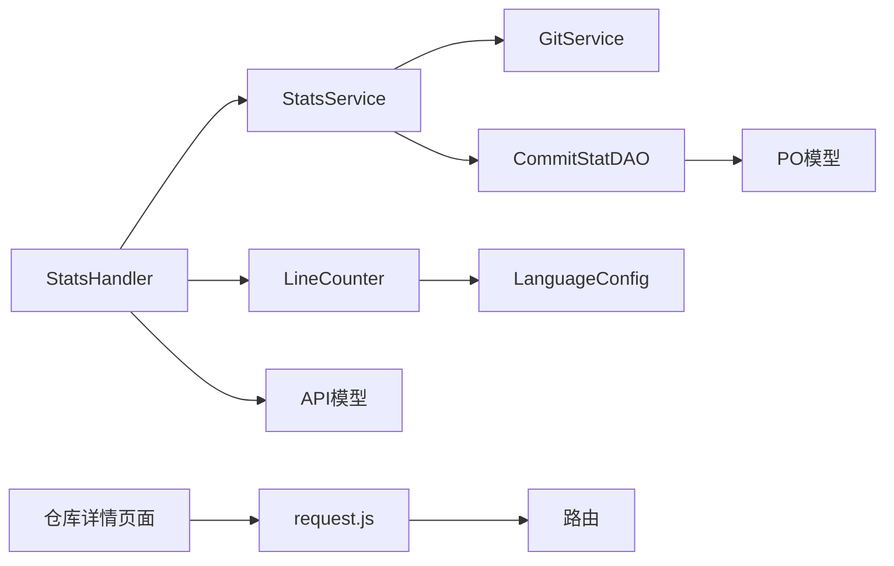

# 统计分析服务

<cite>
**本文档引用的文件**
- [biz/service/stats/stats_service.go](file://biz/service/stats/stats_service.go)
- [biz/service/stats/line_counter.go](file://biz/service/stats/line_counter.go)
- [biz/service/stats/language_config.go](file://biz/service/stats/language_config.go)
- [biz/handler/stats/stats_service.go](file://biz/handler/stats/stats_service.go)
- [biz/router/stats/stats.go](file://biz/router/stats/stats.go)
- [biz/model/api/stats.go](file://biz/model/api/stats.go)
- [biz/model/domain/stats.go](file://biz/model/domain/stats.go)
- [biz/dal/db/commit_stat_dao.go](file://biz/dal/db/commit_stat_dao.go)
- [biz/model/po/commit_stat.go](file://biz/model/po/commit_stat.go)
- [biz/service/git/git_service.go](file://biz/service/git/git_service.go)
- [public/repo_info.html](file://public/repo_info.html)
- [public/project.html](file://public/project.html)
- [public/js/request.js](file://public/js/request.js)
</cite>

## 更新摘要
**所做更改**
- 更新了API访问路径说明，反映新的路由结构
- 新增了仓库详情页面集成界面的用户界面描述
- 更新了前端集成方式，从独立API调用改为通过仓库详情页面集成
- 增强了用户体验流程说明，包括Tab导航和数据加载机制
- 更新了前端JavaScript集成方式，包括请求封装和错误处理

## 目录
1. [简介](#简介)
2. [项目结构](#项目结构)
3. [核心组件](#核心组件)
4. [架构总览](#架构总览)
5. [详细组件分析](#详细组件分析)
6. [依赖关系分析](#依赖关系分析)
7. [性能考量](#性能考量)
8. [故障排查指南](#故障排查指南)
9. [结论](#结论)
10. [附录](#附录)

## 简介
本技术文档系统性阐述统计分析服务的数据采集、处理与分析机制，覆盖两类统计能力：
- 基于 Git 提交日志的作者贡献与趋势统计（按作者、按日期聚合）
- 基于文件级解析的代码行统计（按语言分类，区分代码/注释/空白行）

文档重点说明：
- 代码行统计的实现算法：文件遍历、语言识别、注释/字符串状态机、按作者/时间过滤、缓存与并发控制
- 语言配置文件的作用与自定义语言支持机制
- 统计数据的缓存策略、更新频率与一致性保障
- 统计结果的数据结构设计、API 接口与前端集成思路
- 性能优化方案、大数据量处理与内存管理策略
- 统计准确性验证、异常数据处理与结果导出功能

**更新** 服务仍提供完整的统计分析能力，但现在通过仓库详情页面的集成界面提供，用户可以通过Tab导航在不同统计模块间切换。

## 项目结构
统计分析服务位于 biz/service/stats 目录，配合 biz/handler/stats 提供 HTTP 接口，biz/router/stats 定义路由，biz/model/api 定义对外数据结构，biz/dal/db 提供持久化能力。前端通过仓库详情页面集成统计功能。

**图表来源**
- [biz/service/stats/stats_service.go](file://biz/service/stats/stats_service.go#L39-L42)
- [biz/service/stats/line_counter.go](file://biz/service/stats/line_counter.go#L20-L32)
- [biz/service/stats/language_config.go](file://biz/service/stats/language_config.go#L8-L16)
- [biz/handler/stats/stats_service.go](file://biz/handler/stats/stats_service.go#L1-L360)
- [biz/router/stats/stats.go](file://biz/router/stats/stats.go#L17-L48)
- [biz/model/api/stats.go](file://biz/model/api/stats.go#L1-L50)
- [biz/model/domain/stats.go](file://biz/model/domain/stats.go#L1-L20)
- [biz/dal/db/commit_stat_dao.go](file://biz/dal/db/commit_stat_dao.go#L10-L36)
- [biz/model/po/commit_stat.go](file://biz/model/po/commit_stat.go#L9-L18)
- [biz/service/git/git_service.go](file://biz/service/git/git_service.go#L768-L785)
- [public/repo_info.html](file://public/repo_info.html#L18-L34)
- [public/project.html](file://public/project.html#L106-L109)
- [public/js/request.js](file://public/js/request.js#L3)

**章节来源**
- [biz/router/stats/stats.go](file://biz/router/stats/stats.go#L17-L48)
- [biz/handler/stats/stats_service.go](file://biz/handler/stats/stats_service.go#L1-L360)
- [public/repo_info.html](file://public/repo_info.html#L18-L34)
- [public/project.html](file://public/project.html#L106-L109)
- [public/js/request.js](file://public/js/request.js#L3)

## 核心组件
- StatsService：负责基于 Git 提交日志的统计计算与缓存，支持后台增量同步与并发安全的进度反馈。
- LineCounter：负责文件级代码行统计，内置语言配置、注释/字符串状态机、作者/时间过滤、缓存与并发控制。
- LanguageConfig：预置多语言注释规则与扩展名映射，支持自定义扩展名与文件名匹配。
- StatsHandler：HTTP 层入口，解析查询参数、调用服务层、返回统一响应与 CSV 导出。
- CommitStatDAO：持久化提交统计，支持批量写入与去重。
- 仓库详情页面：提供集成的统计界面，包含Git有效提交度量和真实工程代码度量两个Tab。

**更新** 前端集成通过仓库详情页面提供，用户可以在同一页面内切换不同的统计模块，无需跳转到独立的API接口。

**章节来源**
- [biz/service/stats/stats_service.go](file://biz/service/stats/stats_service.go#L39-L42)
- [biz/service/stats/line_counter.go](file://biz/service/stats/line_counter.go#L20-L32)
- [biz/service/stats/language_config.go](file://biz/service/stats/language_config.go#L8-L16)
- [biz/handler/stats/stats_service.go](file://biz/handler/stats/stats_service.go#L97-L149)
- [biz/dal/db/commit_stat_dao.go](file://biz/dal/db/commit_stat_dao.go#L10-L36)
- [public/repo_info.html](file://public/repo_info.html#L18-L34)

## 架构总览
统计分析服务采用"接口层-服务层-数据层"的分层架构，结合 Git 原生命令与 go-git 库实现高效的数据采集与处理。用户现在通过仓库详情页面的集成界面访问统计功能。

**图表来源**
- [biz/router/stats/stats.go](file://biz/router/stats/stats.go#L26-L26)
- [biz/handler/stats/stats_service.go](file://biz/handler/stats/stats_service.go#L97-L149)
- [biz/service/stats/stats_service.go](file://biz/service/stats/stats_service.go#L179-L227)
- [biz/service/git/git_service.go](file://biz/service/git/git_service.go#L785-L785)
- [public/repo_info.html](file://public/repo_info.html#L667-L713)

## 详细组件分析

### 提交统计与缓存（StatsService）
- 缓存结构：以路径+分支+时间范围为键，缓存状态、数据、错误与进度；默认1小时TTL。
- 并发控制：使用 LoadOrStore 防止重复计算；通过 updateCache 异步更新状态与进度。
- 计算流程：通过 GitService 的 GetLogStatsStream 获取流式日志，逐条解析 COMMIT 行与 numstat 行，按作者聚合代码增删、文件类型分布与时间趋势。
- 增量同步：通过 CommitStatDAO 查询最新提交时间，从该时间点之后的提交进行批量入库，避免重复处理。

**图表来源**
- [biz/service/stats/stats_service.go](file://biz/service/stats/stats_service.go#L179-L227)
- [biz/service/stats/stats_service.go](file://biz/service/stats/stats_service.go#L246-L371)
- [biz/dal/db/commit_stat_dao.go](file://biz/dal/db/commit_stat_dao.go#L16-L24)

**章节来源**
- [biz/service/stats/stats_service.go](file://biz/service/stats/stats_service.go#L31-L42)
- [biz/service/stats/stats_service.go](file://biz/service/stats/stats_service.go#L52-L139)
- [biz/service/stats/stats_service.go](file://biz/service/stats/stats_service.go#L179-L227)
- [biz/service/stats/stats_service.go](file://biz/service/stats/stats_service.go#L246-L371)
- [biz/dal/db/commit_stat_dao.go](file://biz/dal/db/commit_stat_dao.go#L16-L36)

### 代码行统计与语言识别（LineCounter + LanguageConfig）
- 语言配置：CommentConfig 定义单行/多行注释起止与字符串定界符，LanguageConfigs 提供预置语言集，支持扩展名与文件名（如 Dockerfile）匹配。
- 文件遍历：walkDir 支持排除隐藏目录、指定目录、通配模式；可选 git blame 过滤作者/时间范围。
- 状态机解析：analyzeFileWithFilter 使用布尔状态 inMultiLineComment 跟踪多行注释；findCommentStart 考虑字符串内注释标记，避免误判。
- 统计聚合：按语言维度统计文件数、代码/注释/空白行数；支持按作者/时间过滤后的"有效行"统计。
- 缓存与并发：线程不安全的缓存键值存储，TTL 1小时；处理中返回进度；失败时记录错误。

**图表来源**
- [biz/service/stats/line_counter.go](file://biz/service/stats/line_counter.go#L68-L151)
- [biz/service/stats/line_counter.go](file://biz/service/stats/line_counter.go#L153-L251)
- [biz/service/stats/line_counter.go](file://biz/service/stats/line_counter.go#L258-L371)
- [biz/service/stats/language_config.go](file://biz/service/stats/language_config.go#L8-L16)
- [biz/service/stats/language_config.go](file://biz/service/stats/language_config.go#L286-L314)

**章节来源**
- [biz/service/stats/line_counter.go](file://biz/service/stats/line_counter.go#L20-L32)
- [biz/service/stats/line_counter.go](file://biz/service/stats/line_counter.go#L68-L151)
- [biz/service/stats/line_counter.go](file://biz/service/stats/line_counter.go#L153-L251)
- [biz/service/stats/line_counter.go](file://biz/service/stats/line_counter.go#L258-L371)
- [biz/service/stats/language_config.go](file://biz/service/stats/language_config.go#L18-L284)
- [biz/service/stats/language_config.go](file://biz/service/stats/language_config.go#L286-L373)

### 数据结构设计
- 作者统计（StatsResponse/AuthorStat）：按作者聚合总有效行、文件类型分布、时间趋势。
- 代码行统计（LineStatsResponse/LanguageStat）：按语言聚合文件数与代码/注释/空白行数，并提供总统计字段。
- 领域模型（Commit/LineStat）：用于解析原始日志与跨层传递。

**图表来源**
- [biz/model/api/stats.go](file://biz/model/api/stats.go#L3-L15)
- [biz/model/api/stats.go](file://biz/model/api/stats.go#L17-L36)
- [biz/model/domain/stats.go](file://biz/model/domain/stats.go#L5-L19)

**章节来源**
- [biz/model/api/stats.go](file://biz/model/api/stats.go#L1-L50)
- [biz/model/domain/stats.go](file://biz/model/domain/stats.go#L1-L20)

### API 接口与前端集成
- 路由注册：/api/v1/stats/analyze（作者统计）、/api/v1/stats/lines（代码行统计）、/api/v1/stats/export/csv 与 /api/v1/stats/lines/export/csv。
- 处理器行为：解析查询参数（repo_key、branch、since、until、exclude_dirs、exclude_patterns、author），调用服务层，返回 JSON 或 CSV。
- 前端集成方式：通过仓库详情页面的Tab导航集成，用户无需直接调用API，界面自动处理数据加载和展示。
- 请求封装：使用统一的request.js封装，API_BASE设置为/api/v1，支持错误处理和进度提示。

**更新** 前端集成方式已从独立API调用改为通过仓库详情页面集成，用户通过Tab导航在不同统计模块间切换，界面自动处理数据加载和展示。

**图表来源**
- [biz/router/stats/stats.go](file://biz/router/stats/stats.go#L34-L44)
- [biz/handler/stats/stats_service.go](file://biz/handler/stats/stats_service.go#L199-L253)
- [public/repo_info.html](file://public/repo_info.html#L689-L713)
- [public/js/request.js](file://public/js/request.js#L3)

**章节来源**
- [biz/router/stats/stats.go](file://biz/router/stats/stats.go#L17-L48)
- [biz/handler/stats/stats_service.go](file://biz/handler/stats/stats_service.go#L97-L149)
- [biz/handler/stats/stats_service.go](file://biz/handler/stats/stats_service.go#L199-L253)
- [biz/handler/stats/stats_service.go](file://biz/handler/stats/stats_service.go#L255-L292)
- [biz/handler/stats/stats_service.go](file://biz/handler/stats/stats_service.go#L294-L360)
- [public/repo_info.html](file://public/repo_info.html#L667-L713)
- [public/js/request.js](file://public/js/request.js#L3)

## 依赖关系分析
- StatsService 依赖 GitService（获取日志迭代器与流式统计输出）、CommitStatDAO（增量同步）、API 模型（返回结构）。
- LineCounter 依赖 LanguageConfig（语言识别）、GitService（可选 blame 过滤）、API 模型（返回结构）。
- StatsHandler 作为接口层，依赖 StatsService 与 LineCounter，并与 DAO/模型交互。
- 前端依赖：仓库详情页面依赖request.js进行API调用，支持错误处理和进度提示。

**图表来源**
- [biz/handler/stats/stats_service.go](file://biz/handler/stats/stats_service.go#L1-L360)
- [biz/service/stats/stats_service.go](file://biz/service/stats/stats_service.go#L39-L42)
- [biz/service/stats/line_counter.go](file://biz/service/stats/line_counter.go#L20-L32)
- [biz/service/git/git_service.go](file://biz/service/git/git_service.go#L768-L785)
- [biz/dal/db/commit_stat_dao.go](file://biz/dal/db/commit_stat_dao.go#L10-L36)
- [biz/model/po/commit_stat.go](file://biz/model/po/commit_stat.go#L9-L18)
- [public/repo_info.html](file://public/repo_info.html#L553-L570)
- [public/js/request.js](file://public/js/request.js#L11-L27)

**章节来源**
- [biz/handler/stats/stats_service.go](file://biz/handler/stats/stats_service.go#L1-L360)
- [biz/service/stats/stats_service.go](file://biz/service/stats/stats_service.go#L39-L42)
- [biz/service/stats/line_counter.go](file://biz/service/stats/line_counter.go#L20-L32)
- [biz/dal/db/commit_stat_dao.go](file://biz/dal/db/commit_stat_dao.go#L10-L36)
- [public/repo_info.html](file://public/repo_info.html#L553-L570)
- [public/js/request.js](file://public/js/request.js#L11-L27)

## 性能考量
- 流式处理：使用 GitService.GetLogStatsStream 与 bufio.Scanner，增大缓冲区以适配长行，减少内存占用。
- 并发与缓存：StatsService 与 LineCounter 均采用 sync.Map 与 LoadOrStore 防重复计算；缓存1小时，降低重复计算成本。
- 批量入库：CommitStatDAO 使用批量 Upsert，减少数据库往返。
- 文件遍历优化：排除隐藏目录与常见构建产物目录，减少 IO；支持通配模式排除。
- 状态机优化：注释/字符串状态机仅一次扫描，避免多次正则匹配。
- 大数据量处理：按100条批次写入数据库；按100个提交更新进度，兼顾实时性与开销。
- 内存管理：合理设置 Scanner 缓冲上限；及时关闭流式资源；缓存项按需清理。
- 前端性能：使用Tab懒加载，只有在用户切换到对应Tab时才加载数据，减少初始加载压力。

**更新** 前端增加了Tab懒加载机制，只有在用户切换到对应Tab时才触发数据加载，提升了整体性能体验。

**章节来源**
- [biz/service/stats/stats_service.go](file://biz/service/stats/stats_service.go#L267-L270)
- [biz/service/stats/stats_service.go](file://biz/service/stats/stats_service.go#L287-L293)
- [biz/dal/db/commit_stat_dao.go](file://biz/dal/db/commit_stat_dao.go#L27-L36)
- [biz/service/stats/line_counter.go](file://biz/service/stats/line_counter.go#L177-L248)
- [biz/service/stats/line_counter.go](file://biz/service/stats/line_counter.go#L271-L274)
- [public/repo_info.html](file://public/repo_info.html#L572-L584)

## 故障排查指南
- 统计未完成：检查处理器返回的状态码与 progress 字段；等待后台计算完成或刷新缓存。
- 权限问题：GitService.RunCommand 会强制英文输出并抑制密码提示，若鉴权失败请检查远程仓库认证配置。
- 缓存不一致：手动清除 LineCounter 缓存（按仓库路径前缀），确保下次统计使用最新配置。
- 导出异常：确认统计已完成（status=ready），否则返回 Accepted 提示稍后再试。
- 数据偏差：检查 LanguageConfig 是否覆盖目标文件类型；确认排除配置（exclude_dirs/exclude_patterns）是否正确。
- 前端加载问题：检查浏览器控制台是否有网络错误，确认API_BASE=/api/v1配置正确。
- Tab切换问题：确认仓库详情页面正常加载，检查echarts库是否正确引入。

**更新** 新增了前端相关的故障排查指导，包括API基础路径配置和Tab切换问题排查。

**章节来源**
- [biz/handler/stats/stats_service.go](file://biz/handler/stats/stats_service.go#L116-L124)
- [biz/service/git/git_service.go](file://biz/service/git/git_service.go#L33-L48)
- [biz/service/stats/line_counter.go](file://biz/service/stats/line_counter.go#L573-L582)
- [biz/handler/stats/stats_service.go](file://biz/handler/stats/stats_service.go#L170-L178)
- [biz/service/stats/language_config.go](file://biz/service/stats/language_config.go#L286-L314)
- [public/js/request.js](file://public/js/request.js#L3)
- [public/repo_info.html](file://public/repo_info.html#L572-L584)

## 结论
统计分析服务通过"流式日志 + 文件解析"的双通道实现，既满足历史提交的作者贡献分析，也满足代码行级的多语言统计需求。服务层采用缓存与并发控制提升性能，接口层提供统一的查询与导出能力，具备良好的扩展性与可维护性。现在通过仓库详情页面的集成界面提供，用户可以在同一页面内切换不同的统计模块，提升了用户体验。建议在生产环境中结合定时任务进行增量同步，并持续优化语言配置与排除规则以提升准确性与性能。

**更新** 服务功能保持不变，但用户体验已显著改善，通过仓库详情页面的集成界面提供了更加直观和便捷的统计分析体验。

## 附录

### 自定义语言支持机制
- 在 LanguageConfigs 中新增 CommentConfig，定义语言名称、扩展名、注释与字符串规则。
- 通过 GetLanguageConfig(filePath) 优先按扩展名匹配，再按文件名匹配（如 Dockerfile、Makefile）。
- 若未匹配到配置，文件将被跳过统计。

**章节来源**
- [biz/service/stats/language_config.go](file://biz/service/stats/language_config.go#L18-L284)
- [biz/service/stats/language_config.go](file://biz/service/stats/language_config.go#L286-L314)

### 统计结果导出
- 作者统计导出：/api/v1/stats/export/csv，输出作者、邮箱、有效行数与顶级语言。
- 代码行统计导出：/api/v1/stats/lines/export/csv，输出语言维度统计与总计行。

**章节来源**
- [biz/handler/stats/stats_service.go](file://biz/handler/stats/stats_service.go#L151-L197)
- [biz/handler/stats/stats_service.go](file://biz/handler/stats/stats_service.go#L294-L359)

### 前端集成增强功能
- Tab导航：通过仓库详情页面的Tab切换实现模块间的无缝切换。
- 懒加载：只有在用户切换到对应Tab时才触发数据加载，提升初始加载性能。
- 进度提示：对于长时间运行的统计任务，提供实时进度显示和自动重试机制。
- 错误处理：统一的错误处理机制，提供友好的用户反馈。

**更新** 新增了前端集成的增强功能说明，包括Tab导航、懒加载和进度提示等用户体验改进。

**章节来源**
- [public/repo_info.html](file://public/repo_info.html#L18-L34)
- [public/repo_info.html](file://public/repo_info.html#L572-L584)
- [public/repo_info.html](file://public/repo_info.html#L924-L928)
- [public/js/request.js](file://public/js/request.js#L53-L62)