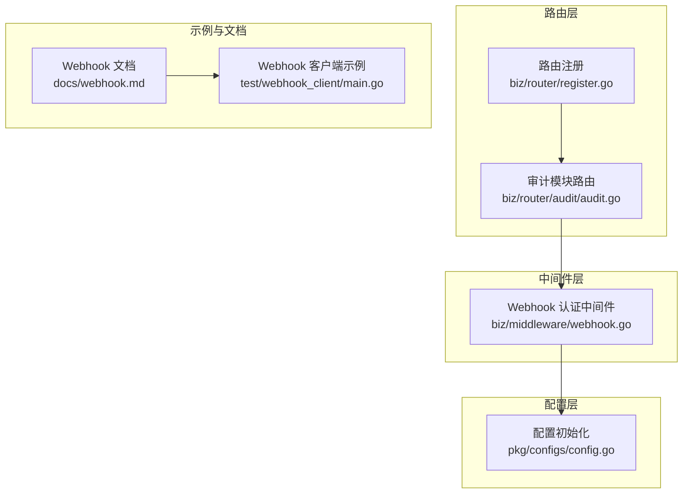
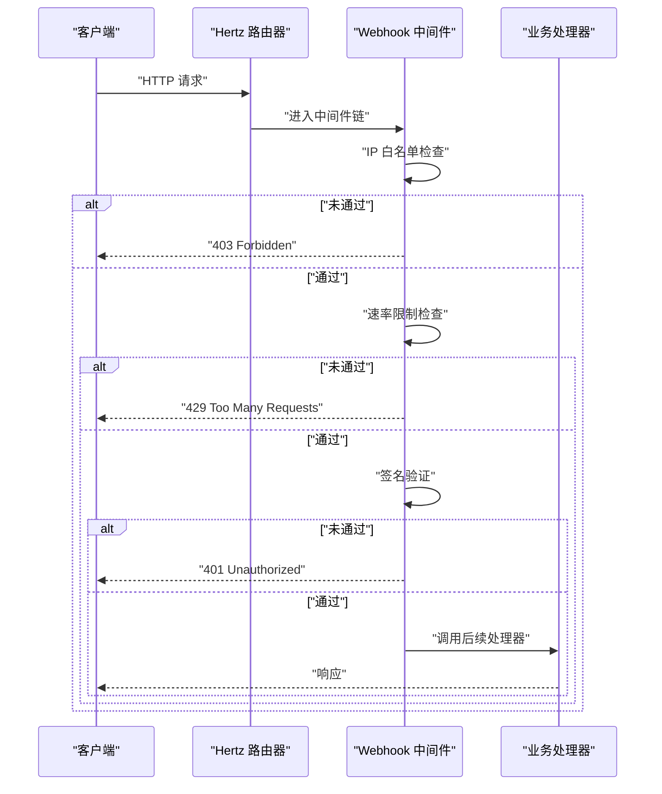
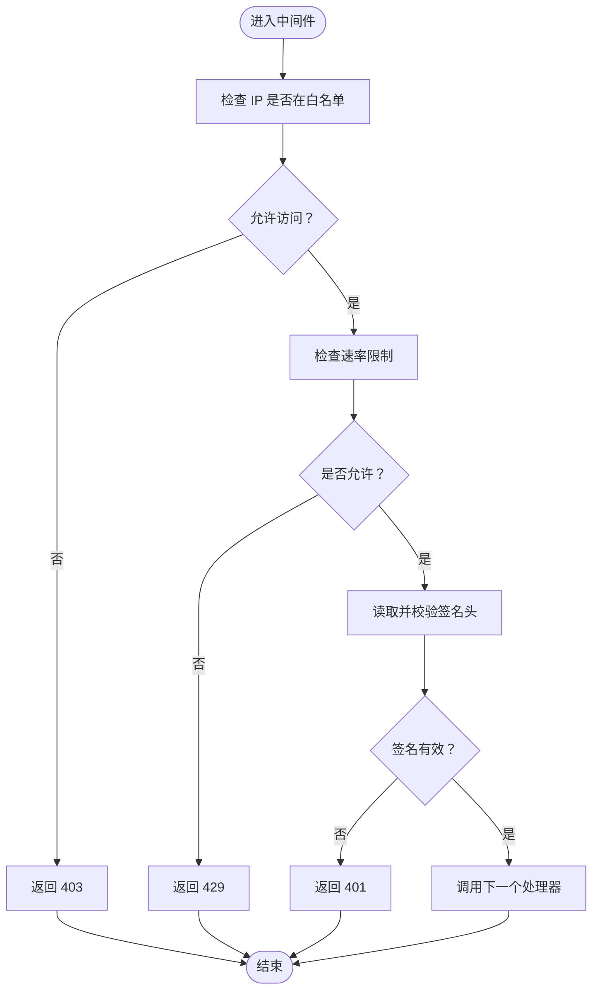
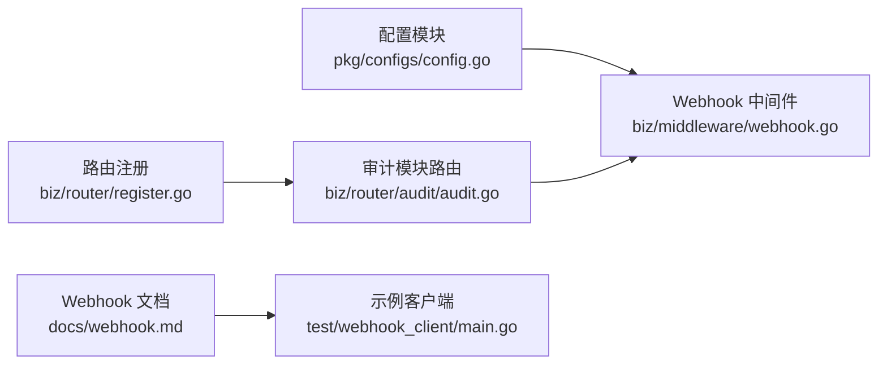

# 中间件

<cite>
**本文引用的文件**
- [biz/middleware/webhook.go](file://biz/middleware/webhook.go)
- [pkg/configs/config.go](file://pkg/configs/config.go)
- [biz/router/register.go](file://biz/router/register.go)
- [biz/router/audit/audit.go](file://biz/router/audit/audit.go)
- [biz/router/audit/middleware.go](file://biz/router/audit/middleware.go)
- [biz/router/branch/middleware.go](file://biz/router/branch/middleware.go)
- [biz/router/repo/middleware.go](file://biz/router/repo/middleware.go)
- [biz/router/stats/middleware.go](file://biz/router/stats/middleware.go)
- [test/webhook_client/main.go](file://test/webhook_client/main.go)
- [docs/webhook.md](file://docs/webhook.md)
</cite>

## 目录
1. [简介](#简介)
2. [项目结构](#项目结构)
3. [核心组件](#核心组件)
4. [架构总览](#架构总览)
5. [详细组件分析](#详细组件分析)
6. [依赖分析](#依赖分析)
7. [性能考虑](#性能考虑)
8. [故障排查指南](#故障排查指南)
9. [结论](#结论)
10. [附录](#附录)

## 简介
本文件系统性阐述本项目的中间件体系与 Webhook 中间件的实现机制，重点覆盖以下方面：
- 中间件在请求处理流程中的拦截点、预处理与后处理职责
- Webhook 中间件的安全验证链路：IP 白名单、速率限制、签名验证
- 中间件的注册方式、执行顺序与错误处理策略
- Webhook 的请求解析与事件分发思路
- 扩展接口、自定义中间件开发建议与性能优化实践
- 使用示例与常见问题定位方法

## 项目结构
中间件与路由注册主要分布在如下位置：
- 中间件实现：biz/middleware/webhook.go
- 配置加载与全局变量：pkg/configs/config.go
- 路由注册入口：biz/router/register.go
- 各模块路由与中间件占位：biz/router/*/middleware.go
- 模块路由挂载示例：biz/router/audit/audit.go
- Webhook 文档与示例客户端：docs/webhook.md、test/webhook_client/main.go

图表来源
- [biz/router/register.go](file://biz/router/register.go#L19-L41)
- [biz/router/audit/audit.go](file://biz/router/audit/audit.go#L17-L31)
- [biz/middleware/webhook.go](file://biz/middleware/webhook.go#L18-L68)
- [pkg/configs/config.go](file://pkg/configs/config.go#L18-L42)
- [docs/webhook.md](file://docs/webhook.md#L1-L133)
- [test/webhook_client/main.go](file://test/webhook_client/main.go#L1-L36)

章节来源
- [biz/router/register.go](file://biz/router/register.go#L19-L41)
- [biz/router/audit/audit.go](file://biz/router/audit/audit.go#L17-L31)
- [pkg/configs/config.go](file://pkg/configs/config.go#L18-L42)

## 核心组件
- Webhook 认证中间件：负责 IP 白名单校验、速率限制、签名验证，并在通过后调用下一个处理器继续处理。
- 配置模块：从配置文件与环境变量加载 Webhook 相关参数（密钥、速率限制、IP 白名单），并提供全局变量供中间件使用。
- 路由注册：统一注册各业务模块路由；Webhook 路由通常挂载在模块组下，以便复用认证中间件。

章节来源
- [biz/middleware/webhook.go](file://biz/middleware/webhook.go#L18-L68)
- [pkg/configs/config.go](file://pkg/configs/config.go#L18-L42)
- [biz/router/register.go](file://biz/router/register.go#L19-L41)

## 架构总览
Webhook 中间件在请求进入具体业务处理器之前执行，形成“前置校验 -> 业务处理”的标准流水线。其执行顺序为：
1) 可选的 IP 白名单检查
2) 速率限制检查
3) 签名验证
4) 通过后调用后续处理器（Next）

图表来源
- [biz/middleware/webhook.go](file://biz/middleware/webhook.go#L18-L68)

## 详细组件分析

### Webhook 中间件实现
Webhook 认证中间件以函数工厂形式返回一个处理器，该处理器按序执行三项安全检查：
- IP 白名单：若配置了白名单，则仅允许白名单内的来源访问。
- 速率限制：基于每分钟请求数的令牌桶限流。
- 签名验证：要求请求头包含特定格式的签名，使用共享密钥对请求体做 HMAC-SHA256 并比对。

中间件通过调用 Next 进入后续处理器，否则直接终止并返回相应错误码与消息。

图表来源
- [biz/middleware/webhook.go](file://biz/middleware/webhook.go#L18-L68)

章节来源
- [biz/middleware/webhook.go](file://biz/middleware/webhook.go#L18-L68)

### 配置加载与全局变量
配置模块负责：
- 从多个路径加载配置文件
- 将 Webhook 密钥、速率限制、IP 白名单等写入全局变量
- 支持通过环境变量覆盖部分配置项

这些全局变量被中间件直接使用，确保配置变更无需修改中间件代码即可生效。

章节来源
- [pkg/configs/config.go](file://pkg/configs/config.go#L18-L42)

### 路由注册与中间件挂载
- 路由注册入口统一注册各模块路由，并提供静态资源与根路径跳转。
- 模块路由文件中通过 Group 方式挂载中间件，例如审计模块在不同层级的路由组上挂载中间件。
- Webhook 路由通常挂载在模块组下，以便复用认证中间件。

章节来源
- [biz/router/register.go](file://biz/router/register.go#L19-L41)
- [biz/router/audit/audit.go](file://biz/router/audit/audit.go#L17-L31)

### 其他模块中间件占位
各模块的 middleware.go 文件当前为空实现，保留了按需扩展的空间，便于未来在不同路由层级挂载自定义中间件。

章节来源
- [biz/router/audit/middleware.go](file://biz/router/audit/middleware.go#L9-L37)
- [biz/router/branch/middleware.go](file://biz/router/branch/middleware.go#L9-L92)
- [biz/router/repo/middleware.go](file://biz/router/repo/middleware.go#L9-L72)
- [biz/router/stats/middleware.go](file://biz/router/stats/middleware.go#L9-L82)

### Webhook 文档与示例
- 文档明确了 Webhook 接口地址、方法、内容类型、签名算法与格式、频率限制与 IP 白名单等安全策略。
- 提供了多种语言的调用示例，便于集成方生成正确的签名并发起请求。
- 示例客户端展示了如何计算 HMAC-SHA256 签名并发送请求。

章节来源
- [docs/webhook.md](file://docs/webhook.md#L1-L133)
- [test/webhook_client/main.go](file://test/webhook_client/main.go#L13-L35)

## 依赖分析
- 中间件依赖配置模块提供的全局变量（密钥、速率限制、白名单）。
- 路由注册依赖各模块的 Register 函数，Webhook 路由通常挂载在模块组下。
- 各模块 middleware.go 作为中间件占位，便于后续扩展。

图表来源
- [pkg/configs/config.go](file://pkg/configs/config.go#L18-L42)
- [biz/middleware/webhook.go](file://biz/middleware/webhook.go#L18-L68)
- [biz/router/register.go](file://biz/router/register.go#L19-L41)
- [biz/router/audit/audit.go](file://biz/router/audit/audit.go#L17-L31)
- [docs/webhook.md](file://docs/webhook.md#L1-L133)
- [test/webhook_client/main.go](file://test/webhook_client/main.go#L1-L36)

章节来源
- [pkg/configs/config.go](file://pkg/configs/config.go#L18-L42)
- [biz/middleware/webhook.go](file://biz/middleware/webhook.go#L18-L68)
- [biz/router/register.go](file://biz/router/register.go#L19-L41)
- [biz/router/audit/audit.go](file://biz/router/audit/audit.go#L17-L31)

## 性能考虑
- 速率限制：中间件内置基于令牌桶的限流器，避免突发流量冲击业务处理器。建议根据实际并发与下游处理能力调整配置。
- 内存与 CPU：签名验证使用 HMAC-SHA256，开销较小；但需注意请求体读取与复制可能带来的内存压力。建议结合上游网关或反向代理进行限流与压缩。
- 并发模型：Hertz 默认并发处理请求，中间件链应保持无阻塞逻辑，必要时将耗时任务异步化。

## 故障排查指南
- 401 未授权
  - 检查请求头是否包含指定格式的签名字段
  - 确认签名算法与密钥一致
  - 章节来源
    - [biz/middleware/webhook.go](file://biz/middleware/webhook.go#L42-L65)
    - [docs/webhook.md](file://docs/webhook.md#L13-L18)
- 403 禁止访问
  - 检查是否配置了 IP 白名单且当前来源不在白名单内
  - 章节来源
    - [biz/middleware/webhook.go](file://biz/middleware/webhook.go#L20-L34)
    - [docs/webhook.md](file://docs/webhook.md#L23-L24)
- 429 请求过多
  - 检查速率限制配置是否过低
  - 章节来源
    - [biz/middleware/webhook.go](file://biz/middleware/webhook.go#L36-L40)
    - [docs/webhook.md](file://docs/webhook.md#L19-L21)
- 5xx 服务器错误
  - 检查业务处理器日志与上游网关状态
  - 章节来源
    - [biz/middleware/webhook.go](file://biz/middleware/webhook.go#L67-L68)

## 结论
本项目的中间件体系以 Webhook 认证为核心，提供了可插拔的前置安全校验能力。通过配置模块集中管理安全参数，配合路由层的中间件挂载，实现了清晰的职责分离与良好的可扩展性。建议在生产环境中结合网关与反向代理进一步完善限流、鉴权与可观测性。

## 附录

### 自定义中间件开发指南
- 设计原则
  - 保持无状态、幂等与快速返回
  - 在中间件中只做与当前职责相关的处理（如鉴权、限流、日志）
- 开发步骤
  - 在对应模块目录下新增中间件文件
  - 实现 app.HandlerFunc 工厂函数，按需执行前置逻辑
  - 在模块路由文件中通过 Group 挂载中间件
  - 在配置模块中增加必要的配置项并通过 Init 注入全局变量
- 执行顺序
  - 中间件按挂载顺序依次执行，Next 之后为后续处理器
  - 建议将严格前置校验（鉴权、限流）置于靠前位置
- 错误处理
  - 对于可预期的错误，直接设置状态码与响应体并终止链路
  - 对于不可预期异常，记录上下文并返回通用错误

### Webhook 使用示例
- 生成签名
  - 使用共享密钥对请求体进行 HMAC-SHA256 计算，格式为 sha256=<十六进制摘要>
- 发送请求
  - 设置 Content-Type 为 application/json
  - 设置 X-Hub-Signature-256 头
- 参考
  - 章节来源
    - [docs/webhook.md](file://docs/webhook.md#L61-L132)
    - [test/webhook_client/main.go](file://test/webhook_client/main.go#L13-L35)