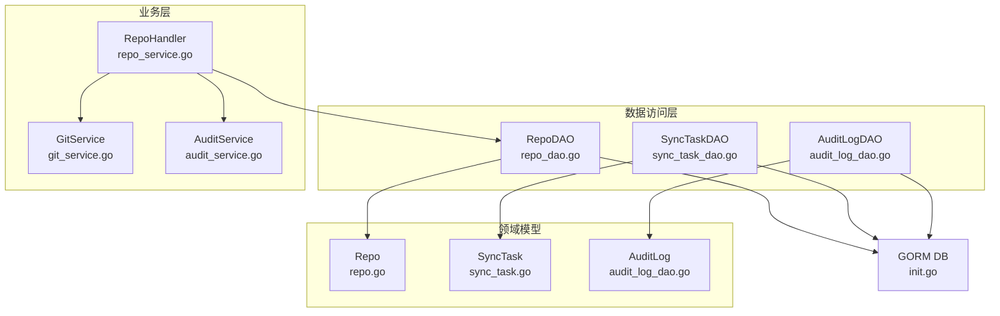
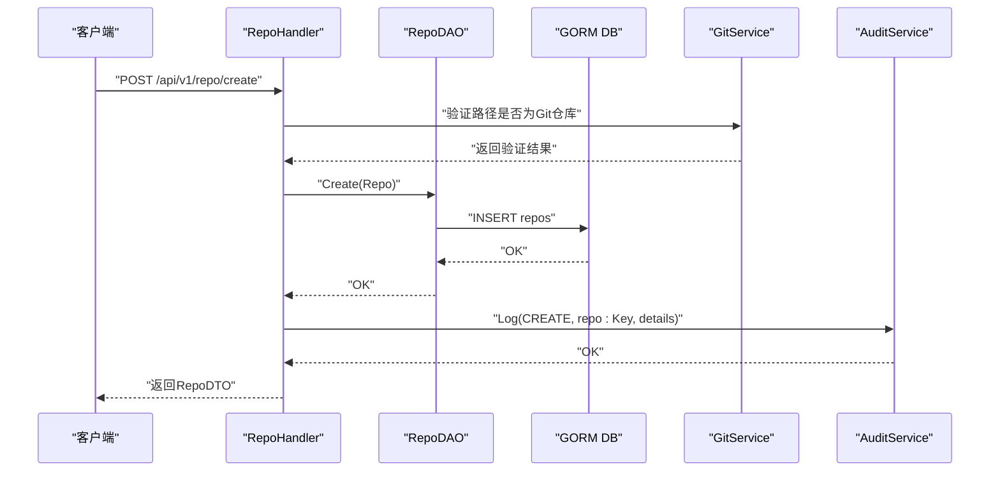
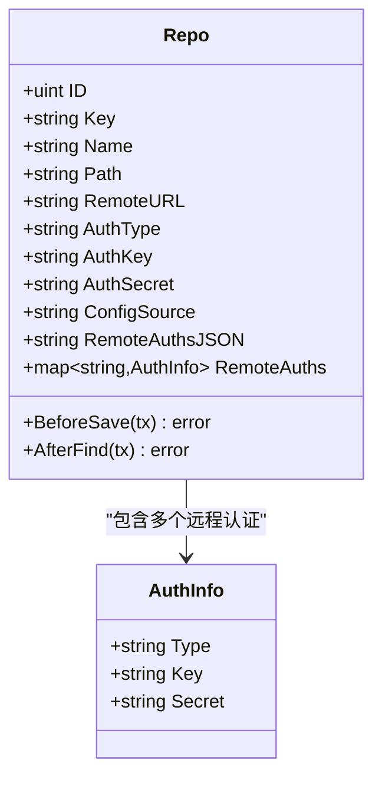
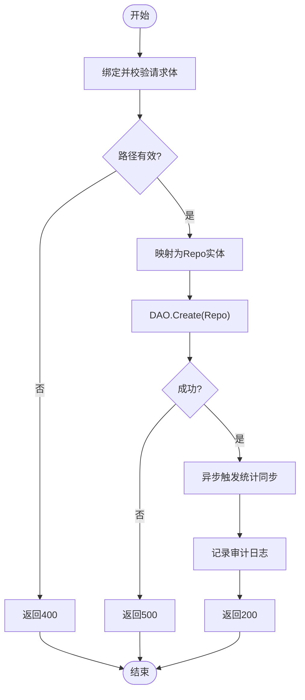
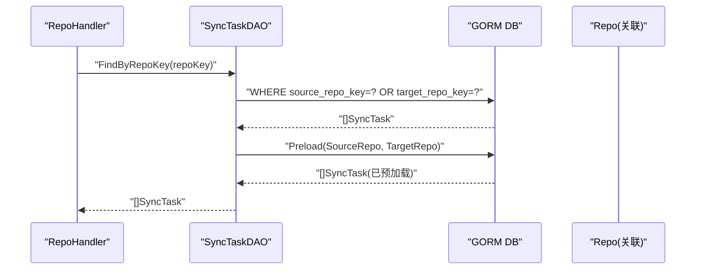
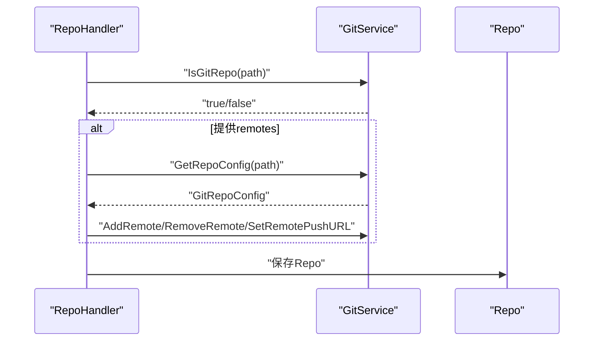
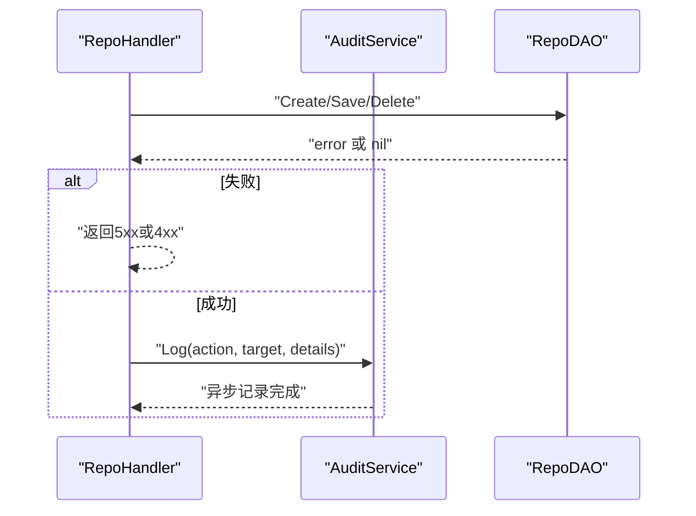
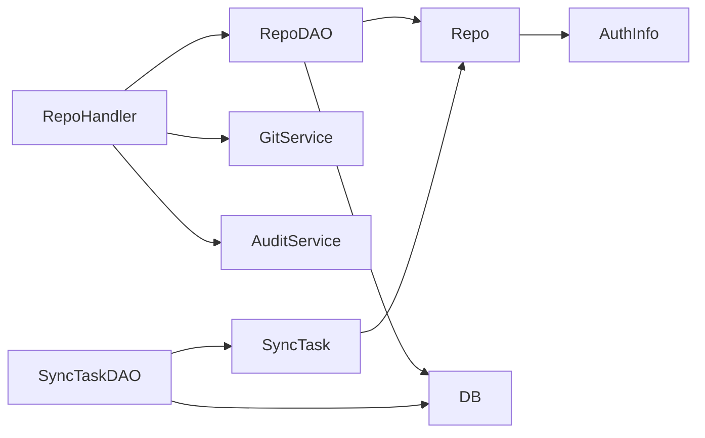

# 仓库DAO

<cite>
**本文引用的文件列表**
- [repo_dao.go](file://biz/dal/db/repo_dao.go)
- [init.go](file://biz/dal/db/init.go)
- [repo.go](file://biz/model/po/repo.go)
- [git.go](file://biz/model/domain/git.go)
- [common.go](file://biz/model/domain/common.go)
- [repo_service.go](file://biz/handler/repo/repo_service.go)
- [git_service.go](file://biz/service/git/git_service.go)
- [sync_task_dao.go](file://biz/dal/db/sync_task_dao.go)
- [sync_task.go](file://biz/model/po/sync_task.go)
- [audit_log_dao.go](file://biz/dal/db/audit_log_dao.go)
- [audit_service.go](file://biz/service/audit/audit_service.go)
- [repo.go](file://biz/model/api/repo.go)
</cite>

## 目录
1. [简介](#简介)
2. [项目结构](#项目结构)
3. [核心组件](#核心组件)
4. [架构总览](#架构总览)
5. [详细组件分析](#详细组件分析)
6. [依赖关系分析](#依赖关系分析)
7. [性能考量](#性能考量)
8. [故障排查指南](#故障排查指南)
9. [结论](#结论)
10. [附录](#附录)

## 简介
本文件聚焦于“仓库DAO”的数据访问对象，系统性阐述仓库数据模型的设计理念、字段语义与约束；详解仓库CRUD操作（创建、查询、更新、删除）的实现路径；全面介绍仓库查询接口（按键/路径查询、全量查询）、关联查询（与同步任务的关联）、统计与状态管理；并结合现有审计日志与Git服务交互，说明事务处理、并发控制与数据一致性保障；最后给出性能优化、索引设计与查询缓存策略，并总结与业务层的交互模式与错误处理机制。

## 项目结构
仓库DAO位于数据访问层，围绕仓库实体进行数据库读写；业务层通过处理器调用DAO；Git服务负责仓库本地操作；审计服务记录关键操作日志；同步任务模型与DAO用于关联查询与状态统计。

图表来源
- [repo_dao.go](file://biz/dal/db/repo_dao.go#L1-L42)
- [init.go](file://biz/dal/db/init.go#L1-L72)
- [repo.go](file://biz/model/po/repo.go#L1-L93)
- [sync_task_dao.go](file://biz/dal/db/sync_task_dao.go#L1-L66)
- [sync_task.go](file://biz/model/po/sync_task.go#L1-L29)
- [audit_log_dao.go](file://biz/dal/db/audit_log_dao.go#L1-L45)
- [repo_service.go](file://biz/handler/repo/repo_service.go#L1-L371)
- [git_service.go](file://biz/service/git/git_service.go#L1-L800)
- [audit_service.go](file://biz/service/audit/audit_service.go#L1-L50)

章节来源
- [repo_dao.go](file://biz/dal/db/repo_dao.go#L1-L42)
- [init.go](file://biz/dal/db/init.go#L1-L72)

## 核心组件
- 仓库实体模型：定义仓库的持久化字段、唯一索引、加密/解密钩子以及表名。
- 仓库DAO：提供创建、查询（全量、按键、按路径）、保存、删除等基础CRUD方法。
- 业务处理器：封装HTTP路由与参数校验，协调Git服务与DAO，触发异步统计与审计记录。
- 关联查询：通过SyncTaskDAO按仓库键查询关联的同步任务，支持预加载源/目标仓库。
- 审计日志：在关键操作后异步记录审计条目，便于追踪与合规。

章节来源
- [repo.go](file://biz/model/po/repo.go#L1-L93)
- [repo_dao.go](file://biz/dal/db/repo_dao.go#L1-L42)
- [repo_service.go](file://biz/handler/repo/repo_service.go#L1-L371)
- [sync_task_dao.go](file://biz/dal/db/sync_task_dao.go#L1-L66)
- [audit_log_dao.go](file://biz/dal/db/audit_log_dao.go#L1-L45)

## 架构总览
仓库DAO采用GORM作为ORM，统一由初始化模块建立连接与迁移；业务层通过处理器调用DAO执行数据库操作；Git服务负责仓库本地操作；审计服务异步记录操作日志；同步任务DAO提供与仓库的关联查询能力。

图表来源
- [repo_service.go](file://biz/handler/repo/repo_service.go#L52-L126)
- [repo_dao.go](file://biz/dal/db/repo_dao.go#L13-L15)
- [git_service.go](file://biz/service/git/git_service.go#L133-L136)
- [audit_service.go](file://biz/service/audit/audit_service.go#L24-L50)

## 详细组件分析

### 数据模型与字段语义
- 表名：repos
- 唯一索引：
  - key：全局唯一标识，用于API与业务逻辑定位仓库
  - name：仓库名称唯一，避免重复
- 字段语义：
  - key：仓库键，UUID生成，用于安全稳定的外部引用
  - name：仓库名称
  - path：本地仓库路径
  - remote_url：默认远程URL
  - auth_type：认证类型（ssh/http/none）
  - auth_key/auth_secret：认证凭据（主凭据与远程凭据均加密存储）
  - config_source：配置来源（local/database）
  - remote_auths：按远程主机分组的认证信息映射（内存与API可见）
  - remote_auths_json：持久化存储的加密凭据JSON
- 生命周期钩子：
  - BeforeSave：对主凭据与remote_auths中的secret进行加密
  - AfterFind：对主凭据与remote_auths中的secret进行解密

图表来源
- [repo.go](file://biz/model/po/repo.go#L11-L93)
- [common.go](file://biz/model/domain/common.go#L3-L8)

章节来源
- [repo.go](file://biz/model/po/repo.go#L11-L93)
- [common.go](file://biz/model/domain/common.go#L3-L8)

### CRUD实现与流程
- 创建（Create）
  - 业务层绑定请求体并校验路径有效性
  - 将请求体映射为Repo实体（含remote_auths）
  - 调用DAO Create持久化
  - 异步触发统计同步
  - 记录审计日志
- 查询（FindAll/FindByKey/FindByPath）
  - FindAll：全量查询
  - FindByKey：按唯一键查询
  - FindByPath：按本地路径查询
- 更新（Save）
  - 先按key查询，再更新字段
  - 若路径变更则重新校验
  - 保存后记录审计日志
- 删除（Delete）
  - 先按key查询
  - 检查是否被同步任务使用（通过SyncTaskDAO统计）
  - 未被使用则删除并记录审计日志

图表来源
- [repo_service.go](file://biz/handler/repo/repo_service.go#L54-L126)
- [repo_dao.go](file://biz/dal/db/repo_dao.go#L13-L15)

章节来源
- [repo_service.go](file://biz/handler/repo/repo_service.go#L52-L237)
- [repo_dao.go](file://biz/dal/db/repo_dao.go#L13-L41)

### 查询接口与关联查询
- 基础查询
  - 全量查询：FindAll
  - 按键查询：FindByKey
  - 按路径查询：FindByPath
- 关联查询
  - 通过SyncTaskDAO按仓库键查询所有关联的同步任务，并预加载源/目标仓库
  - 统计关联数量：CountByRepoKey
  - 获取任务键集合：GetKeysByRepoKey
- 分页与列表
  - 审计日志DAO提供分页查询（排除大字段以提升性能）

图表来源
- [sync_task_dao.go](file://biz/dal/db/sync_task_dao.go#L23-L29)
- [sync_task.go](file://biz/model/po/sync_task.go#L21-L24)

章节来源
- [sync_task_dao.go](file://biz/dal/db/sync_task_dao.go#L17-L60)
- [sync_task.go](file://biz/model/po/sync_task.go#L8-L29)

### 与Git服务的交互与状态管理
- 路径校验：创建/更新时通过GitService判断路径是否为有效Git仓库
- 远程同步：当提供remotes时，先读取现有配置，再增删改远程，确保与请求一致
- 克隆与拉取：提供克隆与拉取接口，内部调用GitService执行具体操作
- 状态与统计：创建后异步触发统计同步，拉取后可触发后续统计

图表来源
- [repo_service.go](file://biz/handler/repo/repo_service.go#L62-L95)
- [git_service.go](file://biz/service/git/git_service.go#L133-L136)
- [git_service.go](file://biz/service/git/git_service.go#L357-L409)

章节来源
- [repo_service.go](file://biz/handler/repo/repo_service.go#L62-L95)
- [git_service.go](file://biz/service/git/git_service.go#L133-L136)
- [git_service.go](file://biz/service/git/git_service.go#L357-L409)

### 审计与错误处理
- 审计记录：在创建/更新/删除等关键操作后异步记录审计日志，包含操作类型、目标、详情、IP与UA
- 错误处理：业务层对DAO/GitService调用失败返回相应HTTP状态码；DAO层将底层错误透传

图表来源
- [audit_service.go](file://biz/service/audit/audit_service.go#L24-L50)
- [audit_log_dao.go](file://biz/dal/db/audit_log_dao.go#L13-L21)
- [repo_service.go](file://biz/handler/repo/repo_service.go#L115-L125)

章节来源
- [audit_service.go](file://biz/service/audit/audit_service.go#L24-L50)
- [audit_log_dao.go](file://biz/dal/db/audit_log_dao.go#L13-L39)
- [repo_service.go](file://biz/handler/repo/repo_service.go#L115-L236)

## 依赖关系分析
- RepoDAO依赖GORM DB实例，提供基本CRUD
- Repo实体依赖domain.AuthInfo用于远程认证
- 业务层RepoHandler依赖GitService与AuditService
- 关联查询依赖SyncTaskDAO与SyncTask模型
- 初始化模块负责数据库连接与自动迁移

图表来源
- [repo_dao.go](file://biz/dal/db/repo_dao.go#L3-L5)
- [repo.go](file://biz/model/po/repo.go#L3-L8)
- [sync_task_dao.go](file://biz/dal/db/sync_task_dao.go#L3-L5)
- [sync_task.go](file://biz/model/po/sync_task.go#L3-L5)
- [init.go](file://biz/dal/db/init.go#L16-L52)

章节来源
- [repo_dao.go](file://biz/dal/db/repo_dao.go#L3-L5)
- [repo.go](file://biz/model/po/repo.go#L3-L8)
- [sync_task_dao.go](file://biz/dal/db/sync_task_dao.go#L3-L5)
- [sync_task.go](file://biz/model/po/sync_task.go#L3-L5)
- [init.go](file://biz/dal/db/init.go#L16-L52)

## 性能考量
- 索引设计建议
  - repos表的唯一索引：key、name（当前已存在），满足高频按键/按名查询
  - audit_logs表的索引：action、target（已有索引），满足审计查询
- 查询优化
  - 列表分页：审计日志DAO仅选择必要字段，避免大文本列传输
  - 预加载：关联查询使用Preload减少N+1查询
- 缓存策略
  - 对热点仓库键/名称的查询结果可考虑短期缓存（如Redis），降低DB压力
  - 对远程凭据的解密结果可在进程内缓存，避免重复解密
- 并发与一致性
  - 使用GORM事务包裹多步骤操作（如创建仓库+写入审计），确保原子性
  - 对唯一键冲突（key/name）进行幂等处理，避免重复创建
- IO与网络
  - Git操作（克隆/拉取）建议异步执行并带进度回调，避免阻塞请求线程

[本节为通用性能指导，不直接分析特定文件，故无章节来源]

## 故障排查指南
- 创建失败
  - 检查路径是否为有效Git仓库
  - 检查唯一键冲突（key/name）
  - 查看审计日志确认是否记录了异常
- 更新失败
  - 若修改路径，需再次校验有效性
  - 确认remote_auths中secret是否正确加密
- 删除失败
  - 若提示被同步任务使用，先清理相关任务或迁移仓库
- 查询异常
  - 使用FindByKey/FindByPath进行定位
  - 对关联查询使用预加载，确认外键是否正确

章节来源
- [repo_service.go](file://biz/handler/repo/repo_service.go#L62-L95)
- [repo_service.go](file://biz/handler/repo/repo_service.go#L147-L154)
- [repo_service.go](file://biz/handler/repo/repo_service.go#L224-L229)
- [audit_log_dao.go](file://biz/dal/db/audit_log_dao.go#L17-L39)

## 结论
仓库DAO以简洁的CRUD接口支撑业务层的仓库生命周期管理；通过GORM钩子实现凭据加密/解密，兼顾安全性与可用性；结合Git服务与审计服务，形成从本地仓库到数据库再到审计的完整闭环。建议在高并发场景下引入事务、缓存与预加载策略，持续优化查询与IO性能。

[本节为总结性内容，不直接分析特定文件，故无章节来源]

## 附录
- 与业务层交互模式
  - 处理器负责参数绑定与校验、调用DAO与Git服务、触发审计与异步任务
  - DAO专注于数据持久化，保持与业务逻辑解耦
- 错误处理机制
  - 业务层根据DAO/GitService返回错误映射HTTP状态码
  - 审计服务异步记录，不影响主流程响应时间

[本节为概念性说明，不直接分析特定文件，故无章节来源]