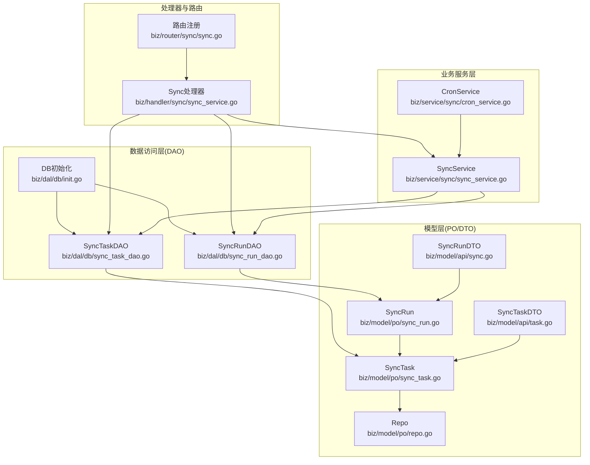
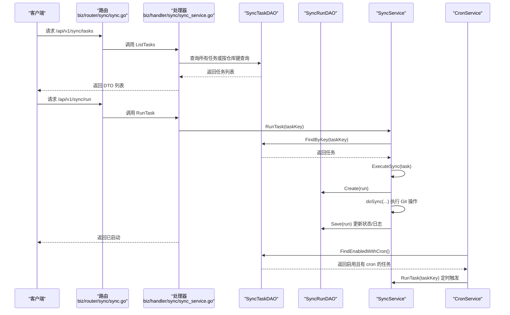
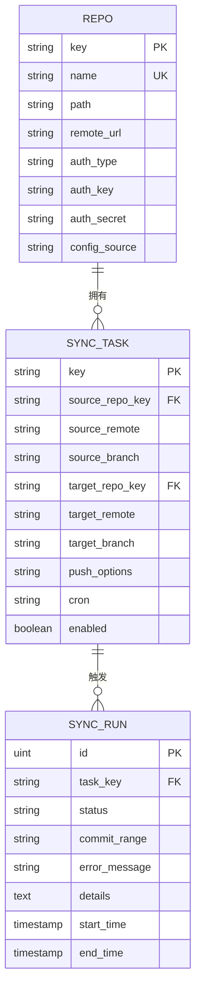
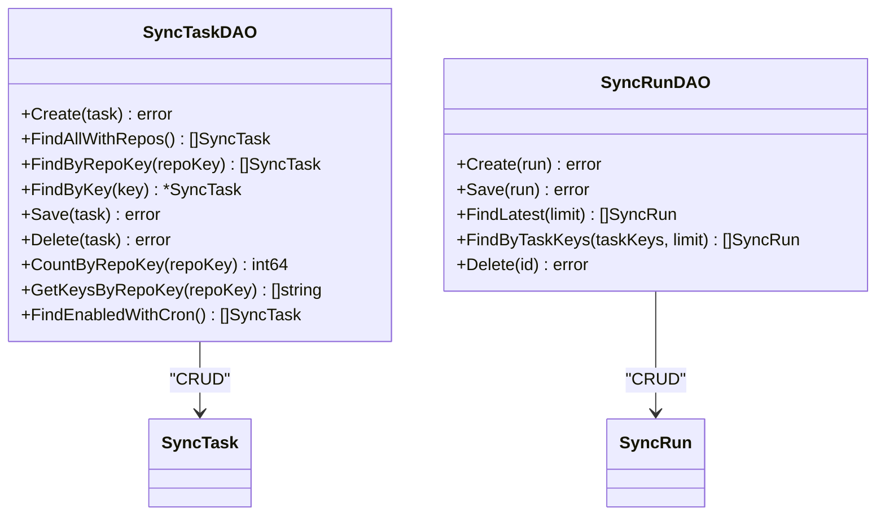
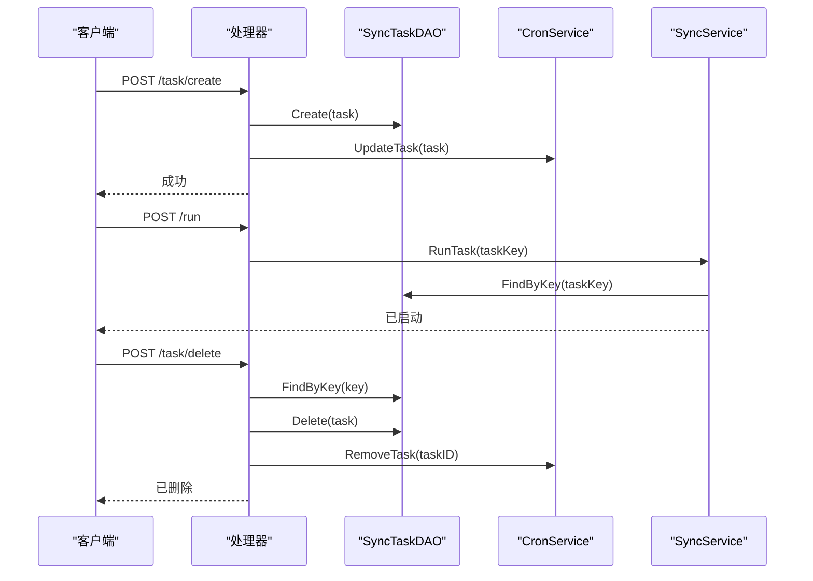
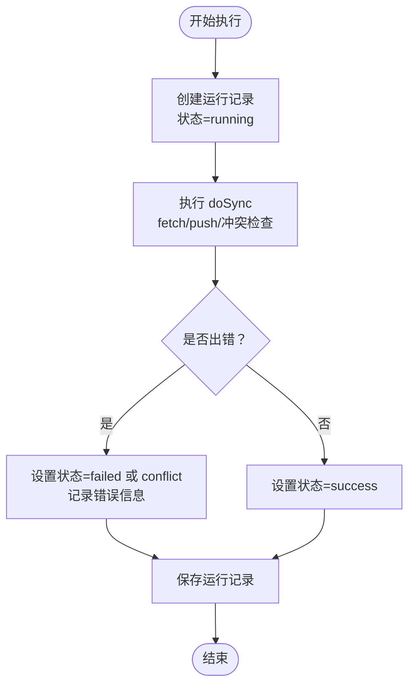
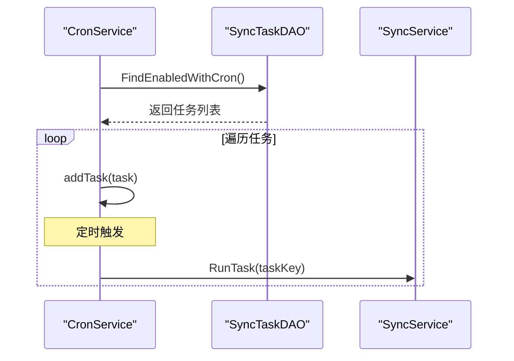
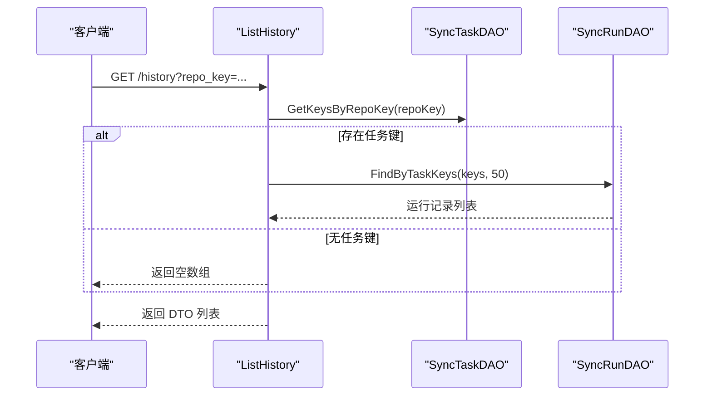
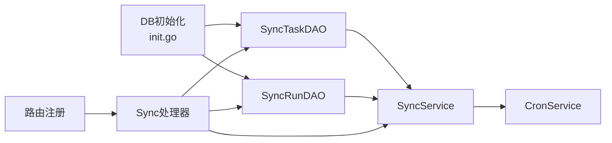

# 同步任务DAO

<cite>
**本文引用的文件**
- [biz/dal/db/sync_task_dao.go](file://biz/dal/db/sync_task_dao.go)
- [biz/dal/db/sync_run_dao.go](file://biz/dal/db/sync_run_dao.go)
- [biz/dal/db/init.go](file://biz/dal/db/init.go)
- [biz/model/po/sync_task.go](file://biz/model/po/sync_task.go)
- [biz/model/po/sync_run.go](file://biz/model/po/sync_run.go)
- [biz/model/po/repo.go](file://biz/model/po/repo.go)
- [biz/model/api/task.go](file://biz/model/api/task.go)
- [biz/model/api/sync.go](file://biz/model/api/sync.go)
- [biz/service/sync/sync_service.go](file://biz/service/sync/sync_service.go)
- [biz/service/sync/cron_service.go](file://biz/service/sync/cron_service.go)
- [biz/handler/sync/sync_service.go](file://biz/handler/sync/sync_service.go)
- [biz/router/sync/sync.go](file://biz/router/sync/sync.go)
</cite>

## 目录
1. [引言](#引言)
2. [项目结构](#项目结构)
3. [核心组件](#核心组件)
4. [架构总览](#架构总览)
5. [详细组件分析](#详细组件分析)
6. [依赖关系分析](#依赖关系分析)
7. [性能考虑](#性能考虑)
8. [故障排查指南](#故障排查指南)
9. [结论](#结论)
10. [附录](#附录)

## 引言
本文件聚焦“同步任务DAO”的数据访问对象设计与实现，系统性阐述同步任务数据模型、任务状态管理、生命周期（创建、启动、暂停、停止、删除）、查询接口（按状态、定时任务筛选、批量状态更新、历史任务查询）、调度与并发控制、执行监控与失败重试、超时处理、性能优化与批量操作、以及与定时任务服务的集成与数据一致性保障。

## 项目结构
围绕同步任务DAO的关键目录与文件如下：
- 数据访问层（DAO）：biz/dal/db 下的 sync_task_dao.go、sync_run_dao.go、init.go
- 模型层（PO/DTO）：biz/model/po 下的 sync_task.go、sync_run.go、repo.go；biz/model/api 下的 task.go、sync.go
- 业务服务层：biz/service/sync 下的 sync_service.go、cron_service.go
- 处理器与路由：biz/handler/sync/sync_service.go、biz/router/sync/sync.go

图表来源
- [biz/dal/db/sync_task_dao.go](file://biz/dal/db/sync_task_dao.go#L1-L67)
- [biz/dal/db/sync_run_dao.go](file://biz/dal/db/sync_run_dao.go#L1-L40)
- [biz/dal/db/init.go](file://biz/dal/db/init.go#L1-L72)
- [biz/model/po/sync_task.go](file://biz/model/po/sync_task.go#L1-L29)
- [biz/model/po/sync_run.go](file://biz/model/po/sync_run.go#L1-L26)
- [biz/model/po/repo.go](file://biz/model/po/repo.go#L1-L93)
- [biz/model/api/task.go](file://biz/model/api/task.go#L1-L66)
- [biz/model/api/sync.go](file://biz/model/api/sync.go#L1-L41)
- [biz/service/sync/sync_service.go](file://biz/service/sync/sync_service.go#L1-L263)
- [biz/service/sync/cron_service.go](file://biz/service/sync/cron_service.go#L1-L101)
- [biz/handler/sync/sync_service.go](file://biz/handler/sync/sync_service.go#L1-L258)
- [biz/router/sync/sync.go](file://biz/router/sync/sync.go#L1-L41)

章节来源
- [biz/dal/db/sync_task_dao.go](file://biz/dal/db/sync_task_dao.go#L1-L67)
- [biz/dal/db/sync_run_dao.go](file://biz/dal/db/sync_run_dao.go#L1-L40)
- [biz/dal/db/init.go](file://biz/dal/db/init.go#L1-L72)
- [biz/model/po/sync_task.go](file://biz/model/po/sync_task.go#L1-L29)
- [biz/model/po/sync_run.go](file://biz/model/po/sync_run.go#L1-L26)
- [biz/model/po/repo.go](file://biz/model/po/repo.go#L1-L93)
- [biz/model/api/task.go](file://biz/model/api/task.go#L1-L66)
- [biz/model/api/sync.go](file://biz/model/api/sync.go#L1-L41)
- [biz/service/sync/sync_service.go](file://biz/service/sync/sync_service.go#L1-L263)
- [biz/service/sync/cron_service.go](file://biz/service/sync/cron_service.go#L1-L101)
- [biz/handler/sync/sync_service.go](file://biz/handler/sync/sync_service.go#L1-L258)
- [biz/router/sync/sync.go](file://biz/router/sync/sync.go#L1-L41)

## 核心组件
- SyncTaskDAO：提供同步任务的增删改查、关联预加载、按仓库键计数与键列表查询、启用且带定时表达式的任务查询等能力。
- SyncRunDAO：提供同步运行记录的创建、保存、按任务键批量查询最近N条、查询最新N条、删除等能力。
- SyncService：封装执行流程（创建运行记录、执行同步、记录日志与结果、保存运行记录），并提供对外的异步运行接口。
- CronService：基于 cron 库维护定时任务的动态增删改，自动从数据库加载启用且有 cron 表达式任务。
- 处理器与路由：暴露 REST 接口，完成任务 CRUD、立即执行、历史查询、删除历史等。

章节来源
- [biz/dal/db/sync_task_dao.go](file://biz/dal/db/sync_task_dao.go#L1-L67)
- [biz/dal/db/sync_run_dao.go](file://biz/dal/db/sync_run_dao.go#L1-L40)
- [biz/service/sync/sync_service.go](file://biz/service/sync/sync_service.go#L1-L263)
- [biz/service/sync/cron_service.go](file://biz/service/sync/cron_service.go#L1-L101)
- [biz/handler/sync/sync_service.go](file://biz/handler/sync/sync_service.go#L1-L258)
- [biz/router/sync/sync.go](file://biz/router/sync/sync.go#L1-L41)

## 架构总览
下图展示从路由到DAO、服务与模型之间的交互关系，以及定时任务服务如何驱动同步任务执行。

图表来源
- [biz/router/sync/sync.go](file://biz/router/sync/sync.go#L17-L40)
- [biz/handler/sync/sync_service.go](file://biz/handler/sync/sync_service.go#L19-L163)
- [biz/dal/db/sync_task_dao.go](file://biz/dal/db/sync_task_dao.go#L17-L66)
- [biz/dal/db/sync_run_dao.go](file://biz/dal/db/sync_run_dao.go#L13-L25)
- [biz/service/sync/sync_service.go](file://biz/service/sync/sync_service.go#L27-L74)
- [biz/service/sync/cron_service.go](file://biz/service/sync/cron_service.go#L35-L100)

## 详细组件分析

### 数据模型与关系
- SyncTask：持久化同步任务，包含源/目标仓库键、远程名、分支、推送选项、cron 表达式、启用标志，并通过外键关联 Repo。
- SyncRun：持久化一次同步运行记录，包含任务键、状态（success/failed/conflict）、提交范围、错误信息、详情日志、起止时间，并通过外键关联 SyncTask。
- Repo：仓库实体，支持主认证与多远程认证的加密存储与解密。

图表来源
- [biz/model/po/repo.go](file://biz/model/po/repo.go#L11-L28)
- [biz/model/po/sync_task.go](file://biz/model/po/sync_task.go#L8-L28)
- [biz/model/po/sync_run.go](file://biz/model/po/sync_run.go#L9-L25)

章节来源
- [biz/model/po/sync_task.go](file://biz/model/po/sync_task.go#L1-L29)
- [biz/model/po/sync_run.go](file://biz/model/po/sync_run.go#L1-L26)
- [biz/model/po/repo.go](file://biz/model/po/repo.go#L1-L93)

### DAO 组件与查询接口
- SyncTaskDAO
  - 创建：Create
  - 查询：FindAllWithRepos（预加载源/目标仓库）、FindByRepoKey（按仓库键查询）、FindByKey（按任务键查询）
  - 更新：Save
  - 删除：Delete
  - 计数与键列表：CountByRepoKey、GetKeysByRepoKey
  - 定时任务筛选：FindEnabledWithCron（启用且 cron 非空）
- SyncRunDAO
  - 创建：Create
  - 保存：Save
  - 历史查询：FindLatest（按时间倒序取 N 条）、FindByTaskKeys（按任务键集合查询并限制数量）
  - 删除：Delete

图表来源
- [biz/dal/db/sync_task_dao.go](file://biz/dal/db/sync_task_dao.go#L7-L66)
- [biz/dal/db/sync_run_dao.go](file://biz/dal/db/sync_run_dao.go#L7-L39)
- [biz/model/po/sync_task.go](file://biz/model/po/sync_task.go#L8-L24)
- [biz/model/po/sync_run.go](file://biz/model/po/sync_run.go#L9-L21)

章节来源
- [biz/dal/db/sync_task_dao.go](file://biz/dal/db/sync_task_dao.go#L1-L67)
- [biz/dal/db/sync_run_dao.go](file://biz/dal/db/sync_run_dao.go#L1-L40)

### 生命周期管理
- 创建：处理器 CreateTask 生成唯一 key 并调用 DAO 创建，随后通知 CronService 更新定时任务。
- 启动：RunTask 接收任务键，异步调用 SyncService.RunTask；后者加载任务并执行 ExecuteSync。
- 暂停/停止：当前实现未提供显式暂停/停止接口；可通过禁用任务（更新 Enabled=false）并移除定时项达到“停止”效果。
- 删除：DeleteTask 查找任务后删除，并从 CronService 中移除对应定时项。

图表来源
- [biz/handler/sync/sync_service.go](file://biz/handler/sync/sync_service.go#L62-L145)
- [biz/service/sync/sync_service.go](file://biz/service/sync/sync_service.go#L27-L33)
- [biz/service/sync/cron_service.go](file://biz/service/sync/cron_service.go#L59-L82)
- [biz/dal/db/sync_task_dao.go](file://biz/dal/db/sync_task_dao.go#L13-L44)

章节来源
- [biz/handler/sync/sync_service.go](file://biz/handler/sync/sync_service.go#L62-L145)
- [biz/service/sync/sync_service.go](file://biz/service/sync/sync_service.go#L27-L33)
- [biz/service/sync/cron_service.go](file://biz/service/sync/cron_service.go#L59-L82)
- [biz/dal/db/sync_task_dao.go](file://biz/dal/db/sync_task_dao.go#L13-L44)

### 任务状态管理与执行监控
- 状态字段：SyncRun.Status 支持 success、failed、conflict；失败时记录 ErrorMessage；执行详情与命令日志写入 Details。
- 执行流程：SyncService.ExecuteSync 先创建运行记录并标记为 running，再调用 doSync 执行 fetch/push 与冲突检查，最后根据结果更新状态与结束时间。
- 日志与进度：使用自定义 writer 将 Git 输出写入日志，便于历史回溯。

图表来源
- [biz/service/sync/sync_service.go](file://biz/service/sync/sync_service.go#L35-L74)
- [biz/model/po/sync_run.go](file://biz/model/po/sync_run.go#L10-L21)

章节来源
- [biz/service/sync/sync_service.go](file://biz/service/sync/sync_service.go#L35-L74)
- [biz/model/po/sync_run.go](file://biz/model/po/sync_run.go#L1-L26)

### 定时任务与调度
- 加载策略：CronService.Reload 清空旧条目，查询启用且 cron 非空的任务，逐个添加到 cron 实例。
- 动态更新：UpdateTask 移除旧条目后重新添加；RemoveTask 直接移除。
- 触发执行：定时触发时直接调用 SyncService.RunTask(taskKey)，由服务层负责具体执行。

图表来源
- [biz/service/sync/cron_service.go](file://biz/service/sync/cron_service.go#L35-L100)
- [biz/dal/db/sync_task_dao.go](file://biz/dal/db/sync_task_dao.go#L62-L66)
- [biz/service/sync/sync_service.go](file://biz/service/sync/sync_service.go#L27-L33)

章节来源
- [biz/service/sync/cron_service.go](file://biz/service/sync/cron_service.go#L1-L101)
- [biz/dal/db/sync_task_dao.go](file://biz/dal/db/sync_task_dao.go#L62-L66)
- [biz/service/sync/sync_service.go](file://biz/service/sync/sync_service.go#L27-L33)

### 查询接口与批量操作
- 按仓库键查询：FindByRepoKey；计数：CountByRepoKey；键列表：GetKeysByRepoKey。
- 历史查询：ListHistory 支持按仓库键查询其任务的历史记录，内部先获取任务键集合，再调用 SyncRunDAO.FindByTaskKeys 获取最近 N 条。
- 批量删除历史：DeleteHistory 支持传入 ID 删除指定运行记录。

图表来源
- [biz/handler/sync/sync_service.go](file://biz/handler/sync/sync_service.go#L202-L233)
- [biz/dal/db/sync_task_dao.go](file://biz/dal/db/sync_task_dao.go#L54-L59)
- [biz/dal/db/sync_run_dao.go](file://biz/dal/db/sync_run_dao.go#L27-L35)

章节来源
- [biz/handler/sync/sync_service.go](file://biz/handler/sync/sync_service.go#L202-L233)
- [biz/dal/db/sync_task_dao.go](file://biz/dal/db/sync_task_dao.go#L46-L60)
- [biz/dal/db/sync_run_dao.go](file://biz/dal/db/sync_run_dao.go#L21-L35)

### 并发控制与失败重试
- 并发：RunTask 采用 goroutine 异步启动，避免阻塞请求；CronService 使用互斥锁保护 entries 映射的增删改。
- 失败重试：当前未实现自动重试机制；建议在上层业务或定时周期内再次触发 RunTask，或扩展 CronService 在失败时的策略。
- 冲突检测：doSync 中对非快进更新与源落后目标的情况返回特定错误，便于上层区分处理。

章节来源
- [biz/handler/sync/sync_service.go](file://biz/handler/sync/sync_service.go#L147-L163)
- [biz/service/sync/cron_service.go](file://biz/service/sync/cron_service.go#L35-L82)
- [biz/service/sync/sync_service.go](file://biz/service/sync/sync_service.go#L85-L249)

### 性能优化与批量操作
- 预加载与关联查询：FindAllWithRepos、FindByRepoKey 使用 Preload 预加载仓库关联，减少 N+1 查询。
- 分页与限制：FindLatest、FindByTaskKeys 通过 Limit 控制返回数量，避免一次性拉取过多历史。
- 批量键查询：GetKeysByRepoKey 使用 Pluck 提取键集合，配合 FindByTaskKeys 实现批量历史查询。
- 数据库迁移：init.go 自动迁移表结构，避免重复迁移。

章节来源
- [biz/dal/db/sync_task_dao.go](file://biz/dal/db/sync_task_dao.go#L17-L60)
- [biz/dal/db/sync_run_dao.go](file://biz/dal/db/sync_run_dao.go#L21-L35)
- [biz/dal/db/init.go](file://biz/dal/db/init.go#L54-L71)

### 与定时任务服务的集成与数据一致性
- 集成模式：CronService 仅维护“启用且有 cron 表达式”的任务；当任务被更新或删除时，通过 UpdateTask/RemoveTask 与 Reload 进行一致性维护。
- 数据一致性：DAO 层提供统一的 FindEnabledWithCron，确保 CronService 仅加载有效任务；处理器在创建/更新/删除任务后同步调用 CronService，保证内存与数据库一致。

章节来源
- [biz/service/sync/cron_service.go](file://biz/service/sync/cron_service.go#L35-L82)
- [biz/handler/sync/sync_service.go](file://biz/handler/sync/sync_service.go#L78-L117)

## 依赖关系分析
- DAO 依赖 GORM 连接 DB；Init 负责数据库类型选择与自动迁移。
- Service 依赖 DAO 与 Git 服务；CronService 依赖 Service 与 DAO。
- Handler 依赖 DAO、Service 与审计模块；路由注册所有同步相关接口。

图表来源
- [biz/dal/db/init.go](file://biz/dal/db/init.go#L18-L71)
- [biz/dal/db/sync_task_dao.go](file://biz/dal/db/sync_task_dao.go#L1-L67)
- [biz/dal/db/sync_run_dao.go](file://biz/dal/db/sync_run_dao.go#L1-L40)
- [biz/service/sync/sync_service.go](file://biz/service/sync/sync_service.go#L19-L25)
- [biz/service/sync/cron_service.go](file://biz/service/sync/cron_service.go#L24-L33)
- [biz/handler/sync/sync_service.go](file://biz/handler/sync/sync_service.go#L1-L17)
- [biz/router/sync/sync.go](file://biz/router/sync/sync.go#L17-L40)

章节来源
- [biz/dal/db/init.go](file://biz/dal/db/init.go#L1-L72)
- [biz/service/sync/sync_service.go](file://biz/service/sync/sync_service.go#L1-L263)
- [biz/service/sync/cron_service.go](file://biz/service/sync/cron_service.go#L1-L101)
- [biz/handler/sync/sync_service.go](file://biz/handler/sync/sync_service.go#L1-L258)
- [biz/router/sync/sync.go](file://biz/router/sync/sync.go#L1-L41)

## 性能考虑
- 查询优化
  - 使用 Preload 预加载关联仓库，减少多次查询。
  - 对历史查询使用 Limit 控制返回数量，避免大结果集。
  - 使用 GetKeysByRepoKey + FindByTaskKeys 实现按仓库键的高效历史查询。
- 并发与异步
  - RunTask 采用 goroutine 异步执行，提升响应速度。
  - CronService 使用互斥锁保护定时任务映射，避免并发冲突。
- 数据库层面
  - 自动迁移确保表结构存在，避免运行期检查开销。
  - 通过唯一索引与外键约束保证数据完整性。

[本节为通用性能建议，不直接分析具体文件]

## 故障排查指南
- 任务找不到
  - 检查 FindByKey 是否返回空；确认 key 是否正确。
- 执行失败
  - 查看 SyncRun.ErrorMessage 与 Details；关注冲突（conflict）与源落后目标的场景。
- 定时任务未触发
  - 检查 CronService.Reload 是否成功加载；确认任务 Enabled=true 且 Cron 非空。
- 历史查询为空
  - 确认仓库键对应的 task keys 是否存在；若不存在则返回空数组属预期行为。

章节来源
- [biz/handler/sync/sync_service.go](file://biz/handler/sync/sync_service.go#L47-L60)
- [biz/service/sync/sync_service.go](file://biz/service/sync/sync_service.go#L58-L73)
- [biz/service/sync/cron_service.go](file://biz/service/sync/cron_service.go#L35-L57)
- [biz/handler/sync/sync_service.go](file://biz/handler/sync/sync_service.go#L211-L219)

## 结论
同步任务DAO通过清晰的职责划分与完善的查询接口，支撑了任务全生命周期管理与历史追踪。结合 CronService 的动态调度与 SyncService 的执行监控，实现了可运维、可观测的同步能力。未来可在失败重试、暂停/停止接口、批量状态更新等方面进一步增强，以满足更复杂的生产需求。

## 附录
- API 路由概览
  - GET /api/v1/sync/tasks：列出任务（支持按仓库键过滤）
  - GET /api/v1/sync/task：按 key 获取任务
  - POST /api/v1/sync/task/create：创建任务
  - POST /api/v1/sync/task/update：更新任务
  - POST /api/v1/sync/task/delete：删除任务
  - POST /api/v1/sync/run：异步运行任务
  - POST /api/v1/sync/execute：按仓库参数即时执行
  - GET /api/v1/sync/history：查询历史（支持按仓库键过滤）
  - POST /api/v1/sync/history/delete：删除历史记录

章节来源
- [biz/router/sync/sync.go](file://biz/router/sync/sync.go#L17-L40)
- [biz/handler/sync/sync_service.go](file://biz/handler/sync/sync_service.go#L19-L258)