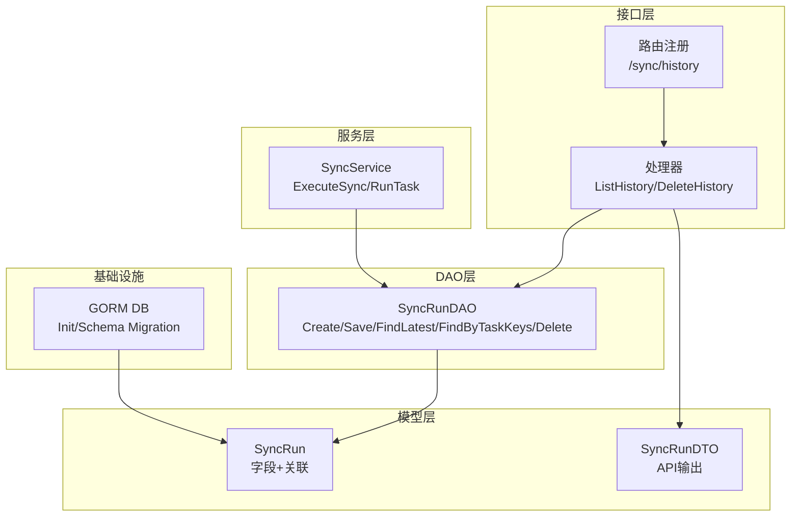
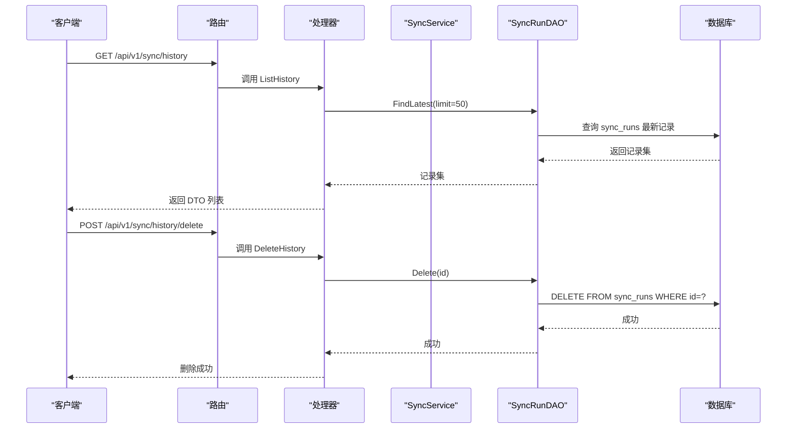
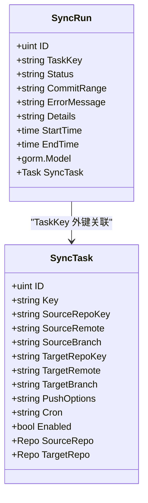
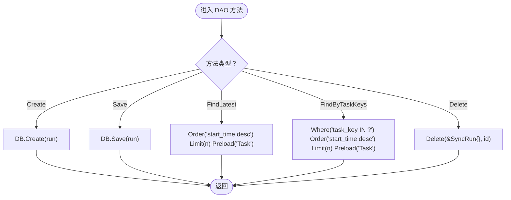
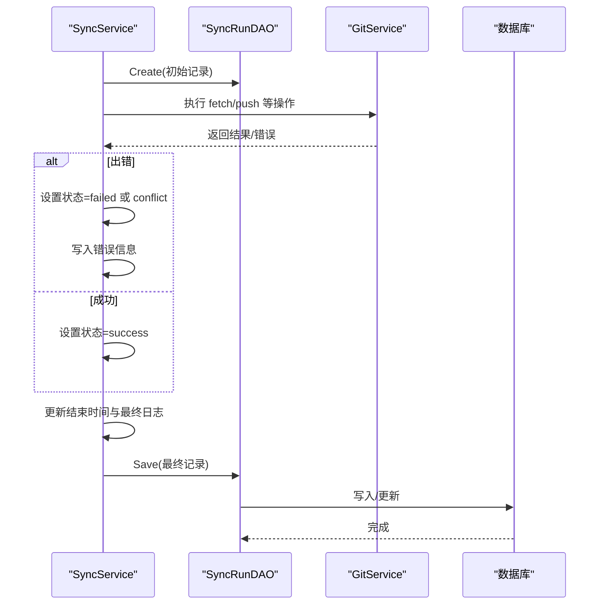
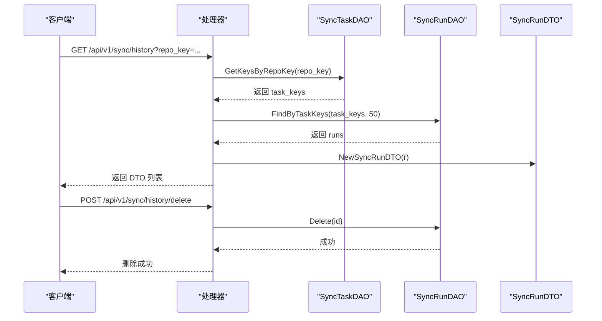
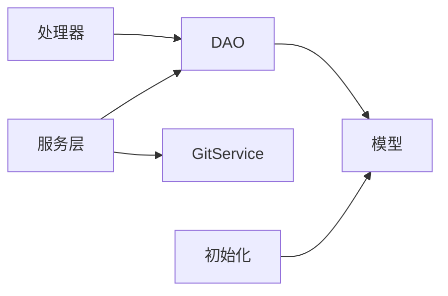

# 同步执行记录DAO

<cite>
**本文引用的文件列表**
- [sync_run_dao.go](file://biz/dal/db/sync_run_dao.go)
- [sync_run.go](file://biz/model/po/sync_run.go)
- [sync.go](file://biz/model/api/sync.go)
- [sync_service.go](file://biz/service/sync/sync_service.go)
- [init.go](file://biz/dal/db/init.go)
- [sync.go](file://biz/router/sync/sync.go)
- [sync_service.go](file://biz/handler/sync/sync_service.go)
- [sync_task.go](file://biz/model/po/sync_task.go)
</cite>

## 目录
1. [简介](#简介)
2. [项目结构](#项目结构)
3. [核心组件](#核心组件)
4. [架构总览](#架构总览)
5. [详细组件分析](#详细组件分析)
6. [依赖关系分析](#依赖关系分析)
7. [性能考虑](#性能考虑)
8. [故障排查指南](#故障排查指南)
9. [结论](#结论)
10. [附录](#附录)

## 简介
本文件聚焦“同步执行记录DAO”的技术实现，系统性阐述同步执行记录的数据模型设计、执行状态跟踪机制、创建/查询/统计能力（按任务、时间范围、状态统计）、执行结果记录与错误信息存储、性能指标采集、批量处理与历史清理/归档策略、监控聚合与异常检测、性能优化与索引设计、以及与同步服务的集成与一致性保障。目标是帮助开发者与运维人员快速理解并高效使用该模块。

## 项目结构
围绕“同步执行记录DAO”，涉及以下关键层次：
- 数据模型层：PO（持久化对象）定义了执行记录的字段与关联关系
- DAO 层：封装数据库访问操作（创建、保存、查询、删除）
- 服务层：编排执行流程，生成执行记录并写入数据库
- 处理器层：对外暴露REST接口，调用DAO进行查询与删除
- 初始化层：数据库连接与自动迁移

图表来源
- [sync.go](file://biz/router/sync/sync.go#L17-L40)
- [sync_service.go](file://biz/handler/sync/sync_service.go#L202-L233)
- [sync_run_dao.go](file://biz/dal/db/sync_run_dao.go#L7-L39)
- [sync_run.go](file://biz/model/po/sync_run.go#L9-L21)
- [sync.go](file://biz/model/api/sync.go#L9-L40)
- [init.go](file://biz/dal/db/init.go#L18-L71)

章节来源
- [sync.go](file://biz/router/sync/sync.go#L17-L40)
- [sync_service.go](file://biz/handler/sync/sync_service.go#L202-L233)
- [sync_run_dao.go](file://biz/dal/db/sync_run_dao.go#L7-L39)
- [sync_run.go](file://biz/model/po/sync_run.go#L9-L21)
- [sync.go](file://biz/model/api/sync.go#L9-L40)
- [init.go](file://biz/dal/db/init.go#L18-L71)

## 核心组件
- 数据模型 SyncRun：包含任务键、状态、提交范围、错误信息、执行日志、起止时间等，并与 SyncTask 建立外键关联
- DAO SyncRunDAO：提供创建、保存、按最新排序查询、按任务键集合查询、删除等方法
- 服务 SyncService：在执行同步时创建初始记录，记录日志与错误，最终更新状态与结束时间
- 处理器 Handler：对外提供历史查询与删除接口，内部调用 DAO
- 初始化 Init：负责数据库连接与表迁移

章节来源
- [sync_run.go](file://biz/model/po/sync_run.go#L9-L21)
- [sync_run_dao.go](file://biz/dal/db/sync_run_dao.go#L7-L39)
- [sync_service.go](file://biz/service/sync/sync_service.go#L35-L74)
- [sync_service.go](file://biz/handler/sync/sync_service.go#L202-L233)
- [init.go](file://biz/dal/db/init.go#L18-L71)

## 架构总览
下图展示从接口到DAO再到模型与数据库的整体交互路径，以及服务层如何驱动DAO完成执行记录的生命周期管理。

图表来源
- [sync.go](file://biz/router/sync/sync.go#L27-L29)
- [sync_service.go](file://biz/handler/sync/sync_service.go#L202-L233)
- [sync_service.go](file://biz/handler/sync/sync_service.go#L235-L257)
- [sync_run_dao.go](file://biz/dal/db/sync_run_dao.go#L21-L39)
- [init.go](file://biz/dal/db/init.go#L49-L71)

## 详细组件分析

### 数据模型：SyncRun
- 字段设计
  - 任务键：用于关联任务
  - 状态：success/failure/conflict
  - 提交范围：记录本次同步涉及的提交区间
  - 错误信息：失败或冲突时记录
  - 执行详情：文本类型，存储完整日志
  - 时间戳：开始/结束时间
- 关联关系
  - 与 SyncTask 通过 TaskKey 外键关联，便于查询时预加载任务信息
- 表名
  - 固定为 sync_runs

图表来源
- [sync_run.go](file://biz/model/po/sync_run.go#L9-L21)
- [sync_task.go](file://biz/model/po/sync_task.go#L8-L24)

章节来源
- [sync_run.go](file://biz/model/po/sync_run.go#L9-L21)
- [sync_task.go](file://biz/model/po/sync_task.go#L8-L24)

### DAO：SyncRunDAO
- 方法职责
  - Create：创建执行记录（初始状态 running）
  - Save：保存最终状态与结束时间
  - FindLatest：按开始时间倒序取最近 N 条，支持预加载任务
  - FindByTaskKeys：按任务键集合查询，限制数量，支持预加载任务
  - Delete：按主键删除
- 查询特点
  - 使用 GORM 的 Where/Order/Limit/Preload 组合，确保查询效率与关联数据一次性加载
  - FindByTaskKeys 对空集合返回空结果，避免无效查询

图表来源
- [sync_run_dao.go](file://biz/dal/db/sync_run_dao.go#L13-L39)

章节来源
- [sync_run_dao.go](file://biz/dal/db/sync_run_dao.go#L7-L39)

### 服务层：SyncService 执行流程
- 生命周期
  - 创建初始记录（状态 running，开始时间）
  - 执行同步逻辑（抓取源/目标、计算提交范围、快进检查、推送）
  - 根据结果设置状态（success/failed/conflict），记录错误信息与日志
  - 更新结束时间与最终日志，保存记录
- 日志与错误
  - 使用字符串构建器累积日志，包含命令行与进度信息
  - 错误信息直接写入 ErrorMessage；冲突场景单独标记为 conflict
- 关联任务
  - 在执行前读取任务信息，确保上下文一致

图表来源
- [sync_service.go](file://biz/service/sync/sync_service.go#L35-L74)
- [sync_run_dao.go](file://biz/dal/db/sync_run_dao.go#L13-L19)

章节来源
- [sync_service.go](file://biz/service/sync/sync_service.go#L35-L74)

### 处理器层：历史查询与删除
- 历史查询
  - 支持按仓库键过滤：先查询该仓库的所有任务键，再按任务键集合查询执行记录
  - 未传仓库键：查询全局最近 50 条
  - 查询结果转换为 API DTO，包含任务信息
- 历史删除
  - 接收 id 参数，调用 DAO 删除对应记录

图表来源
- [sync_service.go](file://biz/handler/sync/sync_service.go#L202-L233)
- [sync_service.go](file://biz/handler/sync/sync_service.go#L235-L257)
- [sync.go](file://biz/model/api/sync.go#L23-L40)

章节来源
- [sync_service.go](file://biz/handler/sync/sync_service.go#L202-L233)
- [sync_service.go](file://biz/handler/sync/sync_service.go#L235-L257)
- [sync.go](file://biz/model/api/sync.go#L23-L40)

### 数据库初始化与迁移
- 连接与方言
  - 支持 MySQL、Postgres、SQLite，根据配置选择
- 自动迁移
  - 若检测到表存在则跳过迁移，否则自动迁移 SyncRun、SyncTask、Repo、AuditLog、SystemConfig、CommitStat 等表
- 兼容性
  - 避免重复迁移，减少部署风险

章节来源
- [init.go](file://biz/dal/db/init.go#L18-L71)

## 依赖关系分析
- 模块耦合
  - 处理器依赖 DAO；DAO 依赖模型；服务层同时依赖 DAO 与 Git 服务
  - 模型与 DAO 之间通过 GORM 映射，强关联但解耦良好
- 外部依赖
  - GORM 作为 ORM；GitService 作为外部同步引擎
- 可能的循环依赖
  - 当前结构清晰，无明显循环依赖

图表来源
- [sync_service.go](file://biz/handler/sync/sync_service.go#L202-L233)
- [sync_run_dao.go](file://biz/dal/db/sync_run_dao.go#L7-L39)
- [sync_service.go](file://biz/service/sync/sync_service.go#L35-L74)
- [init.go](file://biz/dal/db/init.go#L18-L71)

章节来源
- [sync_service.go](file://biz/handler/sync/sync_service.go#L202-L233)
- [sync_run_dao.go](file://biz/dal/db/sync_run_dao.go#L7-L39)
- [sync_service.go](file://biz/service/sync/sync_service.go#L35-L74)
- [init.go](file://biz/dal/db/init.go#L18-L71)

## 性能考虑
- 查询优化
  - FindLatest/FindByTaskKeys 已使用 Order/Limit/Preload，建议在 TaskKey 与 StartTime 上建立复合索引以提升排序与过滤性能
  - 对于高频查询，可考虑对 Status 建立独立索引，便于按状态统计
- 日志存储
  - Details 字段为 TEXT 类型，建议控制单次执行日志大小，必要时拆分或压缩
- 批量处理
  - DAO 层未提供批量插入/更新方法，如需大批量导入，可在上层组装后逐条 Create/Save，或扩展 DAO 支持批量操作
- 缓存策略
  - 可引入短期缓存（如内存缓存）存放最近执行记录，降低热点查询压力
- 清理与归档
  - 提供 Delete 接口，建议结合业务策略定期清理旧记录；对于超大体量，可考虑分区/归档策略（例如按月归档）

章节来源
- [sync_run_dao.go](file://biz/dal/db/sync_run_dao.go#L21-L39)
- [sync_service.go](file://biz/service/sync/sync_service.go#L35-L74)

## 故障排查指南
- 常见问题
  - 查询不到记录：确认是否传入正确的 repo_key，或是否存在该仓库的任务键
  - 删除失败：确认 id 是否有效，数据库权限是否足够
  - 执行记录状态异常：检查服务层错误分支与冲突判断逻辑
- 排查步骤
  - 查看处理器返回的 DTO 中的状态与错误信息
  - 检查 DAO 的查询条件与参数
  - 核对数据库中 sync_runs 表的索引与数据完整性
- 监控建议
  - 记录 DAO 调用耗时与错误率
  - 对高频查询增加慢查询告警

章节来源
- [sync_service.go](file://biz/handler/sync/sync_service.go#L202-L233)
- [sync_service.go](file://biz/handler/sync/sync_service.go#L235-L257)
- [sync_run_dao.go](file://biz/dal/db/sync_run_dao.go#L21-L39)

## 结论
同步执行记录DAO通过简洁的数据模型与清晰的DAO方法，支撑了完整的执行生命周期管理。配合服务层的日志与状态追踪、处理器层的查询与删除接口，以及初始化层的数据库迁移，形成了稳定可靠的执行记录体系。建议后续在索引设计、批量处理、缓存与清理策略方面进一步优化，以满足更大规模的生产需求。

## 附录

### API 定义（摘要）
- 历史查询
  - GET /api/v1/sync/history
  - 支持查询参数：repo_key（可选）
  - 返回：SyncRunDTO 数组
- 历史删除
  - POST /api/v1/sync/history/delete
  - 请求体：{ id: number }
  - 返回：删除成功消息

章节来源
- [sync.go](file://biz/router/sync/sync.go#L27-L29)
- [sync_service.go](file://biz/handler/sync/sync_service.go#L202-L233)
- [sync_service.go](file://biz/handler/sync/sync_service.go#L235-L257)

### 数据模型字段说明
- SyncRun
  - TaskKey：任务键
  - Status：执行状态（success/failed/conflict）
  - CommitRange：提交范围
  - ErrorMessage：错误信息
  - Details：执行日志
  - StartTime/EndTime：开始/结束时间
  - Task：关联任务对象（预加载）

章节来源
- [sync_run.go](file://biz/model/po/sync_run.go#L9-L21)
- [sync.go](file://biz/model/api/sync.go#L9-L21)