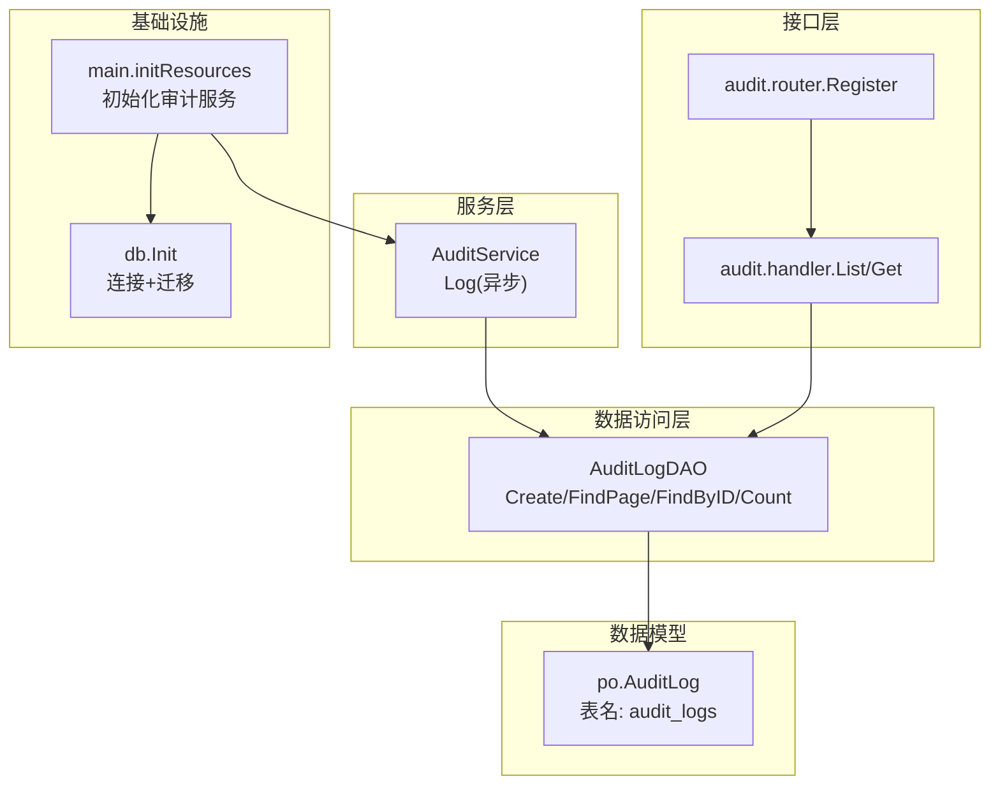
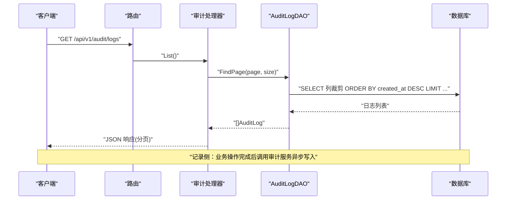
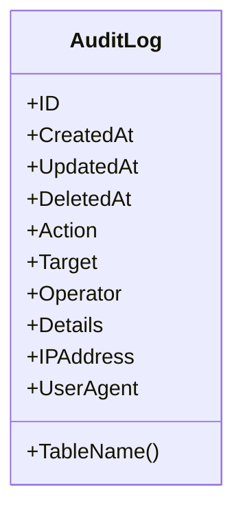
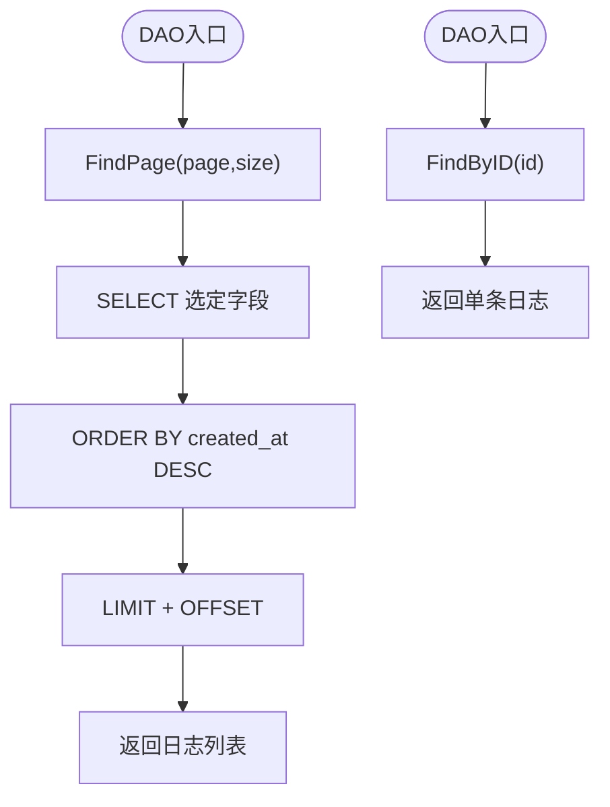
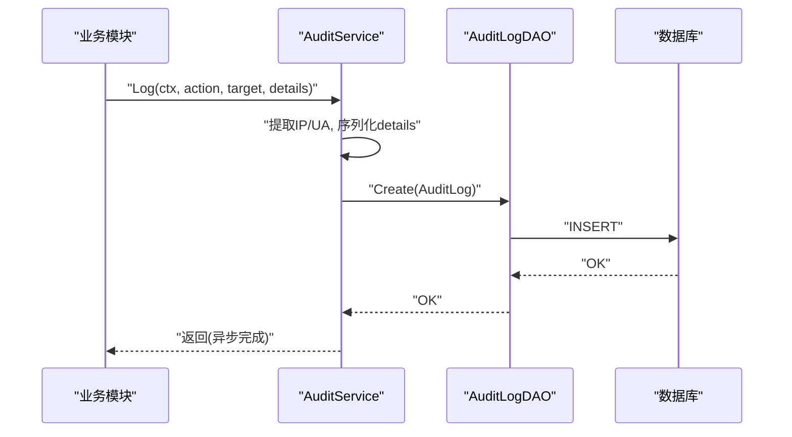
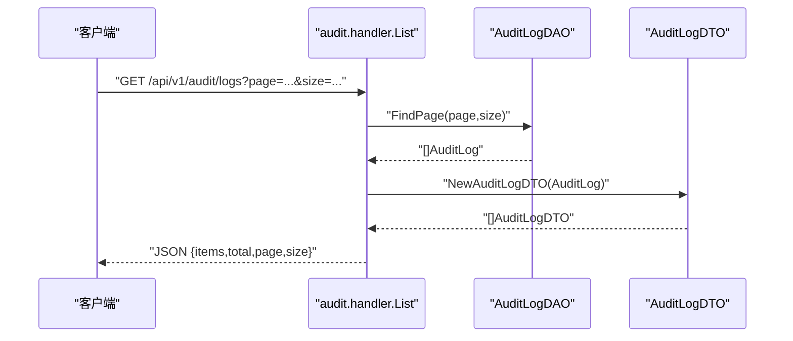
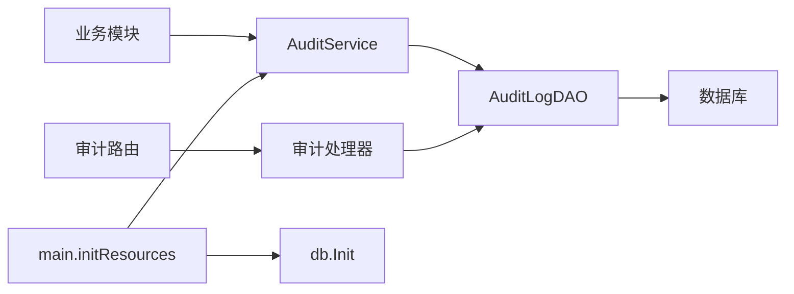

# 审计日志DAO

<cite>
**本文引用的文件**
- [biz/dal/db/audit_log_dao.go](file://biz/dal/db/audit_log_dao.go)
- [biz/model/po/audit.go](file://biz/model/po/audit.go)
- [biz/model/api/audit.go](file://biz/model/api/audit.go)
- [biz/service/audit/audit_service.go](file://biz/service/audit/audit_service.go)
- [biz/handler/audit/audit_service.go](file://biz/handler/audit/audit_service.go)
- [biz/router/audit/audit.go](file://biz/router/audit/audit.go)
- [biz/dal/db/init.go](file://biz/dal/db/init.go)
- [main.go](file://main.go)
- [biz/handler/repo/repo_service.go](file://biz/handler/repo/repo_service.go)
- [biz/handler/branch/branch_service.go](file://biz/handler/branch/branch_service.go)
- [biz/handler/sync/sync_service.go](file://biz/handler/sync/sync_service.go)
</cite>

## 目录
1. [简介](#简介)
2. [项目结构](#项目结构)
3. [核心组件](#核心组件)
4. [架构总览](#架构总览)
5. [组件详细分析](#组件详细分析)
6. [依赖关系分析](#依赖关系分析)
7. [性能与可扩展性](#性能与可扩展性)
8. [故障排查指南](#故障排查指南)
9. [结论](#结论)
10. [附录：API与数据模型](#附录api与数据模型)

## 简介
本文件聚焦“审计日志DAO”的数据访问对象实现，系统化阐述审计日志的数据模型设计、记录与查询能力、过滤与统计分析思路、性能优化策略（索引、分页、字段裁剪）、以及与业务模块的集成方式。当前实现支持：
- 记录：在关键业务操作后异步写入审计日志
- 查询：分页列表（含字段裁剪）、按ID查询、统计总数
- 过滤：通过业务层参数进行简单过滤（如按目标标识）
- 统计与报表：基于现有接口可扩展聚合统计
- 性能：分页时排除大字段以降低网络与序列化开销
- 集成：统一由审计服务封装，业务模块仅需调用即可完成记录

注意：当前DAO未提供按用户、时间范围、操作类型等复杂条件的原生查询方法，后续可在DAO层增加相应查询函数以满足更细粒度的审计需求。

## 项目结构
围绕审计日志DAO的关键文件组织如下：
- 数据模型：po 层定义审计日志实体及表名
- DAO：提供创建、分页查询、按ID查询、统计总数等基础能力
- 服务：封装审计记录流程，负责从请求上下文提取IP/UA，并异步落库
- 处理器：提供审计日志列表与详情的HTTP接口
- 路由：注册审计相关路由
- 初始化：数据库连接与自动迁移，确保审计日志表存在

图表来源
- [biz/dal/db/audit_log_dao.go](file://biz/dal/db/audit_log_dao.go#L1-L46)
- [biz/model/po/audit.go](file://biz/model/po/audit.go#L1-L21)
- [biz/service/audit/audit_service.go](file://biz/service/audit/audit_service.go#L1-L51)
- [biz/handler/audit/audit_service.go](file://biz/handler/audit/audit_service.go#L1-L77)
- [biz/router/audit/audit.go](file://biz/router/audit/audit.go#L1-L32)
- [biz/dal/db/init.go](file://biz/dal/db/init.go#L1-L72)
- [main.go](file://main.go#L115-L134)

章节来源
- [biz/dal/db/audit_log_dao.go](file://biz/dal/db/audit_log_dao.go#L1-L46)
- [biz/model/po/audit.go](file://biz/model/po/audit.go#L1-L21)
- [biz/service/audit/audit_service.go](file://biz/service/audit/audit_service.go#L1-L51)
- [biz/handler/audit/audit_service.go](file://biz/handler/audit/audit_service.go#L1-L77)
- [biz/router/audit/audit.go](file://biz/router/audit/audit.go#L1-L32)
- [biz/dal/db/init.go](file://biz/dal/db/init.go#L1-L72)
- [main.go](file://main.go#L115-L134)

## 核心组件
- 审计日志数据模型（PO）：包含操作动作、目标标识、操作者、详情（JSON字符串）、IP地址、User-Agent、以及通用时间戳字段；表名为 audit_logs；对 Action 与 Target 字段声明了索引以便后续查询优化。
- DAO：提供创建、分页查询（含字段裁剪）、按ID查询、统计总数等方法；分页查询默认排除大字段以提升性能。
- 审计服务：封装记录流程，从请求上下文提取客户端IP与UA，构造日志条目，采用异步方式写入数据库。
- 处理器：提供审计日志列表与详情接口，支持分页参数与返回DTO转换。
- 路由：注册审计相关HTTP路由。
- 初始化：统一初始化数据库连接与迁移，确保审计日志表存在。

章节来源
- [biz/model/po/audit.go](file://biz/model/po/audit.go#L7-L21)
- [biz/dal/db/audit_log_dao.go](file://biz/dal/db/audit_log_dao.go#L13-L45)
- [biz/service/audit/audit_service.go](file://biz/service/audit/audit_service.go#L23-L50)
- [biz/handler/audit/audit_service.go](file://biz/handler/audit/audit_service.go#L16-L76)
- [biz/router/audit/audit.go](file://biz/router/audit/audit.go#L17-L31)
- [biz/dal/db/init.go](file://biz/dal/db/init.go#L54-L71)

## 架构总览
审计日志从“业务操作”到“持久化”的整体链路如下：

图表来源
- [biz/router/audit/audit.go](file://biz/router/audit/audit.go#L25-L28)
- [biz/handler/audit/audit_service.go](file://biz/handler/audit/audit_service.go#L18-L52)
- [biz/dal/db/audit_log_dao.go](file://biz/dal/db/audit_log_dao.go#L29-L39)

章节来源
- [biz/router/audit/audit.go](file://biz/router/audit/audit.go#L17-L31)
- [biz/handler/audit/audit_service.go](file://biz/handler/audit/audit_service.go#L16-L76)
- [biz/dal/db/audit_log_dao.go](file://biz/dal/db/audit_log_dao.go#L13-L45)

## 组件详细分析

### 数据模型（PO）与表结构
- 关键字段与约束：
  - 主键：自增ID
  - 操作动作：字符串，带索引
  - 目标标识：字符串，带索引
  - 操作者：字符串
  - 详情：文本型JSON字符串
  - IP地址与User-Agent：字符串
  - 时间戳：Created/Updated/Deleted
- 表名：audit_logs
- 设计要点：
  - 对 Action 与 Target 建立索引，便于后续按操作类型或目标维度检索
  - Details 使用text类型，适合保存变更前后对比或复杂上下文
  - Operator 当前为“system”，待接入鉴权后替换为真实用户标识

图表来源
- [biz/model/po/audit.go](file://biz/model/po/audit.go#L8-L21)

章节来源
- [biz/model/po/audit.go](file://biz/model/po/audit.go#L7-L21)

### DAO：审计日志数据访问对象
- 方法概览：
  - Create：插入一条审计日志
  - FindLatest：按时间倒序取最新N条
  - Count：统计总条数
  - FindPage：分页查询（默认列裁剪，不返回Details）
  - FindByID：按ID查询单条
- 性能特性：
  - 分页查询显式选择少量字段，避免传输Details大字段，降低网络与序列化成本
  - 默认按创建时间倒序，满足“最近优先”的审计查看习惯
- 可扩展建议：
  - 增加按操作类型、目标、用户、时间范围的条件查询
  - 增加分组统计（如按天/小时/操作类型统计数量）

图表来源
- [biz/dal/db/audit_log_dao.go](file://biz/dal/db/audit_log_dao.go#L29-L39)
- [biz/dal/db/audit_log_dao.go](file://biz/dal/db/audit_log_dao.go#L41-L45)

章节来源
- [biz/dal/db/audit_log_dao.go](file://biz/dal/db/audit_log_dao.go#L13-L45)

### 服务：审计服务（记录）
- 职责：
  - 从请求上下文提取客户端IP与UA
  - 将业务详情序列化为JSON字符串
  - 异步写入数据库（go协程）
- 注意事项：
  - 异步写入可能带来“丢失风险”，若需要强一致审计，可改为同步写入
  - Operator 当前固定为“system”，待鉴权模块上线后替换为真实用户

图表来源
- [biz/service/audit/audit_service.go](file://biz/service/audit/audit_service.go#L23-L50)
- [biz/dal/db/audit_log_dao.go](file://biz/dal/db/audit_log_dao.go#L13-L15)

章节来源
- [biz/service/audit/audit_service.go](file://biz/service/audit/audit_service.go#L23-L50)

### 处理器：审计日志查询接口
- 列表接口：
  - 支持 page/page_size 参数
  - 调用DAO分页查询与总数统计
  - 返回 items、total、page、size
- 详情接口：
  - 支持 id 参数
  - 调用DAO按ID查询
  - 返回单条日志的DTO
- DTO转换：
  - 将PO转换为对外可见的DTO，避免直接暴露内部字段

图表来源
- [biz/handler/audit/audit_service.go](file://biz/handler/audit/audit_service.go#L18-L52)
- [biz/model/api/audit.go](file://biz/model/api/audit.go#L20-L31)

章节来源
- [biz/handler/audit/audit_service.go](file://biz/handler/audit/audit_service.go#L16-L76)
- [biz/model/api/audit.go](file://biz/model/api/audit.go#L9-L31)

### 路由与初始化
- 路由注册：
  - /api/v1/audit/logs：列表
  - /api/v1/audit/log：详情
- 初始化：
  - main中初始化配置、数据库、加密工具、业务服务（含审计服务）
  - db.Init中根据配置选择驱动并执行自动迁移，确保审计日志表存在

章节来源
- [biz/router/audit/audit.go](file://biz/router/audit/audit.go#L17-L31)
- [main.go](file://main.go#L115-L134)
- [biz/dal/db/init.go](file://biz/dal/db/init.go#L18-L71)

## 依赖关系分析
- 低耦合高内聚：
  - DAO仅依赖GORM与PO，职责单一
  - 服务层封装记录流程，屏蔽上下文细节
  - 处理器仅负责参数解析与响应封装
- 关键依赖链：
  - 业务模块 -> 审计服务 -> DAO -> 数据库
  - 审计处理器 -> DAO -> 数据库
- 可能的改进点：
  - DAO层可增加按条件查询的方法，减少业务层重复SQL拼接
  - 引入统一的查询参数模型，便于扩展过滤条件

图表来源
- [biz/service/audit/audit_service.go](file://biz/service/audit/audit_service.go#L17-L21)
- [biz/dal/db/audit_log_dao.go](file://biz/dal/db/audit_log_dao.go#L1-L11)
- [biz/handler/audit/audit_service.go](file://biz/handler/audit/audit_service.go#L18-L29)
- [biz/router/audit/audit.go](file://biz/router/audit/audit.go#L25-L28)
- [main.go](file://main.go#L123-L131)

章节来源
- [biz/service/audit/audit_service.go](file://biz/service/audit/audit_service.go#L11-L21)
- [biz/dal/db/audit_log_dao.go](file://biz/dal/db/audit_log_dao.go#L7-L11)
- [biz/handler/audit/audit_service.go](file://biz/handler/audit/audit_service.go#L18-L29)
- [biz/router/audit/audit.go](file://biz/router/audit/audit.go#L17-L31)
- [main.go](file://main.go#L123-L131)

## 性能与可扩展性
- 已有优化
  - 分页查询默认排除Details字段，降低I/O与序列化开销
  - 按创建时间倒序，满足审计查看的时序需求
- 建议的索引与查询扩展
  - 在 Action、Target、Operator、IPAddress、UserAgent 上建立合适索引，支撑常见过滤场景
  - 在 CreatedAt 上建立索引，保证分页排序高效
  - DAO层新增按操作类型、目标、用户、时间范围的条件查询方法
- 缓存策略
  - 对高频查询结果（如最近N条）可引入短期缓存，但需考虑审计数据一致性要求
- 批量处理
  - 若未来需要批量导入/回放审计数据，可在DAO层增加批量写入方法
- 日志轮转与归档
  - 建议结合业务量制定归档策略（如按月归档），DAO层预留“清理/归档”接口
- 统计与报表
  - 可在DAO层增加分组统计方法（如按天/类型统计），供上层生成报表

[本节为通用性能指导，无需特定文件引用]

## 故障排查指南
- 常见问题与定位
  - 数据库连接失败：检查db.Init中的DSN/驱动配置
  - 表不存在：确认db.Init是否执行自动迁移
  - 审计记录未入库：检查AuditService.Log是否被调用且未报错；当前为异步写入，若需强一致可改为同步
  - 列表为空：确认page/size参数是否合理；检查是否有数据
  - 详情查询失败：确认id参数是否正确
- 排查步骤
  - 查看初始化日志：确认db.Init与AuditService初始化成功
  - 观察业务调用链：确认业务模块是否调用了审计服务
  - 检查DAO层错误：捕获并记录DAO层返回的错误
  - 核对表结构：确认audit_logs表已创建且包含必要字段与索引

章节来源
- [biz/dal/db/init.go](file://biz/dal/db/init.go#L18-L71)
- [biz/service/audit/audit_service.go](file://biz/service/audit/audit_service.go#L44-L50)
- [biz/handler/audit/audit_service.go](file://biz/handler/audit/audit_service.go#L18-L76)

## 结论
当前审计日志DAO实现了简洁高效的审计记录与查询能力：以PO定义清晰的数据模型，DAO提供基础的CRUD与分页查询，服务层封装记录流程并采用异步写入，处理器提供标准的HTTP接口。建议后续在DAO层补充按操作类型、目标、用户、时间范围的条件查询与统计方法，并完善索引设计与缓存策略，以满足更复杂的审计分析与合规需求。

[本节为总结性内容，无需特定文件引用]

## 附录：API与数据模型

### 审计日志数据模型（PO）
- 字段说明
  - ID：主键
  - Action：操作类型（CREATE/UPDATE/DELETE/SYNC等），带索引
  - Target：目标标识（如 repo:123 或 task:abc），带索引
  - Operator：操作者（当前为“system”，待鉴权）
  - Details：JSON格式的变更详情或上下文
  - IPAddress：客户端IP
  - UserAgent：客户端UA
  - 时间戳：CreatedAt/UpdatedAt/DeletedAt
- 表名：audit_logs

章节来源
- [biz/model/po/audit.go](file://biz/model/po/audit.go#L8-L21)

### 审计日志DTO
- 用途：对外返回，避免泄露内部字段
- 字段：id、action、target、operator、details、ip_address、user_agent、created_at

章节来源
- [biz/model/api/audit.go](file://biz/model/api/audit.go#L9-L31)

### 审计服务接口
- Log(c, action, target, details)
  - 从请求上下文提取IP/UA
  - 将details序列化为JSON字符串
  - 异步调用DAO写入

章节来源
- [biz/service/audit/audit_service.go](file://biz/service/audit/audit_service.go#L23-L50)

### 审计处理器接口
- GET /api/v1/audit/logs
  - 查询参数：page、page_size
  - 返回：items、total、page、size
- GET /api/v1/audit/log
  - 查询参数：id
  - 返回：单条审计日志

章节来源
- [biz/handler/audit/audit_service.go](file://biz/handler/audit/audit_service.go#L16-L76)

### 审计DAO方法
- Create(log)
- FindLatest(limit)
- Count()
- FindPage(page, pageSize)
- FindByID(id)

章节来源
- [biz/dal/db/audit_log_dao.go](file://biz/dal/db/audit_log_dao.go#L13-L45)

### 与业务模块的集成示例
- 仓库管理：创建/更新/删除后记录审计日志
- 分支管理：创建/删除/更新/检出/推送/拉取/合并等操作均记录审计
- 同步任务：创建/更新/删除/执行同步等操作记录审计

章节来源
- [biz/handler/repo/repo_service.go](file://biz/handler/repo/repo_service.go#L115-L115)
- [biz/handler/repo/repo_service.go](file://biz/handler/repo/repo_service.go#L202-L202)
- [biz/handler/repo/repo_service.go](file://biz/handler/repo/repo_service.go#L235-L235)
- [biz/handler/branch/branch_service.go](file://biz/handler/branch/branch_service.go#L119-L122)
- [biz/handler/branch/branch_service.go](file://biz/handler/branch/branch_service.go#L151-L154)
- [biz/handler/branch/branch_service.go](file://biz/handler/branch/branch_service.go#L197-L201)
- [biz/handler/branch/branch_service.go](file://biz/handler/branch/branch_service.go#L229-L232)
- [biz/handler/branch/branch_service.go](file://biz/handler/branch/branch_service.go#L268-L271)
- [biz/handler/branch/branch_service.go](file://biz/handler/branch/branch_service.go#L345-L348)
- [biz/handler/branch/branch_service.go](file://biz/handler/branch/branch_service.go#L490-L493)
- [biz/handler/sync/sync_service.go](file://biz/handler/sync/sync_service.go#L79-L79)
- [biz/handler/sync/sync_service.go](file://biz/handler/sync/sync_service.go#L117-L117)
- [biz/handler/sync/sync_service.go](file://biz/handler/sync/sync_service.go#L142-L142)
- [biz/handler/sync/sync_service.go](file://biz/handler/sync/sync_service.go#L161-L161)
- [biz/handler/sync/sync_service.go](file://biz/handler/sync/sync_service.go#L198-L198)