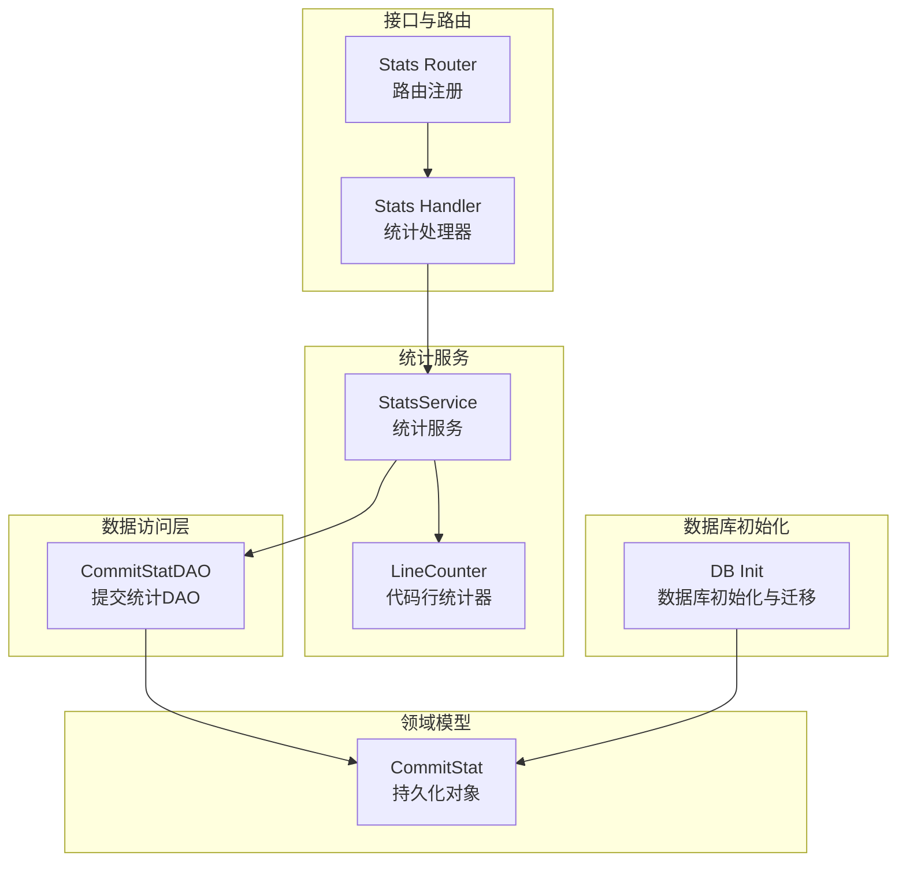
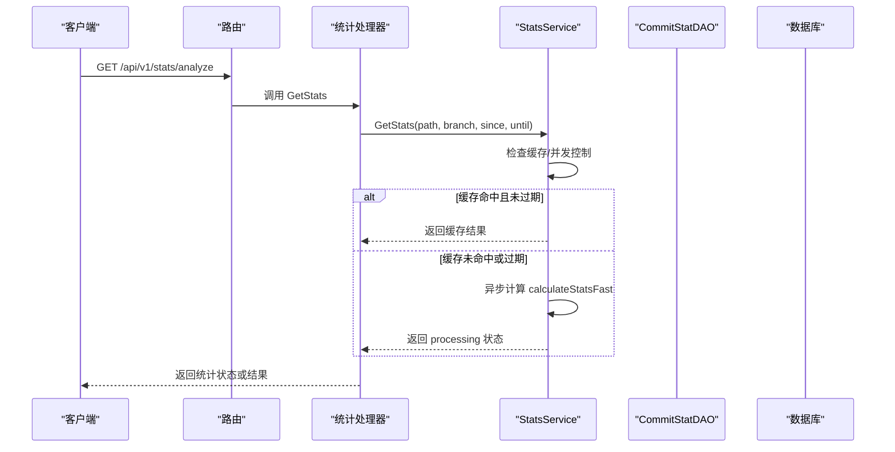
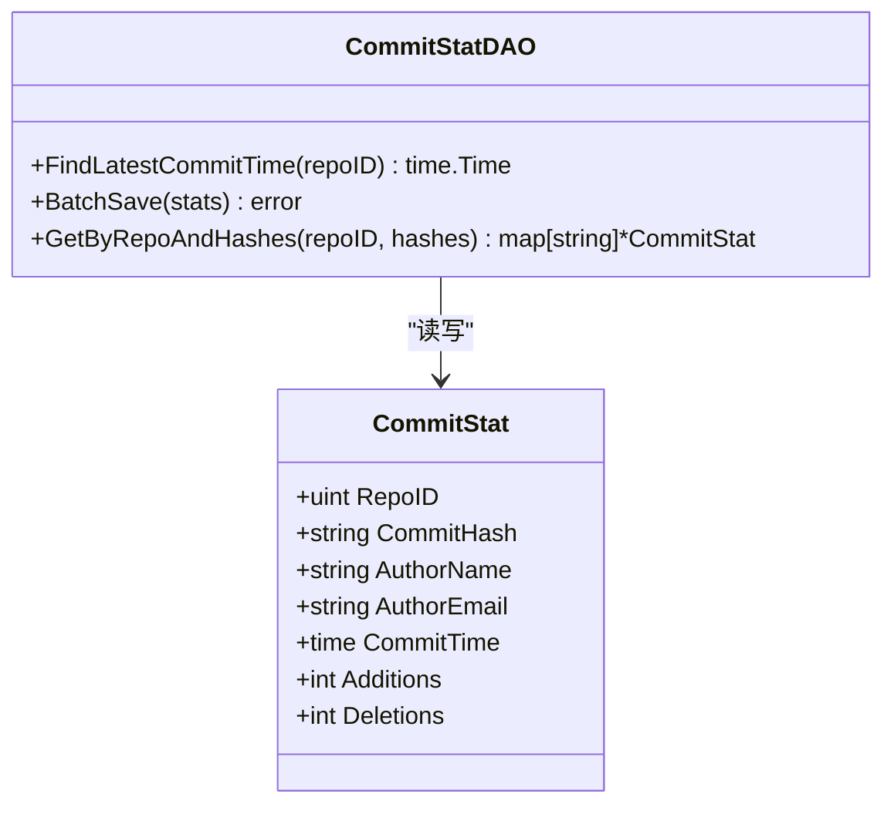
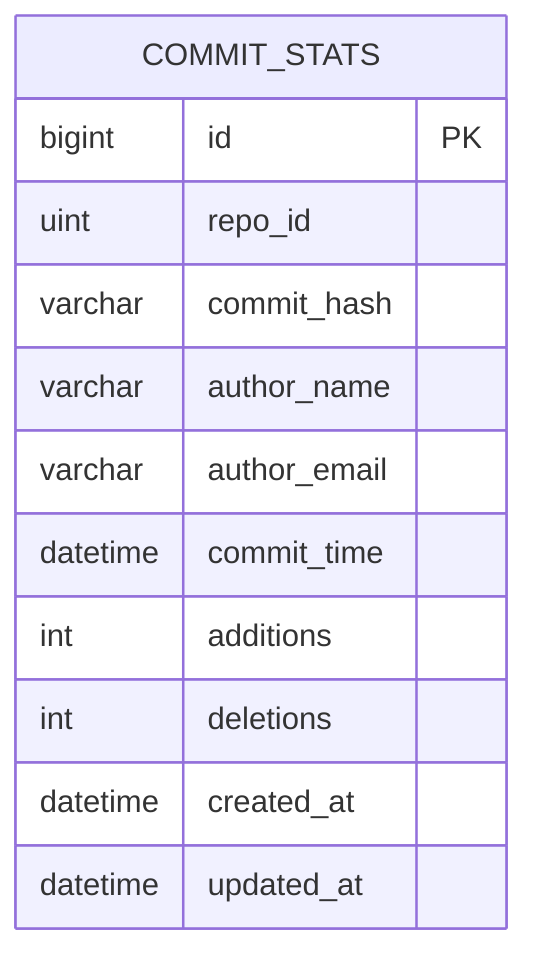
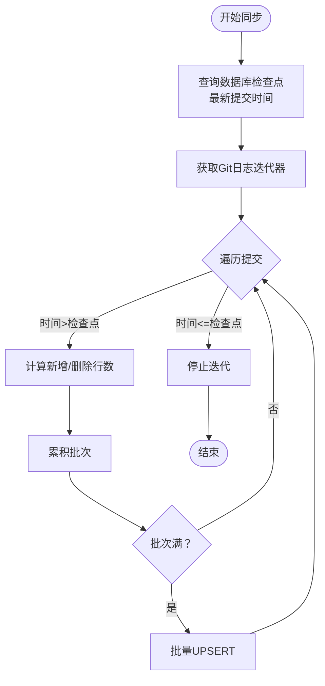
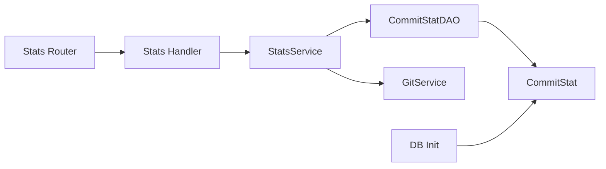

# 提交统计DAO

<cite>
**本文引用的文件**   
- [biz/dal/db/commit_stat_dao.go](file://biz/dal/db/commit_stat_dao.go)
- [biz/model/po/commit_stat.go](file://biz/model/po/commit_stat.go)
- [biz/service/stats/stats_service.go](file://biz/service/stats/stats_service.go)
- [biz/model/api/stats.go](file://biz/model/api/stats.go)
- [biz/dal/db/init.go](file://biz/dal/db/init.go)
- [biz/router/stats/stats.go](file://biz/router/stats/stats.go)
- [biz/handler/stats/stats_service.go](file://biz/handler/stats/stats_service.go)
- [biz/service/stats/line_counter.go](file://biz/service/stats/line_counter.go)
- [biz/service/stats/language_config.go](file://biz/service/stats/language_config.go)
</cite>

## 目录
1. [简介](#简介)
2. [项目结构](#项目结构)
3. [核心组件](#核心组件)
4. [架构总览](#架构总览)
5. [组件详细分析](#组件详细分析)
6. [依赖关系分析](#依赖关系分析)
7. [性能考量](#性能考量)
8. [故障排查指南](#故障排查指南)
9. [结论](#结论)
10. [附录](#附录)

## 简介
本文件聚焦“提交统计DAO”的技术细节，系统阐述提交统计数据模型、统计计算机制与数据访问层实现。内容涵盖：
- 数据模型设计与索引策略
- 统计数据的生成、增量更新与查询
- 按时间范围、按用户、按仓库的统计维度
- 缓存策略、并发控制与一致性保障
- 批量处理、历史数据维护与性能优化
- 趋势分析与异常检测思路
- 存储优化、索引设计与查询性能提升
- 与统计服务的集成模式与数据一致性机制

## 项目结构
围绕提交统计DAO的关键模块与文件如下：
- 数据访问层：biz/dal/db/commit_stat_dao.go
- 数据模型：biz/model/po/commit_stat.go
- 统计服务：biz/service/stats/stats_service.go
- API模型：biz/model/api/stats.go
- 初始化与迁移：biz/dal/db/init.go
- 路由注册：biz/router/stats/stats.go
- 处理器：biz/handler/stats/stats_service.go
- 代码行统计（补充能力）：biz/service/stats/line_counter.go、biz/service/stats/language_config.go

图表来源
- [biz/dal/db/commit_stat_dao.go](file://biz/dal/db/commit_stat_dao.go#L1-L66)
- [biz/model/po/commit_stat.go](file://biz/model/po/commit_stat.go#L1-L23)
- [biz/service/stats/stats_service.go](file://biz/service/stats/stats_service.go#L1-L372)
- [biz/router/stats/stats.go](file://biz/router/stats/stats.go#L1-L49)
- [biz/handler/stats/stats_service.go](file://biz/handler/stats/stats_service.go#L1-L360)
- [biz/dal/db/init.go](file://biz/dal/db/init.go#L1-L72)
- [biz/service/stats/line_counter.go](file://biz/service/stats/line_counter.go#L1-L583)

章节来源
- [biz/dal/db/commit_stat_dao.go](file://biz/dal/db/commit_stat_dao.go#L1-L66)
- [biz/model/po/commit_stat.go](file://biz/model/po/commit_stat.go#L1-L23)
- [biz/service/stats/stats_service.go](file://biz/service/stats/stats_service.go#L1-L372)
- [biz/router/stats/stats.go](file://biz/router/stats/stats.go#L1-L49)
- [biz/handler/stats/stats_service.go](file://biz/handler/stats/stats_service.go#L1-L360)
- [biz/dal/db/init.go](file://biz/dal/db/init.go#L1-L72)
- [biz/service/stats/line_counter.go](file://biz/service/stats/line_counter.go#L1-L583)
- [biz/service/stats/language_config.go](file://biz/service/stats/language_config.go#L1-L373)

## 核心组件
- 提交统计DAO（CommitStatDAO）：负责最新提交时间查询、批量保存、按仓库与哈希集合查询等操作。
- 提交统计模型（CommitStat）：定义提交统计表结构及索引，支撑高效查询与去重。
- 统计服务（StatsService）：封装统计计算流程，包含缓存、并发控制、增量同步与流式解析。
- API模型（AuthorStat/StatsResponse）：对外暴露统计结果结构，支持按作者聚合与趋势分析。
- 数据库初始化（DB Init）：根据配置选择驱动并执行自动迁移，确保表存在。

章节来源
- [biz/dal/db/commit_stat_dao.go](file://biz/dal/db/commit_stat_dao.go#L10-L65)
- [biz/model/po/commit_stat.go](file://biz/model/po/commit_stat.go#L9-L22)
- [biz/service/stats/stats_service.go](file://biz/service/stats/stats_service.go#L39-L50)
- [biz/model/api/stats.go](file://biz/model/api/stats.go#L3-L15)
- [biz/dal/db/init.go](file://biz/dal/db/init.go#L18-L71)

## 架构总览
提交统计DAO位于数据访问层，向上为统计服务提供数据能力；统计服务通过Git日志流进行统计计算，并结合缓存与并发控制提升用户体验；处理器通过路由暴露REST接口，供前端或外部系统调用。

图表来源
- [biz/router/stats/stats.go](file://biz/router/stats/stats.go#L26-L29)
- [biz/handler/stats/stats_service.go](file://biz/handler/stats/stats_service.go#L97-L149)
- [biz/service/stats/stats_service.go](file://biz/service/stats/stats_service.go#L179-L227)

## 组件详细分析

### 提交统计DAO（CommitStatDAO）
职责与方法：
- FindLatestCommitTime：按仓库ID查询最新提交时间，作为增量同步的检查点。
- BatchSave：批量插入或更新提交统计，使用冲突列组合进行UPSERT，避免重复写入。
- GetByRepoAndHashes：按仓库与哈希列表分批查询已有统计，支持后续去重与增量处理。

关键实现要点：
- 冲突键：repo_id + commit_hash 的唯一索引，确保幂等写入。
- 分批写入：CreateInBatches 提升批量写入性能。
- 分块查询：对哈希列表按固定大小切片，降低IN子句长度与查询压力。

图表来源
- [biz/dal/db/commit_stat_dao.go](file://biz/dal/db/commit_stat_dao.go#L16-L65)
- [biz/model/po/commit_stat.go](file://biz/model/po/commit_stat.go#L9-L18)

章节来源
- [biz/dal/db/commit_stat_dao.go](file://biz/dal/db/commit_stat_dao.go#L16-L65)
- [biz/model/po/commit_stat.go](file://biz/model/po/commit_stat.go#L9-L22)

### 提交统计模型（CommitStat）
字段与索引：
- 主键：gorm.Model（含ID、CreatedAt、UpdatedAt、DeletedAt）
- 索引复合键 idx_repo_hash(repo_id, commit_hash)，唯一约束
- 索引：author_email、commit_time
- 字段含义：仓库ID、提交哈希、作者姓名/邮箱、提交时间、新增/删除行数

图表来源
- [biz/model/po/commit_stat.go](file://biz/model/po/commit_stat.go#L9-L22)

章节来源
- [biz/model/po/commit_stat.go](file://biz/model/po/commit_stat.go#L9-L22)

### 统计服务（StatsService）
功能与流程：
- 同步统计（增量）：从数据库检查点（最新提交时间）开始，遍历Git日志，计算每提交的新增/删除行数，批量写入数据库。
- 查询统计（缓存+异步）：按路径、分支、时间范围解析统计，使用内存缓存与并发控制，支持进度反馈。
- 流式解析：使用git log --numstat流式扫描，逐行解析提交与变更，构建作者维度的总贡献、文件类型分布与时间趋势。

关键算法与逻辑：
- 增量同步停止条件：当遇到提交时间早于检查点时提前终止（利用Git日志逆序特性）。
- 去重与幂等：通过唯一索引与UPSERT保证重复提交不产生重复记录。
- 并发与缓存：使用sync.Map存储缓存项，LoadOrStore避免重复计算；定期TTL控制缓存生命周期。
- 进度上报：定时更新缓存中的进度信息，便于前端轮询展示。

图表来源
- [biz/service/stats/stats_service.go](file://biz/service/stats/stats_service.go#L52-L139)

章节来源
- [biz/service/stats/stats_service.go](file://biz/service/stats/stats_service.go#L52-L139)
- [biz/service/stats/stats_service.go](file://biz/service/stats/stats_service.go#L179-L227)
- [biz/service/stats/stats_service.go](file://biz/service/stats/stats_service.go#L245-L371)

### API模型（AuthorStat/StatsResponse）
- AuthorStat：作者维度统计，包含姓名、邮箱、总有效行数、文件类型分布、时间趋势。
- StatsResponse：整体统计响应，包含总行数与作者列表。

章节来源
- [biz/model/api/stats.go](file://biz/model/api/stats.go#L3-L15)

### 数据库初始化（DB Init）
- 支持MySQL、Postgres、SQLite三种驱动，按配置动态选择。
- 若检测到表已存在则跳过迁移，否则执行AutoMigrate，确保CommitStat等表存在。

章节来源
- [biz/dal/db/init.go](file://biz/dal/db/init.go#L18-L71)

### 路由与处理器（Router/Handler）
- 路由注册：提供 /api/v1/stats/analyze、/api/v1/stats/authors、/api/v1/stats/commits、/api/v1/stats/export/csv 等端点。
- 处理器：解析查询参数，调用统计服务，返回统一响应；支持作者过滤与CSV导出。

章节来源
- [biz/router/stats/stats.go](file://biz/router/stats/stats.go#L17-L48)
- [biz/handler/stats/stats_service.go](file://biz/handler/stats/stats_service.go#L97-L149)
- [biz/handler/stats/stats_service.go](file://biz/handler/stats/stats_service.go#L151-L197)

### 代码行统计（补充能力）
- LineCounter：提供代码行统计的异步缓存能力，支持按作者、时间范围、分支、排除规则过滤。
- 语言配置：内置多种语言的注释与字符串界定规则，辅助准确统计代码/注释/空白行。

章节来源
- [biz/service/stats/line_counter.go](file://biz/service/stats/line_counter.go#L1-L583)
- [biz/service/stats/language_config.go](file://biz/service/stats/language_config.go#L1-L373)

## 依赖关系分析
- CommitStatDAO 依赖 GORM 与数据库连接，向上为 StatsService 提供数据能力。
- StatsService 依赖 GitService 获取日志流，依赖 CommitStatDAO 进行数据持久化。
- 处理器依赖 StatsService 与路由注册，向外提供REST接口。
- 初始化模块负责数据库驱动与迁移，确保表结构可用。

图表来源
- [biz/handler/stats/stats_service.go](file://biz/handler/stats/stats_service.go#L1-L360)
- [biz/service/stats/stats_service.go](file://biz/service/stats/stats_service.go#L1-L372)
- [biz/dal/db/commit_stat_dao.go](file://biz/dal/db/commit_stat_dao.go#L1-L66)
- [biz/dal/db/init.go](file://biz/dal/db/init.go#L1-L72)

章节来源
- [biz/handler/stats/stats_service.go](file://biz/handler/stats/stats_service.go#L1-L360)
- [biz/service/stats/stats_service.go](file://biz/service/stats/stats_service.go#L1-L372)
- [biz/dal/db/commit_stat_dao.go](file://biz/dal/db/commit_stat_dao.go#L1-L66)
- [biz/dal/db/init.go](file://biz/dal/db/init.go#L1-L72)

## 性能考量
- 批量写入与UPSERT
  - 使用 CreateInBatches 与 OnConflict.DoUpdates，减少往返次数，提升吞吐。
  - 建议：根据数据库性能调整批次大小，平衡内存占用与写入效率。
- 增量同步
  - 通过 FindLatestCommitTime 与时间比较，避免重复处理，显著降低计算量。
  - 建议：在高并发场景下，配合数据库事务与锁策略，确保检查点一致性。
- 缓存与并发
  - StatsService 使用 sync.Map 与 LoadOrStore 避免重复计算；TTL控制缓存生命周期。
  - 建议：为热点查询增加Redis缓存层，进一步降低数据库压力。
- 查询优化
  - 唯一复合索引 idx_repo_hash(repo_id, commit_hash) 保证幂等写入与高效去重。
  - 索引 author_email、commit_time 支持按作者与时间范围查询。
  - 建议：针对高频查询建立覆盖索引，减少回表与排序成本。
- IO与流式处理
  - 使用 bufio.Scanner 与大缓冲区处理长行，提高Git日志解析吞吐。
  - 建议：对超大仓库启用分片/分区策略，限制单次扫描范围。

[本节为通用性能建议，无需特定文件引用]

## 故障排查指南
- 增量同步未生效
  - 检查数据库中是否存在最新提交时间记录；确认Git日志顺序与时间精度。
  - 参考：FindLatestCommitTime 的实现与调用链。
- 重复提交导致数据膨胀
  - 确认唯一索引 idx_repo_hash 是否存在；检查UPSERT是否正常执行。
  - 参考：BatchSave 的冲突键与赋值列。
- 统计结果为空或延迟
  - 检查缓存是否命中；查看异步计算状态与进度。
  - 参考：GetStats 的缓存与并发控制逻辑。
- 导出CSV失败
  - 确认统计已完成且状态为 ready；检查处理器对状态的判断与响应头设置。
  - 参考：ExportCSV 与 GetStats 的状态处理。

章节来源
- [biz/dal/db/commit_stat_dao.go](file://biz/dal/db/commit_stat_dao.go#L16-L36)
- [biz/service/stats/stats_service.go](file://biz/service/stats/stats_service.go#L179-L227)
- [biz/handler/stats/stats_service.go](file://biz/handler/stats/stats_service.go#L151-L197)

## 结论
提交统计DAO通过简洁而高效的模型与DAO方法，为统计服务提供了可靠的增量同步与幂等写入能力。配合流式解析、缓存与并发控制，系统在大规模仓库场景下仍可保持良好的性能与一致性。建议在生产环境中引入Redis缓存、覆盖索引与分片策略，持续优化查询与写入性能。

[本节为总结性内容，无需特定文件引用]

## 附录

### 统计维度与查询能力
- 按时间范围：通过 since/until 参数与Git日志流过滤，支持日粒度趋势分析。
- 按用户：按作者姓名/邮箱聚合，支持导出CSV与前端可视化。
- 按仓库：通过 repo_key 定位仓库路径，结合分支参数限定范围。

章节来源
- [biz/service/stats/stats_service.go](file://biz/service/stats/stats_service.go#L245-L371)
- [biz/handler/stats/stats_service.go](file://biz/handler/stats/stats_service.go#L97-L149)

### 缓存策略与一致性
- 缓存项包含状态、数据、错误、创建时间与进度；TTL为1小时。
- 使用 sync.Map 与 LoadOrStore 防止重复计算；异步更新缓存状态。
- 建议：引入分布式缓存与版本号，确保跨实例一致性。

章节来源
- [biz/service/stats/stats_service.go](file://biz/service/stats/stats_service.go#L31-L50)
- [biz/service/stats/stats_service.go](file://biz/service/stats/stats_service.go#L179-L243)

### 批量处理与历史维护
- 批量写入：CreateInBatches + UPSERT，降低重复写入风险。
- 历史维护：通过检查点推进，避免全量重算；支持历史回溯与重算。

章节来源
- [biz/dal/db/commit_stat_dao.go](file://biz/dal/db/commit_stat_dao.go#L26-L36)
- [biz/service/stats/stats_service.go](file://biz/service/stats/stats_service.go#L52-L139)

### 存储优化与索引设计
- 唯一复合索引 idx_repo_hash：保证幂等写入与高效去重。
- 辅助索引 author_email、commit_time：支持作者与时间范围查询。
- 建议：针对高频查询建立覆盖索引，减少回表与排序成本。

章节来源
- [biz/model/po/commit_stat.go](file://biz/model/po/commit_stat.go#L11-L15)
- [biz/dal/db/init.go](file://biz/dal/db/init.go#L66-L70)

### 与统计服务的集成模式
- 处理器通过路由调用 StatsService.GetStats，后者负责缓存与并发控制。
- StatsService 调用 GitService 获取日志流，DAO负责持久化。
- 建议：在StatsService内部引入事务与重试机制，增强稳定性。

章节来源
- [biz/router/stats/stats.go](file://biz/router/stats/stats.go#L17-L48)
- [biz/handler/stats/stats_service.go](file://biz/handler/stats/stats_service.go#L97-L149)
- [biz/service/stats/stats_service.go](file://biz/service/stats/stats_service.go#L1-L372)