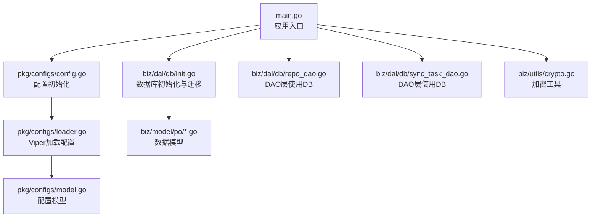
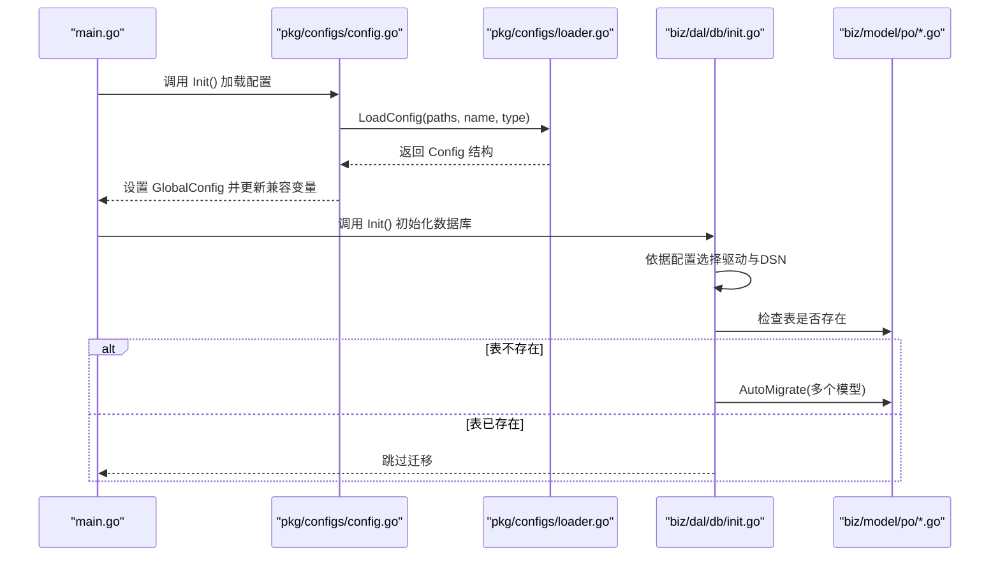
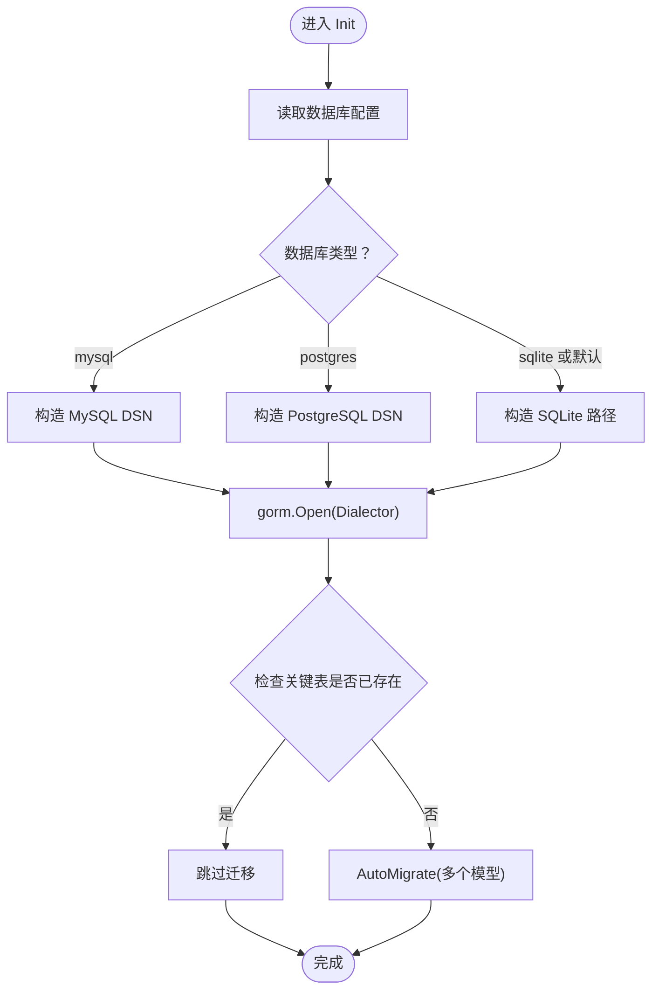
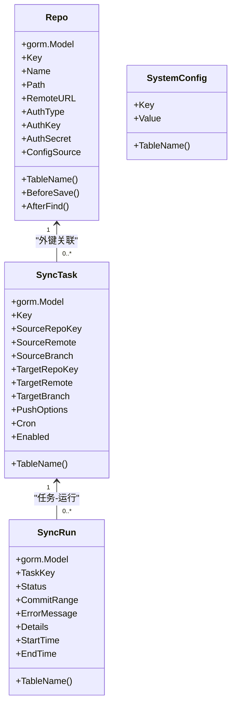
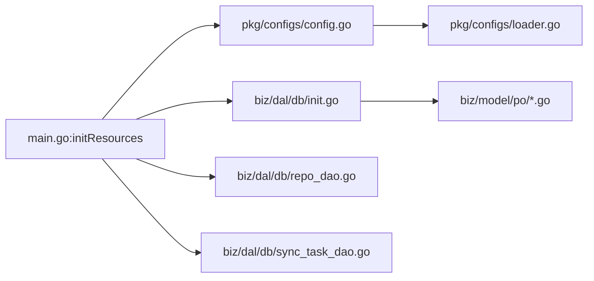

# 数据库初始化

<cite>
**本文引用的文件**
- [main.go](file://main.go)
- [biz/dal/db/init.go](file://biz/dal/db/init.go)
- [pkg/configs/config.go](file://pkg/configs/config.go)
- [pkg/configs/loader.go](file://pkg/configs/loader.go)
- [pkg/configs/model.go](file://pkg/configs/model.go)
- [conf/config.yaml](file://conf/config.yaml)
- [deploy/config.yaml](file://deploy/config.yaml)
- [deploy/.env.example](file://deploy/.env.example)
- [biz/dal/db/repo_dao.go](file://biz/dal/db/repo_dao.go)
- [biz/dal/db/sync_task_dao.go](file://biz/dal/db/sync_task_dao.go)
- [biz/model/po/repo.go](file://biz/model/po/repo.go)
- [biz/model/po/sync_task.go](file://biz/model/po/sync_task.go)
- [biz/model/po/sync_run.go](file://biz/model/po/sync_run.go)
- [biz/model/po/system_config.go](file://biz/model/po/system_config.go)
- [biz/utils/crypto.go](file://biz/utils/crypto.go)
</cite>

## 目录
1. [简介](#简介)
2. [项目结构](#项目结构)
3. [核心组件](#核心组件)
4. [架构总览](#架构总览)
5. [详细组件分析](#详细组件分析)
6. [依赖关系分析](#依赖关系分析)
7. [性能与连接池优化](#性能与连接池优化)
8. [故障排查指南](#故障排查指南)
9. [结论](#结论)
10. [附录](#附录)

## 简介
本文件系统化梳理数据库初始化模块的设计与实现，涵盖以下主题：
- 数据库连接配置与多数据库类型支持（MySQL、PostgreSQL、SQLite）
- GORM 初始化流程、DSN 构造与自动迁移机制
- 配置文件解析、环境变量处理与默认值设置
- 连接错误处理、重连策略建议与监控指标建议
- 不同部署环境的最佳实践与故障排查

## 项目结构
数据库初始化相关代码主要分布在如下位置：
- 应用入口与资源初始化：main.go
- 数据库初始化与迁移：biz/dal/db/init.go
- 配置模型与加载：pkg/configs/model.go、pkg/configs/loader.go、pkg/configs/config.go
- 配置样例与环境变量：conf/config.yaml、deploy/config.yaml、deploy/.env.example
- DAO 层与模型定义：biz/dal/db/*.go、biz/model/po/*.go
- 加密工具（影响敏感字段存储）：biz/utils/crypto.go

图表来源
- [main.go](file://main.go#L115-L134)
- [pkg/configs/config.go](file://pkg/configs/config.go#L18-L42)
- [pkg/configs/loader.go](file://pkg/configs/loader.go#L9-L45)
- [pkg/configs/model.go](file://pkg/configs/model.go#L3-L33)
- [biz/dal/db/init.go](file://biz/dal/db/init.go#L18-L71)
- [biz/dal/db/repo_dao.go](file://biz/dal/db/repo_dao.go#L1-L42)
- [biz/dal/db/sync_task_dao.go](file://biz/dal/db/sync_task_dao.go#L1-L67)
- [biz/utils/crypto.go](file://biz/utils/crypto.go#L15-L22)

章节来源
- [main.go](file://main.go#L115-L134)
- [biz/dal/db/init.go](file://biz/dal/db/init.go#L1-L72)
- [pkg/configs/config.go](file://pkg/configs/config.go#L1-L43)
- [pkg/configs/loader.go](file://pkg/configs/loader.go#L1-L46)
- [pkg/configs/model.go](file://pkg/configs/model.go#L1-L34)
- [conf/config.yaml](file://conf/config.yaml#L1-L25)
- [deploy/config.yaml](file://deploy/config.yaml#L1-L55)
- [deploy/.env.example](file://deploy/.env.example#L1-L21)

## 核心组件
- 配置加载与默认值
  - Viper 从多个路径读取 YAML 配置，设置默认值，并启用环境变量自动映射
  - 默认数据库类型为 SQLite，SQLite 路径默认为本地文件
- 数据库初始化
  - 根据配置选择驱动：MySQL、PostgreSQL 或 SQLite
  - 支持显式 DSN 覆盖；若未提供则按类型构造默认 DSN
  - 初始化 GORM 实例后执行自动迁移，跳过已存在表的情况
- DAO 层与模型
  - DAO 层通过全局 DB 句柄进行 CRUD
  - 模型定义包含表名、索引、关联与生命周期钩子（如加密/解密）

章节来源
- [pkg/configs/loader.go](file://pkg/configs/loader.go#L9-L45)
- [pkg/configs/config.go](file://pkg/configs/config.go#L18-L42)
- [pkg/configs/model.go](file://pkg/configs/model.go#L18-L27)
- [biz/dal/db/init.go](file://biz/dal/db/init.go#L18-L71)
- [biz/dal/db/repo_dao.go](file://biz/dal/db/repo_dao.go#L1-L42)
- [biz/dal/db/sync_task_dao.go](file://biz/dal/db/sync_task_dao.go#L1-L67)
- [biz/model/po/repo.go](file://biz/model/po/repo.go#L30-L62)
- [biz/model/po/sync_task.go](file://biz/model/po/sync_task.go#L1-L29)

## 架构总览
数据库初始化的整体流程如下：

图表来源
- [main.go](file://main.go#L115-L134)
- [pkg/configs/config.go](file://pkg/configs/config.go#L18-L42)
- [pkg/configs/loader.go](file://pkg/configs/loader.go#L9-L45)
- [biz/dal/db/init.go](file://biz/dal/db/init.go#L18-L71)
- [biz/model/po/repo.go](file://biz/model/po/repo.go#L26-L28)
- [biz/model/po/sync_task.go](file://biz/model/po/sync_task.go#L26-L28)
- [biz/model/po/sync_run.go](file://biz/model/po/sync_run.go#L23-L25)
- [biz/model/po/system_config.go](file://biz/model/po/system_config.go#L8-L10)

## 详细组件分析

### 配置加载与环境变量处理
- 配置来源与优先级
  - 文件优先：从当前目录、conf、上级 conf 多个路径查找配置文件
  - 默认值：为 server.port、rpc.port、database.type、database.path、webhook.* 等设置默认值
  - 环境变量：启用 AutomaticEnv，允许以 DB_TYPE、DB_PATH、DB_HOST、DB_PORT、DB_NAME、DB_USER、DB_PASSWORD、WEBHOOK_SECRET 等键覆盖配置
- 兼容性处理
  - 旧版环境变量 WEBHOOK_SECRET 与 DB_PATH 会被读取并回填到 GlobalConfig
- 配置样例
  - 开发样例 conf/config.yaml 提供了 SQLite 默认路径与注释说明
  - 部署样例 deploy/config.yaml 提供了更详细的注释与生产建议（绝对路径、自定义 DSN）

章节来源
- [pkg/configs/loader.go](file://pkg/configs/loader.go#L9-L45)
- [pkg/configs/config.go](file://pkg/configs/config.go#L18-L42)
- [conf/config.yaml](file://conf/config.yaml#L1-L25)
- [deploy/config.yaml](file://deploy/config.yaml#L1-L55)
- [deploy/.env.example](file://deploy/.env.example#L1-L21)

### 数据库初始化与多数据库类型支持
- 驱动选择与 DSN 构造
  - MySQL：优先使用配置中的 DSN；若为空则按 host/port/user/password/dbname 组装默认 DSN
  - PostgreSQL：优先使用配置中的 DSN；若为空则按 host/user/password/dbname/port 组装默认 DSN
  - SQLite：优先使用配置中的 DSN；若为空则使用 path；若 path 也为空，默认文件名为 git_sync.db
- GORM 初始化
  - 使用所选 Dialector 创建 gorm.DB 实例
  - 初始化失败直接致命日志退出
- 自动迁移与表存在检测
  - 在迁移前检查关键表是否存在，若全部存在则跳过迁移，避免重复初始化
  - 若任一表缺失，则对所有模型执行 AutoMigrate

图表来源
- [biz/dal/db/init.go](file://biz/dal/db/init.go#L18-L71)

章节来源
- [biz/dal/db/init.go](file://biz/dal/db/init.go#L18-L71)

### GORM 模型与 DAO 层
- 模型要点
  - Repo：包含唯一索引 key/name，持久化前对敏感字段进行加密，查询后解密
  - SyncTask：包含外键关联源/目标 Repo，支持 Cron 字段与启用状态
  - SyncRun：记录同步任务执行结果与日志
  - SystemConfig：键值型系统配置
- DAO 层要点
  - RepoDAO：提供 Create/Find/Save/Delete 等基础操作
  - SyncTaskDAO：提供带预加载的复杂查询、统计与条件查询

图表来源
- [biz/model/po/repo.go](file://biz/model/po/repo.go#L11-L93)
- [biz/model/po/sync_task.go](file://biz/model/po/sync_task.go#L7-L29)
- [biz/model/po/sync_run.go](file://biz/model/po/sync_run.go#L9-L25)
- [biz/model/po/system_config.go](file://biz/model/po/system_config.go#L3-L11)

章节来源
- [biz/model/po/repo.go](file://biz/model/po/repo.go#L11-L93)
- [biz/model/po/sync_task.go](file://biz/model/po/sync_task.go#L7-L29)
- [biz/model/po/sync_run.go](file://biz/model/po/sync_run.go#L9-L25)
- [biz/model/po/system_config.go](file://biz/model/po/system_config.go#L3-L11)
- [biz/dal/db/repo_dao.go](file://biz/dal/db/repo_dao.go#L1-L42)
- [biz/dal/db/sync_task_dao.go](file://biz/dal/db/sync_task_dao.go#L1-L67)

### 加密与安全
- 加密初始化
  - 从环境变量 ENCRYPTION_KEY 获取密钥；开发场景可使用固定默认值，但生产必须设置强密钥
- 敏感字段处理
  - Repo 模型在保存前对主密钥与远程认证映射进行加密，在查询后解密
  - DAO 层不直接处理加密，由模型钩子统一管理

章节来源
- [biz/utils/crypto.go](file://biz/utils/crypto.go#L15-L22)
- [biz/model/po/repo.go](file://biz/model/po/repo.go#L30-L62)

## 依赖关系分析
- 入口依赖
  - main.go 在 initResources 中先加载配置，再初始化数据库，最后初始化其他服务
- 配置依赖
  - config.go 依赖 loader.go 完成配置加载与默认值设置
  - loader.go 使用 viper 解析 YAML 并支持环境变量覆盖
- 数据库依赖
  - init.go 依赖配置与 GORM 驱动，按类型构造 DSN 并初始化 DB
  - DAO 层依赖全局 DB 句柄进行数据访问

图表来源
- [main.go](file://main.go#L115-L134)
- [pkg/configs/config.go](file://pkg/configs/config.go#L18-L42)
- [pkg/configs/loader.go](file://pkg/configs/loader.go#L9-L45)
- [biz/dal/db/init.go](file://biz/dal/db/init.go#L18-L71)
- [biz/dal/db/repo_dao.go](file://biz/dal/db/repo_dao.go#L1-L42)
- [biz/dal/db/sync_task_dao.go](file://biz/dal/db/sync_task_dao.go#L1-L67)

章节来源
- [main.go](file://main.go#L115-L134)
- [pkg/configs/config.go](file://pkg/configs/config.go#L1-L43)
- [pkg/configs/loader.go](file://pkg/configs/loader.go#L1-L46)
- [biz/dal/db/init.go](file://biz/dal/db/init.go#L1-L72)
- [biz/dal/db/repo_dao.go](file://biz/dal/db/repo_dao.go#L1-L42)
- [biz/dal/db/sync_task_dao.go](file://biz/dal/db/sync_task_dao.go#L1-L67)

## 性能与连接池优化
当前实现未显式配置 GORM 连接池参数。建议在生产环境中补充以下优化项（概念性建议，非现有代码）：
- 连接池参数
  - 最大打开连接数、最大空闲连接数、连接最大生命周期
- SQL 日志与慢查询
  - 开启 SQL 日志与慢查询阈值，结合指标系统观测
- 迁移与并发
  - 生产环境避免频繁迁移；可通过外部迁移工具或只读模式保证稳定性
- 连接健康检查
  - 周期性 Ping 检测数据库可用性，异常时触发告警与降级

[本节为通用性能建议，不直接分析具体文件，故无“章节来源”]

## 故障排查指南
- 配置相关
  - 配置文件未找到：确认配置文件路径与名称；检查配置加载函数的路径列表
  - 环境变量未生效：确认环境变量命名是否符合 Viper 的自动映射规则
  - 默认值覆盖：确认默认值是否满足预期，必要时在部署配置中显式指定
- 数据库连接
  - DSN 构造错误：核对数据库类型、主机、端口、用户、密码、库名等字段
  - 连接失败：检查网络连通性、凭据正确性与数据库服务状态
  - 迁移失败：查看 AutoMigrate 输出，确认模型定义与权限
- 运行时错误
  - DAO 层报错：检查全局 DB 是否已初始化成功
  - 加密失败：确认 ENCRYPTION_KEY 是否设置且长度符合要求

章节来源
- [pkg/configs/loader.go](file://pkg/configs/loader.go#L31-L37)
- [pkg/configs/config.go](file://pkg/configs/config.go#L33-L41)
- [biz/dal/db/init.go](file://biz/dal/db/init.go#L49-L52)
- [biz/dal/db/init.go](file://biz/dal/db/init.go#L67-L70)
- [biz/utils/crypto.go](file://biz/utils/crypto.go#L15-L22)

## 结论
该数据库初始化模块以清晰的配置驱动与 GORM 自动迁移为核心，支持 MySQL、PostgreSQL 与 SQLite 三种数据库类型。通过 Viper 的多源配置与环境变量覆盖，实现了灵活的部署适配。建议在生产环境中补充连接池、SQL 日志与健康检查等能力，并通过外部迁移工具确保迁移过程可控。

## 附录

### 配置项一览（关键）
- 服务器与 RPC
  - server.port：HTTP 服务监听端口
  - rpc.port：RPC 服务监听端口
- 数据库
  - database.type：数据库类型（sqlite、mysql、postgres）
  - database.dsn：自定义 DSN（优先于 host/port/user/password/dbname/path）
  - database.host/port/user/password/dbname：MySQL/PostgreSQL 参数
  - database.path：SQLite 文件路径
- Webhook
  - webhook.secret：签名密钥
  - webhook.rate_limit：速率限制
  - webhook.ip_whitelist：IP 白名单

章节来源
- [pkg/configs/model.go](file://pkg/configs/model.go#L10-L33)
- [conf/config.yaml](file://conf/config.yaml#L1-L25)
- [deploy/config.yaml](file://deploy/config.yaml#L9-L29)