# 数据访问层(DAL)

<cite>
**本文引用的文件**
- [biz/dal/db/init.go](file://biz/dal/db/init.go)
- [biz/dal/db/repo_dao.go](file://biz/dal/db/repo_dao.go)
- [biz/dal/db/sync_task_dao.go](file://biz/dal/db/sync_task_dao.go)
- [biz/dal/db/sync_run_dao.go](file://biz/dal/db/sync_run_dao.go)
- [biz/dal/db/audit_log_dao.go](file://biz/dal/db/audit_log_dao.go)
- [biz/dal/db/commit_stat_dao.go](file://biz/dal/db/commit_stat_dao.go)
- [biz/dal/db/system_config_dao.go](file://biz/dal/db/system_config_dao.go)
- [biz/model/po/repo.go](file://biz/model/po/repo.go)
- [biz/model/po/sync_task.go](file://biz/model/po/sync_task.go)
- [biz/model/po/sync_run.go](file://biz/model/po/sync_run.go)
- [biz/model/po/audit.go](file://biz/model/po/audit.go)
- [biz/model/po/commit_stat.go](file://biz/model/po/commit_stat.go)
- [biz/model/po/system_config.go](file://biz/model/po/system_config.go)
- [pkg/configs/config.go](file://pkg/configs/config.go)
- [conf/config.yaml](file://conf/config.yaml)
</cite>

## 目录
1. [简介](#简介)
2. [项目结构](#项目结构)
3. [核心组件](#核心组件)
4. [架构总览](#架构总览)
5. [详细组件分析](#详细组件分析)
6. [依赖分析](#依赖分析)
7. [性能考虑](#性能考虑)
8. [故障排查指南](#故障排查指南)
9. [结论](#结论)
10. [附录](#附录)

## 简介
本文件面向数据访问层（Data Access Layer, DAL）的技术文档，系统阐述基于 GORM 的数据持久化抽象设计理念与实现架构。重点覆盖数据库初始化配置、连接选择与自动迁移、DAO 层职责划分与实现模式、模型关联关系、查询优化策略、事务处理建议、以及扩展与自定义数据访问模式的最佳实践。通过逐个 DAO 组件的深入解析，帮助读者快速理解各模块的职责边界、数据流与关键实现点。

## 项目结构
DAL 层位于 biz/dal/db 目录，采用“按实体分包”的组织方式，每个实体对应一个 DAO 类型与对应的 PO 模型。配置与初始化集中在 init.go 中，统一管理数据库类型、DSN、自动迁移与表存在性检查；PO 模型位于 biz/model/po，承载表结构、索引与 GORM 生命周期钩子。

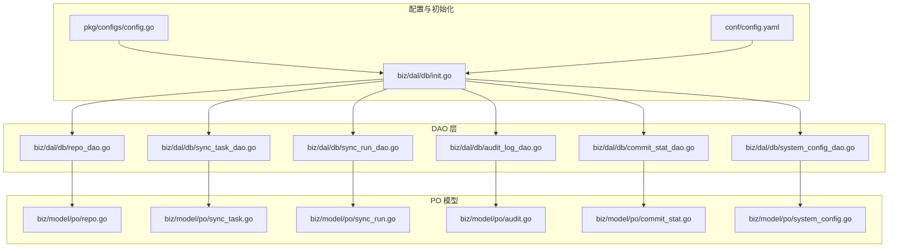

图表来源
- [biz/dal/db/init.go](file://biz/dal/db/init.go#L18-L71)
- [pkg/configs/config.go](file://pkg/configs/config.go#L18-L42)
- [conf/config.yaml](file://conf/config.yaml#L7-L19)
- [biz/dal/db/repo_dao.go](file://biz/dal/db/repo_dao.go#L1-L42)
- [biz/dal/db/sync_task_dao.go](file://biz/dal/db/sync_task_dao.go#L1-L67)
- [biz/dal/db/sync_run_dao.go](file://biz/dal/db/sync_run_dao.go#L1-L40)
- [biz/dal/db/audit_log_dao.go](file://biz/dal/db/audit_log_dao.go#L1-L46)
- [biz/dal/db/commit_stat_dao.go](file://biz/dal/db/commit_stat_dao.go#L1-L66)
- [biz/dal/db/system_config_dao.go](file://biz/dal/db/system_config_dao.go#L1-L43)
- [biz/model/po/repo.go](file://biz/model/po/repo.go#L11-L24)
- [biz/model/po/sync_task.go](file://biz/model/po/sync_task.go#L7-L24)
- [biz/model/po/sync_run.go](file://biz/model/po/sync_run.go#L9-L21)
- [biz/model/po/audit.go](file://biz/model/po/audit.go#L7-L16)
- [biz/model/po/commit_stat.go](file://biz/model/po/commit_stat.go#L9-L18)
- [biz/model/po/system_config.go](file://biz/model/po/system_config.go#L3-L6)

章节来源
- [biz/dal/db/init.go](file://biz/dal/db/init.go#L18-L71)
- [pkg/configs/config.go](file://pkg/configs/config.go#L18-L42)
- [conf/config.yaml](file://conf/config.yaml#L7-L19)

## 核心组件
- 初始化与连接管理：根据配置选择数据库类型（SQLite/MySQL/Postgres），支持 DSN 或参数化连接；连接成功后进行表存在性检查，若不存在则自动迁移；全局持有 GORM 实例以供 DAO 使用。
- DAO 抽象：每个实体一个 DAO 结构体，封装 CRUD、批量写入、复杂查询与预加载等操作；DAO 方法直接依赖全局 DB 实例。
- PO 模型：定义表结构、索引、外键关联与 GORM 钩子（如加密/解密），确保数据在持久化前后的一致性与安全性。
- 查询优化：针对列表页排除大字段、使用索引列查询、分页偏移、批量插入/更新、分块查询等策略降低开销。
- 扩展模式：DAO 可按需新增方法，遵循“最小职责”原则；复杂查询可引入原生 SQL 或使用 GORM 原生表达式保持可读性与性能平衡。

章节来源
- [biz/dal/db/init.go](file://biz/dal/db/init.go#L18-L71)
- [biz/dal/db/repo_dao.go](file://biz/dal/db/repo_dao.go#L13-L41)
- [biz/dal/db/sync_task_dao.go](file://biz/dal/db/sync_task_dao.go#L13-L66)
- [biz/dal/db/sync_run_dao.go](file://biz/dal/db/sync_run_dao.go#L13-L39)
- [biz/dal/db/audit_log_dao.go](file://biz/dal/db/audit_log_dao.go#L13-L45)
- [biz/dal/db/commit_stat_dao.go](file://biz/dal/db/commit_stat_dao.go#L17-L65)
- [biz/dal/db/system_config_dao.go](file://biz/dal/db/system_config_dao.go#L13-L42)

## 架构总览
下图展示 DAL 层与配置、PO 模型之间的交互关系，以及 DAO 的职责边界与调用方向。

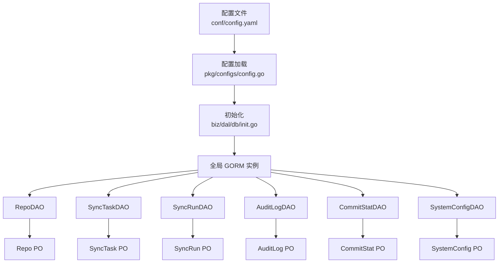

图表来源
- [biz/dal/db/init.go](file://biz/dal/db/init.go#L18-L71)
- [pkg/configs/config.go](file://pkg/configs/config.go#L18-L42)
- [conf/config.yaml](file://conf/config.yaml#L7-L19)
- [biz/dal/db/repo_dao.go](file://biz/dal/db/repo_dao.go#L7-L41)
- [biz/dal/db/sync_task_dao.go](file://biz/dal/db/sync_task_dao.go#L7-L66)
- [biz/dal/db/sync_run_dao.go](file://biz/dal/db/sync_run_dao.go#L7-L39)
- [biz/dal/db/audit_log_dao.go](file://biz/dal/db/audit_log_dao.go#L7-L45)
- [biz/dal/db/commit_stat_dao.go](file://biz/dal/db/commit_stat_dao.go#L10-L65)
- [biz/dal/db/system_config_dao.go](file://biz/dal/db/system_config_dao.go#L7-L42)
- [biz/model/po/repo.go](file://biz/model/po/repo.go#L11-L24)
- [biz/model/po/sync_task.go](file://biz/model/po/sync_task.go#L7-L24)
- [biz/model/po/sync_run.go](file://biz/model/po/sync_run.go#L9-L21)
- [biz/model/po/audit.go](file://biz/model/po/audit.go#L7-L16)
- [biz/model/po/commit_stat.go](file://biz/model/po/commit_stat.go#L9-L18)
- [biz/model/po/system_config.go](file://biz/model/po/system_config.go#L3-L6)

## 详细组件分析

### 数据库初始化与连接管理
- 连接类型选择：根据配置中的类型字段选择 SQLite、MySQL 或 Postgres；若未提供 DSN，则按默认格式拼装参数化连接串。
- 连接建立：使用 GORM Open 创建全局 DB 实例，并在失败时直接退出，保证服务启动阶段的健壮性。
- 自动迁移与表存在性检查：先检查关键表是否存在，若全部存在则跳过迁移；否则执行 AutoMigrate 完成建表与索引创建。
- 全局实例：DB 在包级导出，DAO 层通过导入该包直接使用全局实例，避免重复连接与上下文传递。

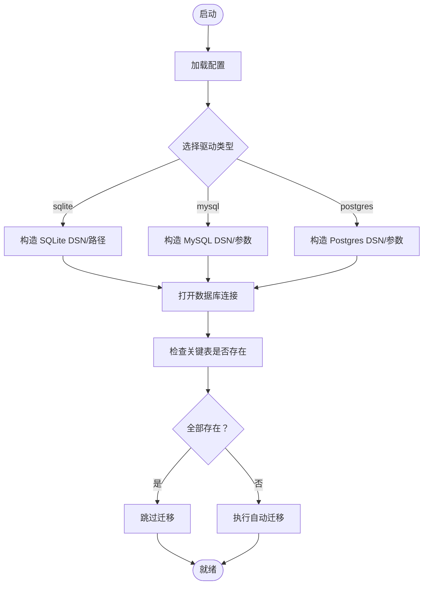

图表来源
- [biz/dal/db/init.go](file://biz/dal/db/init.go#L18-L71)
- [pkg/configs/config.go](file://pkg/configs/config.go#L18-L42)
- [conf/config.yaml](file://conf/config.yaml#L7-L19)

章节来源
- [biz/dal/db/init.go](file://biz/dal/db/init.go#L18-L71)
- [pkg/configs/config.go](file://pkg/configs/config.go#L18-L42)
- [conf/config.yaml](file://conf/config.yaml#L7-L19)

### 仓库 DAO（RepoDAO）
- 职责：负责仓库信息的增删改查、按 key/path 查询与全量列表。
- 关键方法：
  - Create/Save/Delete：标准 CRUD。
  - FindAll：全量查询。
  - FindByKey/FindByPath：按唯一键查询单条记录。
- 复杂度：查询为 O(n)，无分页；FindByKey/FindByPath 基于唯一索引，命中率高。
- 扩展建议：增加分页、模糊匹配、排序等常用查询；对高频字段添加索引。

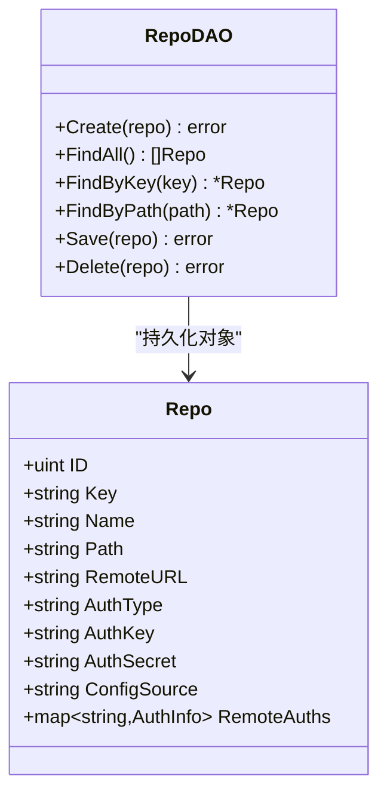

图表来源
- [biz/dal/db/repo_dao.go](file://biz/dal/db/repo_dao.go#L7-L41)
- [biz/model/po/repo.go](file://biz/model/po/repo.go#L11-L24)

章节来源
- [biz/dal/db/repo_dao.go](file://biz/dal/db/repo_dao.go#L13-L41)
- [biz/model/po/repo.go](file://biz/model/po/repo.go#L11-L24)

### 同步任务 DAO（SyncTaskDAO）
- 职责：管理同步任务的生命周期，支持关联预加载、按仓库键聚合查询、启用且带定时规则的任务筛选、计数与键集合提取。
- 关键方法：
  - FindAllWithRepos：预加载源仓库与目标仓库，便于前端渲染。
  - FindByRepoKey：查询与某仓库相关的所有任务（源或目标）。
  - FindByKey：按任务 key 查询。
  - Save/Delete：更新与删除。
  - CountByRepoKey：统计任务数量。
  - GetKeysByRepoKey：返回任务 key 列表。
  - FindEnabledWithCron：筛选启用且定时规则非空的任务。
- 复杂度：FindAllWithRepos 与 FindByRepoKey 会触发多次 JOIN/IN 子句，建议控制返回数量或分页；CountByRepoKey/GetKeysByRepoKey 用于上层调度器的轻量查询。
- 模型关联：SyncTask 内嵌 SourceRepo/TargetRepo 字段，DAO 通过 Preload 加载关联对象。

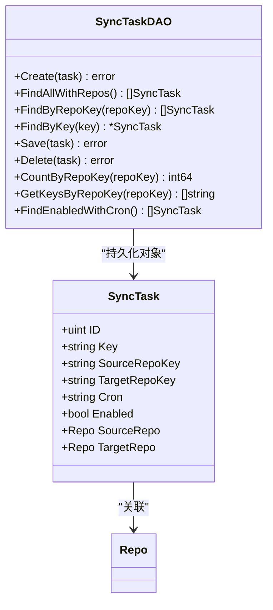

图表来源
- [biz/dal/db/sync_task_dao.go](file://biz/dal/db/sync_task_dao.go#L7-L66)
- [biz/model/po/sync_task.go](file://biz/model/po/sync_task.go#L7-L24)
- [biz/model/po/repo.go](file://biz/model/po/repo.go#L11-L24)

章节来源
- [biz/dal/db/sync_task_dao.go](file://biz/dal/db/sync_task_dao.go#L13-L66)
- [biz/model/po/sync_task.go](file://biz/model/po/sync_task.go#L7-L24)
- [biz/model/po/repo.go](file://biz/model/po/repo.go#L11-L24)

### 同步执行记录 DAO（SyncRunDAO）
- 职责：记录每次同步执行的结果、状态、时间范围与错误详情；支持按任务 key 列表查询最新执行记录。
- 关键方法：
  - Create/Save：新增与更新执行记录。
  - FindLatest(limit)：按开始时间倒序取最近若干条，并预加载 Task。
  - FindByTaskKeys(taskKeys, limit)：按任务 key 列表过滤并限制数量，预加载 Task。
  - Delete(id)：按主键删除。
- 复杂度：FindLatest/FindByTaskKeys 基于索引列排序与过滤，适合高频查询；注意传入的 taskKeys 为空时直接返回空切片。
- 模型关联：SyncRun 内嵌 Task 字段，DAO 通过 Preload 加载。

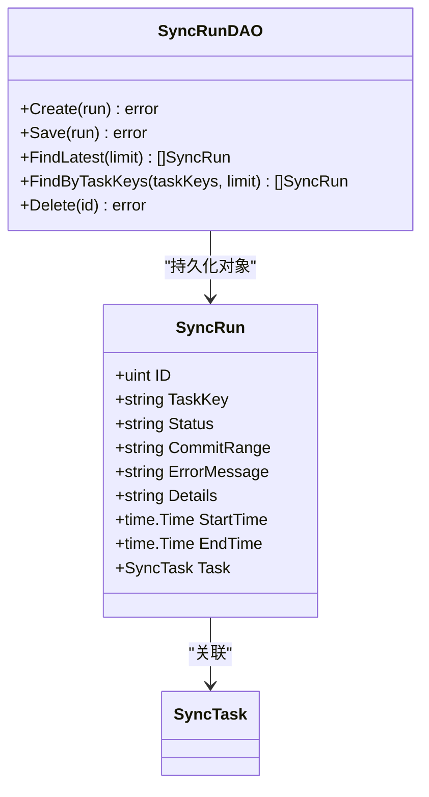

图表来源
- [biz/dal/db/sync_run_dao.go](file://biz/dal/db/sync_run_dao.go#L7-L39)
- [biz/model/po/sync_run.go](file://biz/model/po/sync_run.go#L9-L21)
- [biz/model/po/sync_task.go](file://biz/model/po/sync_task.go#L7-L24)

章节来源
- [biz/dal/db/sync_run_dao.go](file://biz/dal/db/sync_run_dao.go#L13-L39)
- [biz/model/po/sync_run.go](file://biz/model/po/sync_run.go#L9-L21)
- [biz/model/po/sync_task.go](file://biz/model/po/sync_task.go#L7-L24)

### 审计日志 DAO（AuditLogDAO）
- 职责：记录用户操作行为，支持最新日志查询、分页列表（排除大字段）、总数统计与按 ID 查询。
- 关键方法：
  - Create：新增审计日志。
  - FindLatest(limit)：按创建时间倒序取最近若干条。
  - Count()：统计总数。
  - FindPage(page, pageSize)：分页查询，仅选择必要字段以提升性能。
  - FindByID(id)：按主键查询。
- 复杂度：FindPage 通过 Select 排除 details 字段，显著降低网络与序列化开销；Count 用于分页总条数统计。
- 索引：Action 与 Target 字段带索引，适合条件过滤与排序。

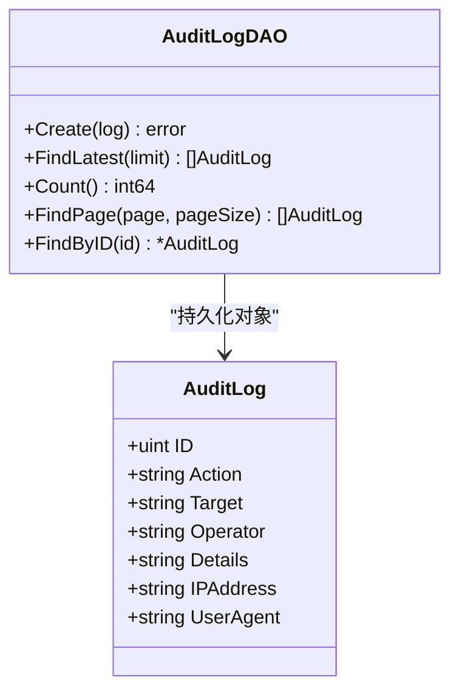

图表来源
- [biz/dal/db/audit_log_dao.go](file://biz/dal/db/audit_log_dao.go#L7-L45)
- [biz/model/po/audit.go](file://biz/model/po/audit.go#L7-L16)

章节来源
- [biz/dal/db/audit_log_dao.go](file://biz/dal/db/audit_log_dao.go#L13-L45)
- [biz/model/po/audit.go](file://biz/model/po/audit.go#L7-L16)

### 提交统计 DAO（CommitStatDAO）
- 职责：维护仓库提交统计，支持最新提交时间查询、批量保存（Upsert）、按仓库与哈希集合查询已存在的统计项。
- 关键方法：
  - FindLatestCommitTime(repoID)：按仓库查找最新提交时间，用于增量同步起点。
  - BatchSave(stats)：批量插入/更新，基于唯一索引冲突更新指定字段，批大小固定。
  - GetByRepoAndHashes(repoID, hashes)：分块查询已存在的统计项，避免 IN 参数过大。
- 复杂度：BatchSave 通过 ON CONFLICT 实现高效 Upsert；GetByRepoAndHashes 分块处理，避免超长 IN 子句。
- 索引：RepoID+CommitHash 组合唯一索引，加速去重与更新。

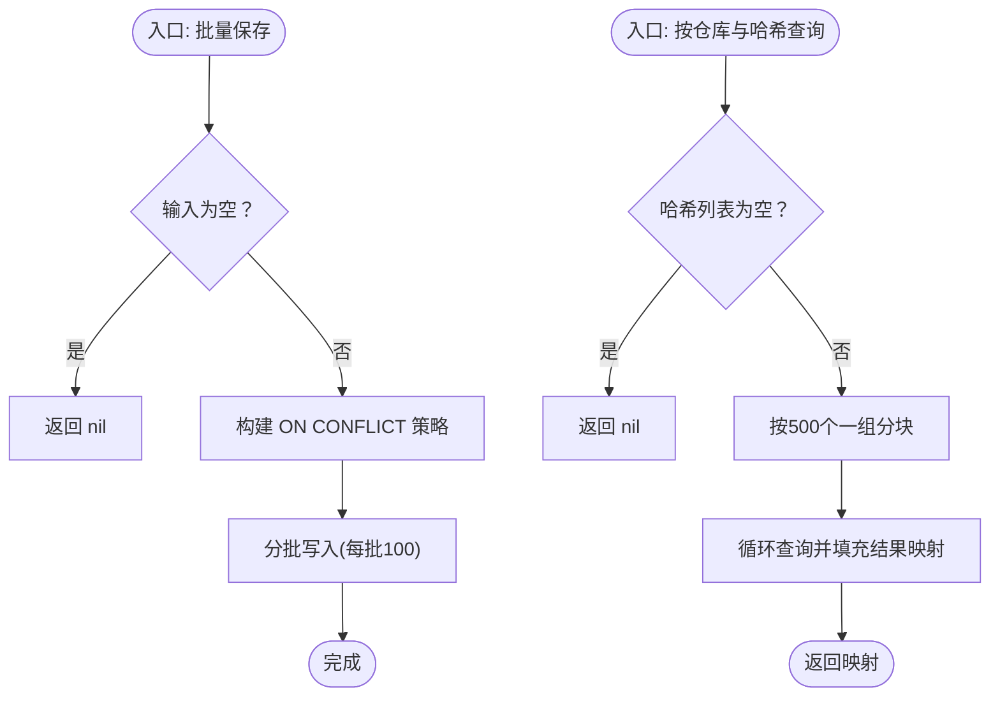

图表来源
- [biz/dal/db/commit_stat_dao.go](file://biz/dal/db/commit_stat_dao.go#L17-L65)
- [biz/model/po/commit_stat.go](file://biz/model/po/commit_stat.go#L9-L18)

章节来源
- [biz/dal/db/commit_stat_dao.go](file://biz/dal/db/commit_stat_dao.go#L17-L65)
- [biz/model/po/commit_stat.go](file://biz/model/po/commit_stat.go#L9-L18)

### 系统配置 DAO（SystemConfigDAO）
- 职责：提供键值型系统配置的读取、设置与全量导出能力。
- 关键方法：
  - GetConfig(key)：按 key 获取值。
  - SetConfig(key, value)：设置或更新配置。
  - GetAll()：导出全部配置为 map。
- 复杂度：GetAll 适合一次性拉取配置；GetConfig/SetConfig 为 O(1) 哈希查询/更新。
- 索引：Key 为主键，具备唯一性约束。

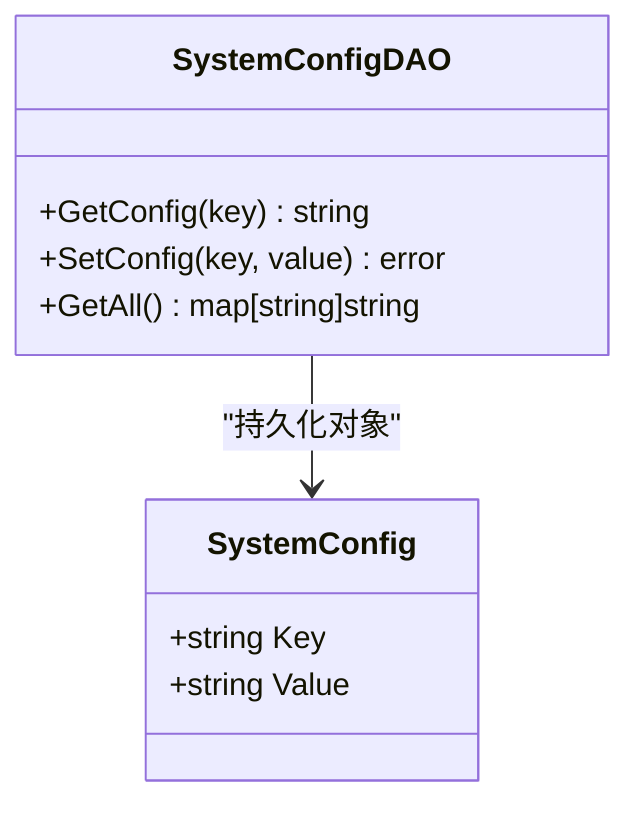

图表来源
- [biz/dal/db/system_config_dao.go](file://biz/dal/db/system_config_dao.go#L7-L42)
- [biz/model/po/system_config.go](file://biz/model/po/system_config.go#L3-L6)

章节来源
- [biz/dal/db/system_config_dao.go](file://biz/dal/db/system_config_dao.go#L13-L42)
- [biz/model/po/system_config.go](file://biz/model/po/system_config.go#L3-L6)

## 依赖分析
- DAO 与 PO：DAO 仅依赖 PO 结构体，不反向依赖上层业务逻辑，耦合度低、内聚性强。
- DAO 与 DB：DAO 通过全局 DB 实例执行查询，避免在 DAO 内部管理连接与事务，简化了生命周期管理。
- 模型关联：SyncTask/SyncRun 通过 GORM 外键注解与结构体字段形成关联，DAO 使用 Preload 加载，减少 N+1 查询风险。
- 配置驱动：初始化流程由配置驱动，支持多数据库类型切换，便于部署环境适配。

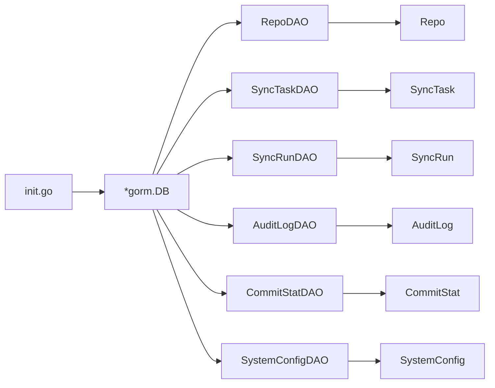

图表来源
- [biz/dal/db/init.go](file://biz/dal/db/init.go#L16-L49)
- [biz/dal/db/repo_dao.go](file://biz/dal/db/repo_dao.go#L3-L5)
- [biz/dal/db/sync_task_dao.go](file://biz/dal/db/sync_task_dao.go#L3-L4)
- [biz/dal/db/sync_run_dao.go](file://biz/dal/db/sync_run_dao.go#L3-L4)
- [biz/dal/db/audit_log_dao.go](file://biz/dal/db/audit_log_dao.go#L3-L4)
- [biz/dal/db/commit_stat_dao.go](file://biz/dal/db/commit_stat_dao.go#L3-L7)
- [biz/dal/db/system_config_dao.go](file://biz/dal/db/system_config_dao.go#L3-L4)
- [biz/model/po/repo.go](file://biz/model/po/repo.go#L11-L24)
- [biz/model/po/sync_task.go](file://biz/model/po/sync_task.go#L7-L24)
- [biz/model/po/sync_run.go](file://biz/model/po/sync_run.go#L9-L21)
- [biz/model/po/audit.go](file://biz/model/po/audit.go#L7-L16)
- [biz/model/po/commit_stat.go](file://biz/model/po/commit_stat.go#L9-L18)
- [biz/model/po/system_config.go](file://biz/model/po/system_config.go#L3-L6)

章节来源
- [biz/dal/db/init.go](file://biz/dal/db/init.go#L16-L49)
- [biz/dal/db/repo_dao.go](file://biz/dal/db/repo_dao.go#L3-L5)
- [biz/dal/db/sync_task_dao.go](file://biz/dal/db/sync_task_dao.go#L3-L4)
- [biz/dal/db/sync_run_dao.go](file://biz/dal/db/sync_run_dao.go#L3-L4)
- [biz/dal/db/audit_log_dao.go](file://biz/dal/db/audit_log_dao.go#L3-L4)
- [biz/dal/db/commit_stat_dao.go](file://biz/dal/db/commit_stat_dao.go#L3-L7)
- [biz/dal/db/system_config_dao.go](file://biz/dal/db/system_config_dao.go#L3-L4)

## 性能考虑
- 查询优化
  - 列表页排除大字段：审计日志 DAO 在分页查询中仅选择必要字段，避免传输 details。
  - 索引利用：在高频过滤与排序字段上建立索引（如审计日志的 action/target、提交统计的 repo_id+commit_hash、审计日志的 ip_address/user_agent 等）。
  - 分页与限制：对 FindLatest/FindByTaskKeys 等方法设置合理 limit，避免一次性返回过多数据。
  - 预加载控制：Preload 会触发关联查询，应仅在需要时使用，避免不必要的 JOIN。
- 批量与 Upsert
  - 批量写入：CommitStatDAO 使用分批写入与 ON CONFLICT 更新，减少往返与锁竞争。
  - 批量查询：GetByRepoAndHashes 采用分块 IN 查询，避免 SQL 参数过长。
- 连接与事务
  - 当前 DAO 直接使用全局 DB 实例，未显式开启事务；对于跨多表写入或强一致场景，建议在服务层封装事务，DAO 保持只读或幂等写入。
- 缓存与降级
  - 对于只读或低频变更的配置（SystemConfigDAO），可在应用层引入缓存；对高频审计日志查询可考虑本地缓存热点数据。

## 故障排查指南
- 启动失败（无法连接数据库）
  - 检查配置文件中的数据库类型与连接参数是否正确；确认 DSN 或 host/port/user/password/dbname 是否完整。
  - 若为 SQLite，请确认路径可写且文件存在或允许创建。
- 表缺失或迁移失败
  - 若表已存在但未迁移，确认初始化逻辑是否提前返回；检查 AutoMigrate 返回的错误并定位具体表结构问题。
- 查询异常或性能差
  - 审计日志分页排除 details 字段是否生效；检查索引是否被使用（可通过 EXPLAIN 分析）。
  - 对于大量数据的批量写入，确认批大小与冲突列配置是否合理。
- 数据一致性问题
  - 对于需要强一致性的多步写入，应在服务层开启事务；DAO 不应承担事务管理职责。

章节来源
- [biz/dal/db/init.go](file://biz/dal/db/init.go#L18-L71)
- [biz/dal/db/audit_log_dao.go](file://biz/dal/db/audit_log_dao.go#L29-L39)
- [biz/dal/db/commit_stat_dao.go](file://biz/dal/db/commit_stat_dao.go#L27-L36)

## 结论
本 DAL 层以 GORM 为核心，结合 PO 模型与 DAO 抽象，实现了清晰的职责分离与良好的扩展性。通过初始化阶段的自动迁移与表存在性检查，确保了部署一致性；DAO 层围绕 CRUD、批量写入与复杂查询提供了实用方法，并在查询层面采用了索引、分页与字段裁剪等优化策略。未来可在事务管理、缓存与监控方面进一步增强，以满足更高性能与可靠性需求。

## 附录
- 数据模型 ER 关系
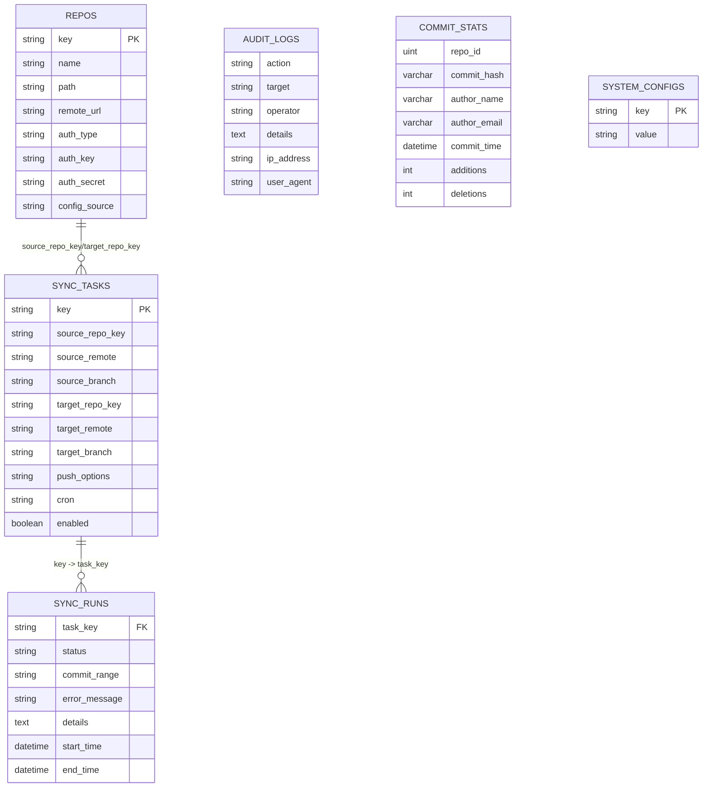

图表来源
- [biz/model/po/repo.go](file://biz/model/po/repo.go#L11-L24)
- [biz/model/po/sync_task.go](file://biz/model/po/sync_task.go#L7-L24)
- [biz/model/po/sync_run.go](file://biz/model/po/sync_run.go#L9-L21)
- [biz/model/po/audit.go](file://biz/model/po/audit.go#L7-L16)
- [biz/model/po/commit_stat.go](file://biz/model/po/commit_stat.go#L9-L18)
- [biz/model/po/system_config.go](file://biz/model/po/system_config.go#L3-L6)