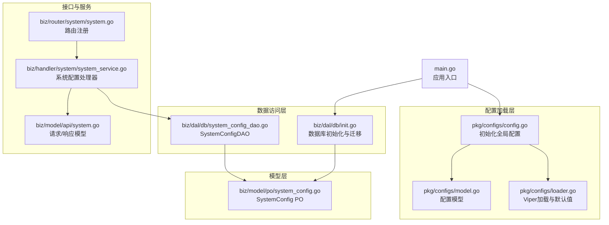
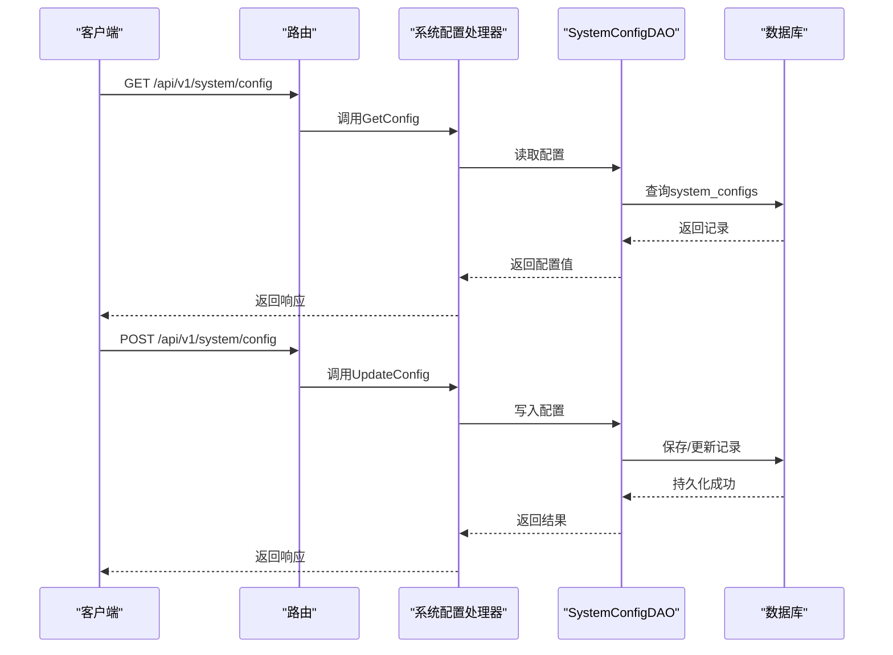
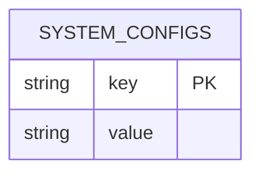
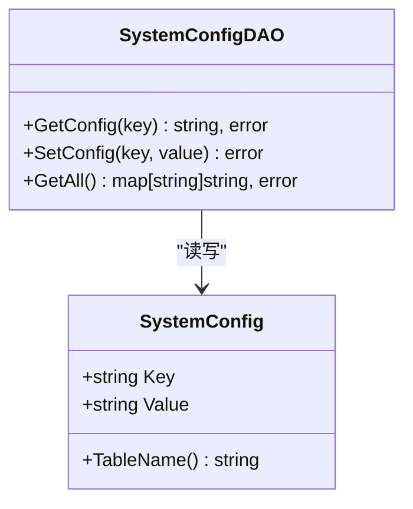
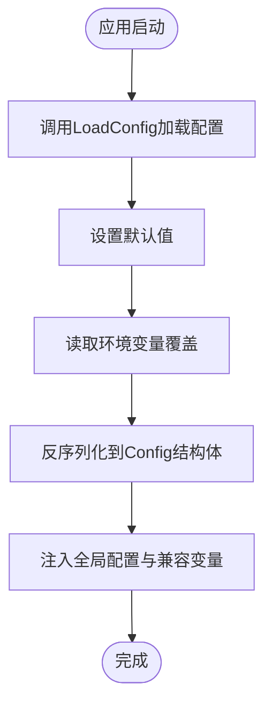
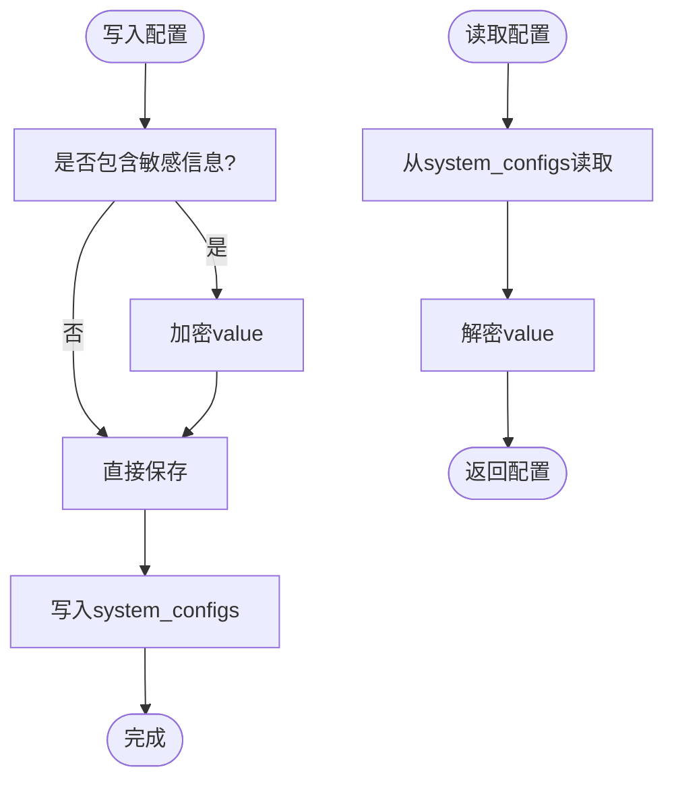
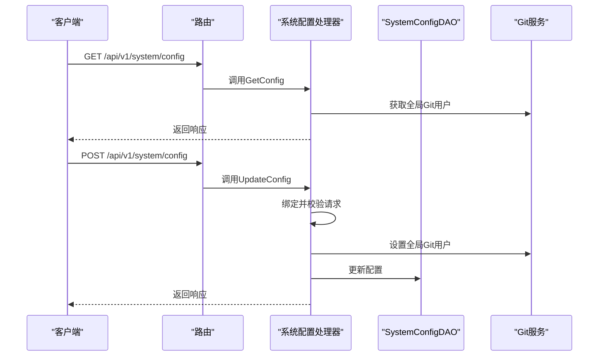
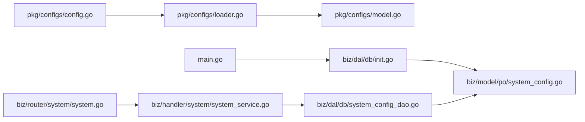

# 系统配置DAO

<cite>
**本文引用的文件**
- [biz/dal/db/system_config_dao.go](file://biz/dal/db/system_config_dao.go)
- [biz/model/po/system_config.go](file://biz/model/po/system_config.go)
- [pkg/configs/config.go](file://pkg/configs/config.go)
- [pkg/configs/loader.go](file://pkg/configs/loader.go)
- [pkg/configs/model.go](file://pkg/configs/model.go)
- [biz/dal/db/init.go](file://biz/dal/db/init.go)
- [biz/router/system/system.go](file://biz/router/system/system.go)
- [biz/handler/system/system_service.go](file://biz/handler/system/system_service.go)
- [biz/model/api/system.go](file://biz/model/api/system.go)
- [main.go](file://main.go)
- [biz/utils/crypto.go](file://biz/utils/crypto.go)
- [biz/model/po/repo.go](file://biz/model/po/repo.go)
</cite>

## 目录
1. [简介](#简介)
2. [项目结构](#项目结构)
3. [核心组件](#核心组件)
4. [架构总览](#架构总览)
5. [详细组件分析](#详细组件分析)
6. [依赖关系分析](#依赖关系分析)
7. [性能考虑](#性能考虑)
8. [故障排查指南](#故障排查指南)
9. [结论](#结论)
10. [附录](#附录)

## 简介
本文件聚焦“系统配置DAO”的设计与实现，围绕系统配置数据模型、配置管理机制、增删改查操作、默认值与类型转换、动态加载与热更新、缓存策略、分类与权限控制、版本与迁移、备份恢复、性能优化与批量操作等维度进行系统化技术说明。同时结合现有代码路径，给出可落地的实现建议与最佳实践。

## 项目结构
系统配置DAO位于数据访问层（biz/dal/db），配合持久化对象（po）与配置加载模块（pkg/configs），在应用启动时完成数据库初始化与表结构迁移，并通过路由与处理器暴露配置读取与更新能力。

图表来源
- [main.go](file://main.go#L115-L134)
- [pkg/configs/config.go](file://pkg/configs/config.go#L18-L42)
- [pkg/configs/loader.go](file://pkg/configs/loader.go#L9-L45)
- [pkg/configs/model.go](file://pkg/configs/model.go#L1-L34)
- [biz/dal/db/init.go](file://biz/dal/db/init.go#L18-L71)
- [biz/dal/db/system_config_dao.go](file://biz/dal/db/system_config_dao.go#L1-L43)
- [biz/model/po/system_config.go](file://biz/model/po/system_config.go#L1-L11)
- [biz/router/system/system.go](file://biz/router/system/system.go#L17-L40)
- [biz/handler/system/system_service.go](file://biz/handler/system/system_service.go#L22-L57)
- [biz/model/api/system.go](file://biz/model/api/system.go#L24-L28)

章节来源
- [main.go](file://main.go#L115-L134)
- [biz/dal/db/init.go](file://biz/dal/db/init.go#L18-L71)

## 核心组件
- SystemConfigDAO：提供单键读取、写入与全量读取能力，基于GORM对system_configs表进行CRUD。
- SystemConfig PO：映射system_configs表，包含主键key与字符串value。
- 配置加载器：使用Viper从文件与环境变量加载配置，设置默认值并注入全局配置。
- 应用入口：统一初始化配置、数据库与业务服务；路由注册系统配置相关接口。
- 处理器与路由：对外暴露配置读取与更新接口，绑定请求/响应模型。

章节来源
- [biz/dal/db/system_config_dao.go](file://biz/dal/db/system_config_dao.go#L7-L42)
- [biz/model/po/system_config.go](file://biz/model/po/system_config.go#L3-L10)
- [pkg/configs/loader.go](file://pkg/configs/loader.go#L9-L45)
- [pkg/configs/config.go](file://pkg/configs/config.go#L18-L42)
- [biz/router/system/system.go](file://biz/router/system/system.go#L26-L30)
- [biz/handler/system/system_service.go](file://biz/handler/system/system_service.go#L22-L57)
- [biz/model/api/system.go](file://biz/model/api/system.go#L24-L28)

## 架构总览
系统配置DAO作为数据访问层组件，向上为系统配置处理器提供数据支撑，向下依赖GORM与数据库驱动。配置加载模块负责应用启动阶段的配置装配，确保DAO在运行期可用。

图表来源
- [biz/router/system/system.go](file://biz/router/system/system.go#L26-L30)
- [biz/handler/system/system_service.go](file://biz/handler/system/system_service.go#L22-L57)
- [biz/dal/db/system_config_dao.go](file://biz/dal/db/system_config_dao.go#L13-L28)

## 详细组件分析

### 数据模型与表结构
- 表名：system_configs
- 字段：key（主键）、value（字符串）
- 设计要点：简单键值存储，适合轻量配置管理；value为字符串便于灵活存储任意格式配置。

图表来源
- [biz/model/po/system_config.go](file://biz/model/po/system_config.go#L3-L10)

章节来源
- [biz/model/po/system_config.go](file://biz/model/po/system_config.go#L3-L10)

### DAO接口与实现
- GetConfig(key)：按主键查询配置值，未命中返回错误。
- SetConfig(key, value)：以保存/更新方式写入配置。
- GetAll()：全量读取并返回键值映射。

图表来源
- [biz/dal/db/system_config_dao.go](file://biz/dal/db/system_config_dao.go#L7-L42)
- [biz/model/po/system_config.go](file://biz/model/po/system_config.go#L3-L10)

章节来源
- [biz/dal/db/system_config_dao.go](file://biz/dal/db/system_config_dao.go#L13-L42)

### 配置加载与默认值
- Viper加载：支持从多个路径查找配置文件，自动读取环境变量覆盖。
- 默认值：为关键配置设置默认值，避免缺失导致的异常。
- 全局注入：加载完成后注入全局配置变量，并兼容旧版全局变量。

图表来源
- [pkg/configs/loader.go](file://pkg/configs/loader.go#L9-L45)
- [pkg/configs/config.go](file://pkg/configs/config.go#L18-L42)

章节来源
- [pkg/configs/loader.go](file://pkg/configs/loader.go#L9-L45)
- [pkg/configs/config.go](file://pkg/configs/config.go#L18-L42)

### 动态加载与热更新
- 当前实现：系统配置DAO不提供运行时热更新机制；配置变更需通过接口提交后持久化。
- 建议方案：
  - 引入配置缓存：在内存中维护最近一次查询结果，设置TTL或LRU淘汰策略。
  - 变更通知：监听配置表变更事件，触发缓存失效与广播。
  - 分类缓存：按配置类别分组缓存，降低全量刷新成本。
  - 并发安全：使用读写锁或原子替换保障并发一致性。

章节来源
- [biz/dal/db/system_config_dao.go](file://biz/dal/db/system_config_dao.go#L13-L42)

### 类别管理与权限控制
- 类别管理：当前DAO未区分配置类别；可在value中约定JSON结构或引入category字段扩展。
- 权限控制：系统配置接口未内置鉴权中间件；建议在路由层增加鉴权与RBAC校验，仅允许管理员修改。

章节来源
- [biz/router/system/system.go](file://biz/router/system/system.go#L26-L30)

### 版本控制与迁移
- 迁移策略：数据库初始化阶段检查表是否存在，若存在则跳过迁移，避免重复初始化。
- 建议方案：
  - 引入版本号字段：在system_configs中新增version列，记录配置版本。
  - 迁移脚本：提供升级/降级脚本，执行数据转换与兼容处理。
  - 回滚策略：保留上一版本快照，失败时回滚至最近稳定版本。

章节来源
- [biz/dal/db/init.go](file://biz/dal/db/init.go#L54-L71)

### 备份与恢复
- 备份：定期导出system_configs表为SQL或CSV，保留时间戳与版本信息。
- 恢复：根据备份文件重建表数据，必要时执行版本校验与冲突解决。

章节来源
- [biz/model/po/system_config.go](file://biz/model/po/system_config.go#L3-L10)

### 安全性与敏感信息
- 敏感配置：当前DAO未对value进行加密存储；建议对包含敏感信息的配置采用对称加密。
- 加密实现：复用现有加密工具，对value进行加解密；处理器在写入前加密、读取后解密。
- 认证信息模型：参考仓库认证信息的加解密模式，在DAO层扩展敏感字段处理。

图表来源
- [biz/utils/crypto.go](file://biz/utils/crypto.go#L15-L70)
- [biz/model/po/repo.go](file://biz/model/po/repo.go#L40-L92)

章节来源
- [biz/utils/crypto.go](file://biz/utils/crypto.go#L15-L70)
- [biz/model/po/repo.go](file://biz/model/po/repo.go#L40-L92)

### 批量操作与复杂查询
- 批量写入：DAO未提供批量写入方法；建议实现批量保存/合并，减少事务次数。
- 复杂查询：当前DAO仅支持按key精确查询；可扩展模糊匹配、范围查询与排序。

章节来源
- [biz/dal/db/system_config_dao.go](file://biz/dal/db/system_config_dao.go#L13-L42)

### 与系统管理服务的集成
- 路由集成：系统配置接口通过路由注册到/api/v1/system/config。
- 处理器职责：绑定请求参数、调用DAO、调用Git服务设置用户信息、返回响应。
- 入口初始化：main.go统一初始化配置、数据库与业务服务，确保DAO可用。

图表来源
- [biz/router/system/system.go](file://biz/router/system/system.go#L26-L30)
- [biz/handler/system/system_service.go](file://biz/handler/system/system_service.go#L22-L57)
- [main.go](file://main.go#L115-L134)

章节来源
- [biz/router/system/system.go](file://biz/router/system/system.go#L17-L40)
- [biz/handler/system/system_service.go](file://biz/handler/system/system_service.go#L22-L57)
- [main.go](file://main.go#L115-L134)

## 依赖关系分析
- DAO依赖PO与GORM；PO定义表结构；DAO通过DB实例执行查询。
- 配置加载模块为DAO提供运行时依赖（如数据库连接参数）。
- 路由与处理器依赖DAO完成配置读写。

图表来源
- [pkg/configs/loader.go](file://pkg/configs/loader.go#L9-L45)
- [pkg/configs/model.go](file://pkg/configs/model.go#L1-L34)
- [pkg/configs/config.go](file://pkg/configs/config.go#L18-L42)
- [main.go](file://main.go#L115-L134)
- [biz/dal/db/init.go](file://biz/dal/db/init.go#L18-L71)
- [biz/model/po/system_config.go](file://biz/model/po/system_config.go#L3-L10)
- [biz/dal/db/system_config_dao.go](file://biz/dal/db/system_config_dao.go#L1-L43)
- [biz/router/system/system.go](file://biz/router/system/system.go#L17-L40)
- [biz/handler/system/system_service.go](file://biz/handler/system/system_service.go#L22-L57)

章节来源
- [biz/dal/db/system_config_dao.go](file://biz/dal/db/system_config_dao.go#L1-L43)
- [biz/model/po/system_config.go](file://biz/model/po/system_config.go#L3-L10)
- [pkg/configs/loader.go](file://pkg/configs/loader.go#L9-L45)
- [pkg/configs/config.go](file://pkg/configs/config.go#L18-L42)
- [biz/dal/db/init.go](file://biz/dal/db/init.go#L18-L71)
- [biz/router/system/system.go](file://biz/router/system/system.go#L17-L40)
- [biz/handler/system/system_service.go](file://biz/handler/system/system_service.go#L22-L57)
- [main.go](file://main.go#L115-L134)

## 性能考虑
- 查询优化：GetConfig按主键查询，具备良好性能；GetAll全表扫描，建议配合缓存与分页。
- 写入优化：SetConfig为单条写入；批量写入可通过扩展DAO实现，减少事务开销。
- 缓存策略：引入LRU或TTL缓存，热点配置常驻内存；变更时失效对应键。
- 连接池：合理配置GORM连接池大小，避免高并发下的连接争用。
- 索引：为高频查询字段建立索引（如按类别查询时可扩展category字段并建索引）。

## 故障排查指南
- 配置文件未找到：加载器会输出提示并使用默认值；检查配置路径与文件名。
- 数据库连接失败：确认数据库类型与DSN/主机端口凭据；查看初始化日志。
- DAO查询失败：检查表是否存在与字段类型；确认key是否正确。
- 处理器参数校验失败：检查请求体结构与必填字段。

章节来源
- [pkg/configs/loader.go](file://pkg/configs/loader.go#L31-L37)
- [biz/dal/db/init.go](file://biz/dal/db/init.go#L49-L52)
- [biz/handler/system/system_service.go](file://biz/handler/system/system_service.go#L38-L42)

## 结论
系统配置DAO提供了简洁高效的键值配置读写能力，配合Viper配置加载与GORM持久化，满足基础配置管理需求。建议后续增强缓存、热更新、分类与权限控制、版本与迁移、敏感信息加密以及批量与复杂查询能力，以提升系统的可运维性与安全性。

## 附录
- 接口定义与请求/响应模型参见系统配置处理器与API模型文件。
- 数据库初始化与迁移逻辑参见数据库初始化文件。

章节来源
- [biz/model/api/system.go](file://biz/model/api/system.go#L24-L28)
- [biz/handler/system/system_service.go](file://biz/handler/system/system_service.go#L22-L57)
- [biz/dal/db/init.go](file://biz/dal/db/init.go#L54-L71)