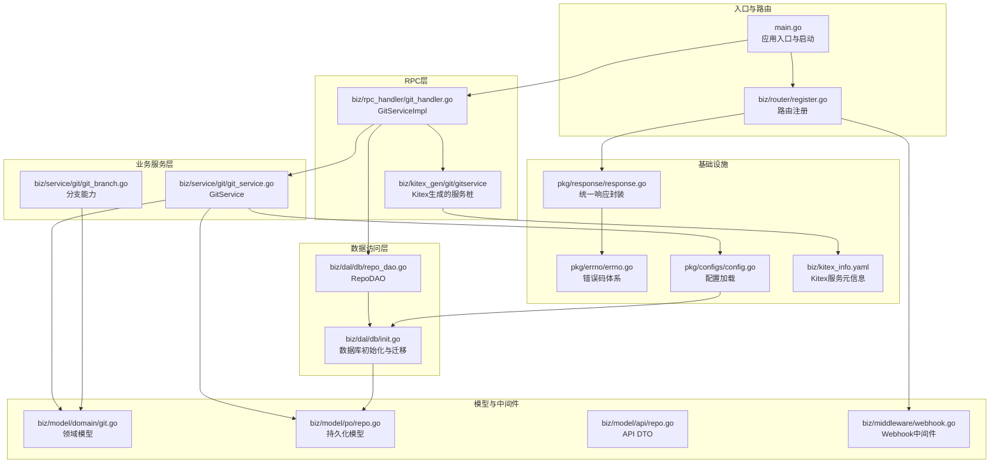
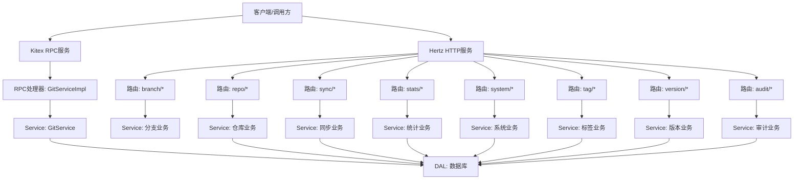
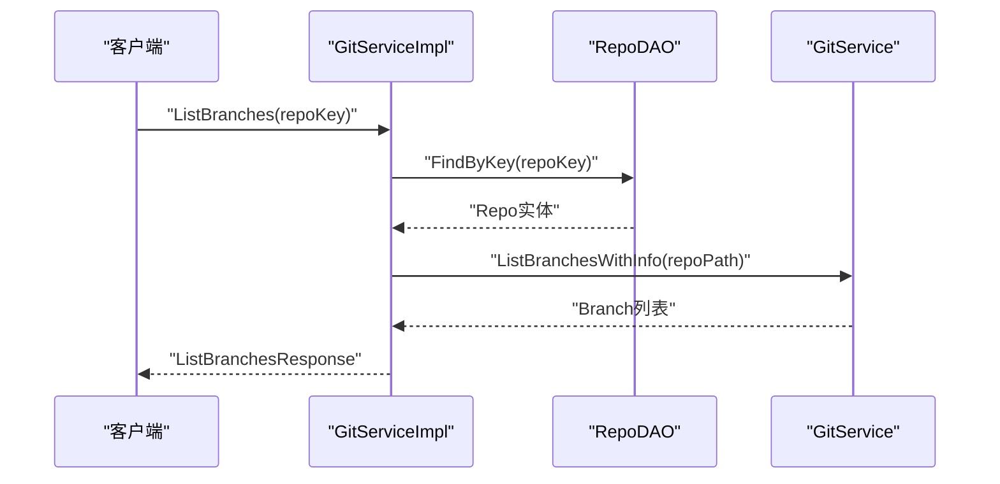
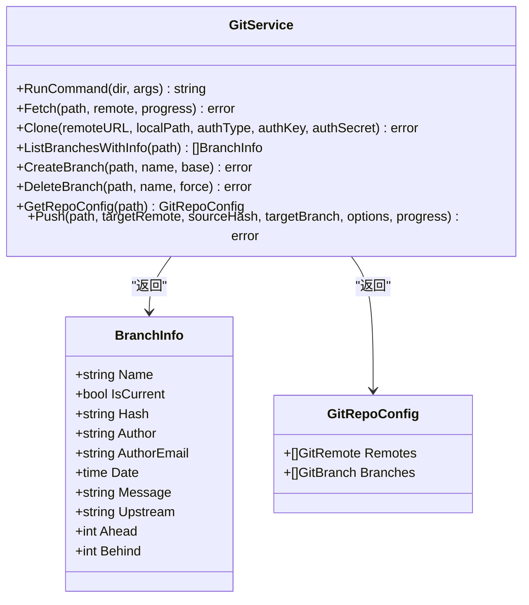
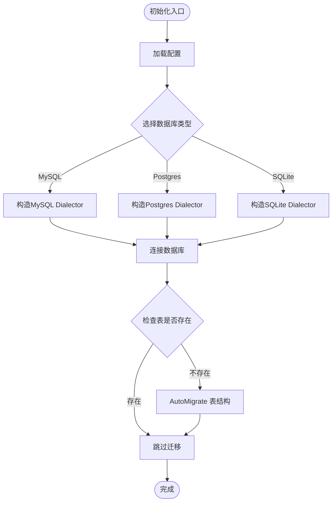
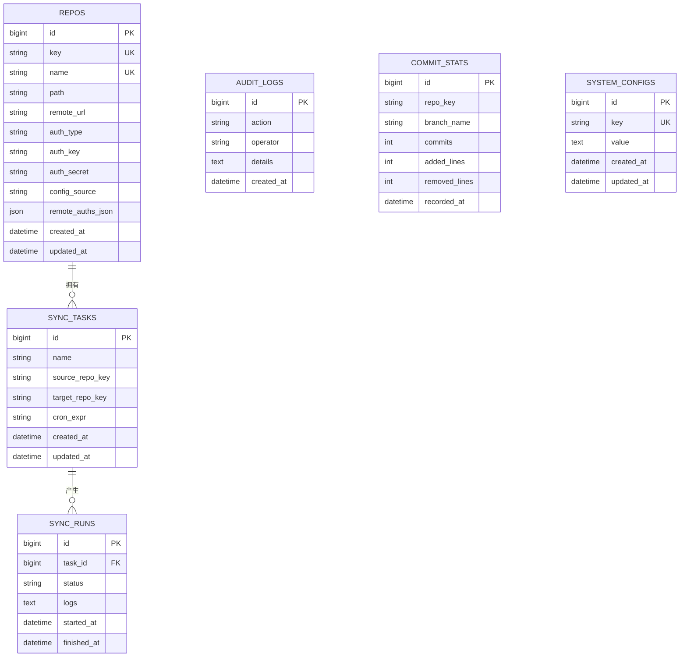
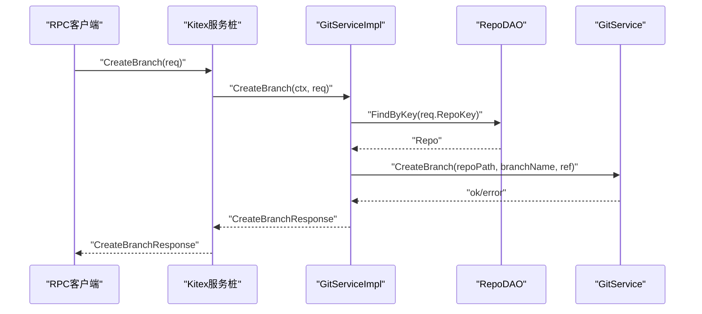
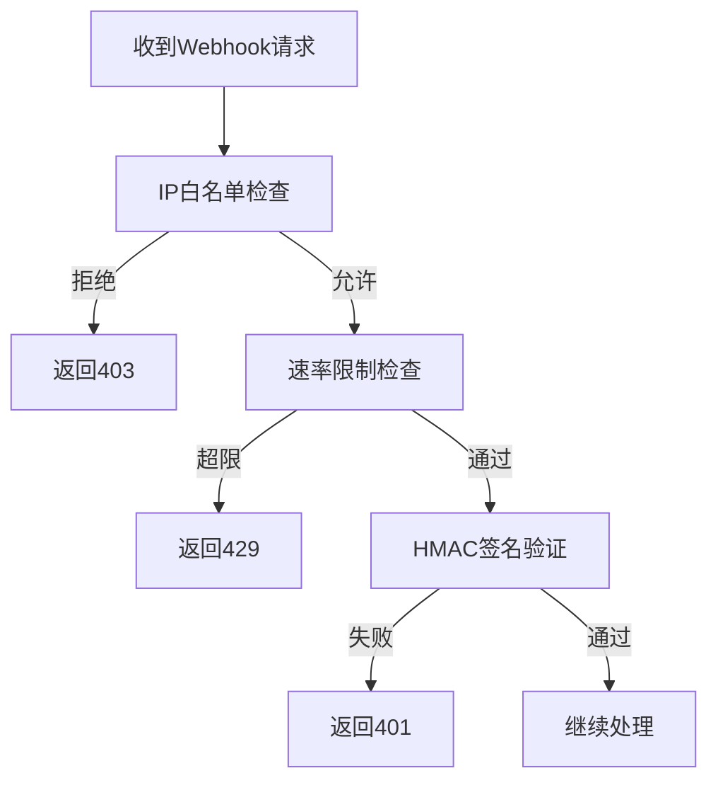
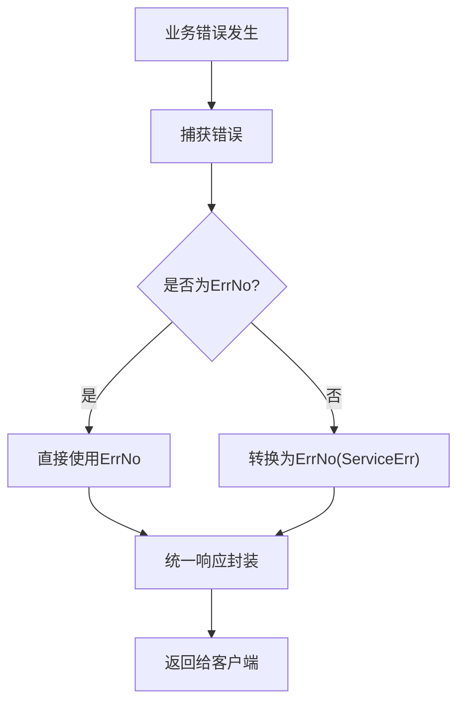

# 核心模块

<cite>
**本文引用的文件**
- [main.go](file://main.go)
- [register.go](file://biz/router/register.go)
- [git_handler.go](file://biz/rpc_handler/git_handler.go)
- [git_service.go](file://biz/service/git/git_service.go)
- [git_branch.go](file://biz/service/git/git_branch.go)
- [init.go](file://biz/dal/db/init.go)
- [repo_dao.go](file://biz/dal/db/repo_dao.go)
- [git.go](file://biz/model/domain/git.go)
- [repo.go](file://biz/model/po/repo.go)
- [repo.go](file://biz/model/api/repo.go)
- [webhook.go](file://biz/middleware/webhook.go)
- [errno.go](file://pkg/errno/errno.go)
- [response.go](file://pkg/response/response.go)
- [config.go](file://pkg/configs/config.go)
- [kitex_info.yaml](file://biz/kitex_info.yaml)
</cite>

## 目录
1. [简介](#简介)
2. [项目结构](#项目结构)
3. [核心组件](#核心组件)
4. [架构总览](#架构总览)
5. [详细组件分析](#详细组件分析)
6. [依赖分析](#依赖分析)
7. [性能考虑](#性能考虑)
8. [故障排查指南](#故障排查指南)
9. [结论](#结论)
10. [附录](#附录)

## 简介
本文件面向“Git管理服务核心模块”，系统性梳理业务逻辑层（Biz Layer）的Handler、Service、DAL三层架构设计与交互关系，覆盖数据访问层的数据库操作、模型定义与领域建模，说明RPC处理器的实现与接口定义，并给出模块间依赖、接口规范与数据流转图示。同时提供错误处理机制与异常管理策略，以及扩展与定制建议，帮助开发者快速理解与高效迭代。

## 项目结构
核心模块围绕三层架构组织：
- Handler：HTTP路由与RPC处理器，负责请求接入、参数校验与响应封装。
- Service：业务服务层，封装Git操作、统计计算、同步调度等核心逻辑。
- DAL：数据访问层，基于GORM进行数据库迁移与CRUD。

图表来源
- [main.go](file://main.go#L52-L176)
- [register.go](file://biz/router/register.go#L18-L42)
- [git_handler.go](file://biz/rpc_handler/git_handler.go#L12-L131)
- [git_service.go](file://biz/service/git/git_service.go#L27-L800)
- [git_branch.go](file://biz/service/git/git_branch.go#L13-L187)
- [init.go](file://biz/dal/db/init.go#L18-L72)
- [repo_dao.go](file://biz/dal/db/repo_dao.go#L7-L42)
- [git.go](file://biz/model/domain/git.go#L1-L40)
- [repo.go](file://biz/model/po/repo.go#L11-L93)
- [repo.go](file://biz/model/api/repo.go#L10-L77)
- [webhook.go](file://biz/middleware/webhook.go#L18-L70)
- [errno.go](file://pkg/errno/errno.go#L7-L129)
- [response.go](file://pkg/response/response.go#L9-L87)
- [config.go](file://pkg/configs/config.go#L18-L43)
- [kitex_info.yaml](file://biz/kitex_info.yaml#L1-L4)

章节来源
- [main.go](file://main.go#L52-L176)
- [register.go](file://biz/router/register.go#L18-L42)

## 核心组件
- 应用入口与启动：负责解析启动模式、初始化配置、数据库、加密工具与各业务服务，按需启动HTTP与RPC服务。
- 路由注册：集中注册各模块路由与静态资源，统一对外提供REST API。
- RPC处理器：实现Kitex生成的GitService接口，桥接Handler与Service/DAL。
- 业务服务：封装Git命令与go-git操作、分支信息聚合、远程认证检测、日志与统计等。
- 数据访问层：根据配置选择MySQL/Postgres/SQLite，自动迁移表结构，提供DAO方法。
- 模型与DTO：领域模型描述Git仓库配置与分支信息；PO用于持久化；API DTO用于对外传输。
- 中间件与错误处理：Webhook鉴权、限流与签名验证；统一响应封装与错误码体系。

章节来源
- [main.go](file://main.go#L115-L176)
- [register.go](file://biz/router/register.go#L18-L42)
- [git_handler.go](file://biz/rpc_handler/git_handler.go#L12-L131)
- [git_service.go](file://biz/service/git/git_service.go#L27-L800)
- [git_branch.go](file://biz/service/git/git_branch.go#L13-L187)
- [init.go](file://biz/dal/db/init.go#L18-L72)
- [repo_dao.go](file://biz/dal/db/repo_dao.go#L7-L42)
- [git.go](file://biz/model/domain/git.go#L1-L40)
- [repo.go](file://biz/model/po/repo.go#L11-L93)
- [repo.go](file://biz/model/api/repo.go#L10-L77)
- [webhook.go](file://biz/middleware/webhook.go#L18-L70)
- [errno.go](file://pkg/errno/errno.go#L7-L129)
- [response.go](file://pkg/response/response.go#L9-L87)
- [config.go](file://pkg/configs/config.go#L18-L43)

## 架构总览
三层架构职责分离清晰：
- Handler层：接收HTTP请求或RPC调用，进行参数校验与响应封装，必要时调用Service/DAL。
- Service层：封装核心业务逻辑，如Git操作、统计与同步调度，屏蔽底层细节。
- DAL层：抽象数据库访问，提供DAO方法，负责数据持久化与迁移。

图表来源
- [main.go](file://main.go#L136-L176)
- [register.go](file://biz/router/register.go#L18-L42)
- [git_handler.go](file://biz/rpc_handler/git_handler.go#L12-L131)

## 详细组件分析

### Handler与RPC处理器
- HTTP路由：通过统一注册函数集中注册各模块路由，并提供静态资源与Swagger文档。
- RPC处理器：实现GitService接口，将RPC请求映射到DAO查询与Service操作，返回IDL定义的响应结构。
- 关键流程：ListRepos/GetRepo/ListBranches/CreateBranch/DeleteBranch等，均先DAO读取仓库信息，再调用GitService执行具体Git操作。

图表来源
- [git_handler.go](file://biz/rpc_handler/git_handler.go#L72-L100)
- [repo_dao.go](file://biz/dal/db/repo_dao.go#L23-L27)
- [git_service.go](file://biz/service/git/git_service.go#L13-L79)

章节来源
- [register.go](file://biz/router/register.go#L18-L42)
- [git_handler.go](file://biz/rpc_handler/git_handler.go#L12-L131)

### Service层：GitService与分支能力
- GitService：封装Git命令执行、go-git操作、远程认证检测、克隆/拉取/推送、分支与标签管理、日志与统计等。
- 分支能力：列举分支详情、创建/删除/重命名分支、设置分支描述、计算分支指标等。
- 领域建模：使用领域模型描述Git仓库配置、分支信息与远程配置，便于跨层传递。

图表来源
- [git_service.go](file://biz/service/git/git_service.go#L27-L800)
- [git.go](file://biz/model/domain/git.go#L26-L40)

章节来源
- [git_service.go](file://biz/service/git/git_service.go#L27-L800)
- [git_branch.go](file://biz/service/git/git_branch.go#L13-L187)
- [git.go](file://biz/model/domain/git.go#L1-L40)

### DAL层：数据库初始化与DAO
- 数据库初始化：根据配置选择数据库类型，构造Dialector并连接；若表不存在则自动迁移。
- RepoDAO：提供创建、查询、保存、删除等基础DAO方法，供上层业务调用。
- 模型定义：PO模型包含敏感字段加密/解密钩子，确保安全存储与使用。

图表来源
- [init.go](file://biz/dal/db/init.go#L18-L72)
- [config.go](file://pkg/configs/config.go#L18-L43)

章节来源
- [init.go](file://biz/dal/db/init.go#L18-L72)
- [repo_dao.go](file://biz/dal/db/repo_dao.go#L7-L42)
- [repo.go](file://biz/model/po/repo.go#L30-L93)

### 模型与领域建模
- PO模型：仓库实体，包含路径、远端地址、认证方式与密钥等，提供BeforeSave/AfterFind钩子进行加密与解密。
- API DTO：面向外部的传输对象，包含仓库基本信息与可选的远程认证映射。
- 领域模型：描述Git仓库的远程与分支配置，便于Service层进行业务计算与展示。

图表来源
- [repo.go](file://biz/model/po/repo.go#L11-L93)
- [init.go](file://biz/dal/db/init.go#L66-L71)

章节来源
- [repo.go](file://biz/model/po/repo.go#L11-L93)
- [repo.go](file://biz/model/api/repo.go#L10-L77)
- [git.go](file://biz/model/domain/git.go#L1-L40)

### RPC接口与IDL
- 服务名与工具版本：服务名为git_service，使用Kitex生成服务桩。
- GitServiceImpl：实现ListRepos、GetRepo、ListBranches、CreateBranch、DeleteBranch等接口，返回IDL定义的响应结构。
- 交互流程：RPC调用经由Kitex服务桩进入GitServiceImpl，DAO查询仓库信息，Service执行Git操作，最终返回响应。

图表来源
- [git_handler.go](file://biz/rpc_handler/git_handler.go#L102-L115)
- [kitex_info.yaml](file://biz/kitex_info.yaml#L1-L4)

章节来源
- [git_handler.go](file://biz/rpc_handler/git_handler.go#L12-L131)
- [kitex_info.yaml](file://biz/kitex_info.yaml#L1-L4)

### 中间件与Webhook安全
- WebhookAuth中间件：支持IP白名单、速率限制与HMAC SHA256签名验证，保障外部回调的安全性。
- 配置来源：从全局配置读取密钥、限速与白名单，兼容环境变量覆盖。

图表来源
- [webhook.go](file://biz/middleware/webhook.go#L18-L70)
- [config.go](file://pkg/configs/config.go#L18-L43)

章节来源
- [webhook.go](file://biz/middleware/webhook.go#L18-L70)
- [config.go](file://pkg/configs/config.go#L18-L43)

### 错误处理与异常管理
- 错误码体系：定义通用与业务域错误码，支持携带自定义消息与转换为标准错误。
- 统一响应：封装统一响应结构，支持成功、接受异步处理、参数错误、未找到、服务器错误、未授权、禁止访问、冲突等场景。
- 使用建议：在Handler中优先使用统一响应封装，在Service中抛出ErrNo，由上层统一转换。

图表来源
- [errno.go](file://pkg/errno/errno.go#L119-L129)
- [response.go](file://pkg/response/response.go#L35-L87)

章节来源
- [errno.go](file://pkg/errno/errno.go#L7-L129)
- [response.go](file://pkg/response/response.go#L9-L87)

## 依赖分析
- 启动阶段依赖：main负责初始化配置、数据库、加密工具与各业务服务，然后按模式启动HTTP与RPC。
- 路由依赖：路由注册集中导入各模块路由，形成统一API入口。
- RPC依赖：GitServiceImpl依赖RepoDAO与GitService，Kitex服务桩负责序列化与网络传输。
- Service依赖：GitService依赖go-git与配置，分支能力依赖领域模型。
- DAL依赖：RepoDAO依赖GORM与配置，初始化时进行表迁移。
- 中间件与错误处理：Webhook中间件依赖配置，统一响应与错误码贯穿各层。

```mermaid
graph TB
MAIN["main.go"] --> CONF["pkg/configs/config.go"]
MAIN --> DBINIT["biz/dal/db/init.go"]
MAIN --> ENC["biz/utils/..."]
MAIN --> CRON["biz/service/sync/cron_service.go"]
MAIN --> STATS["biz/service/stats/stats_service.go"]
MAIN --> AUDIT["biz/service/audit/audit_service.go"]
REG["biz/router/register.go"] --> H_REPOS["repo路由"]
REG --> H_BRANCH["branch路由"]
REG --> H_SYNC["sync路由"]
REG --> H_STATS["stats路由"]
REG --> H_SYSTEM["system路由"]
REG --> H_TAG["tag路由"]
REG --> H_VERSION["version路由"]
REG --> H_AUDIT["audit路由"]
RPC["biz/rpc_handler/git_handler.go"] --> DAO["biz/dal/db/repo_dao.go"]
RPC --> SVC["biz/service/git/git_service.go"]
SVC --> DOMAIN["biz/model/domain/git.go"]
DAO --> PO["biz/model/po/repo.go"]
REG --> RESP["pkg/response/response.go"]
RESP --> ERR["pkg/errno/errno.go"]
```

图表来源
- [main.go](file://main.go#L115-L176)
- [register.go](file://biz/router/register.go#L18-L42)
- [git_handler.go](file://biz/rpc_handler/git_handler.go#L12-L131)
- [repo_dao.go](file://biz/dal/db/repo_dao.go#L7-L42)
- [git_service.go](file://biz/service/git/git_service.go#L27-L800)
- [git.go](file://biz/model/domain/git.go#L1-L40)
- [repo.go](file://biz/model/po/repo.go#L11-L93)
- [response.go](file://pkg/response/response.go#L9-L87)
- [errno.go](file://pkg/errno/errno.go#L7-L129)

章节来源
- [main.go](file://main.go#L115-L176)
- [register.go](file://biz/router/register.go#L18-L42)
- [git_handler.go](file://biz/rpc_handler/git_handler.go#L12-L131)

## 性能考虑
- Git操作：大量日志与分支统计属于CPU/IO密集型，建议在Service层增加缓存与分页，避免一次性加载全部数据。
- 数据库：DAO查询尽量使用索引字段（如key、path），批量操作使用事务，减少往返开销。
- RPC与HTTP：对高频接口采用限流与降级策略，结合速率限制中间件与错误码快速失败。
- 远程认证：优先使用SSH Agent或无密码密钥，减少交互式输入导致的阻塞。

## 故障排查指南
- 数据库连接失败：检查配置文件中的数据库类型、DSN或路径，确认初始化流程是否执行迁移。
- Git命令失败：查看RunCommand输出与错误信息，确认仓库路径、权限与远程URL可达性。
- RPC调用异常：核对Kitex服务名与IDL生成情况，确认服务端口与客户端连接参数一致。
- Webhook被拒：检查IP白名单、速率限制阈值与签名密钥，确保请求头格式正确。
- 统一响应与错误码：通过响应结构中的code/msg/error定位问题来源，结合错误码体系快速定位业务域。

章节来源
- [init.go](file://biz/dal/db/init.go#L18-L72)
- [git_service.go](file://biz/service/git/git_service.go#L33-L48)
- [git_handler.go](file://biz/rpc_handler/git_handler.go#L12-L131)
- [webhook.go](file://biz/middleware/webhook.go#L18-L70)
- [response.go](file://pkg/response/response.go#L35-L87)
- [errno.go](file://pkg/errno/errno.go#L119-L129)

## 结论
该核心模块以Handler/Service/DAL三层架构清晰划分职责，结合Kitex RPC与Hertz HTTP双栈，既满足内部服务间通信，也提供REST API能力。通过领域模型与DTO分离、DAO抽象与GORM迁移、统一响应与错误码体系，实现了高内聚低耦合的设计。建议在扩展新功能时遵循现有分层与命名约定，复用中间件与错误处理机制，确保一致性与可维护性。

## 附录
- 扩展建议
  - 新增业务：在对应模块下新增Service与DAO，遵循DTO/PO分离与加密钩子。
  - 新增路由：在router目录新增模块路由文件并注册到GeneratedRegister。
  - 新增RPC接口：在IDL中定义接口，生成服务桩后在GitServiceImpl中实现。
  - 安全加固：对敏感字段持续使用加密钩子，完善Webhook中间件的审计日志。
- 定制要点
  - 配置优先：通过配置中心或环境变量控制数据库、密钥与限流参数。
  - 日志与监控：在Service层增加关键操作的日志埋点，便于追踪与排障。