# API模型

<cite>
**本文引用的文件**
- [biz/model/api/repo.go](file://biz/model/api/repo.go)
- [biz/model/api/branch.go](file://biz/model/api/branch.go)
- [biz/model/api/sync.go](file://biz/model/api/sync.go)
- [biz/model/api/stats.go](file://biz/model/api/stats.go)
- [biz/model/api/audit.go](file://biz/model/api/audit.go)
- [biz/model/api/task.go](file://biz/model/api/task.go)
- [biz/model/api/tag.go](file://biz/model/api/tag.go)
- [biz/model/api/system.go](file://biz/model/api/system.go)
- [biz/model/domain/common.go](file://biz/model/domain/common.go)
- [biz/model/domain/git.go](file://biz/model/domain/git.go)
- [biz/handler/repo/repo_service.go](file://biz/handler/repo/repo_service.go)
- [biz/router/repo/repo.go](file://biz/router/repo/repo.go)
- [pkg/response/response.go](file://pkg/response/response.go)
- [pkg/errno/errno.go](file://pkg/errno/errno.go)
- [idl/biz/repo.proto](file://idl/biz/repo.proto)
- [idl/biz/sync.proto](file://idl/biz/sync.proto)
- [idl/biz/audit.proto](file://idl/biz/audit.proto)
- [idl/api.proto](file://idl/api.proto)
</cite>

## 目录
1. [引言](#引言)
2. [项目结构](#项目结构)
3. [核心组件](#核心组件)
4. [架构总览](#架构总览)
5. [详细组件分析](#详细组件分析)
6. [依赖分析](#依赖分析)
7. [性能考虑](#性能考虑)
8. [故障排查指南](#故障排查指南)
9. [结论](#结论)
10. [附录](#附录)

## 引言
本文件系统化梳理并阐述本项目的API模型设计与实现，重点覆盖以下方面：
- 在接口层的作用与设计原则：统一数据契约、标准化传输格式、明确参数来源与校验策略。
- 业务领域API模型定义：仓库、分支、同步任务、统计分析、审计等模型的字段、类型与约束。
- 与HTTP请求/响应的映射：参数绑定位置（query/body/path）、错误处理与状态码设计。
- 使用示例：在控制器中如何使用模型进行数据绑定与验证。
- 版本管理、向后兼容与模型演进最佳实践。

## 项目结构
本项目采用“接口层模型 + 控制器 + 服务层 + DAO/PO”的分层架构。API模型位于biz/model/api目录，承载HTTP请求/响应的数据结构；控制器位于biz/handler，负责参数绑定、校验与调用服务；响应封装与错误码位于pkg/response与pkg/errno。

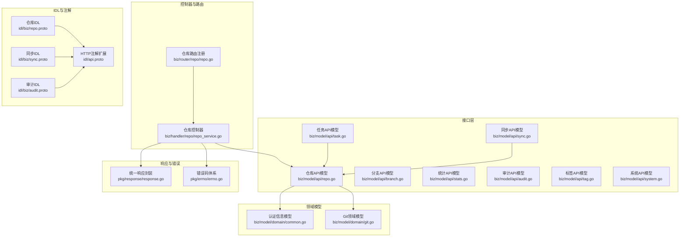

图表来源
- [biz/model/api/repo.go](file://biz/model/api/repo.go#L1-L77)
- [biz/model/api/branch.go](file://biz/model/api/branch.go#L1-L16)
- [biz/model/api/sync.go](file://biz/model/api/sync.go#L1-L41)
- [biz/model/api/stats.go](file://biz/model/api/stats.go#L1-L50)
- [biz/model/api/audit.go](file://biz/model/api/audit.go#L1-L32)
- [biz/model/api/task.go](file://biz/model/api/task.go#L1-L66)
- [biz/model/api/tag.go](file://biz/model/api/tag.go#L1-L14)
- [biz/model/api/system.go](file://biz/model/api/system.go#L1-L29)
- [biz/model/domain/common.go](file://biz/model/domain/common.go#L1-L8)
- [biz/model/domain/git.go](file://biz/model/domain/git.go#L1-L40)
- [biz/handler/repo/repo_service.go](file://biz/handler/repo/repo_service.go#L1-L200)
- [biz/router/repo/repo.go](file://biz/router/repo/repo.go#L1-L39)
- [pkg/response/response.go](file://pkg/response/response.go#L1-L87)
- [pkg/errno/errno.go](file://pkg/errno/errno.go#L1-L129)
- [idl/biz/repo.proto](file://idl/biz/repo.proto#L1-L199)
- [idl/biz/sync.proto](file://idl/biz/sync.proto#L1-L186)
- [idl/biz/audit.proto](file://idl/biz/audit.proto#L1-L63)
- [idl/api.proto](file://idl/api.proto#L1-L77)

章节来源
- [biz/model/api/repo.go](file://biz/model/api/repo.go#L1-L77)
- [biz/model/api/branch.go](file://biz/model/api/branch.go#L1-L16)
- [biz/model/api/sync.go](file://biz/model/api/sync.go#L1-L41)
- [biz/model/api/stats.go](file://biz/model/api/stats.go#L1-L50)
- [biz/model/api/audit.go](file://biz/model/api/audit.go#L1-L32)
- [biz/model/api/task.go](file://biz/model/api/task.go#L1-L66)
- [biz/model/api/tag.go](file://biz/model/api/tag.go#L1-L14)
- [biz/model/api/system.go](file://biz/model/api/system.go#L1-L29)
- [biz/model/domain/common.go](file://biz/model/domain/common.go#L1-L8)
- [biz/model/domain/git.go](file://biz/model/domain/git.go#L1-L40)
- [biz/handler/repo/repo_service.go](file://biz/handler/repo/repo_service.go#L1-L200)
- [biz/router/repo/repo.go](file://biz/router/repo/repo.go#L1-L39)
- [pkg/response/response.go](file://pkg/response/response.go#L1-L87)
- [pkg/errno/errno.go](file://pkg/errno/errno.go#L1-L129)
- [idl/biz/repo.proto](file://idl/biz/repo.proto#L1-L199)
- [idl/biz/sync.proto](file://idl/biz/sync.proto#L1-L186)
- [idl/biz/audit.proto](file://idl/biz/audit.proto#L1-L63)
- [idl/api.proto](file://idl/api.proto#L1-L77)

## 核心组件
- 统一响应结构与错误码
  - 统一响应结构包含业务状态码、消息、可选错误详情与业务数据。
  - 错误码体系按通用、业务域划分，便于前端与客户端一致处理。
- API模型分层
  - 请求模型：用于HTTP请求体或查询参数的绑定与校验。
  - DTO模型：面向接口层的只读/传输对象，负责序列化输出。
  - 领域模型：如认证信息、Git远端/分支等，作为嵌入字段或关联结构存在。

章节来源
- [pkg/response/response.go](file://pkg/response/response.go#L9-L15)
- [pkg/response/response.go](file://pkg/response/response.go#L17-L87)
- [pkg/errno/errno.go](file://pkg/errno/errno.go#L31-L41)
- [pkg/errno/errno.go](file://pkg/errno/errno.go#L43-L54)
- [pkg/errno/errno.go](file://pkg/errno/errno.go#L72-L80)
- [pkg/errno/errno.go](file://pkg/errno/errno.go#L82-L90)
- [pkg/errno/errno.go](file://pkg/errno/errno.go#L92-L99)
- [pkg/errno/errno.go](file://pkg/errno/errno.go#L101-L109)

## 架构总览
下图展示了从HTTP请求到控制器、模型绑定、服务调用与响应返回的整体流程。

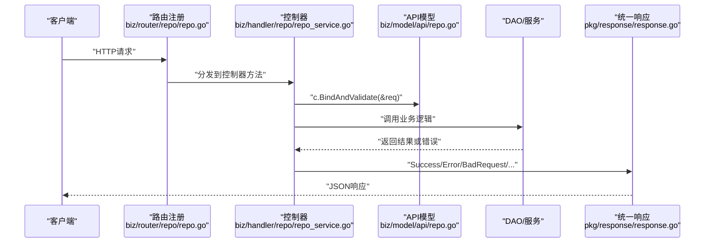

图表来源
- [biz/router/repo/repo.go](file://biz/router/repo/repo.go#L17-L37)
- [biz/handler/repo/repo_service.go](file://biz/handler/repo/repo_service.go#L54-L126)
- [pkg/response/response.go](file://pkg/response/response.go#L17-L87)

## 详细组件分析

### 仓库API模型
- 请求模型
  - 注册仓库：名称、路径、远端URL、认证方式与凭据、配置来源、可选远端集合与逐远端认证信息。
  - 扫描仓库：本地路径。
  - 克隆仓库：远端URL、本地路径、认证方式与凭据、配置来源。
  - 测试连接：目标URL。
  - 合并请求：源引用、目标引用、提交信息、合并策略占位。
- DTO模型
  - 包含仓库主键、名称、路径、远端URL、认证信息、配置来源、远端认证映射、时间戳等。
  - 提供构造函数将持久化对象转换为传输对象。
- 关联领域模型
  - Git远端与认证信息作为嵌入字段，支持多远端与按远端的独立认证。

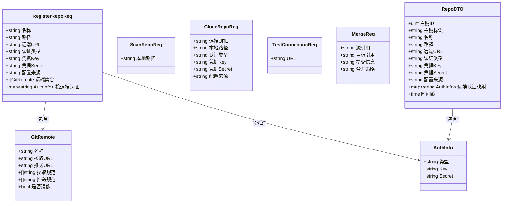

图表来源
- [biz/model/api/repo.go](file://biz/model/api/repo.go#L10-L44)
- [biz/model/api/repo.go](file://biz/model/api/repo.go#L46-L77)
- [biz/model/domain/git.go](file://biz/model/domain/git.go#L5-L12)
- [biz/model/domain/common.go](file://biz/model/domain/common.go#L3-L7)

章节来源
- [biz/model/api/repo.go](file://biz/model/api/repo.go#L10-L77)
- [biz/model/domain/git.go](file://biz/model/domain/git.go#L5-L12)
- [biz/model/domain/common.go](file://biz/model/domain/common.go#L3-L7)

### 分支API模型
- 创建分支：分支名、基础引用。
- 更新分支：新分支名、描述（备注：Git原生不支持分支描述，建议通过配置存储）。
- 推送分支：指定推送的远端列表。

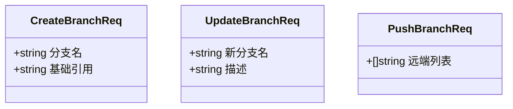

图表来源
- [biz/model/api/branch.go](file://biz/model/api/branch.go#L3-L15)

章节来源
- [biz/model/api/branch.go](file://biz/model/api/branch.go#L1-L16)

### 同步任务API模型
- 运行记录DTO：包含任务键、状态、提交范围、错误信息、详情、起止时间、创建/更新时间，并可内嵌任务详情。
- 任务DTO：包含源/目标仓库键、远端与分支、推送选项、Cron表达式、启用状态、创建/更新时间，并可内嵌源/目标仓库DTO。
- 执行请求：仓库键、源/目标远端与分支、推送选项。
- 运行请求：任务键。

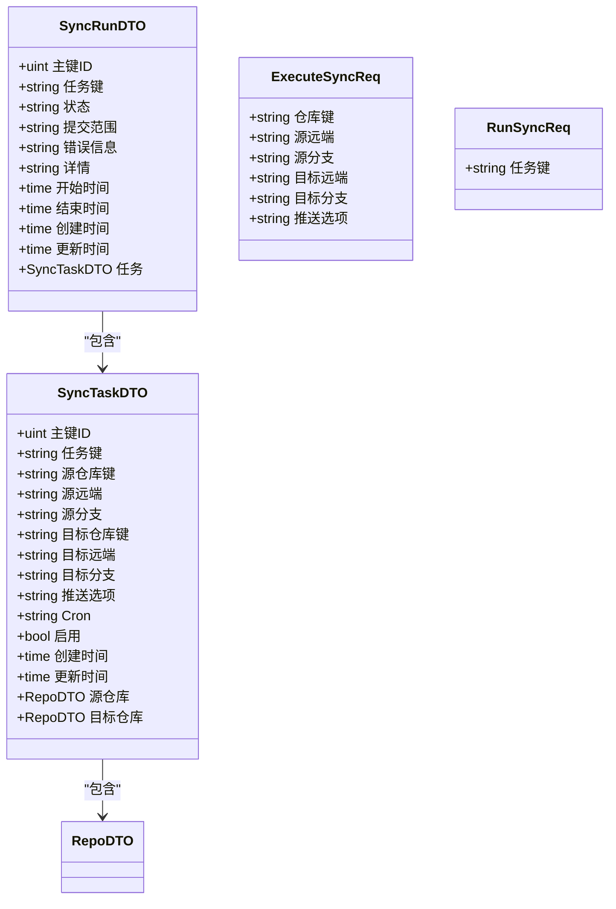

图表来源
- [biz/model/api/sync.go](file://biz/model/api/sync.go#L9-L40)
- [biz/model/api/task.go](file://biz/model/api/task.go#L22-L65)

章节来源
- [biz/model/api/sync.go](file://biz/model/api/sync.go#L1-L41)
- [biz/model/api/task.go](file://biz/model/api/task.go#L1-L66)

### 统计分析API模型
- 作者统计：姓名、邮箱、总行数、按文件类型的行数分布、按日期的时间趋势。
- 代码行统计响应：状态、进度、文件/行数汇总、按语言统计。
- 行统计配置：排除目录与模式。

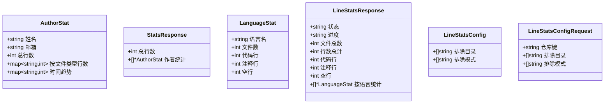

图表来源
- [biz/model/api/stats.go](file://biz/model/api/stats.go#L3-L49)

章节来源
- [biz/model/api/stats.go](file://biz/model/api/stats.go#L1-L50)

### 审计API模型
- 审计日志DTO：包含主键、操作动作、目标、操作者、详情、IP地址、User-Agent、时间戳。

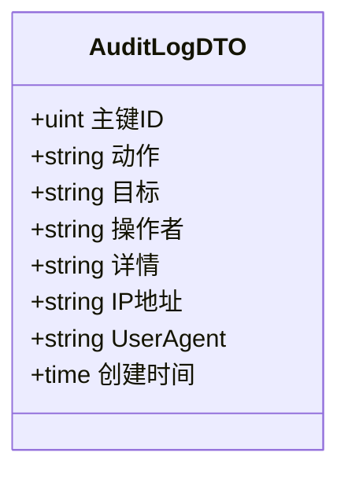

图表来源
- [biz/model/api/audit.go](file://biz/model/api/audit.go#L9-L31)

章节来源
- [biz/model/api/audit.go](file://biz/model/api/audit.go#L1-L32)

### 标签API模型
- 创建标签：标签名、引用（分支名或提交哈希）、消息、可选推送远端。
- 推送标签：标签名、远端。

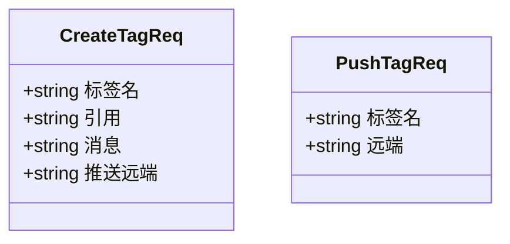

图表来源
- [biz/model/api/tag.go](file://biz/model/api/tag.go#L3-L13)

章节来源
- [biz/model/api/tag.go](file://biz/model/api/tag.go#L1-L14)

### 系统API模型
- 列举目录请求：当前路径、搜索关键字。
- 目录项：名称、路径。
- 列举目录响应：父路径、当前路径、目录列表。
- SSH密钥：名称、路径。
- 配置请求：调试模式、作者名、作者邮箱。

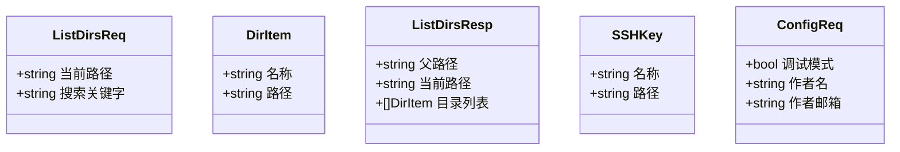

图表来源
- [biz/model/api/system.go](file://biz/model/api/system.go#L3-L29)

章节来源
- [biz/model/api/system.go](file://biz/model/api/system.go#L1-L29)

### HTTP请求/响应映射与验证
- 参数绑定位置
  - 查询参数：通过IDL注解标注为query，控制器中以c.Query读取。
  - 请求体：通过IDL注解标注为body，控制器中使用c.BindAndValidate进行绑定与校验。
- 错误处理与状态码
  - 统一响应结构包含业务状态码与消息；错误时返回对应错误码与可选错误详情。
  - 常见错误码：参数错误、资源不存在、内部错误、未授权、禁止访问、冲突等。
- 控制器中的使用示例
  - 仓库创建：绑定RegisterRepoReq，执行路径校验与远端同步，创建仓库并记录审计日志，异步触发统计同步。
  - 仓库列表/详情：DAO查询后转换为RepoDTO返回。

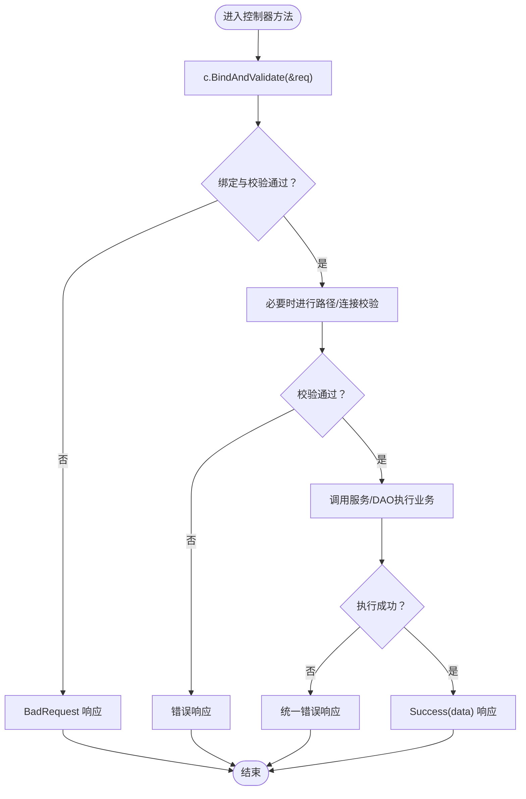

图表来源
- [biz/handler/repo/repo_service.go](file://biz/handler/repo/repo_service.go#L54-L126)
- [pkg/response/response.go](file://pkg/response/response.go#L58-L87)
- [pkg/errno/errno.go](file://pkg/errno/errno.go#L31-L41)

章节来源
- [biz/handler/repo/repo_service.go](file://biz/handler/repo/repo_service.go#L21-L126)
- [pkg/response/response.go](file://pkg/response/response.go#L9-L87)
- [pkg/errno/errno.go](file://pkg/errno/errno.go#L31-L129)

### API版本管理、向后兼容与模型演进
- 版本管理
  - 路由层面采用/v1版本前缀，便于后续新增/v2而不破坏现有客户端。
- 向后兼容
  - 错误码命名与语义保持稳定；新增错误码在各自业务域范围内扩展。
  - 字段演进遵循“新增非必填字段、不删除/重命名已有字段”的原则。
- 模型演进最佳实践
  - 新增字段优先使用可选字段，避免破坏现有客户端解析。
  - 对于IDL定义的字段，保持与注解约定一致（query/body），确保生成代码与绑定行为一致。
  - DTO与请求模型分离，便于在不影响对外契约的情况下优化内部结构。

章节来源
- [biz/router/repo/repo.go](file://biz/router/repo/repo.go#L23-L34)
- [pkg/errno/errno.go](file://pkg/errno/errno.go#L111-L129)
- [idl/api.proto](file://idl/api.proto#L10-L32)

## 依赖分析
- 组件耦合
  - 控制器依赖API模型与统一响应/错误码；API模型依赖领域模型（认证信息、Git远端）。
  - DTO构造函数将DAO/服务层返回的持久化对象映射为传输对象，降低控制器与底层数据结构耦合。
- 外部依赖
  - Hertz框架的参数绑定与路由注册；Kitex/IDL用于RPC与注解扩展。

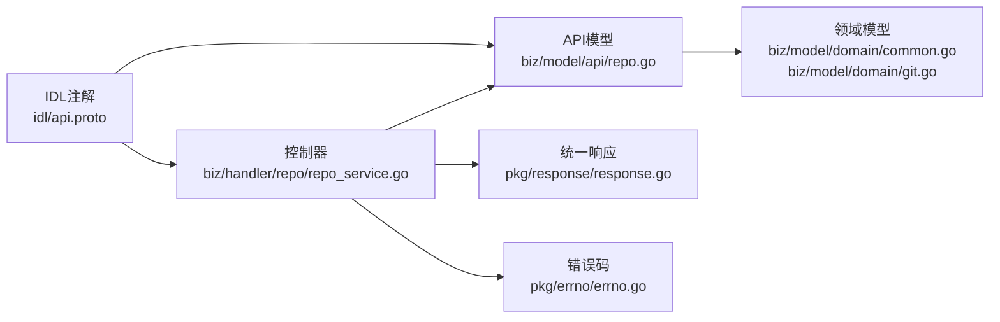

图表来源
- [biz/handler/repo/repo_service.go](file://biz/handler/repo/repo_service.go#L1-L200)
- [biz/model/api/repo.go](file://biz/model/api/repo.go#L1-L77)
- [biz/model/domain/common.go](file://biz/model/domain/common.go#L1-L8)
- [biz/model/domain/git.go](file://biz/model/domain/git.go#L1-L40)
- [pkg/response/response.go](file://pkg/response/response.go#L1-L87)
- [pkg/errno/errno.go](file://pkg/errno/errno.go#L1-L129)
- [idl/api.proto](file://idl/api.proto#L1-L77)

章节来源
- [biz/handler/repo/repo_service.go](file://biz/handler/repo/repo_service.go#L1-L200)
- [biz/model/api/repo.go](file://biz/model/api/repo.go#L1-L77)
- [biz/model/domain/common.go](file://biz/model/domain/common.go#L1-L8)
- [biz/model/domain/git.go](file://biz/model/domain/git.go#L1-L40)
- [pkg/response/response.go](file://pkg/response/response.go#L1-L87)
- [pkg/errno/errno.go](file://pkg/errno/errno.go#L1-L129)
- [idl/api.proto](file://idl/api.proto#L1-L77)

## 性能考虑
- DTO映射与序列化：尽量复用已有的构造函数，减少重复映射开销。
- 异步处理：如仓库创建后触发统计同步，避免阻塞请求响应。
- 缓存与预热：统计类接口可结合缓存策略，降低重复计算成本（具体实现参考统计服务相关模块）。

## 故障排查指南
- 参数错误
  - 现象：返回参数错误码与提示。
  - 排查：检查请求体字段是否正确、查询参数是否缺失。
- 资源不存在
  - 现象：返回资源不存在错误。
  - 排查：确认仓库键、任务键等标识是否存在。
- 服务器内部错误
  - 现象：返回内部错误码与错误详情。
  - 排查：查看服务日志与DAO/服务层异常堆栈。
- 未授权/禁止访问
  - 现象：返回相应权限错误码。
  - 排查：核对鉴权中间件与权限策略。

章节来源
- [pkg/response/response.go](file://pkg/response/response.go#L58-L87)
- [pkg/errno/errno.go](file://pkg/errno/errno.go#L31-L41)
- [pkg/errno/errno.go](file://pkg/errno/errno.go#L72-L80)
- [pkg/errno/errno.go](file://pkg/errno/errno.go#L82-L90)
- [pkg/errno/errno.go](file://pkg/errno/errno.go#L101-L109)

## 结论
本项目的API模型通过清晰的请求/响应分层、统一的错误与响应机制，以及与IDL注解的强绑定，实现了接口契约的明确性与可维护性。在仓库、分支、同步、统计、审计等业务域上，模型定义覆盖了主要字段与约束，并通过DTO与领域模型的分离提升了扩展性。配合版本前缀与错误码体系，项目具备良好的向后兼容与演进能力。

## 附录
- 业务域IDL与路由对照
  - 仓库：/api/v1/repo/*，涉及列表、详情、创建、更新、删除、扫描、克隆、拉取、克隆任务等。
  - 同步：/api/v1/sync/*，涉及任务列表、详情、创建、更新、删除、手动运行、执行同步、历史列表等。
  - 审计：/api/v1/audit/*，涉及日志列表、详情。

章节来源
- [idl/biz/repo.proto](file://idl/biz/repo.proto#L12-L57)
- [idl/biz/sync.proto](file://idl/biz/sync.proto#L11-L57)
- [idl/biz/audit.proto](file://idl/biz/audit.proto#L11-L22)
- [biz/router/repo/repo.go](file://biz/router/repo/repo.go#L17-L37)