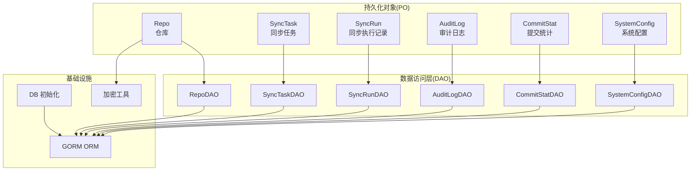
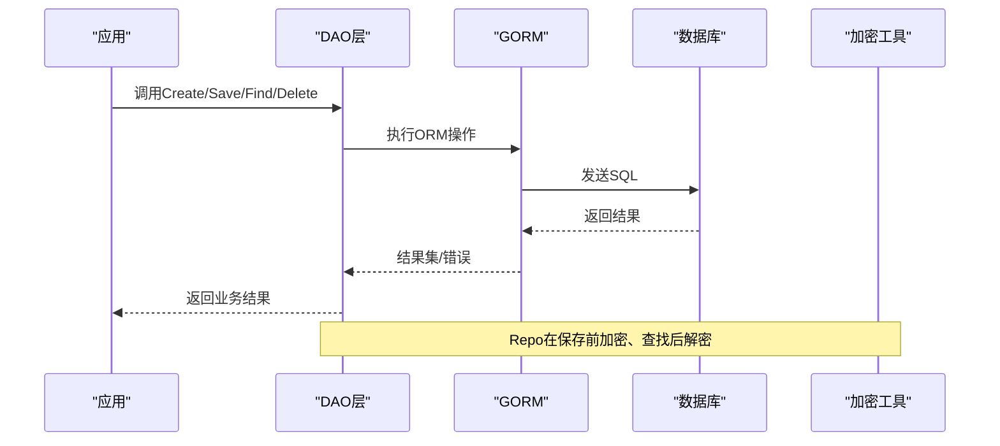
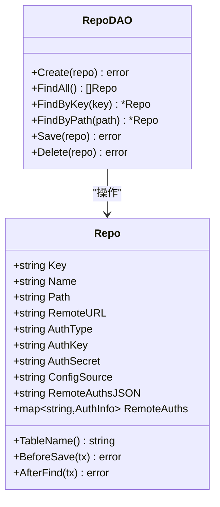
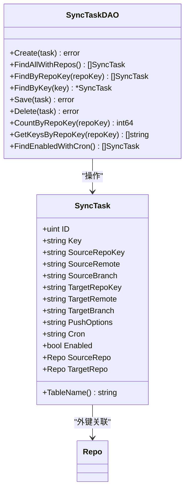
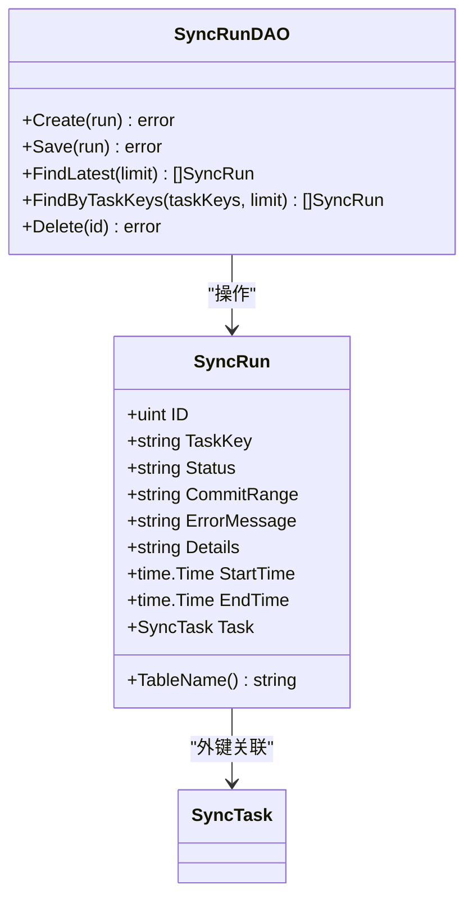
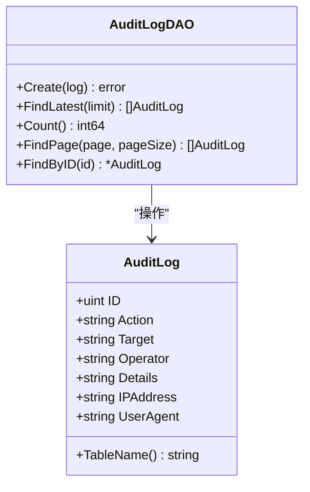
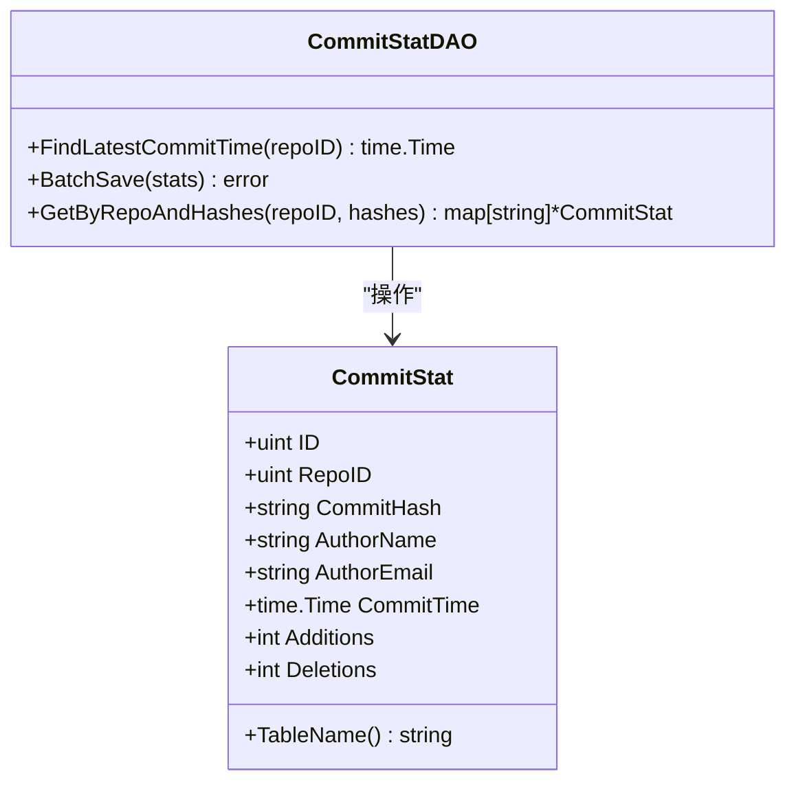
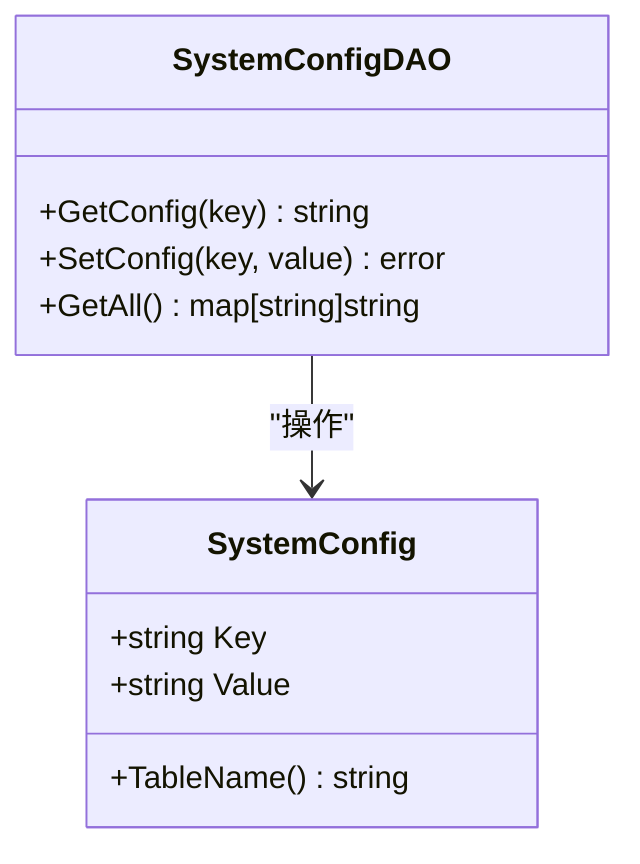
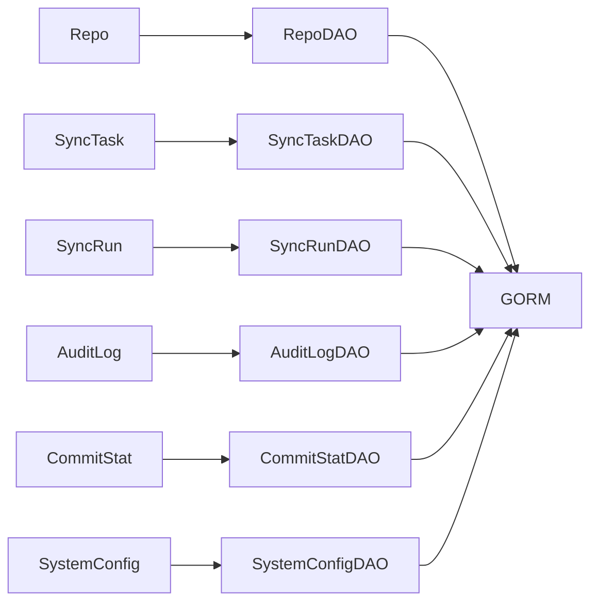

# 持久化对象

<cite>
**本文引用的文件**
- [biz/model/po/repo.go](file://biz/model/po/repo.go)
- [biz/model/po/sync_task.go](file://biz/model/po/sync_task.go)
- [biz/model/po/sync_run.go](file://biz/model/po/sync_run.go)
- [biz/model/po/audit.go](file://biz/model/po/audit.go)
- [biz/model/po/commit_stat.go](file://biz/model/po/commit_stat.go)
- [biz/model/po/system_config.go](file://biz/model/po/system_config.go)
- [biz/dal/db/init.go](file://biz/dal/db/init.go)
- [biz/dal/db/repo_dao.go](file://biz/dal/db/repo_dao.go)
- [biz/dal/db/sync_task_dao.go](file://biz/dal/db/sync_task_dao.go)
- [biz/dal/db/sync_run_dao.go](file://biz/dal/db/sync_run_dao.go)
- [biz/dal/db/audit_log_dao.go](file://biz/dal/db/audit_log_dao.go)
- [biz/dal/db/commit_stat_dao.go](file://biz/dal/db/commit_stat_dao.go)
- [biz/dal/db/system_config_dao.go](file://biz/dal/db/system_config_dao.go)
- [biz/utils/crypto.go](file://biz/utils/crypto.go)
</cite>

## 目录
1. [简介](#简介)
2. [项目结构](#项目结构)
3. [核心组件](#核心组件)
4. [架构总览](#架构总览)
5. [详细组件分析](#详细组件分析)
6. [依赖分析](#依赖分析)
7. [性能考量](#性能考量)
8. [故障排查指南](#故障排查指南)
9. [结论](#结论)
10. [附录](#附录)

## 简介
本文件聚焦于数据访问层的持久化对象（PO）模型，系统性阐述PO在ORM映射中的核心作用，以及如何通过PO模型实现数据库表结构与Go结构体之间的映射关系。文档覆盖以下业务实体的PO模型：仓库（Repo）、同步任务（SyncTask）、同步执行记录（SyncRun）、审计日志（AuditLog）、提交统计（CommitStat）、系统配置（SystemConfig）。内容包含字段定义、数据类型映射、数据库约束、GORM标签使用、关系映射、索引定义、查询优化策略，以及DAO层的CRUD示例与设计原则。

## 项目结构
- PO模型位于 biz/model/po，每个实体一个文件，采用GORM.Model作为基础，内置通用字段（创建时间、更新时间、删除时间等）。
- DAO层位于 biz/dal/db，每个实体一个DAO，封装CRUD与常用查询。
- 数据库初始化位于 biz/dal/db/init.go，负责根据配置选择驱动并执行AutoMigrate。
- 加密工具位于 biz/utils/crypto.go，用于敏感字段的加密存储。

图表来源
- [biz/dal/db/init.go](file://biz/dal/db/init.go#L18-L71)
- [biz/model/po/repo.go](file://biz/model/po/repo.go#L11-L24)
- [biz/model/po/sync_task.go](file://biz/model/po/sync_task.go#L8-L24)
- [biz/model/po/sync_run.go](file://biz/model/po/sync_run.go#L9-L21)
- [biz/model/po/audit.go](file://biz/model/po/audit.go#L8-L16)
- [biz/model/po/commit_stat.go](file://biz/model/po/commit_stat.go#L9-L18)
- [biz/model/po/system_config.go](file://biz/model/po/system_config.go#L3-L6)

章节来源
- [biz/dal/db/init.go](file://biz/dal/db/init.go#L18-L71)

## 核心组件
本节概述各PO模型的核心职责与关键字段，强调与GORM标签的配合以实现表结构映射、索引与约束。

- 仓库（Repo）
  - 关键字段：唯一键、名称、路径、远端地址、认证类型、认证凭据、配置来源、远端认证映射（内存与JSON存储）。
  - GORM标签：唯一索引、自定义表名、JSON序列化控制。
  - 生命周期钩子：保存前加密、查找后解密。
- 同步任务（SyncTask）
  - 关键字段：任务键、源/目标仓库键、远端与分支、推送选项、Cron表达式、启用状态。
  - 关系映射：与Repo的一对一外键关联（源/目标仓库）。
  - 表名：sync_tasks。
- 同步执行记录（SyncRun）
  - 关键字段：任务键、状态、提交范围、错误信息、详情（文本）、开始/结束时间。
  - 关系映射：与SyncTask的外键关联。
  - 表名：sync_runs。
- 审计日志（AuditLog）
  - 关键字段：动作、目标、操作者、详情（文本）、IP地址、User-Agent。
  - 索引：动作与目标字段建立索引以支持快速检索。
  - 表名：audit_logs。
- 提交统计（CommitStat）
  - 关键字段：仓库ID、提交哈希、作者姓名/邮箱、提交时间、增删行数。
  - 复合唯一索引：仓库ID+提交哈希。
  - 索引：作者邮箱、提交时间。
  - 表名：commit_stats。
- 系统配置（SystemConfig）
  - 关键字段：主键键名、值。
  - 表名：system_configs。

章节来源
- [biz/model/po/repo.go](file://biz/model/po/repo.go#L11-L24)
- [biz/model/po/sync_task.go](file://biz/model/po/sync_task.go#L8-L24)
- [biz/model/po/sync_run.go](file://biz/model/po/sync_run.go#L9-L21)
- [biz/model/po/audit.go](file://biz/model/po/audit.go#L8-L16)
- [biz/model/po/commit_stat.go](file://biz/model/po/commit_stat.go#L9-L18)
- [biz/model/po/system_config.go](file://biz/model/po/system_config.go#L3-L6)

## 架构总览
下图展示了PO模型、DAO层与GORM之间的交互关系，以及初始化流程与加密工具的协作。

图表来源
- [biz/dal/db/repo_dao.go](file://biz/dal/db/repo_dao.go#L13-L41)
- [biz/dal/db/init.go](file://biz/dal/db/init.go#L18-L71)
- [biz/utils/crypto.go](file://biz/utils/crypto.go#L24-L70)

## 详细组件分析

### 仓库（Repo）PO与DAO
- 字段与约束
  - 唯一键与名称：通过唯一索引保证全局唯一性。
  - 认证信息：支持SSH密钥路径或用户名密码；敏感字段在保存前加密，在查找后解密。
  - 远端认证映射：内存中维护，持久化为JSON字符串。
- GORM标签与关系
  - 自定义表名、唯一索引、JSON序列化控制。
  - 生命周期钩子：BeforeSave、AfterFind分别处理加密与解密。
- DAO操作
  - 支持创建、全量查询、按键查询、按路径查询、保存、删除。
- 设计要点
  - 将敏感信息与业务信息分离，避免明文存储。
  - 使用JSON存储复杂结构，兼顾灵活性与性能。

图表来源
- [biz/model/po/repo.go](file://biz/model/po/repo.go#L11-L24)
- [biz/dal/db/repo_dao.go](file://biz/dal/db/repo_dao.go#L7-L41)

章节来源
- [biz/model/po/repo.go](file://biz/model/po/repo.go#L11-L24)
- [biz/dal/db/repo_dao.go](file://biz/dal/db/repo_dao.go#L13-L41)
- [biz/utils/crypto.go](file://biz/utils/crypto.go#L24-L70)

### 同步任务（SyncTask）PO与DAO
- 字段与约束
  - 任务键唯一；源/目标仓库键指向Repo.Key；Cron与启用状态用于调度。
- 关系映射
  - 与Repo建立外键关联（SourceRepoKey→Repo.Key，TargetRepoKey→Repo.Key），支持预加载。
- DAO操作
  - 支持创建、全量查询（含预加载）、按仓库键查询、按键查询、保存、删除、计数、键列表查询、启用且带Cron的任务查询。
- 设计要点
  - 外键约束确保仓库与任务的强一致性。
  - 预加载减少N+1查询问题。

图表来源
- [biz/model/po/sync_task.go](file://biz/model/po/sync_task.go#L8-L24)
- [biz/dal/db/sync_task_dao.go](file://biz/dal/db/sync_task_dao.go#L7-L66)

章节来源
- [biz/model/po/sync_task.go](file://biz/model/po/sync_task.go#L8-L24)
- [biz/dal/db/sync_task_dao.go](file://biz/dal/db/sync_task_dao.go#L13-L66)

### 同步执行记录（SyncRun）PO与DAO
- 字段与约束
  - 任务键外键关联SyncTask；状态枚举化；详情为文本类型；时间字段用于排序。
- 关系映射
  - 与SyncTask建立外键关联（TaskKey→SyncTask.Key），支持预加载。
- DAO操作
  - 支持创建、保存、按最新时间查询、按任务键集合查询（限制数量）、删除。
- 设计要点
  - 通过预加载Task字段，避免二次查询。
  - 查询按开始时间倒序，满足“最近执行”场景。

图表来源
- [biz/model/po/sync_run.go](file://biz/model/po/sync_run.go#L9-L21)
- [biz/dal/db/sync_run_dao.go](file://biz/dal/db/sync_run_dao.go#L7-L39)

章节来源
- [biz/model/po/sync_run.go](file://biz/model/po/sync_run.go#L9-L21)
- [biz/dal/db/sync_run_dao.go](file://biz/dal/db/sync_run_dao.go#L13-L39)

### 审计日志（AuditLog）PO与DAO
- 字段与约束
  - 动作与目标字段建立索引，便于快速检索；详情为文本类型。
- DAO操作
  - 支持创建、查询最新、分页查询（列表页排除大字段）、按ID查询。
- 设计要点
  - 列表页仅选择必要字段，降低网络与解析开销。
  - 索引提升高频查询性能。

图表来源
- [biz/model/po/audit.go](file://biz/model/po/audit.go#L8-L16)
- [biz/dal/db/audit_log_dao.go](file://biz/dal/db/audit_log_dao.go#L7-L45)

章节来源
- [biz/model/po/audit.go](file://biz/model/po/audit.go#L8-L16)
- [biz/dal/db/audit_log_dao.go](file://biz/dal/db/audit_log_dao.go#L13-L45)

### 提交统计（CommitStat）PO与DAO
- 字段与约束
  - 复合唯一索引：仓库ID+提交哈希；作者邮箱、提交时间建立索引。
- DAO操作
  - 支持查询最新提交时间、批量插入/更新（冲突列：仓库ID与提交哈希，更新列：增删行数与作者信息）、按仓库与哈希集合查询已存在记录。
- 设计要点
  - 批量写入使用ON CONFLICT DO UPDATE，避免重复写入。
  - 分批查询哈希集合，提升大数据量下的查询效率。

图表来源
- [biz/model/po/commit_stat.go](file://biz/model/po/commit_stat.go#L9-L18)
- [biz/dal/db/commit_stat_dao.go](file://biz/dal/db/commit_stat_dao.go#L10-L65)

章节来源
- [biz/model/po/commit_stat.go](file://biz/model/po/commit_stat.go#L9-L18)
- [biz/dal/db/commit_stat_dao.go](file://biz/dal/db/commit_stat_dao.go#L16-L65)

### 系统配置（SystemConfig）PO与DAO
- 字段与约束
  - 主键键名唯一；值为字符串。
- DAO操作
  - 支持按键获取、设置、获取全部配置。
- 设计要点
  - 键值对配置简单可靠，适合运行时参数管理。

图表来源
- [biz/model/po/system_config.go](file://biz/model/po/system_config.go#L3-L6)
- [biz/dal/db/system_config_dao.go](file://biz/dal/db/system_config_dao.go#L7-L42)

章节来源
- [biz/model/po/system_config.go](file://biz/model/po/system_config.go#L3-L6)
- [biz/dal/db/system_config_dao.go](file://biz/dal/db/system_config_dao.go#L13-L42)

## 依赖分析
- 组件耦合
  - PO与DAO之间为单向依赖，DAO持有PO指针进行CRUD。
  - SyncTask与Repo之间通过外键建立强关联，DAO提供预加载能力。
  - SyncRun与SyncTask之间通过外键建立关联，DAO提供预加载。
- 外部依赖
  - GORM作为ORM框架，负责SQL生成与执行。
  - 数据库驱动由配置决定（MySQL、Postgres、SQLite）。
  - 加密工具用于Repo的敏感字段保护。

图表来源
- [biz/dal/db/init.go](file://biz/dal/db/init.go#L18-L71)
- [biz/model/po/repo.go](file://biz/model/po/repo.go#L11-L24)
- [biz/model/po/sync_task.go](file://biz/model/po/sync_task.go#L8-L24)
- [biz/model/po/sync_run.go](file://biz/model/po/sync_run.go#L9-L21)
- [biz/model/po/audit.go](file://biz/model/po/audit.go#L8-L16)
- [biz/model/po/commit_stat.go](file://biz/model/po/commit_stat.go#L9-L18)
- [biz/model/po/system_config.go](file://biz/model/po/system_config.go#L3-L6)

## 性能考量
- 索引与查询
  - AuditLog在动作与目标字段建立索引，适合高频过滤。
  - CommitStat在仓库ID+提交哈希上建立复合唯一索引，避免重复写入；在作者邮箱与提交时间建立索引，支持统计查询。
- 预加载与N+1
  - SyncTaskDAO在查询时预加载源/目标仓库，避免N+1查询。
  - SyncRunDAO在查询时预加载任务，减少二次查询。
- 列裁剪
  - AuditLogDAO在分页查询时仅选择必要字段，降低网络与解析成本。
- 批量写入
  - CommitStatDAO使用ON CONFLICT DO UPDATE与分批插入，提升批量写入吞吐。
- 加密成本
  - Repo在保存/查找时进行加解密，建议在批量导入/导出时合并操作以降低开销。

章节来源
- [biz/dal/db/audit_log_dao.go](file://biz/dal/db/audit_log_dao.go#L29-L39)
- [biz/dal/db/sync_task_dao.go](file://biz/dal/db/sync_task_dao.go#L17-L21)
- [biz/dal/db/sync_run_dao.go](file://biz/dal/db/sync_run_dao.go#L21-L25)
- [biz/dal/db/commit_stat_dao.go](file://biz/dal/db/commit_stat_dao.go#L26-L36)
- [biz/model/po/audit.go](file://biz/model/po/audit.go#L10-L11)
- [biz/model/po/commit_stat.go](file://biz/model/po/commit_stat.go#L11-L15)

## 故障排查指南
- 数据库连接失败
  - 检查数据库类型与DSN配置是否正确；确认驱动可用。
- 表不存在或迁移未执行
  - 确认初始化逻辑已执行；检查AutoMigrate是否成功。
- Repo加解密异常
  - 检查加密密钥环境变量是否设置；确认BeforeSave/AfterFind流程未被跳过。
- 查询性能问题
  - 为高频过滤字段添加索引；避免SELECT *；使用预加载减少N+1；对大批量操作使用分批处理。

章节来源
- [biz/dal/db/init.go](file://biz/dal/db/init.go#L18-L71)
- [biz/utils/crypto.go](file://biz/utils/crypto.go#L15-L22)

## 结论
PO模型通过明确的字段定义、GORM标签与生命周期钩子，实现了数据库表结构与Go结构体的高保真映射。DAO层在保持简洁的同时提供了丰富的查询能力，并结合索引、预加载与批量写入等策略提升了整体性能。Repo的加解密实践体现了安全与可用性的平衡。遵循本文的设计原则与最佳实践，可在保证可维护性的同时获得稳定的性能表现。

## 附录
- CRUD操作示例（以路径代替代码片段）
  - 创建仓库：参见 [biz/dal/db/repo_dao.go](file://biz/dal/db/repo_dao.go#L13-L15)
  - 查询仓库：参见 [biz/dal/db/repo_dao.go](file://biz/dal/db/repo_dao.go#L17-L33)
  - 保存仓库：参见 [biz/dal/db/repo_dao.go](file://biz/dal/db/repo_dao.go#L35-L37)
  - 删除仓库：参见 [biz/dal/db/repo_dao.go](file://biz/dal/db/repo_dao.go#L39-L41)
  - 创建同步任务：参见 [biz/dal/db/sync_task_dao.go](file://biz/dal/db/sync_task_dao.go#L13-L15)
  - 预加载仓库的同步任务：参见 [biz/dal/db/sync_task_dao.go](file://biz/dal/db/sync_task_dao.go#L17-L21)
  - 查询最近同步执行记录：参见 [biz/dal/db/sync_run_dao.go](file://biz/dal/db/sync_run_dao.go#L21-L25)
  - 审计日志分页查询：参见 [biz/dal/db/audit_log_dao.go](file://biz/dal/db/audit_log_dao.go#L29-L39)
  - 批量保存提交统计：参见 [biz/dal/db/commit_stat_dao.go](file://biz/dal/db/commit_stat_dao.go#L26-L36)
  - 获取系统配置：参见 [biz/dal/db/system_config_dao.go](file://biz/dal/db/system_config_dao.go#L13-L20)