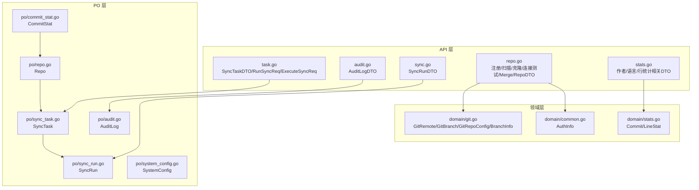
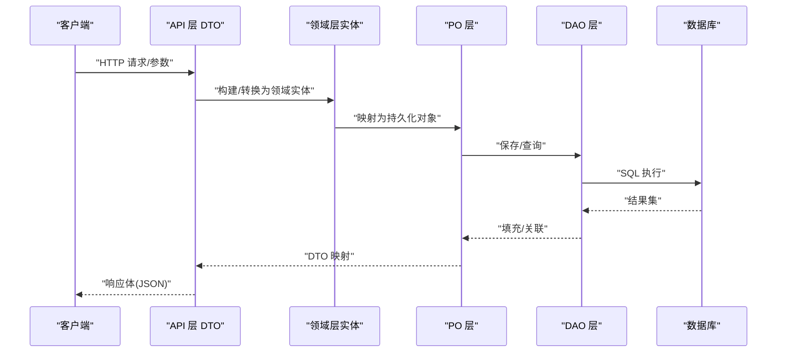
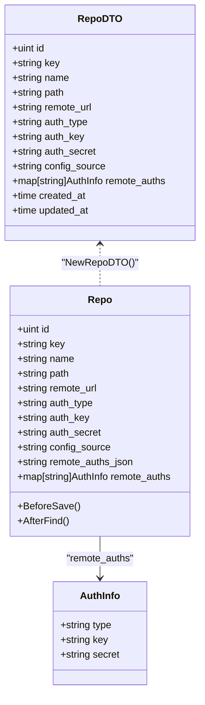
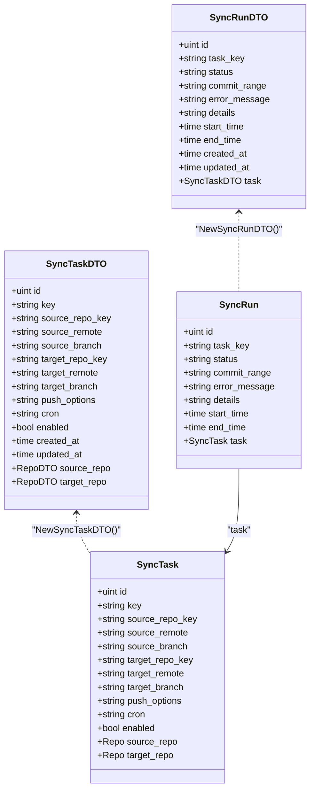
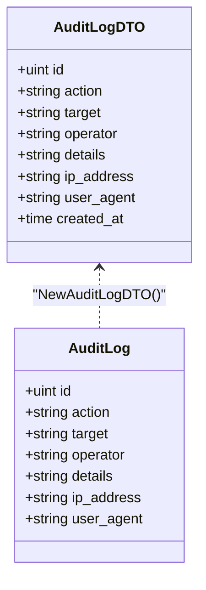
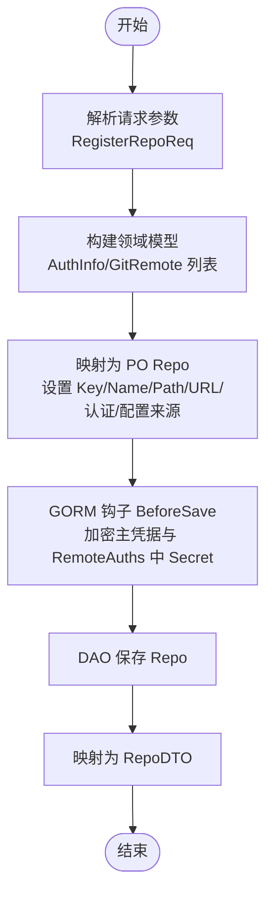
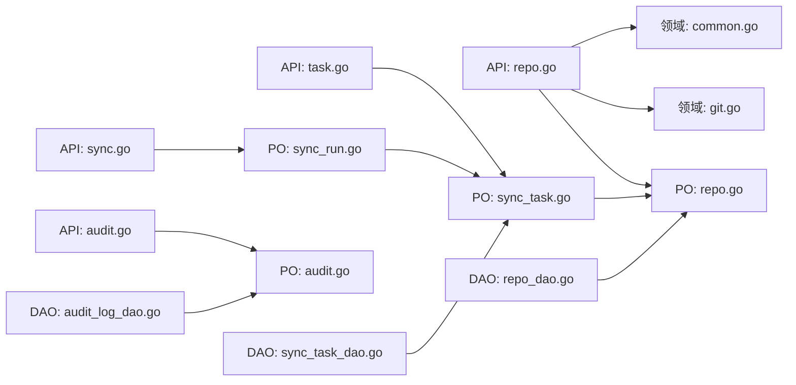

# 模型层

<cite>
**本文引用的文件**
- [biz/model/api/repo.go](file://biz/model/api/repo.go)
- [biz/model/api/sync.go](file://biz/model/api/sync.go)
- [biz/model/api/audit.go](file://biz/model/api/audit.go)
- [biz/model/api/task.go](file://biz/model/api/task.go)
- [biz/model/api/stats.go](file://biz/model/api/stats.go)
- [biz/model/domain/git.go](file://biz/model/domain/git.go)
- [biz/model/domain/common.go](file://biz/model/domain/common.go)
- [biz/model/domain/stats.go](file://biz/model/domain/stats.go)
- [biz/model/po/repo.go](file://biz/model/po/repo.go)
- [biz/model/po/sync_task.go](file://biz/model/po/sync_task.go)
- [biz/model/po/sync_run.go](file://biz/model/po/sync_run.go)
- [biz/model/po/audit.go](file://biz/model/po/audit.go)
- [biz/model/po/commit_stat.go](file://biz/model/po/commit_stat.go)
- [biz/model/po/system_config.go](file://biz/model/po/system_config.go)
- [biz/dal/db/repo_dao.go](file://biz/dal/db/repo_dao.go)
- [biz/dal/db/sync_task_dao.go](file://biz/dal/db/sync_task_dao.go)
- [biz/dal/db/audit_log_dao.go](file://biz/dal/db/audit_log_dao.go)
</cite>

## 目录
1. [引言](#引言)
2. [项目结构](#项目结构)
3. [核心组件](#核心组件)
4. [架构总览](#架构总览)
5. [详细组件分析](#详细组件分析)
6. [依赖分析](#依赖分析)
7. [性能考虑](#性能考虑)
8. [故障排查指南](#故障排查指南)
9. [结论](#结论)
10. [附录](#附录)

## 引言
本文件系统性梳理模型层在分层架构中的职责与设计原则，围绕“API模型（传输层）、领域模型（业务封装）、持久化对象（PO）”三层模型展开，覆盖仓库、同步任务、审计日志、统计等业务域的模型定义、字段约束、转换关系、验证与序列化机制，并给出扩展、版本兼容与数据迁移的指导。

## 项目结构
模型层位于 biz/model 下，按三层划分：
- API 层：面向接口传输的数据结构，负责序列化/反序列化与跨层 DTO 转换
- 领域层：封装业务实体与行为，如 Git 远端、分支、认证信息等
- PO 层：数据库持久化映射，结合 GORM 的生命周期钩子实现敏感信息加密/解密与关联映射

图表来源
- [biz/model/api/repo.go](file://biz/model/api/repo.go#L1-L77)
- [biz/model/api/sync.go](file://biz/model/api/sync.go#L1-L41)
- [biz/model/api/audit.go](file://biz/model/api/audit.go#L1-L32)
- [biz/model/api/task.go](file://biz/model/api/task.go#L1-L66)
- [biz/model/api/stats.go](file://biz/model/api/stats.go#L1-L50)
- [biz/model/domain/git.go](file://biz/model/domain/git.go#L1-L40)
- [biz/model/domain/common.go](file://biz/model/domain/common.go#L1-L8)
- [biz/model/domain/stats.go](file://biz/model/domain/stats.go#L1-L20)
- [biz/model/po/repo.go](file://biz/model/po/repo.go#L1-L93)
- [biz/model/po/sync_task.go](file://biz/model/po/sync_task.go#L1-L29)
- [biz/model/po/sync_run.go](file://biz/model/po/sync_run.go#L1-L26)
- [biz/model/po/audit.go](file://biz/model/po/audit.go#L1-L21)
- [biz/model/po/commit_stat.go](file://biz/model/po/commit_stat.go#L1-L23)
- [biz/model/po/system_config.go](file://biz/model/po/system_config.go#L1-L11)

章节来源
- [biz/model/api/repo.go](file://biz/model/api/repo.go#L1-L77)
- [biz/model/api/sync.go](file://biz/model/api/sync.go#L1-L41)
- [biz/model/api/audit.go](file://biz/model/api/audit.go#L1-L32)
- [biz/model/api/task.go](file://biz/model/api/task.go#L1-L66)
- [biz/model/api/stats.go](file://biz/model/api/stats.go#L1-L50)
- [biz/model/domain/git.go](file://biz/model/domain/git.go#L1-L40)
- [biz/model/domain/common.go](file://biz/model/domain/common.go#L1-L8)
- [biz/model/domain/stats.go](file://biz/model/domain/stats.go#L1-L20)
- [biz/model/po/repo.go](file://biz/model/po/repo.go#L1-L93)
- [biz/model/po/sync_task.go](file://biz/model/po/sync_task.go#L1-L29)
- [biz/model/po/sync_run.go](file://biz/model/po/sync_run.go#L1-L26)
- [biz/model/po/audit.go](file://biz/model/po/audit.go#L1-L21)
- [biz/model/po/commit_stat.go](file://biz/model/po/commit_stat.go#L1-L23)
- [biz/model/po/system_config.go](file://biz/model/po/system_config.go#L1-L11)

## 核心组件
- API 模型（传输层）
  - 仓库：注册/扫描/克隆/连接测试/Merge 请求与 RepoDTO
  - 同步：SyncRunDTO、SyncTaskDTO 及执行相关请求
  - 审计：AuditLogDTO
  - 统计：作者/语言/行统计相关 DTO
- 领域模型（业务封装）
  - 认证信息 AuthInfo
  - Git 远端、分支、仓库配置与分支信息
  - 提交与行统计领域对象
- PO 模型（持久化映射）
  - 仓库、同步任务、同步运行、审计日志、提交统计、系统配置
  - GORM 生命周期钩子处理敏感信息加解密与关联映射

章节来源
- [biz/model/api/repo.go](file://biz/model/api/repo.go#L1-L77)
- [biz/model/api/sync.go](file://biz/model/api/sync.go#L1-L41)
- [biz/model/api/audit.go](file://biz/model/api/audit.go#L1-L32)
- [biz/model/api/task.go](file://biz/model/api/task.go#L1-L66)
- [biz/model/api/stats.go](file://biz/model/api/stats.go#L1-L50)
- [biz/model/domain/common.go](file://biz/model/domain/common.go#L1-L8)
- [biz/model/domain/git.go](file://biz/model/domain/git.go#L1-L40)
- [biz/model/domain/stats.go](file://biz/model/domain/stats.go#L1-L20)
- [biz/model/po/repo.go](file://biz/model/po/repo.go#L1-L93)
- [biz/model/po/sync_task.go](file://biz/model/po/sync_task.go#L1-L29)
- [biz/model/po/sync_run.go](file://biz/model/po/sync_run.go#L1-L26)
- [biz/model/po/audit.go](file://biz/model/po/audit.go#L1-L21)
- [biz/model/po/commit_stat.go](file://biz/model/po/commit_stat.go#L1-L23)
- [biz/model/po/system_config.go](file://biz/model/po/system_config.go#L1-L11)

## 架构总览
三层模型协作流程：
- API 层接收请求，构造/解析 DTO
- 领域层封装业务实体与规则
- PO 层映射数据库，通过 GORM 生命周期完成敏感信息处理与关联加载
- DAO 层负责 CRUD 与复杂查询

图表来源
- [biz/model/api/repo.go](file://biz/model/api/repo.go#L1-L77)
- [biz/model/api/sync.go](file://biz/model/api/sync.go#L1-L41)
- [biz/model/api/audit.go](file://biz/model/api/audit.go#L1-L32)
- [biz/model/api/task.go](file://biz/model/api/task.go#L1-L66)
- [biz/model/po/repo.go](file://biz/model/po/repo.go#L1-L93)
- [biz/model/po/sync_task.go](file://biz/model/po/sync_task.go#L1-L29)
- [biz/model/po/sync_run.go](file://biz/model/po/sync_run.go#L1-L26)
- [biz/model/po/audit.go](file://biz/model/po/audit.go#L1-L21)
- [biz/dal/db/repo_dao.go](file://biz/dal/db/repo_dao.go#L1-L42)
- [biz/dal/db/sync_task_dao.go](file://biz/dal/db/sync_task_dao.go#L1-L67)
- [biz/dal/db/audit_log_dao.go](file://biz/dal/db/audit_log_dao.go#L1-L46)

## 详细组件分析

### 仓库模型（Repo）
- API 层
  - RegisterRepoReq/ScanRepoReq/CloneRepoReq/TestConnectionReq/MergeReq：输入参数
  - RepoDTO：对外输出结构，含密钥、路径、远端 URL、认证类型与凭据、配置来源、远程认证映射、时间戳
  - NewRepoDTO：从 PO Repo 映射到 DTO
- 领域层
  - AuthInfo：认证类型、密钥、密文凭据
  - GitRemote/GitBranch/GitRepoConfig/BranchInfo：仓库配置与分支信息
- PO 层
  - Repo：gorm.Model 基类；Key/Name 唯一索引；Path/RemoteURL/AuthType/AuthKey/AuthSecret/ConfigSource；RemoteAuthsJSON 存储密文映射，内存中以 RemoteAuths 使用
  - 生命周期钩子 BeforeSave/AfterFind：对主凭据与 RemoteAuths 中的 Secret 加密/解密
  - TableName：指定表名
- DAO 层
  - RepoDAO：Create/FindAll/FindByKey/FindByPath/Save/Delete

图表来源
- [biz/model/api/repo.go](file://biz/model/api/repo.go#L1-L77)
- [biz/model/po/repo.go](file://biz/model/po/repo.go#L1-L93)
- [biz/model/domain/common.go](file://biz/model/domain/common.go#L1-L8)

章节来源
- [biz/model/api/repo.go](file://biz/model/api/repo.go#L1-L77)
- [biz/model/po/repo.go](file://biz/model/po/repo.go#L1-L93)
- [biz/model/domain/common.go](file://biz/model/domain/common.go#L1-L8)

### 同步任务与运行模型（SyncTask/SyncRun）
- API 层
  - SyncTaskDTO：包含源/目标仓库键、远端与分支、推送选项、Cron、启用状态及关联仓库 DTO
  - NewSyncTaskDTO：将 PO SyncTask 映射为 DTO，并在已加载关联时映射仓库 DTO
  - SyncRunDTO：包含任务键、状态、提交范围、错误信息、详情、起止时间及 Task 关联
  - NewSyncRunDTO：将 PO SyncRun 映射为 DTO，并在存在关联时映射 Task
- PO 层
  - SyncTask：gorm.Model；Key 唯一索引；源/目标仓库键与分支；Cron 与启用标志；关联 Repo（外键映射）
  - SyncRun：gorm.Model；TaskKey 外键；状态、提交范围、错误信息、详情、起止时间；关联 SyncTask
- DAO 层
  - SyncTaskDAO：Create/FindAllWithRepos/FindByRepoKey/FindByKey/Save/Delete/CountByRepoKey/GetKeysByRepoKey/FindEnabledWithCron
  - SyncRunDAO：Create/Save/FindLatest/FindByTaskKeys/Delete/CountByTaskKeys

图表来源
- [biz/model/api/task.go](file://biz/model/api/task.go#L1-L66)
- [biz/model/api/sync.go](file://biz/model/api/sync.go#L1-L41)
- [biz/model/po/sync_task.go](file://biz/model/po/sync_task.go#L1-L29)
- [biz/model/po/sync_run.go](file://biz/model/po/sync_run.go#L1-L26)

章节来源
- [biz/model/api/task.go](file://biz/model/api/task.go#L1-L66)
- [biz/model/api/sync.go](file://biz/model/api/sync.go#L1-L41)
- [biz/model/po/sync_task.go](file://biz/model/po/sync_task.go#L1-L29)
- [biz/model/po/sync_run.go](file://biz/model/po/sync_run.go#L1-L26)

### 审计日志模型（AuditLog）
- API 层
  - AuditLogDTO：包含操作动作、目标标识、操作者、详情、IP、UA、创建时间
  - NewAuditLogDTO：将 PO AuditLog 映射为 DTO
- PO 层
  - AuditLog：gorm.Model；Action/Target 建索引；Details 文本存储变更详情；IPAddress/UserAgent 字段
  - TableName：指定表名
- DAO 层
  - AuditLogDAO：Create/FindLatest/Count/FindPage/FindByID

图表来源
- [biz/model/api/audit.go](file://biz/model/api/audit.go#L1-L32)
- [biz/model/po/audit.go](file://biz/model/po/audit.go#L1-L21)

章节来源
- [biz/model/api/audit.go](file://biz/model/api/audit.go#L1-L32)
- [biz/model/po/audit.go](file://biz/model/po/audit.go#L1-L21)

### 提交统计与系统配置模型
- CommitStat：按仓库+提交哈希唯一，记录作者、邮箱、时间、增删行数
- SystemConfig：键值型系统配置，主键为 Key

章节来源
- [biz/model/po/commit_stat.go](file://biz/model/po/commit_stat.go#L1-L23)
- [biz/model/po/system_config.go](file://biz/model/po/system_config.go#L1-L11)

### 数据流与转换流程（示例：仓库创建）

图表来源
- [biz/model/api/repo.go](file://biz/model/api/repo.go#L1-L77)
- [biz/model/po/repo.go](file://biz/model/po/repo.go#L1-L93)
- [biz/dal/db/repo_dao.go](file://biz/dal/db/repo_dao.go#L1-L42)

## 依赖分析
- API 层依赖领域模型与 PO 模型进行双向映射
- PO 层通过 GORM 关系与 DAO 层交互
- DAO 层直接依赖 PO 结构与数据库驱动

图表来源
- [biz/model/api/repo.go](file://biz/model/api/repo.go#L1-L77)
- [biz/model/api/task.go](file://biz/model/api/task.go#L1-L66)
- [biz/model/api/sync.go](file://biz/model/api/sync.go#L1-L41)
- [biz/model/api/audit.go](file://biz/model/api/audit.go#L1-L32)
- [biz/model/domain/common.go](file://biz/model/domain/common.go#L1-L8)
- [biz/model/domain/git.go](file://biz/model/domain/git.go#L1-L40)
- [biz/model/po/repo.go](file://biz/model/po/repo.go#L1-L93)
- [biz/model/po/sync_task.go](file://biz/model/po/sync_task.go#L1-L29)
- [biz/model/po/sync_run.go](file://biz/model/po/sync_run.go#L1-L26)
- [biz/model/po/audit.go](file://biz/model/po/audit.go#L1-L21)
- [biz/dal/db/repo_dao.go](file://biz/dal/db/repo_dao.go#L1-L42)
- [biz/dal/db/sync_task_dao.go](file://biz/dal/db/sync_task_dao.go#L1-L67)
- [biz/dal/db/audit_log_dao.go](file://biz/dal/db/audit_log_dao.go#L1-L46)

章节来源
- [biz/model/api/repo.go](file://biz/model/api/repo.go#L1-L77)
- [biz/model/api/task.go](file://biz/model/api/task.go#L1-L66)
- [biz/model/api/sync.go](file://biz/model/api/sync.go#L1-L41)
- [biz/model/api/audit.go](file://biz/model/api/audit.go#L1-L32)
- [biz/model/domain/common.go](file://biz/model/domain/common.go#L1-L8)
- [biz/model/domain/git.go](file://biz/model/domain/git.go#L1-L40)
- [biz/model/po/repo.go](file://biz/model/po/repo.go#L1-L93)
- [biz/model/po/sync_task.go](file://biz/model/po/sync_task.go#L1-L29)
- [biz/model/po/sync_run.go](file://biz/model/po/sync_run.go#L1-L26)
- [biz/model/po/audit.go](file://biz/model/po/audit.go#L1-L21)
- [biz/dal/db/repo_dao.go](file://biz/dal/db/repo_dao.go#L1-L42)
- [biz/dal/db/sync_task_dao.go](file://biz/dal/db/sync_task_dao.go#L1-L67)
- [biz/dal/db/audit_log_dao.go](file://biz/dal/db/audit_log_dao.go#L1-L46)

## 性能考虑
- 列裁剪与索引
  - 列表页查询时仅选择必要列，避免传输大字段（如审计日志列表排除 details）
  - 对高频过滤字段建立索引（如 AuditLog 的 action/target，CommitStat 的 repo_id/hash/email/time）
- 预加载与 N+1
  - 使用 Preload 预加载关联（如 SyncTaskDAO 查询时预加载 SourceRepo/TargetRepo）
- 序列化与敏感信息
  - 通过 GORM 钩子在入库前加密、出库后解密，减少业务层显式加解密开销
- 批量写入
  - 统计类批量写入（如 CommitStat）可采用批量插入提升吞吐

章节来源
- [biz/dal/db/audit_log_dao.go](file://biz/dal/db/audit_log_dao.go#L1-L46)
- [biz/dal/db/sync_task_dao.go](file://biz/dal/db/sync_task_dao.go#L1-L67)
- [biz/model/po/repo.go](file://biz/model/po/repo.go#L1-L93)
- [biz/model/po/commit_stat.go](file://biz/model/po/commit_stat.go#L1-L23)

## 故障排查指南
- 密钥/凭据异常
  - 现象：保存后无法读取或解密失败
  - 排查：确认 BeforeSave/AfterFind 钩子是否正常执行；检查加密工具可用性；核对 RemoteAuthsJSON 是否正确序列化/反序列化
- 关联加载为空
  - 现象：DTO 中仓库信息缺失
  - 排查：DAO 查询是否使用了 Preload；外键字段（SourceRepoKey/TargetRepoKey）是否正确；PO 关系注解是否匹配
- 审计日志列表过大
  - 现象：列表页卡顿
  - 排查：确认是否使用 Select 仅返回必要列；检查分页参数与排序字段
- 唯一键冲突
  - 现象：Key/Name 唯一索引冲突
  - 排查：生成唯一 Key/Name；避免重复注册

章节来源
- [biz/model/po/repo.go](file://biz/model/po/repo.go#L1-L93)
- [biz/dal/db/sync_task_dao.go](file://biz/dal/db/sync_task_dao.go#L1-L67)
- [biz/dal/db/audit_log_dao.go](file://biz/dal/db/audit_log_dao.go#L1-L46)
- [biz/model/po/repo.go](file://biz/model/po/repo.go#L1-L93)

## 结论
模型层通过清晰的三层分离实现了“传输、业务、持久化”的解耦：API 层专注契约与序列化，领域层封装业务规则，PO 层通过 GORM 生命周期与关系映射保障数据一致性与安全。配合 DAO 的高效查询与索引策略，整体具备良好的扩展性与可维护性。

## 附录

### 字段与约束速览
- 仓库（Repo）
  - 唯一索引：Key、Name
  - 字段：Path、RemoteURL、AuthType、AuthKey、AuthSecret、ConfigSource、RemoteAuthsJSON、RemoteAuths
- 同步任务（SyncTask）
  - 唯一索引：Key
  - 字段：SourceRepoKey/SourceRemote/SourceBranch、TargetRepoKey/TargetRemote/TargetBranch、PushOptions、Cron、Enabled
  - 关联：SourceRepo/TargetRepo（外键映射）
- 同步运行（SyncRun）
  - 字段：TaskKey、Status、CommitRange、ErrorMessage、Details、StartTime、EndTime
  - 关联：Task（外键映射）
- 审计日志（AuditLog）
  - 索引：Action、Target
  - 字段：Operator、Details、IPAddress、UserAgent
- 提交统计（CommitStat）
  - 唯一索引：RepoID+CommitHash
  - 字段：AuthorName、AuthorEmail、CommitTime、Additions、Deletions
- 系统配置（SystemConfig）
  - 主键：Key

章节来源
- [biz/model/po/repo.go](file://biz/model/po/repo.go#L1-L93)
- [biz/model/po/sync_task.go](file://biz/model/po/sync_task.go#L1-L29)
- [biz/model/po/sync_run.go](file://biz/model/po/sync_run.go#L1-L26)
- [biz/model/po/audit.go](file://biz/model/po/audit.go#L1-L21)
- [biz/model/po/commit_stat.go](file://biz/model/po/commit_stat.go#L1-L23)
- [biz/model/po/system_config.go](file://biz/model/po/system_config.go#L1-L11)

### 转换关系与验证规则
- 转换关系
  - NewRepoDTO/NewSyncTaskDTO/NewSyncRunDTO/NewAuditLogDTO：从 PO 到 DTO 的映射函数
  - 领域模型 AuthInfo/GitRemote/GitBranch/GitRepoConfig/BranchInfo：用于 API 输入与业务封装
- 验证规则
  - 唯一性：Key/Name（仓库）
  - 外键一致性：SyncTask 的 SourceRepoKey/TargetRepoKey 必须指向存在的 Repo.Key
  - 状态枚举：SyncRun.Status（success/failed/conflict）
  - 认证类型：AuthInfo.Type 支持 ssh/http/none

章节来源
- [biz/model/api/repo.go](file://biz/model/api/repo.go#L1-L77)
- [biz/model/api/task.go](file://biz/model/api/task.go#L1-L66)
- [biz/model/api/sync.go](file://biz/model/api/sync.go#L1-L41)
- [biz/model/api/audit.go](file://biz/model/api/audit.go#L1-L32)
- [biz/model/domain/common.go](file://biz/model/domain/common.go#L1-L8)
- [biz/model/domain/git.go](file://biz/model/domain/git.go#L1-L40)

### 序列化机制
- JSON 标签：统一使用 json 标签，便于 HTTP 序列化
- 特殊字段：
  - Repo.RemoteAuthsJSON：仅用于数据库存储，内存中使用 RemoteAuths
  - AuditLog.Details：文本字段，存储变更详情
  - CommitStat.Details：通过 SyncRun 的 Details 字段存储执行日志

章节来源
- [biz/model/po/repo.go](file://biz/model/po/repo.go#L1-L93)
- [biz/model/po/audit.go](file://biz/model/po/audit.go#L1-L21)
- [biz/model/po/sync_run.go](file://biz/model/po/sync_run.go#L1-L26)

### 扩展、版本兼容与迁移指导
- 扩展
  - 新增字段优先添加到 PO 层，保持 API/DOMAIN 兼容
  - 通过 GORM 迁移工具管理表结构变更
- 版本兼容
  - API 层使用可选字段与默认值，避免破坏旧客户端
  - 领域层新增规则需向后兼容
- 数据迁移
  - 敏感字段迁移：先迁移存储格式（如 RemoteAuthsJSON），再更新业务逻辑
  - 唯一索引变更：先重建索引，再回填数据
  - 关系迁移：确保外键约束与引用完整性

[本节为通用指导，不直接分析具体文件，故无章节来源]