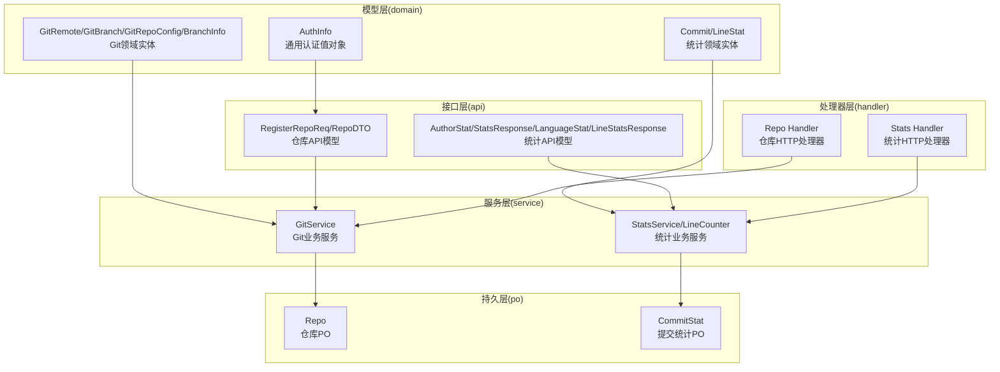
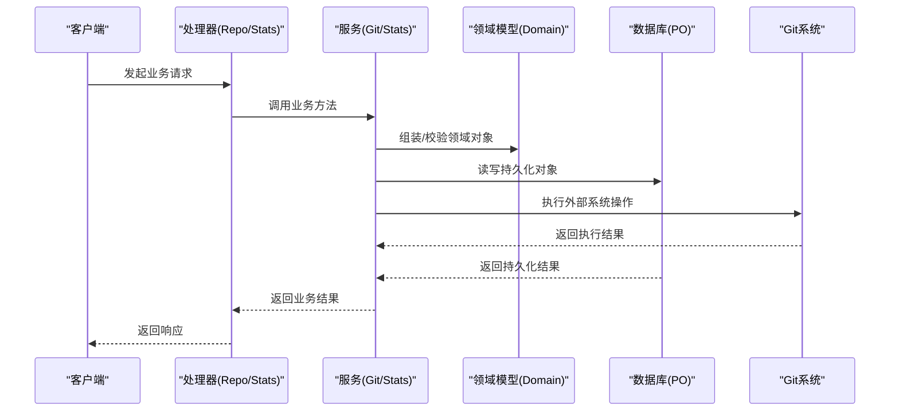
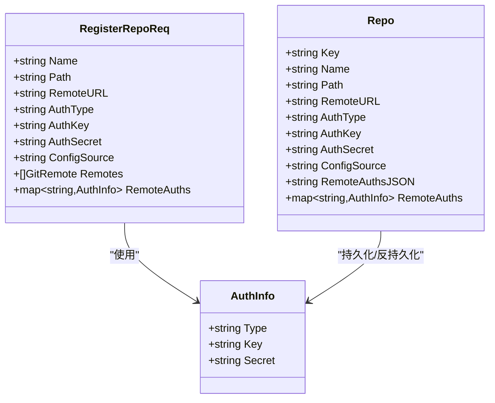
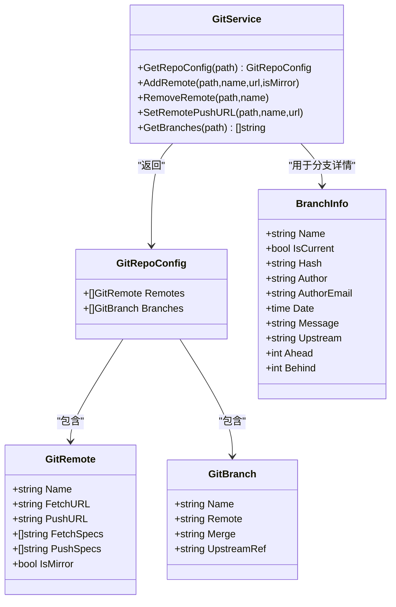
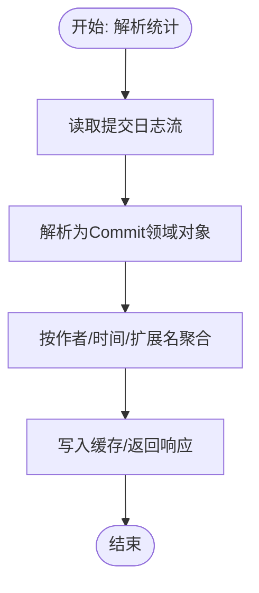
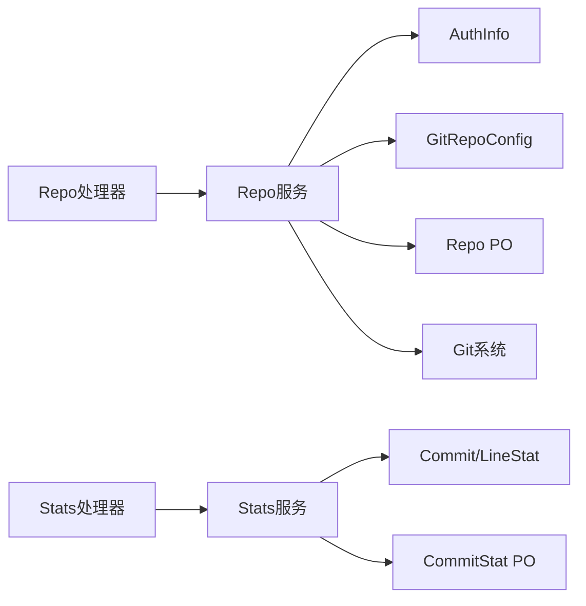

# 领域模型

<cite>
**本文引用的文件**
- [biz/model/domain/common.go](file://biz/model/domain/common.go)
- [biz/model/domain/git.go](file://biz/model/domain/git.go)
- [biz/model/domain/stats.go](file://biz/model/domain/stats.go)
- [biz/model/api/repo.go](file://biz/model/api/repo.go)
- [biz/model/api/stats.go](file://biz/model/api/stats.go)
- [biz/model/po/repo.go](file://biz/model/po/repo.go)
- [biz/model/po/commit_stat.go](file://biz/model/po/commit_stat.go)
- [biz/service/git/git_service.go](file://biz/service/git/git_service.go)
- [biz/service/stats/stats_service.go](file://biz/service/stats/stats_service.go)
- [biz/service/stats/line_counter.go](file://biz/service/stats/line_counter.go)
- [biz/handler/repo/repo_service.go](file://biz/handler/repo/repo_service.go)
- [biz/handler/stats/stats_service.go](file://biz/handler/stats/stats_service.go)
- [biz/rpc_handler/git_handler.go](file://biz/rpc_handler/git_handler.go)
</cite>

## 目录
1. [引言](#引言)
2. [项目结构](#项目结构)
3. [核心组件](#核心组件)
4. [架构总览](#架构总览)
5. [详细组件分析](#详细组件分析)
6. [依赖分析](#依赖分析)
7. [性能考量](#性能考量)
8. [故障排查指南](#故障排查指南)
9. [结论](#结论)
10. [附录](#附录)

## 引言
本文件系统性梳理“领域模型”的设计与实现，聚焦业务逻辑层的领域对象与规则封装。通过对通用领域模型(common.go)、Git领域模型(git.go)、统计领域模型(stats.go)的深入解析，阐明其在服务层中的使用方式、与业务用例的映射关系、状态与行为的边界，以及与外部系统的交互模式。同时给出可操作的使用示例与最佳实践建议。

## 项目结构
领域模型位于 biz/model/domain 下，分别定义了通用值对象、Git相关实体与统计分析实体；服务层在 biz/service 中对领域模型进行组合与扩展，对外提供业务能力；处理器层在 biz/handler 中编排服务层调用，完成端到端的业务流程。

图表来源
- [biz/model/domain/common.go](file://biz/model/domain/common.go#L1-L8)
- [biz/model/domain/git.go](file://biz/model/domain/git.go#L1-L40)
- [biz/model/domain/stats.go](file://biz/model/domain/stats.go#L1-L20)
- [biz/model/api/repo.go](file://biz/model/api/repo.go#L1-L77)
- [biz/model/api/stats.go](file://biz/model/api/stats.go#L1-L50)
- [biz/model/po/repo.go](file://biz/model/po/repo.go#L1-L93)
- [biz/model/po/commit_stat.go](file://biz/model/po/commit_stat.go#L1-L23)
- [biz/service/git/git_service.go](file://biz/service/git/git_service.go#L1-L1204)
- [biz/service/stats/stats_service.go](file://biz/service/stats/stats_service.go#L1-L372)
- [biz/service/stats/line_counter.go](file://biz/service/stats/line_counter.go#L1-L583)
- [biz/handler/repo/repo_service.go](file://biz/handler/repo/repo_service.go#L1-L371)
- [biz/handler/stats/stats_service.go](file://biz/handler/stats/stats_service.go#L1-L360)

章节来源
- [biz/model/domain/common.go](file://biz/model/domain/common.go#L1-L8)
- [biz/model/domain/git.go](file://biz/model/domain/git.go#L1-L40)
- [biz/model/domain/stats.go](file://biz/model/domain/stats.go#L1-L20)
- [biz/model/api/repo.go](file://biz/model/api/repo.go#L1-L77)
- [biz/model/api/stats.go](file://biz/model/api/stats.go#L1-L50)
- [biz/model/po/repo.go](file://biz/model/po/repo.go#L1-L93)
- [biz/model/po/commit_stat.go](file://biz/model/po/commit_stat.go#L1-L23)
- [biz/service/git/git_service.go](file://biz/service/git/git_service.go#L1-L1204)
- [biz/service/stats/stats_service.go](file://biz/service/stats/stats_service.go#L1-L372)
- [biz/service/stats/line_counter.go](file://biz/service/stats/line_counter.go#L1-L583)
- [biz/handler/repo/repo_service.go](file://biz/handler/repo/repo_service.go#L1-L371)
- [biz/handler/stats/stats_service.go](file://biz/handler/stats/stats_service.go#L1-L360)

## 核心组件
- 通用领域模型(common.go)
  - AuthInfo：统一的认证信息值对象，承载类型、密钥与密文字段，用于仓库与远程仓库的认证配置。
- Git领域模型(git.go)
  - GitRemote：远程仓库配置，包含名称、拉取/推送URL、拉取/推送规范、镜像标记等。
  - GitBranch：本地分支配置，包含名称、上游远程、合并引用等。
  - GitRepoConfig：仓库级配置聚合，包含多个远程与分支。
  - BranchInfo：分支信息快照，包含当前分支标识、最新提交、作者、时间、消息及同步状态（上游、ahead、behind）。
- 统计领域模型(stats.go)
  - Commit：一次提交的领域对象，包含哈希、作者、邮箱、日期、消息、时间戳。
  - LineStat：行统计维度对象，包含作者、邮箱、日期、扩展名等。

章节来源
- [biz/model/domain/common.go](file://biz/model/domain/common.go#L1-L8)
- [biz/model/domain/git.go](file://biz/model/domain/git.go#L1-L40)
- [biz/model/domain/stats.go](file://biz/model/domain/stats.go#L1-L20)

## 架构总览
领域模型作为业务规则的载体，贯穿于服务层与处理器层之间。服务层负责将领域模型与数据访问层、外部系统（Git命令/库）集成，形成稳定的业务能力；处理器层负责请求编排与响应输出。

图表来源
- [biz/service/git/git_service.go](file://biz/service/git/git_service.go#L1-L1204)
- [biz/service/stats/stats_service.go](file://biz/service/stats/stats_service.go#L1-L372)
- [biz/handler/repo/repo_service.go](file://biz/handler/repo/repo_service.go#L1-L371)
- [biz/handler/stats/stats_service.go](file://biz/handler/stats/stats_service.go#L1-L360)
- [biz/model/po/repo.go](file://biz/model/po/repo.go#L1-L93)
- [biz/model/po/commit_stat.go](file://biz/model/po/commit_stat.go#L1-L23)

## 详细组件分析

### 通用领域模型：AuthInfo
- 设计要点
  - 值对象语义：封装认证类型、密钥与密文，避免分散的字符串传递。
  - 与API/PO的衔接：API层的注册/更新请求携带远程认证映射；PO层在持久化前后自动加密/解密密文。
- 使用场景
  - 仓库注册时设置主认证与远程认证映射。
  - 克隆/拉取/推送时根据类型选择HTTP或SSH认证。
- 安全性
  - 数据库中存储密文，内存与API返回时解密，降低明文泄露风险。

图表来源
- [biz/model/domain/common.go](file://biz/model/domain/common.go#L1-L8)
- [biz/model/api/repo.go](file://biz/model/api/repo.go#L1-L77)
- [biz/model/po/repo.go](file://biz/model/po/repo.go#L1-L93)

章节来源
- [biz/model/domain/common.go](file://biz/model/domain/common.go#L1-L8)
- [biz/model/api/repo.go](file://biz/model/api/repo.go#L1-L77)
- [biz/model/po/repo.go](file://biz/model/po/repo.go#L30-L92)

### Git领域模型：GitRemote/GitBranch/GitRepoConfig/BranchInfo
- 设计要点
  - GitRemote：抽象远程仓库配置，支持镜像、多URL与规范集合。
  - GitBranch：抽象分支配置，包含上游引用与短引用拼接。
  - GitRepoConfig：聚合远程与分支配置，便于服务层读取/同步。
  - BranchInfo：面向展示的分支快照，包含同步状态（ahead/behind）。
- 与服务层的交互
  - 服务层通过GitService读取/写入配置，并将结果映射为领域对象。
- 与业务用例的对应
  - 仓库扫描：读取远程与分支配置。
  - 分支列表：结合BranchInfo展示当前分支与上游同步状态。
  - 远程同步：根据GitRepoConfig增删改远程。

图表来源
- [biz/model/domain/git.go](file://biz/model/domain/git.go#L1-L40)
- [biz/service/git/git_service.go](file://biz/service/git/git_service.go#L357-L409)

章节来源
- [biz/model/domain/git.go](file://biz/model/domain/git.go#L1-L40)
- [biz/service/git/git_service.go](file://biz/service/git/git_service.go#L357-L409)

### 统计领域模型：Commit/LineStat
- 设计要点
  - Commit：面向统计的提交对象，包含哈希、作者、邮箱、时间戳与消息。
  - LineStat：面向行统计的维度对象，包含作者、邮箱、日期、扩展名。
- 与服务层的交互
  - StatsService.ParseCommits将原始日志解析为领域对象。
  - LineCounter按语言与文件维度统计代码行，结合Blame信息进行作者/时间过滤。
- 与业务用例的对应
  - 提交历史分析：按时间/作者聚合。
  - 代码行统计：按语言分类，支持排除目录/模式与作者/时间过滤。

图表来源
- [biz/service/stats/stats_service.go](file://biz/service/stats/stats_service.go#L141-L172)
- [biz/service/stats/line_counter.go](file://biz/service/stats/line_counter.go#L153-L251)

章节来源
- [biz/model/domain/stats.go](file://biz/model/domain/stats.go#L1-L20)
- [biz/service/stats/stats_service.go](file://biz/service/stats/stats_service.go#L141-L172)
- [biz/service/stats/line_counter.go](file://biz/service/stats/line_counter.go#L153-L251)

### 服务层使用示例

- 仓库注册与远程同步
  - 处理器接收 RegisterRepoReq，调用 GitService 校验路径与配置，必要时同步远程配置。
  - 服务层将 API 请求映射为领域对象（如 GitRemote），并持久化 Repo PO。
  - 异步触发统计同步，使用 StatsService 对提交进行批量入库。

- 分支与标签管理
  - GitService 提供分支/标签的创建、删除、列举与推送到远端的能力。
  - 处理器通过 RPC 或 HTTP 调用，组装领域对象并返回结果。

- 统计分析
  - StatsService 提供缓存与并发控制，异步计算提交统计；LineCounter 提供代码行统计，支持作者/时间/排除规则。
  - 处理器暴露查询接口，支持CSV导出。

章节来源
- [biz/handler/repo/repo_service.go](file://biz/handler/repo/repo_service.go#L52-L126)
- [biz/service/git/git_service.go](file://biz/service/git/git_service.go#L1-L1204)
- [biz/service/stats/stats_service.go](file://biz/service/stats/stats_service.go#L1-L372)
- [biz/service/stats/line_counter.go](file://biz/service/stats/line_counter.go#L1-L583)
- [biz/handler/stats/stats_service.go](file://biz/handler/stats/stats_service.go#L1-L360)
- [biz/rpc_handler/git_handler.go](file://biz/rpc_handler/git_handler.go#L1-L131)

## 依赖分析
- 层间耦合
  - 处理器层仅依赖服务层接口，不直接依赖领域模型细节，保持高内聚低耦合。
  - 服务层依赖领域模型与DAO，承担业务编排与规则校验。
- 外部依赖
  - Git命令与go-git库：用于仓库操作、日志与Blame分析。
  - 数据库：GORM映射PO，持久化领域对象的必要信息。
- 循环依赖
  - 未发现循环导入；领域模型为纯数据结构，无业务逻辑，避免循环依赖风险。

图表来源
- [biz/handler/repo/repo_service.go](file://biz/handler/repo/repo_service.go#L1-L371)
- [biz/handler/stats/stats_service.go](file://biz/handler/stats/stats_service.go#L1-L360)
- [biz/service/git/git_service.go](file://biz/service/git/git_service.go#L1-L1204)
- [biz/service/stats/stats_service.go](file://biz/service/stats/stats_service.go#L1-L372)
- [biz/model/domain/common.go](file://biz/model/domain/common.go#L1-L8)
- [biz/model/domain/git.go](file://biz/model/domain/git.go#L1-L40)
- [biz/model/domain/stats.go](file://biz/model/domain/stats.go#L1-L20)
- [biz/model/po/repo.go](file://biz/model/po/repo.go#L1-L93)
- [biz/model/po/commit_stat.go](file://biz/model/po/commit_stat.go#L1-L23)

章节来源
- [biz/handler/repo/repo_service.go](file://biz/handler/repo/repo_service.go#L1-L371)
- [biz/handler/stats/stats_service.go](file://biz/handler/stats/stats_service.go#L1-L360)
- [biz/service/git/git_service.go](file://biz/service/git/git_service.go#L1-L1204)
- [biz/service/stats/stats_service.go](file://biz/service/stats/stats_service.go#L1-L372)
- [biz/model/domain/common.go](file://biz/model/domain/common.go#L1-L8)
- [biz/model/domain/git.go](file://biz/model/domain/git.go#L1-L40)
- [biz/model/domain/stats.go](file://biz/model/domain/stats.go#L1-L20)
- [biz/model/po/repo.go](file://biz/model/po/repo.go#L1-L93)
- [biz/model/po/commit_stat.go](file://biz/model/po/commit_stat.go#L1-L23)

## 性能考量
- 缓存策略
  - StatsService/LineCounter 使用内存缓存与TTL，减少重复计算开销。
- 流式处理
  - 统计服务通过git log --numstat流式读取，提升大仓库处理效率。
- 批量入库
  - 提交统计采用批量保存，降低数据库往返次数。
- 并发控制
  - 使用LoadOrStore与缓存项更新，避免重复计算与竞态。

章节来源
- [biz/service/stats/stats_service.go](file://biz/service/stats/stats_service.go#L31-L50)
- [biz/service/stats/stats_service.go](file://biz/service/stats/stats_service.go#L179-L243)
- [biz/service/stats/line_counter.go](file://biz/service/stats/line_counter.go#L25-L74)

## 故障排查指南
- 认证问题
  - 检查AuthInfo的类型与密钥是否正确；确认数据库中密文已加密并在读取时解密。
- Git操作失败
  - 关注服务层错误返回与日志；确认远程URL、SSH密钥路径与权限、代理设置。
- 统计异常
  - 若StatsService返回processing，等待进度更新；若返回failed，检查日志定位具体错误。
- 数据一致性
  - 确认PO的BeforeSave/AfterFind钩子正常执行，避免明文泄露或反序列化失败。

章节来源
- [biz/model/po/repo.go](file://biz/model/po/repo.go#L30-L92)
- [biz/service/git/git_service.go](file://biz/service/git/git_service.go#L1-L1204)
- [biz/service/stats/stats_service.go](file://biz/service/stats/stats_service.go#L179-L243)

## 结论
领域模型通过值对象与实体清晰地封装了业务规则与数据结构，使服务层能够专注于业务编排与规则校验，处理器层专注于请求编排与响应输出。配合缓存、流式处理与批量入库等优化手段，系统在可维护性与性能上取得良好平衡。建议在新增领域对象时遵循单一职责与可测试性原则，确保与服务层契约稳定、与外部系统交互明确。

## 附录
- 设计原则
  - 单一职责：每个领域对象聚焦一类业务概念。
  - 封装性：通过PO钩子与服务层方法封装敏感操作（如加密/解密、Git命令）。
  - 可测试性：以函数/方法为单位进行单元测试，模拟外部依赖。
- 与外部系统交互
  - Git命令与go-git库：用于仓库操作、日志与Blame分析。
  - 数据库：GORM映射PO，提供事务与索引支持。