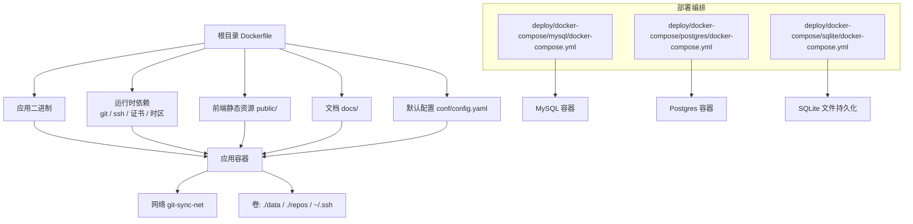
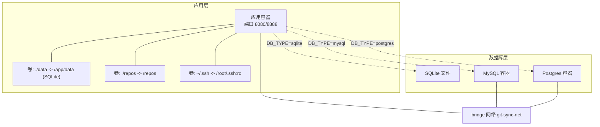
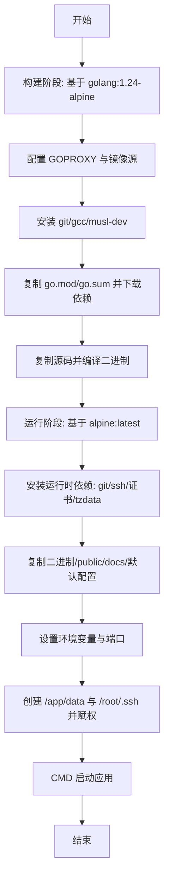
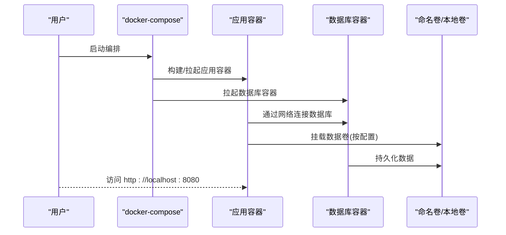
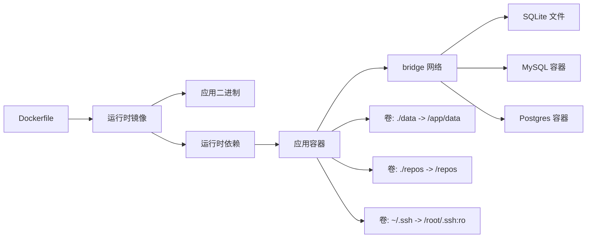

# Docker容器化部署

<cite>
**本文引用的文件**
- [Dockerfile](file://Dockerfile)
- [DEPLOY.md](file://DEPLOY.md)
- [.env 示例](file://deploy/.env.example)
- [docker-compose (MySQL)](file://deploy/docker-compose/mysql/docker-compose.yml)
- [docker-compose (Postgres)](file://deploy/docker-compose/postgres/docker-compose.yml)
- [docker-compose (SQLite)](file://deploy/docker-compose/sqlite/docker-compose.yml)
- [部署总览](file://deploy/README.md)
- [配置指南](file://deploy/CONFIG_GUIDE.md)
- [应用默认配置](file://deploy/config.yaml)
- [构建脚本](file://build.sh)
- [控制脚本](file://control.sh)
- [优化计划](file://OPTIMIZATION_PLAN.md)
</cite>

## 目录
1. [简介](#简介)
2. [项目结构](#项目结构)
3. [核心组件](#核心组件)
4. [架构总览](#架构总览)
5. [详细组件分析](#详细组件分析)
6. [依赖关系分析](#依赖关系分析)
7. [性能考虑](#性能考虑)
8. [故障排查指南](#故障排查指南)
9. [结论](#结论)
10. [附录](#附录)

## 简介
本指南面向希望使用 Docker 对 Git 管理服务进行容器化部署的用户，覆盖以下内容：
- Dockerfile 的构建流程与镜像优化策略
- 三种数据库配置的 docker-compose 差异与选型建议
- 环境变量、卷挂载与网络配置
- 从环境准备到服务启动的完整部署流程
- SSH 密钥挂载的安全配置与权限设置
- 常见部署问题排查与解决方案
- 生产环境容器安全加固建议

## 项目结构
与容器化部署直接相关的目录与文件包括：
- 根目录 Dockerfile：定义多阶段构建与运行时依赖
- deploy 目录：包含部署文档、示例配置与三种数据库的 docker-compose 配置
- 配置文件：应用默认配置与数据库配置指南
- 辅助脚本：构建与控制脚本

图表来源
- [Dockerfile](file://Dockerfile#L1-L77)
- [docker-compose (SQLite)](file://deploy/docker-compose/sqlite/docker-compose.yml#L1-L30)
- [docker-compose (MySQL)](file://deploy/docker-compose/mysql/docker-compose.yml#L1-L50)
- [docker-compose (Postgres)](file://deploy/docker-compose/postgres/docker-compose.yml#L1-L49)

章节来源
- [Dockerfile](file://Dockerfile#L1-L77)
- [部署总览](file://deploy/README.md#L1-L108)

## 核心组件
- 多阶段 Dockerfile：先在构建阶段拉取依赖并编译二进制，再在精简的 Alpine 运行时镜像中安装运行所需工具与证书，复制二进制、静态资源与默认配置，设置端口与默认环境变量，创建数据与 SSH 目录并赋予合适权限。
- 三种数据库编排：
  - SQLite：应用内嵌数据库，通过卷将数据文件与仓库目录持久化；适合单机与开发测试。
  - MySQL：独立 MySQL 容器，应用通过网络访问；适合中等规模与团队协作。
  - Postgres：独立 PostgreSQL 容器，应用通过网络访问；适合对数据一致性与复杂查询有更高要求的场景。
- 环境变量与配置：
  - .env 示例提供 DB_TYPE、DB_*、WEBHOOK_SECRET、TZ 等关键变量模板
  - 应用默认配置文件提供 server、database、webhook、debug、rpc 等键位
  - docker-compose 中通过 environment 字段注入变量，部分变量来自 .env
- 卷与网络：
  - SQLite：映射 ./data 到 /app/data，映射 ./repos 到 /repos，映射 ~/.ssh 到 /root/.ssh:ro
  - MySQL/Postgres：映射 ./repos 到 /repos，映射 ~/.ssh 到 /root/.ssh:ro，使用命名卷保存数据库数据
  - 网络：统一使用 bridge 网络 git-sync-net，便于容器间通信

章节来源
- [Dockerfile](file://Dockerfile#L1-L77)
- [.env 示例](file://deploy/.env.example#L1-L21)
- [应用默认配置](file://deploy/config.yaml#L1-L55)
- [配置指南](file://deploy/CONFIG_GUIDE.md#L1-L99)
- [docker-compose (SQLite)](file://deploy/docker-compose/sqlite/docker-compose.yml#L1-L30)
- [docker-compose (MySQL)](file://deploy/docker-compose/mysql/docker-compose.yml#L1-L50)
- [docker-compose (Postgres)](file://deploy/docker-compose/postgres/docker-compose.yml#L1-L49)

## 架构总览
下图展示了三种数据库配置的容器化架构与数据流：

图表来源
- [Dockerfile](file://Dockerfile#L31-L77)
- [docker-compose (SQLite)](file://deploy/docker-compose/sqlite/docker-compose.yml#L1-L30)
- [docker-compose (MySQL)](file://deploy/docker-compose/mysql/docker-compose.yml#L1-L50)
- [docker-compose (Postgres)](file://deploy/docker-compose/postgres/docker-compose.yml#L1-L49)

## 详细组件分析

### Dockerfile 构建流程与镜像优化
- 构建阶段
  - 基于 golang:1.24-alpine，启用模块代理与国内镜像，安装 git、gcc、musl-dev 以支持 CGO/SQLite
  - 复制 go.mod/go.sum 并下载依赖，随后复制源码并编译出二进制
- 运行阶段
  - 基于 alpine:latest，安装 git、openssh-client、ca-certificates、tzdata
  - 复制二进制、public/docs 与默认配置，设置运行时环境变量（GIN_MODE、PORT、DB_PATH）
  - 暴露 8080/8888 端口，创建 /app/data 与 /root/.ssh 目录并设置权限
  - CMD 启动应用
- 优化要点
  - 多阶段构建减少最终镜像体积
  - 国内镜像加速依赖下载
  - 仅复制必要文件，避免将构建产物与源码带入运行时镜像
  - 运行时仅安装必要工具，降低攻击面

图表来源
- [Dockerfile](file://Dockerfile#L1-L77)

章节来源
- [Dockerfile](file://Dockerfile#L1-L77)

### 三种数据库配置的 docker-compose 差异与选择建议
- SQLite
  - 特点：无外部依赖，单文件数据库，适合开发测试与单机部署
  - 关键点：映射 ./data 到 /app/data 持久化数据库文件；映射 ./repos 到 /repos 存放仓库；映射 ~/.ssh 到 /root/.ssh:ro 提供 SSH 认证
  - 端口：8080/8888
- MySQL
  - 特点：独立数据库容器，适合中等规模与团队协作
  - 关键点：应用通过网络访问 mysql:3306；数据库数据持久化至命名卷；应用环境变量指定 DB_TYPE=mysql、DB_HOST=mysql、DB_PORT=3306
  - 端口：8080/8888 + 3306
- PostgreSQL
  - 特点：独立数据库容器，适合对数据一致性与复杂查询有更高要求的场景
  - 关键点：应用通过网络访问 postgres:5432；数据库数据持久化至命名卷；应用环境变量指定 DB_TYPE=postgres、DB_HOST=postgres、DB_PORT=5432
  - 端口：8080/8888 + 5432
- 选择建议
  - 开发/单机：优先 SQLite
  - 团队协作/中等规模：MySQL
  - 数据一致性/复杂查询：Postgres

图表来源
- [docker-compose (SQLite)](file://deploy/docker-compose/sqlite/docker-compose.yml#L1-L30)
- [docker-compose (MySQL)](file://deploy/docker-compose/mysql/docker-compose.yml#L1-L50)
- [docker-compose (Postgres)](file://deploy/docker-compose/postgres/docker-compose.yml#L1-L49)

章节来源
- [docker-compose (SQLite)](file://deploy/docker-compose/sqlite/docker-compose.yml#L1-L30)
- [docker-compose (MySQL)](file://deploy/docker-compose/mysql/docker-compose.yml#L1-L50)
- [docker-compose (Postgres)](file://deploy/docker-compose/postgres/docker-compose.yml#L1-L49)

### 环境变量配置
- .env 示例提供关键变量模板，包括应用端口、Webhook 密钥、时区、数据库类型与 MySQL 根密码等
- docker-compose 中通过 environment 注入变量，部分变量来自 .env（如 WEBHOOK_SECRET、TZ），数据库连接信息在不同数据库配置中分别设置
- 应用默认配置文件提供 server、database、webhook、debug、rpc 等键位，生产环境建议通过环境变量覆盖敏感字段，避免明文写入配置文件

章节来源
- [.env 示例](file://deploy/.env.example#L1-L21)
- [配置指南](file://deploy/CONFIG_GUIDE.md#L1-L99)
- [应用默认配置](file://deploy/config.yaml#L1-L55)
- [docker-compose (SQLite)](file://deploy/docker-compose/sqlite/docker-compose.yml#L11-L15)
- [docker-compose (MySQL)](file://deploy/docker-compose/mysql/docker-compose.yml#L11-L18)
- [docker-compose (Postgres)](file://deploy/docker-compose/postgres/docker-compose.yml#L11-L18)

### 卷挂载策略
- SQLite
  - ./data -> /app/data：持久化数据库文件
  - ./repos -> /repos：存放/访问仓库
  - ~/.ssh -> /root/.ssh:ro：挂载 SSH 私钥与 known_hosts
- MySQL/Postgres
  - ./repos -> /repos：存放/访问仓库
  - ~/.ssh -> /root/.ssh:ro：挂载 SSH 私钥与 known_hosts
  - 数据库命名卷：mysql_data 或 postgres_data 持久化数据库数据
- 权限与安全
  - SSH 私钥权限需为 600；若宿主机权限导致容器内权限异常，可在宿主机调整
  - 仅挂载 ~/.ssh 为只读，降低风险

章节来源
- [DEPLOY.md](file://DEPLOY.md#L37-L77)
- [docker-compose (SQLite)](file://deploy/docker-compose/sqlite/docker-compose.yml#L16-L23)
- [docker-compose (MySQL)](file://deploy/docker-compose/mysql/docker-compose.yml#L20-L22)
- [docker-compose (Postgres)](file://deploy/docker-compose/postgres/docker-compose.yml#L20-L22)

### 网络配置
- 统一使用 bridge 网络 git-sync-net，应用容器与数据库容器在同一网络内，便于通过服务名访问数据库
- 端口映射：应用容器映射 8080/8888 至宿主机；数据库容器映射各自默认端口（MySQL 3306、Postgres 5432）

章节来源
- [docker-compose (SQLite)](file://deploy/docker-compose/sqlite/docker-compose.yml#L24-L25)
- [docker-compose (MySQL)](file://deploy/docker-compose/mysql/docker-compose.yml#L23-L42)
- [docker-compose (Postgres)](file://deploy/docker-compose/postgres/docker-compose.yml#L23-L41)

### 完整部署流程（从环境准备到服务启动）
- 准备工作
  - 安装 Docker 与 Docker Compose
  - 复制 .env.example 为 .env 并填写敏感信息
  - 准备 data 与 repos 目录（SQLite 场景）
- 启动服务
  - 进入 deploy 目录，选择对应数据库子目录，执行 docker-compose up -d
  - 访问 http://localhost:8080 验证服务
- 验证与日志
  - 查看应用日志确认启动状态
  - 如需调试，可在配置中开启 debug 模式

章节来源
- [DEPLOY.md](file://DEPLOY.md#L10-L36)
- [部署总览](file://deploy/README.md#L23-L48)

### SSH 密钥挂载的安全配置与权限设置
- 挂载方式
  - 将宿主机 ~/.ssh 挂载到容器 /root/.ssh，并设置为只读
- 权限要求
  - 私钥文件权限应为 600；known_hosts 应包含目标 Git 服务器指纹
- 常见问题
  - 若出现“Host key verification failed”，可在容器内扫描或确保宿主机 known_hosts 已正确填充
  - 若容器内权限异常，检查宿主机私钥权限并重新挂载

章节来源
- [DEPLOY.md](file://DEPLOY.md#L55-L77)
- [docker-compose (SQLite)](file://deploy/docker-compose/sqlite/docker-compose.yml#L22-L23)
- [docker-compose (MySQL)](file://deploy/docker-compose/mysql/docker-compose.yml#L21-L22)
- [docker-compose (Postgres)](file://deploy/docker-compose/postgres/docker-compose.yml#L21-L22)

## 依赖关系分析
- 组件耦合
  - 应用容器依赖运行时工具（git/ssh/证书/tzdata），通过 Dockerfile 的运行时安装满足
  - 数据库容器与应用容器通过 bridge 网络通信，彼此解耦
- 外部依赖
  - 国内镜像源加速依赖下载
  - SSH 私钥与 known_hosts 由宿主机提供，增强私有仓库访问能力
- 配置契约
  - DB_TYPE 控制数据库类型，DB_HOST/DB_PORT/DB_USER/DB_PASSWORD/DB_NAME（或 DB_PATH）决定连接参数
  - WEBHOOK_SECRET 与 TZ 通过环境变量注入

图表来源
- [Dockerfile](file://Dockerfile#L31-L77)
- [docker-compose (SQLite)](file://deploy/docker-compose/sqlite/docker-compose.yml#L1-L30)
- [docker-compose (MySQL)](file://deploy/docker-compose/mysql/docker-compose.yml#L1-L50)
- [docker-compose (Postgres)](file://deploy/docker-compose/postgres/docker-compose.yml#L1-L49)

章节来源
- [Dockerfile](file://Dockerfile#L1-L77)
- [docker-compose (SQLite)](file://deploy/docker-compose/sqlite/docker-compose.yml#L1-L30)
- [docker-compose (MySQL)](file://deploy/docker-compose/mysql/docker-compose.yml#L1-L50)
- [docker-compose (Postgres)](file://deploy/docker-compose/postgres/docker-compose.yml#L1-L49)

## 性能考虑
- 构建与镜像
  - 多阶段构建减少最终镜像大小
  - 使用国内镜像源提升依赖下载速度
- 运行时
  - 仅安装必要运行时依赖，降低资源占用
  - 通过卷分离数据与仓库，避免不必要的文件拷贝
- 数据库选择
  - SQLite 适合小规模与开发测试
  - MySQL/Postgres 适合中大规模与团队协作，注意数据库连接池与索引设计

[本节为通用指导，不直接分析具体文件]

## 故障排查指南
- 应用启动失败（CrashLoopBackOff）
  - 查看应用日志定位错误
  - 检查数据库连接参数（Host、Port、User、Password）是否正确
  - 确认数据库容器已就绪
- 无法访问私有仓库
  - 检查 ~/.ssh 权限是否为 600
  - 确认 known_hosts 包含目标服务器指纹
  - 如容器内首次访问，可通过 ssh-keyscan 补充 known_hosts
- 数据库写入失败
  - 检查宿主机 data 目录写权限
- 时间显示异常
  - 修改 TZ 环境变量或在 docker-compose 中设置时区

章节来源
- [部署总览](file://deploy/README.md#L85-L98)
- [DEPLOY.md](file://DEPLOY.md#L78-L83)

## 结论
通过多阶段 Dockerfile 与三种数据库编排，本项目实现了从开发到生产的灵活部署路径。SQLite 适合快速起步，MySQL/Postgres 提供更强的数据能力。结合合理的卷挂载、网络与环境变量配置，可满足大多数部署场景。生产环境建议进一步强化安全与可观测性。

[本节为总结性内容，不直接分析具体文件]

## 附录
- 辅助脚本
  - build.sh：构建输出目录与脚本准备
  - control.sh：本地启动/停止/重启/状态查看，便于非容器环境调试
- 优化建议
  - 参考优化计划文档，持续改进代码分层、错误处理与日志体系

章节来源
- [构建脚本](file://build.sh#L1-L6)
- [控制脚本](file://control.sh#L1-L110)
- [优化计划](file://OPTIMIZATION_PLAN.md#L1-L69)