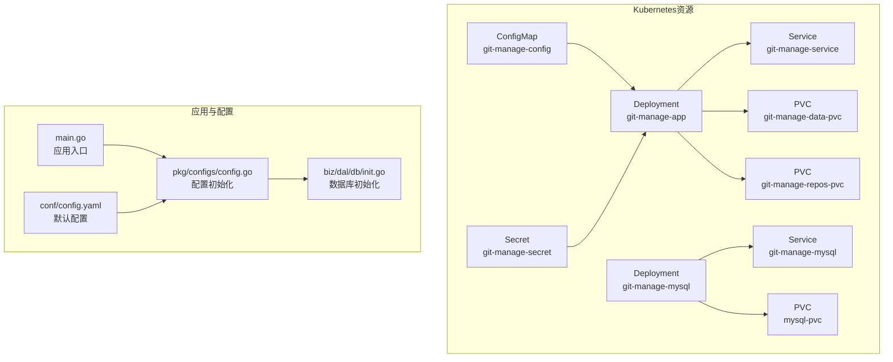
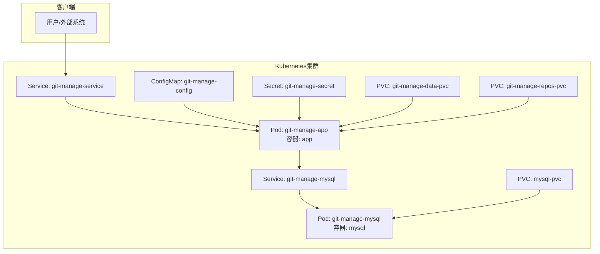
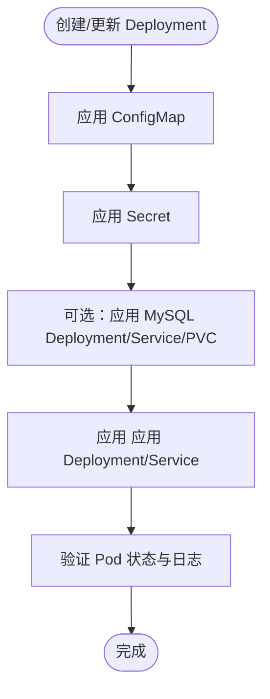
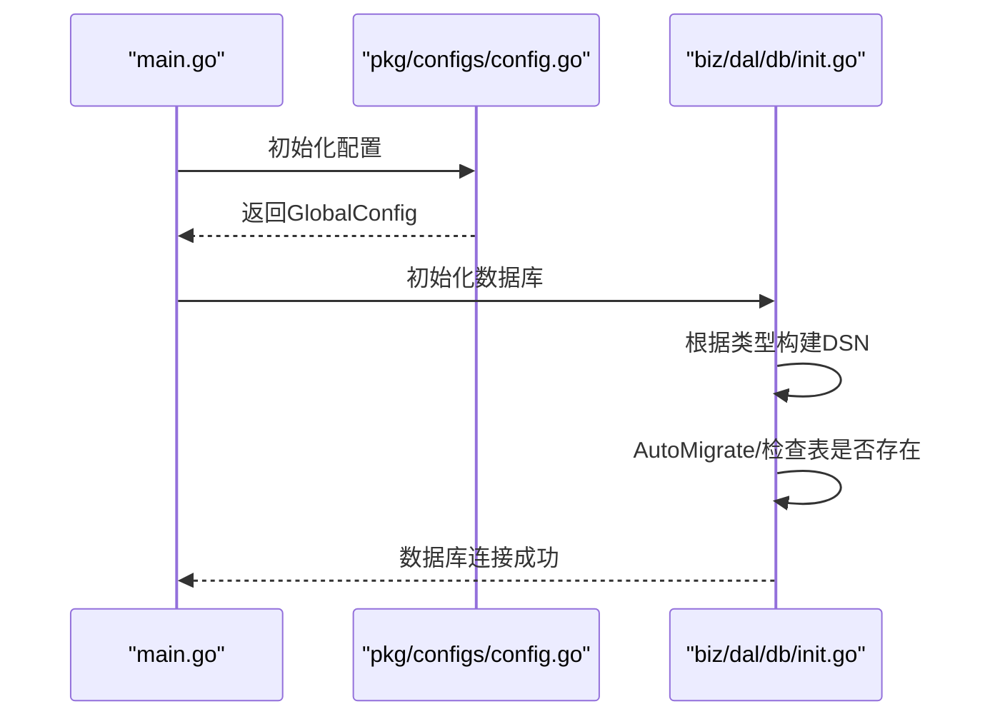
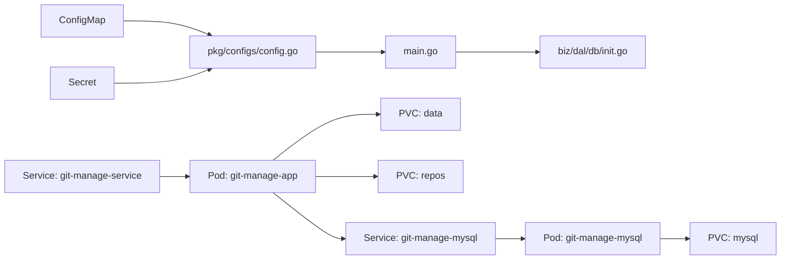

# Kubernetes集群部署

<cite>
**本文引用的文件**
- [deploy/k8s/deployment.yaml](file://deploy/k8s/deployment.yaml)
- [deploy/k8s/service.yaml](file://deploy/k8s/service.yaml)
- [deploy/k8s/configmap.yaml](file://deploy/k8s/configmap.yaml)
- [deploy/k8s/secret.yaml](file://deploy/k8s/secret.yaml)
- [deploy/k8s/mysql.yaml](file://deploy/k8s/mysql.yaml)
- [deploy/README.md](file://deploy/README.md)
- [deploy/CONFIG_GUIDE.md](file://deploy/CONFIG_GUIDE.md)
- [Dockerfile](file://Dockerfile)
- [main.go](file://main.go)
- [pkg/configs/config.go](file://pkg/configs/config.go)
- [biz/dal/db/init.go](file://biz/dal/db/init.go)
- [conf/config.yaml](file://conf/config.yaml)
</cite>

## 目录
1. [简介](#简介)
2. [项目结构](#项目结构)
3. [核心组件](#核心组件)
4. [架构总览](#架构总览)
5. [详细组件分析](#详细组件分析)
6. [依赖关系分析](#依赖关系分析)
7. [性能考虑](#性能考虑)
8. [故障排除指南](#故障排除指南)
9. [结论](#结论)
10. [附录](#附录)

## 简介
本指南面向在Kubernetes集群中部署“Git 管理服务”的工程团队，提供从命名空间到资源配置、从服务发现到持久化存储、从数据库集成到外部访问的完整流程说明。同时涵盖水平Pod自动伸缩、资源限制、滚动更新与回滚策略、监控与日志收集的配置建议。

## 项目结构
与Kubernetes部署直接相关的核心文件位于 deploy/k8s 目录，包含应用Deployment、Service、ConfigMap、Secret以及内嵌MySQL的Deployment/Service/PVC。部署说明与配置指南位于 deploy 目录，应用入口与配置加载逻辑位于项目根目录与pkg/configs包中。

图表来源
- [deploy/k8s/deployment.yaml](file://deploy/k8s/deployment.yaml#L1-L83)
- [deploy/k8s/service.yaml](file://deploy/k8s/service.yaml#L1-L14)
- [deploy/k8s/configmap.yaml](file://deploy/k8s/configmap.yaml#L1-L20)
- [deploy/k8s/secret.yaml](file://deploy/k8s/secret.yaml#L1-L11)
- [deploy/k8s/mysql.yaml](file://deploy/k8s/mysql.yaml#L1-L65)
- [main.go](file://main.go#L115-L134)
- [pkg/configs/config.go](file://pkg/configs/config.go#L18-L42)
- [biz/dal/db/init.go](file://biz/dal/db/init.go#L18-L47)
- [conf/config.yaml](file://conf/config.yaml#L1-L25)

章节来源
- [deploy/README.md](file://deploy/README.md#L60-L83)
- [deploy/k8s/deployment.yaml](file://deploy/k8s/deployment.yaml#L1-L83)
- [deploy/k8s/service.yaml](file://deploy/k8s/service.yaml#L1-L14)
- [deploy/k8s/configmap.yaml](file://deploy/k8s/configmap.yaml#L1-L20)
- [deploy/k8s/secret.yaml](file://deploy/k8s/secret.yaml#L1-L11)
- [deploy/k8s/mysql.yaml](file://deploy/k8s/mysql.yaml#L1-L65)

## 核心组件
- Deployment：定义应用副本数、容器镜像、端口、环境变量、卷挂载与持久化存储声明。
- Service：提供稳定网络端点，将流量转发至匹配标签的Pod。
- ConfigMap：存放非敏感配置（如数据库类型、主机、端口、Webhook参数等），以文件形式挂载到容器。
- Secret：存放敏感数据（如数据库密码、Webhook密钥），以环境变量或文件形式挂载到容器。
- PersistentVolumeClaim：为应用数据、仓库目录与数据库提供持久化存储。
- 内置MySQL：作为演示或小型场景的数据库服务，便于快速部署。

章节来源
- [deploy/k8s/deployment.yaml](file://deploy/k8s/deployment.yaml#L8-L60)
- [deploy/k8s/service.yaml](file://deploy/k8s/service.yaml#L6-L13)
- [deploy/k8s/configmap.yaml](file://deploy/k8s/configmap.yaml#L6-L19)
- [deploy/k8s/secret.yaml](file://deploy/k8s/secret.yaml#L6-L10)
- [deploy/k8s/mysql.yaml](file://deploy/k8s/mysql.yaml#L8-L41)

## 架构总览
下图展示应用、数据库与存储在Kubernetes中的交互关系，以及配置与密钥如何注入到Pod中。

图表来源
- [deploy/k8s/service.yaml](file://deploy/k8s/service.yaml#L1-L14)
- [deploy/k8s/deployment.yaml](file://deploy/k8s/deployment.yaml#L18-L60)
- [deploy/k8s/configmap.yaml](file://deploy/k8s/configmap.yaml#L1-L20)
- [deploy/k8s/secret.yaml](file://deploy/k8s/secret.yaml#L1-L11)
- [deploy/k8s/mysql.yaml](file://deploy/k8s/mysql.yaml#L43-L65)

## 详细组件分析

### Deployment：应用与存储
- 副本数与选择器：通过label选择器关联到Service，确保流量正确转发。
- 容器端口：应用监听HTTP与RPC端口，需与Service的targetPort一致。
- 环境变量注入：通过Secret引用数据库密码与Webhook密钥，避免硬编码。
- 卷挂载：
  - ConfigMap挂载为只读配置文件。
  - PVC挂载为应用数据目录与仓库目录。
  - hostPath挂载SSH私钥目录（注意节点依赖与权限）。
- 持久化声明：声明数据与仓库的PVC，大小按需调整。

图表来源
- [deploy/k8s/deployment.yaml](file://deploy/k8s/deployment.yaml#L1-L83)
- [deploy/k8s/service.yaml](file://deploy/k8s/service.yaml#L1-L14)
- [deploy/k8s/mysql.yaml](file://deploy/k8s/mysql.yaml#L1-L65)

章节来源
- [deploy/k8s/deployment.yaml](file://deploy/k8s/deployment.yaml#L8-L60)
- [deploy/k8s/deployment.yaml](file://deploy/k8s/deployment.yaml#L62-L83)

### Service：服务发现与负载均衡
- 选择器：与Deployment的label保持一致。
- 端口映射：ClusterIP暴露内部服务，port为集群内访问端口，targetPort为容器端口。
- 外部访问：可通过Ingress/NLB/NodePort等方式暴露，本仓库未包含Ingress清单，需另行创建。

章节来源
- [deploy/k8s/service.yaml](file://deploy/k8s/service.yaml#L6-L13)

### ConfigMap：非敏感配置
- 存放应用配置（如数据库类型、主机、端口、Webhook参数、调试开关等）。
- 以文件形式挂载到容器路径，供应用初始化加载。

章节来源
- [deploy/k8s/configmap.yaml](file://deploy/k8s/configmap.yaml#L6-L19)
- [conf/config.yaml](file://conf/config.yaml#L1-L25)
- [pkg/configs/config.go](file://pkg/configs/config.go#L18-L42)

### Secret：敏感数据
- 存放数据库密码与Webhook密钥，通过valueFrom/secretKeyRef注入到容器环境变量。
- 建议生产环境使用更安全的密钥管理方案（如SealedSecrets）。

章节来源
- [deploy/k8s/secret.yaml](file://deploy/k8s/secret.yaml#L6-L10)

### 内置MySQL：数据库服务
- Deployment：部署MySQL容器，设置root密码、数据库名、用户名与密码（来自Secret）。
- Service：ClusterIP暴露3306端口。
- PVC：为MySQL数据目录提供持久化存储。

章节来源
- [deploy/k8s/mysql.yaml](file://deploy/k8s/mysql.yaml#L8-L41)
- [deploy/k8s/mysql.yaml](file://deploy/k8s/mysql.yaml#L43-L53)
- [deploy/k8s/mysql.yaml](file://deploy/k8s/mysql.yaml#L55-L65)

### 配置加载与数据库初始化
- 应用入口负责初始化配置、数据库与业务服务。
- 配置加载顺序：优先加载conf/config.yaml，随后支持环境变量覆盖。
- 数据库初始化：根据配置选择SQLite/MySQL/PostgreSQL，自动迁移表结构。

图表来源
- [main.go](file://main.go#L115-L134)
- [pkg/configs/config.go](file://pkg/configs/config.go#L18-L42)
- [biz/dal/db/init.go](file://biz/dal/db/init.go#L18-L47)

章节来源
- [main.go](file://main.go#L115-L134)
- [pkg/configs/config.go](file://pkg/configs/config.go#L18-L42)
- [biz/dal/db/init.go](file://biz/dal/db/init.go#L18-L47)

## 依赖关系分析
- 应用依赖ConfigMap与Secret提供的配置与密钥。
- 应用通过Service访问数据库（可为内置MySQL或外部数据库）。
- 存储依赖PVC绑定到持久卷，确保数据与仓库目录持久化。
- 配置加载链路：conf/config.yaml → pkg/configs/config.go → biz/dal/db/init.go。

图表来源
- [deploy/k8s/configmap.yaml](file://deploy/k8s/configmap.yaml#L1-L20)
- [deploy/k8s/secret.yaml](file://deploy/k8s/secret.yaml#L1-L11)
- [pkg/configs/config.go](file://pkg/configs/config.go#L18-L42)
- [main.go](file://main.go#L115-L134)
- [biz/dal/db/init.go](file://biz/dal/db/init.go#L18-L47)
- [deploy/k8s/service.yaml](file://deploy/k8s/service.yaml#L1-L14)
- [deploy/k8s/deployment.yaml](file://deploy/k8s/deployment.yaml#L1-L83)
- [deploy/k8s/mysql.yaml](file://deploy/k8s/mysql.yaml#L1-L65)

## 性能考虑
- 水平Pod自动伸缩（HPA）：基于CPU/内存或自定义指标创建HPA，确保在流量高峰时自动扩容。
- 资源限制与请求：为Deployment设置requests/limits，避免资源争抢导致的性能波动。
- 存储IOPS：为PVC选择合适的存储类与访问模式，确保数据库与仓库目录具备足够吞吐。
- 网络延迟：Service与Ingress的拓扑尽量靠近Pod所在节点，减少跨节点开销。
- 镜像拉取：使用私有镜像仓库与合适的imagePullSecret，缩短首次启动时间。

## 故障排除指南
- Pod反复CrashLoopBackOff
  - 检查数据库连接参数（主机、端口、用户、密码）是否正确。
  - 确认数据库Service/Endpoint已就绪。
  - 查看Pod日志定位错误。
- SSH密钥无法挂载
  - 当前使用hostPath依赖节点路径，建议改用Secret挂载私钥文件。
- 配置未生效
  - ConfigMap更新后通常需要重启Pod才能加载最新配置。
- 数据库权限或路径问题
  - 确认PVC绑定与存储类支持ReadWriteOnce。
  - 检查容器内数据目录权限与路径。

章节来源
- [deploy/README.md](file://deploy/README.md#L85-L98)

## 结论
通过本指南，可在Kubernetes中完成应用与数据库的快速部署，结合ConfigMap/Secret实现配置与密钥管理，利用PVC保障数据持久化。建议在生产环境中引入HPA、资源配额、Ingress与监控告警体系，持续优化性能与稳定性。

## 附录

### 部署流程（Kubernetes）
- 准备ConfigMap与Secret
  - 应用：kubectl apply -f deploy/k8s/configmap.yaml
  - 密钥：kubectl apply -f deploy/k8s/secret.yaml
- 部署数据库（可选）
  - 内置MySQL：kubectl apply -f deploy/k8s/mysql.yaml
- 部署应用
  - 应用：kubectl apply -f deploy/k8s/deployment.yaml
  - 服务：kubectl apply -f deploy/k8s/service.yaml
- 验证
  - 检查Pod状态与日志
  - 通过Service访问应用（若需外网访问，建议配置Ingress/NLB）

章节来源
- [deploy/README.md](file://deploy/README.md#L64-L83)

### 水平Pod自动伸缩（HPA）建议
- 基于CPU/内存利用率创建HPA，设置最小/最大副本数与目标阈值。
- 对于数据库密集型工作负载，建议结合自定义指标（如查询QPS）进行扩缩容。

### 资源限制与请求
- 为Deployment设置合理的requests/limits，避免突发流量导致的性能抖动。
- 为数据库与应用分别设置独立的资源配额，避免互相影响。

### 滚动更新与回滚策略
- 更新策略：设置maxUnavailable与maxSurge，确保更新过程中的可用性。
- 回滚：通过kubectl rollout undo快速回退至上一版本；建议每次发布打标签以便追踪。

### 监控与日志收集
- 监控：Prometheus + Grafana采集应用指标（HTTP请求数、响应时间、错误率等）。
- 日志：使用DaemonSet部署Fluent Bit/Fluentd收集容器日志，集中存储至ES/OpenSearch或云日志服务。

### 外部访问与Ingress
- 若需从集群外访问应用，建议创建Ingress并绑定域名与证书。
- 如需直连数据库，可使用NodePort或专用网络（不推荐暴露3306至公网）。