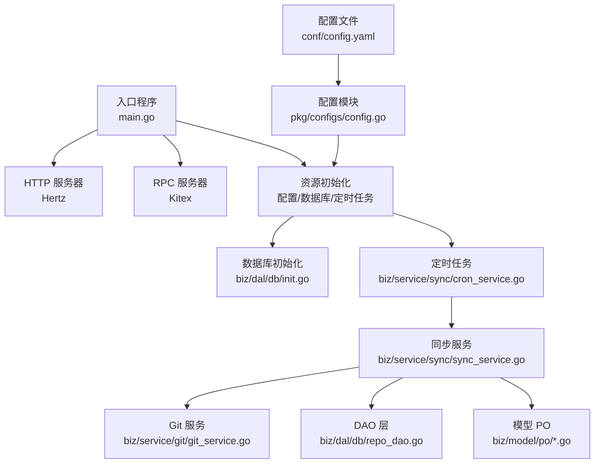
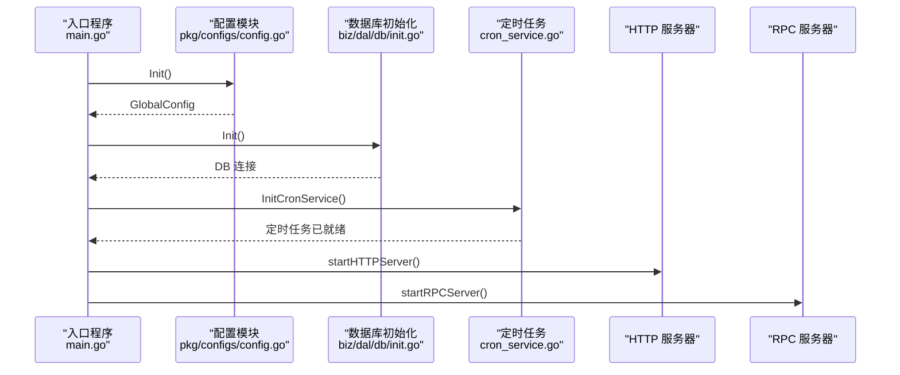
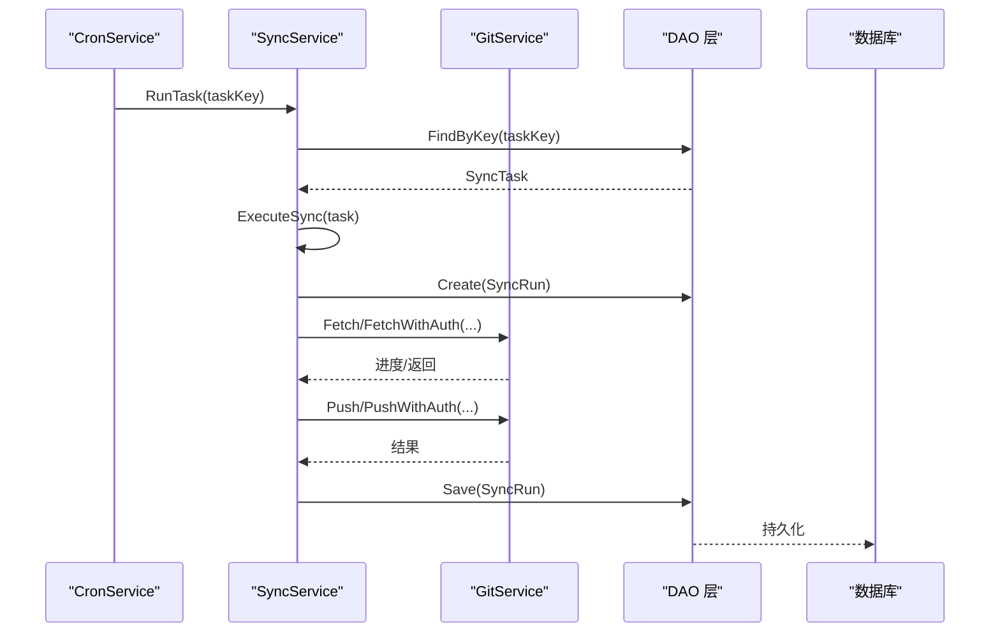
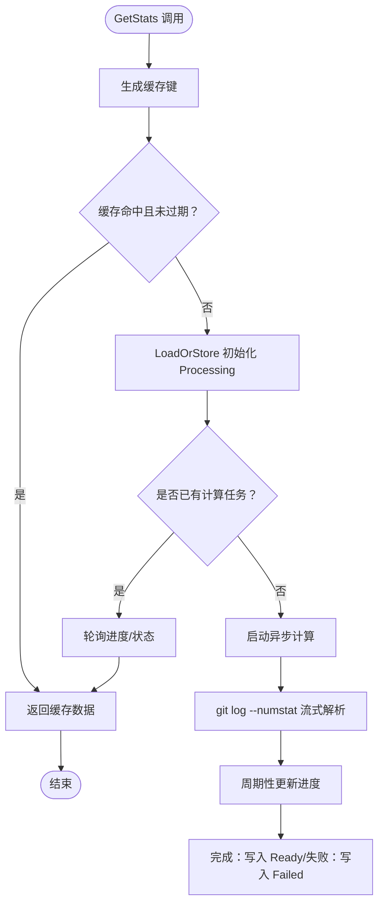
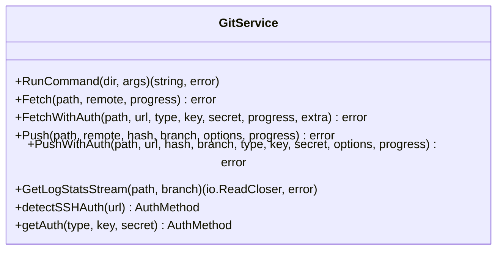
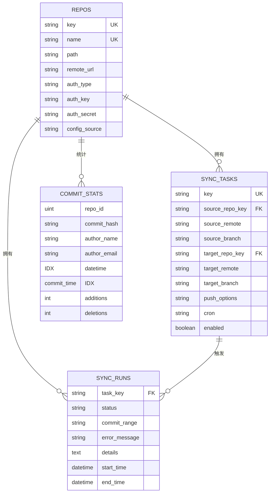
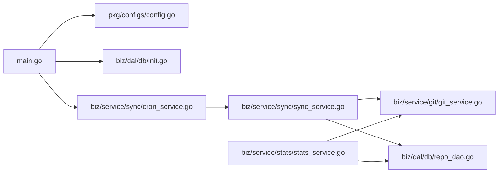

# 性能优化

<cite>
**本文引用的文件**
- [OPTIMIZATION_PLAN.md](file://OPTIMIZATION_PLAN.md)
- [main.go](file://main.go)
- [conf/config.yaml](file://conf/config.yaml)
- [pkg/configs/config.go](file://pkg/configs/config.go)
- [biz/dal/db/init.go](file://biz/dal/db/init.go)
- [biz/dal/db/repo_dao.go](file://biz/dal/db/repo_dao.go)
- [biz/service/sync/cron_service.go](file://biz/service/sync/cron_service.go)
- [biz/service/sync/sync_service.go](file://biz/service/sync/sync_service.go)
- [biz/service/stats/stats_service.go](file://biz/service/stats/stats_service.go)
- [biz/service/git/git_service.go](file://biz/service/git/git_service.go)
- [biz/model/po/repo.go](file://biz/model/po/repo.go)
- [biz/model/po/sync_task.go](file://biz/model/po/sync_task.go)
- [biz/model/po/sync_run.go](file://biz/model/po/sync_run.go)
- [biz/model/po/commit_stat.go](file://biz/model/po/commit_stat.go)
- [deploy/docker-compose/mysql/docker-compose.yml](file://deploy/docker-compose/mysql/docker-compose.yml)
</cite>

## 目录
1. [简介](#简介)
2. [项目结构](#项目结构)
3. [核心组件](#核心组件)
4. [架构总览](#架构总览)
5. [详细组件分析](#详细组件分析)
6. [依赖关系分析](#依赖关系分析)
7. [性能考量](#性能考量)
8. [故障排查指南](#故障排查指南)
9. [结论](#结论)
10. [附录](#附录)

## 简介
本指南面向“Git 管理服务”项目，聚焦系统性能优化，覆盖以下主题：
- 性能瓶颈识别与分析方法
- 数据库查询优化与索引策略
- 内存使用优化与垃圾回收调优
- 并发处理与线程池配置优化
- 网络 I/O 与连接池配置建议
- 缓存策略与 CDN 配置
- Git 操作性能优化与大仓库处理策略
- 负载均衡与高可用架构设计原则
- 性能测试与基准测试实施

## 项目结构
该项目采用清晰的分层架构：入口程序负责启动 HTTP/RPC 服务与资源初始化；业务层按领域拆分（同步、统计、审计等）；数据访问层通过 GORM 访问数据库；Git 操作封装在专用服务中。

图表来源
- [main.go](file://main.go#L52-L134)
- [biz/dal/db/init.go](file://biz/dal/db/init.go#L18-L71)
- [biz/service/sync/cron_service.go](file://biz/service/sync/cron_service.go#L24-L33)
- [biz/service/sync/sync_service.go](file://biz/service/sync/sync_service.go#L19-L25)
- [biz/service/git/git_service.go](file://biz/service/git/git_service.go#L29-L31)
- [pkg/configs/config.go](file://pkg/configs/config.go#L18-L42)
- [conf/config.yaml](file://conf/config.yaml#L1-L25)

章节来源
- [main.go](file://main.go#L52-L134)
- [pkg/configs/config.go](file://pkg/configs/config.go#L18-L42)
- [conf/config.yaml](file://conf/config.yaml#L1-L25)
- [biz/dal/db/init.go](file://biz/dal/db/init.go#L18-L71)

## 核心组件
- 入口与启动：负责解析启动模式、初始化全局资源、启动 HTTP/RPC 服务，并处理优雅停机。
- 配置系统：集中加载 YAML 配置，支持环境变量覆盖，提供全局配置与兼容变量。
- 数据库层：根据配置选择 SQLite/MySQL/Postgres，自动迁移表结构。
- 同步服务：基于 Cron 的定时任务驱动，执行 Git Fetch/Push、冲突检测与运行记录持久化。
- 统计服务：基于 Git 日志流式解析，构建作者贡献、文件类型趋势等指标，带并发计算与缓存。
- Git 服务：封装 go-git 与原生命令，提供 Fetch/Push/Auth、远程检测、分支/文件/状态等能力。

章节来源
- [main.go](file://main.go#L52-L134)
- [pkg/configs/config.go](file://pkg/configs/config.go#L18-L42)
- [conf/config.yaml](file://conf/config.yaml#L1-L25)
- [biz/dal/db/init.go](file://biz/dal/db/init.go#L18-L71)
- [biz/service/sync/cron_service.go](file://biz/service/sync/cron_service.go#L24-L33)
- [biz/service/sync/sync_service.go](file://biz/service/sync/sync_service.go#L19-L25)
- [biz/service/stats/stats_service.go](file://biz/service/stats/stats_service.go#L46-L50)
- [biz/service/git/git_service.go](file://biz/service/git/git_service.go#L29-L31)

## 架构总览
下图展示启动流程、配置加载、数据库初始化与服务注册的关键交互。

图表来源
- [main.go](file://main.go#L115-L134)
- [pkg/configs/config.go](file://pkg/configs/config.go#L18-L42)
- [biz/dal/db/init.go](file://biz/dal/db/init.go#L18-L71)
- [biz/service/sync/cron_service.go](file://biz/service/sync/cron_service.go#L24-L33)

## 详细组件分析

### 同步服务与定时任务
- 定时任务：基于 cron 表达式调度，动态增删任务条目，避免重复添加。
- 执行流程：记录运行开始、执行 Git 操作、捕获日志、回写运行结果（含状态、错误、详情）。
- 并发控制：当前未见显式的并发池限制，建议对大规模同步任务引入限流/并发池。

图表来源
- [biz/service/sync/cron_service.go](file://biz/service/sync/cron_service.go#L84-L100)
- [biz/service/sync/sync_service.go](file://biz/service/sync/sync_service.go#L27-L74)
- [biz/service/git/git_service.go](file://biz/service/git/git_service.go#L138-L191)
- [biz/dal/db/repo_dao.go](file://biz/dal/db/repo_dao.go#L13-L27)

章节来源
- [biz/service/sync/cron_service.go](file://biz/service/sync/cron_service.go#L24-L100)
- [biz/service/sync/sync_service.go](file://biz/service/sync/sync_service.go#L27-L249)

### 统计服务与缓存
- 缓存策略：以路径+分支+时间范围为键，使用 sync.Map 存储状态、数据、进度与创建时间，1 小时 TTL。
- 并发计算：首次访问时异步计算，期间返回 Processing 状态与进度更新；并发请求共享同一计算任务。
- 流式解析：使用 git log --numstat 流式扫描，提高大仓库统计效率；设置 Scanner 缓冲区大小以减少分配。

图表来源
- [biz/service/stats/stats_service.go](file://biz/service/stats/stats_service.go#L180-L227)
- [biz/service/stats/stats_service.go](file://biz/service/stats/stats_service.go#L246-L371)

章节来源
- [biz/service/stats/stats_service.go](file://biz/service/stats/stats_service.go#L31-L50)
- [biz/service/stats/stats_service.go](file://biz/service/stats/stats_service.go#L180-L243)
- [biz/service/stats/stats_service.go](file://biz/service/stats/stats_service.go#L246-L371)

### Git 服务与命令执行
- 认证：支持 HTTP Basic 与 SSH 密钥；可从远程 URL 自动探测 SSH 认证；支持 SSH Agent。
- 原生命令：通过 exec.Command 调用 git，强制英文输出与无交互提示，便于日志与错误解析。
- 进度回调：通过 io.Writer 回传进度，便于 UI 与日志记录。

图表来源
- [biz/service/git/git_service.go](file://biz/service/git/git_service.go#L33-L800)

章节来源
- [biz/service/git/git_service.go](file://biz/service/git/git_service.go#L33-L127)
- [biz/service/git/git_service.go](file://biz/service/git/git_service.go#L138-L191)
- [biz/service/git/git_service.go](file://biz/service/git/git_service.go#L292-L323)
- [biz/service/git/git_service.go](file://biz/service/git/git_service.go#L786-L800)

### 数据模型与索引
- 仓库与同步任务：唯一键用于去重，外键关联源/目标仓库。
- 提交统计：复合唯一索引（仓库+哈希），作者邮箱、提交时间建立索引，便于范围查询与去重。

图表来源
- [biz/model/po/repo.go](file://biz/model/po/repo.go#L11-L28)
- [biz/model/po/sync_task.go](file://biz/model/po/sync_task.go#L7-L29)
- [biz/model/po/sync_run.go](file://biz/model/po/sync_run.go#L9-L26)
- [biz/model/po/commit_stat.go](file://biz/model/po/commit_stat.go#L9-L23)

章节来源
- [biz/model/po/repo.go](file://biz/model/po/repo.go#L11-L28)
- [biz/model/po/sync_task.go](file://biz/model/po/sync_task.go#L7-L29)
- [biz/model/po/sync_run.go](file://biz/model/po/sync_run.go#L9-L26)
- [biz/model/po/commit_stat.go](file://biz/model/po/commit_stat.go#L9-L23)

## 依赖关系分析
- 入口程序依赖配置模块、数据库初始化与各业务服务初始化。
- 同步服务依赖 Git 服务与 DAO 层，DAO 层依赖 GORM 与底层数据库。
- 统计服务依赖 Git 服务与 DAO 层，同时内部维护并发缓存。
- 配置模块读取 YAML 并支持环境变量覆盖。

图表来源
- [main.go](file://main.go#L115-L134)
- [pkg/configs/config.go](file://pkg/configs/config.go#L18-L42)
- [biz/dal/db/init.go](file://biz/dal/db/init.go#L18-L71)
- [biz/service/sync/cron_service.go](file://biz/service/sync/cron_service.go#L24-L33)
- [biz/service/sync/sync_service.go](file://biz/service/sync/sync_service.go#L19-L25)
- [biz/service/git/git_service.go](file://biz/service/git/git_service.go#L29-L31)
- [biz/dal/db/repo_dao.go](file://biz/dal/db/repo_dao.go#L13-L27)
- [biz/service/stats/stats_service.go](file://biz/service/stats/stats_service.go#L46-L50)

章节来源
- [main.go](file://main.go#L115-L134)
- [pkg/configs/config.go](file://pkg/configs/config.go#L18-L42)
- [biz/dal/db/init.go](file://biz/dal/db/init.go#L18-L71)
- [biz/service/sync/cron_service.go](file://biz/service/sync/cron_service.go#L24-L33)
- [biz/service/sync/sync_service.go](file://biz/service/sync/sync_service.go#L19-L25)
- [biz/service/git/git_service.go](file://biz/service/git/git_service.go#L29-L31)
- [biz/dal/db/repo_dao.go](file://biz/dal/db/repo_dao.go#L13-L27)
- [biz/service/stats/stats_service.go](file://biz/service/stats/stats_service.go#L46-L50)

## 性能考量

### 1. 性能瓶颈识别与分析方法
- 指标采集：CPU、内存、GC、Goroutine 数、阻塞栈、系统调用、磁盘 I/O、网络 I/O。
- 关键路径：同步任务执行链路（Fetch/Push）、统计服务流式解析、数据库写入。
- 工具建议：pprof（CPU/内存/阻塞/GC）、expvar/metrics、APM（如 Jaeger/Zipkin）。
- 方法论：火焰图定位热点函数；内存剖析识别逃逸与分配热点；慢查询分析器定位数据库慢 SQL。

### 2. 数据库查询优化与索引策略
- 现状与建议
  - 查询：DAO 层多为简单 CRUD，建议为高频字段添加合适索引。
  - 写入：批量写入（如统计服务）已采用批处理，建议进一步评估批大小与事务边界。
  - 连接：GORM 默认连接池参数可按 QPS 调整（最大打开连接数、空闲连接、连接生命周期）。
- 索引策略
  - 同步运行记录：按任务键、开始时间建立索引，加速查询与分页。
  - 提交统计：复合唯一索引（仓库+哈希）避免重复；作者邮箱、提交时间建立二级索引，支持范围查询与聚合。
  - 仓库：Key/Name 唯一索引已存在，建议评估是否需要联合索引以覆盖常用过滤条件。
- 参考实现位置
  - [biz/dal/db/repo_dao.go](file://biz/dal/db/repo_dao.go#L13-L27)
  - [biz/model/po/commit_stat.go](file://biz/model/po/commit_stat.go#L9-L23)
  - [biz/model/po/sync_run.go](file://biz/model/po/sync_run.go#L9-L26)

章节来源
- [biz/dal/db/repo_dao.go](file://biz/dal/db/repo_dao.go#L13-L27)
- [biz/model/po/commit_stat.go](file://biz/model/po/commit_stat.go#L9-L23)
- [biz/model/po/sync_run.go](file://biz/model/po/sync_run.go#L9-L26)

### 3. 内存使用优化与垃圾回收调优
- 优化点
  - 大对象复用：Scanner 缓冲区已增大，建议在循环中复用切片与字符串缓冲。
  - 减少逃逸：避免在热路径频繁分配临时对象；必要时使用 sync.Pool。
  - GC 参数：根据峰值内存与停顿容忍度调整 GOGC、GOMAXPROCS；结合 pprof 观察分配热点。
  - 统计服务：并发计算共享同一任务，避免重复计算；缓存项 TTL 控制内存占用。
- 参考实现位置
  - [biz/service/stats/stats_service.go](file://biz/service/stats/stats_service.go#L267-L271)
  - [biz/service/stats/stats_service.go](file://biz/service/stats/stats_service.go#L180-L227)

章节来源
- [biz/service/stats/stats_service.go](file://biz/service/stats/stats_service.go#L267-L271)
- [biz/service/stats/stats_service.go](file://biz/service/stats/stats_service.go#L180-L227)

### 4. 并发处理与线程池配置优化
- 现状
  - 统计服务：使用 goroutine 异步计算，配合 sync.Map 与 LoadOrStore 防止重复计算。
  - 同步服务：未见显式并发池；大规模同步任务可能造成资源争用。
- 优化建议
  - 引入工作池/令牌桶：限制同时执行的同步任务数量，避免 IO 与 CPU 抖动。
  - 任务队列：将同步任务入队，由固定数量 worker 消费，支持优先级与重试。
  - 资源隔离：不同仓库/任务组使用独立通道或队列，降低相互影响。
- 参考实现位置
  - [biz/service/stats/stats_service.go](file://biz/service/stats/stats_service.go#L209-L227)
  - [OPTIMIZATION_PLAN.md](file://OPTIMIZATION_PLAN.md#L13-L16)

章节来源
- [biz/service/stats/stats_service.go](file://biz/service/stats/stats_service.go#L209-L227)
- [OPTIMIZATION_PLAN.md](file://OPTIMIZATION_PLAN.md#L13-L16)

### 5. 网络 I/O 优化与连接池配置
- Git 远程访问
  - 认证：优先使用 SSH Agent 与密钥，减少密码交互；HTTP Basic 仅在必要时启用。
  - 进度回调：通过 io.Writer 输出，避免阻塞主流程。
- 数据库连接池
  - 建议：根据并发与延迟要求调整最大连接数、空闲连接、连接生命周期；开启连接复用与健康检查。
- 参考实现位置
  - [biz/service/git/git_service.go](file://biz/service/git/git_service.go#L50-L65)
  - [biz/service/git/git_service.go](file://biz/service/git/git_service.go#L138-L191)
  - [biz/dal/db/init.go](file://biz/dal/db/init.go#L18-L71)

章节来源
- [biz/service/git/git_service.go](file://biz/service/git/git_service.go#L50-L65)
- [biz/service/git/git_service.go](file://biz/service/git/git_service.go#L138-L191)
- [biz/dal/db/init.go](file://biz/dal/db/init.go#L18-L71)

### 6. 缓存策略与 CDN 配置
- 应用内缓存
  - 统计服务：短期 TTL 缓存（1 小时），并发计算共享任务，显著降低重复计算成本。
  - 建议：对热点查询（如最近一次同步运行）增加本地缓存；对外部 API（如 Webhook）增加本地退避与重试。
- CDN 与静态资源
  - 前端静态资源（JS/CSS）建议使用 CDN，结合缓存头与版本化路径；图片与大文件可走对象存储并开启压缩。
- 参考实现位置
  - [biz/service/stats/stats_service.go](file://biz/service/stats/stats_service.go#L180-L227)

章节来源
- [biz/service/stats/stats_service.go](file://biz/service/stats/stats_service.go#L180-L227)

### 7. Git 操作性能优化与大仓库处理策略
- 大仓处理
  - 流式解析：统计服务使用 git log --numstat 流式读取，避免一次性加载全部内容。
  - 批量写入：统计服务按批次写入数据库，减少事务开销。
  - 时间窗口：按时间范围增量同步，避免全量扫描。
- 认证与网络
  - 优先 SSH Agent；减少交互式认证；合理设置超时与重试。
- 参考实现位置
  - [biz/service/git/git_service.go](file://biz/service/git/git_service.go#L786-L800)
  - [biz/service/stats/stats_service.go](file://biz/service/stats/stats_service.go#L116-L139)

章节来源
- [biz/service/git/git_service.go](file://biz/service/git/git_service.go#L786-L800)
- [biz/service/stats/stats_service.go](file://biz/service/stats/stats_service.go#L116-L139)

### 8. 负载均衡与高可用架构设计原则
- 无状态设计：应用层尽量无状态，会话与状态放入外部存储（Redis/DB）。
- 多副本部署：容器编排（Kubernetes）多副本，结合健康检查与滚动更新。
- 负载均衡：Ingress/Nginx/SLB 均匀分发请求；后端服务无状态便于扩缩容。
- 数据一致性：数据库主从复制、只读分离；写操作路由至主库。
- 参考实现位置
  - [deploy/docker-compose/mysql/docker-compose.yml](file://deploy/docker-compose/mysql/docker-compose.yml#L1-L50)

章节来源
- [deploy/docker-compose/mysql/docker-compose.yml](file://deploy/docker-compose/mysql/docker-compose.yml#L1-L50)

### 9. 性能测试与基准测试实施
- 单元/集成测试：针对关键函数（Fetch/Push、日志解析、DAO 写入）编写基准测试。
- 压测工具：wrk/JMeter/Loader.io；模拟真实场景（并发、长连接、慢网络）。
- 指标监控：QPS、P95/P99 延迟、错误率、资源使用率；结合 APM 进行端到端追踪。
- 基准场景：大仓库增量同步、高并发统计查询、多任务并发执行。
- 参考实现位置
  - [biz/service/sync/sync_service.go](file://biz/service/sync/sync_service.go#L27-L74)
  - [biz/service/git/git_service.go](file://biz/service/git/git_service.go#L786-L800)

章节来源
- [biz/service/sync/sync_service.go](file://biz/service/sync/sync_service.go#L27-L74)
- [biz/service/git/git_service.go](file://biz/service/git/git_service.go#L786-L800)

## 故障排查指南
- 同步失败
  - 检查运行记录（状态、错误消息、详情）；确认远端 URL、认证方式与权限。
  - 关注冲突与非快进场景，必要时回滚或人工介入。
- 统计长时间处于 Processing
  - 查看缓存进度；检查 Git 日志流是否正常；确认批处理与数据库写入是否阻塞。
- 数据库连接问题
  - 检查连接池参数与最大连接数；确认数据库实例状态与网络连通性。
- 配置生效
  - 确认配置文件路径与环境变量覆盖顺序；重启服务使新配置生效。

章节来源
- [biz/service/sync/sync_service.go](file://biz/service/sync/sync_service.go#L52-L74)
- [biz/service/stats/stats_service.go](file://biz/service/stats/stats_service.go#L180-L227)
- [pkg/configs/config.go](file://pkg/configs/config.go#L18-L42)
- [conf/config.yaml](file://conf/config.yaml#L1-L25)

## 结论
本项目在架构与功能上已具备良好基础。性能优化应围绕“瓶颈识别—指标采集—针对性优化—回归验证”的闭环展开。建议优先完善并发控制、数据库索引与连接池、统计服务缓存与流式处理、以及负载均衡与高可用部署，持续通过压测与 APM 追踪保障线上稳定与性能。

## 附录
- 启动模式与端口
  - HTTP 端口：来自配置 server.port，默认 38080
  - RPC 端口：来自配置 rpc.port，默认 38888
- 数据库类型与路径
  - SQLite：默认 git_sync.db
  - MySQL/Postgres：可通过配置文件或环境变量指定 DSN/主机/端口/凭据

章节来源
- [conf/config.yaml](file://conf/config.yaml#L1-L25)
- [pkg/configs/config.go](file://pkg/configs/config.go#L18-L42)
- [main.go](file://main.go#L137-L175)