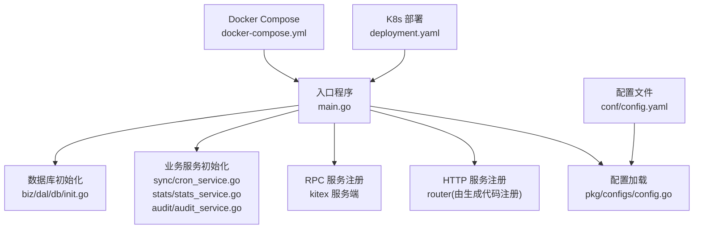
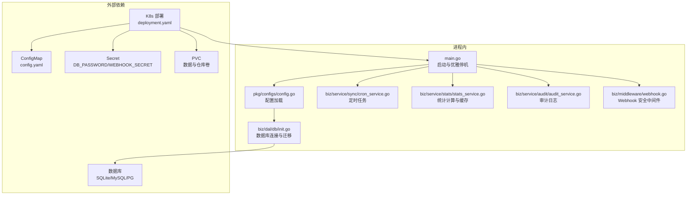
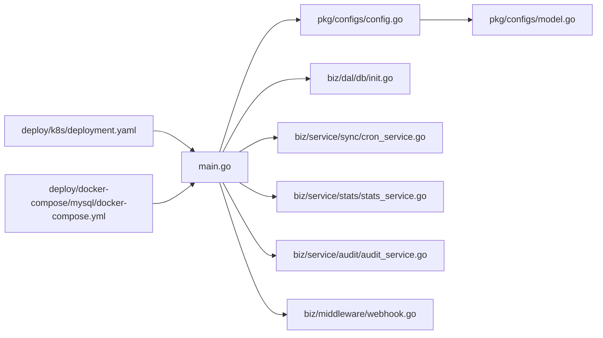

# 监控运维

<cite>
**本文引用的文件**
- [main.go](file://main.go)
- [conf/config.yaml](file://conf/config.yaml)
- [pkg/configs/config.go](file://pkg/configs/config.go)
- [pkg/configs/model.go](file://pkg/configs/model.go)
- [deploy/k8s/deployment.yaml](file://deploy/k8s/deployment.yaml)
- [deploy/k8s/configmap.yaml](file://deploy/k8s/configmap.yaml)
- [deploy/k8s/secret.yaml](file://deploy/k8s/secret.yaml)
- [deploy/docker-compose/mysql/docker-compose.yml](file://deploy/docker-compose/mysql/docker-compose.yml)
- [biz/dal/db/init.go](file://biz/dal/db/init.go)
- [biz/middleware/webhook.go](file://biz/middleware/webhook.go)
- [biz/service/sync/cron_service.go](file://biz/service/sync/cron_service.go)
- [biz/service/stats/stats_service.go](file://biz/service/stats/stats_service.go)
- [biz/service/audit/audit_service.go](file://biz/service/audit/audit_service.go)
- [deploy/CONFIG_GUIDE.md](file://deploy/CONFIG_GUIDE.md)
- [OPTIMIZATION_PLAN.md](file://OPTIMIZATION_PLAN.md)
</cite>

## 目录
1. [简介](#简介)
2. [项目结构](#项目结构)
3. [核心组件](#核心组件)
4. [架构总览](#架构总览)
5. [详细组件分析](#详细组件分析)
6. [依赖关系分析](#依赖关系分析)
7. [性能考量](#性能考量)
8. [故障排查指南](#故障排查指南)
9. [结论](#结论)
10. [附录](#附录)

## 简介
本指南面向运维与开发团队，围绕日志管理、性能监控、健康检查与告警、数据库性能监控与优化、应用与用户体验监控、故障排查、备份与恢复、容量规划与资源优化、以及运维自动化与 CI/CD 集成等方面，结合代码库现状给出可落地的策略与最佳实践。文档内容严格基于仓库现有实现与配置文件，避免臆测。

## 项目结构
该项目采用“入口程序 + 配置加载 + 业务服务 + 数据访问层”的分层架构，支持 HTTP 与 RPC 双栈运行模式，并提供多种部署方式（Kubernetes 与 Docker Compose）。配置通过 YAML 文件与环境变量注入，数据库支持 SQLite、MySQL、PostgreSQL。

图表来源
- [main.go](file://main.go#L52-L134)
- [pkg/configs/config.go](file://pkg/configs/config.go#L18-L42)
- [biz/dal/db/init.go](file://biz/dal/db/init.go#L18-L71)
- [deploy/k8s/deployment.yaml](file://deploy/k8s/deployment.yaml#L1-L83)
- [deploy/docker-compose/mysql/docker-compose.yml](file://deploy/docker-compose/mysql/docker-compose.yml#L1-L50)

章节来源
- [main.go](file://main.go#L1-L176)
- [conf/config.yaml](file://conf/config.yaml#L1-L25)
- [pkg/configs/config.go](file://pkg/configs/config.go#L1-L43)
- [pkg/configs/model.go](file://pkg/configs/model.go#L1-L34)
- [deploy/k8s/deployment.yaml](file://deploy/k8s/deployment.yaml#L1-L83)
- [deploy/docker-compose/mysql/docker-compose.yml](file://deploy/docker-compose/mysql/docker-compose.yml#L1-L50)

## 核心组件
- 启动与生命周期管理：入口程序负责解析启动模式、初始化资源、启动 HTTP/RPC 服务，并处理优雅停机。
- 配置系统：集中于 YAML 配置文件与环境变量注入，支持数据库类型切换、Webhook 安全策略等。
- 业务服务：
  - 定时同步：基于 cron 的周期任务调度与执行。
  - 统计分析：基于 Git 日志流的快速统计计算与缓存。
  - 审计日志：对关键操作进行异步记录。
- 数据访问层：根据配置选择 SQLite/MySQL/PostgreSQL，自动迁移表结构。
- Webhook 安全中间件：提供 IP 白名单、速率限制与签名校验。

章节来源
- [main.go](file://main.go#L52-L134)
- [pkg/configs/config.go](file://pkg/configs/config.go#L18-L42)
- [biz/service/sync/cron_service.go](file://biz/service/sync/cron_service.go#L24-L101)
- [biz/service/stats/stats_service.go](file://biz/service/stats/stats_service.go#L46-L372)
- [biz/service/audit/audit_service.go](file://biz/service/audit/audit_service.go#L17-L51)
- [biz/dal/db/init.go](file://biz/dal/db/init.go#L18-L71)
- [biz/middleware/webhook.go](file://biz/middleware/webhook.go#L18-L70)

## 架构总览
下图展示了进程内组件交互与外部依赖（数据库、配置、卷与密钥）：

图表来源
- [main.go](file://main.go#L52-L134)
- [pkg/configs/config.go](file://pkg/configs/config.go#L18-L42)
- [biz/dal/db/init.go](file://biz/dal/db/init.go#L18-L71)
- [biz/service/sync/cron_service.go](file://biz/service/sync/cron_service.go#L24-L101)
- [biz/service/stats/stats_service.go](file://biz/service/stats/stats_service.go#L46-L372)
- [biz/service/audit/audit_service.go](file://biz/service/audit/audit_service.go#L17-L51)
- [biz/middleware/webhook.go](file://biz/middleware/webhook.go#L18-L70)
- [deploy/k8s/deployment.yaml](file://deploy/k8s/deployment.yaml#L1-L83)
- [deploy/k8s/configmap.yaml](file://deploy/k8s/configmap.yaml#L1-L20)
- [deploy/k8s/secret.yaml](file://deploy/k8s/secret.yaml#L1-L11)

## 详细组件分析

### 日志管理与日志收集配置
- 进程日志
  - 标准库日志：入口程序与各服务在启动、错误、任务执行等关键节点使用标准库日志输出。
  - 建议：在生产环境引入结构化日志（如 zap/logrus），统一字段（TraceID、Level、Module、Action、Duration），便于检索与聚合。
- 日志收集
  - Kubernetes：通过容器 stdout/stderr 输出，配合集群日志收集器（如 Fluent Bit/Fluentd、Vector、Promtail）采集。
  - Docker：容器标准输出由 Docker daemon 收集，可结合日志驱动（json-file、fluentd 等）转发。
- 日志轮转与保留
  - 建议：在宿主机侧配置 logrotate 或使用容器日志驱动自带轮转；设置最大文件大小与保留天数，避免磁盘占满。
- 日志采样与脱敏
  - 对敏感字段（如密码、签名）进行脱敏；对高频日志进行采样，降低噪声。

章节来源
- [main.go](file://main.go#L60-L134)
- [biz/service/sync/cron_service.go](file://biz/service/sync/cron_service.go#L87-L96)
- [biz/service/stats/stats_service.go](file://biz/service/stats/stats_service.go#L54-L139)
- [biz/service/audit/audit_service.go](file://biz/service/audit/audit_service.go#L24-L50)

### 性能监控指标定义与仪表板搭建
- 指标分类
  - 应用层：请求延迟（P50/P90/P99）、请求速率、错误率、并发连接数、GC 次数与暂停时间、goroutine 数、堆内存使用。
  - 业务层：统计任务处理耗时、批处理大小、缓存命中率、审计日志写入延迟。
  - 数据库层：连接池活跃/空闲连接数、慢查询数量、事务回滚率、锁等待时间。
  - 系统层：CPU 使用率、内存使用、磁盘 IO、网络带宽、文件句柄数。
- 指标采集
  - Go 应用：使用 expvar 或 Prometheus 客户端库暴露指标；K8s 通过 ServiceMonitor/Service 暴露端点。
  - 业务指标：在统计服务与审计服务中埋点（如任务开始/结束时间、批处理条数、缓存更新事件）。
- 仪表板
  - Grafana：基于 Prometheus 数据源构建仪表板，按模块拆分面板（API、业务、DB、系统）。
  - 关键看板：吞吐与延迟、错误趋势、缓存命中、慢任务 TopN、数据库连接池健康、资源使用峰值。

章节来源
- [biz/service/stats/stats_service.go](file://biz/service/stats/stats_service.go#L246-L372)
- [biz/service/audit/audit_service.go](file://biz/service/audit/audit_service.go#L47-L50)

### 健康检查与告警机制
- 健康检查
  - HTTP 健康探针：提供 /healthz 或 /readyz 接口，返回应用状态（DB 连通性、配置加载、关键服务就绪）。
  - K8s Liveness/Readiness Probes：结合容器端口与探针路径，设置超时、重试与探针间隔。
- 告警
  - 基于阈值：请求错误率、P95 延迟、队列积压、DB 连接不足、磁盘空间不足。
  - 基于趋势：流量突降/突增、错误率上升、缓存命中率骤降。
  - 通知渠道：邮件、钉钉、飞书、Slack；为不同级别设置静默窗口与抑制规则。

章节来源
- [deploy/k8s/deployment.yaml](file://deploy/k8s/deployment.yaml#L22-L24)
- [OPTIMIZATION_PLAN.md](file://OPTIMIZATION_PLAN.md#L39-L42)

### 数据库性能监控与优化
- 连接与池
  - 连接池参数：最大连接数、空闲连接数、连接生命周期；根据并发与 DB 资源上限调优。
  - 连接泄漏：确保事务与查询结束后释放连接；对长事务进行限制与监控。
- 查询优化
  - 慢查询：启用慢查询日志，定位热点 SQL；为高频查询建立索引（如按时间、状态、外键）。
  - 批处理：统计服务已采用批量写入，建议对其他写入路径也采用批量策略。
- 迁移与一致性
  - 迁移脚本：使用 GORM AutoMigrate 时注意幂等与回滚；生产环境建议手工迁移并备份。
  - 事务：对跨表写入使用事务，失败补偿。
- 存储引擎与参数
  - MySQL：InnoDB 参数调优；Binlog、缓冲池、锁等待超时。
  - PostgreSQL：WAL、shared_buffers、work_mem、autovacuum 参数。
  - SQLite：在高并发场景建议迁移到 MySQL/PG；若使用 SQLite，注意 WAL 模式与并发写入限制。

章节来源
- [biz/dal/db/init.go](file://biz/dal/db/init.go#L18-L71)
- [biz/service/stats/stats_service.go](file://biz/service/stats/stats_service.go#L116-L132)

### 应用性能监控与用户体验监控
- 应用性能
  - 接口级：埋点请求耗时、错误码分布、路由命中率；对慢接口进行链路追踪（TraceID）。
  - 业务级：统计任务耗时、缓存命中、批处理效率；对异常进行告警。
- 用户体验监控
  - 前端指标：首屏时间、交互延迟、错误上报；结合后端 TraceID 进行端到端关联。
  - 仪表板：首页 Dashboard 可展示成功率、活跃仓库、待处理异常等关键指标。

章节来源
- [OPTIMIZATION_PLAN.md](file://OPTIMIZATION_PLAN.md#L28-L36)
- [biz/service/stats/stats_service.go](file://biz/service/stats/stats_service.go#L180-L227)

### Webhook 安全与可观测性
- 安全策略
  - IP 白名单：仅允许可信来源触发。
  - 速率限制：每分钟请求数限制，防刷与突发。
  - 签名验证：使用共享密钥对请求体进行 HMAC-SHA256 校验。
- 可观测性
  - 记录 Webhook 入口的请求摘要（来源 IP、时间、签名结果、限流决策）。
  - 对失败请求（签名无效、超限、IP 不在白名单）进行告警。

章节来源
- [biz/middleware/webhook.go](file://biz/middleware/webhook.go#L18-L70)
- [pkg/configs/config.go](file://pkg/configs/config.go#L34-L42)

### 部署与配置管理
- 配置来源
  - YAML 配置文件：server、database、webhook、rpc 等。
  - 环境变量：覆盖敏感字段（如 DB 密码、Webhook 密钥）。
- K8s 配置
  - ConfigMap：存放非敏感配置；Secret：存放密码与密钥。
  - 卷挂载：将配置文件与数据卷、仓库卷挂载至容器。
- Docker Compose
  - 通过环境变量注入数据库与 Webhook 配置；挂载仓库目录与 SSH 凭据。

章节来源
- [conf/config.yaml](file://conf/config.yaml#L1-L25)
- [pkg/configs/model.go](file://pkg/configs/model.go#L3-L34)
- [pkg/configs/config.go](file://pkg/configs/config.go#L18-L42)
- [deploy/k8s/configmap.yaml](file://deploy/k8s/configmap.yaml#L1-L20)
- [deploy/k8s/secret.yaml](file://deploy/k8s/secret.yaml#L1-L11)
- [deploy/k8s/deployment.yaml](file://deploy/k8s/deployment.yaml#L1-L83)
- [deploy/docker-compose/mysql/docker-compose.yml](file://deploy/docker-compose/mysql/docker-compose.yml#L1-L50)
- [deploy/CONFIG_GUIDE.md](file://deploy/CONFIG_GUIDE.md#L1-L99)

### 备份策略与数据恢复
- 备份范围
  - 数据库：定期导出（mysqldump/pg_dump/sqlite 文件拷贝）；增量备份结合 Binlog/WAL。
  - 配置与密钥：备份 ConfigMap/Secret；记录密钥版本以便回滚。
  - 仓库数据：备份 /repos 目录；确保权限与完整性。
- 恢复流程
  - 数据库：停止服务 → 恢复数据文件/导入 SQL → 启动服务并验证连通性。
  - 配置：恢复 ConfigMap/Secret → 重启 Pod 使新配置生效。
  - 仓库：恢复 /repos → 校验权限与 Git 对象完整性。
- 自动化
  - 编写备份脚本，加入调度器；对关键对象进行恢复演练。

章节来源
- [deploy/k8s/deployment.yaml](file://deploy/k8s/deployment.yaml#L40-L57)
- [deploy/docker-compose/mysql/docker-compose.yml](file://deploy/docker-compose/mysql/docker-compose.yml#L20-L22)

### 容量规划与资源使用优化
- CPU/内存
  - 评估并发请求与统计任务高峰，预留 CPU 与内存余量；对长耗时任务进行限流与排队。
- 存储
  - 仓库体积增长快，建议单独挂载大容量 PVC；定期清理无用分支与浅拷贝。
- 网络
  - Git 拉取/推送可能成为瓶颈，建议使用内网或专用网络；对上游仓库配置镜像。
- 数据库
  - 根据写入量与查询复杂度调整连接池与索引；必要时分库分表或引入只读副本。

章节来源
- [deploy/k8s/deployment.yaml](file://deploy/k8s/deployment.yaml#L63-L83)
- [biz/service/stats/stats_service.go](file://biz/service/stats/stats_service.go#L116-L132)

### 运维自动化与 CI/CD 集成
- 自动化脚本
  - 构建：Docker 镜像构建与推送。
  - 部署：K8s apply 或 Helm upgrade；滚动更新与回滚。
  - 健康检查：部署后执行就绪探针与端到端测试。
- CI/CD 最佳实践
  - 分环境：dev/staging/prod；不同环境使用不同 ConfigMap/Secret。
  - 安全：密钥与凭据不进入代码库；使用 GitOps 管理配置。
  - 质量：单元测试、集成测试、静态扫描；发布前灰度。
  - 回滚：支持一键回滚至上一个稳定版本。

章节来源
- [deploy/CONFIG_GUIDE.md](file://deploy/CONFIG_GUIDE.md#L91-L99)
- [OPTIMIZATION_PLAN.md](file://OPTIMIZATION_PLAN.md#L65-L69)

## 依赖关系分析

图表来源
- [main.go](file://main.go#L1-L176)
- [pkg/configs/config.go](file://pkg/configs/config.go#L1-L43)
- [pkg/configs/model.go](file://pkg/configs/model.go#L1-L34)
- [biz/dal/db/init.go](file://biz/dal/db/init.go#L1-L72)
- [biz/service/sync/cron_service.go](file://biz/service/sync/cron_service.go#L1-L101)
- [biz/service/stats/stats_service.go](file://biz/service/stats/stats_service.go#L1-L372)
- [biz/service/audit/audit_service.go](file://biz/service/audit/audit_service.go#L1-L51)
- [biz/middleware/webhook.go](file://biz/middleware/webhook.go#L1-L70)
- [deploy/k8s/deployment.yaml](file://deploy/k8s/deployment.yaml#L1-L83)
- [deploy/docker-compose/mysql/docker-compose.yml](file://deploy/docker-compose/mysql/docker-compose.yml#L1-L50)

章节来源
- [main.go](file://main.go#L1-L176)
- [pkg/configs/config.go](file://pkg/configs/config.go#L1-L43)
- [biz/dal/db/init.go](file://biz/dal/db/init.go#L1-L72)
- [biz/service/sync/cron_service.go](file://biz/service/sync/cron_service.go#L1-L101)
- [biz/service/stats/stats_service.go](file://biz/service/stats/stats_service.go#L1-L372)
- [biz/service/audit/audit_service.go](file://biz/service/audit/audit_service.go#L1-L51)
- [biz/middleware/webhook.go](file://biz/middleware/webhook.go#L1-L70)
- [deploy/k8s/deployment.yaml](file://deploy/k8s/deployment.yaml#L1-L83)
- [deploy/docker-compose/mysql/docker-compose.yml](file://deploy/docker-compose/mysql/docker-compose.yml#L1-L50)

## 性能考量
- 启动与优雅停机
  - 通过信号处理与超时上下文实现优雅关闭，避免请求中断。
- 并发与限流
  - Webhook 中间件提供速率限制；建议在业务层对高并发操作（如统计、同步）引入并发池与队列。
- 缓存与批处理
  - 统计服务使用缓存与批处理减少重复计算与数据库压力。
- 数据库连接与迁移
  - 根据负载调整连接池；生产环境谨慎进行迁移与备份。

章节来源
- [main.go](file://main.go#L69-L113)
- [biz/middleware/webhook.go](file://biz/middleware/webhook.go#L16-L40)
- [biz/service/stats/stats_service.go](file://biz/service/stats/stats_service.go#L31-L50)
- [biz/dal/db/init.go](file://biz/dal/db/init.go#L49-L71)

## 故障排查指南
- 启动失败
  - 检查配置文件与环境变量是否正确加载；确认端口未被占用。
- 数据库连接失败
  - 核对数据库类型、主机、端口、用户、密码；确认网络连通与防火墙。
- Webhook 无法接入
  - 校验签名算法与密钥；检查 IP 白名单与速率限制；查看中间件返回的错误原因。
- 统计任务异常
  - 查看统计服务日志与缓存状态；确认 Git 仓库路径与分支存在；检查批处理保存是否报错。
- 审计日志缺失
  - 确认审计服务初始化完成；检查异步写入是否阻塞；核对数据库写入权限。
- 备份与恢复
  - 备份前先验证数据库连通性与文件完整性；恢复后进行功能回归测试。

章节来源
- [main.go](file://main.go#L60-L134)
- [pkg/configs/config.go](file://pkg/configs/config.go#L18-L42)
- [biz/dal/db/init.go](file://biz/dal/db/init.go#L49-L71)
- [biz/middleware/webhook.go](file://biz/middleware/webhook.go#L42-L68)
- [biz/service/stats/stats_service.go](file://biz/service/stats/stats_service.go#L54-L139)
- [biz/service/audit/audit_service.go](file://biz/service/audit/audit_service.go#L47-L50)

## 结论
本指南基于现有代码与配置，给出了日志、性能、健康检查、数据库、用户体验、备份恢复、容量规划与自动化等方面的运维策略。建议尽快引入结构化日志、指标与告警体系，并完善 CI/CD 流程与演练，持续提升系统的可观测性与可靠性。

## 附录
- 配置项速览
  - server.port：HTTP 服务监听端口
  - database.type/path/host/port/user/password/dbname/dsn：数据库类型与连接参数
  - webhook.secret/rate_limit/ip_whitelist：Webhook 安全策略
- 常用命令（示例）
  - 启动模式：./git-manage-service -mode=all
  - 查看版本：./git-manage-service -version
  - K8s 应用：kubectl apply -f deploy/k8s/
  - Docker Compose：docker-compose -f deploy/docker-compose/mysql/docker-compose.yml up -d

章节来源
- [conf/config.yaml](file://conf/config.yaml#L1-L25)
- [pkg/configs/model.go](file://pkg/configs/model.go#L3-L34)
- [deploy/CONFIG_GUIDE.md](file://deploy/CONFIG_GUIDE.md#L1-L99)
- [main.go](file://main.go#L42-L50)