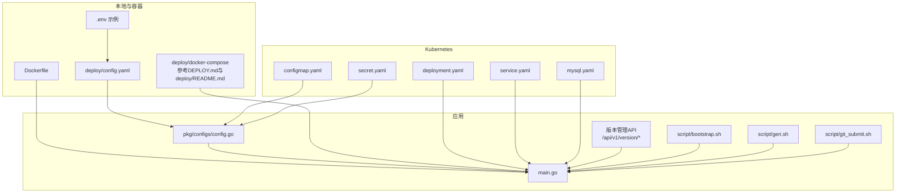
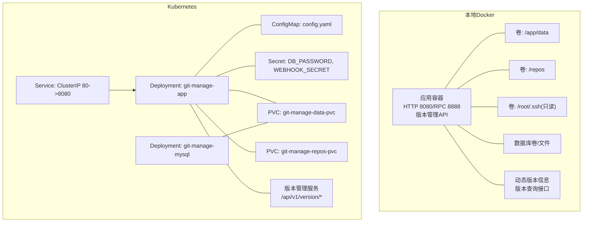
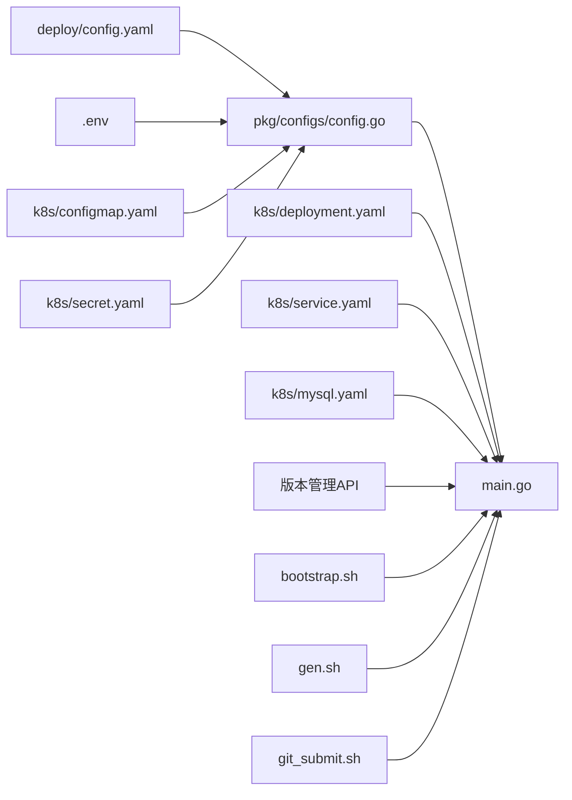

# 部署运维

<cite>
**本文引用的文件**
- [DEPLOY.md](file://DEPLOY.md)
- [deploy/README.md](file://deploy/README.md)
- [deploy/CONFIG_GUIDE.md](file://deploy/CONFIG_GUIDE.md)
- [Dockerfile](file://Dockerfile)
- [deploy/.env.example](file://deploy/.env.example)
- [deploy/config.yaml](file://deploy/config.yaml)
- [deploy/k8s/deployment.yaml](file://deploy/k8s/deployment.yaml)
- [deploy/k8s/service.yaml](file://deploy/k8s/service.yaml)
- [deploy/k8s/configmap.yaml](file://deploy/k8s/configmap.yaml)
- [deploy/k8s/secret.yaml](file://deploy/k8s/secret.yaml)
- [deploy/k8s/mysql.yaml](file://deploy/k8s/mysql.yaml)
- [build.sh](file://build.sh)
- [control.sh](file://control.sh)
- [Makefile](file://Makefile)
- [main.go](file://main.go)
- [pkg/configs/config.go](file://pkg/configs/config.go)
- [script/bootstrap.sh](file://script/bootstrap.sh)
- [script/gen.sh](file://script/gen.sh)
- [script/git_submit.sh](file://script/git_submit.sh)
- [biz/handler/version/version_service.go](file://biz/handler/version/version_service.go)
- [biz/service/git/git_service.go](file://biz/service/git/git_service.go)
- [biz/router/version/version.go](file://biz/router/version/version.go)
</cite>

## 目录
1. [简介](#简介)
2. [项目结构](#项目结构)
3. [核心组件](#核心组件)
4. [架构总览](#架构总览)
5. [详细组件分析](#详细组件分析)
6. [依赖关系分析](#依赖关系分析)
7. [性能与容量规划](#性能与容量规划)
8. [运维操作指南](#运维操作指南)
9. [故障排查](#故障排查)
10. [备份与灾难恢复](#备份与灾难恢复)
11. [安全加固与权限管理](#安全加固与权限管理)
12. [扩展性与高可用](#扩展性与高可用)
13. [运维自动化与CI/CD集成](#运维自动化与cicd集成)
14. [结论](#结论)

## 简介
本指南面向部署与运维工程师，围绕本项目的容器化与Kubernetes部署、环境配置、生产优化、日志与监控、性能与故障排查、备份恢复、安全加固、扩展与高可用以及运维自动化等方面，提供从入门到进阶的实操指引。文档严格基于仓库内现有部署与配置文件进行梳理与总结。

## 项目结构
与部署运维直接相关的目录与文件包括：
- 根镜像构建与运行：Dockerfile
- 本地Docker编排与部署：DEPLOY.md、deploy/README.md、deploy/.env.example、deploy/config.yaml
- Kubernetes资源清单：deploy/k8s/deployment.yaml、service.yaml、configmap.yaml、secret.yaml、mysql.yaml
- 运行控制与构建脚本：Makefile、build.sh、control.sh
- 应用入口与配置加载：main.go、pkg/configs/config.go
- 版本管理与动态版本信息：biz/handler/version/version_service.go、biz/service/git/git_service.go、biz/router/version/version.go
- 自动化脚本：script/bootstrap.sh、script/gen.sh、script/git_submit.sh

**图表来源**
- [Dockerfile](file://Dockerfile#L1-L77)
- [deploy/README.md](file://deploy/README.md#L1-L108)
- [deploy/.env.example](file://deploy/.env.example#L1-L21)
- [deploy/config.yaml](file://deploy/config.yaml#L1-L55)
- [deploy/k8s/deployment.yaml](file://deploy/k8s/deployment.yaml#L1-L83)
- [deploy/k8s/service.yaml](file://deploy/k8s/service.yaml#L1-L14)
- [deploy/k8s/configmap.yaml](file://deploy/k8s/configmap.yaml#L1-L20)
- [deploy/k8s/secret.yaml](file://deploy/k8s/secret.yaml#L1-L11)
- [deploy/k8s/mysql.yaml](file://deploy/k8s/mysql.yaml#L1-L65)
- [main.go](file://main.go#L1-L184)
- [pkg/configs/config.go](file://pkg/configs/config.go#L1-L43)
- [biz/handler/version/version_service.go](file://biz/handler/version/version_service.go#L1-L88)
- [biz/service/git/git_service.go](file://biz/service/git/git_service.go#L1100-L1161)
- [biz/router/version/version.go](file://biz/router/version/version.go#L1-L33)
- [script/bootstrap.sh](file://script/bootstrap.sh#L1-L14)
- [script/gen.sh](file://script/gen.sh#L1-L133)
- [script/git_submit.sh](file://script/git_submit.sh#L1-L94)

**章节来源**
- [DEPLOY.md](file://DEPLOY.md#L1-L83)
- [deploy/README.md](file://deploy/README.md#L1-L108)
- [Dockerfile](file://Dockerfile#L1-L77)
- [deploy/config.yaml](file://deploy/config.yaml#L1-L55)
- [deploy/.env.example](file://deploy/.env.example#L1-L21)
- [deploy/k8s/deployment.yaml](file://deploy/k8s/deployment.yaml#L1-L83)
- [deploy/k8s/service.yaml](file://deploy/k8s/service.yaml#L1-L14)
- [deploy/k8s/configmap.yaml](file://deploy/k8s/configmap.yaml#L1-L20)
- [deploy/k8s/secret.yaml](file://deploy/k8s/secret.yaml#L1-L11)
- [deploy/k8s/mysql.yaml](file://deploy/k8s/mysql.yaml#L1-L65)
- [main.go](file://main.go#L1-L184)
- [pkg/configs/config.go](file://pkg/configs/config.go#L1-L43)
- [biz/handler/version/version_service.go](file://biz/handler/version/version_service.go#L1-L88)
- [biz/service/git/git_service.go](file://biz/service/git/git_service.go#L1100-L1161)
- [biz/router/version/version.go](file://biz/router/version/version.go#L1-L33)
- [script/bootstrap.sh](file://script/bootstrap.sh#L1-L14)
- [script/gen.sh](file://script/gen.sh#L1-L133)
- [script/git_submit.sh](file://script/git_submit.sh#L1-L94)

## 核心组件
- 容器镜像与运行时
  - 使用分阶段构建，基础镜像为Alpine，安装git、openssh-client、ca-certificates、tzdata等运行时依赖；默认暴露HTTP 8080与RPC 8888端口；默认工作目录/app，创建/data与/root/.ssh目录并设置权限。
- 配置体系
  - 应用启动时加载deploy/config.yaml，同时支持通过环境变量覆盖敏感配置（如数据库密码、Webhook密钥、DB_PATH等），实现"配置文件+环境变量"的解耦。
- 本地Docker部署
  - 提供一键编排与启动步骤，支持SQLite/MySQL/PostgreSQL三种数据库类型；强调卷挂载（数据、SSH密钥、仓库目录）与时区设置。
- Kubernetes部署
  - 提供ConfigMap、Secret、Deployment、Service与MySQL Deployment/PVC的资源清单；支持将数据库部署在集群内或使用外部数据库；强调PVC持久化与只读SSH密钥挂载。
- 动态版本信息
  - 应用支持版本标志位输出，显示版本号、构建时间和Git提交哈希；提供版本管理API用于查询当前版本、版本列表和下一个版本信息。
- 自动化脚本
  - 包含启动脚本、代码生成脚本和Git提交自动化脚本，简化开发和部署流程。

**章节来源**
- [Dockerfile](file://Dockerfile#L1-L77)
- [deploy/config.yaml](file://deploy/config.yaml#L1-L55)
- [pkg/configs/config.go](file://pkg/configs/config.go#L18-L42)
- [DEPLOY.md](file://DEPLOY.md#L1-L83)
- [deploy/README.md](file://deploy/README.md#L23-L48)
- [deploy/k8s/deployment.yaml](file://deploy/k8s/deployment.yaml#L1-L83)
- [deploy/k8s/service.yaml](file://deploy/k8s/service.yaml#L1-L14)
- [deploy/k8s/configmap.yaml](file://deploy/k8s/configmap.yaml#L1-L20)
- [deploy/k8s/secret.yaml](file://deploy/k8s/secret.yaml#L1-L11)
- [deploy/k8s/mysql.yaml](file://deploy/k8s/mysql.yaml#L1-L65)
- [main.go](file://main.go#L42-L56)
- [main.go](file://main.go#L61-L66)
- [biz/handler/version/version_service.go](file://biz/handler/version/version_service.go#L14-L87)
- [biz/service/git/git_service.go](file://biz/service/git/git_service.go#L1110-L1161)
- [script/bootstrap.sh](file://script/bootstrap.sh#L1-L14)
- [script/gen.sh](file://script/gen.sh#L1-L133)
- [script/git_submit.sh](file://script/git_submit.sh#L1-L94)

## 架构总览
下图展示容器化与Kubernetes两种部署形态的组件交互与数据流，包括新增的版本管理功能。

**图表来源**
- [Dockerfile](file://Dockerfile#L31-L77)
- [deploy/README.md](file://deploy/README.md#L23-L48)
- [deploy/k8s/deployment.yaml](file://deploy/k8s/deployment.yaml#L1-L83)
- [deploy/k8s/service.yaml](file://deploy/k8s/service.yaml#L1-L14)
- [deploy/k8s/configmap.yaml](file://deploy/k8s/configmap.yaml#L1-L20)
- [deploy/k8s/secret.yaml](file://deploy/k8s/secret.yaml#L1-L11)
- [deploy/k8s/mysql.yaml](file://deploy/k8s/mysql.yaml#L1-L65)
- [main.go](file://main.go#L42-L56)
- [biz/handler/version/version_service.go](file://biz/handler/version/version_service.go#L14-L87)
- [biz/service/git/git_service.go](file://biz/service/git/git_service.go#L1110-L1161)

## 详细组件分析

### Docker容器化部署
- 镜像构建
  - 分阶段构建：builder阶段下载依赖并编译二进制；runtime阶段仅包含运行时依赖，体积小、启动快。
  - 设置代理与镜像源，提升国内拉取速度。
- 运行时
  - 默认运行模式为发布模式，端口8080与8888；创建/data与/root/.ssh目录并设置权限。
  - 默认配置文件拷贝至容器内，可通过环境变量覆盖。
- 卷与挂载
  - 数据库文件（SQLite）位于/app/data；SSH私钥位于/root/.ssh并以只读方式挂载；仓库目录映射到/repos。
- 环境变量
  - 支持APP_PORT、WEBHOOK_SECRET、TZ、DB_TYPE、DB_PATH、DB_HOST、DB_PORT、DB_NAME、DB_USER、DB_PASSWORD、MYSQL_ROOT_PASSWORD等。

**章节来源**
- [Dockerfile](file://Dockerfile#L1-L77)
- [deploy/.env.example](file://deploy/.env.example#L1-L21)
- [DEPLOY.md](file://DEPLOY.md#L37-L82)

### Kubernetes部署
- 应用部署
  - Deployment包含一个副本，容器端口8080与8888；通过Secret注入数据库密码与Webhook密钥；通过ConfigMap挂载config.yaml；通过PVC挂载数据与仓库目录；SSH密钥通过hostPath挂载（仅限节点具备该路径）。
- 服务暴露
  - Service为ClusterIP，将ClusterIP:80映射到Pod的8080端口。
- 内置数据库（可选）
  - 提供MySQL Deployment与Service，使用PVC持久化；数据库凭据通过Secret注入。
- 多环境建议
  - 开发环境可使用sqlite；生产环境建议使用MySQL/PG并关闭debug；敏感信息通过Secret管理。

**章节来源**
- [deploy/k8s/deployment.yaml](file://deploy/k8s/deployment.yaml#L1-L83)
- [deploy/k8s/service.yaml](file://deploy/k8s/service.yaml#L1-L14)
- [deploy/k8s/configmap.yaml](file://deploy/k8s/configmap.yaml#L1-L20)
- [deploy/k8s/secret.yaml](file://deploy/k8s/secret.yaml#L1-L11)
- [deploy/k8s/mysql.yaml](file://deploy/k8s/mysql.yaml#L1-L65)
- [deploy/README.md](file://deploy/README.md#L60-L108)

### 配置与环境变量
- 配置文件
  - 支持server、database、webhook、debug、rpc等模块；database支持sqlite、mysql、postgres；可提供自定义DSN覆盖默认连接串。
- 环境变量覆盖
  - 支持通过环境变量覆盖Webhook密钥、数据库路径等敏感配置，避免明文写入配置文件。
- 时区与端口
  - 通过环境变量TZ设置时区；默认端口8080（HTTP）、8888（RPC）。

**章节来源**
- [deploy/config.yaml](file://deploy/config.yaml#L1-L55)
- [pkg/configs/config.go](file://pkg/configs/config.go#L18-L42)
- [Dockerfile](file://Dockerfile#L63-L70)
- [deploy/.env.example](file://deploy/.env.example#L1-L21)

### 应用启动与优雅停机
- 启动模式
  - 支持http、rpc、all三种模式；默认all，同时启动HTTP与RPC服务。
- 优雅停机
  - 捕获系统信号，先停止RPC服务，再停止HTTP服务，超时控制在5秒内。
- 版本信息输出
  - 支持--version标志位输出版本详情，包括版本号、构建时间和Git提交哈希。

**章节来源**
- [main.go](file://main.go#L42-L56)
- [main.go](file://main.go#L58-L121)
- [main.go](file://main.go#L136-L184)

### 版本管理与动态版本信息
- 版本查询API
  - 提供三个版本管理接口：获取当前版本、列出版本标签、计算下一个版本。
- 版本计算逻辑
  - 基于语义化版本规范（SemVer）自动计算主版本、次版本和修订版本的下一个值。
- Git集成
  - 通过Git描述信息获取当前版本，支持v前缀处理和版本解析。
- 实际应用场景
  - 支持CI/CD流水线中的版本标记、发布管理和自动化部署。

**章节来源**
- [biz/handler/version/version_service.go](file://biz/handler/version/version_service.go#L14-L87)
- [biz/service/git/git_service.go](file://biz/service/git/git_service.go#L1110-L1161)
- [biz/router/version/version.go](file://biz/router/version/version.go#L17-L32)

### 日志与监控
- 日志
  - 应用启动日志与错误日志通过标准输出输出；容器环境下建议对接集中式日志系统（如ELK、Loki+Grafana）。
- 监控
  - 建议结合Prometheus/Grafana对容器指标与业务指标进行采集与可视化；Kubernetes场景下可利用HPA实现水平扩展。

**章节来源**
- [main.go](file://main.go#L58-L121)
- [deploy/README.md](file://deploy/README.md#L45-L47)

### 性能与容量规划
- 数据库选择
  - 开发环境可使用sqlite；生产环境建议使用MySQL/PG并启用连接池与慢查询日志。
- 存储规划
  - PVC初始容量可根据实际仓库规模评估；建议为数据与仓库分别申请独立PVC。
- 端口与网络
  - 8080为HTTP服务端口；8888为RPC端口；Kubernetes Service暴露80端口至8080。
- 版本管理性能
  - 版本查询接口基于Git操作，建议在大型仓库中考虑缓存策略。

**章节来源**
- [deploy/README.md](file://deploy/README.md#L101-L108)
- [deploy/config.yaml](file://deploy/config.yaml#L9-L30)
- [deploy/k8s/deployment.yaml](file://deploy/k8s/deployment.yaml#L63-L83)
- [deploy/k8s/service.yaml](file://deploy/k8s/service.yaml#L9-L13)
- [biz/service/git/git_service.go](file://biz/service/git/git_service.go#L1110-L1161)

## 依赖关系分析
- 组件耦合
  - 应用通过配置模块加载deploy/config.yaml并支持环境变量覆盖；容器镜像内置运行时依赖；K8s通过ConfigMap/Secret注入配置与密钥。
- 外部依赖
  - 数据库：sqlite（本地）、MySQL/PG（K8s或外部）；SSH密钥用于Git访问。
- 潜在风险
  - hostPath挂载SSH密钥依赖节点路径，建议改用Secret挂载以提升可移植性。
  - ConfigMap变更后Pod需重启或等待kubelet同步。
- 版本管理依赖
  - 版本查询功能依赖Git仓库访问权限和正确的仓库路径配置。

**图表来源**
- [deploy/config.yaml](file://deploy/config.yaml#L1-L55)
- [pkg/configs/config.go](file://pkg/configs/config.go#L18-L42)
- [deploy/.env.example](file://deploy/.env.example#L1-L21)
- [main.go](file://main.go#L116-L134)
- [deploy/k8s/configmap.yaml](file://deploy/k8s/configmap.yaml#L1-L20)
- [deploy/k8s/secret.yaml](file://deploy/k8s/secret.yaml#L1-L11)
- [deploy/k8s/deployment.yaml](file://deploy/k8s/deployment.yaml#L1-L83)
- [deploy/k8s/service.yaml](file://deploy/k8s/service.yaml#L1-L14)
- [deploy/k8s/mysql.yaml](file://deploy/k8s/mysql.yaml#L1-L65)
- [biz/handler/version/version_service.go](file://biz/handler/version/version_service.go#L14-L87)
- [script/bootstrap.sh](file://script/bootstrap.sh#L1-L14)
- [script/gen.sh](file://script/gen.sh#L1-L133)
- [script/git_submit.sh](file://script/git_submit.sh#L1-L94)

**章节来源**
- [pkg/configs/config.go](file://pkg/configs/config.go#L18-L42)
- [main.go](file://main.go#L116-L134)
- [deploy/k8s/deployment.yaml](file://deploy/k8s/deployment.yaml#L1-L83)

## 性能与容量规划
- 数据库性能
  - 生产环境优先使用MySQL/PG；合理设置连接池大小、超时时间与慢查询阈值；定期维护索引与统计信息。
- 存储与IO
  - PVC容量按仓库数量与历史规模评估；建议使用SSD存储；对频繁写入的数据目录（/app/data）单独挂载。
- 网络与并发
  - 8080端口承载HTTP接口；8888端口承载RPC；根据业务流量评估副本数与资源配额。
- 资源限制
  - 在K8s中为Deployment设置requests/limits，避免资源争抢导致抖动。
- 版本管理性能
  - 大型Git仓库的版本查询可能较慢，建议实现缓存机制或异步处理。

**章节来源**
- [deploy/README.md](file://deploy/README.md#L101-L108)
- [deploy/config.yaml](file://deploy/config.yaml#L9-L30)
- [deploy/k8s/deployment.yaml](file://deploy/k8s/deployment.yaml#L1-L83)
- [biz/service/git/git_service.go](file://biz/service/git/git_service.go#L1110-L1161)

## 运维操作指南
- 本地Docker部署
  - 准备配置与卷：复制.env.example为.env并按需修改；创建data与repos目录；启动后访问http://localhost:8080。
- Kubernetes部署
  - 创建ConfigMap与Secret；按需部署内置MySQL；部署应用与Service；验证Pod状态与日志。
- 运行控制脚本
  - 提供build/start/stop/restart/status等命令，便于本地开发与测试。
- 版本管理操作
  - 使用版本查询API获取当前版本信息，支持参数化查询特定仓库的版本状态。

**章节来源**
- [DEPLOY.md](file://DEPLOY.md#L10-L36)
- [deploy/README.md](file://deploy/README.md#L27-L48)
- [control.sh](file://control.sh#L1-L110)
- [Makefile](file://Makefile#L6-L28)
- [biz/handler/version/version_service.go](file://biz/handler/version/version_service.go#L14-L87)

## 故障排查
- 常见问题
  - Pod CrashLoopBackOff：检查数据库连接配置、数据库服务就绪状态；查看Pod日志定位错误。
  - SSH密钥无法挂载：确认hostPath路径存在或改用Secret挂载；检查权限与只读属性。
  - 配置未生效：确认ConfigMap已更新并触发Pod重启。
  - 数据库权限/路径问题：检查data目录写权限与DB_PATH设置。
  - 版本查询失败：检查Git仓库访问权限、仓库路径正确性和Git命令执行权限。
- 定位方法
  - Docker：docker logs -f <container>；查看应用启动日志。
  - Kubernetes：kubectl logs -f <pod>；kubectl describe pod <pod>。

**章节来源**
- [deploy/README.md](file://deploy/README.md#L85-L98)
- [DEPLOY.md](file://DEPLOY.md#L78-L82)
- [biz/service/git/git_service.go](file://biz/service/git/git_service.go#L1110-L1161)

## 备份与灾难恢复
- 备份范围
  - 数据库：导出MySQL/PG数据；对于SQLite，备份数据文件所在卷。
  - 配置与密钥：备份ConfigMap与Secret（含base64编码内容）。
  - 仓库数据：备份/repos卷中仓库目录。
  - 版本信息：备份Git仓库的标签和提交历史。
- 备份策略
  - 增量与全量结合；定期校验备份文件完整性；异地存放。
- 恢复流程
  - 恢复顺序：数据库 -> 配置与密钥 -> 仓库数据 -> 重新部署应用。
  - 验证：启动后检查关键接口与数据一致性。

**章节来源**
- [deploy/k8s/deployment.yaml](file://deploy/k8s/deployment.yaml#L40-L56)
- [deploy/k8s/mysql.yaml](file://deploy/k8s/mysql.yaml#L35-L41)
- [deploy/config.yaml](file://deploy/config.yaml#L15-L29)

## 安全加固与权限管理
- 密钥与配置
  - 生产环境禁止在配置文件中明文存储密码；使用Secret管理数据库密码与Webhook密钥。
- 网络与访问控制
  - 限制Webhook IP白名单；必要时启用WAF与速率限制。
- 文件与卷权限
  - 仅在必要时使用hostPath挂载SSH密钥；优先使用Secret挂载；确保只读挂载减少攻击面。
- 镜像与补丁
  - 定期更新基础镜像与运行时依赖；扫描镜像漏洞。
- 版本管理安全
  - 确保Git仓库访问权限最小化；限制版本查询接口的访问权限。

**章节来源**
- [deploy/CONFIG_GUIDE.md](file://deploy/CONFIG_GUIDE.md#L56-L74)
- [deploy/k8s/secret.yaml](file://deploy/k8s/secret.yaml#L7-L11)
- [deploy/k8s/deployment.yaml](file://deploy/k8s/deployment.yaml#L57-L60)

## 扩展性与高可用
- 水平扩展
  - 增加Deployment副本数；确保数据库支持多实例或使用托管数据库；使用PVC实现有状态数据持久化。
- 高可用
  - 多副本部署与健康检查；使用Ingress暴露服务；为数据库提供主从或高可用方案。
- 资源与调度
  - 设置合理的requests/limits；使用亲和性与反亲和性策略优化Pod分布。

**章节来源**
- [deploy/k8s/deployment.yaml](file://deploy/k8s/deployment.yaml#L9-L13)
- [deploy/k8s/service.yaml](file://deploy/k8s/service.yaml#L1-L14)

## 运维自动化与CI/CD集成
- 构建与打包
  - 使用Makefile与build.sh完成编译与产物准备；Dockerfile定义镜像构建流程。
- 部署自动化
  - 使用kubectl apply或Helm/Kustomize管理资源；将ConfigMap/Secret纳入版本控制或密文管理工具。
- 发布策略
  - 蓝绿/金丝雀发布；结合滚动更新与探针保障发布质量。
- 监控与告警
  - 集成Prometheus/Grafana与日志系统；建立关键指标告警。
- 版本管理自动化
  - 版本查询API支持自动化脚本调用，可用于CI/CD流水线中的版本标记和发布决策。
- Git操作自动化
  - 提供git_submit.sh脚本简化Git提交和推送流程，支持多步骤自动化。

**章节来源**
- [Makefile](file://Makefile#L6-L28)
- [build.sh](file://build.sh#L1-L6)
- [Dockerfile](file://Dockerfile#L1-L77)
- [deploy/README.md](file://deploy/README.md#L60-L83)
- [script/git_submit.sh](file://script/git_submit.sh#L1-L94)
- [biz/handler/version/version_service.go](file://biz/handler/version/version_service.go#L14-L87)

## 结论
本指南基于仓库内的部署与配置文件，给出了从本地Docker到Kubernetes的完整部署路径、配置要点、运维操作、故障排查、备份恢复、安全加固、扩展与高可用以及自动化与CI/CD的实践建议。新增的版本管理功能提供了动态版本信息查询能力，配合现有的自动化脚本，形成了完整的DevOps工具链。建议在生产环境中优先采用Kubernetes部署，结合Secret管理敏感信息、PVC持久化数据、HPA与探针保障稳定性，并持续完善监控与自动化流程。