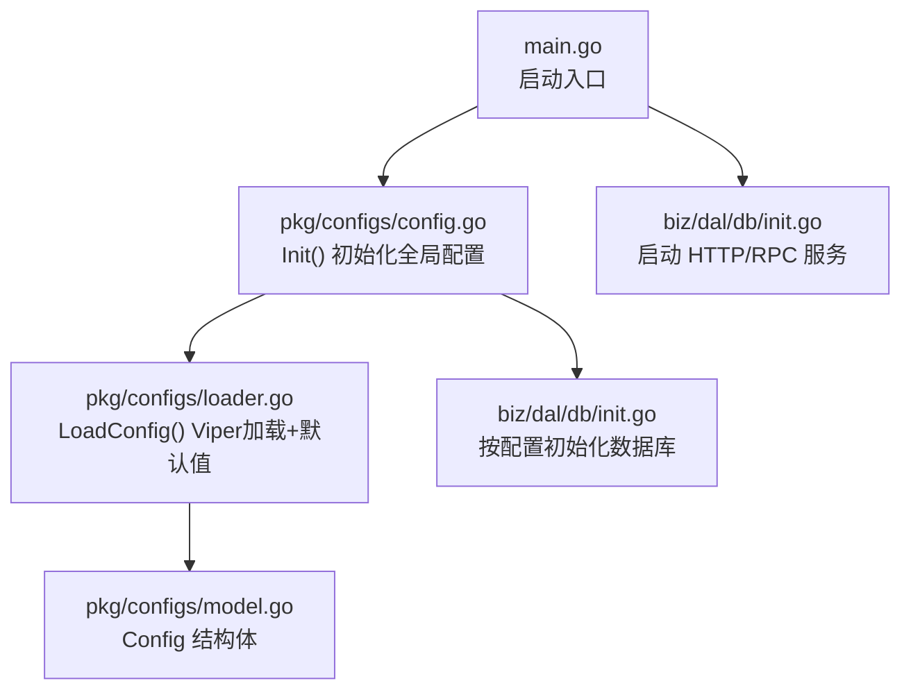
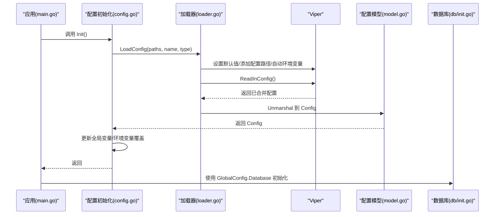
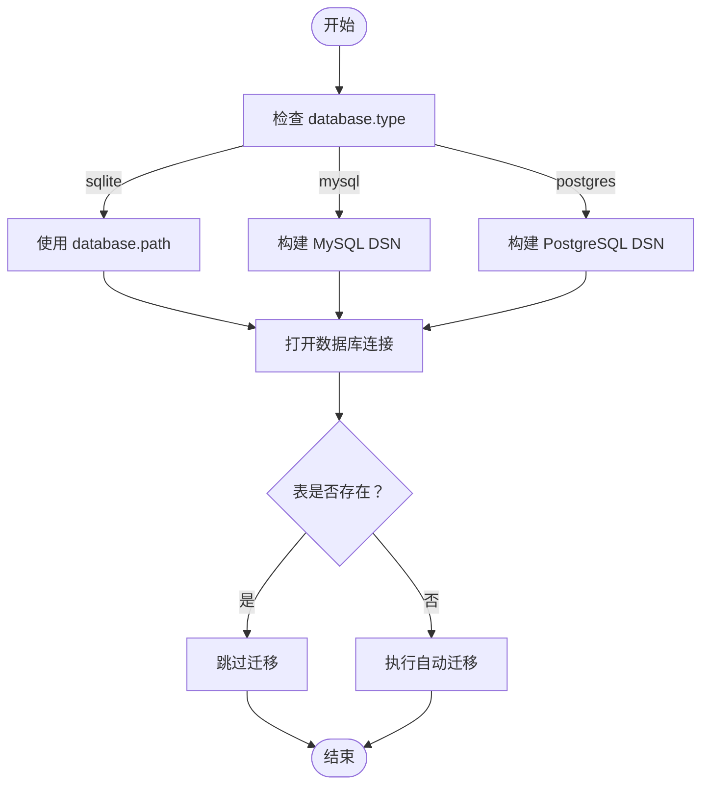
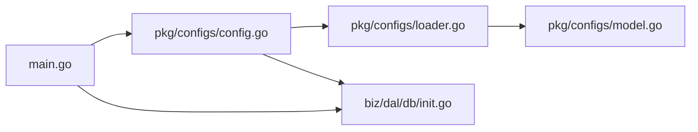

# 应用配置

<cite>
**本文引用的文件**
- [conf/config.yaml](file://conf/config.yaml)
- [deploy/config.yaml](file://deploy/config.yaml)
- [deploy/.env.example](file://deploy/.env.example)
- [deploy/CONFIG_GUIDE.md](file://deploy/CONFIG_GUIDE.md)
- [pkg/configs/config.go](file://pkg/configs/config.go)
- [pkg/configs/loader.go](file://pkg/configs/loader.go)
- [pkg/configs/model.go](file://pkg/configs/model.go)
- [main.go](file://main.go)
- [biz/dal/db/init.go](file://biz/dal/db/init.go)
</cite>

## 目录
1. [简介](#简介)
2. [项目结构](#项目结构)
3. [核心组件](#核心组件)
4. [架构总览](#架构总览)
5. [详细组件分析](#详细组件分析)
6. [依赖关系分析](#依赖关系分析)
7. [性能考量](#性能考量)
8. [故障排查指南](#故障排查指南)
9. [结论](#结论)
10. [附录](#附录)

## 简介
本文件面向运维与开发人员，系统性说明应用配置体系，包括：
- config.yaml 的完整结构与各配置项含义、默认值、取值范围与示例
- 服务器端口、RPC 服务、数据库连接、Webhook 等配置的设置方法
- 配置加载顺序与优先级机制（文件与环境变量）
- 配置验证规则与错误处理方式
- 环境变量覆盖配置的方法与最佳实践
- 提供完整配置模板与常见场景示例

## 项目结构
配置相关的核心位置与职责如下：
- 配置文件
  - 运行时配置：conf/config.yaml（实际运行使用的默认配置）
  - 参考模板：deploy/config.yaml（更详细的注释与示例）
- 配置加载与模型
  - pkg/configs/loader.go：Viper 配置加载、默认值设定、环境变量映射
  - pkg/configs/model.go：配置结构体定义
  - pkg/configs/config.go：全局配置初始化与环境变量覆盖
- 应用入口
  - main.go：启动时调用配置初始化，并按配置启动 HTTP/RPC 服务
- 数据库初始化
  - biz/dal/db/init.go：根据配置选择数据库驱动并建立连接

图表来源
- [main.go](file://main.go#L115-L134)
- [pkg/configs/config.go](file://pkg/configs/config.go#L18-L42)
- [pkg/configs/loader.go](file://pkg/configs/loader.go#L9-L45)
- [pkg/configs/model.go](file://pkg/configs/model.go#L3-L34)
- [biz/dal/db/init.go](file://biz/dal/db/init.go#L18-L71)

章节来源
- [main.go](file://main.go#L115-L134)
- [pkg/configs/config.go](file://pkg/configs/config.go#L18-L42)
- [pkg/configs/loader.go](file://pkg/configs/loader.go#L9-L45)
- [pkg/configs/model.go](file://pkg/configs/model.go#L3-L34)
- [biz/dal/db/init.go](file://biz/dal/db/init.go#L18-L71)

## 核心组件
- 配置模型（Config）：包含 server、rpc、database、webhook 四个顶层分组
- 加载器（LoadConfig）：基于 Viper 从多个路径读取配置，设置默认值，自动映射环境变量
- 初始化（Init）：加载配置到全局变量，同时兼容旧版全局变量与环境变量覆盖
- 应用使用：main.go 依据 GlobalConfig 启动 HTTP/RPC 服务；db 初始化依据 GlobalConfig.Database 建立数据库连接

章节来源
- [pkg/configs/model.go](file://pkg/configs/model.go#L3-L34)
- [pkg/configs/loader.go](file://pkg/configs/loader.go#L9-L45)
- [pkg/configs/config.go](file://pkg/configs/config.go#L18-L42)
- [main.go](file://main.go#L136-L175)
- [biz/dal/db/init.go](file://biz/dal/db/init.go#L18-L71)

## 架构总览
配置加载与使用的关键流程如下：

图表来源
- [main.go](file://main.go#L115-L134)
- [pkg/configs/config.go](file://pkg/configs/config.go#L18-L42)
- [pkg/configs/loader.go](file://pkg/configs/loader.go#L9-L45)
- [pkg/configs/model.go](file://pkg/configs/model.go#L3-L34)
- [biz/dal/db/init.go](file://biz/dal/db/init.go#L18-L71)

## 详细组件分析

### 配置文件结构与字段说明
- server
  - 字段：port（整数）
  - 默认值：8080
  - 说明：HTTP 服务监听端口
- rpc
  - 字段：port（整数）
  - 默认值：8888
  - 说明：RPC 服务监听端口
- database
  - 字段：type（字符串），可选值：sqlite、mysql、postgres
  - 字段：path（字符串，仅 sqlite 有效）
  - 字段：host、port、user、password、dbname（仅 mysql/postgres 有效）
  - 字段：dsn（字符串，可选，覆盖 host/port/user/password/dbname 组合生成的 DSN）
  - 默认值：type=sqlite，path=git_sync.db
  - 说明：支持三种数据库类型；若提供 dsn 将优先使用
- webhook
  - 字段：secret（字符串）
  - 字段：rate_limit（整数）
  - 字段：ip_whitelist（字符串数组）
  - 默认值：secret=my-secret-key，rate_limit=100，ip_whitelist=[]
  - 说明：Webhook 安全与访问控制

章节来源
- [pkg/configs/model.go](file://pkg/configs/model.go#L10-L33)
- [pkg/configs/loader.go](file://pkg/configs/loader.go#L19-L26)
- [conf/config.yaml](file://conf/config.yaml#L1-L25)
- [deploy/config.yaml](file://deploy/config.yaml#L3-L55)

### 配置加载顺序与优先级
- 配置文件搜索路径（按顺序查找）：当前目录、./conf、../conf
- 默认值：在加载器中集中设置，确保未配置时有合理默认
- 环境变量覆盖：启用 AutomaticEnv 后，Viper 会自动将环境变量映射到配置键
- 旧版环境变量兼容：config.go 中对特定旧变量进行手动覆盖
- 未找到配置文件：记录提示并使用默认值

章节来源
- [pkg/configs/config.go](file://pkg/configs/config.go#L18-L42)
- [pkg/configs/loader.go](file://pkg/configs/loader.go#L15-L37)

### 环境变量覆盖与最佳实践
- 支持的环境变量映射（示例）：
  - APP_PORT -> server.port
  - WEBHOOK_SECRET -> webhook.secret
  - DB_TYPE -> database.type
  - DB_PATH -> database.path
  - DB_HOST/DB_PORT/DB_NAME/DB_USER/DB_PASSWORD -> database.host/port/user/password/dbname
- 最佳实践：
  - 敏感信息（如数据库密码）通过环境变量注入，避免提交到代码库
  - 生产环境建议使用 mysql/postgres 并关闭 debug
  - 开发环境可使用 sqlite，便于快速启动

章节来源
- [deploy/.env.example](file://deploy/.env.example#L1-L21)
- [deploy/CONFIG_GUIDE.md](file://deploy/CONFIG_GUIDE.md#L91-L99)
- [pkg/configs/config.go](file://pkg/configs/config.go#L33-L41)

### 配置验证规则与错误处理
- 验证规则（由模型与默认值共同约束）：
  - server.port、rpc.port：必须为整数
  - database.type：必须为 sqlite/mysql/postgres
  - database.path：仅在 sqlite 时有效
  - database.dsn：若提供则覆盖 host/port/user/password/dbname 组合
  - webhook.secret：字符串；rate_limit：非负整数；ip_whitelist：字符串列表
- 错误处理：
  - 读取配置文件失败且非“文件不存在”时返回错误
  - 解析配置到结构体失败时返回错误
  - 数据库连接失败时直接致命错误

章节来源
- [pkg/configs/model.go](file://pkg/configs/model.go#L10-L33)
- [pkg/configs/loader.go](file://pkg/configs/loader.go#L31-L42)
- [biz/dal/db/init.go](file://biz/dal/db/init.go#L49-L52)

### 服务器端口配置
- HTTP 服务器端口：来自 server.port，默认 8080
- 启动逻辑：main.go 读取 GlobalConfig.Server.Port 并绑定监听
- 示例参考：conf/config.yaml 与 deploy/config.yaml

章节来源
- [main.go](file://main.go#L136-L152)
- [conf/config.yaml](file://conf/config.yaml#L1-L2)
- [deploy/config.yaml](file://deploy/config.yaml#L4-L7)

### RPC 服务配置
- RPC 服务器端口：来自 rpc.port，默认 8888
- 启动逻辑：main.go 读取 GlobalConfig.Rpc.Port 并创建 TCP 地址
- 示例参考：conf/config.yaml 与 deploy/config.yaml

章节来源
- [main.go](file://main.go#L154-L175)
- [conf/config.yaml](file://conf/config.yaml#L4-L5)
- [deploy/config.yaml](file://deploy/config.yaml#L50-L55)

### 数据库连接配置
- 支持类型：sqlite、mysql、postgres
- 选择逻辑：
  - sqlite：使用 database.path（默认 git_sync.db）
  - mysql/postgres：优先使用 database.dsn；若未提供，则由 host/port/user/password/dbname 组合生成 DSN
- 初始化流程：db/init.go 根据 GlobalConfig.Database 选择 Dialector 并建立连接，随后执行迁移或跳过

图表来源
- [biz/dal/db/init.go](file://biz/dal/db/init.go#L18-L71)
- [pkg/configs/model.go](file://pkg/configs/model.go#L18-L27)

章节来源
- [biz/dal/db/init.go](file://biz/dal/db/init.go#L18-L71)
- [pkg/configs/model.go](file://pkg/configs/model.go#L18-L27)

### Webhook 配置
- 字段：secret、rate_limit、ip_whitelist
- 默认值：secret=my-secret-key，rate_limit=100，ip_whitelist=[]
- 说明：secret 用于校验签名；rate_limit 控制每分钟请求数；ip_whitelist 为空时表示不限制来源 IP
- 示例参考：conf/config.yaml 与 deploy/config.yaml

章节来源
- [conf/config.yaml](file://conf/config.yaml#L21-L24)
- [deploy/config.yaml](file://deploy/config.yaml#L31-L44)
- [pkg/configs/model.go](file://pkg/configs/model.go#L29-L33)

### 配置模板与常见场景
- 完整模板参考：deploy/config.yaml（含注释与示例）
- 常见场景示例：
  - 开发环境（SQLite）：server.port=8080，database.type=sqlite，database.path=相对或绝对路径
  - 生产环境（MySQL）：database.type=mysql，database.host/database.port/database.user/database.password/database.dbname 均需配置，或提供 dsn
  - Webhook 安全加固：修改 webhook.secret，必要时配置 ip_whitelist

章节来源
- [deploy/config.yaml](file://deploy/config.yaml#L1-L55)
- [deploy/CONFIG_GUIDE.md](file://deploy/CONFIG_GUIDE.md#L1-L99)

## 依赖关系分析
- main.go 依赖全局配置（GlobalConfig）来启动 HTTP/RPC 服务
- db/init.go 依赖 GlobalConfig.Database 来选择数据库驱动与连接参数
- config.go 作为配置入口，负责加载与环境变量覆盖
- loader.go 通过 Viper 提供统一的配置加载与默认值管理

图表来源
- [main.go](file://main.go#L115-L134)
- [pkg/configs/config.go](file://pkg/configs/config.go#L18-L42)
- [pkg/configs/loader.go](file://pkg/configs/loader.go#L9-L45)
- [pkg/configs/model.go](file://pkg/configs/model.go#L3-L34)
- [biz/dal/db/init.go](file://biz/dal/db/init.go#L18-L71)

章节来源
- [main.go](file://main.go#L115-L134)
- [pkg/configs/config.go](file://pkg/configs/config.go#L18-L42)
- [pkg/configs/loader.go](file://pkg/configs/loader.go#L9-L45)
- [pkg/configs/model.go](file://pkg/configs/model.go#L3-L34)
- [biz/dal/db/init.go](file://biz/dal/db/init.go#L18-L71)

## 性能考量
- 配置加载仅在应用启动阶段执行一次，开销极小
- 数据库连接在应用启动时建立，后续复用连接池
- Webhook 速率限制与 IP 白名单有助于降低异常流量带来的压力

## 故障排查指南
- 配置文件未找到
  - 现象：记录提示并使用默认值
  - 处理：确认配置文件路径与命名，或提供环境变量覆盖
- 配置解析失败
  - 现象：返回解析错误
  - 处理：检查配置格式与字段类型（如端口是否为整数）
- 数据库连接失败
  - 现象：致命错误并退出
  - 处理：核对 database.type 与 host/port/user/password/dbname 或 dsn；确认网络连通性与权限
- 端口冲突
  - 现象：HTTP/RPC 服务启动失败
  - 处理：调整 server.port 或 rpc.port

章节来源
- [pkg/configs/loader.go](file://pkg/configs/loader.go#L31-L42)
- [biz/dal/db/init.go](file://biz/dal/db/init.go#L49-L52)
- [main.go](file://main.go#L136-L175)

## 结论
本配置体系以 Viper 为核心，结合默认值与环境变量覆盖，提供了灵活、可维护的配置管理能力。通过清晰的分层设计与严格的字段约束，既满足开发环境的便捷性，也兼顾生产环境的安全与稳定性。建议在生产环境中优先采用环境变量注入敏感信息，并结合数据库 DSN 或标准字段组合实现稳定的连接配置。

## 附录
- 配置文件参考
  - 运行时配置：conf/config.yaml
  - 详细模板：deploy/config.yaml
  - 环境变量示例：deploy/.env.example
  - 配置指南：deploy/CONFIG_GUIDE.md
- 关键实现文件
  - 配置模型：pkg/configs/model.go
  - 加载器：pkg/configs/loader.go
  - 初始化：pkg/configs/config.go
  - 应用入口：main.go
  - 数据库初始化：biz/dal/db/init.go