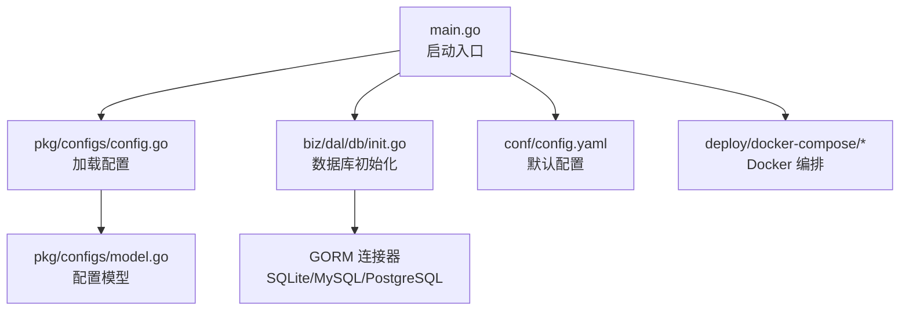
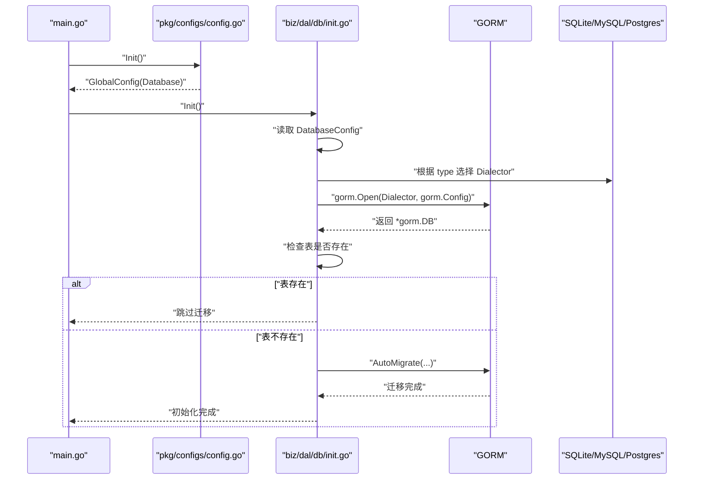
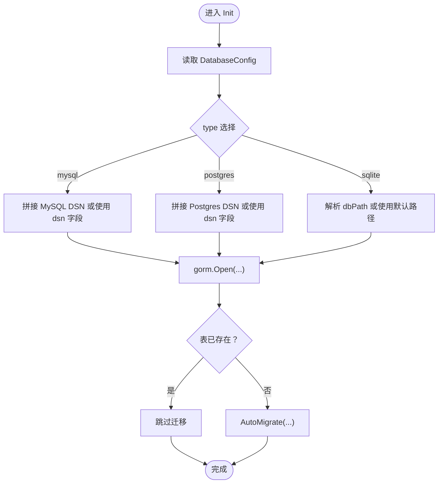
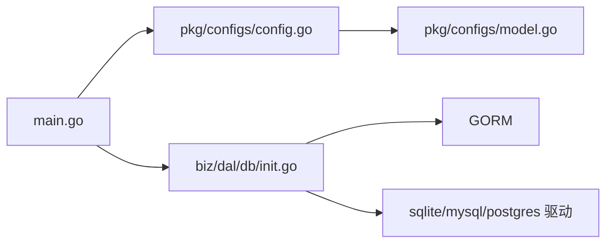

# 数据库配置

<cite>
**本文引用的文件**
- [conf/config.yaml](file://conf/config.yaml)
- [pkg/configs/model.go](file://pkg/configs/model.go)
- [pkg/configs/config.go](file://pkg/configs/config.go)
- [biz/dal/db/init.go](file://biz/dal/db/init.go)
- [deploy/docker-compose/mysql/docker-compose.yml](file://deploy/docker-compose/mysql/docker-compose.yml)
- [deploy/docker-compose/postgres/docker-compose.yml](file://deploy/docker-compose/postgres/docker-compose.yml)
- [deploy/docker-compose/sqlite/docker-compose.yml](file://deploy/docker-compose/sqlite/docker-compose.yml)
- [deploy/CONFIG_GUIDE.md](file://deploy/CONFIG_GUIDE.md)
- [deploy/README.md](file://deploy/README.md)
- [main.go](file://main.go)
</cite>

## 目录
1. [简介](#简介)
2. [项目结构](#项目结构)
3. [核心组件](#核心组件)
4. [架构总览](#架构总览)
5. [详细组件分析](#详细组件分析)
6. [依赖关系分析](#依赖关系分析)
7. [性能考虑与调优](#性能考虑与调优)
8. [故障排除指南](#故障排除指南)
9. [结论](#结论)
10. [附录](#附录)

## 简介
本文件面向数据库配置与运维人员，系统性说明本项目支持的数据库类型（SQLite、MySQL、PostgreSQL）及其配置方法；解释连接参数（主机、端口、用户名、密码、数据库名等）；提供 Docker Compose 部署示例与数据持久化要点；说明数据库迁移与版本管理机制；对比三种数据库的特性差异与选型建议；并给出常见连接问题的诊断步骤。

## 项目结构
围绕数据库配置的关键文件与目录如下：
- 配置文件与模型
  - 应用配置：conf/config.yaml
  - 配置模型与加载：pkg/configs/model.go、pkg/configs/config.go
- 数据库初始化与驱动
  - 初始化入口：biz/dal/db/init.go
- 部署与编排
  - MySQL 编排：deploy/docker-compose/mysql/docker-compose.yml
  - PostgreSQL 编排：deploy/docker-compose/postgres/docker-compose.yml
  - SQLite 编排：deploy/docker-compose/sqlite/docker-compose.yml
- 配置说明与部署指南
  - 配置说明：deploy/CONFIG_GUIDE.md
  - 部署指南：deploy/README.md
- 启动流程
  - 入口程序：main.go（负责加载配置与初始化数据库）

图表来源
- [main.go](file://main.go#L115-L134)
- [pkg/configs/config.go](file://pkg/configs/config.go#L18-L42)
- [pkg/configs/model.go](file://pkg/configs/model.go#L3-L27)
- [biz/dal/db/init.go](file://biz/dal/db/init.go#L18-L71)
- [conf/config.yaml](file://conf/config.yaml#L7-L19)
- [deploy/docker-compose/mysql/docker-compose.yml](file://deploy/docker-compose/mysql/docker-compose.yml#L1-L50)
- [deploy/docker-compose/postgres/docker-compose.yml](file://deploy/docker-compose/postgres/docker-compose.yml#L1-L49)
- [deploy/docker-compose/sqlite/docker-compose.yml](file://deploy/docker-compose/sqlite/docker-compose.yml#L1-L30)

章节来源
- [main.go](file://main.go#L115-L134)
- [pkg/configs/config.go](file://pkg/configs/config.go#L18-L42)
- [pkg/configs/model.go](file://pkg/configs/model.go#L3-L27)
- [biz/dal/db/init.go](file://biz/dal/db/init.go#L18-L71)
- [conf/config.yaml](file://conf/config.yaml#L7-L19)
- [deploy/docker-compose/mysql/docker-compose.yml](file://deploy/docker-compose/mysql/docker-compose.yml#L1-L50)
- [deploy/docker-compose/postgres/docker-compose.yml](file://deploy/docker-compose/postgres/docker-compose.yml#L1-L49)
- [deploy/docker-compose/sqlite/docker-compose.yml](file://deploy/docker-compose/sqlite/docker-compose.yml#L1-L30)
- [deploy/CONFIG_GUIDE.md](file://deploy/CONFIG_GUIDE.md#L21-L54)
- [deploy/README.md](file://deploy/README.md#L23-L48)

## 核心组件
- 配置模型（DatabaseConfig）
  - 字段：type、dsn、path、host、port、user、password、dbname
  - 支持三种数据库类型：sqlite、mysql、postgres
- 配置加载
  - 从 conf/config.yaml 加载默认配置
  - 支持通过环境变量覆盖敏感字段（如 DB_PATH）
- 数据库初始化
  - 根据配置选择对应 Dialector
  - 自动迁移（AutoMigrate）创建或跳过已存在的表
  - 连接失败时记录致命错误并终止进程

章节来源
- [pkg/configs/model.go](file://pkg/configs/model.go#L18-L27)
- [pkg/configs/config.go](file://pkg/configs/config.go#L18-L42)
- [biz/dal/db/init.go](file://biz/dal/db/init.go#L18-L71)
- [conf/config.yaml](file://conf/config.yaml#L7-L19)

## 架构总览
数据库层采用 GORM 抽象与具体驱动解耦，通过配置切换底层实现。初始化流程在应用启动阶段完成，确保服务可用前数据库已就绪。

图表来源
- [main.go](file://main.go#L115-L134)
- [pkg/configs/config.go](file://pkg/configs/config.go#L18-L42)
- [biz/dal/db/init.go](file://biz/dal/db/init.go#L18-L71)

## 详细组件分析

### 配置模型与加载
- 配置模型
  - DatabaseConfig 提供统一的数据库配置字段集合，便于在不同部署方式下复用
- 加载逻辑
  - 从 conf/config.yaml 读取默认值
  - 通过环境变量覆盖敏感字段（例如 DB_PATH），提升安全性
- 配置项说明
  - type：数据库类型（sqlite、mysql、postgres）
  - dsn：自定义连接串（优先级高于 host/port/user 等拆分字段）
  - path：SQLite 文件路径（默认 git_sync.db）
  - host/port/user/password/dbname：MySQL/Postgres 连接参数

章节来源
- [pkg/configs/model.go](file://pkg/configs/model.go#L18-L27)
- [pkg/configs/config.go](file://pkg/configs/config.go#L18-L42)
- [conf/config.yaml](file://conf/config.yaml#L7-L19)
- [deploy/CONFIG_GUIDE.md](file://deploy/CONFIG_GUIDE.md#L21-L54)

### 数据库初始化与迁移
- 初始化流程
  - 依据 type 选择 Dialector
  - 若未提供 dsn，则按类型拼接默认 DSN
  - 使用 gorm.Open 建立连接
  - 通过 Migrator 检测表是否存在，若存在则跳过迁移，否则执行 AutoMigrate
- 迁移范围
  - 涉及 Repo、SyncTask、SyncRun、AuditLog、SystemConfig、CommitStat 等模型
- 错误处理
  - 连接失败或迁移失败均记录致命错误并终止进程

图表来源
- [biz/dal/db/init.go](file://biz/dal/db/init.go#L18-L71)

章节来源
- [biz/dal/db/init.go](file://biz/dal/db/init.go#L18-L71)

### Docker Compose 部署与参数映射
- MySQL
  - 容器：mysql:8.0
  - 端口映射：3306
  - 环境变量：DB_TYPE、DB_HOST、DB_PORT、DB_USER、DB_PASSWORD、DB_NAME
  - 数据持久化：命名卷 mysql_data
- PostgreSQL
  - 容器：postgres:15-alpine
  - 端口映射：5432
  - 环境变量：DB_TYPE、DB_HOST、DB_PORT、DB_USER、DB_PASSWORD、DB_NAME
  - 数据持久化：命名卷 postgres_data
- SQLite
  - 环境变量：DB_TYPE=sqlite、DB_PATH
  - 数据持久化：挂载 ./data 到 /app/data
- 共同点
  - 应用容器暴露 8080（API）、8888（RPC）
  - 可选挂载 ./repos 存放仓库数据
  - SSH 密钥可只读挂载 ~/.ssh

章节来源
- [deploy/docker-compose/mysql/docker-compose.yml](file://deploy/docker-compose/mysql/docker-compose.yml#L1-L50)
- [deploy/docker-compose/postgres/docker-compose.yml](file://deploy/docker-compose/postgres/docker-compose.yml#L1-L49)
- [deploy/docker-compose/sqlite/docker-compose.yml](file://deploy/docker-compose/sqlite/docker-compose.yml#L1-L30)
- [deploy/README.md](file://deploy/README.md#L23-L48)

### 不同数据库的连接参数与差异
- SQLite
  - 参数：type=sqlite、path（文件路径）
  - 特点：无需网络、零配置、适合开发/单机
- MySQL
  - 参数：type=mysql、host、port、user、password、dbname、可选 dsn
  - 特点：成熟稳定、生态丰富、适合生产
- PostgreSQL
  - 参数：type=postgres、host、port、user、password、dbname、可选 dsn
  - 特点：功能强、ACID 完备、适合复杂查询与高并发

章节来源
- [conf/config.yaml](file://conf/config.yaml#L7-L19)
- [pkg/configs/model.go](file://pkg/configs/model.go#L18-L27)
- [deploy/CONFIG_GUIDE.md](file://deploy/CONFIG_GUIDE.md#L21-L54)

### 数据库迁移与版本管理
- 迁移触发条件
  - 若检测到关键表已存在，则跳过迁移
  - 否则对指定模型执行 AutoMigrate
- 迁移范围
  - Repo、SyncTask、SyncRun、AuditLog、SystemConfig、CommitStat
- 版本管理建议
  - 本项目未集成专用迁移工具（如 Flyway/Vale），AutoMigrate 作为内置迁移机制
  - 生产建议结合外部工具进行受控迁移与回滚

章节来源
- [biz/dal/db/init.go](file://biz/dal/db/init.go#L54-L71)

## 依赖关系分析
- 组件耦合
  - main.go 依赖配置加载与数据库初始化
  - 数据库初始化依赖配置模型与 GORM 驱动
- 外部依赖
  - GORM 及其驱动（sqlite/mysql/postgres）
  - 配置加载依赖 viper/mapstructure（由 go.mod 可见间接依赖）

图表来源
- [main.go](file://main.go#L115-L134)
- [pkg/configs/config.go](file://pkg/configs/config.go#L18-L42)
- [pkg/configs/model.go](file://pkg/configs/model.go#L3-L27)
- [biz/dal/db/init.go](file://biz/dal/db/init.go#L10-L14)

章节来源
- [main.go](file://main.go#L115-L134)
- [pkg/configs/config.go](file://pkg/configs/config.go#L18-L42)
- [pkg/configs/model.go](file://pkg/configs/model.go#L3-L27)
- [biz/dal/db/init.go](file://biz/dal/db/init.go#L10-L14)

## 性能考虑与调优
- 连接池与 GORM 配置
  - 当前初始化使用默认 gorm.Config{}，未显式设置连接池参数
  - 建议在生产环境为 MySQL/PostgreSQL 显式配置连接池（最大连接数、空闲数、生命周期等），以提升吞吐与稳定性
- 迁移与启动时间
  - AutoMigrate 在首次启动时可能带来延迟；可通过预建表或外部迁移工具缩短启动时间
- 端口与网络
  - MySQL/PGSQL 建议内网访问与最小权限账号，避免暴露公网端口
- 日志与可观测性
  - 生产关闭 debug 模式，减少日志开销；必要时启用慢查询日志与连接数监控

[本节为通用指导，不直接分析具体文件]

## 故障排除指南
- 启动即退出（连接失败）
  - 检查数据库类型与连接参数是否匹配（host/port/user/password/dbname/dsn）
  - 确认数据库服务已就绪（Docker Compose 已启动目标容器）
  - 查看应用日志定位“failed to connect database”错误
- 迁移失败
  - 确认数据库用户具备 DDL 权限
  - 如需跳过迁移，可先手动创建关键表后再启动
- 环境变量覆盖无效
  - 确认环境变量名正确（如 DB_PATH），并在容器启动前注入
- Docker 挂载问题
  - SQLite 数据持久化需确认 ./data 卷挂载成功
  - SSH 密钥挂载需确保宿主机路径存在且权限正确

章节来源
- [biz/dal/db/init.go](file://biz/dal/db/init.go#L50-L52)
- [deploy/README.md](file://deploy/README.md#L85-L98)
- [deploy/docker-compose/sqlite/docker-compose.yml](file://deploy/docker-compose/sqlite/docker-compose.yml#L16-L25)

## 结论
本项目通过统一的配置模型与 GORM 驱动抽象，实现了对 SQLite、MySQL、PostgreSQL 的无缝切换。默认配置与 Docker Compose 提供了便捷的本地与开发环境部署路径；生产场景建议结合外部迁移工具与连接池配置，进一步提升可靠性与性能。

[本节为总结，不直接分析具体文件]

## 附录

### 配置项速查表
- 数据库类型：sqlite、mysql、postgres
- SQLite：path（文件路径）
- MySQL/PostgreSQL：host、port、user、password、dbname、dsn（可选）
- 环境变量覆盖：DB_TYPE、DB_HOST、DB_PORT、DB_USER、DB_PASSWORD、DB_NAME、DB_PATH

章节来源
- [conf/config.yaml](file://conf/config.yaml#L7-L19)
- [pkg/configs/model.go](file://pkg/configs/model.go#L18-L27)
- [deploy/CONFIG_GUIDE.md](file://deploy/CONFIG_GUIDE.md#L21-L54)