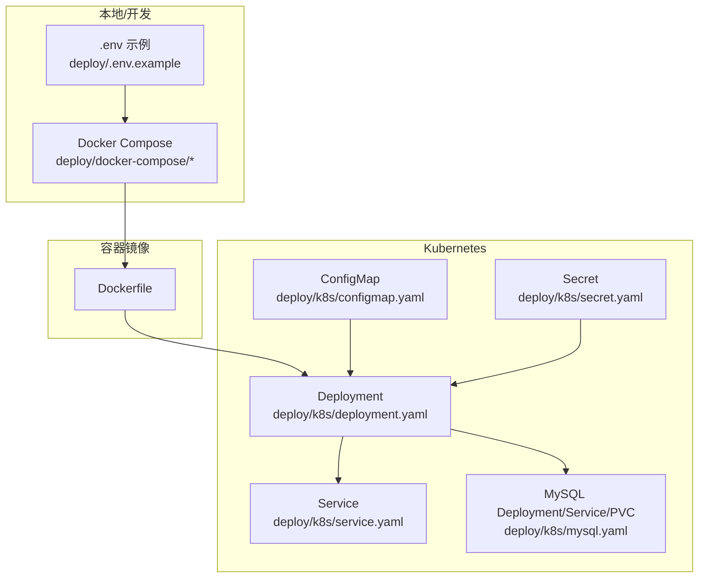
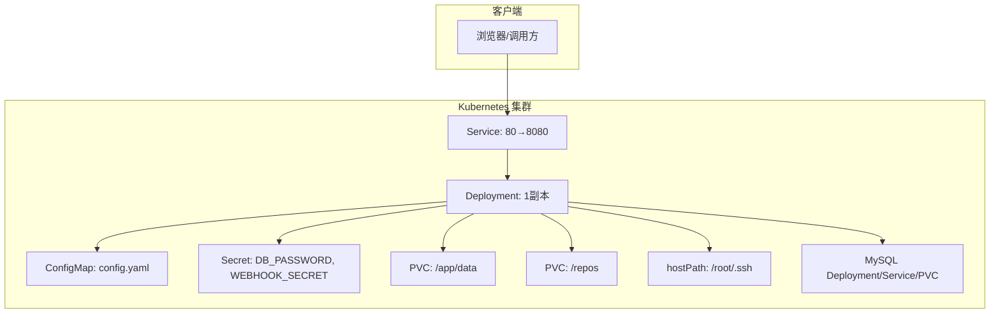
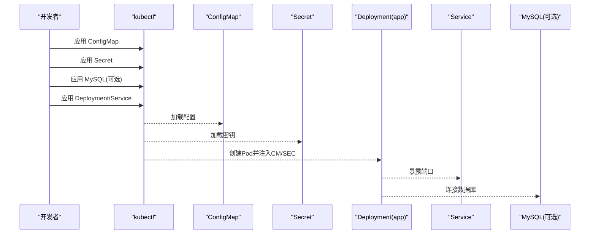
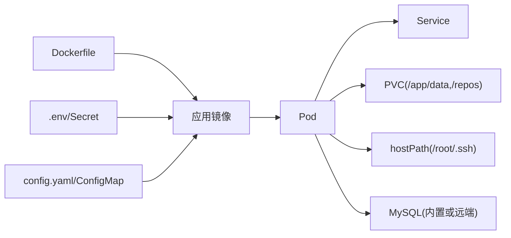

# 部署配置

<cite>
**本文引用的文件**
- [deploy/README.md](file://deploy/README.md)
- [DEPLOY.md](file://DEPLOY.md)
- [deploy/.env.example](file://deploy/.env.example)
- [Dockerfile](file://Dockerfile)
- [deploy/config.yaml](file://deploy/config.yaml)
- [deploy/CONFIG_GUIDE.md](file://deploy/CONFIG_GUIDE.md)
- [deploy/k8s/deployment.yaml](file://deploy/k8s/deployment.yaml)
- [deploy/k8s/service.yaml](file://deploy/k8s/service.yaml)
- [deploy/k8s/configmap.yaml](file://deploy/k8s/configmap.yaml)
- [deploy/k8s/secret.yaml](file://deploy/k8s/secret.yaml)
- [deploy/k8s/mysql.yaml](file://deploy/k8s/mysql.yaml)
- [deploy/docker-compose/mysql/docker-compose.yml](file://deploy/docker-compose/mysql/docker-compose.yml)
- [deploy/docker-compose/postgres/docker-compose.yml](file://deploy/docker-compose/postgres/docker-compose.yml)
- [deploy/docker-compose/sqlite/docker-compose.yml](file://deploy/docker-compose/sqlite/docker-compose.yml)
- [deploy/docker-compose/mysql/README.md](file://deploy/docker-compose/mysql/README.md)
- [deploy/docker-compose/postgres/README.md](file://deploy/docker-compose/postgres/README.md)
</cite>

## 目录
1. [简介](#简介)
2. [项目结构](#项目结构)
3. [核心组件](#核心组件)
4. [架构总览](#架构总览)
5. [详细组件分析](#详细组件分析)
6. [依赖关系分析](#依赖关系分析)
7. [性能与容量规划](#性能与容量规划)
8. [故障排除指南](#故障排除指南)
9. [结论](#结论)
10. [附录](#附录)

## 简介
本文件面向运维与开发团队，系统化梳理本项目的部署配置与最佳实践，涵盖以下主题：
- Docker 容器化与 Docker Compose 编排（多数据库后端）
- Kubernetes 部署（Deployment、Service、ConfigMap、Secret、PVC）
- 环境变量与 .env 示例及环境隔离策略
- 不同部署环境的配置差异与最佳实践
- CI/CD 集成与自动化部署思路
- 负载均衡、高可用与监控集成建议
- 故障排除与回滚策略
- 生产环境安全与性能优化建议

## 项目结构
与部署相关的关键目录与文件如下：
- 根镜像构建：Dockerfile
- 应用配置：deploy/config.yaml、deploy/CONFIG_GUIDE.md
- 环境变量：deploy/.env.example
- Docker Compose（多数据库后端）：deploy/docker-compose/{mysql,postgres,sqlite}/docker-compose.yml
- Kubernetes 清单：deploy/k8s/{deployment.yaml,service.yaml,configmap.yaml,secret.yaml,mysql.yaml}

图表来源
- [Dockerfile](file://Dockerfile#L1-L77)
- [deploy/docker-compose/mysql/docker-compose.yml](file://deploy/docker-compose/mysql/docker-compose.yml#L1-L50)
- [deploy/docker-compose/postgres/docker-compose.yml](file://deploy/docker-compose/postgres/docker-compose.yml#L1-L49)
- [deploy/docker-compose/sqlite/docker-compose.yml](file://deploy/docker-compose/sqlite/docker-compose.yml#L1-L30)
- [deploy/k8s/deployment.yaml](file://deploy/k8s/deployment.yaml#L1-L83)
- [deploy/k8s/service.yaml](file://deploy/k8s/service.yaml#L1-L14)
- [deploy/k8s/configmap.yaml](file://deploy/k8s/configmap.yaml#L1-L20)
- [deploy/k8s/secret.yaml](file://deploy/k8s/secret.yaml#L1-L11)
- [deploy/k8s/mysql.yaml](file://deploy/k8s/mysql.yaml#L1-L65)

章节来源
- [deploy/README.md](file://deploy/README.md#L1-L108)
- [DEPLOY.md](file://DEPLOY.md#L1-L83)

## 核心组件
- 应用容器镜像：基于多阶段构建，包含运行时依赖（git、openssh、证书、时区），默认暴露业务端口与RPC端口，内置前端静态资源与默认配置文件。
- 配置体系：通过 config.yaml 控制服务端口、数据库类型与连接、Webhook 安全策略、调试开关；通过环境变量覆盖敏感与动态配置。
- Docker Compose：提供 SQLite、MySQL、PostgreSQL 三种后端的编排模板，统一映射数据卷、SSH 密钥与仓库目录。
- Kubernetes：通过 ConfigMap 注入应用配置，通过 Secret 注入敏感信息，通过 PVC 持久化数据与仓库，通过 Service 暴露服务。

章节来源
- [Dockerfile](file://Dockerfile#L1-L77)
- [deploy/config.yaml](file://deploy/config.yaml#L1-L55)
- [deploy/CONFIG_GUIDE.md](file://deploy/CONFIG_GUIDE.md#L1-L99)
- [deploy/.env.example](file://deploy/.env.example#L1-L21)

## 架构总览
下图展示从容器到Kubernetes的部署视图，以及关键配置注入点与数据持久化路径。

图表来源
- [deploy/k8s/service.yaml](file://deploy/k8s/service.yaml#L1-L14)
- [deploy/k8s/deployment.yaml](file://deploy/k8s/deployment.yaml#L1-L83)
- [deploy/k8s/configmap.yaml](file://deploy/k8s/configmap.yaml#L1-L20)
- [deploy/k8s/secret.yaml](file://deploy/k8s/secret.yaml#L1-L11)
- [deploy/k8s/mysql.yaml](file://deploy/k8s/mysql.yaml#L1-L65)

## 详细组件分析

### Docker 容器化与镜像构建
- 多阶段构建：第一阶段安装构建依赖并编译二进制；第二阶段仅保留运行时依赖，体积更小。
- 运行时依赖：git、openssh-client、ca-certificates、tzdata，满足Git操作与HTTPS/SSH访问。
- 端口暴露：业务端口与RPC端口均对外暴露，便于调试与内部服务间通信。
- 默认配置：镜像内包含默认 config.yaml，可通过 ConfigMap 或挂载覆盖。
- 卷与权限：预创建 /app/data 与 /root/.ssh 目录并设置权限，确保数据与密钥读写。

章节来源
- [Dockerfile](file://Dockerfile#L1-L77)

### Docker Compose 编排（多数据库后端）
- 统一网络：所有服务加入同一桥接网络，容器间通过服务名互通。
- 端口映射：应用容器将业务端口与RPC端口映射至宿主机。
- 环境变量：通过 .env 注入 WEBHOOK_SECRET、DB_TYPE、DB_* 等，实现数据库类型与连接参数的灵活切换。
- 数据卷：
  - SQLite：将 ./data 映射到 /app/data，持久化数据库文件。
  - MySQL/PostgreSQL：将 ./repos 映射到 /repos，共享仓库目录。
  - SSH：将宿主机 ~/.ssh 映射到 /root/.ssh（只读），供Git访问私有仓库。
- 三套模板：
  - SQLite：适合本地开发与最小化部署。
  - MySQL：独立数据库容器，适合中等规模。
  - PostgreSQL：独立数据库容器，适合对事务与扩展性要求更高的场景。

章节来源
- [deploy/docker-compose/sqlite/docker-compose.yml](file://deploy/docker-compose/sqlite/docker-compose.yml#L1-L30)
- [deploy/docker-compose/mysql/docker-compose.yml](file://deploy/docker-compose/mysql/docker-compose.yml#L1-L50)
- [deploy/docker-compose/postgres/docker-compose.yml](file://deploy/docker-compose/postgres/docker-compose.yml#L1-L49)
- [DEPLOY.md](file://DEPLOY.md#L1-L83)

### Kubernetes 部署清单
- Deployment：
  - 使用 ConfigMap 注入 config.yaml，避免硬编码在镜像中。
  - 使用 Secret 注入数据库密码与 Webhook 密钥。
  - 挂载 PVC 到 /app/data 与 /repos，hostPath 挂载 /root/.ssh 以复用宿主机密钥。
  - 暴露业务端口与RPC端口。
- Service：
  - ClusterIP 暴露 80→8080，便于Ingress或集群内访问。
- ConfigMap：
  - 包含数据库连接（host、port、user、dbname）与基础配置，便于集中管理。
- Secret：
  - 存放敏感信息（如 DB_PASSWORD、WEBHOOK_SECRET），避免明文配置。
- 内置 MySQL（可选）：
  - 提供独立的 MySQL Deployment/Service/PVC，便于快速搭建开发/测试环境。

图表来源
- [deploy/k8s/deployment.yaml](file://deploy/k8s/deployment.yaml#L1-L83)
- [deploy/k8s/service.yaml](file://deploy/k8s/service.yaml#L1-L14)
- [deploy/k8s/configmap.yaml](file://deploy/k8s/configmap.yaml#L1-L20)
- [deploy/k8s/secret.yaml](file://deploy/k8s/secret.yaml#L1-L11)
- [deploy/k8s/mysql.yaml](file://deploy/k8s/mysql.yaml#L1-L65)

章节来源
- [deploy/k8s/deployment.yaml](file://deploy/k8s/deployment.yaml#L1-L83)
- [deploy/k8s/service.yaml](file://deploy/k8s/service.yaml#L1-L14)
- [deploy/k8s/configmap.yaml](file://deploy/k8s/configmap.yaml#L1-L20)
- [deploy/k8s/secret.yaml](file://deploy/k8s/secret.yaml#L1-L11)
- [deploy/k8s/mysql.yaml](file://deploy/k8s/mysql.yaml#L1-L65)

### 配置文件与环境变量
- config.yaml：
  - server.port：服务监听端口。
  - database.type/path/host/port/user/password/dbname/dsn：数据库配置，支持 SQLite/MySQL/PostgreSQL；推荐生产使用 DSN 或远程数据库。
  - webhook.secret/rate_limit/ip_whitelist：Webhook 安全与限流。
  - debug：调试模式开关。
  - rpc.port：RPC 服务端口。
- 环境变量优先级：
  - WEBHOOK_SECRET、DB_TYPE、DB_HOST、DB_PORT、DB_USER、DB_NAME、DB_PASSWORD、TZ 等通过 .env 或容器环境注入。
  - 在 Kubernetes 中，敏感配置通过 Secret 注入（如 CONFIG_DATABASE_PASSWORD 对应 DB_PASSWORD）。
- 环境隔离建议：
  - 开发：sqlite + debug=true
  - 测试：remote mysql/postgres + debug=false
  - 生产：remote mysql/postgres + debug=false + Secret 管理敏感信息

章节来源
- [deploy/config.yaml](file://deploy/config.yaml#L1-L55)
- [deploy/CONFIG_GUIDE.md](file://deploy/CONFIG_GUIDE.md#L1-L99)
- [deploy/.env.example](file://deploy/.env.example#L1-L21)

### 数据持久化与卷管理
- SQLite：通过 PVC 将 /app/data 挂载到持久卷，确保数据库文件持久化。
- 仓库目录：通过 PVC 将 /repos 挂载到持久卷，便于版本控制与备份。
- SSH 密钥：通过 hostPath 挂载 /root/.ssh（只读），确保容器内可访问私有仓库。
- 注意：hostPath 依赖节点路径存在，生产建议改用 Kubernetes Secret 或外部密钥管理工具。

章节来源
- [deploy/k8s/deployment.yaml](file://deploy/k8s/deployment.yaml#L36-L60)

### 环境变量与 .env 示例
- 关键变量：
  - APP_PORT、WEBHOOK_SECRET、TZ
  - DB_TYPE、DB_HOST、DB_PORT、DB_NAME、DB_USER、DB_PASSWORD
  - MYSQL_ROOT_PASSWORD（仅MySQL示例）
- 建议：
  - 将敏感信息放入 Secret/环境变量，不在 config.yaml 明文保存。
  - 不要将 .env 提交到版本库，使用 .gitignore 管控。

章节来源
- [deploy/.env.example](file://deploy/.env.example#L1-L21)
- [deploy/docker-compose/mysql/docker-compose.yml](file://deploy/docker-compose/mysql/docker-compose.yml#L11-L18)
- [deploy/docker-compose/postgres/docker-compose.yml](file://deploy/docker-compose/postgres/docker-compose.yml#L11-L17)
- [deploy/docker-compose/sqlite/docker-compose.yml](file://deploy/docker-compose/sqlite/docker-compose.yml#L11-L14)

### 不同部署环境的配置差异与最佳实践
- 开发环境（Docker Compose + SQLite）：
  - 快速启动，无需外部数据库。
  - 使用 .env 注入 WEBHOOK_SECRET，DB_TYPE=sqlite。
- 测试/预发布（Docker Compose + MySQL/PostgreSQL）：
  - 使用独立数据库容器，便于模拟生产环境。
  - 将敏感信息放入 Secret 或 .env。
- 生产环境（Kubernetes + 远程数据库）：
  - 使用 ConfigMap 注入非敏感配置，Secret 注入敏感配置。
  - 远端数据库（RDS/云数据库）+ PVC 持久化数据与仓库。
  - 避免使用 hostPath，采用 Secret/密钥管理工具。

章节来源
- [deploy/README.md](file://deploy/README.md#L101-L108)
- [deploy/docker-compose/mysql/README.md](file://deploy/docker-compose/mysql/README.md#L1-L21)
- [deploy/docker-compose/postgres/README.md](file://deploy/docker-compose/postgres/README.md#L1-L21)

### CI/CD 集成与自动化部署
- 镜像构建与推送：
  - 在 CI 中执行构建步骤，生成镜像并推送到镜像仓库。
- Kubernetes 部署：
  - 使用 kubectl apply 或 Helm/Kustomize 管理 ConfigMap/Secret/Deployment/Service。
  - 通过滚动更新策略实现零停机升级。
- Docker Compose 部署：
  - 在 CI 中执行 docker-compose up -d，结合卷与网络管理数据与网络。
- 安全与审计：
  - 将敏感信息注入 Secret，避免明文配置。
  - 使用只读卷与最小权限原则。

（本节为通用实践说明，不直接分析具体文件）

### 负载均衡、高可用与监控
- 负载均衡与高可用：
  - Kubernetes：使用 Service/Ingress 实现流量接入；Deployment 设置多副本并结合就绪/存活探针。
  - 数据库：使用远端高可用数据库（RDS/托管PG/MySQL）替代内置 MySQL。
- 监控与告警：
  - 指标：CPU/内存/磁盘/数据库连接数/请求延迟/错误率。
  - 日志：容器标准输出采集，结合集中式日志平台。
  - 健康检查：配置 liveness/readiness probes，结合HPA实现弹性伸缩。

（本节为通用实践说明，不直接分析具体文件）

## 依赖关系分析
- 镜像与运行时：
  - Dockerfile 定义构建与运行时依赖，影响镜像大小与启动时间。
- 配置与环境：
  - config.yaml 与 .env/Secret/ConfigMap 形成“配置链”，后者优先级更高。
- 数据与网络：
  - Docker Compose 与 Kubernetes 均通过卷与网络实现数据持久化与服务互通。
- 数据库：
  - SQLite：本地文件；MySQL/PostgreSQL：独立容器或远端数据库。

图表来源
- [Dockerfile](file://Dockerfile#L1-L77)
- [deploy/k8s/deployment.yaml](file://deploy/k8s/deployment.yaml#L1-L83)
- [deploy/k8s/service.yaml](file://deploy/k8s/service.yaml#L1-L14)
- [deploy/k8s/mysql.yaml](file://deploy/k8s/mysql.yaml#L1-L65)

章节来源
- [Dockerfile](file://Dockerfile#L1-L77)
- [deploy/k8s/deployment.yaml](file://deploy/k8s/deployment.yaml#L1-L83)

## 性能与容量规划
- 容器层：
  - 使用多阶段构建减小镜像体积，缩短拉取与启动时间。
  - 仅安装必要运行时依赖，减少攻击面。
- 数据库层：
  - 生产使用远端高可用数据库，避免内置数据库的单点风险。
  - 合理设置连接池与超时参数，避免并发峰值导致的连接耗尽。
- 存储层：
  - PVC 容量按数据增长与仓库数量预留冗余。
  - 分离 /app/data 与 /repos，便于独立扩容与备份。
- 网络与安全：
  - 限制 Webhook IP 白名单，设置合理速率限制。
  - 使用 Secret 管理密钥，避免明文配置。

（本节为通用实践说明，不直接分析具体文件）

## 故障排除指南
- Pod CrashLoopBackOff：
  - 检查日志：查看 Pod 日志定位启动失败原因。
  - 校验数据库连接：确认主机、端口、用户、密码正确，数据库服务已就绪。
- SSH 密钥无法使用：
  - hostPath 依赖节点存在 /root/.ssh；生产建议改为 Secret 挂载。
  - 确保密钥权限正确（容器内通常以 root 运行）。
- 配置未生效：
  - ConfigMap 更新后，Pod 通常需重启或等待 kubelet 同步。
- 数据库写入失败：
  - 检查 /app/data 挂载目录权限与磁盘空间。
- Git 操作异常：
  - 在 UI 设置中启用调试模式，查看详细日志输出。
- 时间与时区：
  - 如需调整时区，可在 .env 或容器环境变量中设置。

章节来源
- [deploy/README.md](file://deploy/README.md#L85-L98)
- [DEPLOY.md](file://DEPLOY.md#L78-L83)

## 结论
本项目提供了从本地开发到生产级部署的完整路径：Docker Compose 快速启动、Kubernetes 标准化编排、ConfigMap/Secret 管理配置与密钥、PVC 持久化数据与仓库。遵循本文档的环境隔离、安全与性能建议，可实现稳定、可观测、可扩展的交付体系。

## 附录

### 部署流程速查
- Docker Compose（SQLite/MySQL/PostgreSQL）：
  - 准备 .env 与目录（data、repos），启动对应 docker-compose.yml。
- Kubernetes：
  - 应用 ConfigMap/Secret，可选应用内置 MySQL，再应用 Deployment/Service。

章节来源
- [DEPLOY.md](file://DEPLOY.md#L10-L36)
- [deploy/README.md](file://deploy/README.md#L23-L48)
- [deploy/README.md](file://deploy/README.md#L66-L83)