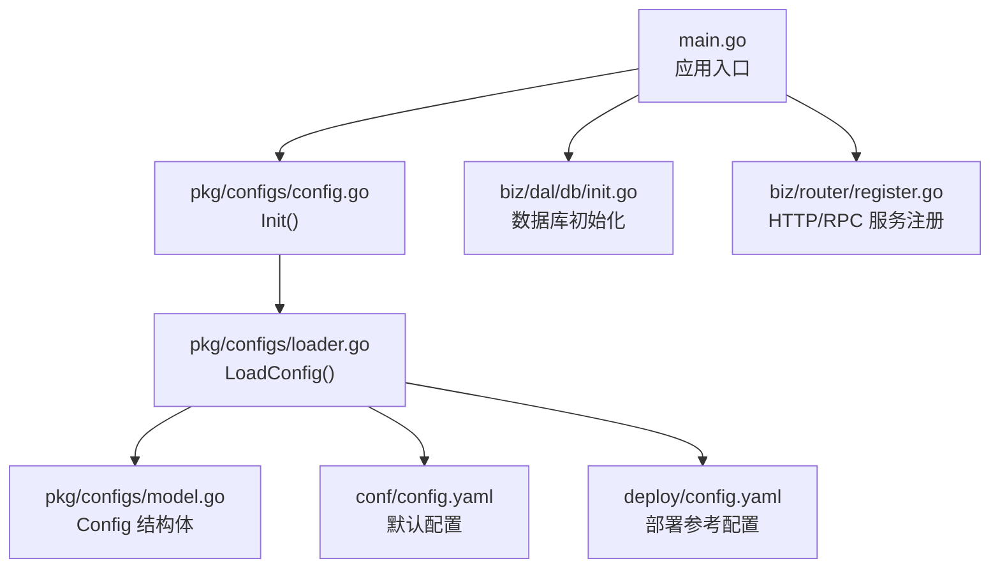
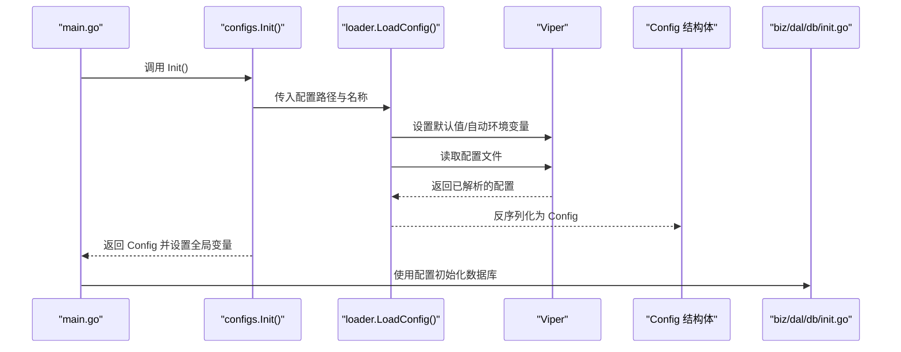
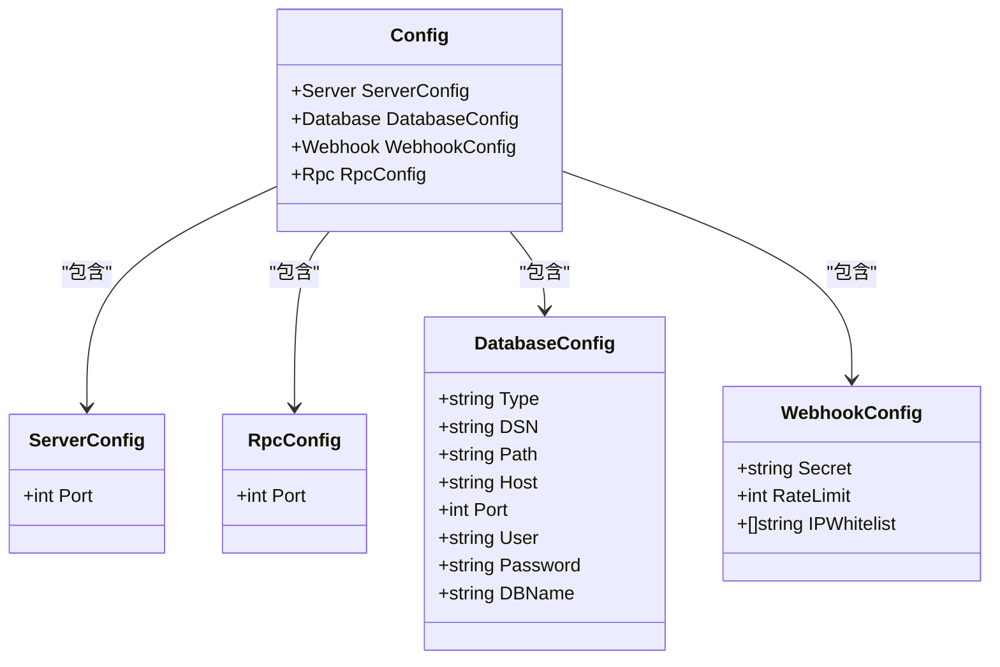

# 配置管理

<cite>
**本文引用的文件**
- [main.go](file://main.go)
- [pkg/configs/config.go](file://pkg/configs/config.go)
- [pkg/configs/loader.go](file://pkg/configs/loader.go)
- [pkg/configs/model.go](file://pkg/configs/model.go)
- [conf/config.yaml](file://conf/config.yaml)
- [deploy/config.yaml](file://deploy/config.yaml)
- [deploy/CONFIG_GUIDE.md](file://deploy/CONFIG_GUIDE.md)
- [deploy/README.md](file://deploy/README.md)
- [deploy/docker-compose/sqlite/docker-compose.yml](file://deploy/docker-compose/sqlite/docker-compose.yml)
- [deploy/docker-compose/mysql/docker-compose.yml](file://deploy/docker-compose/mysql/docker-compose.yml)
- [deploy/docker-compose/postgres/docker-compose.yml](file://deploy/docker-compose/postgres/docker-compose.yml)
- [deploy/k8s/configmap.yaml](file://deploy/k8s/configmap.yaml)
- [deploy/k8s/secret.yaml](file://deploy/k8s/secret.yaml)
- [deploy/k8s/deployment.yaml](file://deploy/k8s/deployment.yaml)
- [deploy/k8s/mysql.yaml](file://deploy/k8s/mysql.yaml)
</cite>

## 目录
1. [简介](#简介)
2. [项目结构](#项目结构)
3. [核心组件](#核心组件)
4. [架构总览](#架构总览)
5. [详细组件分析](#详细组件分析)
6. [依赖关系分析](#依赖关系分析)
7. [性能与连接池建议](#性能与连接池建议)
8. [故障排查指南](#故障排查指南)
9. [结论](#结论)
10. [附录](#附录)

## 简介
本文件系统性阐述本项目的配置管理方案，包括配置文件结构、环境变量支持、动态加载机制、多数据库支持（SQLite、MySQL、PostgreSQL）、Docker 与 Kubernetes 部署配置、配置验证与错误处理、以及配置热更新与运行时修改的可行性说明。目标是帮助开发者与运维人员快速理解并正确配置应用。

## 项目结构
配置相关的关键位置如下：
- 应用配置模型与加载逻辑位于 pkg/configs 下，负责解析 YAML、设置默认值、读取环境变量并反序列化为强类型配置对象。
- 默认配置样例位于 conf/config.yaml 与 deploy/config.yaml，分别用于开发与部署参考。
- 部署示例位于 deploy/docker-compose 与 deploy/k8s，展示如何在不同环境下注入配置与敏感信息。
- 启动入口 main.go 在初始化阶段调用配置初始化流程，随后将配置传递给各子系统。

图表来源
- [main.go](file://main.go#L115-L134)
- [pkg/configs/config.go](file://pkg/configs/config.go#L18-L42)
- [pkg/configs/loader.go](file://pkg/configs/loader.go#L9-L45)
- [pkg/configs/model.go](file://pkg/configs/model.go#L3-L34)
- [conf/config.yaml](file://conf/config.yaml#L1-L25)
- [deploy/config.yaml](file://deploy/config.yaml#L1-L55)

章节来源
- [main.go](file://main.go#L115-L134)
- [pkg/configs/config.go](file://pkg/configs/config.go#L1-L43)
- [pkg/configs/loader.go](file://pkg/configs/loader.go#L1-L46)
- [pkg/configs/model.go](file://pkg/configs/model.go#L1-L34)
- [conf/config.yaml](file://conf/config.yaml#L1-L25)
- [deploy/config.yaml](file://deploy/config.yaml#L1-L55)

## 核心组件
- 配置模型（Config）：包含 server、rpc、database、webhook 四个顶层配置段，字段覆盖端口、数据库类型与连接参数、Webhook 安全策略等。
- 加载器（LoadConfig）：使用 Viper 从多个路径查找配置文件，设置默认值，启用 AutomaticEnv 使环境变量自动覆盖配置，最终反序列化为 Config 对象。
- 初始化（Init）：在应用启动时调用加载器，将结果赋给全局配置对象，并同步到兼容性全局变量；同时支持通过环境变量对部分旧键进行覆盖。

章节来源
- [pkg/configs/model.go](file://pkg/configs/model.go#L3-L34)
- [pkg/configs/loader.go](file://pkg/configs/loader.go#L9-L45)
- [pkg/configs/config.go](file://pkg/configs/config.go#L18-L42)

## 架构总览
下图展示了配置从加载到使用的整体流程，以及在不同部署环境中的注入方式。

图表来源
- [main.go](file://main.go#L115-L134)
- [pkg/configs/config.go](file://pkg/configs/config.go#L18-L42)
- [pkg/configs/loader.go](file://pkg/configs/loader.go#L9-L45)
- [pkg/configs/model.go](file://pkg/configs/model.go#L3-L34)

## 详细组件分析

### 配置文件结构与选项
- server
  - port：HTTP 服务监听端口，默认值由加载器设置。
- rpc
  - port：RPC 服务监听端口，默认值由加载器设置。
- database
  - type：数据库类型，支持 sqlite、mysql、postgres。
  - path：SQLite 文件路径（type=sqlite 时有效）。
  - host/port/user/password/dbname：MySQL/PostgreSQL 连接参数。
  - dsn：自定义 DSN，若提供则覆盖 host/port/user/password/dbname 组合生成的 DSN。
- webhook
  - secret：Webhook 签名密钥。
  - rate_limit：每分钟请求上限。
  - ip_whitelist：允许访问 Webhook 的 IP 白名单列表。
- debug（部署参考配置中出现）
  - 控制调试模式开关（部署参考配置中出现）。

章节来源
- [pkg/configs/model.go](file://pkg/configs/model.go#L10-L33)
- [pkg/configs/loader.go](file://pkg/configs/loader.go#L19-L26)
- [conf/config.yaml](file://conf/config.yaml#L1-L25)
- [deploy/config.yaml](file://deploy/config.yaml#L4-L54)
- [deploy/CONFIG_GUIDE.md](file://deploy/CONFIG_GUIDE.md#L9-L87)

### 环境变量支持与动态加载机制
- 默认值：加载器在初始化时为关键字段设置默认值，避免缺失配置导致的启动失败。
- 自动环境变量覆盖：启用 AutomaticEnv 后，环境变量可直接覆盖同名配置项。
- 兼容性全局变量：Init 将部分配置同步到全局变量，以兼容旧代码；同时支持通过环境变量覆盖旧键（例如 WEBHOOK_SECRET、DB_PATH）。
- 配置文件查找路径：Init 内部指定多个可能的配置文件路径，便于在不同部署形态下定位配置。

章节来源
- [pkg/configs/loader.go](file://pkg/configs/loader.go#L19-L37)
- [pkg/configs/config.go](file://pkg/configs/config.go#L18-L42)

### 多数据库支持与连接配置
- SQLite
  - 通过 type=sqlite 与 path 指定数据库文件路径。
  - 示例：docker-compose/sqlite 场景中通过环境变量 DB_TYPE=sqlite 与 DB_PATH 指定文件路径。
- MySQL
  - 通过 type=mysql 与 host/port/user/password/dbname 组合配置；也可提供 dsn 覆盖。
  - 示例：docker-compose/mysql 场景中通过环境变量 DB_TYPE=mysql、DB_HOST、DB_PORT、DB_USER、DB_PASSWORD、DB_NAME 注入连接参数。
- PostgreSQL
  - 通过 type=postgres 与 host/port/user/password/dbname 组合配置；也可提供 dsn 覆盖。
  - 示例：docker-compose/postgres 场景中通过环境变量 DB_TYPE=postgres、DB_HOST、DB_PORT、DB_USER、DB_PASSWORD、DB_NAME 注入连接参数。

章节来源
- [pkg/configs/model.go](file://pkg/configs/model.go#L18-L27)
- [deploy/docker-compose/sqlite/docker-compose.yml](file://deploy/docker-compose/sqlite/docker-compose.yml#L11-L18)
- [deploy/docker-compose/mysql/docker-compose.yml](file://deploy/docker-compose/mysql/docker-compose.yml#L11-L18)
- [deploy/docker-compose/postgres/docker-compose.yml](file://deploy/docker-compose/postgres/docker-compose.yml#L11-L18)

### Docker 环境配置指南
- SQLite
  - 通过环境变量 DB_TYPE=sqlite 与 DB_PATH 指定数据库文件路径；可挂载数据卷实现持久化。
- MySQL
  - 通过环境变量 DB_TYPE=mysql、DB_HOST、DB_PORT、DB_USER、DB_PASSWORD、DB_NAME 注入连接参数；compose 中包含独立的 mysql 服务。
- PostgreSQL
  - 通过环境变量 DB_TYPE=postgres、DB_HOST、DB_PORT、DB_USER、DB_PASSWORD、DB_NAME 注入连接参数；compose 中包含独立的 postgres 服务。
- Webhook 密钥
  - 通过 WEBHOOK_SECRET 注入，支持在 compose 中使用环境变量或 .env 文件。

章节来源
- [deploy/docker-compose/sqlite/docker-compose.yml](file://deploy/docker-compose/sqlite/docker-compose.yml#L1-L30)
- [deploy/docker-compose/mysql/docker-compose.yml](file://deploy/docker-compose/mysql/docker-compose.yml#L1-L50)
- [deploy/docker-compose/postgres/docker-compose.yml](file://deploy/docker-compose/postgres/docker-compose.yml#L1-L49)
- [deploy/README.md](file://deploy/README.md#L49-L57)

### Kubernetes 环境配置指南
- ConfigMap
  - 通过 ConfigMap 提供基础配置（如 server、database、webhook），并在 Deployment 中挂载到 /app/conf/config.yaml。
- Secret
  - 通过 Secret 注入敏感信息（如数据库密码、Webhook 密钥），并通过 envFrom 注入到容器环境变量。
- Deployment
  - 挂载 ConfigMap、PVC、SSH 密钥等；通过环境变量覆盖数据库连接参数。
- Service
  - MySQL 场景中提供 Service 以便内部访问。

章节来源
- [deploy/k8s/configmap.yaml](file://deploy/k8s/configmap.yaml#L1-L20)
- [deploy/k8s/secret.yaml](file://deploy/k8s/secret.yaml#L1-L11)
- [deploy/k8s/deployment.yaml](file://deploy/k8s/deployment.yaml#L1-L83)
- [deploy/k8s/mysql.yaml](file://deploy/k8s/mysql.yaml#L1-L65)

### 配置验证与错误处理机制
- 配置文件不存在：加载器在读取配置文件失败时判断是否为“文件未找到”错误；若是，则记录提示并使用默认值继续。
- 反序列化失败：当配置结构与模型不匹配时，加载器返回错误，Init 进而终止应用启动，避免运行期异常。
- 兼容性处理：Init 将配置同步到全局变量，同时支持通过环境变量覆盖旧键，保证向后兼容。

章节来源
- [pkg/configs/loader.go](file://pkg/configs/loader.go#L31-L37)
- [pkg/configs/loader.go](file://pkg/configs/loader.go#L40-L42)
- [pkg/configs/config.go](file://pkg/configs/config.go#L22-L37)

### 配置热更新与运行时修改
- 当前实现不具备运行时热重载配置的能力。配置在应用启动阶段一次性加载并同步到全局变量，后续不会自动重新读取配置文件。
- 在容器编排场景中，可通过更新 ConfigMap/Secret 并触发滚动更新或重启 Pod 来达到“热更新”的效果（需结合部署工具行为）。

章节来源
- [pkg/configs/config.go](file://pkg/configs/config.go#L18-L42)
- [pkg/configs/loader.go](file://pkg/configs/loader.go#L9-L45)
- [deploy/k8s/deployment.yaml](file://deploy/k8s/deployment.yaml#L36-L46)

### 配置模板与最佳实践
- 配置模板
  - 开发参考模板：deploy/config.yaml 提供了 server、database、webhook、debug 等完整字段示例。
  - 运行时覆盖：推荐通过环境变量覆盖敏感字段（如 DB_PASSWORD、WEBHOOK_SECRET），避免将明文写入配置文件。
- 最佳实践
  - 生产环境建议使用 MySQL 或 PostgreSQL，并关闭 debug。
  - 敏感信息统一通过环境变量或 Secret 管理。
  - 数据库连接优先使用 DSN 字段覆盖，确保连接字符串可控。
  - 在 Kubernetes 中使用 ConfigMap + Secret 组合管理配置与密钥。

章节来源
- [deploy/config.yaml](file://deploy/config.yaml#L1-L55)
- [deploy/CONFIG_GUIDE.md](file://deploy/CONFIG_GUIDE.md#L91-L99)

## 依赖关系分析
配置模块的类关系如下：

图表来源
- [pkg/configs/model.go](file://pkg/configs/model.go#L3-L34)

章节来源
- [pkg/configs/model.go](file://pkg/configs/model.go#L3-L34)

## 性能与连接池建议
- 连接池配置
  - 本项目未在配置中显式提供数据库连接池参数（如最大连接数、空闲连接数、连接生命周期等）。建议在数据库驱动层或业务层补充连接池配置，以提升并发与稳定性。
- 优化建议
  - 根据并发访问量调整连接池大小，避免过多连接导致数据库压力过大。
  - 合理设置连接超时与健康检查，确保连接可用性。
  - 在高负载场景下，优先选择 MySQL 或 PostgreSQL，并结合专用监控与慢查询分析工具。

[本节为通用性能建议，不直接分析具体文件]

## 故障排查指南
- 启动报错“配置文件未找到”
  - 现象：应用启动时提示配置文件未找到并回退默认值。
  - 处理：确认配置文件路径与名称正确，或通过环境变量覆盖。
- 反序列化失败
  - 现象：配置格式与模型不匹配导致反序列化错误。
  - 处理：对照配置模型修正字段类型与命名，确保与 Config 结构一致。
- 数据库连接失败
  - 现象：应用启动后数据库初始化失败。
  - 处理：核对 host/port/user/password/dbname 或 dsn；在容器编排中确认网络连通与服务就绪。
- Webhook 密钥不匹配
  - 现象：Webhook 请求被拒绝。
  - 处理：确保 WEBHOOK_SECRET 与外部系统一致，必要时通过环境变量覆盖。

章节来源
- [pkg/configs/loader.go](file://pkg/configs/loader.go#L31-L37)
- [pkg/configs/loader.go](file://pkg/configs/loader.go#L40-L42)
- [pkg/configs/model.go](file://pkg/configs/model.go#L18-L27)
- [deploy/README.md](file://deploy/README.md#L85-L98)

## 结论
本项目的配置管理基于强类型模型与 Viper 动态加载，具备良好的扩展性与跨环境适配能力。通过环境变量与容器编排工具，可在不同部署形态下灵活注入配置与敏感信息。当前未内置运行时热重载机制，但可通过更新配置与触发滚动更新实现“热更新”。建议在生产环境采用 MySQL/PostgreSQL 并结合连接池与监控体系，确保稳定与高性能。

[本节为总结性内容，不直接分析具体文件]

## 附录

### 配置字段一览表
- server.port：HTTP 服务端口
- rpc.port：RPC 服务端口
- database.type：数据库类型（sqlite/mysql/postgres）
- database.path：SQLite 文件路径
- database.host/port/user/password/dbname：MySQL/PostgreSQL 连接参数
- database.dsn：自定义 DSN
- webhook.secret：Webhook 密钥
- webhook.rate_limit：每分钟请求上限
- webhook.ip_whitelist：IP 白名单列表
- debug：调试模式开关（部署参考配置）

章节来源
- [pkg/configs/model.go](file://pkg/configs/model.go#L10-L33)
- [deploy/config.yaml](file://deploy/config.yaml#L4-L54)
- [deploy/CONFIG_GUIDE.md](file://deploy/CONFIG_GUIDE.md#L9-L87)