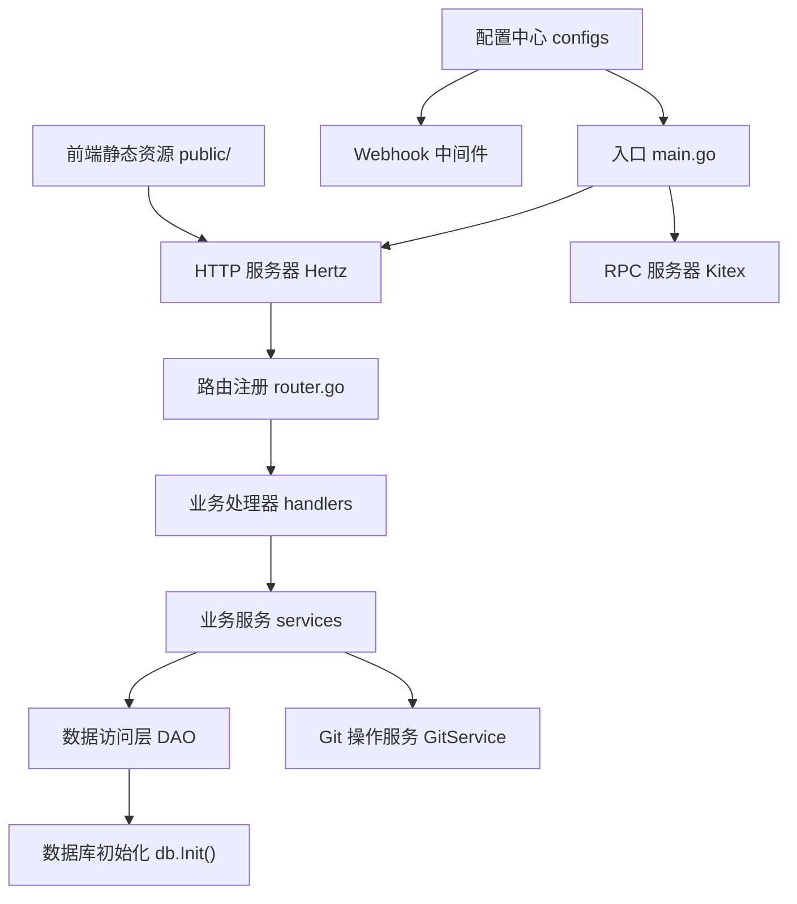
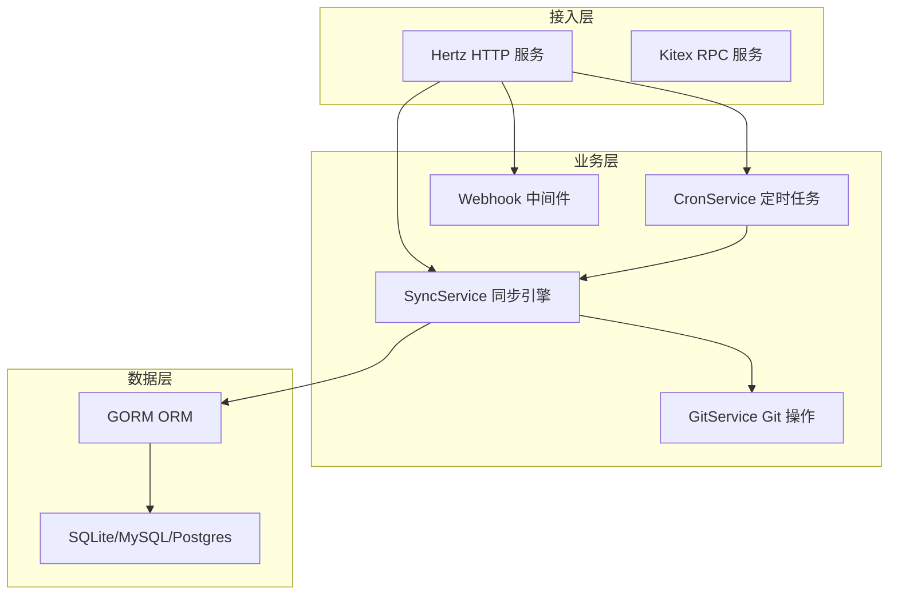
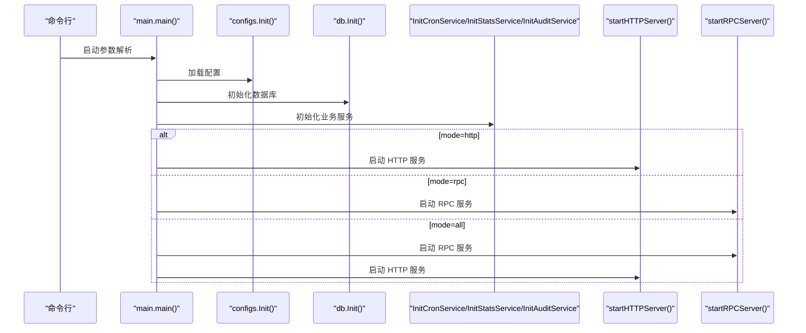
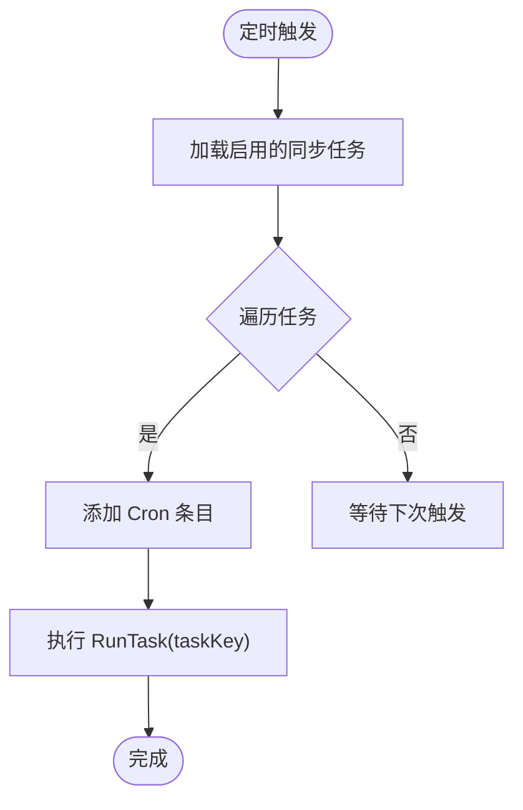
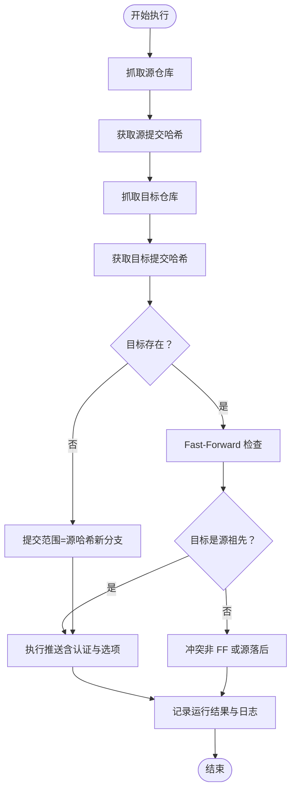
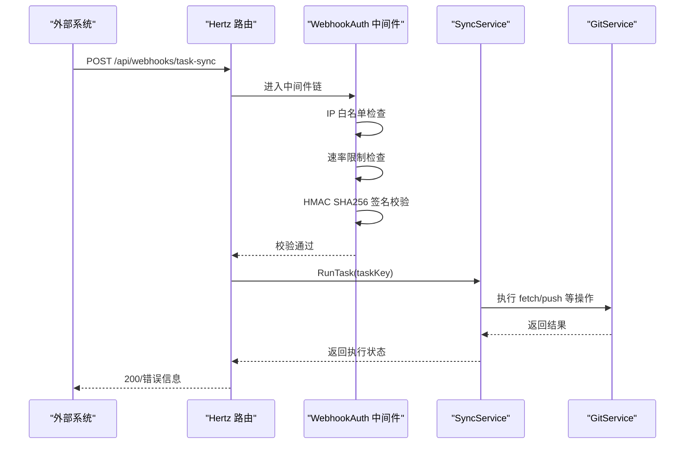
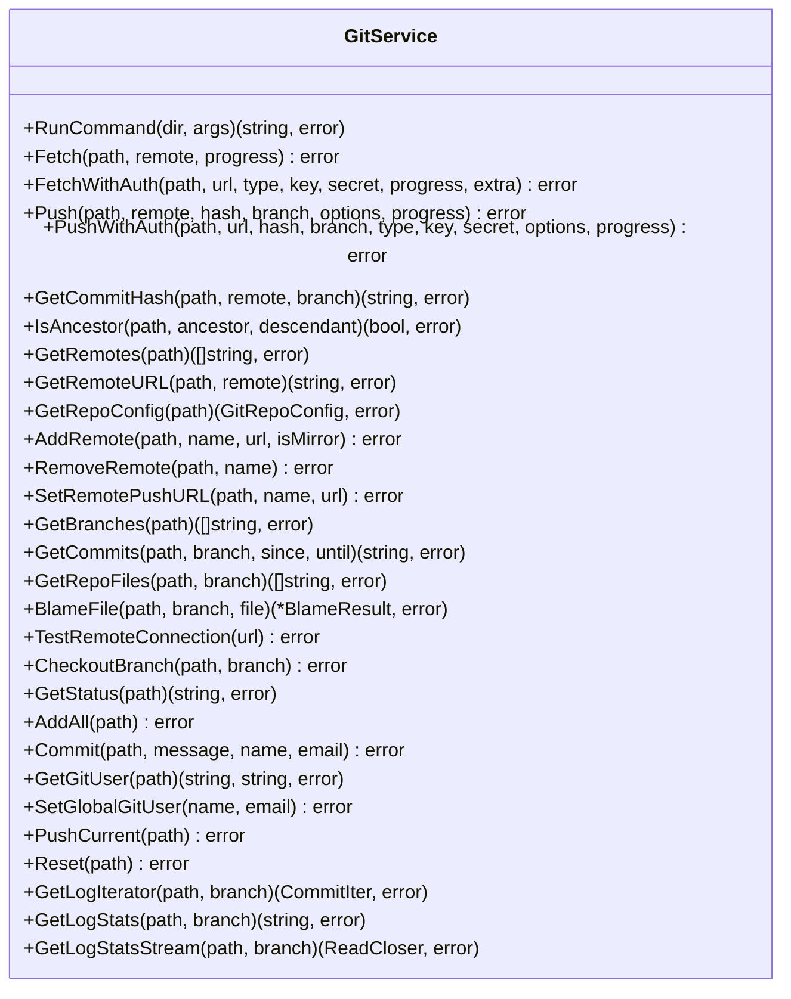
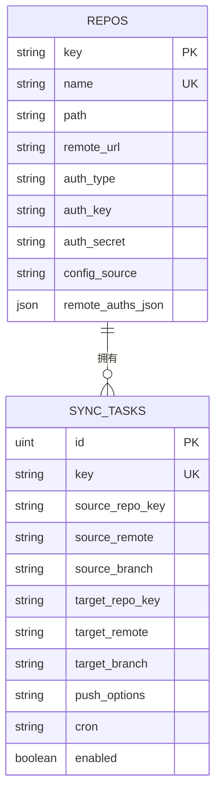
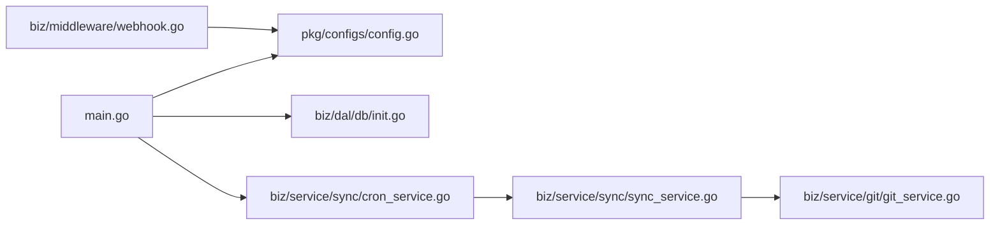

# 项目概述

<cite>
**本文引用的文件**
- [README.md](file://README.md)
- [main.go](file://main.go)
- [router.go](file://router.go)
- [conf/config.yaml](file://conf/config.yaml)
- [pkg/configs/config.go](file://pkg/configs/config.go)
- [biz/service/sync/cron_service.go](file://biz/service/sync/cron_service.go)
- [biz/service/sync/sync_service.go](file://biz/service/sync/sync_service.go)
- [biz/middleware/webhook.go](file://biz/middleware/webhook.go)
- [biz/service/git/git_service.go](file://biz/service/git/git_service.go)
- [biz/model/domain/git.go](file://biz/model/domain/git.go)
- [biz/dal/db/init.go](file://biz/dal/db/init.go)
- [biz/model/po/repo.go](file://biz/model/po/repo.go)
- [biz/model/po/sync_task.go](file://biz/model/po/sync_task.go)
- [deploy/README.md](file://deploy/README.md)
- [docs/product_manual.md](file://docs/product_manual.md)
</cite>

## 目录
1. [引言](#引言)
2. [项目结构](#项目结构)
3. [核心组件](#核心组件)
4. [架构总览](#架构总览)
5. [详细组件分析](#详细组件分析)
6. [依赖关系分析](#依赖关系分析)
7. [性能考虑](#性能考虑)
8. [故障排查指南](#故障排查指南)
9. [结论](#结论)
10. [附录](#附录)

## 引言
本项目是一个轻量级的多仓库、多分支自动化同步管理系统，旨在帮助团队在多个 Git 仓库与分支之间建立可靠的自动化同步机制。系统提供可视化的 Web 界面、定时任务调度、Webhook 触发、冲突检测与 Fast-Forward 保护、以及详尽的同步日志记录，满足从个人开发者到企业级 DevOps 团队的多样化需求。

- 项目定位：多仓库、多分支自动化同步管理平台
- 关键能力：定时同步、Webhook 触发、冲突检测、Fast-Forward 保护、可视化界面
- 技术选型：Go + Hertz + GORM + SQLite/MySQL/Postgres + 原生命令行 Git

**章节来源**
- [README.md](file://README.md#L1-L44)

## 项目结构
项目采用分层与按业务域组织的结构，核心模块包括：
- 入口与启动：main.go、router.go
- 配置中心：pkg/configs、conf/config.yaml
- 业务域：biz 下的 handler、service、model、dal、router、middleware
- 数据持久化：biz/dal/db（GORM + SQLite/MySQL/Postgres）
- 前端静态资源：public/
- 部署与文档：deploy/、docs/

**图示来源**
- [main.go](file://main.go#L52-L176)
- [router.go](file://router.go#L10-L16)
- [pkg/configs/config.go](file://pkg/configs/config.go#L18-L42)
- [biz/middleware/webhook.go](file://biz/middleware/webhook.go#L18-L70)
- [biz/dal/db/init.go](file://biz/dal/db/init.go#L18-L72)

**章节来源**
- [main.go](file://main.go#L1-L176)
- [router.go](file://router.go#L1-L16)
- [conf/config.yaml](file://conf/config.yaml#L1-L25)
- [pkg/configs/config.go](file://pkg/configs/config.go#L1-L43)

## 核心组件
- 启动与服务编排：支持 HTTP、RPC、双模启动；优雅关闭；信号处理
- 配置中心：集中加载 config.yaml，兼容环境变量覆盖
- 定时任务：基于 cron 的任务调度器，动态加载/更新/移除任务
- 同步引擎：执行 fetch、哈希对比、Fast-Forward 检查、push（含认证与进度）
- Webhook：IP 白名单、速率限制、HMAC SHA256 签名校验
- 数据层：GORM 自动迁移，支持 SQLite/MySQL/Postgres
- Git 操作：封装 fetch/push/clone/分支/提交统计等常用操作

**章节来源**
- [main.go](file://main.go#L52-L176)
- [pkg/configs/config.go](file://pkg/configs/config.go#L18-L42)
- [biz/service/sync/cron_service.go](file://biz/service/sync/cron_service.go#L24-L101)
- [biz/service/sync/sync_service.go](file://biz/service/sync/sync_service.go#L19-L263)
- [biz/middleware/webhook.go](file://biz/middleware/webhook.go#L18-L70)
- [biz/dal/db/init.go](file://biz/dal/db/init.go#L18-L72)
- [biz/service/git/git_service.go](file://biz/service/git/git_service.go#L129-L800)

## 架构总览
系统采用“HTTP/RPC 双栈 + 业务服务 + 数据持久化 + Git 命令行”的组合架构。HTTP 提供 Web 界面与 API，RPC 提供内部服务调用能力；业务服务负责同步策略与执行；数据层抽象存储；Git 层通过 go-git 与原生命令行协同工作。

**图示来源**
- [main.go](file://main.go#L76-L86)
- [biz/service/sync/cron_service.go](file://biz/service/sync/cron_service.go#L24-L101)
- [biz/service/sync/sync_service.go](file://biz/service/sync/sync_service.go#L19-L263)
- [biz/service/git/git_service.go](file://biz/service/git/git_service.go#L129-L800)
- [biz/dal/db/init.go](file://biz/dal/db/init.go#L18-L72)

## 详细组件分析

### 启动与服务编排
- 支持三种启动模式：http、rpc、all
- 初始化配置、数据库、加密工具、业务服务
- 优雅关闭：超时控制、顺序停止 HTTP/RPC

**图示来源**
- [main.go](file://main.go#L52-L176)
- [pkg/configs/config.go](file://pkg/configs/config.go#L18-L42)
- [biz/dal/db/init.go](file://biz/dal/db/init.go#L18-L72)

**章节来源**
- [main.go](file://main.go#L52-L176)

### 配置中心
- 优先从 conf/config.yaml 加载，支持环境变量覆盖
- Webhook 相关配置：secret、rate_limit、ip_whitelist
- 数据库类型与连接参数：sqlite/mysql/postgres

**章节来源**
- [pkg/configs/config.go](file://pkg/configs/config.go#L18-L42)
- [conf/config.yaml](file://conf/config.yaml#L1-L25)

### 定时任务调度（CronService）
- 动态加载启用且带 Cron 表达式的任务
- 支持更新与移除任务条目
- 任务执行：调用 SyncService.RunTask

**图示来源**
- [biz/service/sync/cron_service.go](file://biz/service/sync/cron_service.go#L24-L101)

**章节来源**
- [biz/service/sync/cron_service.go](file://biz/service/sync/cron_service.go#L24-L101)

### 同步引擎（SyncService）
- 执行流程：记录运行、抓取源/目标、计算提交范围、Fast-Forward 检查、推送
- 冲突检测：非 Fast-Forward 或源落后目标视为冲突
- 日志记录：每步命令与输出写入运行记录
- 认证支持：源/目标仓库可独立配置认证

**图示来源**
- [biz/service/sync/sync_service.go](file://biz/service/sync/sync_service.go#L35-L249)
- [biz/service/git/git_service.go](file://biz/service/git/git_service.go#L138-L323)

**章节来源**
- [biz/service/sync/sync_service.go](file://biz/service/sync/sync_service.go#L27-L263)

### Webhook 集成
- 安全校验：IP 白名单、速率限制、HMAC SHA256 签名
- 触发方式：HTTP POST，携带任务标识
- 中间件链路：先白名单/限流，再签名校验，最后放行

**图示来源**
- [biz/middleware/webhook.go](file://biz/middleware/webhook.go#L18-L70)
- [biz/service/sync/sync_service.go](file://biz/service/sync/sync_service.go#L27-L74)
- [biz/service/git/git_service.go](file://biz/service/git/git_service.go#L138-L323)

**章节来源**
- [biz/middleware/webhook.go](file://biz/middleware/webhook.go#L18-L70)

### Git 操作服务（GitService）
- 支持 fetch/push/clone/checkout/status/commit/log/blame 等
- 认证：HTTP Basic、SSH 私钥、SSH Agent
- 进度回调：通过 io.Writer 输出进度
- 命令行兜底：对 go-git 不完全支持的操作使用原生命令行

**图示来源**
- [biz/service/git/git_service.go](file://biz/service/git/git_service.go#L29-L800)
- [biz/model/domain/git.go](file://biz/model/domain/git.go#L5-L40)

**章节来源**
- [biz/service/git/git_service.go](file://biz/service/git/git_service.go#L129-L800)
- [biz/model/domain/git.go](file://biz/model/domain/git.go#L1-L40)

### 数据模型与持久化
- Repo：仓库实体，支持主认证与远程独立认证映射
- SyncTask：同步任务，包含源/目标仓库、分支、Cron、Push 选项、启用状态
- 数据库初始化：按配置选择驱动，自动迁移表结构

**图示来源**
- [biz/model/po/repo.go](file://biz/model/po/repo.go#L11-L93)
- [biz/model/po/sync_task.go](file://biz/model/po/sync_task.go#L7-L29)
- [biz/dal/db/init.go](file://biz/dal/db/init.go#L54-L71)

**章节来源**
- [biz/model/po/repo.go](file://biz/model/po/repo.go#L11-L93)
- [biz/model/po/sync_task.go](file://biz/model/po/sync_task.go#L7-L29)
- [biz/dal/db/init.go](file://biz/dal/db/init.go#L18-L72)

## 依赖关系分析
- 启动阶段：main.go 依赖配置、数据库、业务服务初始化
- 业务阶段：SyncService 依赖 GitService、DAO 层；CronService 依赖 SyncService 与 DAO
- 接入阶段：Webhook 中间件依赖配置中的 Webhook 设置
- 存储阶段：GORM 适配 SQLite/MySQL/Postgres

**图示来源**
- [main.go](file://main.go#L116-L134)
- [pkg/configs/config.go](file://pkg/configs/config.go#L18-L42)
- [biz/dal/db/init.go](file://biz/dal/db/init.go#L18-L72)
- [biz/service/sync/cron_service.go](file://biz/service/sync/cron_service.go#L24-L101)
- [biz/service/sync/sync_service.go](file://biz/service/sync/sync_service.go#L19-L263)
- [biz/service/git/git_service.go](file://biz/service/git/git_service.go#L129-L800)
- [biz/middleware/webhook.go](file://biz/middleware/webhook.go#L18-L70)

**章节来源**
- [main.go](file://main.go#L116-L134)
- [pkg/configs/config.go](file://pkg/configs/config.go#L18-L42)
- [biz/dal/db/init.go](file://biz/dal/db/init.go#L18-L72)
- [biz/service/sync/cron_service.go](file://biz/service/sync/cron_service.go#L24-L101)
- [biz/service/sync/sync_service.go](file://biz/service/sync/sync_service.go#L19-L263)
- [biz/service/git/git_service.go](file://biz/service/git/git_service.go#L129-L800)
- [biz/middleware/webhook.go](file://biz/middleware/webhook.go#L18-L70)

## 性能考虑
- 并发与锁：CronService 使用互斥锁保护任务增删改
- IO 与进度：Git 操作通过 io.Writer 输出进度，避免阻塞
- 数据库：GORM 自动迁移仅在首次部署时执行，后续读写性能稳定
- 网络与认证：优先使用 SSH Agent 与已知密钥路径，减少交互与失败重试
- 调度粒度：合理设置 Cron 表达式，避免过于频繁的同步造成资源争用

[本节为通用指导，不直接分析具体文件]

## 故障排查指南
- Webhook 401/403：检查签名算法、密钥、请求体是否被篡改
- Webhook 429：确认速率限制阈值与并发请求
- 同步失败：查看同步历史与日志，关注冲突、权限、网络与认证问题
- 数据库连接失败：核对数据库类型、DSN、凭据与网络连通性
- SSH 密钥挂载：Kubernetes 场景建议使用 Secret 挂载而非 hostPath

**章节来源**
- [biz/middleware/webhook.go](file://biz/middleware/webhook.go#L18-L70)
- [biz/service/sync/sync_service.go](file://biz/service/sync/sync_service.go#L35-L74)
- [biz/dal/db/init.go](file://biz/dal/db/init.go#L18-L72)
- [deploy/README.md](file://deploy/README.md#L85-L108)

## 结论
本项目以“轻量、可靠、可观测”为核心设计目标，通过清晰的分层架构与完善的同步策略，实现了多仓库、多分支的自动化同步管理。结合定时任务与 Webhook，既能满足周期性同步，也能对接 CI/CD 等外部系统。配合详尽的日志与冲突检测，能够有效降低多仓同步的风险与维护成本。

[本节为总结性内容，不直接分析具体文件]

## 附录

### 快速开始
- 编译与运行：进入项目根目录，执行依赖安装与构建后启动
- 访问界面：浏览器打开 http://localhost:8080
- 默认端口：HTTP 8080，RPC 8888（可在配置中调整）

**章节来源**
- [README.md](file://README.md#L19-L30)
- [docs/product_manual.md](file://docs/product_manual.md#L37-L48)

### 系统要求
- Go 运行时：建议使用项目构建脚本生成的二进制
- 数据库：SQLite（默认）、MySQL、Postgres（任选其一）
- 网络：若使用 SSH，确保可访问私钥或 SSH Agent
- 权限：对目标仓库具备相应读写权限

**章节来源**
- [conf/config.yaml](file://conf/config.yaml#L7-L25)
- [biz/dal/db/init.go](file://biz/dal/db/init.go#L24-L47)

### 基本使用示例
- 注册仓库：在 Web 界面中填写仓库名称与本地路径
- 新建同步任务：配置源/目标仓库与分支、Cron 表达式、Push 选项
- 手动执行：在任务列表中触发同步
- 查看历史：在“同步历史”中查看状态与日志

**章节来源**
- [docs/product_manual.md](file://docs/product_manual.md#L51-L80)